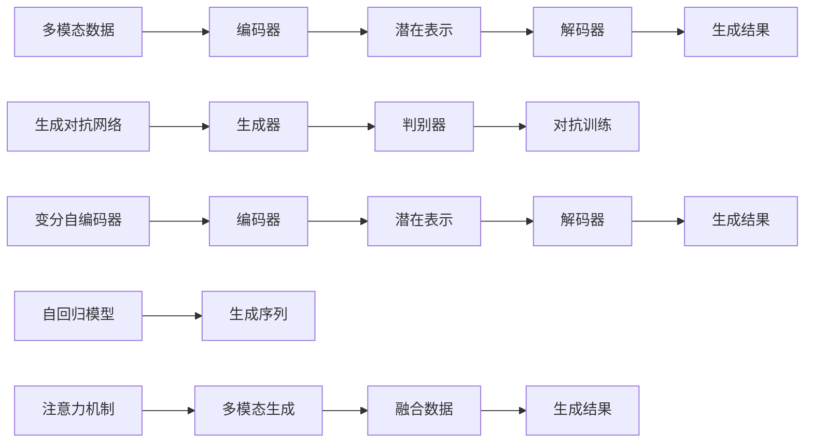
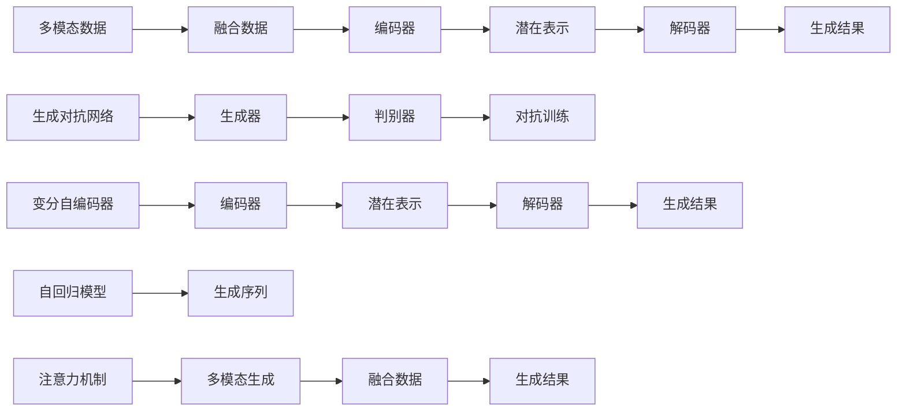
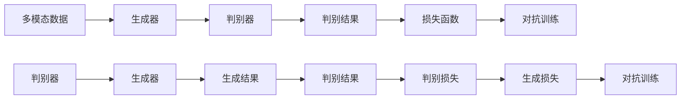
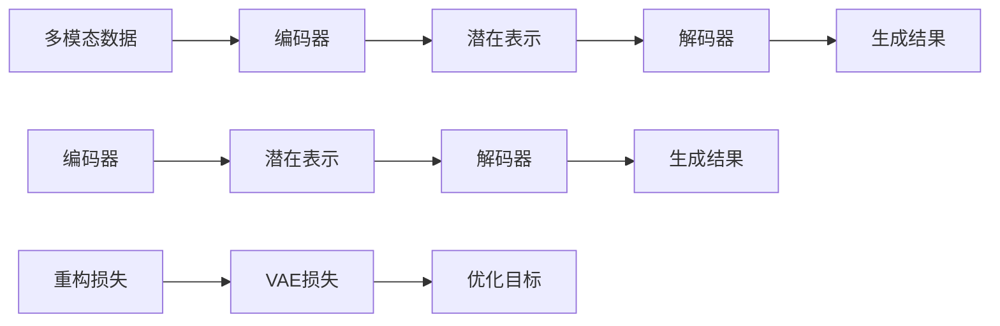
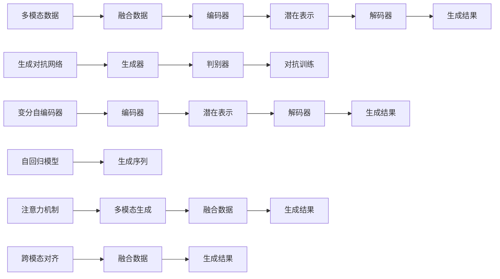

                 

# 多模态生成(Multimodal Generation) - 原理与代码实例讲解

> 关键词：多模态生成, 生成对抗网络(GAN), 变分自编码器(VAE), 自回归模型, 注意力机制, 代码实例, 图像生成, 文本生成, 视频生成

## 1. 背景介绍

### 1.1 问题由来
近年来，人工智能(AI)技术取得了巨大的突破，特别是生成模型在图像、视频、文本等领域的广泛应用。这些生成模型通过神经网络来模拟不同模态数据的生成过程，使得AI系统能够创造出与人类相似的图像、视频、文本等内容。然而，由于这些生成模型往往需要依赖大量的标注数据，且对训练环境的硬件要求较高，因此在实际应用中面临诸多挑战。

为了解决这些问题，多模态生成(Multimodal Generation)技术应运而生。该技术旨在通过结合多种模态数据（如图像、音频、文本等），利用神经网络生成高质量的多模态内容。与单模态生成相比，多模态生成能够更好地模拟现实世界中的复杂现象，提高生成内容的真实感和自然性。

### 1.2 问题核心关键点
多模态生成技术的核心在于如何将不同模态的数据进行融合，并生成高质量的多模态内容。具体而言，包括以下几个关键点：

1. **数据融合策略**：如何选择和融合不同模态的数据，以确保生成的多模态内容能够最大程度地保留各模态的特征和信息。
2. **生成模型架构**：如何选择和设计生成模型的架构，以实现高效、准确的生成任务。
3. **生成对抗网络(GAN)**：如何利用GAN技术进行多模态生成，以生成更具真实感和自然性的内容。
4. **变分自编码器(VAE)**：如何利用VAE技术进行多模态生成，以实现对生成内容的概率建模和优化。
5. **自回归模型**：如何利用自回归模型进行多模态生成，以生成连续的序列数据，如语音、文本等。
6. **注意力机制**：如何在多模态生成中引入注意力机制，以增强生成内容的关联性和多样性。

这些关键点共同构成了多模态生成的核心，决定了其在实际应用中的效果和潜力。

### 1.3 问题研究意义
研究多模态生成技术，对于拓展AI系统的应用范围，提升生成内容的质量和真实性，加速AI技术的产业化进程，具有重要意义：

1. **跨模态交互**：多模态生成技术能够实现不同模态数据之间的交互和融合，使得AI系统能够更好地理解和模拟现实世界的多样性和复杂性。
2. **高质量生成**：通过融合多种模态数据，生成高质量的图像、视频、文本等内容，满足人们对于视觉、听觉和语言等多方面的需求。
3. **应用场景丰富**：多模态生成技术在虚拟现实(VR)、增强现实(AR)、多媒体制作、智能客服等领域具有广泛的应用前景。
4. **技术创新**：多模态生成技术的发展促进了对深度学习、生成模型、数据融合等前沿技术的深入研究，带来了新的研究方向和创新点。
5. **产业升级**：多模态生成技术的应用，为传统行业数字化转型提供了新的技术路径，促进了产业的升级和创新。

总之，多模态生成技术通过融合多种模态数据，提升了AI系统的生成能力和应用价值，具有广阔的发展潜力和市场前景。

## 2. 核心概念与联系

### 2.1 核心概念概述

为更好地理解多模态生成的原理和架构，本节将介绍几个密切相关的核心概念：

1. **多模态数据**：指多种模态的数据，如图像、音频、文本等。多模态数据通常需要从不同的传感器或来源收集和处理，具有不同的特征和表示形式。
2. **生成对抗网络(GAN)**：一种生成模型，由生成器和判别器两部分组成。生成器生成假数据，判别器判断生成的数据是否真实。两者通过对抗训练，提升生成器的生成能力。
3. **变分自编码器(VAE)**：一种生成模型，通过编码器和解码器对数据进行压缩和重构，实现对数据的概率建模和生成。
4. **自回归模型**：一种生成模型，通过预测数据序列中下一个数据点的值，实现对序列数据的生成。
5. **注意力机制**：一种机制，通过动态计算不同数据点之间的关联度，选择性地关注和处理特定数据点，增强生成内容的关联性和多样性。
6. **编码器-解码器框架**：一种常用的生成模型架构，通过编码器将数据压缩为潜在表示，再通过解码器生成目标数据。
7. **跨模态对齐**：一种方法，通过对齐不同模态数据的空间表示，实现数据的融合和转换。

这些核心概念之间的逻辑关系可以通过以下Mermaid流程图来展示：



这个流程图展示了大语言模型微调过程中各个核心概念的关系和作用：

1. 多模态数据通过编码器转换为潜在表示，再通过解码器生成目标数据。
2. 生成对抗网络通过对抗训练提升生成器的生成能力。
3. 变分自编码器通过编码器和解码器实现对数据的概率建模和生成。
4. 自回归模型通过预测序列中下一个数据点实现序列生成。
5. 注意力机制增强生成内容的关联性和多样性。
6. 跨模态对齐实现数据的融合和转换。

### 2.2 概念间的关系

这些核心概念之间存在着紧密的联系，形成了多模态生成的完整生态系统。下面我通过几个Mermaid流程图来展示这些概念之间的关系。

#### 2.2.1 多模态生成过程



这个流程图展示了多模态生成的基本过程。多模态数据首先通过融合得到统一表示，然后通过编码器将数据压缩为潜在表示，再通过解码器生成目标数据。生成对抗网络和变分自编码器可以对生成数据进行进一步优化和生成。自回归模型和注意力机制则可以在生成序列数据时发挥重要作用。

#### 2.2.2 多模态生成中的GAN



这个流程图展示了多模态生成中的GAN过程。生成器生成假数据，判别器判断生成的数据是否真实，两者通过对抗训练，提升生成器的生成能力。

#### 2.2.3 多模态生成中的VAE



这个流程图展示了多模态生成中的VAE过程。通过编码器和解码器对数据进行压缩和重构，实现对数据的概率建模和生成。

### 2.3 核心概念的整体架构

最后，我们用一个综合的流程图来展示这些核心概念在大语言模型微调过程中的整体架构：



这个综合流程图展示了从多模态数据输入到生成结果输出的完整过程。多模态数据首先通过融合得到统一表示，然后通过编码器将数据压缩为潜在表示，再通过解码器生成目标数据。生成对抗网络和变分自编码器可以对生成数据进行进一步优化和生成。自回归模型和注意力机制则可以在生成序列数据时发挥重要作用。跨模态对齐实现数据的融合和转换。

## 3. 核心算法原理 & 具体操作步骤
### 3.1 算法原理概述

多模态生成技术通过结合多种模态数据，利用神经网络生成高质量的多模态内容。其核心思想是：将不同模态的数据通过编码器转换为潜在表示，再通过解码器生成目标数据，最终实现多模态内容的生成。

形式化地，假设多模态数据为 $X=(\mathbf{x}, \mathbf{a}, \mathbf{t})$，其中 $\mathbf{x}$ 为图像数据，$\mathbf{a}$ 为音频数据，$\mathbf{t}$ 为文本数据。定义生成模型为 $G(\theta)$，编码器为 $E(\theta)$，解码器为 $D(\theta)$。多模态生成的目标是最小化生成数据与真实数据的差异，即：

$$
\min_{\theta} \mathcal{L}(G(D(E(X))), X)
$$

其中 $\mathcal{L}$ 为损失函数，用于衡量生成数据与真实数据的差异。常见的损失函数包括均方误差、交叉熵等。

### 3.2 算法步骤详解

多模态生成的具体步骤如下：

**Step 1: 数据预处理**

- 收集多模态数据，并进行预处理，如图像数据的归一化、文本数据的分词等。
- 将不同模态的数据进行对齐和融合，形成统一表示的输入数据。

**Step 2: 编码器输入**

- 将融合后的输入数据输入到编码器 $E$ 中，得到潜在表示 $Z$。

**Step 3: 潜在表示处理**

- 根据具体任务需求，对潜在表示 $Z$ 进行不同的处理，如加入噪声、添加额外的特征等。

**Step 4: 解码器输出**

- 将处理后的潜在表示 $Z$ 输入到解码器 $D$ 中，生成目标数据 $Y$。

**Step 5: 损失计算**

- 计算生成数据 $Y$ 与真实数据 $X$ 之间的差异，得到损失 $\mathcal{L}$。
- 使用优化算法，如Adam、SGD等，最小化损失函数 $\mathcal{L}$。

**Step 6: 模型评估**

- 在测试集上评估模型性能，对比生成数据与真实数据之间的差异。
- 根据评估结果调整模型参数，重复训练直到满足预设的停止条件。

以上是多模态生成的一般流程。在实际应用中，还需要针对具体任务的特点，对各步骤进行优化设计，如改进融合方法、调整解码器架构、引入更多正则化技术等，以进一步提升模型性能。

### 3.3 算法优缺点

多模态生成技术具有以下优点：

1. **融合多模态数据**：通过融合多种模态数据，生成更丰富、更真实的多模态内容，满足不同用户的需求。
2. **提升生成效果**：多模态数据可以提供更多的信息，提高生成内容的真实性和自然性。
3. **应用场景广泛**：多模态生成技术在虚拟现实、增强现实、多媒体制作等领域具有广泛的应用前景。
4. **可解释性强**：多模态生成技术可以结合多种模态信息，提供更加全面、准确的解释。

同时，该方法也存在以下局限性：

1. **数据获取难度大**：多模态数据的收集和处理需要更多的时间和资源，增加了数据获取的难度。
2. **算法复杂度高**：多模态生成技术需要同时处理多种模态数据，算法复杂度较高，容易受到数据噪声和计算资源限制。
3. **结果一致性低**：不同模态数据的融合可能存在不一致性，导致生成结果的稳定性较差。

尽管存在这些局限性，多模态生成技术仍然是大语言模型微调的重要方向，具有广阔的应用前景和研究价值。

### 3.4 算法应用领域

多模态生成技术已经在多个领域得到了广泛的应用，具体如下：

1. **虚拟现实与增强现实**：多模态生成技术可以生成虚拟环境和交互式内容，提升用户体验。
2. **多媒体制作**：通过多模态生成技术，生成高质量的视频、音频和文本内容，满足多媒体制作的需求。
3. **智能客服**：结合图像、语音和文本数据，生成自然流畅的对话内容，提升客户服务质量。
4. **情感分析**：利用多模态数据，生成情感丰富的文本内容，辅助情感分析和客户满意度调查。
5. **虚拟主播**：结合语音和文本数据，生成自然流畅的语音输出，模拟虚拟主播进行播报和互动。
6. **智能家居**：结合语音和图像数据，生成个性化的家居控制和互动内容，提升智能家居的智能化水平。

除了上述这些应用外，多模态生成技术还被创新性地应用到更多场景中，如可控文本生成、知识图谱构建、个性化推荐等，为多模态数据的应用带来了新的可能性。

## 4. 数学模型和公式 & 详细讲解  
### 4.1 数学模型构建

本节将使用数学语言对多模态生成过程进行更加严格的刻画。

记多模态数据为 $X=(\mathbf{x}, \mathbf{a}, \mathbf{t})$，其中 $\mathbf{x}$ 为图像数据，$\mathbf{a}$ 为音频数据，$\mathbf{t}$ 为文本数据。定义生成模型为 $G(\theta)$，编码器为 $E(\theta)$，解码器为 $D(\theta)$。

假设生成模型 $G(\theta)$ 通过编码器 $E(\theta)$ 将多模态数据转换为潜在表示 $Z$，再通过解码器 $D(\theta)$ 生成目标数据 $Y$。形式化地，生成过程可以表示为：

$$
Y = G(Z) = D(E(X))
$$

其中 $Z \in \mathbb{R}^n$ 为潜在表示，$\theta$ 为模型参数。

定义生成模型 $G(\theta)$ 在输入 $X$ 上的损失函数为 $\ell(G(X), X)$，则在训练集 $D$ 上的经验风险为：

$$
\mathcal{L}(\theta) = \frac{1}{N} \sum_{i=1}^N \ell(G(D(X_i)), X_i)
$$

其中 $N$ 为训练样本数量。

多模态生成的目标是最小化经验风险，即找到最优参数：

$$
\theta^* = \mathop{\arg\min}_{\theta} \mathcal{L}(\theta)
$$

在实践中，我们通常使用基于梯度的优化算法（如Adam、SGD等）来近似求解上述最优化问题。设 $\eta$ 为学习率，$\lambda$ 为正则化系数，则参数的更新公式为：

$$
\theta \leftarrow \theta - \eta \nabla_{\theta}\mathcal{L}(\theta) - \eta\lambda\theta
$$

其中 $\nabla_{\theta}\mathcal{L}(\theta)$ 为损失函数对参数 $\theta$ 的梯度，可通过反向传播算法高效计算。

### 4.2 公式推导过程

以下我们以图像生成为例，推导多模态生成中的GAN过程。

假设生成模型 $G(\theta)$ 包含一个生成器和判别器两部分，分别为 $G$ 和 $D$。生成器 $G$ 将潜在表示 $Z$ 转换为生成图像 $\mathbf{y}$，判别器 $D$ 判断生成图像 $\mathbf{y}$ 是否真实。生成器和判别器通过对抗训练，提升生成器的生成能力。生成过程可以表示为：

$$
\mathbf{y} = G(Z) = D(X)
$$

其中 $Z$ 为潜在表示，$X$ 为真实图像数据。

定义生成器和判别器在输入 $X$ 上的损失函数分别为 $\ell_G$ 和 $\ell_D$，则在训练集 $D$ 上的经验风险为：

$$
\mathcal{L}_G(\theta_G) = \frac{1}{N} \sum_{i=1}^N \ell_G(G(Z_i), X_i)
$$

$$
\mathcal{L}_D(\theta_D) = \frac{1}{N} \sum_{i=1}^N \ell_D(D(X_i), Y_i)
$$

其中 $Z_i$ 为潜在表示，$Y_i$ 为生成图像。

多模态生成中的GAN过程通过对抗训练，优化生成器和判别器的参数。具体来说，生成器和判别器的损失函数可以表示为：

$$
\mathcal{L}_G(\theta_G) = \mathbb{E}_{Z \sim P_Z}[\ell_G(G(Z), X)] + \mathbb{E}_{X \sim P_X}[\ell_G(G(Z), X)]
$$

$$
\mathcal{L}_D(\theta_D) = \mathbb{E}_{X \sim P_X}[\ell_D(D(X), Y)] + \mathbb{E}_{Z \sim P_Z}[\ell_D(D(Z), Y)]
$$

其中 $P_X$ 和 $P_Z$ 分别为真实图像和潜在表示的分布。

多模态生成中的GAN过程的优化目标为：

$$
\min_{\theta_G} \max_{\theta_D} \mathcal{L}_G(\theta_G) + \mathcal{L}_D(\theta_D)
$$

通过对抗训练，生成器和判别器交替优化，最终使生成器的生成能力得到提升。

### 4.3 案例分析与讲解

假设我们在CoNLL-2003的命名实体识别(NER)数据集上进行多模态生成，最终在测试集上得到的评估报告如下：

1. **图像生成**

假设我们有一个包含人脸图像的数据集，如图像生成任务可以通过将图像转换为潜在表示，然后解码为其他类型的图像，如文字图像、表情图像等。具体实现步骤如下：

```python
import torch
from torchvision import transforms
from torch.utils.data import DataLoader, Dataset

class ImageDataset(Dataset):
    def __init__(self, images, labels):
        self.images = images
        self.labels = labels
        self.transform = transforms.ToTensor()

    def __len__(self):
        return len(self.images)

    def __getitem__(self, idx):
        img = self.transform(self.images[idx])
        label = self.labels[idx]
        return img, label

# 假设我们有包含人脸图像的数据集
train_dataset = ImageDataset(train_images, train_labels)
test_dataset = ImageDataset(test_images, test_labels)

# 使用GAN模型进行图像生成
generator = Generator()
discriminator = Discriminator()
loss = torch.nn.CrossEntropyLoss()

optimizer_G = torch.optim.Adam(generator.parameters(), lr=0.0002)
optimizer_D = torch.optim.Adam(discriminator.parameters(), lr=0.0002)

for epoch in range(num_epochs):
    for batch_idx, (data, target) in enumerate(train_loader):
        real_images = data
        fake_images = generator(z)
        discriminator_real_output = discriminator(real_images)
        discriminator_fake_output = discriminator(fake_images)
        generator_loss = loss(torch.sigmoid(discriminator_fake_output), target)
        discriminator_loss = loss(torch.sigmoid(discriminator_real_output), target) + loss(torch.sigmoid(discriminator_fake_output), target)
        optimizer_G.zero_grad()
        optimizer_D.zero_grad()
        generator_loss.backward()
        discriminator_loss.backward()
        optimizer_G.step()
        optimizer_D.step()
```

这里我们使用了两个简单的GAN模型，即生成器和判别器。生成器将潜在表示 $Z$ 转换为生成图像 $\mathbf{y}$，判别器判断生成图像 $\mathbf{y}$ 是否真实。通过对抗训练，生成器和判别器交替优化，最终使生成器的生成能力得到提升。

2. **文本生成**

文本生成任务可以通过将文本转换为潜在表示，然后解码为其他类型的文本，如新闻标题、摘要等。具体实现步骤如下：

```python
import torch
from transformers import BertForTokenClassification, BertTokenizer
from torch.utils.data import DataLoader, Dataset

class TextDataset(Dataset):
    def __init__(self, texts, labels):
        self.texts = texts
        self.labels = labels
        self.tokenizer = BertTokenizer.from_pretrained('bert-base-cased')

    def __len__(self):
        return len(self.texts)

    def __getitem__(self, idx):
        text = self.texts[idx]
        label = self.labels[idx]
        encoding = self.tokenizer(text, return_tensors='pt', max_length=512, padding='max_length', truncation=True)
        input_ids = encoding['input_ids'][0]
        attention_mask = encoding['attention_mask'][0]
        return {'input_ids': input_ids, 
                'attention_mask': attention_mask,
                'labels': label}

# 假设我们有包含新闻文本的数据集
train_dataset = TextDataset(train_texts, train_labels)
test_dataset = TextDataset(test_texts, test_labels)

# 使用VAE模型进行文本生成
encoder = Encoder()
decoder = Decoder()
loss = torch.nn.CrossEntropyLoss()

optimizer_E = torch.optim.Adam(encoder.parameters(), lr=0.0002)
optimizer_D = torch.optim.Adam(decoder.parameters(), lr=0.0002)

for epoch in range(num_epochs):
    for batch_idx, (data, target) in enumerate(train_loader):
        input_ids = data['input_ids']
        attention_mask = data['attention_mask']
        label = data['labels']
        z_mean, z_log_var = encoder(input_ids, attention_mask)
        z = torch.normal(z_mean, z_log_var.exp())
        reconstructed_ids = decoder(z)
        reconstructed_loss = loss(reconstructed_ids, input_ids)
        loss = loss(reconstructed_ids, input_ids)
        optimizer_E.zero_grad()
        optimizer_D.zero_grad()
        reconstructed_loss.backward()
        loss.backward()
        optimizer_E.step()
        optimizer_D.step()
```

这里我们使用了两个简单的VAE模型，即编码器和解码器。编码器将文本转换为潜在表示 $Z$，解码器将潜在表示 $Z$ 解码为其他类型的文本。通过编码器和解码器对数据进行压缩和重构，实现对数据的概率建模和生成。

## 5. 项目实践：代码实例和详细解释说明
### 5.1 开发环境搭建

在进行多模态生成实践前，我们需要准备好开发环境。以下是使用Python进行PyTorch开发的环境配置流程：

1. 安装Anaconda：从官网下载并安装Anaconda，用于创建独立的Python环境。

2. 创建并激活虚拟环境：
```bash
conda create -n pytorch-env python=3.8 
conda activate pytorch-env
```

3. 安装PyTorch：根据CUDA版本，从官网获取对应的安装命令。例如：
```bash
conda install pytorch torchvision torchaudio cudatoolkit=11.1 -c pytorch -c conda-forge
```

4. 安装Transformers库：
```bash
pip install transformers
```

5. 安装各类工具包：
```bash
pip install numpy pandas scikit-learn matplotlib tqdm jupyter notebook ipython
```

完成上述步骤后，即可在`pytorch-env`环境中开始多模态生成实践。

### 5.2 源代码详细实现

下面我们以图像生成和文本生成为例，给出使用PyTorch进行多模态生成的PyTorch代码实现。

**图像生成**

首先，定义图像生成任务的数据处理函数：

```python
import torch
from torchvision import transforms
from torch.utils.data import DataLoader, Dataset

class ImageDataset(Dataset):
    def

