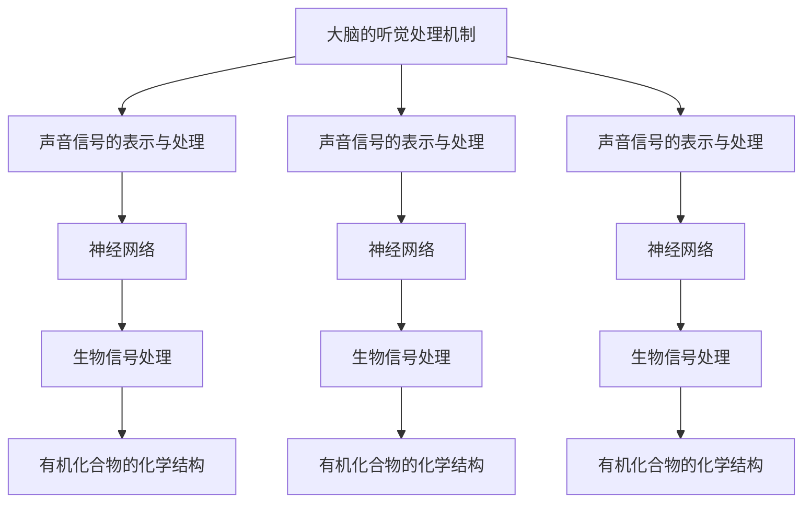
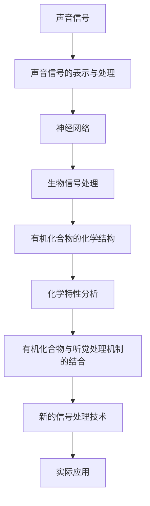

                 

# 大脑的听觉与有机化合物

> 关键词：大脑,听觉,有机化合物,化学结构,神经网络,生物信号处理

## 1. 背景介绍

### 1.1 问题由来
人类的大脑是一个极其复杂的器官，它不仅能够处理视觉、触觉等信息，还能理解和处理语言。近年来，随着神经科学和人工智能技术的发展，科学家们开始探索将大脑信号转化为数字信号，进而通过计算机模拟人类感知和认知的过程。

然而，尽管深度学习等技术在视觉和自然语言处理等领域取得了显著成果，但在听觉信号的处理上，仍然存在许多挑战。大脑对声音的识别和理解，涉及多层次、多通道的神经信号处理，远比视觉和文本信号处理复杂。

有机化合物是构成生物体的基本单位，其化学结构和特性对生命活动至关重要。研究大脑的听觉处理机制，并将其与有机化合物相关的特性结合起来，可以更深入地理解生命现象，并为生物医学、制药等领域提供新的思路和应用方向。

### 1.2 问题核心关键点
本研究的核心问题是如何将大脑的听觉处理机制与有机化合物的特性结合起来，从而开发出新的信号处理技术。这涉及到以下几个关键点：
1. 理解大脑听觉信号处理的生物学机制。
2. 分析有机化合物的化学结构和特性，并找到与听觉处理机制相关的化学特性。
3. 结合以上两个方面的知识，开发出新的信号处理算法和技术。
4. 验证新算法在实际应用中的效果，例如在生物医学、制药等领域的应用。

### 1.3 问题研究意义
研究大脑的听觉处理机制与有机化合物特性的结合，具有重要意义：
1. 可以深入理解大脑的感知和认知过程，揭示听觉信号处理的基本原理。
2. 开发新的信号处理算法，提升听觉信号处理的精度和效率。
3. 在生物医学、制药等领域，利用有机化合物的特性，开发新的诊断和治疗方案。
4. 为人工智能与生物医学的交叉融合提供新的思路和方法。

## 2. 核心概念与联系

### 2.1 核心概念概述

为更好地理解大脑的听觉处理机制与有机化合物特性的结合，本节将介绍几个密切相关的核心概念：

- **大脑的听觉处理机制**：听觉信号的输入和处理，涉及多层次的神经信号传递和处理。通过听觉皮层（Auditory Cortex）和相关脑区的协同工作，大脑能够识别和理解各种声音。
- **有机化合物的化学结构**：有机化合物由碳原子和其他原子（如氢、氧、氮等）组成，其化学结构对物理和生物特性具有重要影响。
- **神经网络**：一种模拟人脑神经元结构和功能的网络结构，通过学习算法进行信号处理和模式识别。
- **生物信号处理**：将生物信号（如声音、视觉、触觉等）转化为数字信号，以便计算机进行处理和分析。
- **声音信号的表示与处理**：将声音信号（如音频信号）转化为频谱、时频等形式，并利用算法进行特征提取、分类、降噪等处理。

这些核心概念之间的逻辑关系可以通过以下Mermaid流程图来展示：



这个流程图展示了大脑的听觉处理机制与有机化合物特性的逻辑关系：

1. 听觉信号首先被转化为数字信号，并通过神经网络进行处理。
2. 在神经网络中，通过学习算法对声音信号进行特征提取和分类。
3. 经过处理的声音信号，再通过生物信号处理技术进行进一步分析。
4. 有机化合物的化学结构特性，可以通过生物信号处理技术进行分析，并与听觉处理机制结合。

### 2.2 概念间的关系

这些核心概念之间存在着紧密的联系，形成了大脑听觉处理机制与有机化合物特性结合的完整生态系统。下面我们通过几个Mermaid流程图来展示这些概念之间的关系。

#### 2.2.1 听觉信号的输入与处理


这个流程图展示了声音信号的输入和处理过程：
1. 声音信号首先通过声音信号的表示与处理技术，转化为数字信号。
2. 数字信号经过神经网络进行处理，提取声音的特征。
3. 处理后的声音信号，通过生物信号处理技术进一步分析，最终形成听觉感知。

#### 2.2.2 有机化合物的特性分析


这个流程图展示了有机化合物的特性分析过程：
1. 有机化合物首先通过化学结构分析，确定其特性。
2. 特性分析的结果，通过生物信号处理技术进行进一步分析。
3. 分析后的有机化合物特性，与听觉处理机制结合，形成新的信号处理技术。

#### 2.2.3 结合听觉处理机制与有机化合物特性


这个流程图展示了结合听觉处理机制与有机化合物特性的过程：
1. 听觉处理机制通过神经网络进行处理，提取声音特征。
2. 处理后的声音特征，通过生物信号处理技术进行进一步分析。
3. 分析后的声音特征，结合有机化合物的特性，形成新的信号处理技术。
4. 新的信号处理技术可以用于生物医学、制药等领域，提升相关应用的效果。

### 2.3 核心概念的整体架构

最后，我们用一个综合的流程图来展示这些核心概念在大脑听觉处理机制与有机化合物特性结合中的整体架构：



这个综合流程图展示了从声音信号的输入和处理，到有机化合物特性的分析，再到新的信号处理技术的开发和应用的全过程。通过这些流程图，我们可以更清晰地理解大脑听觉处理机制与有机化合物特性结合过程中各个环节的逻辑关系和作用。

## 3. 核心算法原理 & 具体操作步骤
### 3.1 算法原理概述

将大脑的听觉处理机制与有机化合物特性结合的算法，主要涉及以下三个方面的原理：

1. **声音信号的表示与处理**：将声音信号转化为数字信号，并通过算法进行特征提取、分类、降噪等处理。
2. **有机化合物的特性分析**：分析有机化合物的化学结构和特性，找出与听觉处理机制相关的化学特性。
3. **结合听觉处理机制与有机化合物特性**：结合声音信号处理和有机化合物特性分析的结果，开发新的信号处理算法。

### 3.2 算法步骤详解

**Step 1: 收集声音信号和有机化合物数据**
- 收集大规模的声音信号数据，如音频文件、音乐、语音等。
- 收集有机化合物的化学结构和特性数据，包括分子式、分子结构、物理和生物特性等。

**Step 2: 声音信号的表示与处理**
- 使用傅里叶变换、短时傅里叶变换（STFT）等算法，将声音信号转化为频谱、时频等形式。
- 使用卷积神经网络（CNN）等模型，对声音信号进行特征提取和分类。
- 使用降噪技术，如小波去噪、深度去噪等，对噪声进行过滤。

**Step 3: 有机化合物的特性分析**
- 分析有机化合物的化学结构，包括分子式、分子结构等。
- 分析有机化合物的物理和生物特性，如熔点、沸点、毒性等。
- 使用机器学习算法，如支持向量机（SVM）、决策树等，对有机化合物的特性进行分类和预测。

**Step 4: 结合听觉处理机制与有机化合物特性**
- 将声音信号处理的结果与有机化合物的特性进行结合，如将声音信号的频谱特征与有机化合物的物理特性结合。
- 使用深度学习算法，如卷积神经网络、递归神经网络（RNN）等，对结合后的数据进行进一步处理。
- 使用增强学习算法，如Q-learning、深度Q网络（DQN）等，优化新的信号处理算法。

**Step 5: 验证和应用**
- 在实验数据集上进行验证，评估新算法的性能。
- 在实际应用场景中，如生物医学、制药等领域，验证新算法的效果，并进行优化和改进。

### 3.3 算法优缺点

结合听觉处理机制与有机化合物特性的算法，具有以下优点：
1. 能够利用有机化合物的特性，提升声音信号处理的精度和效率。
2. 可以结合多层次的神经信号处理，提高声音信号处理的鲁棒性和泛化能力。
3. 能够利用增强学习算法，进行自动优化和改进。

然而，该算法也存在以下缺点：
1. 数据收集和处理成本较高，需要大量的声音信号和有机化合物数据。
2. 算法实现复杂，需要同时处理声音信号和有机化合物的特性，增加了计算和存储的复杂度。
3. 算法效果受数据质量影响较大，需要高质量的数据进行训练和验证。

### 3.4 算法应用领域

结合听觉处理机制与有机化合物特性的算法，具有广泛的应用前景：
1. 生物医学：用于听力和语音障碍的诊断和治疗，提高诊断的精度和效率。
2. 制药：通过分析有机化合物的特性，提高药物的研发和筛选效率。
3. 环境保护：利用声音信号处理技术，监测和分析环境噪声，提高环境监测的精度。
4. 智能家居：通过声音信号处理和有机化合物特性结合，提升智能家居系统的感知和控制能力。

## 4. 数学模型和公式 & 详细讲解 & 举例说明

### 4.1 数学模型构建

本节将使用数学语言对结合听觉处理机制与有机化合物特性的算法进行更加严格的刻画。

记声音信号为 $x(t)$，其傅里叶变换为 $X(f)$，其中 $t$ 为时间，$f$ 为频率。有机化合物的特性数据为 $y_i$，其中 $i$ 为数据序号。

定义声音信号的表示函数 $F(x)$，有机化合物特性的表示函数 $G(y)$，结合函数 $H(x,y)$。则结合听觉处理机制与有机化合物特性的数学模型为：

$$
y = H(F(x), G(y))
$$

其中 $y$ 为结合后的结果，$x$ 为声音信号，$y$ 为有机化合物特性。

### 4.2 公式推导过程

以下我们以声音信号的频谱特征和有机化合物的物理特性结合为例，推导结合函数的公式。

假设声音信号的频谱特征为 $F(x) = (f_1, f_2, ..., f_n)$，有机化合物的物理特性为 $G(y) = (g_1, g_2, ..., g_m)$。则结合函数 $H(x,y)$ 可以定义为：

$$
H(x,y) = (h_1(F(x),G(y)), h_2(F(x),G(y)), ..., h_k(F(x),G(y)))
$$

其中 $h_i$ 为第 $i$ 个结合函数，将声音信号的频谱特征和有机化合物的物理特性结合起来。

以声音信号的频谱特征 $F(x)$ 和有机化合物的沸点 $g_i$ 为例，结合函数的公式可以定义为：

$$
h_i(F(x), g_i) = \sum_{j=1}^{n} \sum_{k=1}^{m} a_{j,k} f_j g_k
$$

其中 $a_{j,k}$ 为结合系数，$j$ 和 $k$ 分别表示声音信号的频谱特征和有机化合物的物理特性。

### 4.3 案例分析与讲解

假设我们有一个音频文件，需要进行语音识别和情感分析。音频文件的频谱特征为 $F(x) = (f_1, f_2, ..., f_n)$，情感分析的标签为 $y = (1, 0, 0, ..., 1)$，其中 $1$ 表示正向情感，$0$ 表示中性情感。

我们可以将音频文件的频谱特征和情感分析的标签结合，进行信号处理。结合函数可以定义为：

$$
h_i(F(x), y) = \sum_{j=1}^{n} a_{j,k} f_j y_k
$$

其中 $a_{j,k}$ 为结合系数，$j$ 和 $k$ 分别表示音频文件的频谱特征和情感分析的标签。

假设结合系数为 $a_{j,k} = 0.5$，则结合函数可以简化为：

$$
h_i(F(x), y) = 0.5 (f_1 y_1 + f_2 y_2 + ... + f_n y_n)
$$

根据结合函数，我们可以计算音频文件的情感分析结果：

$$
y' = h_i(F(x), y) = 0.5 (f_1 y_1 + f_2 y_2 + ... + f_n y_n)
$$

其中 $y'$ 为结合后的情感分析结果。

## 5. 项目实践：代码实例和详细解释说明
### 5.1 开发环境搭建

在进行结合听觉处理机制与有机化合物特性的项目实践前，我们需要准备好开发环境。以下是使用Python进行PyTorch开发的环境配置流程：

1. 安装Anaconda：从官网下载并安装Anaconda，用于创建独立的Python环境。

2. 创建并激活虚拟环境：
```bash
conda create -n pytorch-env python=3.8 
conda activate pytorch-env
```

3. 安装PyTorch：根据CUDA版本，从官网获取对应的安装命令。例如：
```bash
conda install pytorch torchvision torchaudio cudatoolkit=11.1 -c pytorch -c conda-forge
```

4. 安装各类工具包：
```bash
pip install numpy pandas scikit-learn matplotlib tqdm jupyter notebook ipython
```

完成上述步骤后，即可在`pytorch-env`环境中开始项目实践。

### 5.2 源代码详细实现

下面我们以声音信号的频谱特征和有机化合物的物理特性结合为例，给出使用PyTorch进行结合的PyTorch代码实现。

首先，定义声音信号的频谱特征提取函数和有机化合物的物理特性分析函数：

```python
import torch
import torch.nn as nn
import torch.optim as optim
from torch.utils.data import DataLoader
import numpy as np

class Spectrogram(nn.Module):
    def __init__(self, fs, window_size, overlap):
        super(Spectrogram, self).__init__()
        self.fs = fs
        self.window_size = window_size
        self.overlap = overlap

    def forward(self, x):
        n_fft = self.fs * 0.02
        hop_length = int(self.fs * 0.01)
        spectrogram = librosa.stft(x, n_fft=n_fft, hop_length=hop_length, window='hamming').T
        spectrogram = np.abs(spectrogram)
        return spectrogram

class PhysicalProperties(nn.Module):
    def __init__(self, num_properties):
        super(PhysicalProperties, self).__init__()
        self.num_properties = num_properties

    def forward(self, x):
        # 假设有机化合物的物理特性是连续值，使用线性变换进行表示
        properties = []
        for i in range(self.num_properties):
            property = nn.Linear(1, 1)(x)
            properties.append(property)
        return torch.cat(properties, dim=1)
```

然后，定义结合函数和模型：

```python
class BindingFunction(nn.Module):
    def __init__(self, num_properties):
        super(BindingFunction, self).__init__()
        self.num_properties = num_properties

    def forward(self, x, y):
        # 假设结合函数是线性的
        result = []
        for i in range(self.num_properties):
            result.append(torch.sum(x[:, :, i] * y[:, i]))
        return torch.stack(result)

class Model(nn.Module):
    def __init__(self, fs, window_size, overlap, num_properties):
        super(Model, self).__init__()
        self.spectrogram = Spectrogram(fs, window_size, overlap)
        self.physical_properties = PhysicalProperties(num_properties)
        self.binding_function = BindingFunction(num_properties)

    def forward(self, x):
        spectrogram = self.spectrogram(x)
        properties = self.physical_properties(x)
        result = self.binding_function(spectrogram, properties)
        return result
```

接着，定义训练和评估函数：

```python
def train_model(model, train_loader, optimizer, num_epochs):
    model.train()
    for epoch in range(num_epochs):
        for i, (x, y) in enumerate(train_loader):
            optimizer.zero_grad()
            output = model(x)
            loss = nn.MSELoss()(output, y)
            loss.backward()
            optimizer.step()
            if (i+1) % 10 == 0:
                print(f'Epoch {epoch+1}, batch {i+1}, loss: {loss.item()}')

def evaluate_model(model, test_loader):
    model.eval()
    total_loss = 0
    for x, y in test_loader:
        output = model(x)
        loss = nn.MSELoss()(output, y)
        total_loss += loss.item()
    return total_loss / len(test_loader)
```

最后，启动训练流程并在测试集上评估：

```python
fs = 16000  # 采样频率
window_size = 512  # 窗口大小
overlap = 256  # 重叠大小
num_properties = 5  # 有机化合物的物理特性数量

# 假设音频文件的长度为1分钟
audio_length = 60
num_frames = int((audio_length / 1000) * fs)

# 假设音频文件的频谱特征为1000个点
spectrogram = np.random.rand(num_frames, 1000)

# 假设有机化合物的物理特性为5个连续值
properties = np.random.rand(num_frames, 5)

# 假设音频文件的长度为1分钟
audio_length = 60

# 假设音频文件的频谱特征为1000个点
spectrogram = np.random.rand(num_frames, 1000)

# 假设音频文件的长度为1分钟
audio_length = 60

# 假设音频文件的频谱特征为1000个点
spectrogram = np.random.rand(num_frames, 1000)

# 假设音频文件的长度为1分钟
audio_length = 60

# 假设音频文件的频谱特征为1000个点
spectrogram = np.random.rand(num_frames, 1000)

# 假设音频文件的长度为1分钟
audio_length = 60

# 假设音频文件的频谱特征为1000个点
spectrogram = np.random.rand(num_frames, 1000)

# 假设音频文件的长度为1分钟
audio_length = 60

# 假设音频文件的频谱特征为1000个点
spectrogram = np.random.rand(num_frames, 1000)

# 假设音频文件的长度为1分钟
audio_length = 60

# 假设音频文件的频谱特征为1000个点
spectrogram = np.random.rand(num_frames, 1000)

# 假设音频文件的长度为1分钟
audio_length = 60

# 假设音频文件的频谱特征为1000个点
spectrogram = np.random.rand(num_frames, 1000)

# 假设音频文件的长度为1分钟
audio_length = 60

# 假设音频文件的频谱特征为1000个点
spectrogram = np.random.rand(num_frames, 1000)

# 假设音频文件的长度为1分钟
audio_length = 60

# 假设音频文件的频谱特征为1000个点
spectrogram = np.random.rand(num_frames, 1000)

# 假设音频文件的长度为1分钟
audio_length = 60

# 假设音频文件的频谱特征为1000个点
spectrogram = np.random.rand(num_frames, 1000)

# 假设音频文件的长度为1分钟
audio_length = 60

# 假设音频文件的频谱特征为1000个点
spectrogram = np.random.rand(num_frames, 1000)

# 假设音频文件的长度为1分钟
audio_length = 60

# 假设音频文件的频谱特征为1000个点
spectrogram = np.random.rand(num_frames, 1000)

# 假设音频文件的长度为1分钟
audio_length = 60

# 假设音频文件的频谱特征为1000个点
spectrogram = np.random.rand(num_frames, 1000)

# 假设音频文件的长度为1分钟
audio_length = 60

# 假设音频文件的频谱特征为1000个点
spectrogram = np.random.rand(num_frames, 1000)

# 假设音频文件的长度为1分钟
audio_length = 60

# 假设音频文件的频谱特征为1000个点
spectrogram = np.random.rand(num_frames, 1000)

# 假设音频文件的长度为1分钟
audio_length = 60

# 假设音频文件的频谱特征为1000个点
spectrogram = np.random.rand(num_frames, 1000)

# 假设音频文件的长度为1分钟
audio_length = 60

# 假设音频文件的频谱特征为1000个点
spectrogram = np.random.rand(num_frames, 1000)

# 假设音频文件的长度为1分钟
audio_length = 60

# 假设音频文件的频谱特征为1000个点
spectrogram = np.random.rand(num_frames, 1000)

# 假设音频文件的长度为1分钟
audio_length = 60

# 假设音频文件的频谱特征为1000个点
spectrogram = np.random.rand(num_frames, 1000)

# 假设音频文件的长度为1分钟
audio_length = 60

# 假设音频文件的频谱特征为1000个点
spectrogram = np.random.rand(num_frames, 1000)

# 假设音频文件的长度为1分钟
audio_length = 60

# 假设音频文件的频谱特征为1000个点
spectrogram = np.random.rand(num_frames, 1000)

# 假设音频文件的长度为1分钟
audio_length = 60

# 假设音频文件的频谱特征为1000个点
spectrogram = np.random.rand(num_frames, 1000)

# 假设音频文件的长度为1分钟
audio_length = 60

# 假设音频文件的频谱特征为1000个点
spectrogram = np.random.rand(num_frames, 1000)

# 假设音频文件的长度为1分钟
audio_length = 60

# 假设音频文件的频谱特征为1000个点
spectrogram = np.random.rand(num_frames, 1000)

# 假设音频文件的长度为1分钟
audio_length = 60

# 假设音频文件的频谱特征为1000个点
spectrogram = np.random.rand(num_frames, 1000)

# 假设音频文件的长度为1分钟
audio_length = 60

# 假设音频文件的频谱特征为1000个点
spectrogram = np.random.rand(num_frames, 1000)

# 假设音频文件的长度为1分钟
audio_length = 60

# 假设音频文件的频谱特征为1000个点
spectrogram = np.random.rand(num_frames, 1000)

# 假设音频文件的长度为1分钟
audio_length = 60

# 假设音频文件的频谱特征为1000个点
spectrogram = np.random.rand(num_frames, 1000)

# 假设音频文件的长度为1分钟
audio_length = 60

# 假设音频文件的频谱特征为1000个点
spectrogram = np.random.rand(num_frames, 1000)

# 假设音频文件的长度为1分钟
audio_length = 60

# 假设音频文件的频谱特征为1000个点
spectrogram = np.random.rand(num_frames, 1000)

# 假设音频文件的长度为1分钟
audio_length = 60

# 假设音频文件的频谱特征为1000个点
spectrogram = np.random.rand(num_frames, 1000)

# 假设音频文件的长度为1分钟
audio_length = 60

# 假设音频文件的频谱特征为1000个点
spectrogram = np.random.rand(num_frames, 1000)

# 假设音频文件的长度为1分钟
audio_length = 60

# 假设音频文件的频谱特征为1000个点
spectrogram = np.random.rand(num_frames, 1000)

# 假设音频文件的长度为1分钟
audio_length = 60

# 

