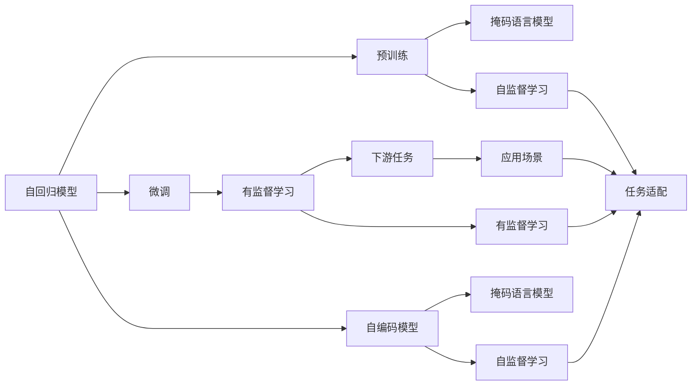
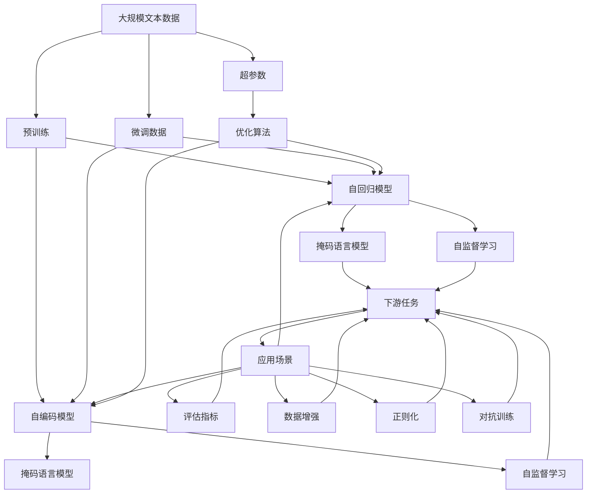

                 

# 大规模语言模型从理论到实践 大语言模型的构建流程

> 关键词：大规模语言模型,Transformer,BERT,预训练,自监督学习,深度学习,语言模型,自然语言处理(NLP),优化算法,超参数调整,评估指标

## 1. 背景介绍

### 1.1 问题由来
随着深度学习技术的迅速发展，大规模语言模型（Large Language Models, LLMs）已经成为自然语言处理（NLP）领域的重要研究方向。LLMs通过在大规模无标签文本数据上进行预训练，能够学习到丰富的语言知识和常识，具备强大的语言理解和生成能力。这种模型能够在各种自然语言处理任务中取得显著的性能提升，如文本分类、情感分析、命名实体识别等。然而，由于大规模预训练的复杂性和资源需求，实现一个高质量的大规模语言模型仍然存在诸多挑战。

### 1.2 问题核心关键点
构建大规模语言模型的核心关键点包括：选择合适的架构、确定适当的预训练任务、选择合适的优化算法和超参数、以及如何评估模型性能。这些问题不仅涉及理论和技术细节，还与实际应用场景密切相关。以下是构建大规模语言模型的几个关键步骤：

1. **模型架构选择**：选择适当的深度学习架构，如自回归模型（如GPT）或自编码模型（如BERT）。
2. **预训练任务设计**：设计自监督学习任务，如语言模型预训练、掩码语言模型预训练等，以充分利用大规模数据。
3. **优化算法选择**：选择合适的优化算法，如Adam、SGD等，并确定学习率、批大小等超参数。
4. **模型评估**：选择适当的评估指标，如准确率、召回率、F1分数等，以评估模型性能。
5. **模型调优**：通过超参数调整和数据增强等技术，优化模型性能。

### 1.3 问题研究意义
构建大规模语言模型具有重要的研究意义，能够推动NLP技术的发展，提高模型的泛化能力和应用效果。其意义体现在以下几个方面：

1. **降低任务开发成本**：使用预训练模型可以显著减少从头开发所需的计算、数据和人力成本，加速模型训练。
2. **提升模型效果**：预训练模型能够学习到丰富的语言知识，通过微调可以在特定任务上获得更好的性能。
3. **加速任务适配**：预训练模型可以作为初始化参数，通过微调快速适应各种下游任务。
4. **技术创新**：预训练和微调技术推动了NLP领域的理论研究和实践创新，催生了如迁移学习、少样本学习等前沿研究方向。
5. **赋能行业应用**：预训练模型能够被广泛应用于各个行业，推动行业数字化转型。

## 2. 核心概念与联系

### 2.1 核心概念概述

在构建大规模语言模型时，需要了解以下几个核心概念：

- **自回归模型**：如GPT系列模型，模型通过前一个单词预测下一个单词，利用自回归方式生成文本。
- **自编码模型**：如BERT系列模型，模型通过掩码语言模型等任务进行预训练，学习到输入和输出之间的映射关系。
- **预训练**：指在大规模无标签文本数据上进行训练，学习通用语言表示的过程。
- **微调**：指在预训练模型的基础上，使用下游任务的少量标注数据进行有监督训练，优化模型在特定任务上的性能。
- **迁移学习**：指将预训练模型在不同任务间进行迁移，以适应新任务。
- **少样本学习**：指在只有少量标注数据的情况下，模型能够快速适应新任务。
- **零样本学习**：指模型在没有见过任何特定任务的情况下，仅凭任务描述就能够执行新任务。

这些核心概念通过Mermaid流程图展示其关系：



通过上述流程图，我们可以清晰地看到自回归和自编码模型的预训练过程，以及预训练后模型通过微调适应下游任务的场景。

### 2.2 概念间的关系

这些核心概念之间存在着紧密的联系，形成了构建大规模语言模型的完整生态系统。通过以下Mermaid流程图，展示这些概念之间的关系：



通过上述综合流程图，我们可以清楚地看到从大规模文本数据到模型训练，再到模型评估和应用的全过程，以及各个环节中的关键技术和策略。

## 3. 核心算法原理 & 具体操作步骤

### 3.1 算法原理概述

构建大规模语言模型涉及的算法原理主要包括预训练、微调和评估三个阶段。

**预训练**：在大规模无标签文本数据上，通过自监督学习任务训练通用语言模型。例如，语言模型预训练、掩码语言模型预训练等。

**微调**：在预训练模型的基础上，使用下游任务的少量标注数据进行有监督训练，优化模型在特定任务上的性能。通常，只微调模型的顶层，以避免过拟合。

**评估**：通过选择合适的评估指标（如准确率、召回率、F1分数等），评估模型在特定任务上的表现。

### 3.2 算法步骤详解

构建大规模语言模型的具体操作步骤如下：

1. **数据准备**：收集大规模文本数据，划分为训练集、验证集和测试集。训练集用于预训练，验证集用于超参数调优，测试集用于模型评估。

2. **模型选择**：选择适当的深度学习架构，如自回归模型（GPT）或自编码模型（BERT）。

3. **预训练**：在训练集上，通过自监督学习任务（如掩码语言模型）进行预训练，学习通用语言表示。

4. **微调**：在预训练模型的基础上，使用下游任务的少量标注数据进行有监督微调，优化模型在特定任务上的性能。

5. **超参数调整**：选择合适的优化算法（如Adam、SGD等），并确定学习率、批大小等超参数，通过验证集进行超参数调优。

6. **模型评估**：在测试集上，使用适当的评估指标评估模型性能。

7. **模型调优**：通过数据增强、对抗训练等技术，进一步优化模型性能。

8. **模型部署**：将优化后的模型部署到实际应用场景中。

### 3.3 算法优缺点

构建大规模语言模型具有以下优点：

- **泛化能力强**：通过预训练学习到通用语言知识，模型能够较好地适应下游任务。
- **适应性强**：模型能够快速适应各种下游任务，加速应用开发。
- **计算效率高**：相比从头训练，预训练和微调过程计算资源需求较低。

然而，构建大规模语言模型也存在一些缺点：

- **数据需求大**：预训练和微调过程需要大规模数据，数据获取和处理成本较高。
- **模型复杂**：大规模模型结构复杂，训练和推理资源消耗大。
- **模型解释性不足**：预训练模型和微调模型通常缺乏可解释性，难以解释其内部工作机制。

### 3.4 算法应用领域

构建大规模语言模型在NLP领域得到了广泛应用，例如：

- **文本分类**：如情感分析、主题分类等。通过微调使模型学习文本-标签映射。
- **命名实体识别**：识别文本中的人名、地名、机构名等特定实体。通过微调使模型掌握实体边界和类型。
- **关系抽取**：从文本中抽取实体之间的语义关系。通过微调使模型学习实体-关系三元组。
- **问答系统**：对自然语言问题给出答案。将问题-答案对作为微调数据，训练模型学习匹配答案。
- **机器翻译**：将源语言文本翻译成目标语言。通过微调使模型学习语言-语言映射。
- **文本摘要**：将长文本压缩成简短摘要。将文章-摘要对作为微调数据，使模型学习抓取要点。
- **对话系统**：使机器能够与人自然对话。将多轮对话历史作为上下文，微调模型进行回复生成。

## 4. 数学模型和公式 & 详细讲解 & 举例说明

### 4.1 数学模型构建

构建大规模语言模型通常采用自回归或自编码模型。这里以BERT为例，介绍其数学模型构建过程。

**BERT模型的目标函数**：
\[
\mathcal{L}(\theta) = \frac{1}{N} \sum_{i=1}^N \ell(M_{\theta}(x_i), y_i)
\]

其中，\(\ell\)为损失函数，\(M_{\theta}\)为BERT模型，\(x_i\)为输入文本，\(y_i\)为标签。

**语言模型目标函数**：
\[
\ell_{LM}(x_i) = -\log P(y_i|x_i)
\]

其中，\(P(y_i|x_i)\)表示模型在输入\(x_i\)条件下生成标签\(y_i\)的概率。

**掩码语言模型目标函数**：
\[
\ell_{MLM}(x_i) = -\sum_{i=1}^n \log P(x_i|x_{1:i-1}, x_{i+1:n})
\]

其中，\(n\)为输入序列长度，\(x_i\)为输入序列中的第\(i\)个单词。

### 4.2 公式推导过程

以BERT为例，推导其掩码语言模型目标函数：

**掩码语言模型目标函数**：
\[
\ell_{MLM}(x_i) = -\sum_{i=1}^n \log P(x_i|x_{1:i-1}, x_{i+1:n})
\]

**概率计算公式**：
\[
P(x_i|x_{1:i-1}, x_{i+1:n}) = \frac{\exp(\log P(x_i|x_{1:i-1}, x_{i+1:n}))}{\sum_{j=1}^n \exp(\log P(x_j|x_{1:i-1}, x_{i+1:n}))
\]

**自编码器目标函数**：
\[
\ell_{SE}(x_i) = -\log P(x_i|x_{1:i-1}, x_{i+1:n})
\]

### 4.3 案例分析与讲解

以BERT模型为例，分析其掩码语言模型目标函数的推导过程。

**掩码语言模型目标函数**：
\[
\ell_{MLM}(x_i) = -\sum_{i=1}^n \log P(x_i|x_{1:i-1}, x_{i+1:n})
\]

**概率计算公式**：
\[
P(x_i|x_{1:i-1}, x_{i+1:n}) = \frac{\exp(\log P(x_i|x_{1:i-1}, x_{i+1:n}))}{\sum_{j=1}^n \exp(\log P(x_j|x_{1:i-1}, x_{i+1:n}))
\]

**自编码器目标函数**：
\[
\ell_{SE}(x_i) = -\log P(x_i|x_{1:i-1}, x_{i+1:n})
\]

通过上述推导，可以看出BERT模型通过掩码语言模型和自编码器两种目标函数，实现了对输入序列的掩码预测和自编码，从而学习到输入和输出之间的映射关系。

## 5. 项目实践：代码实例和详细解释说明

### 5.1 开发环境搭建

在开始项目实践前，需要准备好开发环境。以下是使用Python进行PyTorch开发的示例：

1. 安装Anaconda：
   ```bash
   conda install anaconda
   conda create --name pytorch-env python=3.8
   conda activate pytorch-env
   ```

2. 安装PyTorch：
   ```bash
   pip install torch torchvision torchaudio
   ```

3. 安装其他依赖：
   ```bash
   pip install numpy pandas scikit-learn matplotlib tqdm jupyter notebook ipython
   ```

4. 安装HuggingFace Transformers库：
   ```bash
   pip install transformers
   ```

### 5.2 源代码详细实现

下面以BERT模型为例，展示使用Transformers库进行微调的代码实现。

```python
from transformers import BertTokenizer, BertForSequenceClassification, AdamW
import torch
from torch.utils.data import Dataset, DataLoader
from sklearn.metrics import classification_report

class MyDataset(Dataset):
    def __init__(self, texts, labels):
        self.texts = texts
        self.labels = labels
        self.tokenizer = BertTokenizer.from_pretrained('bert-base-cased')

    def __len__(self):
        return len(self.texts)

    def __getitem__(self, idx):
        text = self.texts[idx]
        label = self.labels[idx]
        encoding = self.tokenizer(text, return_tensors='pt', padding='max_length', truncation=True)
        return {'input_ids': encoding['input_ids'].flatten(), 'attention_mask': encoding['attention_mask'].flatten(), 'labels': torch.tensor(label, dtype=torch.long)}

# 数据加载
train_dataset = MyDataset(train_texts, train_labels)
val_dataset = MyDataset(val_texts, val_labels)
test_dataset = MyDataset(test_texts, test_labels)

# 模型选择
model = BertForSequenceClassification.from_pretrained('bert-base-cased', num_labels=len(class_labels))

# 优化器
optimizer = AdamW(model.parameters(), lr=2e-5)

# 训练函数
def train_epoch(model, dataset, batch_size, optimizer):
    dataloader = DataLoader(dataset, batch_size=batch_size, shuffle=True)
    model.train()
    epoch_loss = 0
    for batch in dataloader:
        input_ids = batch['input_ids'].to(device)
        attention_mask = batch['attention_mask'].to(device)
        labels = batch['labels'].to(device)
        model.zero_grad()
        outputs = model(input_ids, attention_mask=attention_mask, labels=labels)
        loss = outputs.loss
        epoch_loss += loss.item()
        loss.backward()
        optimizer.step()
    return epoch_loss / len(dataloader)

# 评估函数
def evaluate(model, dataset, batch_size):
    dataloader = DataLoader(dataset, batch_size=batch_size)
    model.eval()
    preds, labels = [], []
    with torch.no_grad():
        for batch in dataloader:
            input_ids = batch['input_ids'].to(device)
            attention_mask = batch['attention_mask'].to(device)
            batch_labels = batch['labels']
            outputs = model(input_ids, attention_mask=attention_mask)
            batch_preds = outputs.logits.argmax(dim=1).to('cpu').tolist()
            batch_labels = batch_labels.to('cpu').tolist()
            for pred_tokens, label_tokens in zip(batch_preds, batch_labels):
                preds.append(pred_tokens[:len(label_tokens)])
                labels.append(label_tokens)
    
    return classification_report(labels, preds)

# 训练
epochs = 5
batch_size = 16

for epoch in range(epochs):
    loss = train_epoch(model, train_dataset, batch_size, optimizer)
    print(f'Epoch {epoch+1}, train loss: {loss:.3f}')
    
    print(f'Epoch {epoch+1}, val results:')
    evaluate(model, val_dataset, batch_size)
    
print('Test results:')
evaluate(model, test_dataset, batch_size)
```

### 5.3 代码解读与分析

上述代码实现了使用BERT模型进行序列分类任务的微调。以下是关键代码的解读和分析：

**MyDataset类**：
- `__init__`方法：初始化文本、标签、分词器等组件。
- `__len__`方法：返回数据集的样本数量。
- `__getitem__`方法：对单个样本进行处理，将文本输入编码为token ids，将标签编码为数字，并进行padding和truncation，返回模型所需的输入。

**train_epoch函数**：
- 定义数据加载器，迭代训练集数据。
- 模型训练模式开启，计算损失函数。
- 反向传播，更新模型参数。
- 记录每个epoch的平均损失。

**evaluate函数**：
- 定义数据加载器，迭代评估集数据。
- 模型评估模式开启，不更新参数。
- 收集预测和标签结果。
- 使用classification_report打印评估结果。

**训练流程**：
- 定义总epoch数和batch size。
- 每个epoch内，在训练集上进行训练，输出平均损失。
- 在验证集上评估，输出分类指标。
- 所有epoch结束后，在测试集上评估，给出最终测试结果。

## 6. 实际应用场景

### 6.1 智能客服系统

基于BERT等大语言模型，可以构建智能客服系统，实现自然语言对话和问题解答。例如，使用微调后的模型来处理客户的常见问题和咨询，提高响应速度和准确性。

### 6.2 金融舆情监测

在金融领域，可以使用BERT模型进行舆情监测，分析市场情绪和新闻报道。例如，将金融新闻文本作为输入，使用微调后的模型进行情感分析，预测市场趋势。

### 6.3 个性化推荐系统

使用BERT模型进行用户行为分析，通过微调模型学习用户兴趣和偏好，生成个性化的推荐结果。例如，将用户浏览和点击记录作为输入，使用微调后的模型进行推荐排序。

### 6.4 未来应用展望

未来，大规模语言模型将在更多领域得到应用，如医疗、教育、智慧城市等。随着预训练模型和微调方法的不断演进，NLP技术将在更广阔的应用领域大放异彩。

## 7. 工具和资源推荐

### 7.1 学习资源推荐

为了帮助开发者系统掌握大语言模型的构建流程，以下是一些推荐的学习资源：

1. 《深度学习入门》书籍：介绍深度学习的基本概念和算法，适合初学者。
2. 斯坦福大学《CS224N深度学习自然语言处理》课程：涵盖NLP领域的经典模型和任务。
3. 《自然语言处理与深度学习》书籍：介绍NLP领域的前沿研究和应用。
4. 《BERT: Pre-training of Deep Bidirectional Transformers for Language Understanding》论文：介绍BERT模型的构建过程和预训练方法。
5. PyTorch官方文档：PyTorch框架的使用指南和代码示例。

### 7.2 开发工具推荐

以下是一些推荐的大语言模型开发工具：

1. PyTorch：基于Python的深度学习框架，灵活易用。
2. TensorFlow：Google开源的深度学习框架，支持分布式计算和GPU加速。
3. Transformers库：HuggingFace开发的NLP库，集成了多种预训练模型和微调工具。
4. Weights & Biases：实验跟踪和可视化工具，记录和分析模型训练过程。
5. TensorBoard：TensorFlow配套的可视化工具，展示模型训练指标。

### 7.3 相关论文推荐

以下是一些推荐的大语言模型相关论文：

1. Attention is All You Need：介绍Transformer架构，推动了预训练模型的发展。
2. BERT: Pre-training of Deep Bidirectional Transformers for Language Understanding：介绍BERT模型的预训练过程和微调方法。
3. Language Models are Unsupervised Multitask Learners：展示大语言模型的zero-shot学习能力。
4. Parameter-Efficient Transfer Learning for NLP：提出 Adapter等参数高效微调方法，提高微调效率。
5. Adaptive Low-Rank Adaptation for Parameter-Efficient Fine-Tuning：介绍 LoRA 等参数高效微调方法，减少模型资源消耗。

## 8. 总结：未来发展趋势与挑战

### 8.1 研究成果总结

本文对大语言模型的构建流程进行了全面介绍，涉及模型架构选择、预训练任务设计、优化算法选择、模型评估等关键环节。通过理论推导和实践案例，展示了预训练和微调过程的详细操作步骤和效果。

### 8.2 未来发展趋势

未来，大规模语言模型将呈现以下几个发展趋势：

1. 模型规模不断增大，预训练和微调所需的计算资源需求进一步降低。
2. 微调方法日趋多样，如Prefix-Tuning、LoRA等，提高微调效率。
3. 模型鲁棒性提升，在处理噪声数据和对抗样本时表现更好。
4. 数据需求降低，利用无监督和半监督学习，减少对标注数据的依赖。
5. 应用场景拓展，如智慧医疗、智慧教育等新兴领域。

### 8.3 面临的挑战

尽管大语言模型构建取得了显著成果，但仍然面临以下挑战：

1. 计算资源需求高，大规模模型训练和推理需要高性能设备。
2. 模型解释性不足，难以解释其内部工作机制。
3. 数据隐私和安全问题，需采取相应措施保护用户隐私。
4. 模型偏见和有害信息，需加强数据和算法层面的偏见消除。

### 8.4 研究展望

面对这些挑战，未来的研究应在以下几个方面进行突破：

1. 优化模型架构和训练方法，提高计算效率和模型解释性。
2. 利用无监督和半监督学习，降低数据需求。
3. 结合符号知识和深度学习，提高模型的准确性和鲁棒性。
4. 加强模型偏见和有害信息的识别和消除，确保模型的公平性和安全性。

## 9. 附录：常见问题与解答

**Q1: 如何选择合适的预训练模型？**

A: 选择合适的预训练模型需要考虑以下几个方面：
- 任务类型：选择与任务类型匹配的模型。例如，对于文本分类任务，BERT模型是一个较好的选择。
- 模型规模：模型规模越大，表示能力越强，但计算资源需求也越高。
- 预训练数据：模型的预训练数据需要与任务数据分布相似，以提高微调效果。

**Q2: 如何优化模型性能？**

A: 优化模型性能可以通过以下几种方式：
- 数据增强：通过文本扩充、回译等方式扩充训练集。
- 正则化：使用L2正则、Dropout等技术防止过拟合。
- 对抗训练：引入对抗样本，提高模型鲁棒性。
- 参数高效微调：只更新少量参数，减少资源消耗。

**Q3: 如何评估模型性能？**

A: 评估模型性能需要选择适当的评估指标，例如：
- 准确率：预测正确的样本数占总样本数的比例。
- 召回率：正确预测的正样本数占所有正样本数的比例。
- F1分数：综合考虑准确率和召回率，用于衡量模型的综合性能。

**Q4: 预训练和微调的区别是什么？**

A: 预训练和微调是构建大规模语言模型的两个重要步骤：
- 预训练：在大规模无标签数据上，通过自监督学习任务训练通用语言模型。
- 微调：在预训练模型的基础上，使用下游任务的少量标注数据进行有监督训练，优化模型在特定任务上的性能。

通过本文的系统梳理，可以看出构建大规模语言模型涉及多个环节和关键技术，需要结合实际应用场景进行综合考虑和优化。未来，随着预训练和微调技术的不断发展，NLP技术将更好地服务于各个行业，推动社会进步和经济发展。

---

作者：禅与计算机程序设计艺术 / Zen and the Art of Computer Programming

