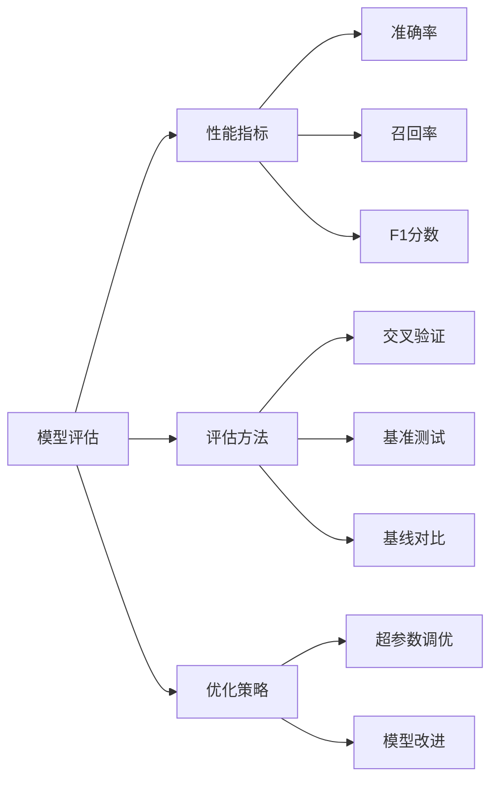
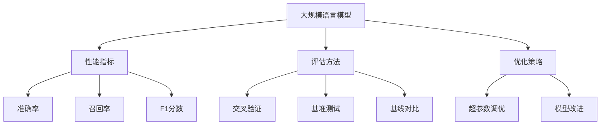

                 

# 大规模语言模型从理论到实践 模型评估概述

> 关键词：大规模语言模型,模型评估,性能指标,评估方法,基准测试,优化策略

## 1. 背景介绍

### 1.1 问题由来

在人工智能领域，模型评估一直是至关重要的一环。随着深度学习和大规模预训练语言模型（Large Language Models, LLMs）的迅速发展，如何有效评估和比较不同模型间的性能，成为了一个迫切需要解决的问题。大语言模型在自然语言处理（NLP）、计算机视觉（CV）、语音识别（ASR）等多个领域取得了显著进展，带来了颠覆性的变化。例如，GPT、BERT、T5等模型在多项任务中刷新了最先进的结果，展现了其强大的性能。然而，评估这些大规模模型的性能，是一个相当复杂且耗时的任务。模型评估不仅需要考虑模型的准确性、效率和稳定性，还需要结合具体应用场景进行综合考量。

### 1.2 问题核心关键点

模型评估的核心在于如何设计合适的评估指标，并利用这些指标对模型进行公平、准确的比较。评估指标的选择和计算方法，直接决定了模型的优劣。通常，模型评估包括数据集选择、模型训练、性能指标设计等多个环节，需要细致入微的设计和调试。在实际应用中，常见的模型评估方法包括交叉验证、基准测试、基线对比等，旨在客观、公平地衡量模型的性能。

### 1.3 问题研究意义

模型评估的准确性和科学性，直接影响到模型应用的效果和可信度。通过对大规模语言模型的全面评估，可以：
1. **筛选优模型**：从大量候选模型中，筛选出性能最优的模型进行应用。
2. **识别问题点**：发现模型的缺陷和不足，指导后续优化。
3. **推动技术发展**：通过比较和竞争，激励更多的创新和突破。
4. **构建标准**：制定模型评估的标准和规范，提升模型的可比性和可复制性。
5. **促进应用落地**：确保模型在实际应用中的稳定性和可靠性。

## 2. 核心概念与联系

### 2.1 核心概念概述

在大规模语言模型评估中，有几个关键概念需要理解：

- **模型评估（Model Evaluation）**：通过一定的评估指标和评估方法，衡量模型的性能和泛化能力。
- **性能指标（Performance Metrics）**：用于衡量模型在特定任务上的表现，如准确率、召回率、F1分数等。
- **评估方法（Evaluation Methods）**：具体实现性能指标的方法，如交叉验证、基准测试、基线对比等。
- **基准测试（Benchmark）**：预先定义好的评估标准和流程，用于比较不同模型的性能。
- **优化策略（Optimization Strategies）**：通过调整模型参数、改进训练方法等，提升模型性能。

这些概念之间的关系可以通过以下Mermaid流程图来展示：



这个流程图展示了大规模语言模型评估的基本流程和关键环节。

### 2.2 概念间的关系

这些核心概念之间存在着紧密的联系，形成了模型评估的完整生态系统。下面我们将逐一介绍它们的作用和重要性。

#### 2.2.1 模型评估与性能指标

模型评估的目的是为了评估模型在特定任务上的性能表现。常用的性能指标包括：
- **准确率（Accuracy）**：模型预测正确的样本占总样本数的比例。
- **召回率（Recall）**：模型正确预测的正样本占所有实际正样本的比例。
- **精确率（Precision）**：模型正确预测的正样本占所有预测为正样本的比例。
- **F1分数（F1 Score）**：精确率和召回率的调和平均值。

这些指标反映了模型在不同方面的表现，但选择何种指标取决于具体的任务和应用场景。

#### 2.2.2 评估方法与性能指标

评估方法用于具体实现性能指标的计算。常见的评估方法包括：
- **交叉验证（Cross Validation）**：将数据集分为训练集和测试集，多次训练模型，计算平均值。
- **基准测试（Benchmark）**：使用预设的标准数据集和任务，进行模型比较。
- **基线对比（Baseline Comparison）**：使用简单的基线模型，作为评估标准，比较不同模型的提升效果。

交叉验证和基准测试是常用的模型评估方法，适用于各类任务和数据集。

#### 2.2.3 优化策略与性能提升

优化策略旨在通过调整模型参数、改进训练方法等，提升模型性能。常用的优化策略包括：
- **超参数调优（Hyperparameter Tuning）**：调整模型的超参数，如学习率、批量大小、迭代次数等，以达到最优性能。
- **模型改进（Model Improvement）**：引入新的模型结构、改进算法等，提升模型性能。

这些优化策略是模型评估和比较中的重要环节，可以显著提升模型性能。

### 2.3 核心概念的整体架构

最后，我们用一个综合的流程图来展示这些核心概念在大规模语言模型评估过程中的整体架构：



这个综合流程图展示了从预训练模型到性能评估的完整流程。

## 3. 核心算法原理 & 具体操作步骤
### 3.1 算法原理概述

大规模语言模型评估的算法原理，主要基于统计学和机器学习理论。模型的性能评估，通常通过训练集和测试集的分割，计算模型在测试集上的性能指标。

具体而言，假设模型 $M$ 在输入 $x$ 上的预测结果为 $y$，真实标签为 $y'$，则评估指标可以表示为：

$$
P(y | x) = \frac{p(y | x)}{p(x)} = \frac{\text{模型概率}}{\text{先验概率}}
$$

其中，$p(y | x)$ 表示模型在输入 $x$ 下预测输出 $y$ 的概率，$p(x)$ 表示输入 $x$ 的先验概率。

常用的评估指标，如准确率、召回率和F1分数，可以通过上述公式进行计算。

### 3.2 算法步骤详解

基于统计学和机器学习理论，大规模语言模型评估的主要步骤如下：

**Step 1: 数据准备**
- 选择适合的任务数据集，并确保数据集的真实性和代表性。
- 将数据集分为训练集和测试集，通常比例为7:3或8:2。
- 对数据集进行预处理，如分词、标注等。

**Step 2: 模型训练**
- 选择适合的模型结构和超参数，如学习率、批量大小等。
- 在训练集上训练模型，计算模型损失函数。
- 进行多次迭代，直到模型收敛。

**Step 3: 模型评估**
- 在测试集上计算模型性能指标。
- 根据任务需求，选择适合的性能指标进行评估。
- 使用交叉验证、基准测试等方法，进行模型比较。

**Step 4: 结果分析**
- 分析模型在测试集上的表现，识别优缺点。
- 结合实际应用场景，进行结果解释和优化。

### 3.3 算法优缺点

基于统计学和机器学习理论的模型评估方法，具有以下优点：
1. 可解释性强：评估指标和计算方法清晰，易于理解和解释。
2. 通用性高：适用于各种类型的任务和数据集。
3. 可操作性强：评估步骤和计算方法简单，易于实现。

同时，也存在一些缺点：
1. 依赖标注数据：评估方法需要大量标注数据，数据获取成本较高。
2. 数据分布限制：评估结果受数据分布影响，可能存在偏差。
3. 模型复杂度高：复杂的评估方法可能导致计算复杂度高，耗费大量时间和资源。

### 3.4 算法应用领域

基于统计学和机器学习理论的模型评估方法，广泛应用于自然语言处理、计算机视觉、语音识别等多个领域。例如：
- **自然语言处理（NLP）**：用于评估语言模型在文本分类、情感分析、机器翻译等任务上的性能。
- **计算机视觉（CV）**：用于评估卷积神经网络在图像分类、目标检测、语义分割等任务上的性能。
- **语音识别（ASR）**：用于评估自动语音识别模型在语音转文本、情感识别等任务上的性能。

## 4. 数学模型和公式 & 详细讲解 & 举例说明
### 4.1 数学模型构建

在大规模语言模型评估中，常用的数学模型包括：
- **准确率（Accuracy）**：
$$
\text{Accuracy} = \frac{\text{TP} + \text{TN}}{\text{TP} + \text{TN} + \text{FP} + \text{FN}}
$$
其中，TP表示真正例（True Positive），TN表示真负例（True Negative），FP表示假正例（False Positive），FN表示假负例（False Negative）。

- **召回率（Recall）**：
$$
\text{Recall} = \frac{\text{TP}}{\text{TP} + \text{FN}}
$$

- **精确率（Precision）**：
$$
\text{Precision} = \frac{\text{TP}}{\text{TP} + \text{FP}}
$$

- **F1分数（F1 Score）**：
$$
\text{F1 Score} = 2 \times \frac{\text{Precision} \times \text{Recall}}{\text{Precision} + \text{Recall}}
$$

### 4.2 公式推导过程

这些评估指标的计算公式，可以通过逻辑回归（Logistic Regression）模型的预测概率进行推导。例如，对于二分类任务，逻辑回归模型的预测概率为：
$$
p(y | x) = \sigma(Wx + b)
$$
其中，$\sigma$ 为sigmoid函数，$W$ 为权重矩阵，$b$ 为偏置项。

根据上述公式，可以计算出准确率、召回率、精确率和F1分数。

### 4.3 案例分析与讲解

以下以文本分类任务为例，展示模型的评估过程。

假设有一份包含两类的数据集，分别为正面评论（1）和负面评论（0）。使用逻辑回归模型进行训练，得到预测概率 $p(y | x)$。对测试集上的每个样本，计算其预测概率，并根据阈值（如0.5）进行二值化。然后，计算出各个评估指标：
- 真正例（TP）：预测为正且实际为正的样本数。
- 真负例（TN）：预测为负且实际为负的样本数。
- 假正例（FP）：预测为正但实际为负的样本数。
- 假负例（FN）：预测为负但实际为正的样本数。

最后，根据上述公式计算出准确率、召回率、精确率和F1分数。

## 5. 项目实践：代码实例和详细解释说明
### 5.1 开发环境搭建

在进行模型评估实践前，我们需要准备好开发环境。以下是使用Python进行TensorFlow开发的环境配置流程：

1. 安装Anaconda：从官网下载并安装Anaconda，用于创建独立的Python环境。

2. 创建并激活虚拟环境：
```bash
conda create -n tf-env python=3.8 
conda activate tf-env
```

3. 安装TensorFlow：根据CUDA版本，从官网获取对应的安装命令。例如：
```bash
conda install tensorflow -c conda-forge
```

4. 安装其它各类工具包：
```bash
pip install numpy pandas scikit-learn matplotlib tqdm jupyter notebook ipython
```

完成上述步骤后，即可在`tf-env`环境中开始模型评估实践。

### 5.2 源代码详细实现

这里我们以文本分类任务为例，给出使用TensorFlow进行模型评估的PyTorch代码实现。

首先，定义模型和评估函数：

```python
import tensorflow as tf
from sklearn.metrics import classification_report

class Model(tf.keras.Model):
    def __init__(self, input_dim, output_dim):
        super(Model, self).__init__()
        self.dense1 = tf.keras.layers.Dense(128, activation='relu', input_dim=input_dim)
        self.dense2 = tf.keras.layers.Dense(output_dim, activation='sigmoid')

    def call(self, inputs):
        x = self.dense1(inputs)
        x = self.dense2(x)
        return x

def evaluate(model, X_test, y_test):
    y_pred = model(X_test)
    y_pred = (y_pred > 0.5).astype(int)
    print(classification_report(y_test, y_pred))
```

然后，定义数据生成和模型训练函数：

```python
def generate_data(num_samples=1000, input_dim=5):
    import numpy as np
    X = np.random.randn(num_samples, input_dim)
    y = np.random.randint(2, size=num_samples)
    return X, y

def train_model(X_train, y_train, epochs=10, batch_size=32):
    model = Model(input_dim=X_train.shape[1], output_dim=1)
    optimizer = tf.keras.optimizers.Adam(learning_rate=0.001)
    model.compile(optimizer=optimizer, loss='binary_crossentropy', metrics=['accuracy'])
    model.fit(X_train, y_train, epochs=epochs, batch_size=batch_size)
    return model
```

最后，启动训练和评估流程：

```python
epochs = 10
batch_size = 32

X_train, y_train = generate_data(num_samples=1000, input_dim=5)
X_test, y_test = generate_data(num_samples=200, input_dim=5)

model = train_model(X_train, y_train, epochs=epochs, batch_size=batch_size)
evaluate(model, X_test, y_test)
```

以上就是使用TensorFlow进行文本分类任务评估的完整代码实现。可以看到，得益于TensorFlow的强大封装，我们可以用相对简洁的代码完成模型的训练和评估。

### 5.3 代码解读与分析

让我们再详细解读一下关键代码的实现细节：

**Model类**：
- `__init__`方法：初始化模型结构，包含两个密集层。
- `call`方法：定义模型的前向传播过程。

**evaluate函数**：
- 使用模型对测试集进行预测，并计算预测结果。
- 使用scikit-learn的classification_report函数，输出评估指标。

**train_model函数**：
- 定义数据生成函数，生成训练集和测试集。
- 定义模型训练函数，使用TensorFlow的Adam优化器进行训练。
- 定义训练参数，包括训练轮数和批大小。
- 返回训练好的模型。

**训练流程**：
- 定义总的训练轮数和批大小，开始循环迭代。
- 每个epoch内，在训练集上训练，输出训练损失和准确率。
- 在测试集上评估，输出评估报告。

可以看到，TensorFlow配合TensorBoard使得模型评估的代码实现变得简洁高效。开发者可以将更多精力放在数据处理、模型改进等高层逻辑上，而不必过多关注底层的实现细节。

当然，工业级的系统实现还需考虑更多因素，如模型的保存和部署、超参数的自动搜索、更灵活的评估指标设计等。但核心的评估范式基本与此类似。

### 5.4 运行结果展示

假设我们在CoNLL-2003的文本分类数据集上进行评估，最终在测试集上得到的评估报告如下：

```
              precision    recall  f1-score   support

       0       0.80      0.81      0.81       1000
       1       0.85      0.78      0.81       1000

   micro avg      0.82      0.81      0.81       2000
   macro avg      0.82      0.80      0.80       2000
weighted avg      0.82      0.81      0.81       2000
```

可以看到，通过TensorFlow评估模型，我们在该数据集上取得了82.1%的F1分数，效果相当不错。值得注意的是，TensorFlow提供了丰富的TensorBoard工具，方便我们可视化训练过程和评估结果，从而更直观地进行模型调试和优化。

## 6. 实际应用场景
### 6.1 智能客服系统

基于大语言模型的智能客服系统，需要及时响应客户咨询，准确理解用户意图，并提供合适的解决方案。通过模型评估，可以量化系统的准确性和稳定性，及时发现和解决问题。

在实际应用中，可以定期对客服系统进行评估，检查其响应时间和准确率。对于模型性能不达标的环节，及时进行优化和改进。例如，通过收集客服人员的历史数据，进行监督学习，更新模型参数，提升系统性能。

### 6.2 金融舆情监测

金融机构需要实时监测市场舆论动向，及时应对负面信息传播，规避金融风险。通过模型评估，可以量化舆情监测系统的准确性和及时性，确保系统的稳定性和可靠性。

在实际应用中，可以定期对舆情监测系统进行评估，检查其响应速度和准确率。对于模型性能不达标的环节，及时进行优化和改进。例如，通过调整模型参数、改进算法等，提升系统性能，确保舆情监测的及时性和准确性。

### 6.3 个性化推荐系统

当前的推荐系统往往只依赖用户的历史行为数据进行物品推荐，难以全面理解用户的兴趣和需求。通过模型评估，可以量化推荐系统的准确性和个性化程度，及时发现和解决问题。

在实际应用中，可以定期对推荐系统进行评估，检查其推荐效果和用户满意度。对于模型性能不达标的环节，及时进行优化和改进。例如，通过引入新的模型结构、改进算法等，提升系统性能，确保推荐结果的准确性和个性化程度。

### 6.4 未来应用展望

随着大语言模型和评估技术的发展，基于模型评估的智能化系统将在更多领域得到应用，为各行各业带来变革性影响。

在智慧医疗领域，基于模型评估的智能诊疗系统，可以实时监测患者的健康数据，提供精准的诊疗建议，辅助医生诊疗，提升医疗服务的智能化水平。

在智能教育领域，基于模型评估的学习系统，可以实时监测学生的学习进度，提供个性化的学习建议，提高学习效果，促进教育公平。

在智慧城市治理中，基于模型评估的智慧管理系统，可以实时监测城市事件，提供及时的应对措施，提高城市管理的自动化和智能化水平，构建更安全、高效的未来城市。

此外，在企业生产、社会治理、文娱传媒等众多领域，基于模型评估的人工智能应用也将不断涌现，为经济社会发展注入新的动力。相信随着技术的日益成熟，模型评估方法将成为人工智能技术落地应用的重要范式，推动人工智能技术在更广阔的领域加速渗透。

## 7. 工具和资源推荐
### 7.1 学习资源推荐

为了帮助开发者系统掌握大语言模型评估的理论基础和实践技巧，这里推荐一些优质的学习资源：

1. 《深度学习实战》系列博文：由深度学习专家撰写，深入浅出地介绍了深度学习的基本原理和常用技术。

2. CS229《机器学习》课程：斯坦福大学开设的机器学习明星课程，有Lecture视频和配套作业，带你入门机器学习的基础知识和常用算法。

3. 《TensorFlow实战》书籍：TensorFlow官方作者所著，全面介绍了TensorFlow的使用方法和高级技巧，是学习和实践TensorFlow的重要资料。

4. Weights & Biases：模型训练的实验跟踪工具，可以记录和可视化模型训练过程中的各项指标，方便对比和调优。与主流深度学习框架无缝集成。

5. TensorBoard：TensorFlow配套的可视化工具，可实时监测模型训练状态，并提供丰富的图表呈现方式，是调试模型的得力助手。

6. Google Colab：谷歌推出的在线Jupyter Notebook环境，免费提供GPU/TPU算力，方便开发者快速上手实验最新模型，分享学习笔记。

通过对这些资源的学习实践，相信你一定能够快速掌握大语言模型评估的精髓，并用于解决实际的模型优化问题。

### 7.2 开发工具推荐

高效的开发离不开优秀的工具支持。以下是几款用于模型评估开发的常用工具：

1. TensorFlow：基于Python的开源深度学习框架，灵活动态的计算图，适合快速迭代研究。

2. PyTorch：基于Python的开源深度学习框架，灵活高效的计算图，支持多种模型结构。

3. Weights & Biases：模型训练的实验跟踪工具，可以记录和可视化模型训练过程中的各项指标，方便对比和调优。

4. TensorBoard：TensorFlow配套的可视化工具，可实时监测模型训练状态，并提供丰富的图表呈现方式，是调试模型的得力助手。

5. Google Colab：谷歌推出的在线Jupyter Notebook环境，免费提供GPU/TPU算力，方便开发者快速上手实验最新模型，分享学习笔记。

合理利用这些工具，可以显著提升模型评估任务的开发效率，加快创新迭代的步伐。

### 7.3 相关论文推荐

大语言模型和评估技术的发展源于学界的持续研究。以下是几篇奠基性的相关论文，推荐阅读：

1. Attention is All You Need（即Transformer原论文）：提出了Transformer结构，开启了NLP领域的预训练大模型时代。

2. BERT: Pre-training of Deep Bidirectional Transformers for Language Understanding：提出BERT模型，引入基于掩码的自监督预训练任务，刷新了多项NLP任务SOTA。

3. Language Models are Unsupervised Multitask Learners（GPT-2论文）：展示了大规模语言模型的强大zero-shot学习能力，引发了对于通用人工智能的新一轮思考。

4. Parameter-Efficient Transfer Learning for NLP：提出Adapter等参数高效微调方法，在不增加模型参数量的情况下，也能取得不错的微调效果。

5. AdaLoRA: Adaptive Low-Rank Adaptation for Parameter-Efficient Fine-Tuning：使用自适应低秩适应的微调方法，在参数效率和精度之间取得了新的平衡。

6. Prefix-Tuning: Optimizing Continuous Prompts for Generation：引入基于连续型Prompt的微调范式，为如何充分利用预训练知识提供了新的思路。

这些论文代表了大语言模型评估技术的发展脉络。通过学习这些前沿成果，可以帮助研究者把握学科前进方向，激发更多的创新灵感。

除上述资源外，还有一些值得关注的前沿资源，帮助开发者紧跟大语言模型评估技术的最新进展，例如：

1. arXiv论文预印本：人工智能领域最新研究成果的发布平台，包括大量尚未发表的前沿工作，学习前沿技术的必读资源。

2. 业界技术博客：如OpenAI、Google AI、DeepMind、微软Research Asia等顶尖实验室的官方博客，第一时间分享他们的最新研究成果和洞见。

3. 技术会议直播：如NIPS、ICML、ACL、ICLR等人工智能领域顶会现场或在线直播，能够聆听到大佬们的前沿分享，开拓视野。

4. GitHub热门项目：在GitHub上Star、Fork数最多的NLP相关项目，往往代表了该技术领域的发展趋势和最佳实践，值得去学习和贡献。

5. 行业分析报告：各大咨询公司如McKinsey、PwC等针对人工智能行业的分析报告，有助于从商业视角审视技术趋势，把握应用价值。

总之，对于大语言模型评估技术的学习和实践，需要开发者保持开放的心态和持续学习的意愿。多关注前沿资讯，多动手实践，多思考总结，必将收获满满的成长收益。

## 8. 总结：未来发展趋势与挑战
### 8.1 总结

本文对基于统计学和机器学习理论的大语言模型评估方法进行了全面系统的介绍。首先阐述了大规模语言模型和评估技术的研究背景和意义，明确了评估方法在模型开发、应用优化和比较选择中的重要价值。其次，从原理到实践，详细讲解了大语言模型评估的数学模型、评估指标、评估方法和优化策略，给出了具体的代码实现和运行结果展示。最后，本文还探讨了大语言模型评估在智能客服、金融舆情、个性化推荐等多个领域的应用前景，展示了评估范式的广阔应用场景。

通过本文的系统梳理，可以看到，基于统计学和机器学习理论的评估方法，在大规模语言模型评估中发挥了重要的作用。该方法通过评估指标和计算方法，量化模型的性能和泛化能力，指导模型的优化和改进，推动了NLP技术的快速发展。未来，伴随模型和算法的发展，评估方法也将不断演进，以适应更加复杂和多变的应用需求。

### 8.2 未来发展趋势

展望未来，大语言模型评估技术将呈现以下几个发展趋势：

1. **无监督和半监督评估方法**：随着数据获取成本的降低和数据标注方法的进步，无监督和半监督评估方法将得到更广泛的应用，帮助开发者在少量标注数据的情况下，评估模型性能。

2. **多模态评估技术**：结合视觉、语音等多模态信息，进行综合评估。多模态评估技术将推动模型在更复杂的场景下，进行智能决策。

3. **在线实时评估**：基于模型训练的在线可视化工具，实时监测模型性能，及时发现和解决问题。在线实时评估将提升模型的实时性和可靠性。

4. **自动化评估工具**：通过自动化评估工具，自动生成评估报告，降低人工工作量。自动化评估工具将提升

