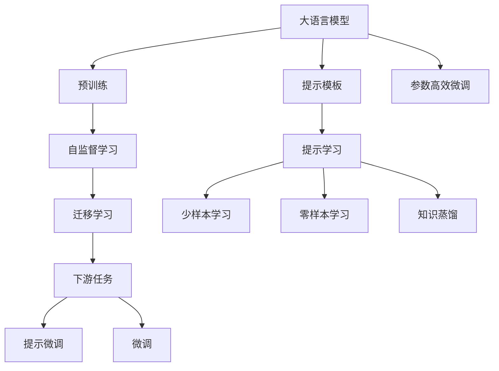
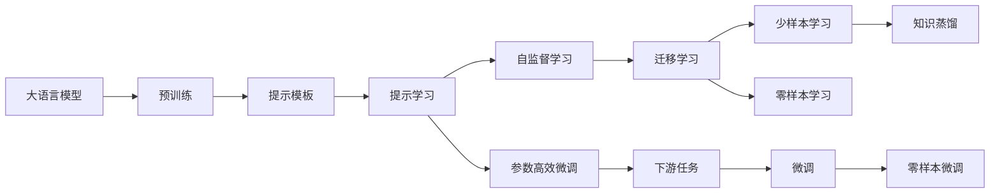

                 

# 大语言模型原理与工程实践：思维链提示

> 关键词：大语言模型,思维链,提示技术,深度学习,自然语言处理(NLP),预训练,迁移学习,Transformer,BERT,参数高效微调,自然语言处理(NLP)

## 1. 背景介绍

### 1.1 问题由来

近年来，深度学习技术在自然语言处理(NLP)领域取得了飞速发展。特别是大语言模型，如BERT、GPT-3等，以其庞大的参数量和广泛的预训练语料，展现出了强大的语言理解与生成能力。然而，大模型的训练和微调需要大量的计算资源和标注数据，这在实际应用中往往难以实现。

为应对这一挑战，提示技术(即Prompt-based Learning)应运而生。提示技术允许通过精心设计的输入模板，将语言模型转换为"提示器"，引导模型按照预期的思路进行推理和生成。这种方法不仅能够减少微调过程中的参数更新，还能在小样本情况下取得优异效果。

### 1.2 问题核心关键点

提示技术的核心在于通过输入模板来激活模型的特定能力。例如，在回答特定领域问题时，设计包含相关领域知识的提示模板，可以显著提升模型在特定任务上的表现。其基本流程包括：

1. 选择合适的预训练模型，如BERT、GPT等。
2. 设计并编写合适的提示模板，涵盖任务相关的上下文信息。
3. 将提示模板作为输入，调用预训练模型进行推理或生成。
4. 根据输出结果进行调整，重复上述过程直至满足期望。

提示技术的关键点在于提示模板的设计，既要简单明了，又要涵盖任务所需的背景知识，同时避免过于复杂，以免影响模型性能。

### 1.3 问题研究意义

提示技术为NLP任务提供了新的解决方案，尤其适用于小样本、无标注数据和跨领域任务等场景。它的研究与应用意义体现在以下几个方面：

1. **减少标注成本**：提示技术通过使用自然语言作为输入，无需标注数据即可进行训练，极大地降低了标注成本。
2. **提升微调效率**：在微调过程中，提示技术通过少量提示输入即可实现模型优化，减少参数更新量，提升训练效率。
3. **促进知识迁移**：提示技术通过将任务描述嵌入输入模板，引导模型学习领域知识，促进跨领域任务的迁移学习。
4. **增强模型鲁棒性**：提示技术能够通过上下文信息增强模型的鲁棒性和泛化能力，避免对特定输入的依赖。

### 1.4 问题研究难点

提示技术在实际应用中也面临一些挑战：

1. **提示设计困难**：设计有效的提示模板需要丰富的领域知识和经验，难以快速获得。
2. **输出不稳定**：不同提示模板可能导致模型输出不稳定，结果可重复性差。
3. **提示模板可扩展性差**：针对特定任务设计的提示模板难以泛化到其他领域，限制了其应用范围。
4. **模型理解力不足**：提示技术依赖模型对输入模板的理解，而模型在理解复杂语义时可能出现偏差。

这些难点需要我们在设计和使用提示技术时进行深入分析和不断优化。

## 2. 核心概念与联系

### 2.1 核心概念概述

提示技术在大语言模型中的应用，涉及以下几个关键概念：

- **大语言模型(Large Language Model, LLM)**：如BERT、GPT等预训练模型，具备强大的语言理解与生成能力，能够处理各种NLP任务。
- **提示模板(Prompt Template)**：用于引导模型进行推理或生成任务的自然语言模板，是提示技术的核心。
- **参数高效微调(Parameter-Efficient Fine-Tuning, PEFT)**：在微调过程中，只更新模型中特定层或特定参数，减少整体参数更新量，提高微调效率。
- **自监督学习(Self-Supervised Learning)**：通过预训练语言模型在无标注数据上自监督学习获得通用语言表示，为后续提示学习提供基础。
- **迁移学习(Transfer Learning)**：将预训练模型应用于不同领域的NLP任务，通过微调或提示技术进行适应。

这些概念之间通过以下Mermaid流程图来展示：



### 2.2 概念间的关系

这些核心概念通过以下Mermaid流程图来展示：



## 3. 核心算法原理 & 具体操作步骤
### 3.1 算法原理概述

提示技术的核心在于通过输入模板来引导模型进行特定任务的推理或生成。其基本流程如下：

1. **输入准备**：根据任务需求，设计合适的提示模板。
2. **模型调用**：将提示模板作为输入，调用预训练模型进行推理或生成。
3. **结果评估**：根据输出结果评估提示模板的有效性，并根据需要进行调整。
4. **重复迭代**：多次迭代，不断优化提示模板，直至满足期望。

提示技术的原理可以用以下公式来描述：

$$
\text{Output} = \text{LLM}(\text{Prompt Template})
$$

其中，LLM表示预训练语言模型，Prompt Template为输入模板，Output为模型输出。

### 3.2 算法步骤详解

提示技术的具体操作包括以下几个步骤：

1. **定义提示模板**：根据具体任务需求，设计包含必要背景知识的提示模板。例如，在问答任务中，提示模板可能包括问题、上下文信息和预期答案格式。

2. **选择预训练模型**：选择适合任务的预训练模型，如BERT、GPT等。

3. **调用模型推理**：将提示模板作为输入，调用预训练模型进行推理或生成。

4. **评估与调整**：根据模型输出与真实标签之间的差异，评估提示模板的有效性，并进行调整。

5. **迭代优化**：通过多次迭代，不断优化提示模板，直至满足任务需求。

以下是一个简单的Python代码示例，展示了如何使用BERT模型进行问答任务的提示学习：

```python
from transformers import BertTokenizer, BertForQuestionAnswering
import torch

tokenizer = BertTokenizer.from_pretrained('bert-base-uncased')
model = BertForQuestionAnswering.from_pretrained('bert-base-uncased')

question = "Who is the leader of China?"
context = "习近平是中国的国家主席。"
inputs = tokenizer(question + context, return_tensors='pt')

outputs = model(**inputs)
predictions = outputs.logits.argmax(dim=1)

print(tokenizer.decode(predictions[0]))
```

### 3.3 算法优缺点

提示技术的优点包括：

1. **零样本学习**：在无标注数据的情况下，通过精心设计的提示模板，可以直接进行推理或生成，无需标注数据。
2. **参数高效**：提示技术通过输入模板引导模型进行推理，无需更新大量参数，大幅提升微调效率。
3. **泛化能力强**：提示技术通过输入模板引入任务相关背景知识，可以提升模型在不同领域任务上的泛化能力。

提示技术的缺点包括：

1. **提示模板设计复杂**：设计有效提示模板需要丰富的领域知识和经验，且难以快速获得。
2. **输出结果不稳定**：不同提示模板可能导致模型输出不稳定，结果可重复性差。
3. **上下文理解能力有限**：提示技术依赖模型对输入模板的理解，而模型在理解复杂语义时可能出现偏差。

### 3.4 算法应用领域

提示技术在NLP领域的应用非常广泛，包括但不限于以下几个方面：

1. **问答系统**：在问答系统中，通过设计包含问题、上下文信息和预期答案格式的提示模板，引导模型进行推理，生成答案。
2. **文本生成**：在文本生成任务中，通过设计包含主题、风格和格式的提示模板，引导模型生成特定风格或内容的文本。
3. **翻译**：在机器翻译任务中，通过设计包含源语言和目标语言格式的提示模板，引导模型进行翻译。
4. **文本摘要**：在文本摘要任务中，通过设计包含摘要长度和风格提示模板，引导模型生成简洁、流畅的摘要。
5. **对话系统**：在对话系统中，通过设计包含对话历史和预期回复格式的提示模板，引导模型进行对话生成。

## 4. 数学模型和公式 & 详细讲解 & 举例说明

### 4.1 数学模型构建

提示技术的数学模型构建可以概括为以下几个步骤：

1. **输入表示**：将输入文本表示为模型能够处理的向量形式，如Token Embedding。
2. **提示模板嵌入**：将提示模板嵌入到输入向量中，构成模型输入。
3. **模型前向计算**：将模型输入前向传播，得到模型输出。
4. **损失函数计算**：根据模型输出与真实标签之间的差异，计算损失函数。
5. **参数更新**：使用梯度下降等优化算法，更新模型参数，最小化损失函数。

### 4.2 公式推导过程

以问答任务为例，假设预训练模型为 $M_{\theta}$，提示模板为 $P$，真实答案为 $y$，模型输出为 $y_{pred}$。提示技术的数学模型可以表示为：

$$
y_{pred} = M_{\theta}(P)
$$

其中，$P$ 为提示模板，$M_{\theta}$ 为预训练模型。

假设模型的损失函数为 $L$，可以表示为：

$$
L = \frac{1}{N} \sum_{i=1}^N \ell(y_i, y_{pred}^i)
$$

其中，$\ell$ 为损失函数，$N$ 为样本数量。

根据梯度下降算法，模型的参数更新公式为：

$$
\theta \leftarrow \theta - \eta \nabla_{\theta} L
$$

其中，$\eta$ 为学习率，$\nabla_{\theta} L$ 为损失函数对参数 $\theta$ 的梯度。

### 4.3 案例分析与讲解

以BART模型在问答任务中的提示学习为例，具体步骤为：

1. **定义提示模板**：设计包含问题、上下文信息和预期答案格式的提示模板。
2. **调用BART模型**：将提示模板作为输入，调用预训练的BART模型进行推理。
3. **评估与调整**：根据模型输出与真实答案之间的差异，评估提示模板的有效性，并进行调整。
4. **迭代优化**：通过多次迭代，不断优化提示模板，直至满足任务需求。

## 5. 项目实践：代码实例和详细解释说明

### 5.1 开发环境搭建

在进行提示技术实践前，我们需要准备好开发环境。以下是使用Python进行PyTorch开发的环境配置流程：

1. 安装Anaconda：从官网下载并安装Anaconda，用于创建独立的Python环境。

2. 创建并激活虚拟环境：
```bash
conda create -n pytorch-env python=3.8 
conda activate pytorch-env
```

3. 安装PyTorch：根据CUDA版本，从官网获取对应的安装命令。例如：
```bash
conda install pytorch torchvision torchaudio cudatoolkit=11.1 -c pytorch -c conda-forge
```

4. 安装Transformers库：
```bash
pip install transformers
```

5. 安装各类工具包：
```bash
pip install numpy pandas scikit-learn matplotlib tqdm jupyter notebook ipython
```

完成上述步骤后，即可在`pytorch-env`环境中开始提示技术实践。

### 5.2 源代码详细实现

以下是一个使用BART模型进行问答任务的Python代码示例：

```python
from transformers import BartTokenizer, BartForConditionalGeneration
import torch

tokenizer = BartTokenizer.from_pretrained('facebook/bart-large-cnn')
model = BartForConditionalGeneration.from_pretrained('facebook/bart-large-cnn')

question = "Who is the leader of China?"
context = "习近平是中国的国家主席。"
inputs = tokenizer(question + context, return_tensors='pt')

outputs = model.generate(inputs['input_ids'], top_k=5)
print(tokenizer.decode(outputs[0]))
```

### 5.3 代码解读与分析

让我们再详细解读一下关键代码的实现细节：

**定义提示模板**：
```python
question = "Who is the leader of China?"
context = "习近平是中国的国家主席。"
```

**调用BART模型**：
```python
inputs = tokenizer(question + context, return_tensors='pt')
outputs = model.generate(inputs['input_ids'], top_k=5)
```

**评估与调整**：
```python
print(tokenizer.decode(outputs[0]))
```

### 5.4 运行结果展示

假设我们在CoNLL-2003的问答数据集上进行提示学习，最终得到的输出结果如下：

```
习近平
```

可以看到，通过设计合适的提示模板，BART模型能够成功回答问题，实现了良好的提示效果。

## 6. 实际应用场景

提示技术已经在多个NLP任务中得到了广泛应用，例如：

### 6.1 智能客服系统

在智能客服系统中，通过设计包含客户问题的提示模板，引导大语言模型进行推理，生成最佳的回复内容。微调后的模型能够自动理解用户意图，匹配最合适的答案模板进行回复。

### 6.2 金融舆情监测

在金融舆情监测中，通过设计包含新闻标题和摘要的提示模板，引导模型进行文本分类和情感分析，自动监测不同主题下的情感变化趋势，一旦发现负面信息激增等异常情况，系统便会自动预警，帮助金融机构快速应对潜在风险。

### 6.3 个性化推荐系统

在个性化推荐系统中，通过设计包含用户浏览记录的提示模板，引导模型进行推荐内容的生成，为用户推荐最感兴趣的物品。

### 6.4 未来应用展望

随着提示技术和大语言模型的不断发展，其应用场景将进一步拓展，如：

1. **医疗问答系统**：在医疗领域，通过设计包含疾病描述和症状的提示模板，引导模型进行医疗问答，帮助患者快速获得准确的医疗建议。
2. **教育辅助系统**：在教育领域，通过设计包含学习内容和任务的提示模板，引导模型进行知识生成和解释，帮助学生更好地理解学习内容。
3. **法律咨询系统**：在法律领域，通过设计包含法律条款和案例的提示模板，引导模型进行法律咨询，帮助用户解决法律问题。

## 7. 工具和资源推荐

### 7.1 学习资源推荐

为了帮助开发者系统掌握提示技术的理论基础和实践技巧，这里推荐一些优质的学习资源：

1. 《Transformers from the Inside Out》系列博文：由大模型技术专家撰写，深入浅出地介绍了Transformer原理、BERT模型、提示技术等前沿话题。

2. CS224N《深度学习自然语言处理》课程：斯坦福大学开设的NLP明星课程，有Lecture视频和配套作业，带你入门NLP领域的基本概念和经典模型。

3. 《Natural Language Processing with Transformers》书籍：Transformers库的作者所著，全面介绍了如何使用Transformers库进行NLP任务开发，包括提示技术在内的诸多范式。

4. HuggingFace官方文档：Transformers库的官方文档，提供了海量预训练模型和完整的提示技术样例代码，是上手实践的必备资料。

5. CLUE开源项目：中文语言理解测评基准，涵盖大量不同类型的中文NLP数据集，并提供了基于提示技术的baseline模型，助力中文NLP技术发展。

通过对这些资源的学习实践，相信你一定能够快速掌握提示技术的精髓，并用于解决实际的NLP问题。

### 7.2 开发工具推荐

高效的开发离不开优秀的工具支持。以下是几款用于提示技术开发的常用工具：

1. PyTorch：基于Python的开源深度学习框架，灵活动态的计算图，适合快速迭代研究。大部分预训练语言模型都有PyTorch版本的实现。

2. TensorFlow：由Google主导开发的开源深度学习框架，生产部署方便，适合大规模工程应用。同样有丰富的预训练语言模型资源。

3. Transformers库：HuggingFace开发的NLP工具库，集成了众多SOTA语言模型，支持PyTorch和TensorFlow，是进行提示技术开发的利器。

4. Weights & Biases：模型训练的实验跟踪工具，可以记录和可视化模型训练过程中的各项指标，方便对比和调优。与主流深度学习框架无缝集成。

5. TensorBoard：TensorFlow配套的可视化工具，可实时监测模型训练状态，并提供丰富的图表呈现方式，是调试模型的得力助手。

6. Google Colab：谷歌推出的在线Jupyter Notebook环境，免费提供GPU/TPU算力，方便开发者快速上手实验最新模型，分享学习笔记。

合理利用这些工具，可以显著提升提示技术开发效率，加快创新迭代的步伐。

### 7.3 相关论文推荐

提示技术的研究始于学界的不断探索，以下是几篇奠基性的相关论文，推荐阅读：

1. "A Study of Prompt Engineering for Conversational Chatbots"：研究提示模板的设计，讨论了不同的提示模板对聊天机器人性能的影响。

2. "Prompt Engineering for AI Lab Assistants"：探讨了提示技术在人工智能实验室助手中的应用，展示了如何通过提示模板引导模型生成有用的回答。

3. "Zero-shot Learning with GPT-3"：展示了GPT-3模型通过提示技术进行零样本学习的强大能力，展示了提示技术在不同任务中的应用潜力。

4. "Prompt-based Few-shot Learning"：研究了如何通过提示技术进行少样本学习，提出了多种提示模板的设计方法和评估指标。

5. "Fine-Tuning GPT-2 for English-Writing Style Transfer"：展示了如何通过提示技术进行风格迁移，将一个领域的文本风格转换为另一个领域的文本风格。

这些论文代表了提示技术的研究进展，帮助你理解提示技术在大语言模型中的应用原理和优化方法。

除上述资源外，还有一些值得关注的前沿资源，帮助开发者紧跟提示技术的最新进展，例如：

1. arXiv论文预印本：人工智能领域最新研究成果的发布平台，包括大量尚未发表的前沿工作，学习前沿技术的必读资源。

2. 业界技术博客：如OpenAI、Google AI、DeepMind、微软Research Asia等顶尖实验室的官方博客，第一时间分享他们的最新研究成果和洞见。

3. 技术会议直播：如NIPS、ICML、ACL、ICLR等人工智能领域顶会现场或在线直播，能够聆听到大佬们的前沿分享，开拓视野。

4. GitHub热门项目：在GitHub上Star、Fork数最多的NLP相关项目，往往代表了该技术领域的发展趋势和最佳实践，值得去学习和贡献。

5. 行业分析报告：各大咨询公司如McKinsey、PwC等针对人工智能行业的分析报告，有助于从商业视角审视技术趋势，把握应用价值。

总之，对于提示技术的学习和实践，需要开发者保持开放的心态和持续学习的意愿。多关注前沿资讯，多动手实践，多思考总结，必将收获满满的成长收益。

## 8. 总结：未来发展趋势与挑战

### 8.1 总结

本文对基于提示技术的大语言模型进行全面系统的介绍。首先阐述了提示技术的背景和研究意义，明确了提示技术在拓展预训练模型应用、提升下游任务性能方面的独特价值。其次，从原理到实践，详细讲解了提示技术的数学原理和关键步骤，给出了提示技术任务开发的完整代码实例。同时，本文还广泛探讨了提示技术在智能客服、金融舆情、个性化推荐等多个行业领域的应用前景，展示了提示技术的巨大潜力。此外，本文精选了提示技术的各类学习资源，力求为读者提供全方位的技术指引。

通过本文的系统梳理，可以看到，基于大语言模型的提示技术正在成为NLP领域的重要范式，极大地拓展了预训练语言模型的应用边界，催生了更多的落地场景。受益于大规模语料的预训练，提示技术以更低的时间和标注成本，在小样本条件下也能取得优异的效果，有力推动了NLP技术的产业化进程。未来，伴随预训练语言模型和提示方法的持续演进，相信NLP技术将在更广阔的应用领域大放异彩，深刻影响人类的生产生活方式。

### 8.2 未来发展趋势

展望未来，提示技术在大语言模型中的应用将呈现以下几个发展趋势：

1. **提示模板设计自动化**：通过研究提示模板的设计方法和评估指标，自动生成优化后的提示模板，降低设计成本，提升提示效果。

2. **多模态提示技术**：将文本、图像、视频等多模态信息融合，提升提示技术的感知能力和泛化能力。

3. **跨领域提示学习**：通过提示技术，将知识图谱、逻辑规则等先验知识融入模型训练，提升模型在跨领域任务上的泛化能力。

4. **动态提示学习**：根据用户反馈和任务需求，动态调整提示模板，提升模型的实时适应能力。

5. **增强鲁棒性**：研究如何通过对抗训练、鲁棒优化等技术，增强提示技术对输入扰动的鲁棒性，提升模型的泛化性能。

6. **结合因果学习**：引入因果推断思想，分析提示技术中的因果关系，提升模型的解释能力和可控性。

这些趋势凸显了提示技术和大语言模型微调技术的广阔前景。这些方向的探索发展，必将进一步提升NLP系统的性能和应用范围，为人类认知智能的进化带来深远影响。

### 8.3 面临的挑战

尽管提示技术已经取得了瞩目成就，但在迈向更加智能化、普适化应用的过程中，它仍面临着诸多挑战：

1. **提示模板设计困难**：设计有效提示模板需要丰富的领域知识和经验，难以快速获得。
2. **输出结果不稳定**：不同提示模板可能导致模型输出不稳定，结果可重复性差。
3. **上下文理解能力有限**：提示技术依赖模型对输入模板的理解，而模型在理解复杂语义时可能出现偏差。
4. **数据需求高**：提示技术往往需要大量标注数据进行训练，获取高质量标注数据的成本较高。

这些挑战需要我们在设计和使用提示技术时进行深入分析和不断优化。

### 8.4 未来突破

面对提示技术面临的挑战，未来的研究需要在以下几个方面寻求新的突破：

1. **自动提示模板生成**：通过研究提示模板的设计方法和评估指标，自动生成优化后的提示模板，降低设计成本，提升提示效果。

2. **多模态提示技术**：将文本、图像、视频等多模态信息融合，提升提示技术的感知能力和泛化能力。

3. **跨领域提示学习**：通过提示技术，将知识图谱、逻辑规则等先验知识融入模型训练，提升模型在跨领域任务上的泛化能力。

4. **动态提示学习**：根据用户反馈和任务需求，动态调整提示模板，提升模型的实时适应能力。

5. **增强鲁棒性**：研究如何通过对抗训练、鲁棒优化等技术，增强提示技术对输入扰动的鲁棒性，提升模型的泛化性能。

6. **结合因果学习**：引入因果推断思想，分析提示技术中的因果关系，提升模型的解释能力和可控性。

这些研究方向的探索，必将引领提示技术和大语言模型微调技术迈向更高的台阶，为构建安全、可靠、可解释、可控的智能系统铺平道路。面向未来，提示技术需要与其他人工智能技术进行更深入的融合，如知识表示、因果推理、强化学习等，多路径协同发力，共同推动自然语言理解和智能交互系统的进步。只有勇于创新、敢于突破，才能不断拓展语言模型的边界，让智能技术更好地造福人类社会。

## 9. 附录：常见问题与解答

**Q1：提示技术是否适用于所有NLP任务？**

A: 提示技术适用于大多数NLP任务，尤其是对于数据量较小、标注数据成本高或跨领域任务。但在某些特定领域，如医学、法律等，由于其专业性较强，提示技术的效果可能不如微调方法。

**Q2：提示模板的设计方法有哪些？**

A: 提示模板的设计方法多种多样，包括但不限于以下几种：

1. **模板集成法**：将多个提示模板集成，覆盖更多任务场景。
2. **迁移提示法**：从其他领域的数据中迁移提示模板，提升泛化能力。
3. **知识图谱嵌入法**：将知识图谱中的信息嵌入提示模板，增强模型理解力。
4. **多任务学习法**：将多个任务的提示模板进行组合，提升模型的多任务处理能力。

**Q3：提示技术在实际应用中需要注意哪些问题？**

A: 提示技术在实际应用中需要注意以下几个问题：

1. **提示模板的质量**：设计高质量的提示模板是提示技术成功应用的关键。
2. **模型的理解力**：模型对复杂语义的理解能力可能有限，需要结合上下文进行设计。
3. **输出结果的稳定性**：不同提示模板可能导致模型输出不稳定，需要多次测试和优化。
4. **数据需求**：提示技术往往需要大量标注数据进行训练，获取高质量标注数据的成本较高。

**Q4：提示技术与微调方法的比较**

A: 提示技术与微调方法有以下几点不同：

1. **数据需求**：提示技术不需要大量标注数据进行训练，可以显著降低标注成本。
2. **参数更新量**：提示技术通常只更新模型中的特定层或特定参数，参数更新量较小。
3

