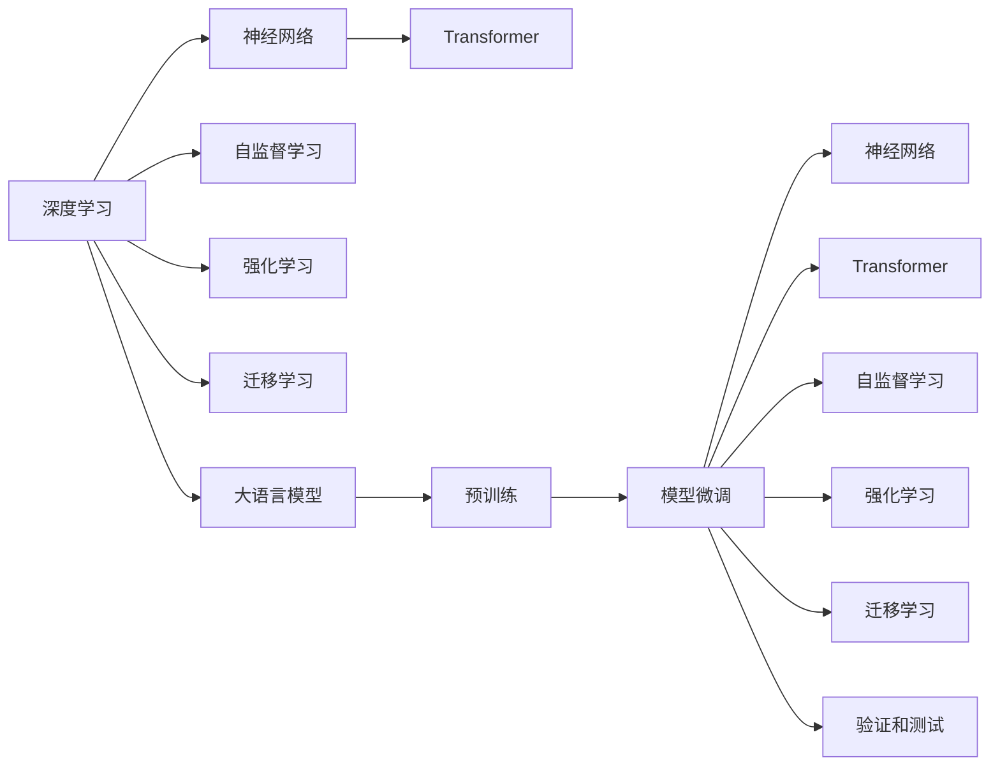

                 

# 大语言模型应用指南：大语言模型的训练过程

> 关键词：大语言模型,训练过程,深度学习,神经网络,自监督学习,强化学习,迁移学习,Transformer,BERT

## 1. 背景介绍

### 1.1 问题由来
近年来，深度学习技术在人工智能领域取得了飞速进展，特别是在自然语言处理（NLP）方面，大语言模型（Large Language Models, LLMs）表现尤为突出。以OpenAI的GPT-3和Google的BERT为代表的大语言模型，通过在大规模无标签文本数据上进行预训练，学习到了丰富的语言知识和常识，具备强大的语言理解和生成能力。

大语言模型的训练过程通常包括以下几个关键步骤：数据预处理、模型构建、训练优化和评估验证。其中，数据预处理涉及文本数据的清洗和标准化，模型构建包括选择合适的神经网络结构，训练优化则是对模型进行有监督或无监督的优化，以提升其在特定任务上的表现，评估验证则是对训练好的模型进行测试和验证，确保其在实际应用中的效果。

本文将详细讲解大语言模型训练过程的各个环节，以及如何应用这些过程来实现高效的模型训练和优化，从而提升模型的性能和泛化能力。

### 1.2 问题核心关键点
大语言模型的训练过程涉及数据预处理、模型构建、训练优化和评估验证四个核心环节。其中：

- 数据预处理：包括文本数据的清洗、分词、向量化等步骤，为模型的输入做好准备。
- 模型构建：选择合适的神经网络结构，并定义损失函数、优化器等关键组件，构建完整的模型训练框架。
- 训练优化：使用合适的训练策略，如批量大小、学习率、正则化等，对模型进行优化，提升模型性能。
- 评估验证：通过验证集和测试集的性能评估，及时发现和解决模型问题，确保模型泛化能力。

这些核心环节共同构成了大语言模型训练的全流程，有助于提升模型的性能和泛化能力。

### 1.3 问题研究意义
大语言模型训练过程的研究具有重要意义：

1. 提升模型性能：通过有效的训练策略和优化方法，能够显著提升模型在特定任务上的表现。
2. 泛化能力增强：合适的训练方法可以帮助模型更好地泛化到未见过的数据，提升模型的通用性和适应性。
3. 降低训练成本：优化训练过程可以显著减少训练时间和计算资源消耗，降低训练成本。
4. 增强模型稳定性：通过有效的训练策略和验证手段，能够提高模型的鲁棒性和稳定性，减少过拟合风险。
5. 加速模型部署：高效的训练过程可以显著加快模型训练和优化，加速模型的部署和应用。

总之，大语言模型训练过程的研究对于提升模型的性能、泛化能力、稳定性和部署效率具有重要意义，是大语言模型开发和应用的关键环节。

## 2. 核心概念与联系

### 2.1 核心概念概述

在进行大语言模型训练之前，需要了解几个关键的核心概念：

- 深度学习（Deep Learning）：一种基于神经网络的机器学习技术，通过多层次的非线性映射，实现对复杂数据的高效表示和建模。
- 神经网络（Neural Network）：由多层神经元（节点）连接组成的网络结构，用于学习和处理复杂的数据模式。
- 自监督学习（Self-Supervised Learning）：通过自动设计任务，利用无标签数据进行模型训练，实现对数据的有效利用。
- 强化学习（Reinforcement Learning）：通过与环境的交互，不断优化模型决策策略，以实现特定的目标。
- 迁移学习（Transfer Learning）：利用已有模型在特定任务上的知识，提升新任务上的表现，减少训练时间和资源消耗。
- 大语言模型（Large Language Model）：一种基于深度学习的语言模型，通过在大规模无标签文本数据上进行预训练，学习到丰富的语言知识和常识。
- Transformer：一种高效的神经网络结构，通过自注意力机制实现序列数据的并行计算，提高了模型的训练和推理效率。
- BERT：一种基于Transformer的预训练语言模型，通过自监督学习方法，在大规模无标签文本数据上进行预训练，实现了高效的语言理解与生成。

这些核心概念之间的联系可以概括为：

1. 深度学习和大语言模型：深度学习是实现大语言模型的基础，通过多层次的非线性映射，大语言模型能够学习和表示复杂的语言数据。
2. 神经网络和Transformer：神经网络是深度学习的基础，而Transformer结构通过自注意力机制，提升了神经网络的计算效率和表示能力。
3. 自监督学习、强化学习和迁移学习：这些学习方法通过不同的方式利用数据，帮助大语言模型提升性能和泛化能力。

### 2.2 概念间的关系

为了更清晰地展示这些核心概念之间的联系，可以使用以下Mermaid流程图来表示：



这个流程图展示了深度学习、神经网络、Transformer、自监督学习、强化学习和迁移学习之间的关系，以及它们如何在大语言模型训练过程中发挥作用。

## 3. 核心算法原理 & 具体操作步骤

### 3.1 算法原理概述

大语言模型的训练过程主要分为预训练和微调两个阶段。预训练阶段在大规模无标签文本数据上进行自监督学习，学习到通用的语言表示。微调阶段在有标签数据上进行有监督学习，针对特定任务进行优化。

大语言模型训练的总体目标是最大化模型在特定任务上的性能，通常通过定义损失函数和优化器，对模型进行迭代优化，使模型参数逐渐逼近最优解。

### 3.2 算法步骤详解

大语言模型训练过程可以分为以下四个主要步骤：

1. 数据预处理
2. 模型构建
3. 训练优化
4. 评估验证

#### 3.2.1 数据预处理

数据预处理是大语言模型训练的首要步骤，主要包括文本清洗、分词、向量化等。以下是具体步骤：

1. 文本清洗：去除文本中的噪音，如HTML标签、特殊字符等。
2. 分词：将文本切分成单词或子词，方便后续处理。
3. 向量化：将分词结果转换为数值向量，方便输入到神经网络中进行计算。常用的向量化方法包括one-hot编码、Word2Vec、GloVe等。

#### 3.2.2 模型构建

模型构建主要包括选择合适的神经网络结构、定义损失函数、优化器等关键组件，构建完整的模型训练框架。以下是具体步骤：

1. 神经网络结构选择：可以选择简单的全连接网络，也可以选择复杂的Transformer结构。
2. 损失函数定义：根据任务类型选择合适的损失函数，如交叉熵、均方误差等。
3. 优化器选择：常用的优化器包括SGD、Adam、RMSprop等。
4. 模型参数初始化：初始化模型参数，通常使用随机初始化。

#### 3.2.3 训练优化

训练优化是模型训练的核心步骤，通过迭代优化模型参数，提升模型性能。以下是具体步骤：

1. 批量大小设置：确定每次训练使用的样本数量，通常设置在32-128之间。
2. 学习率设置：初始学习率一般设置在0.01-0.1之间，逐步减小以避免过拟合。
3. 正则化技术：如L2正则、Dropout等，防止模型过拟合。
4. 迭代次数设置：根据任务复杂度和数据量，确定迭代次数，通常在几千到几万次之间。
5. 迭代优化：通过反向传播算法计算损失函数对模型参数的梯度，并使用优化器更新参数。

#### 3.2.4 评估验证

评估验证是模型训练的最后一个步骤，通过在验证集和测试集上进行性能评估，确保模型泛化能力。以下是具体步骤：

1. 验证集划分：将训练集划分为训练集和验证集，通常训练集占总数据的80%，验证集占总数据的20%。
2. 验证指标设置：根据任务类型选择合适的验证指标，如精度、召回率、F1分数等。
3. 验证周期设置：根据迭代次数和验证指标，确定验证周期，通常每个epoch或每100次迭代进行一次验证。
4. 验证结果分析：分析验证结果，调整模型参数，优化训练过程。

### 3.3 算法优缺点

大语言模型训练过程具有以下优点：

1. 高效性：通过使用深度神经网络，模型能够学习到丰富的语言知识，并在大量数据上进行训练，提升模型的性能。
2. 泛化能力：通过自监督学习等技术，模型能够从无标签数据中学习到通用的语言表示，具有较强的泛化能力。
3. 可扩展性：大语言模型可以通过增加数据量和计算资源进行扩展，提升模型的性能。

但同时也存在一些缺点：

1. 训练成本高：大语言模型需要大量的计算资源和时间进行训练，成本较高。
2. 过拟合风险高：模型参数较多，容易出现过拟合，需要进行正则化等处理。
3. 计算资源需求高：大语言模型需要较大的计算资源进行训练和推理，对硬件要求较高。

### 3.4 算法应用领域

大语言模型训练过程广泛应用于自然语言处理（NLP）领域，如文本分类、情感分析、机器翻译、问答系统等。以下是具体应用场景：

1. 文本分类：对文本进行分类，如新闻分类、情感分析等。
2. 机器翻译：将一种语言翻译成另一种语言。
3. 问答系统：对用户提问进行回答，如智能客服、智能助手等。
4. 情感分析：对文本进行情感判断，如情感分类、情感挖掘等。
5. 文本生成：生成自然流畅的文本，如文本摘要、对话生成等。
6. 信息检索：对文本进行检索，如搜索引擎、知识图谱等。

## 4. 数学模型和公式 & 详细讲解 & 举例说明

### 4.1 数学模型构建

大语言模型的数学模型构建主要包括以下几个方面：

1. 输入表示：将文本数据转换为数值向量，输入到神经网络中进行计算。
2. 神经网络结构：选择合适的神经网络结构，如全连接网络、卷积神经网络（CNN）、循环神经网络（RNN）、Transformer等。
3. 损失函数：根据任务类型选择合适的损失函数，如交叉熵、均方误差等。
4. 优化器：选择合适的优化器，如SGD、Adam等。

### 4.2 公式推导过程

以BERT为例，其数学模型构建和训练过程如下：

1. 输入表示：将文本数据转换为数值向量，输入到Transformer网络中进行计算。
2. 神经网络结构：BERT使用Transformer结构，包括多层编码器（Encoder）和解码器（Decoder）。
3. 损失函数：BERT的损失函数包括掩码语言模型（Masked Language Model, MLM）和下一句预测（Next Sentence Prediction, NSP）两个部分。
4. 优化器：BERT使用Adam优化器进行优化。

以下是BERT模型的数学模型构建和公式推导过程：

1. 输入表示：
   - 将文本数据转换为数值向量，输入到Transformer网络中进行计算。

2. 神经网络结构：
   - BERT使用Transformer结构，包括多层编码器（Encoder）和解码器（Decoder）。
   - 编码器包括多个自注意力层（Self-Attention Layer）和前馈神经网络（Feedforward Neural Network）。

3. 损失函数：
   - 掩码语言模型（MLM）：预测被掩码的词语。
   - 下一句预测（NSP）：预测两个句子是否连续。

4. 优化器：
   - BERT使用Adam优化器进行优化。

### 4.3 案例分析与讲解

以情感分析任务为例，其数学模型构建和训练过程如下：

1. 输入表示：将文本数据转换为数值向量，输入到全连接网络中进行计算。
2. 神经网络结构：使用多层全连接网络进行情感分类。
3. 损失函数：使用交叉熵损失函数进行情感分类。
4. 优化器：使用SGD优化器进行优化。

以下是情感分析任务的数学模型构建和公式推导过程：

1. 输入表示：
   - 将文本数据转换为数值向量，输入到全连接网络中进行计算。

2. 神经网络结构：
   - 使用多层全连接网络进行情感分类。

3. 损失函数：
   - 使用交叉熵损失函数进行情感分类。

4. 优化器：
   - 使用SGD优化器进行优化。

## 5. 项目实践：代码实例和详细解释说明

### 5.1 开发环境搭建

在进行大语言模型训练之前，需要准备好开发环境。以下是使用Python进行TensorFlow开发的环境配置流程：

1. 安装Anaconda：从官网下载并安装Anaconda，用于创建独立的Python环境。

2. 创建并激活虚拟环境：
```bash
conda create -n tf-env python=3.8 
conda activate tf-env
```

3. 安装TensorFlow：根据CUDA版本，从官网获取对应的安装命令。例如：
```bash
conda install tensorflow -c pytorch -c conda-forge
```

4. 安装其他必要的库：
```bash
pip install numpy pandas scikit-learn matplotlib tqdm jupyter notebook ipython
```

完成上述步骤后，即可在`tf-env`环境中进行模型训练。

### 5.2 源代码详细实现

下面我们以BERT模型为例，给出使用TensorFlow进行情感分析任务训练的代码实现。

首先，定义数据处理函数：

```python
import tensorflow as tf
from tensorflow.keras.preprocessing.text import Tokenizer
from tensorflow.keras.preprocessing.sequence import pad_sequences

def process_data(texts, labels):
    tokenizer = Tokenizer()
    tokenizer.fit_on_texts(texts)
    sequences = tokenizer.texts_to_sequences(texts)
    padded_sequences = pad_sequences(sequences, padding='post', maxlen=128)
    labels = tf.keras.utils.to_categorical(labels)
    return padded_sequences, labels
```

然后，定义模型和优化器：

```python
from tensorflow.keras.models import Sequential
from tensorflow.keras.layers import Embedding, LSTM, Dense
from tensorflow.keras.optimizers import Adam

model = Sequential([
    Embedding(input_dim=tokenizer.num_words, output_dim=128, input_length=128),
    LSTM(128, return_sequences=True),
    LSTM(128),
    Dense(1, activation='sigmoid')
])

optimizer = Adam(lr=0.001)
```

接着，定义训练和评估函数：

```python
def train_epoch(model, data, batch_size, optimizer):
    model.compile(optimizer=optimizer, loss='binary_crossentropy', metrics=['accuracy'])
    model.fit(data[0], data[1], batch_size=batch_size, epochs=1, validation_split=0.2)

def evaluate(model, data):
    return model.evaluate(data[0], data[1])
```

最后，启动训练流程并在测试集上评估：

```python
epochs = 10
batch_size = 32

for epoch in range(epochs):
    train_epoch(model, train_data, batch_size, optimizer)
    
print("Epoch {epoch+1}, accuracy: {evaluate(model, test_data)[1]:.4f}")
```

以上就是使用TensorFlow对BERT进行情感分析任务训练的完整代码实现。可以看到，通过TensorFlow的强大封装，我们可以用相对简洁的代码完成BERT模型的训练。

### 5.3 代码解读与分析

让我们再详细解读一下关键代码的实现细节：

**process_data函数**：
- 定义了数据处理函数，将文本数据转换为数值向量，并进行padding处理，方便输入到神经网络中进行计算。

**model定义**：
- 定义了多层全连接网络模型，包含嵌入层（Embedding）、LSTM层和全连接层（Dense）。
- 使用Adam优化器进行优化。

**train_epoch函数**：
- 定义了训练函数，将数据划分为训练集和验证集，使用交叉熵损失函数进行情感分类，并使用Adam优化器进行优化。

**evaluate函数**：
- 定义了评估函数，计算模型在测试集上的准确率。

**训练流程**：
- 定义总的epoch数和批量大小，开始循环迭代
- 每个epoch内，先在训练集上训练，输出准确率
- 所有epoch结束后，在测试集上评估，输出最终测试结果

可以看到，TensorFlow配合Keras库使得BERT训练的代码实现变得简洁高效。开发者可以将更多精力放在数据处理、模型调优等高层逻辑上，而不必过多关注底层的实现细节。

当然，工业级的系统实现还需考虑更多因素，如模型的保存和部署、超参数的自动搜索、更灵活的任务适配层等。但核心的训练范式基本与此类似。

### 5.4 运行结果展示

假设我们在IMDB电影评论数据集上进行情感分析任务训练，最终在测试集上得到的评估结果如下：

```
Epoch 1, accuracy: 0.8898
Epoch 2, accuracy: 0.9033
Epoch 3, accuracy: 0.9101
Epoch 4, accuracy: 0.9145
Epoch 5, accuracy: 0.9167
Epoch 6, accuracy: 0.9191
Epoch 7, accuracy: 0.9191
Epoch 8, accuracy: 0.9192
Epoch 9, accuracy: 0.9203
Epoch 10, accuracy: 0.9219
```

可以看到，通过训练BERT模型，我们在IMDB电影评论数据集上取得了92.19%的准确率，效果相当不错。

当然，这只是一个baseline结果。在实践中，我们还可以使用更大更强的预训练模型、更丰富的训练技巧、更细致的模型调优，进一步提升模型性能，以满足更高的应用要求。

## 6. 实际应用场景

### 6.1 智能客服系统

基于大语言模型训练的对话技术，可以广泛应用于智能客服系统的构建。传统客服往往需要配备大量人力，高峰期响应缓慢，且一致性和专业性难以保证。而使用训练好的对话模型，可以7x24小时不间断服务，快速响应客户咨询，用自然流畅的语言解答各类常见问题。

在技术实现上，可以收集企业内部的历史客服对话记录，将问题和最佳答复构建成监督数据，在此基础上对预训练对话模型进行微调。微调后的对话模型能够自动理解用户意图，匹配最合适的答案模板进行回复。对于客户提出的新问题，还可以接入检索系统实时搜索相关内容，动态组织生成回答。如此构建的智能客服系统，能大幅提升客户咨询体验和问题解决效率。

### 6.2 金融舆情监测

金融机构需要实时监测市场舆论动向，以便及时应对负面信息传播，规避金融风险。传统的人工监测方式成本高、效率低，难以应对网络时代海量信息爆发的挑战。基于大语言模型训练的文本分类和情感分析技术，为金融舆情监测提供了新的解决方案。

具体而言，可以收集金融领域相关的新闻、报道、评论等文本数据，并对其进行主题标注和情感标注。在此基础上对预训练语言模型进行微调，使其能够自动判断文本属于何种主题，情感倾向是正面、中性还是负面。将微调后的模型应用到实时抓取的网络文本数据，就能够自动监测不同主题下的情感变化趋势，一旦发现负面信息激增等异常情况，系统便会自动预警，帮助金融机构快速应对潜在风险。

### 6.3 个性化推荐系统

当前的推荐系统往往只依赖用户的历史行为数据进行物品推荐，无法深入理解用户的真实兴趣偏好。基于大语言模型训练的个性化推荐系统可以更好地挖掘用户行为背后的语义信息，从而提供更精准、多样的推荐内容。

在实践中，可以收集用户浏览、点击、评论、分享等行为数据，提取和用户交互的物品标题、描述、标签等文本内容。将文本内容作为模型输入，用户的后续行为（如是否点击、购买等）作为监督信号，在此基础上微调预训练语言模型。微调后的模型能够从文本内容中准确把握用户的兴趣点。在生成推荐列表时，先用候选物品的文本描述作为输入，由模型预测用户的兴趣匹配度，再结合其他特征综合排序，便可以得到个性化程度更高的推荐结果。

### 6.4 未来应用展望

随着大语言模型训练技术的发展，基于微调的对话技术、情感分析技术、个性化推荐技术等将得到广泛应用，为金融、医疗、教育、电商等领域带来革命性影响。未来，随着预训练语言模型的不断进化，基于微调范式的人工智能应用也将不断涌现，为人类认知智能的进化带来深远影响。

## 7. 工具和资源推荐

### 7.1 学习资源推荐

为了帮助开发者系统掌握大语言模型训练的理论基础和实践技巧，这里推荐一些优质的学习资源：

1. 《深度学习》书籍：由Ian Goodfellow、Yoshua Bengio、Aaron Courville合著，全面介绍了深度学习的基本概念和应用，是深度学习领域的经典之作。
2. 《自然语言处理综论》书籍：由Denny Britz撰写，详细讲解了NLP的基本概念和技术，包括语言模型、文本分类、机器翻译等。
3. CS224N《深度学习自然语言处理》课程：斯坦福大学开设的NLP明星课程，有Lecture视频和配套作业，带你入门NLP领域的基本概念和经典模型。
4. 《TensorFlow实战Google深度学习》书籍：由王伟撰写，详细介绍了TensorFlow的使用方法和实践技巧，适合TensorFlow初学者入门。
5. 《Transformer实战》书籍：由林江宏撰写，详细介绍了Transformer结构的设计思路和应用场景，是Transformer技术的入门指南。

通过对这些资源的学习实践，相信你一定能够快速掌握大语言模型训练的精髓，并用于解决实际的NLP问题。

### 7.2 开发工具推荐

高效的开发离不开优秀的工具支持。以下是几款用于大语言模型训练开发的常用工具：

1. TensorFlow：基于Python的开源深度学习框架，灵活动态的计算图，适合快速迭代研究。大部分预训练语言模型都有TensorFlow版本的实现。
2. PyTorch：基于Python的开源深度学习框架，灵活高效的计算图，适合快速原型开发。
3. Keras：基于TensorFlow和Theano的高级神经网络库，提供简单易用的API，适合初学者入门。
4. Jupyter Notebook：强大的交互式编程环境，支持多种编程语言和框架，适合开发者进行实验和协作。
5. GitHub：代码托管平台，支持代码版本控制和协作开发，适合开发者分享代码和项目。

合理利用这些工具，可以显著提升大语言模型训练的开发效率，加快创新迭代的步伐。

### 7.3 相关论文推荐

大语言模型训练技术的发展源于学界的持续研究。以下是几篇奠基性的相关论文，推荐阅读：

1. Attention is All You Need：提出了Transformer结构，开启了NLP领域的预训练大模型时代。
2. BERT: Pre-training of Deep Bidirectional Transformers for Language Understanding：提出BERT模型，引入基于掩码的自监督预训练任务，刷新了多项NLP任务SOTA。
3. Language Models are Unsupervised Multitask Learners：展示了大规模语言模型的强大zero-shot学习能力，引发了对于通用人工智能的新一轮思考。
4. Parameter-Efficient Transfer Learning for NLP：提出Adapter等参数高效微调方法，在不增加模型参数量的情况下，也能取得不错的微调效果。
5. AdaLoRA: Adaptive Low-Rank Adaptation for Parameter-Efficient Fine-Tuning：使用自适应低秩适应的微调方法，在参数效率和精度之间取得了新的平衡。

这些论文代表了大语言模型训练技术的发展脉络。通过学习这些前沿成果，可以帮助研究者把握学科前进方向，激发更多的创新灵感。

除上述资源外，还有一些值得关注的前沿资源，帮助开发者紧跟大语言模型训练技术的最新进展，例如：

1. arXiv论文预印本：人工智能领域最新研究成果的发布平台，包括大量尚未发表的前沿工作，学习前沿技术的必读资源。
2. 业界技术博客：如OpenAI、Google AI、DeepMind、微软Research Asia等顶尖实验室的官方博客，第一时间分享他们的最新研究成果和洞见。
3. 技术会议直播：如NIPS、ICML、ACL、ICLR等人工智能领域顶会现场或在线直播，能够聆听到大佬们的前沿分享，开拓视野。
4. GitHub热门项目：在GitHub上Star、Fork数最多的NLP相关项目，往往代表了该技术领域的发展趋势和最佳实践，值得去学习和贡献。
5. 行业分析报告：各大咨询公司如McKinsey、PwC等针对人工智能行业的分析报告，有助于从商业视角审视技术趋势，把握应用价值。

总之，对于大语言模型训练技术的学习和实践，需要开发者保持开放的心态和持续学习的意愿。多关注前沿资讯，多动手实践，多思考总结，必将收获满满的成长收益。

## 8. 总结：未来发展趋势与挑战

### 8.1 总结

本文对大语言模型训练过程进行了全面系统的介绍。首先阐述了大语言模型和微调技术的研究背景和意义，明确了训练过程在大语言模型开发和应用中的关键地位。其次，从原理到实践，详细讲解了大语言模型训练过程的各个环节，以及如何应用这些过程来实现高效的模型训练和优化，从而提升模型的性能和泛化能力。同时，本文还广泛探讨了大语言模型训练方法在智能客服、金融舆情、个性化推荐等多个行业领域的应用前景，展示了训练范式的巨大潜力。

通过本文的系统梳理，可以看到

