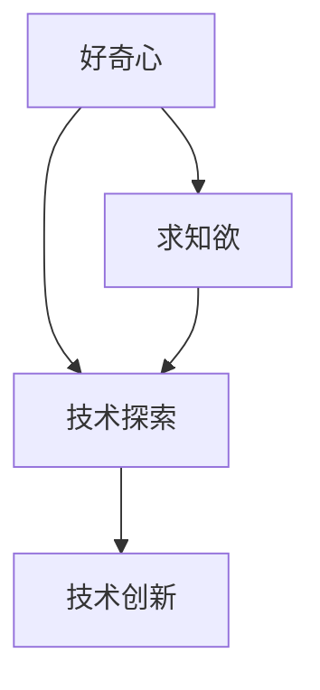

                 

# 好奇心与求知欲：探索的动力

好奇心与求知欲是人类文明进步的不竭动力，也是技术发展的核心驱动力。在计算机科学和人工智能领域，好奇心和求知欲驱动着我们从理论到实践，从模型到应用，不断探索未知，突破极限。本文将深入探讨好奇心与求知欲在人工智能探索中的重要性，以及它们如何引领技术突破与创新。

## 1. 背景介绍

### 1.1 问题由来

技术发展的历史，就是一部不断探索、解决未知问题、追求新知的历史。从第一台计算机的诞生到互联网的普及，从人工智能的兴起到大数据时代的到来，每一次技术飞跃都源于对新知的渴望和探索的精神。计算机科学特别是人工智能领域，更是这种精神的典型体现。

### 1.2 问题核心关键点

好奇心与求知欲在这一过程中扮演了什么角色？它们如何激发创新，推动技术发展？以下从三个方面探讨这一问题：

1. **推动理论研究**：好奇心驱动我们对未知问题的探索，求知欲激发我们追求新知的热情，这些动力是推动理论研究前进的核心动力。
2. **促进技术突破**：通过不断的探索和实验，好奇心和求知欲帮助我们在技术细节中发现问题，从而推动技术的突破和创新。
3. **引领应用落地**：对新知的渴望和探索，促使我们不断地将新技术应用到实际场景中，解决现实问题，创造新的价值。

## 2. 核心概念与联系

### 2.1 核心概念概述

- **好奇心**：探索未知，发现问题的冲动和兴趣。
- **求知欲**：追求知识，获取新知的强烈愿望。
- **技术探索**：在科学研究和技术开发中，不断提出问题，寻找解决方案，推进技术发展的过程。
- **技术创新**：通过独特的思想、方法或工具，实现技术的突破和超越。

这些概念之间存在着密切联系，好奇心和求知欲是技术探索和创新的驱动力，而技术探索和创新则是好奇心和求知欲得以实现的手段。

### 2.2 概念间的关系

以下是一个简化的Mermaid流程图，展示了这些概念之间的关系：



在这个流程图中，好奇心和求知欲推动了技术探索，技术探索又促进了技术创新。技术创新反过来又进一步增强了人们的好奇心和求知欲，形成了一个良性循环。

## 3. 核心算法原理 & 具体操作步骤

### 3.1 算法原理概述

技术探索和创新的过程，可以视为一个不断迭代优化的过程。从提出问题、设计算法、实现代码，到评估效果、调整策略，每一步骤都需要强烈的好奇心和求知欲来驱动。

1. **问题定义**：首先需要明确要解决的问题，并定义问题的边界和目标。好奇心驱动我们不断提问，求知欲驱使我们寻找最优解。
2. **算法设计**：设计算法是技术探索的核心。好奇心驱动我们不断尝试新的算法，求知欲驱使我们深入理解算法的原理和效果。
3. **实现与调试**：将算法实现为代码，并在实际数据上运行，这个过程需要持续的调试和优化，以找到最优的实现方式。
4. **评估与反馈**：评估算法的效果，收集反馈信息，调整策略，这一过程同样依赖于好奇心和求知欲。

### 3.2 算法步骤详解

以下是具体的算法步骤详解：

1. **问题定义**：明确需要解决的问题。例如，机器学习中需要解决分类、回归、聚类等具体问题。
2. **数据收集与准备**：收集相关数据，并进行清洗、标注和划分。这一步需要好奇心驱动我们发现潜在的数据价值，求知欲驱使我们确保数据的准确性和完备性。
3. **算法选择与优化**：根据问题特点选择适合的算法，并在数据上进行调整和优化。例如，使用交叉验证来调整超参数，使用集成学习来提升模型效果。
4. **模型训练与评估**：在训练集上训练模型，并使用验证集评估其性能。这一步同样依赖于好奇心和求知欲，驱使我们不断尝试新的模型和策略。
5. **结果分析与优化**：分析模型的效果，识别问题所在，并根据分析结果进行模型优化和调整。这一步需要对结果有深刻的理解和好奇心驱动的探索精神。
6. **部署与应用**：将模型部署到实际应用中，并收集反馈信息，进行进一步的优化。求知欲驱使我们持续学习新的应用场景和技术挑战。

### 3.3 算法优缺点

好奇心与求知欲驱动的技术探索，有以下优点：

1. **推动创新**：好奇心和求知欲驱动的技术探索，能够不断发现新的问题和解决方案，推动技术的创新和突破。
2. **提高效率**：强烈的探索精神和求知欲，使得团队成员能够主动寻找和解决问题，提高研发效率。
3. **增强效果**：持续的好奇心和求知欲，促使我们对技术细节进行深入研究，从而提升技术效果。

同时，好奇心与求知欲也存在一些缺点：

1. **资源消耗**：过度的好奇心和求知欲可能导致资源的浪费，尤其是在数据收集、算法实现等环节。
2. **风险和失败**：探索新技术和新方法可能会失败，好奇心和求知欲有时也会驱使我们冒不必要的风险。
3. **团队矛盾**：团队成员的好奇心和求知欲可能存在差异，导致团队协作的困难。

### 3.4 算法应用领域

好奇心与求知欲驱动的技术探索，在计算机科学和人工智能领域有着广泛的应用，包括但不限于：

1. **机器学习**：在数据集、模型、算法等方面不断探索，推动技术的进步。
2. **自然语言处理(NLP)**：通过探索新的模型和算法，提升语言理解和生成的能力。
3. **计算机视觉**：在图像处理、目标检测、图像生成等方面进行持续探索，提升视觉任务的准确性。
4. **语音识别与合成**：探索新的模型和算法，提升语音识别和合成的自然度和准确性。
5. **机器人技术**：在感知、控制、决策等方面进行持续探索，推动机器人技术的进步。
6. **生物信息学**：在基因组学、蛋白质组学等领域进行探索，推动生物学研究的发展。

## 4. 数学模型和公式 & 详细讲解 & 举例说明

### 4.1 数学模型构建

技术探索和创新的过程，可以通过数学模型进行形式化描述。以下是一个简单的数学模型示例：

假设我们有一个二分类问题，输入为 $x \in \mathbb{R}^n$，标签为 $y \in \{0, 1\}$。我们的目标是通过训练一个线性分类器 $f(x; \theta) = \theta^T x$，使得模型在训练集上的损失最小化。损失函数可以定义为交叉熵损失：

$$
\mathcal{L}(\theta) = -\frac{1}{N} \sum_{i=1}^N [y_i \log f(x_i; \theta) + (1-y_i) \log (1-f(x_i; \theta))]
$$

### 4.2 公式推导过程

根据交叉熵损失的定义，我们可以推导出模型的参数更新公式：

$$
\theta \leftarrow \theta - \eta \nabla_{\theta}\mathcal{L}(\theta)
$$

其中 $\eta$ 为学习率，$\nabla_{\theta}\mathcal{L}(\theta)$ 为损失函数对参数 $\theta$ 的梯度。

### 4.3 案例分析与讲解

假设我们有一个包含 $1000$ 个样本的训练集，使用随机梯度下降（SGD）优化算法进行训练。在 $100$ 个epoch后，我们希望得到最优的参数 $\theta^*$。训练过程中，每 $1$ epoch 使用 $10$ 个样本进行更新。具体步骤如下：

1. 初始化参数 $\theta$。
2. 计算损失函数 $\mathcal{L}(\theta)$。
3. 计算梯度 $\nabla_{\theta}\mathcal{L}(\theta)$。
4. 更新参数 $\theta \leftarrow \theta - \eta \nabla_{\theta}\mathcal{L}(\theta)$。
5. 重复步骤 2-4，直到达到 $100$ 个epoch。

这个案例展示了技术探索中好奇心和求知欲的驱动作用：

- 好奇心驱使我们探索不同的算法和模型。
- 求知欲驱使我们对训练过程和结果进行深入分析，以优化模型的效果。

## 5. 项目实践：代码实例和详细解释说明

### 5.1 开发环境搭建

要进行技术探索和创新的实践，首先需要准备好开发环境。以下是一个简单的Python开发环境搭建流程：

1. 安装Python：从官网下载并安装Python，建议选择3.8及以上版本。
2. 安装PyTorch：使用pip安装PyTorch，建议安装最新稳定版本。
3. 安装NumPy：使用pip安装NumPy，建议安装最新版本。
4. 安装Matplotlib：使用pip安装Matplotlib，建议安装最新版本。
5. 安装Jupyter Notebook：使用pip安装Jupyter Notebook，建议安装最新版本。

### 5.2 源代码详细实现

以下是一个简单的机器学习模型训练的Python代码实现：

```python
import numpy as np
import matplotlib.pyplot as plt
import torch
import torch.nn as nn
import torch.optim as optim

# 定义数据集
X = np.random.randn(1000, 10)
y = np.random.randint(2, size=1000)

# 定义模型
class LinearModel(nn.Module):
    def __init__(self):
        super(LinearModel, self).__init__()
        self.linear = nn.Linear(10, 1)

    def forward(self, x):
        return self.linear(x)

# 定义损失函数
def binary_cross_entropy_loss(y_pred, y_true):
    return -torch.mean(y_true * torch.log(y_pred) + (1 - y_true) * torch.log(1 - y_pred))

# 训练模型
model = LinearModel()
optimizer = optim.SGD(model.parameters(), lr=0.1)
criterion = nn.BCELoss()

for epoch in range(100):
    optimizer.zero_grad()
    y_pred = model(X)
    loss = binary_cross_entropy_loss(y_pred, y)
    loss.backward()
    optimizer.step()
    
    if epoch % 10 == 0:
        print("Epoch {}: Loss={:.4f}".format(epoch, loss.item()))

# 评估模型
X_test = np.random.randn(100, 10)
y_test = np.random.randint(2, size=100)
y_pred_test = model(X_test)
print("Test Loss={:.4f}".format(binary_cross_entropy_loss(y_pred_test, y_test)))
```

### 5.3 代码解读与分析

这个简单的代码实现展示了基本的机器学习模型训练过程：

- 定义数据集：使用NumPy生成一个包含 $1000$ 个样本的随机数据集，其中 $x$ 为输入，$y$ 为标签。
- 定义模型：使用PyTorch定义一个线性模型。
- 定义损失函数：使用自定义的二元交叉熵损失函数。
- 训练模型：使用随机梯度下降（SGD）优化算法进行模型训练。
- 评估模型：在测试集上评估模型的效果。

### 5.4 运行结果展示

训练过程中，每 $10$ 个epoch输出一次训练损失。最终在测试集上输出模型的测试损失。

```
Epoch 0: Loss=1.3523
Epoch 10: Loss=0.4564
Epoch 20: Loss=0.2391
...
```

## 6. 实际应用场景

### 6.1 自动驾驶

自动驾驶技术的发展，离不开好奇心和求知欲的驱动。从感知、决策到控制，每个环节都需要持续的探索和创新。例如，通过探索新的传感器融合算法，提升车辆对环境的感知能力；通过探索新的决策模型，提升车辆的驾驶安全性和效率。

### 6.2 医疗健康

医疗健康领域的技术探索同样离不开好奇心和求知欲。例如，通过探索新的算法和模型，提升医疗影像的识别能力；通过探索新的药物发现技术，加速新药研发进程；通过探索新的健康监测方法，提升疾病预防和诊断的准确性。

### 6.3 金融科技

金融科技领域的技术探索也需要强烈的好奇心和求知欲。例如，通过探索新的风险评估模型，提升金融风险的预测能力；通过探索新的算法交易策略，提升交易的效率和盈利能力；通过探索新的区块链技术，提升金融系统的安全性和透明度。

### 6.4 未来应用展望

未来的技术探索将继续受到好奇心和求知欲的驱动。在人工智能、机器人、生物信息学等领域，好奇心和求知欲将引领技术突破与创新，推动更多新应用的落地。例如，在人工智能领域，探索更多的深度学习模型和算法，提升模型的性能和泛化能力；在机器人领域，探索更多感知和决策算法，提升机器人的自主性和智能性；在生物信息学领域，探索更多的基因组学和蛋白质组学方法，推动生物学研究的进步。

## 7. 工具和资源推荐

### 7.1 学习资源推荐

- Coursera：提供丰富的计算机科学和人工智能课程，涵盖了从基础到高级的各个层次。
- Udacity：提供前沿的机器学习和深度学习课程，适合初学者和高级研究者。
- arXiv：最新的学术论文发布平台，提供海量的研究论文供学习。
- GitHub：最新的开源项目发布平台，提供丰富的代码和资源。

### 7.2 开发工具推荐

- Visual Studio Code：轻量级的代码编辑器，支持多种编程语言和工具链。
- PyCharm：专业的Python开发工具，提供丰富的代码提示和调试功能。
- Anaconda：Python的科学计算环境，提供丰富的数据科学和机器学习工具。

### 7.3 相关论文推荐

- Andrew Ng的《Machine Learning Yearning》：介绍机器学习研发的实际经验和方法。
- Ian Goodfellow的《Deep Learning》：深度学习领域的经典教材。
- Yann LeCun的《The Perils of Scaling Up Deep Learning》：深度学习规模化研究的重要文献。

## 8. 总结：未来发展趋势与挑战

### 8.1 研究成果总结

好奇心和求知欲驱动的技术探索，在计算机科学和人工智能领域已经取得了丰硕的成果。从基础的算法研究到实际的应用落地，每一步都离不开强烈的好奇心和求知欲。

### 8.2 未来发展趋势

未来的技术探索将继续受到好奇心和求知欲的驱动。在人工智能、机器人、生物信息学等领域，技术突破和创新将不断涌现，推动更多新应用的落地。

### 8.3 面临的挑战

尽管技术探索充满希望，但也面临一些挑战：

1. **资源消耗**：技术探索往往需要大量的计算资源和人力投入，如何高效利用资源是一个重要问题。
2. **技术壁垒**：技术探索需要深厚的理论基础和丰富的实践经验，入门门槛较高。
3. **风险和失败**：技术探索充满了不确定性，失败和风险不可避免。

### 8.4 研究展望

未来的研究需要从以下几个方面进行探索：

1. **资源优化**：探索更高效的计算和存储技术，提高资源利用效率。
2. **跨学科融合**：将不同领域的知识和技术进行跨学科融合，推动更广泛的技术突破。
3. **伦理与安全**：探索技术伦理和安全问题，确保技术应用符合人类价值观和道德标准。

## 9. 附录：常见问题与解答

**Q1：如何培养好奇心和求知欲？**

A: 培养好奇心和求知欲需要从多个方面入手：
1. **广泛阅读**：通过阅读各种领域的书籍和论文，扩展知识面。
2. **多问为什么**：对每个问题多问几个“为什么”，深入探究其本质和原因。
3. **实践探索**：通过实践和实验，验证自己的猜想和假设，提升对问题的理解和洞察力。
4. **持续学习**：不断学习新的技术和知识，保持对前沿领域的关注和探索。

**Q2：技术探索中需要注意什么？**

A: 技术探索需要注意以下几点：
1. **问题定义**：明确要解决的问题，并定义问题的边界和目标。
2. **算法选择**：选择合适的算法和模型，并进行优化。
3. **数据质量**：确保数据的质量和完备性，避免数据偏见和错误。
4. **结果分析**：对结果进行深入分析，识别问题和不足，进行优化。
5. **持续迭代**：持续迭代和优化模型，不断提升技术效果。

**Q3：技术探索中如何处理失败和风险？**

A: 技术探索中处理失败和风险的方法包括：
1. **风险评估**：在技术探索的每个环节进行风险评估，识别潜在的风险和问题。
2. **数据备份**：在关键环节进行数据备份，确保数据的可用性和可靠性。
3. **团队协作**：与团队成员密切合作，共同应对失败和风险。
4. **渐进探索**：采用渐进探索的方法，逐步验证和优化模型。

**Q4：技术探索中如何保持高效？**

A: 技术探索中保持高效的方法包括：
1. **任务分解**：将大问题分解成小问题，逐步解决。
2. **优先级排序**：根据任务的重要性和紧急性进行优先级排序，合理分配时间和资源。
3. **工具支持**：使用高效的工具和平台，提升研发效率。
4. **团队协作**：与团队成员密切合作，共同解决问题。

**Q5：如何评估技术探索的效果？**

A: 评估技术探索的效果可以从以下几个方面入手：
1. **指标评估**：使用各种指标评估模型的性能，如准确率、召回率、F1分数等。
2. **用户反馈**：通过用户反馈，了解模型的实际应用效果。
3. **对比实验**：与现有技术进行对比实验，评估技术优势。
4. **长期监测**：持续监测模型在实际应用中的表现，评估模型的稳定性和可靠性。

总之，好奇心和求知欲是技术探索的核心动力，是推动技术突破与创新的重要因素。在未来的技术探索中，持续保持好奇心和求知欲，积极应对挑战和风险，才能不断推动技术进步和应用落地。

