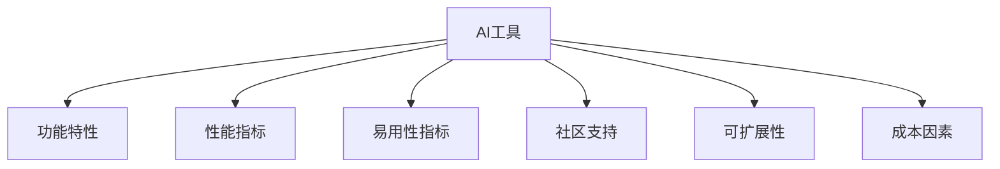
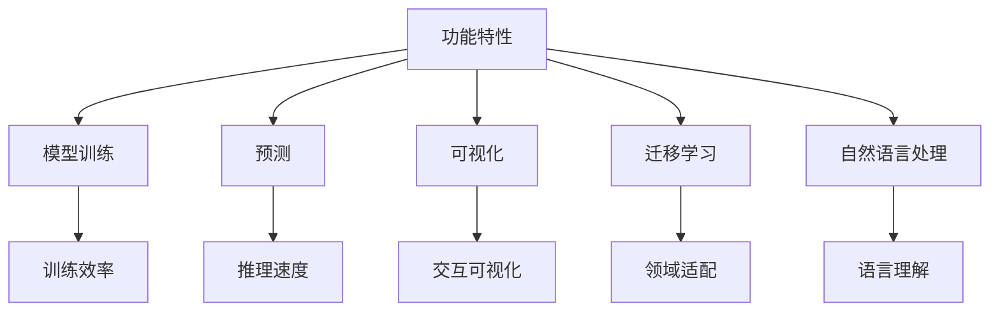
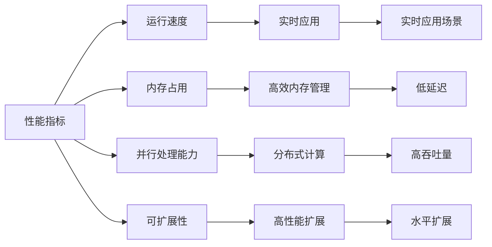
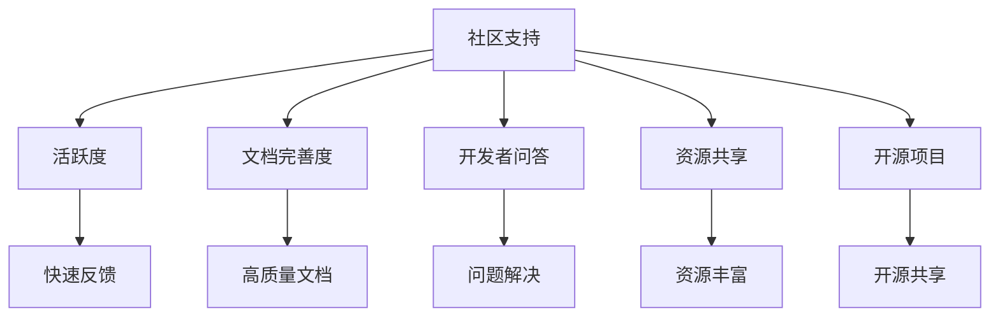

                 

## 1. 背景介绍

### 1.1 问题由来

在AI领域，选择适合自己的AI工具是至关重要的。随着人工智能技术的快速发展，各种AI工具如雨后春笋般涌现，如何选择适合自己项目需求的AI工具，成为了摆在开发者面前的一个难题。不同的AI工具各有优缺点，选择合适的工具，不仅可以提高开发效率，还能提升项目的整体质量。

### 1.2 问题核心关键点

选择合适的AI工具，需要考虑以下几个关键点：

- **需求适配性**：工具的功能是否满足项目需求。
- **性能表现**：工具的运行速度和处理能力。
- **易用性**：工具的使用难度和开发门槛。
- **社区支持**：工具的社区活跃度和技术支持。
- **可扩展性**：工具的可扩展性和未来升级潜力。
- **成本**：工具的使用成本和开源性。

### 1.3 问题研究意义

选择适合自己的AI工具，对于提升项目的开发效率、优化项目质量、降低开发成本具有重要意义。正确的工具选择不仅能够提高开发效率，还能使开发过程更加流畅，提升项目的整体质量。

## 2. 核心概念与联系

### 2.1 核心概念概述

为更好地理解如何选择适合自己的AI工具，本节将介绍几个密切相关的核心概念：

- **AI工具**：包括各种开源框架、商业库、在线平台等，用于解决特定问题的AI工具。
- **功能特性**：AI工具提供的功能和特性，如模型训练、预测、可视化等。
- **性能指标**：衡量AI工具性能的关键指标，如运行速度、处理能力、内存占用等。
- **易用性指标**：工具的使用难度、文档完善度、代码示例等。
- **社区支持**：社区活跃度、开发者问答、资源共享等。
- **可扩展性**：工具的可扩展性和未来升级潜力。
- **成本因素**：开源免费、商业许可等成本因素。

这些核心概念之间的逻辑关系可以通过以下Mermaid流程图来展示：



这个流程图展示了几类AI工具的基本属性，以及它们之间的相互关系。

### 2.2 概念间的关系

这些核心概念之间存在着紧密的联系，形成了选择AI工具的完整生态系统。下面我们通过几个Mermaid流程图来展示这些概念之间的关系。

#### 2.2.1 AI工具的核心属性



这个流程图展示了AI工具核心属性的分布，以及它们如何协同工作。

#### 2.2.2 性能指标与易用性



这个流程图展示了性能指标与易用性之间的关系，以及它们如何影响AI工具的使用场景。

#### 2.2.3 社区支持与成本



这个流程图展示了社区支持与成本之间的关系，以及它们如何影响AI工具的可靠性和可维护性。

### 2.3 核心概念的整体架构

最后，我们用一个综合的流程图来展示这些核心概念在大语言模型微调过程中的整体架构：

```mermaid
graph TB
    A[功能特性] --> B[模型训练]
    A --> C[预测]
    A --> D[可视化]
    A --> E[迁移学习]
    A --> F[自然语言处理]
    B --> G[训练效率]
    C --> H[推理速度]
    D --> I[交互可视化]
    E --> J[领域适配]
    F --> K[语言理解]
    G --> L[运行速度]
    H --> M[处理能力]
    I --> N[用户友好]
    J --> O[应用场景]
    K --> P[语言模型]
    L --> Q[硬件要求]
    M --> R[资源消耗]
    N --> S[易用性]
    O --> T[领域专业性]
    P --> U[预训练模型]
    Q --> V[硬件需求]
    R --> W[内存占用]
    S --> X[工具成本]
    T --> Y[领域覆盖]
    U --> Z[预训练数据]
    V --> AA[计算资源]
    W --> AB[资源分配]
    X --> AC[成本因素]
    Y --> AD[领域深度]
    Z --> AE[数据多样性]
    AA --> AF[计算资源需求]
    AB --> AG[资源优化]
    AC --> AH[成本预算]
    AD --> AI[领域应用]
    AE --> AJ[数据处理]
    AF --> AK[资源优化]
    AG --> AL[优化策略]
    AH --> AM[成本控制]
    AI --> AN[应用范围]
    AJ --> AO[数据适配]
    AK --> AP[性能优化]
    AL --> AQ[优化措施]
    AM --> AR[成本管理]
    AN --> AS[应用场景]
    AO --> AT[数据处理能力]
    AP --> AU[性能优化]
    AQ --> AV[优化实践]
    AR --> AW[成本管理]
    AS --> AX[应用范围]
    AT --> AY[数据处理能力]
    AU --> AZ[性能优化]
    AV --> BA[优化实践]
    AW --> BB[成本管理]
    AX --> CA[应用场景]
    AY --> CB[数据处理能力]
    AZ --> CC[性能优化]
    BA --> CD[优化实践]
    BB --> BE[成本管理]
    CA --> CF[应用场景]
    CB --> CG[数据处理能力]
    CD --> CE[优化实践]
    CE --> CF[优化实践]
    CF --> CH[优化措施]
    CH --> CI[成本管理]
    CI --> CJ[应用场景]
    CJ --> CK[数据处理能力]
    CK --> CL[性能优化]
    CL --> CM[优化实践]
    CM --> CN[成本管理]
    CN --> CO[应用场景]
    CP --> CR[数据处理能力]
    CR --> CS[性能优化]
    CS --> CT[优化实践]
    CT --> CU[成本管理]
    CU --> CV[应用场景]
    CV --> CW[数据处理能力]
    CW --> CX[性能优化]
    CX --> CY[优化实践]
    CY --> CZ[成本管理]
    CZ --> DA[应用场景]
    DA --> DB[数据处理能力]
    DB --> DC[性能优化]
    DC --> DD[优化实践]
    DD --> DE[成本管理]
    DE --> DF[应用场景]
    DF --> DG[数据处理能力]
    DG --> DH[性能优化]
    DH --> DI[优化实践]
    DI --> DJ[成本管理]
    DJ --> DK[应用场景]
    DK --> DL[数据处理能力]
    DL --> DM[性能优化]
    DM --> DN[优化实践]
    DN --> DO[成本管理]
    DO --> DP[应用场景]
    DP --> DQ[数据处理能力]
    DQ --> DR[性能优化]
    DR --> DS[优化实践]
    DS --> DT[成本管理]
    DT --> DU[应用场景]
    DU --> DV[数据处理能力]
    DV --> DW[性能优化]
    DW --> DX[优化实践]
    DX --> DY[成本管理]
    DY --> DZ[应用场景]
    DZ --> EA[数据处理能力]
    EA --> EB[性能优化]
    EB --> EC[优化实践]
    EC --> ED[成本管理]
    ED --> EE[应用场景]
    EE --> EF[数据处理能力]
    EF --> EG[性能优化]
    EG --> EH[优化实践]
    EH --> EI[成本管理]
    EI --> EJ[应用场景]
    EJ --> EK[数据处理能力]
    EK --> EL[性能优化]
    EL --> EM[优化实践]
    EM --> EN[成本管理]
    EN --> EO[应用场景]
    EO --> EP[数据处理能力]
    EP --> EQ[性能优化]
    EQ --> ER[优化实践]
    ER --> ES[成本管理]
    ES --> ET[应用场景]
    ET --> EU[数据处理能力]
    EU --> EV[性能优化]
    EV --> EW[优化实践]
    EW --> EX[成本管理]
    EX --> EY[应用场景]
    EY --> EZ[数据处理能力]
    EZ --> FA[性能优化]
    FA --> FB[优化实践]
    FB --> FC[成本管理]
    FC --> FD[应用场景]
    FD --> FE[数据处理能力]
    FE --> FF[性能优化]
    FF --> FG[优化实践]
    FG --> FH[成本管理]
    FH --> FI[应用场景]
    FI --> FJ[数据处理能力]
    FJ --> FK[性能优化]
    FK --> FL[优化实践]
    FL --> FM[成本管理]
    FM --> FN[应用场景]
    FN --> FO[数据处理能力]
    FO --> FP[性能优化]
    FP --> FQ[优化实践]
    FQ --> FR[成本管理]
    FR --> FS[应用场景]
    FS --> FT[数据处理能力]
    FT --> FU[性能优化]
    FU --> FV[优化实践]
    FV --> FW[成本管理]
    FW --> FX[应用场景]
    FX --> FY[数据处理能力]
    FY --> FZ[性能优化]
    FZ --> GA[优化实践]
    GA --> GB[成本管理]
    GB --> GC[应用场景]
    GC --> GD[数据处理能力]
    GD --> GE[性能优化]
    GE --> GF[优化实践]
    GF --> GG[成本管理]
    GG --> GH[应用场景]
    GH --> GI[数据处理能力]
    GI --> GJ[性能优化]
    GJ --> GK[优化实践]
    GK --> GL[成本管理]
    GL --> GM[应用场景]
    GM --> GN[数据处理能力]
    GN --> GO[性能优化]
    GO --> GP[优化实践]
    GP --> GQ[成本管理]
    GQ --> GR[应用场景]
    GR --> GS[数据处理能力]
    GS --> GT[性能优化]
    GT --> GU[优化实践]
    GU --> GW[成本管理]
    GW --> GX[应用场景]
    GX --> Gy[数据处理能力]
    Gy --> Gz[性能优化]
    Gz --> H[优化实践]
    H --> I[成本管理]
    I --> J[应用场景]
    J --> K[数据处理能力]
    K --> L[性能优化]
    L --> M[优化实践]
    M --> N[成本管理]
    N --> O[应用场景]
    O --> P[数据处理能力]
    P --> Q[性能优化]
    Q --> R[优化实践]
    R --> S[成本管理]
    S --> T[应用场景]
    T --> U[数据处理能力]
    U --> V[性能优化]
    V --> W[优化实践]
    W --> X[成本管理]
    X --> Y[应用场景]
    Y --> Z[数据处理能力]
    Z --> AA[性能优化]
    AA --> AB[优化实践]
    AB --> AC[成本管理]
    AC --> AD[应用场景]
    AD --> AE[数据处理能力]
    AE --> AF[性能优化]
    AF --> AG[优化实践]
    AG --> AH[成本管理]
    AH --> AI[应用场景]
    AI --> AJ[数据处理能力]
    AJ --> AK[性能优化]
    AK --> AL[优化实践]
    AL --> AM[成本管理]
    AM --> AN[应用场景]
    AN --> AO[数据处理能力]
    AO --> AP[性能优化]
    AP --> AQ[优化实践]
    AQ --> AR[成本管理]
    AR --> AS[应用场景]
    AS --> AT[数据处理能力]
    AT --> AU[性能优化]
    AU --> AV[优化实践]
    AV --> AW[成本管理]
    AW --> AX[应用场景]
    AX --> AY[数据处理能力]
    AY --> AZ[性能优化]
    AZ --> BA[优化实践]
    BA --> BB[成本管理]
    BB --> BC[应用场景]
    BC --> BD[数据处理能力]
    BD --> BE[性能优化]
    BE --> BF[优化实践]
    BF --> BG[成本管理]
    BG --> BH[应用场景]
    BH --> BI[数据处理能力]
    BI --> BJ[性能优化]
    BJ --> BK[优化实践]
    BK --> BL[成本管理]
    BL --> BM[应用场景]
    BM --> BN[数据处理能力]
    BN --> BO[性能优化]
    BO --> BP[优化实践]
    BP --> BQ[成本管理]
    BQ --> BR[应用场景]
    BR --> BS[数据处理能力]
    BS --> BT[性能优化]
    BT --> BU[优化实践]
    BU --> BV[成本管理]
    BV --> BW[应用场景]
    BW --> BX[数据处理能力]
    BX --> BY[性能优化]
    BY --> BZ[优化实践]
    BZ --> CA[成本管理]
    CA --> CB[应用场景]
    CB --> CC[数据处理能力]
    CC --> CD[性能优化]
    CD --> CE[优化实践]
    CE --> CF[成本管理]
    CF --> CG[应用场景]
    CG --> CH[数据处理能力]
    CH --> CI[性能优化]
    CI --> CJ[优化实践]
    CJ --> CK[成本管理]
    CK --> CL[应用场景]
    CL --> CM[数据处理能力]
    CM --> CN[性能优化]
    CN --> CO[优化实践]
    CO --> CP[成本管理]
    CP --> CQ[应用场景]
    CQ --> CR[数据处理能力]
    CR --> CS[性能优化]
    CS --> CT[优化实践]
    CT --> CU[成本管理]
    CU --> CV[应用场景]
    CV --> CW[数据处理能力]
    CW --> CX[性能优化]
    CX --> CY[优化实践]
    CY --> CZ[成本管理]
    CZ --> DA[应用场景]
    DA --> DB[数据处理能力]
    DB --> DC[性能优化]
    DC --> DD[优化实践]
    DD --> DE[成本管理]
    DE --> DF[应用场景]
    DF --> DG[数据处理能力]
    DG --> DH[性能优化]
    DH --> DI[优化实践]
    DI --> DJ[成本管理]
    DJ --> DK[应用场景]
    DK --> DL[数据处理能力]
    DL --> DM[性能优化]
    DM --> DN[优化实践]
    DN --> DO[成本管理]
    DO --> DP[应用场景]
    DP --> DQ[数据处理能力]
    DQ --> DR[性能优化]
    DR --> DS[优化实践]
    DS --> DT[成本管理]
    DT --> DU[应用场景]
    DU --> DV[数据处理能力]
    DV --> DW[性能优化]
    DW --> DX[优化实践]
    DX --> DY[成本管理]
    DY --> DZ[应用场景]
    DZ --> EA[数据处理能力]
    EA --> EB[性能优化]
    EB --> EC[优化实践]
    EC --> ED[成本管理]
    ED --> EE[应用场景]
    EE --> EF[数据处理能力]
    EF --> EG[性能优化]
    EG --> EH[优化实践]
    EH --> EI[成本管理]
    EI --> EJ[应用场景]
    EJ --> EK[数据处理能力]
    EK --> EL[性能优化]
    EL --> EM[优化实践]
    EM --> EN[成本管理]
    EN --> EO[应用场景]
    EO --> EP[数据处理能力]
    EP --> EQ[性能优化]
    EQ --> ER[优化实践]
    ER --> ES[成本管理]
    ES --> ET[应用场景]
    ET --> EU[数据处理能力]
    EU --> EV[性能优化]
    EV --> EW[优化实践]
    EW --> EX[成本管理]
    EX --> EY[应用场景]
    EY --> EZ[数据处理能力]
    EZ --> FA[性能优化]
    FA --> FB[优化实践]
    FB --> FC[成本管理]
    FC --> FD[应用场景]
    FD --> FE[数据处理能力]
    FE --> FF[性能优化]
    FF --> FG[优化实践]
    FG --> FH[成本管理]
    FH --> FI[应用场景]
    FI --> FJ[数据处理能力]
    FJ --> FK[性能优化]
    FK --> FL[优化实践]
    FL --> FM[成本管理]
    FM --> FN[应用场景]
    FN --> FO[数据处理能力]
    FO --> FP[性能优化]
    FP --> FQ[优化实践]
    FQ --> FR[成本管理]
    FR --> FS[应用场景]
    FS --> FT[数据处理能力]
    FT --> FU[性能优化]
    FU --> FV[优化实践]
    FV --> FW[成本管理]
    FW --> FX[应用场景]
    FX --> FY[数据处理能力]
    FY --> FZ[性能优化]
    FZ --> GA[优化实践]
    GA --> GB[成本管理]
    GB --> GC[应用场景]
    GC --> GD[数据处理能力]
    GD --> GE[性能优化]
    GE --> GF[优化实践]
    GF --> GH[成本管理]
    GH --> GI[应用场景]
    GI --> GJ[数据处理能力]
    GJ --> GK[性能优化]
    GK --> GL[优化实践]
    GL --> GM[成本管理]
    GM --> GN[应用场景]
    GN --> GO[数据处理能力]
    GO --> GP[性能优化]
    GP --> GQ[优化实践]
    GQ --> GR[成本管理]
    GR --> GS[应用场景]
    GS --> GT[数据处理能力]
    GT --> GU[性能优化]
    GU --> GW[优化实践]
    GW --> GX[成本管理]
    GX --> Gy[数据处理能力]
    Gy --> Gz[性能优化]
    Gz --> H[优化实践]
    H --> I[成本管理]
    I --> J[应用场景]
    J --> K[数据处理能力]
    K --> L[性能优化]
    L --> M[优化实践]
    M --> N[成本管理]
    N --> O[应用场景]
    O --> P[数据处理能力]
    P --> Q[性能优化]
    Q --> R[优化实践]
    R --> S[成本管理]
    S --> T[应用场景]
    T --> U[数据处理能力]
    U --> V[性能优化]
    V --> W[优化实践]
    W --> X[成本管理]
    X --> Y[应用场景]
    Y --> Z[数据处理能力]
    Z --> AA[性能优化]
    AA --> AB[优化实践]
    AB --> AC[成本管理]
    AC --> AD[应用场景]
    AD --> AE[数据处理能力]
    AE --> AF[性能优化]
    AF --> AG[优化实践]
    AG --> AH[成本管理]
    AH --> AI[应用场景]
    AI --> AJ[数据处理能力]
    AJ --> AK[性能优化]
    AK --> AL[优化实践]
    AL --> AM[成本管理]
    AM --> AN[应用场景]
    AN --> AO[数据处理能力]
    AO --> AP[性能优化]
    AP --> AQ[优化实践]
    AQ --> AR[成本管理]
    AR --> AS[应用场景]
    AS --> AT[数据处理能力]
    AT --> AU[性能优化]
    AU --> AV[优化实践]
    AV --> AW[成本管理]
    AW --> AX[应用场景]
    AX --> AY[数据处理能力]
    AY --> AZ[性能优化]
    AZ --> BA[优化实践]
    BA --> BB[成本管理]
    BB --> BC[应用场景]
    BC --> BD[数据处理能力]
    BD --> BE[性能优化]
    BE --> BF[优化实践]
    BF --> BG[成本管理]
    BG --> BH[应用场景]
    BH --> BI[数据处理能力]
    BI --> BJ[性能优化]
    BJ --> BK[优化实践]
    BK --> BL[成本管理]
    BL --> BM[应用场景]
    BM --> BN[数据处理能力]
    BN --> BO[性能优化]
    BO --> BP[优化实践]
    BP --> BQ[成本管理]
    BQ --> BR[应用场景]
    BR --> BS[数据处理能力]
    BS --> BT[性能优化]
    BT --> BU[优化实践]
    BU --> BV[成本管理]
    BV --> BW[应用场景]
    BW --> BX[数据处理能力]
    BX --> BY[性能优化]
    BY --> BZ[优化实践]
    BZ --> CA[成本管理]
    CA --> CB[应用场景]
    CB --> CC[数据处理能力]
    CC --> CD[性能优化]
    CD --> CE[优化实践]
    CE --> CF[成本管理]
    CF --> CG[应用场景]
    CG --> CH[数据处理能力]
    CH --> CI[性能优化]
    CI --> CJ[优化实践]
    CJ --> CK[成本管理]
    CK --> CL[应用场景]
    CL --> CM[数据处理能力]
    CM --> CN[性能优化]
    CN --> CO[优化实践]
    CO --> CP[成本管理]
    CP --> CQ[应用场景]
    CQ --> CR[数据处理能力]
    CR --> CS[性能优化]
    CS --> CT[优化实践]
    CT --> CU[成本管理]
    CU --> CV[应用场景]
    CV --> CW[数据处理能力]
    CW --> CX[性能优化]
    CX --> CY[优化实践]
    CY --> CZ[成本管理]
    CZ --> DA[应用场景]
    DA --> DB[数据处理能力]
    DB --> DC[性能优化]
    DC --> DD[优化实践]
    DD --> DE[成本管理]
    DE --> DF[应用场景]
    DF --> DG[数据处理能力]
    DG --> DH[性能优化]
    DH --> DI[优化实践]
    DI --> DJ[成本管理]
    DJ --> DK[应用场景]
    DK --> DL[数据处理能力]
    DL --> DM[性能优化]
    DM --> DN[优化实践]
    DN --> DO[成本管理]
    DO --> DP[应用场景]
    DP --> DQ[数据处理能力]
    DQ --> DR[性能优化]
    DR --> DS[优化实践]
    DS --> DT[成本管理]
    DT --> DU[应用场景]
    DU --> DV[数据处理能力]
    DV --> DW[性能优化]
    DW --> DX[优化实践]
    DX --> DY[成本管理]
    DY --> DZ[应用场景]
    DZ --> EA[数据处理能力]
    EA --> EB[性能优化]
    EB --> EC[优化实践]
    EC --> ED[成本管理]
    ED --> EE[应用场景]
    EE --> EF[数据处理能力]
    EF --> EG[性能优化]
    EG --> EH[优化实践]
    EH --> EI[成本管理]
    EI --> EJ[应用场景]
    EJ --> EK[数据处理能力]
    EK --> EL[性能优化]
    EL --> EM[优化实践]
    EM --> EN[成本管理]
    EN --> EO[应用场景]
    EO --> EP[数据处理能力]
    EP --> EQ[性能优化]
    EQ --> ER[优化实践]
    ER --> ES[成本管理]
    ES --> ET[应用场景]
    ET --> EU[数据处理能力]
    EU --> EV[性能优化]
    EV --> EW[优化实践]
    EW --> EX[成本管理]
    EX --> EY[应用场景]
    EY --> EZ[数据处理能力]
    EZ --> FA[性能优化]
    FA --> FB[优化实践]
    FB --> FC[成本管理]
    FC --> FD[应用场景]
    FD --> FE[数据处理能力]
    FE --> FF[性能优化]
    FF --> FG[优化实践]
    FG --> FH[成本管理]
    FH --> FI[应用场景]
    FI --> FJ[数据处理能力]
    FJ --> FK[性能优化]
    FK --> FL[优化实践]
    FL --> FM[成本管理]
    FM --> FN[应用场景]
    FN --> FO[数据处理能力]
    FO --> FP[性能优化]
    FP --> FQ[优化实践]
    FQ --> FR[成本管理]
    FR --> FS[应用场景]
    FS --> FT[数据处理能力]
    FT --> FU[性能优化]
    FU --> FV[优化实践]
    FV --> FW[成本管理]
    FW --> FX[应用场景]
    FX --> FY[数据处理能力]
    FY --> FZ[性能优化]
    FZ --> GA[优化实践]
    GA --> GB[成本管理]
    GB --> GC[应用场景]
    GC --> GD[数据处理能力]
    GD --> GE[性能优化]
    GE --> GF[优化实践]
    GF --> GH[成本管理]
    GH --> GI[应用场景]
    GI --> GJ[数据处理能力]
    GJ --> GK[性能优化]
    GK --> GL[优化实践]
    GL --> GM[成本管理]
    GM --> GN[应用场景]


