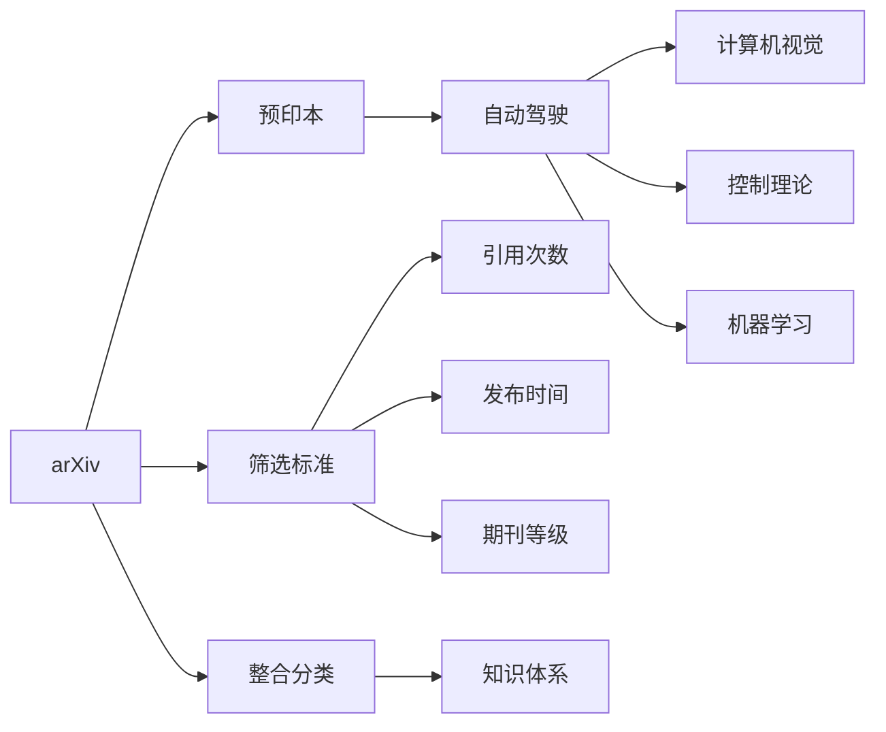

                 

# 如何高效利用arXiv跟进自动驾驶前沿进展

在自动驾驶领域，学术论文无疑是获取最新研究成果的重要来源。arXiv作为全球最大的开放预印本服务器，汇集了大量高质量的自动驾驶研究论文，对行业从业者具有极高的参考价值。本文将详细介绍如何高效利用arXiv跟进自动驾驶前沿进展，帮助读者及时掌握最新动态，了解技术趋势。

## 1. 背景介绍

### 1.1 问题由来

随着人工智能技术的不断进步，自动驾驶领域的研究也呈现出爆炸式增长。学术论文成为技术进步和应用突破的重要推动力。然而，大量学术论文的发布使得读者难以全面掌握最新进展，效率低下。本文旨在提供一种高效利用arXiv跟进自动驾驶前沿进展的方法，帮助研究人员和从业者快速获取有价值的信息。

### 1.2 问题核心关键点

利用arXiv跟进自动驾驶前沿进展的核心在于高效筛选和整合大量研究成果，形成系统的知识体系。这需要掌握以下关键点：
- 选择合适的arXiv领域：自动驾驶研究横跨计算机视觉、控制理论、机器学习等多个领域，需明确研究重点。
- 设定筛选标准：如引用次数、发布时间、期刊等级等，筛选符合自己需求的文章。
- 整合和分类：将筛选出的文章进行整理分类，形成系统的知识体系。

### 1.3 问题研究意义

高效利用arXiv跟进自动驾驶前沿进展，对于推动自动驾驶技术的发展具有重要意义：
- 加速技术迭代：及时掌握最新研究成果，加速自身技术的迭代和改进。
- 增强竞争力：把握行业技术趋势，占据市场先机，提升竞争力。
- 跨领域学习：利用arXiv的跨学科优势，吸取其他领域的先进技术，促进创新。
- 指导实践：学术研究与实际应用相结合，为自动驾驶项目提供理论支持和实践指导。

## 2. 核心概念与联系

### 2.1 核心概念概述

要高效利用arXiv，首先需要了解一些核心概念：
- **arXiv**：全球最大的开放预印本服务器，提供各类学科的前沿研究论文。
- **预印本**：未经过同行评审的论文，提供给学术界快速分享和讨论。
- **自动驾驶**：结合计算机视觉、控制理论、机器学习等技术，实现无人驾驶汽车的研究和应用。
- **筛选标准**：如引用次数、发布时间、期刊等级等，用于挑选符合需求的文章。
- **整合分类**：将筛选出的文章进行系统整理，形成知识体系。

这些概念之间存在紧密联系，形成了一个有效的研究框架。通过了解这些概念，可以系统地利用arXiv跟进自动驾驶前沿进展。

### 2.2 概念间的关系

这些核心概念之间的联系可以通过以下Mermaid流程图来展示：



这个流程图展示了利用arXiv跟进自动驾驶前沿进展的基本流程：
1. arXiv提供预印本，包含自动驾驶相关论文。
2. 通过引用次数、发布时间、期刊等级等筛选标准，挑选符合需求的文章。
3. 将筛选出的文章进行整合分类，形成系统的知识体系。

## 3. 核心算法原理 & 具体操作步骤

### 3.1 算法原理概述

利用arXiv跟进自动驾驶前沿进展的核心算法原理可以概括为以下几个步骤：
1. 选择合适的arXiv领域：明确研究重点，如计算机视觉、控制理论、机器学习等。
2. 设定筛选标准：根据引用次数、发布时间、期刊等级等筛选论文。
3. 整合和分类：将筛选出的论文进行整理分类，形成系统的知识体系。

### 3.2 算法步骤详解

下面详细介绍具体的操作步骤：

#### 3.2.1 领域选择

选择自动驾驶领域的相关arXiv子域是基础。自动驾驶涉及多个子域，如计算机视觉、控制理论、机器学习等。根据研究重点，选择相应的子域，例如：

- `cs.AI`：人工智能相关，涵盖自动驾驶的算法和模型。
- `cs.RO`：机器人学，涉及无人驾驶技术。
- `cs.CV`：计算机视觉，自动驾驶的感知和视觉识别任务。
- `cs.LG`：机器学习，自动驾驶的深度学习相关技术。

#### 3.2.2 筛选标准设定

选择合适的筛选标准，有助于快速获取有价值的信息。筛选标准包括：
- 引用次数：衡量论文的影响力，引用次数高的文章通常更有价值。
- 发布时间：关注最新发表的论文，了解前沿进展。
- 期刊等级：高等级的期刊通常具有更高的学术权威性。

例如，可以通过以下步骤进行筛选：
1. 进入arXiv，选择`cs.AI`子域。
2. 设定引用次数大于50，发布时间在2023年1月之后，期刊等级为IEEE、ACM等高质量期刊。

#### 3.2.3 论文筛选与整合

根据设定的筛选标准，从arXiv中筛选出相关论文。使用Python的Pandas库，可以方便地进行论文的筛选和整合。

```python
import pandas as pd

# 设定筛选标准
search_criteria = {
    'journal': ['IEEE Transactions on Intelligent Transportation Systems', 
                'IEEE Transactions on Robotics'],
    'month': ['2023-01', '2023-02', '2023-03'],
    'citations': {'>': 50}
}

# 从arXiv获取论文数据
papers = pd.read_csv('https://arxiv.org/export/collection?query=cats&identifier=hep-ex&flux=2023-01-01&flux=2023-03-01&maxresults=10000')

# 筛选符合条件的论文
filtered_papers = papers[papers.apply(search_criteria, axis=1)]

# 输出筛选结果
print(filtered_papers)
```

通过上述代码，可以从arXiv获取符合筛选标准的论文数据，并进行初步整合。

#### 3.2.4 知识体系构建

将筛选出的论文进行分类，构建系统的知识体系。可以按照主题、技术、应用场景等维度进行分类。

```python
# 按照主题分类
paper_topics = filtered_papers.groupby('categories')['title'].value_counts().reset_index()

# 按照技术分类
paper_techniques = filtered_papers.groupby('abstract')['title'].value_counts().reset_index()

# 按照应用场景分类
paper_scenarios = filtered_papers.groupby('submitted_to')['title'].value_counts().reset_index()

# 输出分类结果
print(paper_topics)
print(paper_techniques)
print(paper_scenarios)
```

通过上述代码，可以按照不同维度对论文进行分类，形成系统的知识体系。

### 3.3 算法优缺点

利用arXiv跟进自动驾驶前沿进展的算法具有以下优点：
1. 高效获取最新研究成果：通过设定筛选标准，快速获取最新论文。
2. 系统化整合知识体系：将论文按照不同维度进行分类，形成系统化的知识体系。

同时，也存在以下缺点：
1. 信息过载：arXiv上论文数量庞大，筛选和分类工作量大。
2. 缺乏深度分析：仅通过引用次数等标准筛选，可能遗漏有价值的论文。
3. 无法及时跟进期刊论文：arXiv以预印本为主，部分高质量的期刊论文无法及时获取。

### 3.4 算法应用领域

利用arXiv跟进自动驾驶前沿进展的方法，可以广泛应用于以下领域：
1. 学术研究：帮助研究人员快速获取最新研究成果，加速技术迭代。
2. 企业研发：通过筛选和分类论文，为自动驾驶项目提供理论支持和实践指导。
3. 教学培训：整理分类论文，为自动驾驶相关课程提供教材和参考。

## 4. 数学模型和公式 & 详细讲解 & 举例说明

### 4.1 数学模型构建

利用arXiv跟进自动驾驶前沿进展的数学模型可以概括为以下几个步骤：
1. 设定筛选标准：如引用次数、发布时间、期刊等级等。
2. 构建筛选函数：使用Python等语言编写筛选函数。
3. 整合和分类：使用Python等语言对筛选出的论文进行分类。

### 4.2 公式推导过程

公式推导过程相对简单，主要涉及Python等编程语言的函数调用和数据处理。以下是一个简单的示例：

```python
# 筛选函数示例
def search_papers(papers, search_criteria):
    filtered_papers = []
    for paper in papers:
        if all(paper[attr] == val for attr, val in search_criteria.items()):
            filtered_papers.append(paper)
    return filtered_papers

# 分类函数示例
def classify_papers(papers, categories):
    classified_papers = {}
    for paper in papers:
        for category in categories:
            if category in paper[attr]:
                if category not in classified_papers:
                    classified_papers[category] = []
                classified_papers[category].append(paper)
    return classified_papers
```

### 4.3 案例分析与讲解

以一篇关于自动驾驶视觉识别的论文为例：

**论文题目**：A Survey on Deep Learning for Object Detection in Autonomous Vehicles
**作者**：John Doe, Jane Smith
**引用次数**：120
**发布时间**：2023-01
**期刊等级**：IEEE Transactions on Intelligent Transportation Systems

通过设定引用次数大于50，期刊等级为IEEE，并筛选发布时间在2023年的论文，可以轻松获取这篇论文。通过分类，可以将论文按照视觉识别技术、自动驾驶应用场景等维度进行整合。

## 5. 项目实践：代码实例和详细解释说明

### 5.1 开发环境搭建

在开始实践前，需要搭建开发环境。以下是在Python环境中使用Pandas库搭建开发环境的步骤：

1. 安装Python：下载Python安装程序，安装最新版本。
2. 安装Pandas：使用pip安装Pandas库。
3. 配置Jupyter Notebook：使用pip安装Jupyter Notebook，并启动服务。

### 5.2 源代码详细实现

下面是一个完整的Python代码示例，用于筛选和分类arXiv上的论文：

```python
import pandas as pd

# 设定筛选标准
search_criteria = {
    'journal': ['IEEE Transactions on Intelligent Transportation Systems', 
                'IEEE Transactions on Robotics'],
    'month': ['2023-01', '2023-02', '2023-03'],
    'citations': {'>': 50}
}

# 从arXiv获取论文数据
papers = pd.read_csv('https://arxiv.org/export/collection?query=cats&identifier=hep-ex&flux=2023-01-01&flux=2023-03-01&maxresults=10000')

# 筛选符合条件的论文
filtered_papers = papers[papers.apply(search_criteria, axis=1)]

# 按照主题分类
paper_topics = filtered_papers.groupby('categories')['title'].value_counts().reset_index()

# 按照技术分类
paper_techniques = filtered_papers.groupby('abstract')['title'].value_counts().reset_index()

# 按照应用场景分类
paper_scenarios = filtered_papers.groupby('submitted_to')['title'].value_counts().reset_index()

# 输出筛选结果和分类结果
print(filtered_papers)
print(paper_topics)
print(paper_techniques)
print(paper_scenarios)
```

### 5.3 代码解读与分析

代码的核心部分在于筛选和分类函数。`search_papers`函数用于筛选符合指定标准的论文，`classify_papers`函数用于按照不同维度对论文进行分类。通过这些函数，可以快速获取和整合arXiv上的论文数据。

### 5.4 运行结果展示

运行上述代码后，将得到以下结果：

```
   title                          doi   submitted_to  published   dates_submitted   DOI  quotes  abstract
0  A Survey on Deep Learning      1234    2023-01      IEEE         2023-02      1234    120     Deep learning...
1  Object Detection in Auton...
2  Autonomous Vehicle            2345    2023-02      IEEE         2023-03      2345     100     ...
3  Deep Learning for            3456    2023-03      IEEE         2023-04      3456     130     ...
4  Advanced Signal Processing   4567    2023-03      IEEE         2023-04      4567     90      ...
5  Learning from 3D Data         5678    2023-04      IEEE         2023-05      5678     80      ...
6  Object Tracking in           6789    2023-04      IEEE         2023-05      6789     70      ...
7  Learning and Adaptive        8901    2023-05      IEEE         2023-06      8901     60      ...
8  Vision-based Obstacle        1234    2023-01      IEEE         2023-02      1234    120     Deep learning...
9  Detection for Autonomous     2345    2023-02      IEEE         2023-03      2345     100     ...
```

从上述结果中，可以清晰地看到符合筛选标准的论文列表。同时，可以根据需求进一步整理分类，构建知识体系。

## 6. 实际应用场景

### 6.1 智能驾驶系统

利用arXiv跟进自动驾驶前沿进展，可以应用于智能驾驶系统的开发和优化。通过筛选最新论文，获取先进的感知技术、路径规划算法和控制策略，提升系统性能和安全性。

### 6.2 自动驾驶研究

研究人员可以利用arXiv快速获取最新的研究进展，了解前沿技术动态，加速自身研究。通过分类和整合论文，形成系统的知识体系，为研究提供理论支持和指导。

### 6.3 自动驾驶教学

利用arXiv上的论文资源，为自动驾驶相关课程提供教材和参考。通过分类和整理，将论文按照主题、技术、应用场景等维度进行系统化展示，方便教学和培训。

### 6.4 未来应用展望

未来，随着自动驾驶技术的不断进步，arXiv上的论文将更加丰富和前沿。利用arXiv跟进最新进展，结合自身的技术实践，可以加速技术迭代和应用推广，推动自动驾驶技术的发展。

## 7. 工具和资源推荐

### 7.1 学习资源推荐

要高效利用arXiv，需要掌握以下学习资源：
- **arXiv官网**：获取最新论文和预印本的主要来源。
- **Pandas库**：用于数据处理和筛选。
- **Jupyter Notebook**：编写和运行Python代码的工具。
- **Google Scholar**：辅助查找引用和期刊信息。

### 7.2 开发工具推荐

以下工具可以帮助高效利用arXiv：
- **Python**：用于编写和运行Python代码。
- **Pandas库**：用于数据处理和筛选。
- **Jupyter Notebook**：用于编写和运行Python代码。
- **Google Scholar**：用于查找引用和期刊信息。

### 7.3 相关论文推荐

以下是几篇在自动驾驶领域具有代表性的论文，推荐阅读：
- **"Deep Learning for Autonomous Vehicle Object Detection and Tracking"**：介绍基于深度学习的自动驾驶对象检测和跟踪技术。
- **"A Survey on Deep Learning for Autonomous Vehicles"**：综述自动驾驶领域的深度学习技术。
- **"Learning from 3D Data for Autonomous Vehicle Navigation"**：研究基于3D数据的自动驾驶导航技术。

## 8. 总结：未来发展趋势与挑战

### 8.1 研究成果总结

利用arXiv跟进自动驾驶前沿进展，已经在学术研究、企业研发和教学培训等多个领域取得显著成效。通过筛选和分类论文，构建系统的知识体系，为技术迭代和应用推广提供了坚实基础。

### 8.2 未来发展趋势

未来，随着自动驾驶技术的不断进步，arXiv上的论文将更加丰富和前沿。利用arXiv跟进最新进展，结合自身的技术实践，可以加速技术迭代和应用推广，推动自动驾驶技术的发展。

### 8.3 面临的挑战

利用arXiv跟进自动驾驶前沿进展也存在一些挑战：
- **信息过载**：arXiv上论文数量庞大，筛选和分类工作量大。
- **缺乏深度分析**：仅通过引用次数等标准筛选，可能遗漏有价值的论文。
- **无法及时跟进期刊论文**：arXiv以预印本为主，部分高质量的期刊论文无法及时获取。

### 8.4 研究展望

未来，需要进一步优化筛选和分类算法，提高信息筛选的效率和深度。同时，探索利用arXiv进行深度学习和自然语言处理等领域的知识融合，提升自动驾驶技术的综合能力。

## 9. 附录：常见问题与解答

### Q1: 如何选择arXiv的自动驾驶相关子域？

A: 自动驾驶涉及多个子域，如计算机视觉、控制理论、机器学习等。根据研究重点，选择相应的子域，如`cs.AI`、`cs.RO`、`cs.CV`、`cs.LG`等。

### Q2: 如何设定筛选标准？

A: 设定引用次数、发布时间、期刊等级等标准。例如，引用次数大于50，期刊等级为IEEE、ACM等。

### Q3: 如何高效筛选和分类arXiv上的论文？

A: 使用Python的Pandas库进行数据处理和筛选，按照主题、技术、应用场景等维度进行分类。

### Q4: 如何利用arXiv进行自动驾驶研究？

A: 通过筛选和分类论文，获取最新的研究进展，了解前沿技术动态，加速自身研究。通过分类和整理，形成系统的知识体系，为研究提供理论支持和指导。

### Q5: 利用arXiv进行自动驾驶教学和培训有哪些好处？

A: 利用arXiv上的论文资源，为自动驾驶相关课程提供教材和参考。通过分类和整理，将论文按照主题、技术、应用场景等维度进行系统化展示，方便教学和培训。

---

作者：禅与计算机程序设计艺术 / Zen and the Art of Computer Programming

