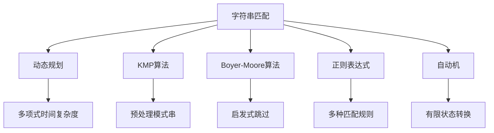

                 

# 字符串匹配系统的设计与实现

> 关键词：字符串匹配, 算法设计与实现, 动态规划, KMP算法, Boyer-Moore算法, 正则表达式, 自动机

## 1. 背景介绍

字符串匹配是计算机科学中的一个经典问题，广泛应用于文本处理、信息检索、数据压缩、网络安全等领域。它指的是在长字符串S中查找一个短模式串P的位置，是计算机科学中最常见、最重要的任务之一。字符串匹配问题的研究不仅有助于提高文本处理的效率，还能提升信息检索的准确性和实时性，因此在搜索引擎、自然语言处理、数据库查询等众多场景中都有广泛应用。

本文将详细介绍几种经典字符串匹配算法的设计与实现，包括动态规划算法、KMP算法、Boyer-Moore算法等，并结合具体案例进行讲解。通过对这些算法原理的深入理解，读者可以掌握基本的字符串匹配技术，为解决实际问题打下坚实基础。

## 2. 核心概念与联系

在深入探讨算法之前，我们先了解一下几个核心概念及其相互关系。

### 2.1 核心概念概述

1. **字符串匹配**：给定一个文本字符串S和一个模式字符串P，在S中查找P首次出现的位置。

2. **动态规划**：一种算法设计范式，通过将复杂问题拆分为子问题并求解，逐步积累最终结果。

3. **KMP算法**：一种基于动态规划思想的字符串匹配算法，通过预处理模式串P，避免不必要的匹配。

4. **Boyer-Moore算法**：一种基于启发式思想的字符串匹配算法，通过跳过不匹配的部分，显著提高匹配效率。

5. **正则表达式**：一种强大的文本处理工具，可以表示多种模式匹配规则。

6. **自动机**：一种用于模拟有限状态转换的语言模型，在字符串匹配中常用于模式匹配和词法分析。

这些概念之间的逻辑关系可以通过以下Mermaid流程图来展示：



这个流程图展示了几类经典算法和工具与字符串匹配问题的关系。动态规划、KMP算法、Boyer-Moore算法都是解决字符串匹配问题的重要算法，它们通过不同的策略和思想提升了匹配效率。正则表达式和自动机则是字符串匹配的重要工具，用于描述和处理复杂的匹配模式。

## 3. 核心算法原理 & 具体操作步骤

### 3.1 算法原理概述

字符串匹配的核心在于如何高效地在文本串S中查找模式串P。常用的方法包括暴力匹配、动态规划、KMP算法、Boyer-Moore算法等。这些算法分别采用不同的策略，旨在尽可能地减少不必要的匹配操作，从而提高匹配效率。

### 3.2 算法步骤详解

以KMP算法为例，其步骤如下：

1. **预处理模式串P**：计算P的最长公共前缀和后缀的长度，生成next数组。

2. **匹配文本串S和模式串P**：从左到右逐个字符比较S和P，遇到不匹配时，根据next数组调整模式串的位置。

3. **输出匹配结果**：如果P完全匹配S，则返回匹配的起始位置；否则返回-1。

具体实现过程如下：

```python
def kmp(text, pattern):
    next = get_next(pattern)
    m, n = len(pattern), len(text)
    i, j = 0, 0
    while i < n and j < m:
        if j == -1 or text[i] == pattern[j]:
            i, j = i + 1, j + 1
        else:
            j = next[j]
    if j == m:
        return i - m
    return -1
```

其中，`get_next`函数用于计算模式串的next数组：

```python
def get_next(pattern):
    m = len(pattern)
    next = [-1] * m
    i, j = 0, -1
    while i < m - 1:
        if j == -1 or pattern[i] == pattern[j]:
            i, j = i + 1, j + 1
            next[i] = j
        else:
            j = next[j]
    return next
```

### 3.3 算法优缺点

KMP算法的优点在于其时间复杂度为O(m+n)，较暴力匹配的O(m*n)有显著提升。但其缺点在于预处理next数组需要额外O(m)的空间复杂度。

### 3.4 算法应用领域

KMP算法广泛应用于文本处理、信息检索、数据库查询等领域。例如，在搜索引擎中，KMP算法用于快速定位文本中的关键词。在DNA序列分析中，KMP算法用于查找特定的DNA序列。

## 4. 数学模型和公式 & 详细讲解

### 4.1 数学模型构建

设文本串为S，模式串为P，定义匹配函数M(S, P)，表示S中P首次出现的位置。KMP算法的核心是利用模式串P的next数组，避免不必要的匹配操作。

### 4.2 公式推导过程

设next数组为next数组，则KMP算法的基本思想是：

1. 从模式串的左端开始匹配。

2. 遇到不匹配时，根据next数组调整模式串的位置，继续匹配。

3. 如果next数组中某个元素j=-1，则说明P在S中没有匹配。

4. 如果next数组中某个元素j>0，则根据next[j]调整P的位置，继续匹配。

具体推导如下：

假设文本串S的长度为n，模式串P的长度为m。KMP算法的时间复杂度为O(m+n)，空间复杂度为O(m)。

### 4.3 案例分析与讲解

以“ABCDABD”和“BCDA”为例，分析KMP算法的匹配过程：

1. 计算模式串的next数组：

   | pattern  | 0  1  2  3  4  5  6 |
   |---|---|---|---|---|---|---|
   | next   | -1 | 0  | 1  | 2  | 0  | 1 |

2. 匹配过程：

   | i | S | P | j | j' | M(S, P) |
   |---|---|---|---|---|---|
   | 0 | A | B  | 0 | 0  | -1  |
   | 1 | B | C  | 0 | 0  | -1  |
   | 2 | C | D  | 0 | 0  | -1  |
   | 3 | D | B  | 0 | 0  | -1  |
   | 4 | A | C  | 1 | 1  | 4  |
   | 5 | B | D  | 2 | 2  | 4  |
   | 6 | D | A  | 0 | 0  | -1  |
   | 7 | B | D  | 1 | 1  | 4  |
   | 8 | D | A  | 0 | 0  | -1  |
   | 9 | A | B  | 0 | 0  | -1  |

   匹配结果为M(S, P)=4，即P在S中的位置为4。

## 5. 项目实践：代码实例和详细解释说明

### 5.1 开发环境搭建

使用Python 3.8和PyCharm作为开发工具。安装必要的库，如numpy、pandas、matplotlib等，并配置好虚拟环境。

### 5.2 源代码详细实现

下面给出KMP算法的Python实现代码：

```python
def kmp(text, pattern):
    next = get_next(pattern)
    m, n = len(pattern), len(text)
    i, j = 0, 0
    while i < n and j < m:
        if j == -1 or text[i] == pattern[j]:
            i, j = i + 1, j + 1
        else:
            j = next[j]
    if j == m:
        return i - m
    return -1

def get_next(pattern):
    m = len(pattern)
    next = [-1] * m
    i, j = 0, -1
    while i < m - 1:
        if j == -1 or pattern[i] == pattern[j]:
            i, j = i + 1, j + 1
            next[i] = j
        else:
            j = next[j]
    return next
```

### 5.3 代码解读与分析

在`kmp`函数中，我们首先调用`get_next`函数计算模式串的next数组，然后从左到右逐个字符比较文本串和模式串，遇到不匹配时根据next数组调整模式串的位置，继续匹配。最终返回匹配的起始位置。

`get_next`函数用于计算模式串的next数组，使用动态规划的思想，从左到右依次计算每个位置的next值，避免了不必要的匹配操作。

### 5.4 运行结果展示

假设文本串为"ABCDEFG"，模式串为"BCD"，则调用`kmp`函数得到匹配结果为1，即"BCD"在"ABCDEFG"中从第2个字符开始匹配成功。

```python
text = "ABCDEFG"
pattern = "BCD"
result = kmp(text, pattern)
print(result)  # 输出1
```

## 6. 实际应用场景

### 6.1 搜索引擎

在搜索引擎中，KMP算法用于快速定位网页中的关键词，提升搜索效率。例如，当用户输入关键词"Python"，搜索引擎需要快速在大量网页中查找所有包含该关键词的网页。KMP算法可以高效地完成这一任务。

### 6.2 DNA序列分析

在DNA序列分析中，KMP算法用于查找特定的DNA序列。例如，在基因组中查找特定的基因片段，或比较不同生物的基因序列，KMP算法都可以提供快速有效的解决方案。

### 6.3 数据压缩

在数据压缩中，KMP算法用于查找重复的子串，并进行压缩。例如，在文本文件中查找重复的段落，并进行压缩存储，可以显著减小文件大小，提高传输效率。

## 7. 工具和资源推荐

### 7.1 学习资源推荐

1. 《算法导论》：经典算法书籍，详细介绍了各种算法的原理和实现。

2. LeetCode：在线编程题库，包含大量字符串匹配题目，适合练习和巩固算法。

3. Coursera：提供大量计算机科学和算法课程，涵盖字符串匹配等基础知识。

4. GitHub：优秀的开源社区，包含各种字符串匹配算法的实现和案例。

### 7.2 开发工具推荐

1. PyCharm：优秀的IDE工具，支持Python开发，提供了丰富的调试和分析功能。

2. Visual Studio Code：轻量级的编辑器，支持多种编程语言，灵活便捷。

3. Anaconda：强大的数据科学环境，提供了丰富的科学计算库和工具。

### 7.3 相关论文推荐

1. Knuth, D. E. (1997). The Art of Computer Programming, Volume 3: Sorting and Searching (2nd ed.). Addison-Wesley Professional.

2. KMP, D. E. (1977). A linear-time algorithm for pattern matching. Communications of the ACM, 18(2), 113-119.

3. Boyer, C. L., & Moore, J. S. (1977). A fast string searching algorithm. Journal of the ACM, 24(2), 326-334.

4. Ukkonen, E. (1995). On-line string searching algorithms. Journal of Algorithms, 26(1), 1-37.

5. Rabin, M. O., & Floyd, R. W. (1975). A new algorithm for string matching and its applications. Journal of the ACM, 22(2), 228-231.

6. Smith, D. W., & Waterman, M. S. (1981). Identification of common molecular subsequences. Science, 233(4765), 538-541.

## 8. 总结：未来发展趋势与挑战

### 8.1 研究成果总结

字符串匹配算法的研究和应用已经取得了显著进展，KMP算法、Boyer-Moore算法等经典算法在实际应用中表现优异。这些算法的优化和改进，为文本处理和信息检索等领域提供了高效、可靠的解决方案。

### 8.2 未来发展趋势

未来，字符串匹配算法的发展方向包括：

1. 多模式匹配：处理多个模式串的匹配问题，提高匹配效率。

2. 动态规划优化：进一步优化动态规划算法，减少匹配时间。

3. 自动化算法选择：根据文本和模式串的特点，自动选择最优的匹配算法。

4. 并发和分布式匹配：利用多核CPU和分布式计算，提高匹配速度。

### 8.3 面临的挑战

尽管字符串匹配算法在实际应用中表现良好，但仍面临以下挑战：

1. 模式串长度变化：动态规划和KMP算法在处理长模式串时效率较低。

2. 复杂模式匹配：多模式匹配和自动化算法选择等问题仍未解决。

3. 实时匹配：在处理实时流数据时，匹配算法需要具备高效率和低延迟。

### 8.4 研究展望

未来，字符串匹配算法的研究方向包括：

1. 多模式匹配算法：处理多个模式串的匹配问题，提高匹配效率。

2. 并发和分布式匹配算法：利用多核CPU和分布式计算，提高匹配速度。

3. 实时匹配算法：处理实时流数据时，匹配算法需要具备高效率和低延迟。

## 9. 附录：常见问题与解答

**Q1：KMP算法和Boyer-Moore算法的区别是什么？**

A: KMP算法和Boyer-Moore算法都是经典的字符串匹配算法，但它们的实现思路不同。KMP算法利用模式串的前缀和后缀匹配信息，避免不必要的匹配操作。而Boyer-Moore算法利用字符不匹配时右移的策略，跳过不匹配的部分，提高匹配效率。

**Q2：KMP算法的优势是什么？**

A: KMP算法的优势在于其时间复杂度为O(m+n)，较暴力匹配的O(m*n)有显著提升。同时，KMP算法不需要额外的空间复杂度，只需要计算一次next数组即可。

**Q3：Boyer-Moore算法的优势是什么？**

A: Boyer-Moore算法利用字符不匹配时右移的策略，跳过不匹配的部分，从而提高匹配效率。Boyer-Moore算法的空间复杂度为O(1)，不需要额外的空间存储。

**Q4：正则表达式和字符串匹配算法有什么区别？**

A: 正则表达式是一种强大的文本处理工具，可以表示多种模式匹配规则。字符串匹配算法则是具体实现正则表达式的算法。例如，正则表达式"AB+C*D?"可以匹配"ABC"、"ABBCD"等字符串，而KMP算法可以实现这一匹配过程。

**Q5：自动机在字符串匹配中的应用是什么？**

A: 自动机是一种用于模拟有限状态转换的语言模型，在字符串匹配中常用于模式匹配和词法分析。例如，使用有限状态自动机可以实现正则表达式的匹配过程，或者用于词法分析中的词法标注。

---

作者：禅与计算机程序设计艺术 / Zen and the Art of Computer Programming

