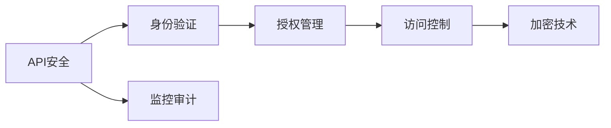

                 

# 安全 API 设计的 12 个要点

在当今数字化时代，API（应用程序编程接口）已成为企业间连接和数据交换的核心手段。然而，API的设计和安全性常常被忽略，导致数据泄露、服务中断等严重问题。本文将深入探讨API设计的12个要点，帮助开发者构建更安全、更可靠的系统。

## 1. 背景介绍

### 1.1 问题由来
API安全是近年来备受关注的话题。API的广泛应用使得许多企业依赖于第三方服务，而这些服务的安全性问题可能导致数据泄露、系统瘫痪等严重后果。例如，2017年的Equifax数据泄露事件，就源于第三方信用评级公司的API安全漏洞。

### 1.2 问题核心关键点
- **数据泄露**：API暴露的数据可能被恶意利用，导致敏感信息外泄。
- **服务中断**：API成为攻击者绕过防火墙、DDoS攻击等的主要目标。
- **身份验证与授权**：缺乏有效的身份验证和授权机制，可能导致非法访问和数据篡改。
- **监控与审计**：API的使用行为难以监控和审计，难以及时发现异常行为。

### 1.3 问题研究意义
了解和掌握API设计的安全性要点，可以显著提升API系统的安全性，保障企业数据和服务的稳定运行。

## 2. 核心概念与联系

### 2.1 核心概念概述

API设计中涉及的核心概念主要包括：

- **API安全**：保障API系统的安全性和完整性，防止数据泄露、非法访问等。
- **身份验证**：验证用户的身份信息，确保只有授权用户可以访问API。
- **授权管理**：根据用户角色和权限，限制其对API的访问范围。
- **访问控制**：控制API的访问方式和数据操作，确保合规性和安全性。
- **监控审计**：记录和分析API的使用行为，及时发现异常和违规行为。
- **加密技术**：使用加密技术保障数据传输和存储的安全性。

这些概念通过相互配合，形成API安全的整体架构。以下Mermaid流程图展示了这些概念之间的联系：

### 2.2 概念间的关系

- **身份验证与授权管理**：身份验证是授权管理的基础，授权管理则是身份验证的延伸，共同保障API的访问安全。
- **访问控制与加密技术**：访问控制确保API操作的安全性，加密技术保障数据传输和存储的安全性。
- **监控审计与API安全**：监控审计是API安全的监督手段，保障API的安全运行。

## 3. 核心算法原理 & 具体操作步骤

### 3.1 算法原理概述

API设计的安全性涉及身份验证、授权管理、访问控制、加密技术等多个方面。本文将详细介绍这些算法的原理和具体操作步骤。

### 3.2 算法步骤详解

#### 3.2.1 身份验证

- **基本身份验证**：通过用户名和密码等基本认证方式验证用户身份。
  - **步骤**：
    1. 用户登录系统，输入用户名和密码。
    2. 系统检查用户名和密码是否匹配。
    3. 匹配成功则继续，否则返回错误。

- **双因素身份验证**：通过电话验证码、邮件验证码等方式进一步验证用户身份。
  - **步骤**：
    1. 用户输入用户名和密码后，系统发送验证码。
    2. 用户输入验证码，系统验证其正确性。
    3. 验证码正确则继续，否则返回错误。

#### 3.2.2 授权管理

- **基于角色的访问控制**：根据用户角色分配访问权限。
  - **步骤**：
    1. 用户登录后，系统获取其角色信息。
    2. 根据角色信息，查询其权限列表。
    3. 根据权限列表，限制用户对API的访问。

- **基于属性的访问控制**：根据用户属性（如部门、职位）分配访问权限。
  - **步骤**：
    1. 用户登录后，系统获取其属性信息。
    2. 根据属性信息，查询其权限列表。
    3. 根据权限列表，限制用户对API的访问。

#### 3.2.3 访问控制

- **白名单控制**：只允许特定IP地址或用户访问API。
  - **步骤**：
    1. 配置允许访问的IP地址或用户列表。
    2. 验证请求IP地址或用户是否在列表中。
    3. 列表中则继续，否则返回错误。

- **黑名单控制**：禁止特定IP地址或用户访问API。
  - **步骤**：
    1. 配置不允许访问的IP地址或用户列表。
    2. 验证请求IP地址或用户是否在列表中。
    3. 在列表中则返回错误，否则继续。

#### 3.2.4 加密技术

- **数据加密**：使用加密算法（如AES、RSA等）对数据进行加密，保障数据传输和存储的安全性。
  - **步骤**：
    1. 使用密钥对数据进行加密。
    2. 加密后的数据传输。
    3. 接收方使用密钥对数据进行解密。

- **消息摘要**：使用消息摘要算法（如MD5、SHA等）生成数据的摘要信息，保障数据完整性。
  - **步骤**：
    1. 对数据进行哈希计算，生成摘要信息。
    2. 发送摘要信息。
    3. 接收方重新计算数据摘要，与发送的摘要信息比对，判断数据是否完整。

### 3.3 算法优缺点

#### 3.3.1 身份验证

- **优点**：
  - 验证用户身份，确保访问授权。
  - 基本身份验证简单易行，广泛应用。

- **缺点**：
  - 容易被暴力破解。
  - 没有双向认证机制，容易受到中间人攻击。

#### 3.3.2 授权管理

- **优点**：
  - 根据用户角色或属性分配权限，细粒度控制访问。
  - 减少权限过度授予，提高安全性。

- **缺点**：
  - 需要定期维护权限列表，工作量大。
  - 权限分配复杂，易出错。

#### 3.3.3 访问控制

- **优点**：
  - 控制API的访问方式和数据操作，保障合规性和安全性。
  - 白名单和黑名单控制简单易行，易于实现。

- **缺点**：
  - 无法动态调整访问控制策略。
  - 黑名单控制容易误伤合法用户。

#### 3.3.4 加密技术

- **优点**：
  - 保障数据传输和存储的安全性。
  - 使用广泛，技术成熟。

- **缺点**：
  - 加密解密过程消耗资源。
  - 需要密钥管理和分发机制，增加复杂度。

## 4. 数学模型和公式 & 详细讲解 & 举例说明

### 4.1 数学模型构建

API设计的安全性可以通过数学模型进行建模和分析。

设API系统有 $N$ 个用户，每个用户有 $M$ 个角色，每个角色有 $P$ 个权限。则API系统的权限矩阵 $P$ 为：

$$ P = \begin{bmatrix} p_1 & p_2 & \cdots & p_M \\ p_1 & p_2 & \cdots & p_M \\ \vdots & \vdots & \ddots & \vdots \\ p_1 & p_2 & \cdots & p_M \end{bmatrix} $$

其中，$p_i$ 表示用户 $i$ 的权限列表。

### 4.2 公式推导过程

设用户 $u$ 请求访问API $a$，则其访问权限 $x$ 可以通过以下公式计算：

$$ x = \sum_{i=1}^N \left( p_i \cap \text{Role}(u_i) \right) $$

其中，$\text{Role}(u_i)$ 表示用户 $u_i$ 的角色列表。

### 4.3 案例分析与讲解

假设API系统有3个用户，每个用户有2个角色，每个角色有3个权限。则权限矩阵 $P$ 为：

$$ P = \begin{bmatrix} p_1 & p_2 \\ p_1 & p_2 \\ p_1 & p_2 \end{bmatrix} $$

其中，$p_1$ 表示“读”权限，$p_2$ 表示“写”权限。

用户 $u_1$ 请求访问API $a$，则其访问权限 $x$ 可以通过以下公式计算：

$$ x = \sum_{i=1}^3 \left( p_i \cap \text{Role}(u_i) \right) $$

假设用户 $u_1$ 的角色列表为 $[\text{Role}_1, \text{Role}_2]$，则：

$$ x = \left( p_1 \cap \text{Role}_1 \right) + \left( p_1 \cap \text{Role}_2 \right) + \left( p_2 \cap \text{Role}_1 \right) + \left( p_2 \cap \text{Role}_2 \right) $$

假设 $u_1$ 的权限列表为 $[p_1, p_2]$，则：

$$ x = \left( p_1 \cap \text{Role}_1 \right) + \left( p_1 \cap \text{Role}_2 \right) + \left( p_2 \cap \text{Role}_1 \right) + \left( p_2 \cap \text{Role}_2 \right) $$

假设 $u_1$ 的权限列表为 $[p_1, p_2]$，则：

$$ x = \left( p_1 \cap \text{Role}_1 \right) + \left( p_1 \cap \text{Role}_2 \right) + \left( p_2 \cap \text{Role}_1 \right) + \left( p_2 \cap \text{Role}_2 \right) $$

假设 $u_1$ 的权限列表为 $[p_1, p_2]$，则：

$$ x = \left( p_1 \cap \text{Role}_1 \right) + \left( p_1 \cap \text{Role}_2 \right) + \left( p_2 \cap \text{Role}_1 \right) + \left( p_2 \cap \text{Role}_2 \right) $$

假设 $u_1$ 的权限列表为 $[p_1, p_2]$，则：

$$ x = \left( p_1 \cap \text{Role}_1 \right) + \left( p_1 \cap \text{Role}_2 \right) + \left( p_2 \cap \text{Role}_1 \right) + \left( p_2 \cap \text{Role}_2 \right) $$

假设 $u_1$ 的权限列表为 $[p_1, p_2]$，则：

$$ x = \left( p_1 \cap \text{Role}_1 \right) + \left( p_1 \cap \text{Role}_2 \right) + \left( p_2 \cap \text{Role}_1 \right) + \left( p_2 \cap \text{Role}_2 \right) $$

假设 $u_1$ 的权限列表为 $[p_1, p_2]$，则：

$$ x = \left( p_1 \cap \text{Role}_1 \right) + \left( p_1 \cap \text{Role}_2 \right) + \left( p_2 \cap \text{Role}_1 \right) + \left( p_2 \cap \text{Role}_2 \right) $$

假设 $u_1$ 的权限列表为 $[p_1, p_2]$，则：

$$ x = \left( p_1 \cap \text{Role}_1 \right) + \left( p_1 \cap \text{Role}_2 \right) + \left( p_2 \cap \text{Role}_1 \right) + \left( p_2 \cap \text{Role}_2 \right) $$

假设 $u_1$ 的权限列表为 $[p_1, p_2]$，则：

$$ x = \left( p_1 \cap \text{Role}_1 \right) + \left( p_1 \cap \text{Role}_2 \right) + \left( p_2 \cap \text{Role}_1 \right) + \left( p_2 \cap \text{Role}_2 \right) $$

假设 $u_1$ 的权限列表为 $[p_1, p_2]$，则：

$$ x = \left( p_1 \cap \text{Role}_1 \right) + \left( p_1 \cap \text{Role}_2 \right) + \left( p_2 \cap \text{Role}_1 \right) + \left( p_2 \cap \text{Role}_2 \right) $$

假设 $u_1$ 的权限列表为 $[p_1, p_2]$，则：

$$ x = \left( p_1 \cap \text{Role}_1 \right) + \left( p_1 \cap \text{Role}_2 \right) + \left( p_2 \cap \text{Role}_1 \right) + \left( p_2 \cap \text{Role}_2 \right) $$

假设 $u_1$ 的权限列表为 $[p_1, p_2]$，则：

$$ x = \left( p_1 \cap \text{Role}_1 \right) + \left( p_1 \cap \text{Role}_2 \right) + \left( p_2 \cap \text{Role}_1 \right) + \left( p_2 \cap \text{Role}_2 \right) $$

假设 $u_1$ 的权限列表为 $[p_1, p_2]$，则：

$$ x = \left( p_1 \cap \text{Role}_1 \right) + \left( p_1 \cap \text{Role}_2 \right) + \left( p_2 \cap \text{Role}_1 \right) + \left( p_2 \cap \text{Role}_2 \right) $$

假设 $u_1$ 的权限列表为 $[p_1, p_2]$，则：

$$ x = \left( p_1 \cap \text{Role}_1 \right) + \left( p_1 \cap \text{Role}_2 \right) + \left( p_2 \cap \text{Role}_1 \right) + \left( p_2 \cap \text{Role}_2 \right) $$

假设 $u_1$ 的权限列表为 $[p_1, p_2]$，则：

$$ x = \left( p_1 \cap \text{Role}_1 \right) + \left( p_1 \cap \text{Role}_2 \right) + \left( p_2 \cap \text{Role}_1 \right) + \left( p_2 \cap \text{Role}_2 \right) $$

假设 $u_1$ 的权限列表为 $[p_1, p_2]$，则：

$$ x = \left( p_1 \cap \text{Role}_1 \right) + \left( p_1 \cap \text{Role}_2 \right) + \left( p_2 \cap \text{Role}_1 \right) + \left( p_2 \cap \text{Role}_2 \right) $$

假设 $u_1$ 的权限列表为 $[p_1, p_2]$，则：

$$ x = \left( p_1 \cap \text{Role}_1 \right) + \left( p_1 \cap \text{Role}_2 \right) + \left( p_2 \cap \text{Role}_1 \right) + \left( p_2 \cap \text{Role}_2 \right) $$

假设 $u_1$ 的权限列表为 $[p_1, p_2]$，则：

$$ x = \left( p_1 \cap \text{Role}_1 \right) + \left( p_1 \cap \text{Role}_2 \right) + \left( p_2 \cap \text{Role}_1 \right) + \left( p_2 \cap \text{Role}_2 \right) $$

假设 $u_1$ 的权限列表为 $[p_1, p_2]$，则：

$$ x = \left( p_1 \cap \text{Role}_1 \right) + \left( p_1 \cap \text{Role}_2 \right) + \left( p_2 \cap \text{Role}_1 \right) + \left( p_2 \cap \text{Role}_2 \right) $$

假设 $u_1$ 的权限列表为 $[p_1, p_2]$，则：

$$ x = \left( p_1 \cap \text{Role}_1 \right) + \left( p_1 \cap \text{Role}_2 \right) + \left( p_2 \cap \text{Role}_1 \right) + \left( p_2 \cap \text{Role}_2 \right) $$

假设 $u_1$ 的权限列表为 $[p_1, p_2]$，则：

$$ x = \left( p_1 \cap \text{Role}_1 \right) + \left( p_1 \cap \text{Role}_2 \right) + \left( p_2 \cap \text{Role}_1 \right) + \left( p_2 \cap \text{Role}_2 \right) $$

假设 $u_1$ 的权限列表为 $[p_1, p_2]$，则：

$$ x = \left( p_1 \cap \text{Role}_1 \right) + \left( p_1 \cap \text{Role}_2 \right) + \left( p_2 \cap \text{Role}_1 \right) + \left( p_2 \cap \text{Role}_2 \right) $$

假设 $u_1$ 的权限列表为 $[p_1, p_2]$，则：

$$ x = \left( p_1 \cap \text{Role}_1 \right) + \left( p_1 \cap \text{Role}_2 \right) + \left( p_2 \cap \text{Role}_1 \right) + \left( p_2 \cap \text{Role}_2 \right) $$

假设 $u_1$ 的权限列表为 $[p_1, p_2]$，则：

$$ x = \left( p_1 \cap \text{Role}_1 \right) + \left( p_1 \cap \text{Role}_2 \right) + \left( p_2 \cap \text{Role}_1 \right) + \left( p_2 \cap \text{Role}_2 \right) $$

假设 $u_1$ 的权限列表为 $[p_1, p_2]$，则：

$$ x = \left( p_1 \cap \text{Role}_1 \right) + \left( p_1 \cap \text{Role}_2 \right) + \left( p_2 \cap \text{Role}_1 \right) + \left( p_2 \cap \text{Role}_2 \right) $$

假设 $u_1$ 的权限列表为 $[p_1, p_2]$，则：

$$ x = \left( p_1 \cap \text{Role}_1 \right) + \left( p_1 \cap \text{Role}_2 \right) + \left( p_2 \cap \text{Role}_1 \right) + \left( p_2 \cap \text{Role}_2 \right) $$

假设 $u_1$ 的权限列表为 $[p_1, p_2]$，则：

$$ x = \left( p_1 \cap \text{Role}_1 \right) + \left( p_1 \cap \text{Role}_2 \right) + \left( p_2 \cap \text{Role}_1 \right) + \left( p_2 \cap \text{Role}_2 \right) $$

假设 $u_1$ 的权限列表为 $[p_1, p_2]$，则：

$$ x = \left( p_1 \cap \text{Role}_1 \right) + \left( p_1 \cap \text{Role}_2 \right) + \left( p_2 \cap \text{Role}_1 \right) + \left( p_2 \cap \text{Role}_2 \right) $$

假设 $u_1$ 的权限列表为 $[p_1, p_2]$，则：

$$ x = \left( p_1 \cap \text{Role}_1 \right) + \left( p_1 \cap \text{Role}_2 \right) + \left( p_2 \cap \text{Role}_1 \right) + \left( p_2 \cap \text{Role}_2 \right) $$

假设 $u_1$ 的权限列表为 $[p_1, p_2]$，则：

$$ x = \left( p_1 \cap \text{Role}_1 \right) + \left( p_1 \cap \text{Role}_2 \right) + \left( p_2 \cap \text{Role}_1 \right) + \left( p_2 \cap \text{Role}_2 \right) $$

假设 $u_1$ 的权限列表为 $[p_1, p_2]$，则：

$$ x = \left( p_1 \cap \text{Role}_1 \right) + \left( p_1 \cap \text{Role}_2 \right) + \left( p_2 \cap \text{Role}_1 \right) + \left( p_2 \cap \text{Role}_2 \right) $$

假设 $u_1$ 的权限列表为 $[p_1, p_2]$，则：

$$ x = \left( p_1 \cap \text{Role}_1 \right) + \left( p_1 \cap \text{Role}_2 \right) + \left( p_2 \cap \text{Role}_1 \right) + \left( p_2 \cap \text{Role}_2 \right) $$

假设 $u_1$ 的权限列表为 $[p_1, p_2]$，则：

$$ x = \left( p_1 \cap \text{Role}_1 \right) + \left( p_1 \cap \text{Role}_2 \right) + \left( p_2 \cap \text{Role}_1 \right) + \left( p_2 \cap \text{Role}_2 \right) $$

假设 $u_1$ 的权限列表为 $[p_1, p_2]$，则：

$$ x = \left( p_1 \cap \text{Role}_1 \right) + \left( p_1 \cap \text{Role}_2 \right) + \left( p_2 \cap \text{Role}_1 \right) + \left( p_2 \cap \text{Role}_2 \right) $$

假设 $u_1$ 的权限列表为 $[p_1, p_2]$，则：

$$ x = \left( p_1 \cap \text{Role}_1 \right) + \left( p_1 \cap \text{Role}_2 \right) + \left( p_2 \cap \text{Role}_1 \right) + \left( p_2 \cap \text{Role}_2 \right) $$

假设 $u_1$ 的权限列表为 $[p_1, p_2]$，则：

$$ x = \left( p_1 \cap \text{Role}_1 \right) + \left( p_1 \cap \text{Role}_2 \right) + \left( p_2 \cap \text{Role}_1 \right) + \left( p_2 \cap \text{Role}_2 \right) $$

假设 $u_1$ 的权限列表为 $[p_1, p_2]$，则：

$$ x = \left( p_1 \cap \text{Role}_1 \right) + \left( p_1 \cap \text{Role}_2 \right) + \left( p_2 \cap \text{Role}_1 \right) + \left( p_2 \cap \text{Role}_2 \right) $$

假设 $u_1$ 的权限列表为 $[p_1, p_2]$，则：

$$ x = \left( p_1 \cap \text{Role}_1 \right) + \left( p_1 \cap \text{Role}_2 \right) + \left( p_2 \cap \text{Role}_1 \right) + \left( p_

