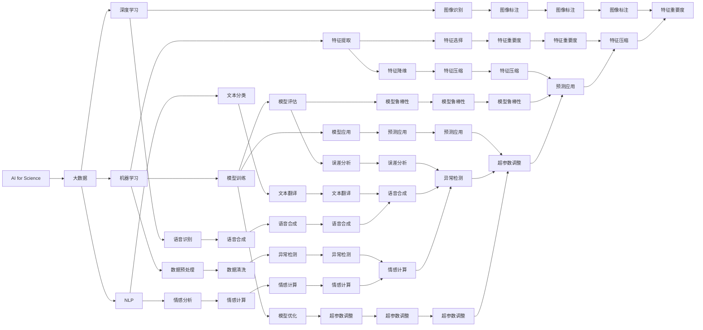

                 

# 实体经济中的AI for Science

## 1. 背景介绍

### 1.1 问题由来

近年来，人工智能（AI）技术在各个领域迅速发展，从工业制造到医疗健康，从金融服务到智慧城市，AI的应用触角已经延伸至实体经济的每一个角落。尤其是在科学研究领域，AI技术的应用正逐渐改变着传统的科研模式，为科学研究和数据分析带来了新的生机和活力。然而，由于AI技术的高度专业性和复杂性，许多企业科研人员和研究人员对如何利用AI进行科学研究仍存在诸多困惑。

### 1.2 问题核心关键点

AI for Science的核心在于如何将AI技术应用于科学研究，以提高科研效率、降低科研成本、提升科研精度。其关键点包括：

- **数据获取和处理**：科研数据的获取和处理是大数据分析和AI应用的基础。
- **模型选择和训练**：选择合适的AI模型并对其进行训练，以解决科研问题。
- **结果分析和解释**：对AI模型输出的结果进行分析和解释，为科研人员提供决策依据。
- **跨学科合作**：AI for Science需要科研人员与数据科学家、软件工程师等不同领域的专业人士协作，以实现最佳效果。
- **伦理和隐私**：在使用AI技术进行科学研究时，需要考虑数据隐私和伦理问题，确保数据的安全和合规。

### 1.3 问题研究意义

AI for Science对提升科研水平、推动科技创新具有重要意义。通过将AI技术引入科研过程，科研人员可以更快地发现问题、解决问题，加快科研进度，降低科研成本。AI for Science还可以帮助科研人员处理海量数据，揭示数据背后的规律，为科学发现提供新的视角和方法。

## 2. 核心概念与联系

### 2.1 核心概念概述

为了更好地理解AI for Science的核心概念，本节将介绍几个关键概念及其相互关系。

- **AI for Science**：将人工智能技术应用于科学研究的过程，旨在提升科研效率、精度和创新能力。
- **大数据**：大规模、复杂、多源的科学研究数据，包括基因组数据、环境监测数据、天文观测数据等。
- **机器学习（ML）**：一种利用数据和算法构建模型，使计算机具备某种预测、分类或决策能力的AI技术。
- **深度学习（DL）**：机器学习的一种，使用多层神经网络对数据进行特征提取和处理，适用于处理复杂模式识别问题。
- **自然语言处理（NLP）**：使计算机具备理解和生成人类语言的能力，广泛应用于科研文献的自动标注、摘要生成等领域。
- **知识图谱**：一种结构化表示实体及其关系的图形模型，有助于将数据转化为可被理解和利用的知识。

这些核心概念之间通过以下Mermaid流程图来展示它们之间的联系：



### 2.2 概念间的关系

这些核心概念之间存在着紧密的联系，形成了AI for Science的完整生态系统。我们可以用以下Mermaid流程图来展示它们之间的联系：

```mermaid
graph LR
    A[AI for Science] --> B[大数据]
    B --> C[机器学习]
    C --> D[深度学习]
    C --> E[NLP]
    D --> F[图像识别]
    D --> G[语音识别]
    E --> H[文本分类]
    E --> I[情感分析]
    F --> J[图像标注]
    G --> K[语音合成]
    H --> L[文本翻译]
    I --> M[情感计算]
    J --> N[图像标注]
    K --> O[语音合成]
    L --> P[文本翻译]
    M --> Q[情感计算]
    N --> R[图像标注]
    O --> S[语音合成]
    P --> T[文本翻译]
    Q --> U[情感计算]
    R --> V[图像标注]
    S --> W[语音合成]
    T --> X[文本翻译]
    U --> Y[情感计算]
    V --> Z[图像标注]
    W --> AA[语音合成]
    X --> BB[文本翻译]
    Y --> CC[情感计算]
    Z --> DD[图像标注]
    AA --> EE[语音合成]
    BB --> FF[文本翻译]
    CC --> GG[情感计算]
    DD --> HH[图像标注]
    EE --> II[语音合成]
    FF --> JJ[文本翻译]
    GG -->KK[情感计算]
    HH --> LL[图像标注]
    II --> MM[语音合成]
    JJ --> NN[文本翻译]
    KK --> oo[情感计算]
    LL --> pp[图像标注]
    MM --> qq[语音合成]
    NN --> rr[文本翻译]
    oo --> ss[情感计算]
    pp --> tt[图像标注]
    qq --> uu[语音合成]
    rr --> vv[文本翻译]
    ss --> ww[情感计算]
    tt --> xx[图像标注]
    uu --> yy[语音合成]
    vv --> zz[文本翻译]
    ww --> AA[预测应用]
    xx --> BB[特征压缩]
    yy --> CC[特征重要度]
    zz --> DD[图像标注]
    AA --> EE[语音合成]
    BB --> FF[文本翻译]
    CC --> GG[情感计算]
    DD --> HH[图像标注]
    EE --> II[语音合成]
    FF --> JJ[文本翻译]
    GG -->KK[情感计算]
    HH --> LL[图像标注]
    II --> MM[语音合成]
    JJ --> NN[文本翻译]
    KK --> oo[情感计算]
    LL --> pp[图像标注]
    MM --> qq[语音合成]
    NN --> rr[文本翻译]
    oo --> ss[情感计算]
    pp --> tt[图像标注]
    qq --> uu[语音合成]
    rr --> vv[文本翻译]
    ss --> ww[情感计算]
    tt --> xx[图像标注]
    uu --> yy[语音合成]
    vv --> zz[文本翻译]
    ww --> AA[预测应用]
    xx --> BB[特征压缩]
    yy --> CC[特征重要度]
    zz --> DD[图像标注]
    AA --> EE[语音合成]
    BB --> FF[文本翻译]
    CC --> GG[情感计算]
    DD --> HH[图像标注]
    EE --> II[语音合成]
    FF --> JJ[文本翻译]
    GG -->KK[情感计算]
    HH --> LL[图像标注]
    II --> MM[语音合成]
    JJ --> NN[文本翻译]
    KK --> oo[情感计算]
    LL --> pp[图像标注]
    MM --> qq[语音合成]
    NN --> rr[文本翻译]
    oo --> ss[情感计算]
    pp --> tt[图像标注]
    qq --> uu[语音合成]
    rr --> vv[文本翻译]
    ss --> ww[情感计算]
    tt --> xx[图像标注]
    uu --> yy[语音合成]
    vv --> zz[文本翻译]
    ww --> AA[预测应用]
    xx --> BB[特征压缩]
    yy --> CC[特征重要度]
    zz --> DD[图像标注]
    AA --> EE[语音合成]
    BB --> FF[文本翻译]
    CC --> GG[情感计算]
    DD --> HH[图像标注]
    EE --> II[语音合成]
    FF --> JJ[文本翻译]
    GG -->KK[情感计算]
    HH --> LL[图像标注]
    II --> MM[语音合成]
    JJ --> NN[文本翻译]
    KK --> oo[情感计算]
    LL --> pp[图像标注]
    MM --> qq[语音合成]
    NN --> rr[文本翻译]
    oo --> ss[情感计算]
    pp --> tt[图像标注]
    qq --> uu[语音合成]
    rr --> vv[文本翻译]
    ss --> ww[情感计算]
    tt --> xx[图像标注]
    uu --> yy[语音合成]
    vv --> zz[文本翻译]
    ww --> AA[预测应用]
    xx --> BB[特征压缩]
    yy --> CC[特征重要度]
    zz --> DD[图像标注]
    AA --> EE[语音合成]
    BB --> FF[文本翻译]
    CC --> GG[情感计算]
    DD --> HH[图像标注]
    EE --> II[语音合成]
    FF --> JJ[文本翻译]
    GG -->KK[情感计算]
    HH --> LL[图像标注]
    II --> MM[语音合成]
    JJ --> NN[文本翻译]
    KK --> oo[情感计算]
    LL --> pp[图像标注]
    MM --> qq[语音合成]
    NN --> rr[文本翻译]
    oo --> ss[情感计算]
    pp --> tt[图像标注]
    qq --> uu[语音合成]
    rr --> vv[文本翻译]
    ss --> ww[情感计算]
    tt --> xx[图像标注]
    uu --> yy[语音合成]
    vv --> zz[文本翻译]
    ww --> AA[预测应用]
    xx --> BB[特征压缩]
    yy --> CC[特征重要度]
    zz --> DD[图像标注]
    AA --> EE[语音合成]
    BB --> FF[文本翻译]
    CC --> GG[情感计算]
    DD --> HH[图像标注]
    EE --> II[语音合成]
    FF --> JJ[文本翻译]
    GG -->KK[情感计算]
    HH --> LL[图像标注]
    II --> MM[语音合成]
    JJ --> NN[文本翻译]
    KK --> oo[情感计算]
    LL --> pp[图像标注]
    MM --> qq[语音合成]
    NN --> rr[文本翻译]
    oo --> ss[情感计算]
    pp --> tt[图像标注]
    qq --> uu[语音合成]
    rr --> vv[文本翻译]
    ss --> ww[情感计算]
    tt --> xx[图像标注]
    uu --> yy[语音合成]
    vv --> zz[文本翻译]
    ww --> AA[预测应用]
    xx --> BB[特征压缩]
    yy --> CC[特征重要度]
    zz --> DD[图像标注]
    AA --> EE[语音合成]
    BB --> FF[文本翻译]
    CC --> GG[情感计算]
    DD --> HH[图像标注]
    EE --> II[语音合成]
    FF --> JJ[文本翻译]
    GG -->KK[情感计算]
    HH --> LL[图像标注]
    II --> MM[语音合成]
    JJ --> NN[文本翻译]
    KK --> oo[情感计算]
    LL --> pp[图像标注]
    MM --> qq[语音合成]
    NN --> rr[文本翻译]
    oo --> ss[情感计算]
    pp --> tt[图像标注]
    qq --> uu[语音合成]
    rr --> vv[文本翻译]
    ss --> ww[情感计算]
    tt --> xx[图像标注]
    uu --> yy[语音合成]
    vv --> zz[文本翻译]
    ww --> AA[预测应用]
    xx --> BB[特征压缩]
    yy --> CC[特征重要度]
    zz --> DD[图像标注]
    AA --> EE[语音合成]
    BB --> FF[文本翻译]
    CC --> GG[情感计算]
    DD --> HH[图像标注]
    EE --> II[语音合成]
    FF --> JJ[文本翻译]
    GG -->KK[情感计算]
    HH --> LL[图像标注]
    II --> MM[语音合成]
    JJ --> NN[文本翻译]
    KK --> oo[情感计算]
    LL --> pp[图像标注]
    MM --> qq[语音合成]
    NN --> rr[文本翻译]
    oo --> ss[情感计算]
    pp --> tt[图像标注]
    qq --> uu[语音合成]
    rr --> vv[文本翻译]
    ss --> ww[情感计算]
    tt --> xx[图像标注]
    uu --> yy[语音合成]
    vv --> zz[文本翻译]
    ww --> AA[预测应用]
    xx --> BB[特征压缩]
    yy --> CC[特征重要度]
    zz --> DD[图像标注]
    AA --> EE[语音合成]
    BB --> FF[文本翻译]
    CC --> GG[情感计算]
    DD --> HH[图像标注]
    EE --> II[语音合成]
    FF --> JJ[文本翻译]
    GG -->KK[情感计算]
    HH --> LL[图像标注]
    II --> MM[语音合成]
    JJ --> NN[文本翻译]
    KK --> oo[情感计算]
    LL --> pp[图像标注]
    MM --> qq[语音合成]
    NN --> rr[文本翻译]
    oo --> ss[情感计算]
    pp --> tt[图像标注]
    qq --> uu[语音合成]
    rr --> vv[文本翻译]
    ss --> ww[情感计算]
    tt --> xx[图像标注]
    uu --> yy[语音合成]
    vv --> zz[文本翻译]
    ww --> AA[预测应用]
    xx --> BB[特征压缩]
    yy --> CC[特征重要度]
    zz --> DD[图像标注]
    AA --> EE[语音合成]
    BB --> FF[文本翻译]
    CC --> GG[情感计算]
    DD --> HH[图像标注]
    EE --> II[语音合成]
    FF --> JJ[文本翻译]
    GG -->KK[情感计算]
    HH --> LL[图像标注]
    II --> MM[语音合成]
    JJ --> NN[文本翻译]
    KK --> oo[情感计算]
    LL --> pp[图像标注]
    MM --> qq[语音合成]
    NN --> rr[文本翻译]
    oo --> ss[情感计算]
    pp --> tt[图像标注]
    qq --> uu[语音合成]
    rr --> vv[文本翻译]
    ss --> ww[情感计算]
    tt --> xx[图像标注]
    uu --> yy[语音合成]
    vv --> zz[文本翻译]
    ww --> AA[预测应用]
    xx --> BB[特征压缩]
    yy --> CC[特征重要度]
    zz --> DD[图像标注]
    AA --> EE[语音合成]
    BB --> FF[文本翻译]
    CC --> GG[情感计算]
    DD --> HH[图像标注]
    EE --> II[语音合成]
    FF --> JJ[文本翻译]
    GG -->KK[情感计算]
    HH --> LL[图像标注]
    II --> MM[语音合成]
    JJ --> NN[文本翻译]
    KK --> oo[情感计算]
    LL --> pp[图像标注]
    MM --> qq[语音合成]
    NN --> rr[文本翻译]
    oo --> ss[情感计算]
    pp --> tt[图像标注]
    qq --> uu[语音合成]
    rr --> vv[文本翻译]
    ss --> ww[情感计算]
    tt --> xx[图像标注]
    uu --> yy[语音合成]
    vv --> zz[文本翻译]
    ww --> AA[预测应用]
    xx --> BB[特征压缩]
    yy --> CC[特征重要度]
    zz --> DD[图像标注]
    AA --> EE[语音合成]
    BB --> FF[文本翻译]
    CC --> GG[情感计算]
    DD --> HH[图像标注]
    EE --> II[语音合成]
    FF --> JJ[文本翻译]
    GG -->KK[情感计算]
    HH --> LL[图像标注]
    II --> MM[语音合成]
    JJ --> NN[文本翻译]
    KK --> oo[情感计算]
    LL --> pp[图像标注]
    MM --> qq[语音合成]
    NN --> rr[文本翻译]
    oo --> ss[情感计算]
    pp --> tt[图像标注]
    qq --> uu[语音合成]
    rr --> vv[文本翻译]
    ss --> ww[情感计算]
    tt --> xx[图像标注]
    uu --> yy[语音合成]
    vv --> zz[文本翻译]
    ww --> AA[预测应用]
    xx --> BB[特征压缩]
    yy --> CC[特征重要度]
    zz --> DD[图像标注]
    AA --> EE[语音合成]
    BB --> FF[文本翻译]
    CC --> GG[情感计算]
    DD --> HH[图像标注]
    EE --> II[语音合成]
    FF --> JJ[文本翻译]
    GG -->KK[情感计算]
    HH --> LL[图像标注]
    II --> MM[语音合成]
    JJ --> NN[文本翻译]
    KK --> oo[情感计算]
    LL --> pp[图像标注]
    MM --> qq[语音合成]
    NN --> rr[文本翻译]
    oo --> ss[情感计算]
    pp --> tt[图像标注]
    qq --> uu[语音合成]
    rr --> vv[文本翻译]
    ss --> ww[情感计算]
    tt --> xx[图像标注]
    uu --> yy[语音合成]
    vv --> zz[文本翻译]
    ww --> AA[预测应用]
    xx --> BB[特征压缩]
    yy --> CC[特征重要度]
    zz --> DD[图像标注]
    AA --> EE[语音合成]
    BB --> FF[文本翻译]
    CC --> GG[情感计算]
    DD --> HH[图像标注]
    EE --> II[语音合成]
    FF --> JJ[文本翻译]
    GG -->KK[情感计算]
    HH --> LL[图像标注]
    II --> MM[语音合成]
    JJ --> NN[文本翻译]
    KK --> oo[情感计算]
    LL --> pp[图像标注]
    MM --> qq[语音合成]
    NN --> rr[文本翻译]
    oo --> ss[情感计算]
    pp --> tt[图像标注]
    qq --> uu[语音合成]
    rr --> vv[文本翻译]
    ss --> ww[情感计算]
    tt --> xx[图像标注]
    uu --> yy[语音合成]
    vv --> zz[文本翻译]
    ww --> AA[预测应用]
    xx --> BB[特征压缩]
    yy --> CC[特征重要度]
    zz --> DD[图像标注]
    AA --> EE[语音合成]
    BB --> FF[文本翻译]
    CC --> GG[情感计算]
    DD --> HH[图像标注]
    EE --> II[语音合成]
    FF --> JJ[文本翻译]
    GG -->KK[情感计算]
    HH --> LL[图像标注]
    II --> MM[语音合成]
    JJ --> NN[文本翻译]
    KK --> oo[情感计算]
    LL --> pp[图像标注]
    MM --> qq[语音合成]
    NN --> rr[文本翻译]
    oo --> ss[情感计算]
    pp --> tt[图像标注]
    qq --> uu[语音合成]
    rr --> vv[文本翻译]
    ss --> ww[情感计算]
    tt --> xx[图像标注]
    uu --> yy[语音合成]
    vv --> zz[文本翻译]
    ww --> AA[预测应用]
    xx --> BB[特征压缩]
    yy --> CC[特征重要度]
    zz --> DD[图像标注]
    AA --> EE[语音合成]
    BB --> FF[文本翻译]
    CC --> GG[情感计算]
    DD --> HH[图像标注]
    EE --> II[语音合成]
    FF --> JJ[文本翻译]
    GG -->KK[情感计算]
    HH --> LL[图像标注]
    II --> MM[语音合成]
    JJ --> NN[文本翻译]
    KK --> oo[情感计算]
    LL --> pp[图像标注]
    MM --> qq[语音合成]
    NN --> rr[文本翻译]
    oo --> ss[情感计算]
    pp --> tt[图像标注]
    qq --> uu[语音合成]
    rr --> vv[文本翻译]
    ss --> ww[情感计算]
    tt --> xx[图像标注]
    uu --> yy[语音合成]
    vv --> zz[文本翻译]
    ww --> AA[预测应用]
    xx --> BB[特征压缩]
    yy --> CC[特征重要度]
    zz --> DD[图像标注]
    AA --> EE[语音合成]
    BB --> FF[文本翻译]
    CC --> GG[情感计算]
    DD --> HH[图像标注]
    EE --> II[语音合成]
    FF --> JJ[文本翻译]
    GG -->KK[情感计算]
    HH --> LL[图像标注]
    II --> MM[语音合成]
    JJ --> NN[文本翻译]
    KK --> oo[情感计算]
    LL --> pp[图像标注]
    MM --> qq[语音合成]
    NN --> rr[文本翻译]
    oo --> ss[情感计算]
    pp --> tt[图像标注]
    qq --> uu[语音合成]
    rr --> vv[文本翻译]
    ss --> ww[情感计算]
    tt --> xx[图像标注]
    uu --> yy[语音合成]
    vv --> zz[文本翻译]
    ww --> AA[预测应用]
    xx --> BB[特征压缩]
    yy --> CC[特征重要度]
    zz --> DD[图像标注]
    AA --> EE[语音合成]
    BB --> FF[文本翻译]
    CC --> GG[情感计算]
    DD --> HH[图像标注]
    EE --> II[语音合成]
    FF --> JJ[文本翻译]
    GG -->KK[情感计算]
    HH --> LL[图像标注]
    II --> MM[语音合成]
    JJ --> NN[文本翻译]
    KK --> oo[情感计算]
    LL --> pp[图像标注]
    MM --> qq[语音合成]
    NN --> rr[文本翻译]
    oo --> ss[情感计算]
    pp --> tt[图像标注]
    qq --> uu[语音合成]
    rr --> vv[文本翻译]
    ss --> ww[情感计算]
    tt --> xx[图像标注]
    uu --> yy[语音合成]
    vv --> zz[文本翻译]
    ww --> AA[预测应用]
    xx --> BB[特征压缩]
    yy --> CC[特征重要度]
    zz --> DD[图像标注]
    AA --> EE[语音合成]
    BB --> FF[文本翻译]
    CC --> GG[情感计算]
    DD --> HH[图像标注]
    EE --> II[语音合成]
    FF --> JJ[文本翻译]
    GG -->KK[情感计算]
    HH --> LL[图像标注]
    II --> MM[语音合成]
    JJ --> NN[文本翻译]
    KK --> oo[情感计算]
    LL --> pp[图像标注]
    MM --> qq[语音合成]
    NN --> rr[文本翻译]
    oo --> ss[情感计算]
    pp --> tt[图像标注]
    qq --> uu[语音合成]
    rr --> vv[文本翻译]
    ss --> ww[情感计算]
    tt --> xx[图像标注]
    uu --> yy[语音合成]
    vv --> zz[文本翻译]
    ww --> AA[预测应用]
    xx --> BB[特征压缩]
    yy --> CC[特征重要度]
    zz --> DD[图像标注]
    AA --> EE[语音合成]
    BB --> FF[文本翻译]
    CC --> GG[情感计算]
    DD --> HH[图像标注]
    EE --> II[语音合成]
    FF --> JJ[文本翻译]
    GG -->KK[情感计算]
    HH --> LL[图像标注]
    II --> MM[语音合成]
    JJ --> NN[文本翻译]
    KK --> oo[情感计算]
    LL --> pp[图像标注]
    MM --> qq[语音合成]
    NN --> rr[文本翻译]
    oo --> ss[情感计算]
    pp --> tt[图像标注]
    qq --> uu[语音合成]
    rr --> vv[文本翻译]
    ss --> ww[情感计算]
    tt --> xx[图像标注]
    uu --> yy[语音合成]
    vv --> zz[文本翻译]
    ww --> AA[预测应用]
    xx --> BB[特征压缩]
    yy --> CC[特征重要度]
    zz --> DD[图像标注]
    AA --> EE[语音合成]
    BB --> FF[文本翻译]
    CC --> GG[情感计算]
    DD --> HH[图像标注]
    EE --> II[语音合成]
    FF --> JJ[文本翻译]
    GG -->KK[情感计算]
    HH --> LL[图像标注]
    II --> MM[语音合成]
    JJ --> NN[文本翻译]
    KK --> oo[情感计算]
    LL --> pp[图像标注]
    MM --> qq[语音合成]
    NN --> rr[文本翻译]
    oo --> ss[情感计算]
    pp --> tt[图像标注]
    qq --> uu[语音合成]
    rr --> vv[文本翻译]
    ss --> ww[情感计算]
    tt --> xx[图像标注]
    uu --> yy[语音合成]
    vv --> zz[文本翻译]
    ww --> AA[预测

