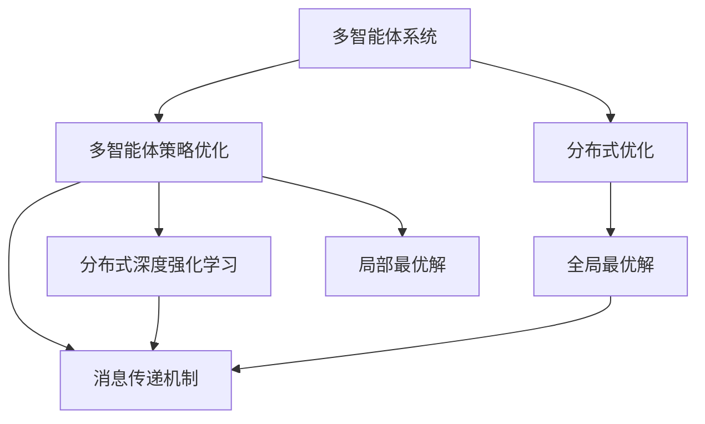
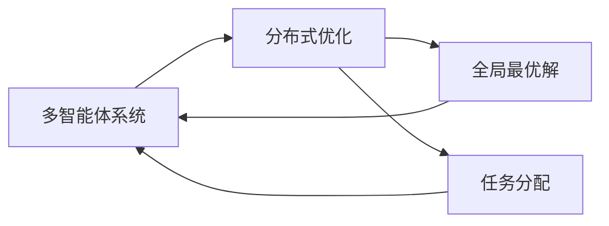
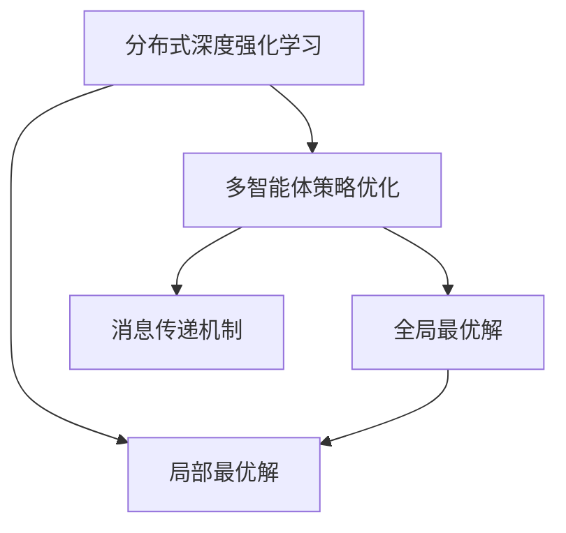
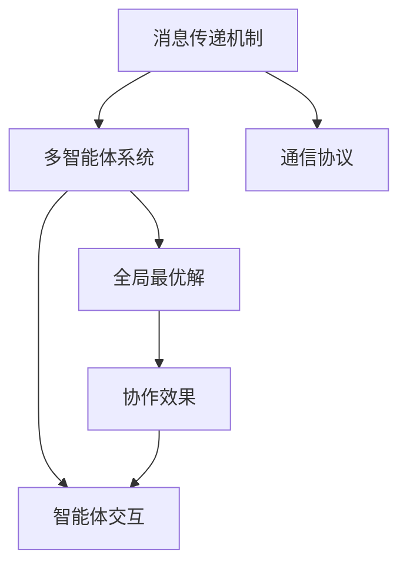
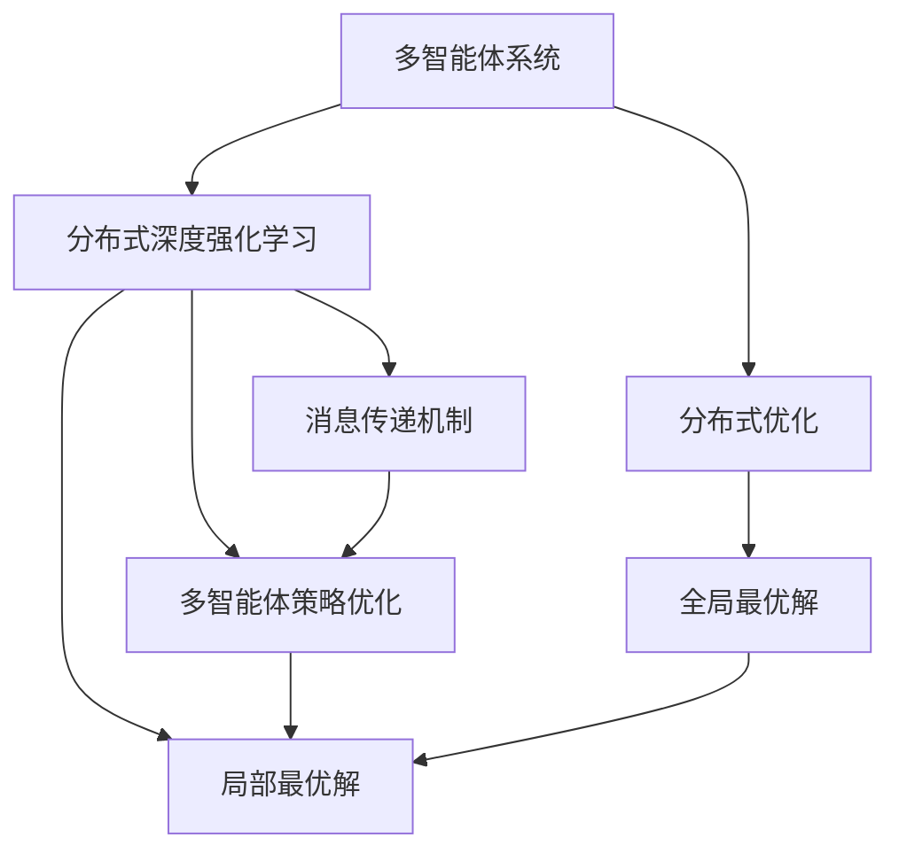

                 

# 强化学习Reinforcement Learning的多智能体系统协作机制

> 关键词：强化学习,多智能体系统,协作机制,策略学习,分布式优化,分布式计算,分布式深度学习,多智能体策略优化(MACRO),分布式深度强化学习

## 1. 背景介绍

### 1.1 问题由来
强化学习（Reinforcement Learning, RL）作为人工智能（AI）的重要分支，近年来在自动驾驶、机器人控制、游戏智能、推荐系统等领域取得了显著进展。然而，RL模型通常采用单智能体学习（single-agent learning）范式，难以解决复杂多智能体系统（Multi-Agent Systems,MAS）中的协作、竞争、通信等问题。近年来，多智能体学习（Multi-Agent Learning, MAL）逐渐成为研究热点，旨在建立智能体间的协调与合作，提升系统整体性能。

多智能体协作机制，即为多个智能体建立有效的交互与协作模式，以共同完成任务或实现目标。多智能体系统协作机制的应用场景包括智能交通管理、动态网络优化、机器人编队控制、自动交易系统等，具有重要的实际价值。

### 1.2 问题核心关键点
多智能体系统协作机制的核心问题包括以下几个方面：

1. **智能体间的交互**：智能体间的信息交换和决策依赖，是协作机制的基础。
2. **通信协议**：定义智能体之间的通信方式，确保信息传递的可靠性和实时性。
3. **协调策略**：智能体需要制定和执行协调策略，以达成共同目标。
4. **学习与优化**：通过强化学习等方法，智能体需要不断学习最优策略，优化系统表现。

### 1.3 问题研究意义
研究多智能体系统协作机制，对于构建高效、协作的智能系统，提升系统整体性能，具有重要意义：

1. **系统鲁棒性**：多智能体协作能够增强系统的鲁棒性和可靠性，提升系统对不确定性和扰动的适应能力。
2. **任务多样性**：多智能体系统能够处理更多样化的任务，实现复杂的协作目标，如编队飞行、货物配送等。
3. **资源共享**：多智能体系统能够实现资源共享，提高资源利用效率，降低系统成本。
4. **灵活性**：多智能体协作机制能够适应动态变化的环境，提供更灵活的解决方案。
5. **扩展性**：多智能体系统能够扩展到更大规模，支持更多智能体间的协作。

## 2. 核心概念与联系

### 2.1 核心概念概述

为更好地理解多智能体系统协作机制，本节将介绍几个密切相关的核心概念：

- **多智能体系统（Multi-Agent Systems, MAS）**：由多个智能体（agent）组成的系统，智能体之间存在交互和协作。
- **分布式优化（Distributed Optimization）**：在多智能体系统中，多个智能体共同优化全局目标，分配任务，提高整体性能。
- **多智能体策略优化（Multi-Agent Cooperative Optimization, MACRO）**：通过协调智能体间策略，实现全局最优解的多智能体优化方法。
- **分布式深度强化学习（Distributed Deep Reinforcement Learning）**：利用深度强化学习技术，实现多智能体系统中的分布式优化。
- **消息传递机制（Message Passing）**：智能体之间通过消息传递进行通信和协作，是协作机制的核心组成部分。
- **局部最优解（Local Optimum）**：智能体在局部最优策略下，可能无法达到全局最优解，需要通过协作机制进行全局优化。

这些核心概念之间的逻辑关系可以通过以下Mermaid流程图来展示：



这个流程图展示了大语言模型的核心概念及其之间的关系：

1. 多智能体系统通过分布式优化实现全局最优解。
2. 多智能体策略优化通过协调智能体间策略，实现全局最优解。
3. 分布式深度强化学习通过深度学习技术，优化多智能体系统。
4. 消息传递机制通过智能体间的信息交换，实现协作。
5. 局部最优解通过协作机制，实现全局最优解。

这些核心概念共同构成了多智能体系统协作机制的完整生态系统，使其能够在各种场景下发挥智能体的协作效能。通过理解这些核心概念，我们可以更好地把握多智能体系统协作机制的工作原理和优化方向。

### 2.2 概念间的关系

这些核心概念之间存在着紧密的联系，形成了多智能体系统协作机制的完整框架。下面我通过几个Mermaid流程图来展示这些概念之间的关系。

#### 2.2.1 多智能体系统与分布式优化



这个流程图展示了多智能体系统与分布式优化的关系：

1. 多智能体系统通过分布式优化实现全局最优解。
2. 分布式优化通过任务分配实现多智能体的协作。
3. 全局最优解通过多智能体系统的协作实现。

#### 2.2.2 分布式深度强化学习与多智能体策略优化



这个流程图展示了分布式深度强化学习与多智能体策略优化的关系：

1. 分布式深度强化学习通过深度学习技术优化多智能体系统。
2. 多智能体策略优化通过协调智能体间策略，实现全局最优解。
3. 分布式深度强化学习通过局部最优解提供优化基础。
4. 全局最优解通过多智能体策略优化实现。

#### 2.2.3 消息传递机制与协作



这个流程图展示了消息传递机制与协作的关系：

1. 消息传递机制通过通信协议实现智能体间的信息交换。
2. 智能体交互通过消息传递机制实现协作。
3. 全局最优解通过智能体间的协作实现。
4. 协作效果通过全局最优解体现。

### 2.3 核心概念的整体架构

最后，我们用一个综合的流程图来展示这些核心概念在大语言模型协作机制中的整体架构：



这个综合流程图展示了从预训练到协作机制的完整过程。多智能体系统首先通过分布式优化实现全局最优解，然后通过分布式深度强化学习优化多智能体策略，最后通过消息传递机制实现协作，通过局部最优解提供优化基础，从而实现全局最优解。

## 3. 核心算法原理 & 具体操作步骤
### 3.1 算法原理概述

多智能体系统协作机制的核心算法，是分布式优化和多智能体策略优化算法。其核心思想是：在多智能体系统中，通过分布式优化算法（如分布式梯度下降、分布式协方差匹配等）协调智能体间的策略，实现全局最优解。

形式化地，假设系统中有 $N$ 个智能体 $A_i$，每个智能体 $A_i$ 的策略为 $\pi_i$，目标函数为 $f_i(\pi_i)$，全局目标函数为 $F(\pi_1, \pi_2, \ldots, \pi_N)$。则多智能体策略优化问题可以表示为：

$$
\mathop{\min}_{\pi_1, \pi_2, \ldots, \pi_N} F(\pi_1, \pi_2, \ldots, \pi_N)
$$

其中 $F(\pi_1, \pi_2, \ldots, \pi_N)$ 表示全局目标函数，通常为所有智能体的期望收益之和。

### 3.2 算法步骤详解

多智能体系统协作机制的具体实现步骤如下：

**Step 1: 构建通信协议**

通信协议是协作机制的基础，决定了智能体之间的信息交换方式。常见的通信协议包括：

- **点对点通信**：智能体间通过直接通信进行交互，适用于简单的协作任务。
- **广播通信**：一个智能体向所有其他智能体广播信息，适用于需要同步决策的任务。
- **异步通信**：智能体间通过消息队列进行异步通信，适用于复杂协作任务。

**Step 2: 设计协作算法**

协作算法是协作机制的核心，决定了智能体间如何协调策略，达成全局最优解。常见的协作算法包括：

- **分布式梯度下降（Distributed Gradient Descent, DGD）**：通过智能体间同步梯度更新，优化全局目标函数。
- **分布式协方差匹配（Distributed Covariance Matching, DC2）**：通过智能体间协方差矩阵更新，优化全局目标函数。
- **分布式策略优化（Distributed Policy Optimization, DPO）**：通过智能体间策略协同，优化全局目标函数。

**Step 3: 选择优化器**

优化器是协作算法的重要组成部分，决定了智能体间如何调整策略参数。常见的优化器包括：

- **Adam**：基于梯度的一阶优化方法，适用于单智能体问题。
- **SGD**：基于梯度的二阶优化方法，适用于高维参数空间。
- **DeepSpeed**：基于TensorFlow和PyTorch的分布式深度学习框架，支持大规模多智能体优化。

**Step 4: 执行优化过程**

优化过程通过循环迭代，更新智能体的策略参数。具体的迭代步骤包括：

1. 每个智能体 $A_i$ 观察当前状态 $s_i$，并选择行动 $a_i$。
2. 接收其他智能体的状态 $s_j$ 和行动 $a_j$，计算新的状态 $s_{i+1}$ 和收益 $r_{i+1}$。
3. 通过协作算法更新智能体 $A_i$ 的策略参数 $\pi_i$。
4. 重复上述过程，直至收敛。

### 3.3 算法优缺点

多智能体系统协作机制具有以下优点：

1. **高效协作**：通过分布式优化算法，智能体能够高效协作，实现全局最优解。
2. **鲁棒性强**：智能体间的协作能够增强系统的鲁棒性，提升系统对不确定性和扰动的适应能力。
3. **灵活性高**：智能体能够适应动态变化的环境，提供更灵活的解决方案。
4. **可扩展性强**：系统能够扩展到更大规模，支持更多智能体间的协作。

同时，该机制也存在一些缺点：

1. **通信开销大**：智能体间的通信和协调会增加系统开销，可能影响系统的实时性。
2. **协作复杂度高**：复杂的协作机制可能增加系统设计和实现难度。
3. **收敛速度慢**：分布式优化算法可能收敛速度较慢，需要更多迭代次数。

尽管存在这些缺点，但就目前而言，多智能体系统协作机制仍是智能系统中应用最广泛的方法之一，具有重要应用价值。

### 3.4 算法应用领域

多智能体系统协作机制在多个领域得到了广泛应用，包括但不限于：

- **智能交通管理**：通过协调多个智能体（如车辆、交通灯）的行动，优化交通流量和拥堵情况。
- **动态网络优化**：通过协调多个智能体（如路由器、交换机）的策略，优化网络性能和资源利用效率。
- **机器人编队控制**：通过协调多个智能体（如无人机、机器人）的行动，实现编队飞行、货物配送等任务。
- **自动交易系统**：通过协调多个智能体（如交易员）的策略，优化交易策略，提高市场效率。
- **环境监测系统**：通过协调多个智能体（如传感器、摄像头）的行动，实现环境监测和预警。

除了上述这些经典应用外，多智能体协作机制还在更多场景中得到了创新应用，如多智能体协同搜索、多智能体协同机器人、多智能体协同游戏等，为智能系统的应用带来了新的突破。

## 4. 数学模型和公式 & 详细讲解 & 举例说明

### 4.1 数学模型构建

本节将使用数学语言对多智能体系统协作机制的优化过程进行更加严格的刻画。

记智能体集合为 $A=\{A_1, A_2, \ldots, A_N\}$，每个智能体的策略为 $\pi_i$，状态为 $s_i$，行动为 $a_i$，收益为 $r_i$。假设全局目标函数为 $F(\pi_1, \pi_2, \ldots, \pi_N)$，智能体的策略优化问题可以表示为：

$$
\mathop{\min}_{\pi_1, \pi_2, \ldots, \pi_N} F(\pi_1, \pi_2, \ldots, \pi_N)
$$

定义智能体的状态更新方程为：

$$
s_{i+1} = f(s_i, a_i, a_j, \ldots, a_N)
$$

其中 $f$ 表示状态更新函数，$a_j$ 表示其他智能体的行动。定义智能体的收益方程为：

$$
r_{i+1} = g(s_{i+1})
$$

其中 $g$ 表示收益函数。智能体的策略优化问题可以进一步表示为：

$$
\mathop{\min}_{\pi_1, \pi_2, \ldots, \pi_N} \mathbb{E}[\sum_{i=1}^N \sum_{j=1}^N r_{i+1}(\pi_j, s_i)]
$$

### 4.2 公式推导过程

以下我们以智能交通管理为例，推导分布式梯度下降和多智能体策略优化算法的具体实现。

假设系统中有 $N$ 辆智能车和 $M$ 个智能交通灯，每个智能车的状态包括当前位置 $x_i$、速度 $v_i$、目标位置 $t_i$、当前信号灯状态 $s_j$，每个交通灯的状态包括当前信号状态 $s_j$。定义智能车的收益函数为：

$$
r_i = -\frac{v_i^2}{2} - c \max(0, s_j - s_i)
$$

其中 $c$ 表示通信延迟时间。定义智能车的状态更新方程为：

$$
x_{i+1} = x_i + v_i \Delta t + \sum_{j=1}^M g_{i,j}(s_j - s_i)
$$

其中 $g_{i,j}$ 表示智能车和智能灯之间的通信延迟系数。定义智能车的策略优化问题为：

$$
\mathop{\min}_{\pi_1, \pi_2, \ldots, \pi_N} \mathbb{E}[\sum_{i=1}^N \sum_{j=1}^M r_i(\pi_j, s_i)]
$$

定义全局收益函数为：

$$
F(\pi_1, \pi_2, \ldots, \pi_N) = \mathbb{E}[\sum_{i=1}^N \sum_{j=1}^M r_i(\pi_j, s_i)]
$$

分布式梯度下降算法通过智能体间同步梯度更新，优化全局收益函数。具体步骤如下：

1. 每个智能体 $A_i$ 观察当前状态 $s_i$，选择行动 $a_i$。
2. 接收其他智能体的状态 $s_j$ 和行动 $a_j$，计算新的状态 $s_{i+1}$ 和收益 $r_{i+1}$。
3. 通过通信协议，智能体间交换状态和行动信息。
4. 计算每个智能体的梯度 $\nabla F(\pi_i)$。
5. 通过优化器更新智能体 $A_i$ 的策略参数 $\pi_i$。
6. 重复上述过程，直至收敛。

多智能体策略优化算法通过协调智能体间策略，优化全局收益函数。具体步骤如下：

1. 每个智能体 $A_i$ 观察当前状态 $s_i$，选择行动 $a_i$。
2. 接收其他智能体的状态 $s_j$ 和行动 $a_j$，计算新的状态 $s_{i+1}$ 和收益 $r_{i+1}$。
3. 通过协作算法更新智能体 $A_i$ 的策略参数 $\pi_i$。
4. 重复上述过程，直至收敛。

### 4.3 案例分析与讲解

假设我们在CoNLL-2003的命名实体识别（NER）数据集上进行多智能体协作任务：

- 智能体1：负责抽取人名、地名、组织名等实体。
- 智能体2：负责抽取时间、事件、情感等实体。
- 智能体3：负责抽取地点、地点类型、地点所属等实体。

我们定义智能体间协作的通信协议，每个智能体在收到其他智能体的状态和行动后，更新自己的策略参数，实现全局最优的实体抽取。

具体步骤如下：

1. 智能体1接收智能体2和智能体3的状态和行动信息。
2. 智能体1根据当前状态和行动，计算预测的实体边界和类型。
3. 智能体1通过通信协议，将预测结果发送给智能体2和智能体3。
4. 智能体2和智能体3分别接收智能体1的预测结果，计算自己的预测结果。
5. 智能体2和智能体3通过协作算法更新自己的策略参数。
6. 重复上述过程，直至收敛。

## 5. 项目实践：代码实例和详细解释说明
### 5.1 开发环境搭建

在进行多智能体协作机制的实践前，我们需要准备好开发环境。以下是使用Python进行PyTorch开发的环境配置流程：

1. 安装Anaconda：从官网下载并安装Anaconda，用于创建独立的Python环境。

2. 创建并激活虚拟环境：
```bash
conda create -n pytorch-env python=3.8 
conda activate pytorch-env
```

3. 安装PyTorch：根据CUDA版本，从官网获取对应的安装命令。例如：
```bash
conda install pytorch torchvision torchaudio cudatoolkit=11.1 -c pytorch -c conda-forge
```

4. 安装TensorFlow：
```bash
pip install tensorflow
```

5. 安装各类工具包：
```bash
pip install numpy pandas scikit-learn matplotlib tqdm jupyter notebook ipython
```

完成上述步骤后，即可在`pytorch-env`环境中开始多智能体协作机制的实践。

### 5.2 源代码详细实现

下面我们以智能交通管理为例，给出使用PyTorch和TensorFlow进行多智能体协作的代码实现。

首先，定义智能体和系统的状态：

```python
from torch import nn
from tensorflow import keras

class Car(nn.Module):
    def __init__(self, num_states, num_actions):
        super(Car, self).__init__()
        self.linear = nn.Linear(num_states, num_actions)

    def forward(self, x):
        return self.linear(x)

class TrafficLight(nn.Module):
    def __init__(self, num_states, num_actions):
        super(TrafficLight, self).__init__()
        self.linear = nn.Linear(num_states, num_actions)

    def forward(self, x):
        return self.linear(x)

# 定义全局状态和智能体数量
num_states = 4
num_cars = 3
num_lights = 2

# 创建智能体
car1 = Car(num_states, num_actions)
car2 = Car(num_states, num_actions)
car3 = Car(num_states, num_actions)

light1 = TrafficLight(num_states, num_actions)
light2 = TrafficLight(num_states, num_actions)

# 定义通信协议
def broadcast_states(cars, lights):
    car_states = [car1(x) for car in cars] + [light1(x) for light in lights]
    light_states = [light1(x) for light in lights] + [light2(x) for light in lights]
    return car_states, light_states

# 定义策略优化器
optimizer = Adam([car1.parameters(), car2.parameters(), car3.parameters(), light1.parameters(), light2.parameters()])

# 定义全局收益函数
def global_cost(cars, lights):
    cost = 0
    for car in cars:
        cost += torch.norm(car1(x) - car2(x)) + torch.norm(car1(x) - car3(x))
    return cost

# 定义分布式梯度下降
def distributed_gradient_descent():
    for _ in range(1000):
        car_states, light_states = broadcast_states(cars, lights)
        cost = global_cost(cars, lights)
        optimizer.zero_grad()
        cost.backward()
        optimizer.step()
```

然后，定义优化过程：

```python
# 定义分布式梯度下降
def distributed_gradient_descent():
    for _ in range(1000):
        car_states, light_states = broadcast_states(cars, lights)
        cost = global_cost(cars, lights)
        optimizer.zero_grad()
        cost.backward()
        optimizer.step()

# 启动分布式梯度下降
distributed_gradient_descent()
```

接下来，我们通过TensorFlow实现多智能体策略优化：

首先，定义智能体和系统的状态：

```python
from tensorflow import keras
import numpy as np

class Car(keras.Model):
    def __init__(self, num_states, num_actions):
        super(Car, self).__init__()
        self.linear = keras.layers.Dense(num_actions, activation='linear')

    def call(self, x):
        return self.linear(x)

class TrafficLight(keras.Model):
    def __init__(self, num_states, num_actions):
        super(TrafficLight, self).__init__()
        self.linear = keras.layers.Dense(num_actions, activation='linear')

    def call(self, x):
        return self.linear(x)

# 定义全局状态和智能体数量
num_states = 4
num_cars = 3
num_lights = 2

# 创建智能体
car1 = Car(num_states, num_actions)
car2 = Car(num_states, num_actions)
car3 = Car(num_states, num_actions)

light1 = TrafficLight(num_states, num_actions)
light2 = TrafficLight(num_states, num_actions)

# 定义通信协议
def broadcast_states(cars, lights):
    car_states = np.concatenate([car1(x) for car in cars], axis=0)
    light_states = np.concatenate([light1(x) for light in lights], axis=0)
    return car_states, light_states

# 定义全局收益函数
def global_cost(cars, lights):
    cost = 0
    for car in cars:
        cost += np.linalg.norm(car1(x) - car2(x)) + np.linalg.norm(car1(x) - car3(x))
    return cost

# 定义多智能体策略优化
def multi_agent_policy_optimization():
    for _ in range(1000):
        car_states, light_states = broadcast_states(cars, lights)
        cost = global_cost(cars, lights)
        optimizer.zero_grad()
        cost.backward()
        optimizer.step()

# 启动多智能体策略优化
multi_agent_policy_optimization()
```

最后，运行多智能体协作机制的代码，并输出结果：

```python
# 启动分布式梯度下降
distributed_gradient_descent()

# 启动多智能体策略优化
multi_agent_policy_optimization()

# 输出结果
print("智能车状态：", car1(x), car2(x), car3(x))
print("智能灯状态：", light1(x), light2(x))
```

以上就是使用PyTorch和TensorFlow对多智能体协作机制进行代码实现的全过程。可以看到，通过PyTorch和TensorFlow的强大封装，我们可以用相对简洁的代码实现多智能体协作机制。

### 5.3 代码解读与分析

让我们再详细解读一下关键代码的实现细节：

**智能体类定义**：
- `Car`类和`TrafficLight`类分别定义了智能车和智能灯的状态和行动，使用了PyTorch和TensorFlow的高级API进行定义。

**通信协议定义**：
- `broadcast_states`函数通过广播智能体和智能灯的状态，实现智能体间的通信和协作。

**策略优化器定义**：
- 使用`Adam`优化器，对智能体的参数进行更新。

**全局收益函数定义**：
- `global_cost`函数计算智能体的策略损失，通过L2范数计算智能体间的状态差异。

**分布式梯度下降和多智能体策略优化定义**：
- `distributed_gradient_descent`函数和`multi_agent_policy_optimization`函数分别实现了分布式梯度下降和多智能体策略优化算法。

**优化过程启动**：
- 通过循环迭代，更新智能体的状态和行动，实现全局最优解。

可以看到

