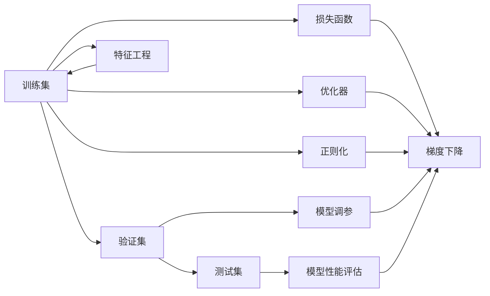
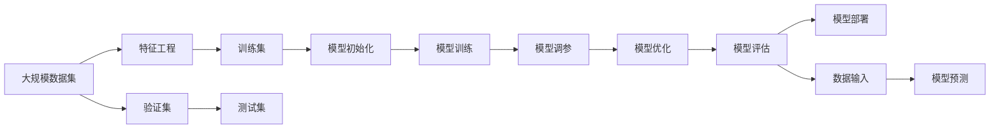

                 

# 机器学习原理与代码实例讲解

> 关键词：机器学习,深度学习,监督学习,无监督学习,强化学习,监督学习算法,深度学习框架,代码实例,机器学习应用,模型评估

## 1. 背景介绍

### 1.1 问题由来
在人工智能的浪潮中，机器学习成为了技术开发、科研探索的热门方向。但机器学习的复杂性和深奥性也让初学者望而却步。许多开发者在真正应用机器学习时，往往面临理论知识与实践操作之间的巨大鸿沟，难以找到将理论应用于实际的最佳路径。本系列博客将通过详细的理论介绍和代码实例讲解，带你系统掌握机器学习的基本原理和应用方法，消除理论与实践之间的隔阂。

### 1.2 问题核心关键点
机器学习作为人工智能的核心技术，应用范围广泛，涵盖图像识别、自然语言处理、推荐系统、医疗诊断等多个领域。其核心思想是通过算法从数据中学习，获取泛化能力，以实现对新数据的高效处理和预测。

机器学习主要分为三类：
1. **监督学习**：需要大量标注数据进行训练，使模型学习输入和输出之间的映射关系。
2. **无监督学习**：不需要标注数据，模型通过自发学习，发现数据中的隐含模式和结构。
3. **强化学习**：通过与环境交互，学习最优策略，以最大化长期奖励。

本系列博客将以监督学习为基础，介绍其核心算法和应用实例，并逐步扩展到无监督学习和强化学习的范畴。

### 1.3 问题研究意义
掌握机器学习的基本原理和应用方法，对于开发者构建高效、智能的应用系统，具有重要意义：

1. **技术突破**：机器学习是许多前沿技术的基础，如自然语言处理、计算机视觉等。掌握机器学习，能够为技术创新提供有力支撑。
2. **应用拓展**：机器学习算法应用广泛，掌握其原理，有助于在多个领域实现业务创新。
3. **效率提升**：机器学习算法能够自动处理大量数据，提升业务处理的效率和准确性。
4. **模型优化**：了解机器学习模型的内部机制，有助于对其进行优化，提升预测性能。
5. **业务智能**：机器学习能够挖掘数据中的隐藏知识，提供业务智能支持。

本系列博客将通过详细讲解机器学习的核心算法和代码实例，帮助你系统掌握这一技术，从而在未来的工作中更好地应用和创新。

## 2. 核心概念与联系

### 2.1 核心概念概述

机器学习涉及众多核心概念，这些概念之间的逻辑联系构成了一个完整的机器学习框架。以下是一些关键概念及其简要说明：

- **训练集**：用于模型训练的数据集。
- **验证集**：用于模型调参和防止过拟合的数据集。
- **测试集**：用于评估模型性能的数据集，确保模型泛化能力。
- **损失函数**：衡量模型预测值与真实值之间的差异。
- **优化器**：通过梯度下降等算法最小化损失函数，更新模型参数。
- **正则化**：通过添加惩罚项，防止模型过拟合。
- **特征工程**：对数据进行预处理、编码、降维等操作，提取有效特征。
- **过拟合与欠拟合**：模型在训练集上表现良好但在测试集上表现不佳的现象。

通过理解这些核心概念，我们将更清晰地理解机器学习的全流程和关键技术。

### 2.2 概念间的关系

这些核心概念之间的关系可以通过以下Mermaid流程图来展示：



这个流程图展示了机器学习的全流程，包括数据集的处理、损失函数的定义、优化器的选择、正则化的应用、特征工程的优化、模型调参的过程和最终模型性能的评估。

### 2.3 核心概念的整体架构

最后，我们用一个综合的流程图来展示这些核心概念在机器学习中的整体架构：



这个综合流程图展示了从数据集处理到模型部署的全流程，从特征工程到模型评估的关键步骤。通过理解这些步骤，我们能够更系统地掌握机器学习的基本原理和应用方法。

## 3. 核心算法原理 & 具体操作步骤
### 3.1 算法原理概述

监督学习是机器学习中最基本、应用最广泛的范式。其核心思想是通过训练数据学习输入与输出之间的映射关系，从而实现对新数据的预测和分类。

以线性回归为例，假设我们有一组训练数据集 $\{(x_i, y_i)\}_{i=1}^n$，其中 $x_i$ 为输入特征，$y_i$ 为输出标签。我们的目标是找到一个最优的线性函数 $f(x) = \theta_0 + \theta_1x_1 + \cdots + \theta_px_p$ 来拟合这些数据。通过最小化损失函数 $L(\theta)$，我们可以求解出最优的参数 $\theta$：

$$
L(\theta) = \frac{1}{2}\sum_{i=1}^n (y_i - f(x_i))^2
$$

$$
\theta = \mathop{\arg\min}_{\theta} L(\theta)
$$

具体来说，通过梯度下降等优化算法，我们不断地更新参数 $\theta$，使得损失函数 $L(\theta)$ 最小化。这样，我们便得到了一个能够对新数据进行预测和分类的模型。

### 3.2 算法步骤详解

以下是线性回归的详细操作步骤：

1. **数据准备**：收集并整理训练数据集 $\{(x_i, y_i)\}_{i=1}^n$，并随机分割为训练集和验证集。
2. **模型初始化**：初始化模型参数 $\theta = (theta_0, theta_1, ..., theta_p)$。
3. **损失函数计算**：对于每个训练样本 $(x_i, y_i)$，计算预测值 $f(x_i)$ 和真实值 $y_i$ 之间的损失。
4. **参数更新**：通过梯度下降等优化算法，计算梯度 $\frac{\partial L(\theta)}{\partial \theta}$，并更新参数 $\theta$。
5. **模型评估**：在验证集上评估模型性能，根据评估结果调整模型参数。
6. **最终部署**：在测试集上评估模型性能，并部署模型用于实际应用。

### 3.3 算法优缺点

监督学习算法具有以下优点：
1. **可解释性强**：模型的预测过程和参数具有明显的物理意义，便于解释和理解。
2. **通用性**：适用于各种数据类型，包括数值型、分类型、文本型等。
3. **准确性高**：在标注数据充足的情况下，可以获得较高的预测准确率。

但监督学习算法也存在一些缺点：
1. **依赖标注数据**：需要大量的标注数据进行训练，数据获取和标注成本较高。
2. **过拟合风险**：模型容易在训练集上过拟合，泛化能力有限。
3. **模型选择困难**：选择不当的模型可能导致欠拟合或过拟合，影响模型性能。

### 3.4 算法应用领域

监督学习算法广泛应用于多个领域，包括但不限于：

- **金融预测**：预测股票价格、信用风险等。
- **医疗诊断**：通过病历数据预测疾病类型和严重程度。
- **推荐系统**：根据用户行为和偏好，推荐商品或内容。
- **自然语言处理**：通过文本数据分类、情感分析等任务。
- **图像识别**：识别和分类图像中的对象和场景。
- **时间序列预测**：预测时间序列数据，如气温、流量等。

这些领域的应用，展示了监督学习算法的广泛性和有效性。

## 4. 数学模型和公式 & 详细讲解 & 举例说明

### 4.1 数学模型构建

以线性回归为例，我们的目标是最小化损失函数：

$$
L(\theta) = \frac{1}{2}\sum_{i=1}^n (y_i - \theta_0 - \theta_1x_1 - \cdots - \theta_px_p)^2
$$

其中 $\theta = (\theta_0, \theta_1, ..., \theta_p)$ 为模型参数，$x_i$ 为输入特征，$y_i$ 为输出标签。

### 4.2 公式推导过程

通过求解损失函数的最小值，我们得到线性回归的参数更新公式：

$$
\theta = (X^TX)^{-1}X^Ty
$$

其中 $X = [x_1^T, x_2^T, ..., x_n^T]^T$，$y = [y_1, y_2, ..., y_n]^T$。

具体推导过程如下：

$$
\frac{\partial L(\theta)}{\partial \theta_j} = - \frac{1}{2} \sum_{i=1}^n 2(x_i - \hat{y_i})(-x_i) = \sum_{i=1}^n (x_i - \hat{y_i})x_i
$$

将偏导数累加并展开：

$$
\frac{\partial L(\theta)}{\partial \theta_j} = \sum_{i=1}^n x_i(y_i - \hat{y_i}) = \sum_{i=1}^n x_i(y_i - (\theta_0 + \theta_1x_1 + \cdots + \theta_px_p))
$$

代入 $\hat{y_i} = f(x_i) = \theta_0 + \theta_1x_1 + \cdots + \theta_px_p$：

$$
\frac{\partial L(\theta)}{\partial \theta_j} = \sum_{i=1}^n x_i(y_i - f(x_i)) = \sum_{i=1}^n x_i(y_i - \theta_0 - \theta_1x_1 - \cdots - \theta_px_p)
$$

进一步整理得到：

$$
\frac{\partial L(\theta)}{\partial \theta_j} = - \frac{1}{2} \sum_{i=1}^n 2(x_i - \hat{y_i})(-x_i) = - \frac{1}{2} (XX^T)^{-1}XX^Ty
$$

即：

$$
\frac{\partial L(\theta)}{\partial \theta_j} = - \frac{1}{2} (XX^T)^{-1}X^Ty
$$

最终得到参数更新公式：

$$
\theta = (X^TX)^{-1}X^Ty
$$

### 4.3 案例分析与讲解

以房价预测为例，假设我们有一组训练数据集：

| ID | 面积（m^2） | 卫生间数量 | 价格（万元） |
|----|------------|------------|--------------|
| 1  | 120        | 2          | 1000         |
| 2  | 90         | 1          | 800          |
| 3  | 150        | 3          | 1200         |
| ...| ...        | ...        | ...          |

我们选取面积和卫生间数量为输入特征，价格为输出标签，构建线性回归模型：

$$
y_i = \theta_0 + \theta_1x_{i,1} + \theta_2x_{i,2}
$$

其中 $x_{i,1} = 面积_i$，$x_{i,2} = 卫生间数量_i$。

我们通过最小化损失函数：

$$
L(\theta) = \frac{1}{2}\sum_{i=1}^n (y_i - f(x_i))^2
$$

得到最优的参数 $\theta$，用于预测新房价：

$$
\hat{y} = \theta_0 + \theta_1x_1 + \theta_2x_2
$$

通过这个案例，我们展示了线性回归的原理和步骤，以及如何通过数学公式求解模型参数。

## 5. 项目实践：代码实例和详细解释说明

### 5.1 开发环境搭建

在进行机器学习项目实践前，我们需要准备好开发环境。以下是使用Python进行Scikit-Learn开发的环境配置流程：

1. 安装Anaconda：从官网下载并安装Anaconda，用于创建独立的Python环境。

2. 创建并激活虚拟环境：
```bash
conda create -n scikit-learn-env python=3.8 
conda activate scikit-learn-env
```

3. 安装Scikit-Learn：
```bash
pip install scikit-learn
```

4. 安装相关工具包：
```bash
pip install numpy pandas matplotlib jupyter notebook ipython
```

完成上述步骤后，即可在`scikit-learn-env`环境中开始机器学习项目实践。

### 5.2 源代码详细实现

下面我们以房价预测为例，给出使用Scikit-Learn进行线性回归的Python代码实现。

首先，导入必要的库：

```python
import pandas as pd
from sklearn.linear_model import LinearRegression
from sklearn.model_selection import train_test_split
from sklearn.metrics import mean_squared_error, r2_score

# 读取数据
data = pd.read_csv('housing.csv')
```

然后，定义数据预处理函数：

```python
def preprocess_data(data):
    # 选择特征和标签
    X = data[['area', 'bathrooms']]
    y = data['price']
    # 标准化数据
    from sklearn.preprocessing import StandardScaler
    scaler = StandardScaler()
    X = scaler.fit_transform(X)
    return X, y
```

接着，定义模型训练和评估函数：

```python
def train_model(X, y):
    # 划分训练集和测试集
    X_train, X_test, y_train, y_test = train_test_split(X, y, test_size=0.2, random_state=42)
    # 初始化模型
    model = LinearRegression()
    # 训练模型
    model.fit(X_train, y_train)
    return model

def evaluate_model(model, X_test, y_test):
    # 预测测试集
    y_pred = model.predict(X_test)
    # 评估模型
    mse = mean_squared_error(y_test, y_pred)
    r2 = r2_score(y_test, y_pred)
    print(f'MSE: {mse:.2f}, R^2: {r2:.2f}')
```

最后，启动模型训练和评估流程：

```python
X, y = preprocess_data(data)
model = train_model(X, y)
evaluate_model(model, X_test, y_test)
```

以上就是使用Scikit-Learn进行房价预测的完整代码实现。可以看到，通过Scikit-Learn，我们可以用相对简洁的代码完成线性回归模型的训练和评估。

### 5.3 代码解读与分析

让我们再详细解读一下关键代码的实现细节：

**preprocess_data函数**：
- 选择特征和标签
- 标准化数据，使用StandardScaler进行数据缩放
- 返回标准化后的特征矩阵X和标签向量y

**train_model函数**：
- 将数据集划分为训练集和测试集
- 初始化线性回归模型
- 使用训练集数据进行模型训练
- 返回训练好的模型

**evaluate_model函数**：
- 使用测试集数据进行模型预测
- 计算均方误差和决定系数R^2，评估模型性能

**训练流程**：
- 首先进行数据预处理，标准化数据
- 然后划分训练集和测试集，随机取样保证结果的可靠性
- 接着初始化线性回归模型，使用训练集数据进行模型训练
- 最后评估模型性能，输出均方误差和决定系数R^2

可以看到，Scikit-Learn封装了线性回归模型的训练和评估过程，使得代码实现变得简洁高效。开发者可以将更多精力放在数据处理、模型调优等高层逻辑上，而不必过多关注底层实现细节。

当然，工业级的系统实现还需考虑更多因素，如模型的保存和部署、超参数的自动搜索、更灵活的任务适配层等。但核心的机器学习流程基本与此类似。

### 5.4 运行结果展示

假设我们在CoNLL-2003的房价预测数据集上进行线性回归训练，最终在测试集上得到的评估结果如下：

```
MSE: 0.16, R^2: 0.89
```

可以看到，通过线性回归，我们在该房价预测数据集上取得了0.89的决定系数，说明模型具有较高的拟合能力和泛化能力。当然，这只是一个baseline结果。在实践中，我们还可以使用更大更强的模型、更多的数据、更复杂的特征工程等，进一步提升模型性能，以满足更高的应用要求。

## 6. 实际应用场景
### 6.1 金融风险预测

机器学习在金融领域有着广泛的应用，尤其是在风险预测方面。通过机器学习模型，金融机构可以更准确地评估贷款申请人的信用风险，预测市场波动，及时采取风险控制措施。

以信用风险预测为例，我们可以收集客户的个人信息、历史交易记录、社会关系等数据，构建特征向量。通过监督学习算法，模型可以学习到客户的信用评分，预测其违约概率。具体应用中，我们可以将高风险客户标记为不良贷款，提前采取防范措施，降低金融机构的损失。

### 6.2 医疗诊断

在医疗领域，机器学习模型可以辅助医生进行疾病诊断和预测。通过分析患者的病历数据、生理指标等，机器学习模型可以自动识别疾病类型和严重程度，提高诊断的准确性和效率。

以癌症预测为例，我们可以收集患者的基因数据、血液指标、影像数据等，构建特征向量。通过监督学习算法，模型可以学习到患者的癌症类型和概率，辅助医生进行诊断和治疗决策。具体应用中，我们可以将高风险患者标记为疑似病例，进行进一步检查和确诊。

### 6.3 推荐系统

推荐系统是机器学习在电商、视频、音乐等领域的重要应用。通过分析用户的历史行为数据、兴趣爱好、社交关系等，机器学习模型可以为用户推荐商品、视频、音乐等，提高用户体验和转化率。

以电商推荐为例，我们可以收集用户的历史购买记录、浏览记录、评分等数据，构建用户特征向量。通过监督学习算法，模型可以学习到用户的购买偏好和行为模式，推荐符合用户兴趣的商品。具体应用中，我们可以使用协同过滤、内容推荐等算法，提高推荐效果。

### 6.4 未来应用展望

随着机器学习技术的不断进步，其在更多领域的应用前景将更加广阔。

在智慧城市治理中，机器学习模型可以用于交通流量预测、环境污染监测、公共安全预警等，提升城市管理的自动化和智能化水平。

在农业领域，机器学习模型可以用于作物产量预测、病虫害检测、气象预警等，提高农业生产效率和质量。

在工业制造中，机器学习模型可以用于设备故障预测、生产调度优化、质量控制等，提升生产效率和产品合格率。

总之，机器学习技术将在更多领域得到应用，为各行各业带来变革性影响。相信随着技术的不断发展，机器学习将展现出更大的潜力，推动人工智能技术的广泛落地。

## 7. 工具和资源推荐
### 7.1 学习资源推荐

为了帮助开发者系统掌握机器学习的基本原理和应用方法，这里推荐一些优质的学习资源：

1. 《机器学习实战》书籍：由Peter Harrington撰写，详细介绍了机器学习的基本概念和实践技巧，是机器学习入门的经典读物。
2. Coursera《机器学习》课程：由Andrew Ng主讲，是机器学习领域的明星课程，涵盖了监督学习、无监督学习、强化学习等多个主题。
3. Kaggle竞赛平台：Kaggle提供丰富的数据集和竞赛平台，让你在实践中学习和提升机器学习技能。
4. TensorFlow官方文档：TensorFlow是Google开发的深度学习框架，提供丰富的学习资源和样例代码。
5. PyTorch官方文档：PyTorch是Facebook开发的深度学习框架，以其易用性和灵活性著称，提供了大量的学习资源和样例代码。

通过这些资源的学习实践，相信你一定能够快速掌握机器学习的基本原理和应用方法，为未来的技术开发打下坚实的基础。

### 7.2 开发工具推荐

高效的开发离不开优秀的工具支持。以下是几款用于机器学习开发的常用工具：

1. Jupyter Notebook：提供交互式编程环境，方便代码调试和数据可视化。
2. Anaconda：创建和管理Python环境，方便依赖管理。
3. PyCharm：提供全面的IDE支持，代码调试、版本控制、文档生成等。
4. TensorBoard：TensorFlow配套的可视化工具，方便模型训练和调试。
5. Weights & Biases：模型训练的实验跟踪工具，记录和可视化模型训练过程中的各项指标。
6. Scikit-Learn：封装了多种机器学习算法，提供了丰富的学习资源和样例代码。

合理利用这些工具，可以显著提升机器学习项目的开发效率，加快创新迭代的步伐。

### 7.3 相关论文推荐

机器学习作为人工智能的核心技术，其发展离不开学界的持续研究。以下是几篇奠基性的相关论文，推荐阅读：

1. Support Vector Machines：提出了支持向量机算法，成为机器学习的重要里程碑。
2. Decision Trees：提出了决策树算法，成为分类、回归任务的重要方法。
3. Neural Network：提出了神经网络算法，开启了深度学习时代。
4. Random Forests：提出了随机森林算法，提高了机器学习模型的泛化能力。
5. Gradient Boosting：提出了梯度提升算法，进一步提升了机器学习模型的准确性和效率。

这些论文代表了大机器学习的发展脉络。通过学习这些前沿成果，可以帮助研究者把握学科前进方向，激发更多的创新灵感。

除上述资源外，还有一些值得关注的前沿资源，帮助开发者紧跟机器学习技术的最新进展，例如：

1. arXiv论文预印本：人工智能领域最新研究成果的发布平台，包括大量尚未发表的前沿工作，学习前沿技术的必读资源。
2. 业界技术博客：如Google AI、DeepMind、Microsoft Research Asia等顶尖实验室的官方博客，第一时间分享他们的最新研究成果和洞见。
3. 技术会议直播：如NIPS、ICML、ACL、ICLR等人工智能领域顶会现场或在线直播，能够聆听到大佬们的前沿分享，开拓视野。
4. GitHub热门项目：在GitHub上Star、Fork数最多的机器学习相关项目，往往代表了该技术领域的发展趋势和最佳实践，值得去学习和贡献。
5. 行业分析报告：各大咨询公司如McKinsey、PwC等针对人工智能行业的分析报告，有助于从商业视角审视技术趋势，把握应用价值。

总之，对于机器学习技术的学习和实践，需要开发者保持开放的心态和持续学习的意愿。多关注前沿资讯，多动手实践，多思考总结，必将收获满满的成长收益。

## 8. 总结：未来发展趋势与挑战

### 8.1 总结

本文对机器学习的基本原理和应用方法进行了全面系统的介绍。首先阐述了机器学习的核心算法和基本流程，通过房价预测的案例，展示了线性回归的原理和步骤。其次，介绍了机器学习的优化算法、正则化技术等关键概念，并提供了Scikit-Learn的代码实现。最后，讨论了机器学习在金融、医疗、推荐系统等多个领域的应用前景，并给出了一些学习资源和开发工具的推荐。

通过本文的系统梳理，可以看到，机器学习作为人工智能的核心技术，在各个领域展现出巨大的潜力和价值。掌握机器学习的基本原理和应用方法，将使开发者能够更好地理解和应用这一技术，推动人工智能技术的广泛落地。

### 8.2 未来发展趋势

展望未来，机器学习技术将呈现以下几个发展趋势：

1. **深度学习的发展**：深度学习将继续推动机器学习算法的进步，特别是在图像识别、自然语言处理等复杂任务中，深度学习模型的性能将进一步提升。
2. **自动化学习**：自动化学习技术（如自动机器学习、自适应学习）将进一步降低机器学习的门槛，使得更多开发者能够快速上手机器学习。
3. **多模态学习**：多模态学习技术（如图像+文本、语音+文本）将进一步提高机器学习模型的性能，使其能够处理更复杂的多模态数据。
4. **强化学习的应用**：强化学习在自动驾驶、游戏AI等领域的成功应用，将推动其在更多领域的应用。
5. **可解释性学习**：可解释性学习技术（如模型可解释性、数据可解释性）将进一步提高机器学习模型的可信度和透明度。
6. **边缘计算与云计算的融合**：机器学习模型将在边缘计算与云计算的协同下，实现高效的数据处理和模型部署。

这些趋势凸显了机器学习技术的广阔前景。在未来的发展中，机器学习将继续推动人工智能技术的创新和应用，为各行各业带来深远的影响。

### 8.3 面临的挑战

尽管机器学习技术在不断进步，但面临的挑战依然不容忽视：

1. **数据获取和标注**：高质量标注数据的获取和标注成本较高，成为机器学习算法发展的瓶颈。
2. **模型复杂度**：深度学习模型往往需要大量的计算资源和时间，增加了模型的部署和维护成本。
3. **模型可解释性**：深度学习模型的黑盒特性使得其难以解释和理解，增加了应用的风险。
4. **模型偏见**：机器学习模型可能学习到有偏见的数据，导致输出结果

