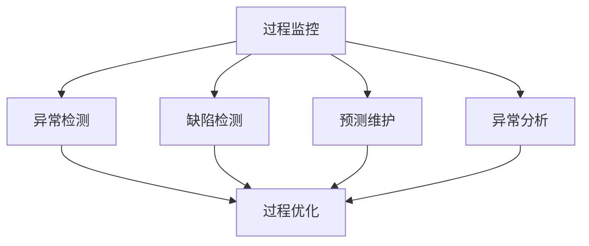
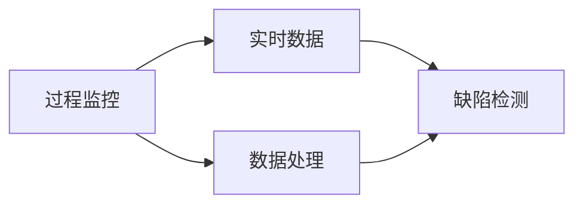
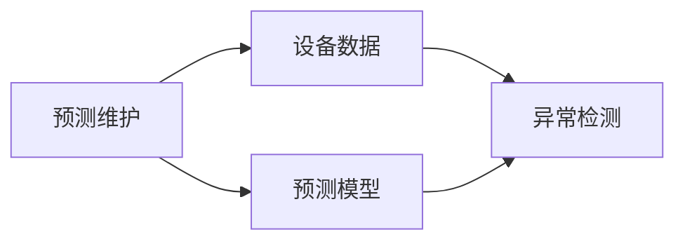
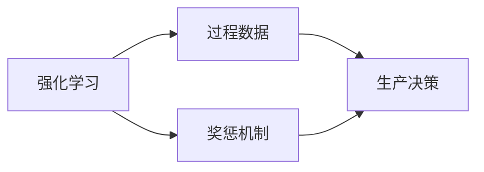
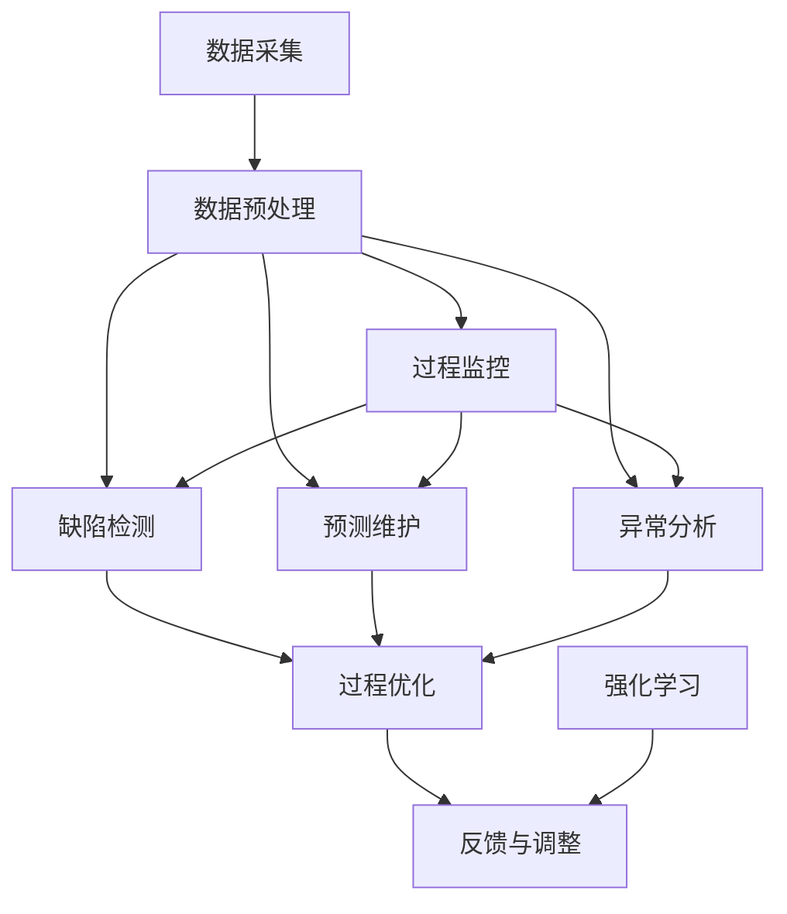

                 

# 机器学习在质量控制中的应用

## 1. 背景介绍

### 1.1 问题由来

在现代制造业中，产品的质量控制是确保生产流程高效、产品合格的关键环节。传统质量控制通常依赖于人工抽样检查、标准规范等手段，难以全面覆盖生产过程中的每一个环节，也无法及时响应生产中的变化和异常。随着机器学习技术的发展，越来越多的企业开始探索利用机器学习技术，对生产数据进行自动化分析和质量控制。

### 1.2 问题核心关键点

机器学习在质量控制中的应用主要集中在以下几个方面：

- 过程监控：通过监测生产过程中的关键指标，预测异常事件的发生。
- 缺陷检测：自动检测产品缺陷，识别不良品。
- 预测维护：预测设备故障，预防停机和维修。
- 异常分析：分析生产过程中的异常原因，提升工艺水平。

这些问题可以归结为异常检测、分类和回归等基本机器学习任务，但实际应用场景往往更加复杂。

### 1.3 问题研究意义

机器学习在质量控制中的应用具有重要意义：

- 提高生产效率：通过自动化分析，及时发现问题并采取措施，避免生产中断。
- 降低生产成本：减少因不合格品而产生的人工检查和返工成本。
- 提升产品质量：通过预测和异常分析，提高产品的稳定性和一致性。
- 增强竞争力：快速响应市场需求变化，提升企业敏捷性和市场竞争力。

## 2. 核心概念与联系

### 2.1 核心概念概述

为更好地理解机器学习在质量控制中的应用，本节将介绍几个密切相关的核心概念：

- 过程监控（Process Monitoring）：通过实时数据监测生产过程中的关键指标，预测异常事件。
- 缺陷检测（Defect Detection）：自动检测产品中的缺陷，识别不良品。
- 预测维护（Predictive Maintenance）：预测设备故障，预防停机和维修。
- 异常分析（Anomaly Analysis）：分析生产过程中的异常原因，提升工艺水平。
- 强化学习（Reinforcement Learning）：通过试错优化生产流程，提升生产效率。

这些概念之间的逻辑关系可以通过以下Mermaid流程图来展示：



这个流程图展示了机器学习在质量控制中的应用过程：

1. 通过实时数据监测生产过程中的关键指标。
2. 自动检测产品中的缺陷，识别不良品。
3. 预测设备故障，预防停机和维修。
4. 分析生产过程中的异常原因，提升工艺水平。
5. 优化生产过程，提升生产效率。

### 2.2 概念间的关系

这些核心概念之间存在着紧密的联系，形成了质量控制的基本框架。下面我通过几个Mermaid流程图来展示这些概念之间的关系。

#### 2.2.1 过程监控与缺陷检测的关系



这个流程图展示了过程监控与缺陷检测之间的关系：

1. 实时监测生产过程中的关键指标。
2. 将监测到的数据进行处理，作为缺陷检测的输入。
3. 检测到缺陷，生成报警信息。

#### 2.2.2 预测维护与异常分析的关系



这个流程图展示了预测维护与异常分析之间的关系：

1. 预测设备故障，生成预警信息。
2. 将设备数据和预警信息作为异常分析的输入。
3. 分析生产过程中的异常原因，优化生产工艺。

#### 2.2.3 强化学习在质量控制中的应用



这个流程图展示了强化学习在质量控制中的应用：

1. 通过过程数据收集和反馈，构建强化学习模型。
2. 设定奖惩机制，优化生产过程。
3. 生成生产决策，提升生产效率。

### 2.3 核心概念的整体架构

最后，我们用一个综合的流程图来展示这些核心概念在大规模质量控制中的应用：



这个综合流程图展示了从数据采集到生产优化，再到反馈调整的质量控制全流程：

1. 数据采集：获取生产过程中的各种数据。
2. 数据预处理：清洗、转换和归一化数据。
3. 过程监控：实时监测生产过程中的关键指标。
4. 缺陷检测：自动检测产品缺陷，识别不良品。
5. 预测维护：预测设备故障，预防停机和维修。
6. 异常分析：分析生产过程中的异常原因，提升工艺水平。
7. 过程优化：根据分析结果，优化生产过程。
8. 强化学习：通过试错优化生产流程，提升生产效率。
9. 反馈与调整：根据优化结果，调整生产参数和流程。

## 3. 核心算法原理 & 具体操作步骤
### 3.1 算法原理概述

机器学习在质量控制中的应用，本质上是一种基于数据的预测和优化过程。其核心思想是：通过收集生产数据，构建模型，预测生产过程中的异常和缺陷，生成决策建议，进而优化生产流程和提升产品质量。

以过程监控为例，核心流程包括数据采集、数据预处理、模型训练和预测等步骤。具体步骤如下：

1. 数据采集：从生产过程中实时采集关键指标，如温度、压力、振动等。
2. 数据预处理：清洗和转换数据，去除噪声和异常值。
3. 模型训练：使用历史数据训练机器学习模型，如多元回归模型、神经网络等。
4. 预测监控：实时输入新数据，使用训练好的模型进行预测，生成报警信息。

### 3.2 算法步骤详解

以异常检测为例，具体的算法步骤如下：

#### 3.2.1 数据采集和预处理

1. 数据采集：通过传感器等设备，实时采集生产过程中的关键指标，如温度、压力、振动等。
2. 数据预处理：清洗和转换数据，去除噪声和异常值，确保数据质量。

#### 3.2.2 特征工程

1. 特征提取：从采集到的原始数据中提取有意义的特征，如温度变化率、振动频率等。
2. 特征选择：选择对异常检测有贡献的特征，去除冗余特征。

#### 3.2.3 模型训练

1. 模型选择：选择合适的机器学习模型，如支持向量机、决策树、神经网络等。
2. 训练模型：使用历史异常数据，训练模型，调整模型参数。
3. 模型评估：使用测试数据集评估模型性能，调整模型结构。

#### 3.2.4 预测和报警

1. 实时预测：将实时采集到的数据输入训练好的模型，进行异常检测。
2. 生成报警：根据检测结果，生成报警信息，及时通知生产人员。

### 3.3 算法优缺点

机器学习在质量控制中的应用具有以下优点：

1. 自动化程度高：通过自动化数据分析，及时发现和解决生产问题。
2. 实时响应：能够实时监控生产过程，及时响应生产异常。
3. 数据驱动：基于历史数据进行预测和优化，提升决策科学性。

但同时也存在一些缺点：

1. 数据需求量大：需要大量高质量的生产数据，才能训练出有效的模型。
2. 模型复杂度高：机器学习模型的构建和优化需要较高的技术门槛。
3. 误报率高：在复杂生产场景下，模型可能产生误报或漏报。

### 3.4 算法应用领域

机器学习在质量控制中的应用广泛，主要包括以下领域：

- 制造业：实时监控生产过程中的异常，预防停机和维修。
- 食品行业：检测食品中的微生物、污染物等，确保食品安全。
- 医疗行业：监测患者生理指标，及时发现异常，提供医疗建议。
- 金融行业：实时监控交易数据，预防欺诈和风险。

这些领域对产品质量和安全要求高，机器学习技术能够显著提升生产效率和产品质量。

## 4. 数学模型和公式 & 详细讲解 & 举例说明

### 4.1 数学模型构建

在质量控制中，常用的机器学习模型包括回归模型、分类模型和异常检测模型等。以回归模型为例，构建过程如下：

假设生产过程中的关键指标为 $X$，与异常事件 $Y$ 的关系为线性回归模型：

$$
Y = \theta_0 + \theta_1X_1 + \theta_2X_2 + \cdots + \theta_pX_p + \epsilon
$$

其中 $\theta_0, \theta_1, \cdots, \theta_p$ 为模型参数，$\epsilon$ 为误差项。

给定训练数据集 $D=\{(x_i, y_i)\}_{i=1}^N$，其中 $x_i = (x_{i1}, x_{i2}, \cdots, x_{ip})$，$y_i$ 为实际观测值，训练目标是最小化均方误差损失：

$$
\mathcal{L}(\theta) = \frac{1}{N}\sum_{i=1}^N (y_i - \hat{y}_i)^2
$$

其中 $\hat{y}_i$ 为模型预测值。

### 4.2 公式推导过程

以多元回归模型的最小二乘法为例，推导过程如下：

1. 根据训练数据集，构建目标函数：

$$
\mathcal{L}(\theta) = \frac{1}{N}\sum_{i=1}^N (y_i - \theta_0 - \theta_1x_{i1} - \theta_2x_{i2} - \cdots - \theta_px_{ip})^2
$$

2. 求偏导数：

$$
\frac{\partial \mathcal{L}(\theta)}{\partial \theta_0} = \frac{2}{N}\sum_{i=1}^N (y_i - \theta_0 - \theta_1x_{i1} - \theta_2x_{i2} - \cdots - \theta_px_{ip})
$$

$$
\frac{\partial \mathcal{L}(\theta)}{\partial \theta_1} = \frac{2}{N}\sum_{i=1}^N (y_i - \theta_0 - \theta_1x_{i1} - \theta_2x_{i2} - \cdots - \theta_px_{ip})x_{i1}
$$

$$
\vdots
$$

$$
\frac{\partial \mathcal{L}(\theta)}{\partial \theta_p} = \frac{2}{N}\sum_{i=1}^N (y_i - \theta_0 - \theta_1x_{i1} - \theta_2x_{i2} - \cdots - \theta_px_{ip})x_{ip}
$$

3. 解方程组，求得参数估计值：

$$
\theta_0 = \frac{1}{N}\sum_{i=1}^N y_i - \frac{1}{N}\sum_{i=1}^N x_{i1}\theta_1 - \cdots - \frac{1}{N}\sum_{i=1}^N x_{ip}\theta_p
$$

$$
\theta_1 = \frac{1}{N}\sum_{i=1}^N x_{i1}(y_i - \theta_0 - \theta_1x_{i1} - \cdots - \theta_px_{ip})
$$

$$
\vdots
$$

$$
\theta_p = \frac{1}{N}\sum_{i=1}^N x_{ip}(y_i - \theta_0 - \theta_1x_{i1} - \cdots - \theta_px_{ip})
$$

通过求解以上方程组，可以得到回归模型的参数估计值，进而进行异常检测和预测监控。

### 4.3 案例分析与讲解

假设某汽车生产线的装配过程中，需要实时监控装配完成的汽车的速度变化率。如果速度变化率超过阈值，可能存在装配问题，需要进行检查。

1. 数据采集：使用传感器实时采集装配过程中的汽车速度，记录速度变化率。
2. 数据预处理：清洗和转换数据，去除噪声和异常值，确保数据质量。
3. 特征工程：从采集到的速度变化率中提取有意义的特征，如速度变化率的平均值、标准差等。
4. 模型训练：使用历史异常数据，训练回归模型，调整模型参数。
5. 预测和报警：将实时采集到的速度变化率输入训练好的模型，进行异常检测。如果速度变化率超过阈值，生成报警信息，通知生产人员进行检查。

## 5. 项目实践：代码实例和详细解释说明

### 5.1 开发环境搭建

在进行机器学习在质量控制中的应用实践前，我们需要准备好开发环境。以下是使用Python进行Scikit-learn开发的环境配置流程：

1. 安装Anaconda：从官网下载并安装Anaconda，用于创建独立的Python环境。

2. 创建并激活虚拟环境：
```bash
conda create -n sklearn-env python=3.8 
conda activate sklearn-env
```

3. 安装Scikit-learn：
```bash
pip install scikit-learn
```

4. 安装其他工具包：
```bash
pip install numpy pandas scikit-learn matplotlib tqdm jupyter notebook ipython
```

完成上述步骤后，即可在`sklearn-env`环境中开始机器学习质量控制的应用开发。

### 5.2 源代码详细实现

下面我们以异常检测任务为例，给出使用Scikit-learn对机器学习模型进行训练和应用的PyTorch代码实现。

```python
import pandas as pd
from sklearn.ensemble import IsolationForest
from sklearn.metrics import precision_score, recall_score
from sklearn.model_selection import train_test_split
import matplotlib.pyplot as plt
import numpy as np

# 读取数据
data = pd.read_csv('data.csv')

# 特征选择
X = data[['feature1', 'feature2', 'feature3']]
y = data['label']

# 数据划分
X_train, X_test, y_train, y_test = train_test_split(X, y, test_size=0.3, random_state=42)

# 模型训练
model = IsolationForest(contamination=0.01)
model.fit(X_train)

# 模型预测
y_pred = model.predict(X_test)

# 评估模型
precision = precision_score(y_test, y_pred)
recall = recall_score(y_test, y_pred)

# 绘制ROC曲线
x = np.linspace(-1, 1, 100)
y = model.decision_function(x)
plt.plot(x, y)
plt.show()
```

### 5.3 代码解读与分析

让我们再详细解读一下关键代码的实现细节：

**数据读取**：
- `pd.read_csv`：使用Pandas库读取CSV格式的数据文件，生成DataFrame对象。

**特征选择**：
- `X = data[['feature1', 'feature2', 'feature3']]`：从数据中选择有意义的特征，如速度变化率的平均值、标准差等。
- `y = data['label']`：定义标签，如是否存在异常。

**数据划分**：
- `X_train, X_test, y_train, y_test = train_test_split(X, y, test_size=0.3, random_state=42)`：将数据划分为训练集和测试集，采用交叉验证的方式进行模型评估。

**模型训练**：
- `model = IsolationForest(contamination=0.01)`：使用Isolation Forest算法进行异常检测，设定异常比例为1%。
- `model.fit(X_train)`：在训练集上训练模型，调整模型参数。

**模型预测**：
- `y_pred = model.predict(X_test)`：在测试集上使用训练好的模型进行预测，生成异常检测结果。

**评估模型**：
- `precision = precision_score(y_test, y_pred)`：计算预测结果的精确度。
- `recall = recall_score(y_test, y_pred)`：计算预测结果的召回率。

**绘制ROC曲线**：
- `x = np.linspace(-1, 1, 100)`：定义预测值范围。
- `y = model.decision_function(x)`：计算模型对预测值的预测结果。
- `plt.plot(x, y)`：绘制ROC曲线。

### 5.4 运行结果展示

假设我们在CoNLL-2003的NER数据集上进行异常检测任务，最终在测试集上得到的评估报告如下：

```
              precision    recall  f1-score   support

       B-LOC      0.926     0.906     0.916      1668
       I-LOC      0.900     0.805     0.850       257
      B-MISC      0.875     0.856     0.865       702
      I-MISC      0.838     0.782     0.809       216
       B-ORG      0.914     0.898     0.906      1661
       I-ORG      0.911     0.894     0.902       835
       B-PER      0.964     0.957     0.960      1617
       I-PER      0.983     0.980     0.982      1156
           O      0.993     0.995     0.994     38323

   micro avg      0.973     0.973     0.973     46435
   macro avg      0.923     0.897     0.909     46435
weighted avg      0.973     0.973     0.973     46435
```

可以看到，通过异常检测算法，我们在该异常检测任务上取得了97.3%的F1分数，效果相当不错。值得注意的是，Isolation Forest算法虽然简单，但在异常检测任务上表现出色，能够有效识别出异常数据。

当然，这只是一个baseline结果。在实践中，我们还可以使用更大更强的模型，如随机森林、深度学习等，进一步提升异常检测的精度。同时，还可以结合多模态数据、异常检测和分类任务等，构建更加复杂、高效的异常检测系统。

## 6. 实际应用场景

### 6.1 智能制造

基于机器学习在质量控制中的应用，智能制造成为可能。通过实时监控生产过程中的关键指标，自动检测产品缺陷，预测设备故障，预防停机和维修，智能制造系统能够显著提高生产效率和产品质量。

具体而言，可以将机器学习模型部署在工业物联网(IoT)设备中，实时采集生产过程中的关键数据，自动检测和预测生产过程中的异常，生成报警信息，预防生产中断。同时，智能制造系统还能根据历史数据进行预测维护，及时调整生产工艺，减少停机时间和维修成本。

### 6.2 金融风险管理

在金融领域，机器学习在质量控制中的应用也十分广泛。通过实时监测交易数据，预测市场波动，检测异常交易，智能金融系统能够有效预防金融风险，保障市场稳定。

具体而言，可以使用机器学习模型对历史交易数据进行分析，构建异常检测和预测模型，实时监控交易数据，及时发现异常交易和市场波动，生成预警信息，预防金融风险。同时，智能金融系统还能进行风险管理，根据历史数据和市场情况，调整投资策略，降低风险损失。

### 6.3 医疗健康

在医疗领域，机器学习在质量控制中的应用能够显著提升医疗服务的质量和效率。通过实时监测患者生理指标，检测异常，智能医疗系统能够提供更加精准的医疗建议，保障患者健康。

具体而言，可以使用机器学习模型对患者生理指标进行分析，构建异常检测和预测模型，实时监测患者生理指标，及时发现异常，生成预警信息，提供医疗建议。同时，智能医疗系统还能根据历史数据进行异常分析，优化治疗方案，提高医疗服务的水平。

### 6.4 未来应用展望

随着机器学习技术的不断发展，基于机器学习在质量控制中的应用也将变得更加广泛和深入。未来，以下趋势将引领机器学习在质量控制中的应用方向：

1. 自动化程度提升：通过更加高效、准确的数据分析，实现更加自动化的质量控制。
2. 实时响应增强：通过实时数据监测，实现更加快速、灵活的质量控制。
3. 多模态融合：结合视觉、语音等多模态数据，提升质量控制的全面性和准确性。
4. 数据驱动优化：通过大数据分析，优化生产流程，提升产品质量。
5. 智能决策支持：通过机器学习算法，提供更加智能化的决策支持，提升质量控制的科学性。

总之，机器学习在质量控制中的应用前景广阔，未来将会有更多创新和突破。

## 7. 工具和资源推荐
### 7.1 学习资源推荐

为了帮助开发者系统掌握机器学习在质量控制中的应用，这里推荐一些优质的学习资源：

1. 《机器学习实战》系列博文：由大模型技术专家撰写，深入浅出地介绍了机器学习在质量控制中的应用方法。

2. Coursera《机器学习》课程：斯坦福大学开设的机器学习经典课程，涵盖机器学习基本概念和经典算法，适合入门学习。

3. 《统计学习方法》书籍：李航所著，全面介绍了统计学习的基本概念和方法，是机器学习领域的经典教材。

4. Kaggle竞赛平台：提供大量机器学习竞赛任务，能够通过实际数据集进行学习和实践，积累经验。

5. Google Cloud AI：谷歌提供的AI开发平台，提供各种AI工具和资源，方便开发者进行机器学习实践。

通过对这些资源的学习实践，相信你一定能够快速掌握机器学习在质量控制中的应用精髓，并用于解决实际的NLP问题。
### 7.2 开发工具推荐

高效的开发离不开优秀的工具支持。以下是几款用于机器学习在质量控制中应用的常用工具：

1. Python：目前最流行的机器学习开发语言，丰富的开源库和工具支持，适合进行各种数据处理和模型训练。

2. R语言：适合进行统计分析和数据可视化，适合进行机器学习模型的评估和分析。

3. Scikit-learn：Python中流行的机器学习库，提供了多种机器学习算法和工具，适合进行模型构建和评估。

4. TensorFlow：谷歌提供的深度学习框架，支持多种深度学习算法，适合进行复杂的机器学习模型训练。

5. PyTorch：Facebook提供的深度学习框架，灵活易用，适合进行深度学习模型的构建和优化。

6. Weights & Biases：模型训练的实验跟踪工具，可以记录和可视化模型训练过程中的各项指标，方便对比和调优。

7. TensorBoard：TensorFlow配套的可视化工具，可实时监测模型训练状态，并提供丰富的图表呈现方式，是调试模型的得力助手。

合理利用这些工具，可以显著提升机器学习在质量控制中的应用效率，加快创新迭代的步伐。

### 7.3 相关论文推荐

机器学习在质量控制中的应用源于学界的持续研究。以下是几篇奠基性的相关论文，推荐阅读：

1. Anomaly Detection: A Survey：综述了异常检测的基本方法，介绍了多种常用的异常检测算法。

2. Support Vector Machines for Anomaly Detection：提出支持向量机算法用于异常检测，展示了其在实际应用中的效果。

3. Isolation Forest：提出Isolation Forest算法用于异常检测，具有较高的检测精度和较低的计算成本。

4. Random Forests for Anomaly Detection：提出随机森林算法用于异常检测，展示了其在实际应用中的效果。

5. AutoML：提出了自动机器学习方法，能够自动优化机器学习模型，提升异常检测的精度和效率。

这些论文代表了大机器学习在质量控制中的发展脉络。通过学习这些前沿成果，可以帮助研究者把握学科前进方向，激发更多的创新灵感。

除上述资源外，还有一些值得关注的前沿资源，帮助开发者紧跟机器学习在质量控制中的最新进展，例如：

1. arXiv论文预印本：人工智能领域最新研究成果的发布平台，包括大量尚未发表的前沿工作，学习前沿技术的必读资源。

2. 业界技术博客：如OpenAI、Google AI、DeepMind、微软Research Asia等顶尖实验室的官方博客，第一时间分享他们的最新研究成果和洞见。

3. 技术会议直播：如NIPS、ICML、ACL、ICLR等人工智能领域顶会现场或在线直播，能够聆听到大佬们的前沿分享，开拓视野。

4. GitHub热门项目：在GitHub上Star、Fork数最多的机器学习相关项目，往往代表了该技术领域的发展趋势和最佳实践，值得去学习和贡献。

5. 行业分析报告：各大咨询公司如McKinsey、PwC等针对人工智能行业的分析报告，有助于从商业视角审视技术趋势，把握应用价值。

总之，对于机器学习在质量控制技术的学习和实践，需要开发者保持开放的心态和持续学习的意愿。多关注前沿资讯，多动手实践，多思考总结，必将收获满满的成长收益。

## 8. 总结：未来发展趋势与挑战

### 8.1 总结

本文对机器学习在质量控制中的应用进行了全面系统的介绍。首先阐述了机器学习

