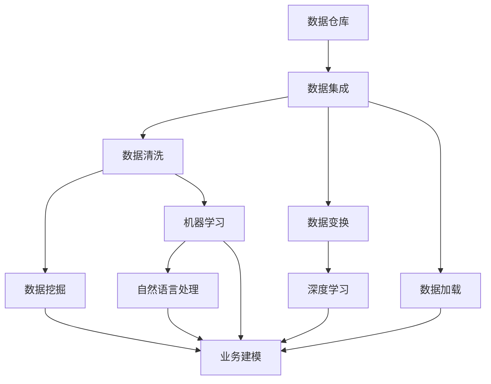

                 

# 洞见的价值：从理解到应用

洞见(Insight)是数据分析的核心，从数据中挖掘出隐藏的信息，指导决策。

## 1. 背景介绍

### 1.1 问题由来
洞见是数据驱动决策的基础，是决策者洞察未来、预测趋势、评估风险的重要工具。在数据驱动的商业环境中，洞见的应用场景包括但不限于客户分析、营销策略、产品研发、供应链优化、风险管理等。

在数据领域，近年来大数据、人工智能技术迅速发展，数据量不断激增，数据种类日趋多样化。人们面临的问题是如何在海量数据中迅速获取有价值的洞见，并指导实际决策。

### 1.2 问题核心关键点
要解决数据洞见的提取与应用问题，需要从以下几个方面进行考量：
1. **数据质量**：确保数据准确、完整、及时、一致。
2. **数据存储**：优化数据存储架构，支持高效的数据访问。
3. **数据处理**：采用合适的数据处理算法和技术，提取出有价值的信息。
4. **洞见分析**：选择合适的洞见分析方法，实现对数据的深入理解和解读。
5. **应用场景**：将洞见转化为实际的决策指导，推动业务落地。

### 1.3 问题研究意义
洞见分析技术的进步，能够有效提升决策效率和准确性，加速业务创新，提高竞争优势。

1. **减少决策偏差**：通过数据驱动的分析，降低人为因素对决策的影响。
2. **精准定位客户**：客户洞见能帮助企业更好地理解客户需求，提升客户满意度。
3. **优化供应链**：供应链洞见能够提高库存管理，降低成本。
4. **提升营销效果**：通过营销洞见，提升广告投放的精准度和转化率。
5. **防控风险**：风险管理洞见有助于识别和防范潜在的风险点，保障业务健康运行。

## 2. 核心概念与联系

### 2.1 核心概念概述

在深入探讨洞见分析技术之前，需要理解几个关键概念：

- **数据仓库**：用于数据存储、管理和分析的数据管理平台，支持数据集成、清洗、变换、加载等功能。
- **数据挖掘**：通过自动化算法和统计学方法从大数据中提取有价值的信息和知识的过程。
- **机器学习**：使用算法和统计模型，训练模型以进行预测和决策。
- **深度学习**：一种机器学习的方法，通过神经网络模型学习数据的表示和规律。
- **自然语言处理**：使计算机能够理解、解释和生成人类语言的技术。

这些概念通过以下 Mermaid 流程图来展示它们之间的关系：



### 2.2 概念间的关系

- **数据仓库**：是数据管理和分析的基础平台，支持数据挖掘、机器学习等高级分析技术。
- **数据挖掘**：通过自动化算法从数据中提取模式和规律，是洞见分析的基础工具。
- **机器学习**：通过训练模型进行预测和决策，在洞见分析中广泛应用。
- **深度学习**：是一种高级的机器学习方法，能处理复杂数据，在自然语言处理等任务中发挥重要作用。
- **自然语言处理**：实现人机之间的自然语言交互，是获取和处理文本数据的重要手段。
- **业务建模**：将洞见转化为具体的业务决策和应用，是洞见分析的最终目标。

## 3. 核心算法原理 & 具体操作步骤
### 3.1 算法原理概述

洞见分析的算法原理主要基于数据挖掘、机器学习和深度学习等技术。其核心思想是通过数据处理和算法计算，提取数据中的隐含信息，从而指导决策。

从数据处理的角度来看，洞见分析通常包含以下几个步骤：

1. **数据清洗与预处理**：去除数据中的噪声和错误，转换数据格式，保证数据质量。
2. **特征提取与工程**：从数据中提取出有意义的特征，并进行特征工程，如归一化、标准化等。
3. **模型训练与优化**：选择适当的模型，并对其进行训练和参数调优，提高模型的准确性和泛化能力。
4. **洞见提取与验证**：通过测试集对模型进行验证，并从模型输出中提取洞见。
5. **洞见应用与部署**：将洞见转化为实际的业务指导，并在生产环境中应用。

### 3.2 算法步骤详解

#### 3.2.1 数据清洗与预处理

数据清洗和预处理是洞见分析的第一步，旨在提高数据质量，确保数据能够有效支持后续分析。具体步骤如下：

1. **数据采集**：从各种数据源（如数据库、API、日志文件等）采集数据。
2. **数据去重**：删除重复记录，保证数据唯一性。
3. **缺失值处理**：对缺失数据进行处理，如插值、删除等。
4. **异常值检测**：检测和处理异常值，保证数据正常分布。
5. **数据转换**：将数据转换为适合分析的格式，如日期格式、类别编码等。

#### 3.2.2 特征提取与工程

特征提取与工程是洞见分析的核心步骤，通过提取有意义的特征，构建模型进行预测和决策。具体步骤如下：

1. **特征选择**：选择对目标变量有较大影响的特征，排除无用或冗余特征。
2. **特征缩放**：对特征进行标准化或归一化，如z-score标准化、min-max归一化等。
3. **特征组合**：通过特征组合或特征交叉，提取更高层次的特征。
4. **特征编码**：将非数值型特征转换为数值型特征，如独热编码、标签编码等。
5. **特征降维**：通过主成分分析、t-SNE等方法，降低特征维度，提高模型效率。

#### 3.2.3 模型训练与优化

模型训练与优化是洞见分析的核心步骤，通过选择合适的模型，并进行参数调优，构建高精度的预测模型。具体步骤如下：

1. **选择合适的模型**：根据任务类型选择合适的模型，如线性回归、决策树、随机森林、神经网络等。
2. **数据划分**：将数据划分为训练集、验证集和测试集，用于模型训练和评估。
3. **模型训练**：使用训练集数据训练模型，调整模型参数。
4. **模型验证**：在验证集上评估模型性能，选择最佳模型。
5. **模型优化**：通过交叉验证、参数调优等方法，优化模型性能。

#### 3.2.4 洞见提取与验证

洞见提取与验证是洞见分析的关键步骤，通过测试集对模型进行验证，并从模型输出中提取洞见。具体步骤如下：

1. **模型评估**：在测试集上评估模型性能，计算准确率、召回率、F1-score等指标。
2. **洞见提取**：从模型输出中提取洞见，如关联规则、分类结果、聚类结果等。
3. **洞见验证**：将洞见与实际业务需求进行对比，验证洞见的有效性和可行性。

#### 3.2.5 洞见应用与部署

洞见应用与部署是洞见分析的最终步骤，将洞见转化为实际的业务指导，并在生产环境中应用。具体步骤如下：

1. **业务场景分析**：分析业务场景和需求，确定洞见的实际应用场景。
2. **业务流程优化**：基于洞见进行业务流程优化，提升业务效率和效果。
3. **应用系统集成**：将洞见应用系统集成到现有的业务系统中，进行实时决策。
4. **效果监控**：监控洞见应用效果，收集反馈信息，不断改进洞见模型。

### 3.3 算法优缺点

洞见分析的算法具有以下优点：

1. **自动化程度高**：通过自动化算法和机器学习技术，提高分析效率和准确性。
2. **可扩展性强**：适用于各种类型和规模的数据，灵活应对不同业务需求。
3. **应用范围广**：涵盖客户分析、营销策略、供应链优化、风险管理等多个领域。
4. **可复用性好**：通过构建通用的分析模型，复用性强，节省时间和成本。

同时，洞见分析也存在以下缺点：

1. **数据依赖性强**：洞见分析依赖于数据质量，数据偏差可能导致洞见错误。
2. **模型复杂度高**：复杂的模型容易过拟合，需要大量数据和计算资源支持。
3. **业务理解要求高**：洞见分析需要深入理解业务需求，才能提出有价值的洞见。
4. **算法复杂度高**：需要深入了解数据挖掘、机器学习等算法，才能进行有效的洞见分析。
5. **结果解释困难**：复杂的模型和算法结果，不易于解释和理解，可能导致决策者误解。

### 3.4 算法应用领域

洞见分析广泛应用于多个领域，具体包括但不限于：

- **客户分析**：通过客户数据挖掘，识别客户特征和行为，制定个性化的营销策略。
- **营销策略**：分析营销数据，评估营销效果，优化广告投放和渠道策略。
- **产品研发**：通过产品使用数据，提取用户需求和反馈，指导产品迭代和改进。
- **供应链管理**：分析供应链数据，优化库存管理和物流策略，提升供应链效率。
- **风险管理**：分析风险数据，识别风险点，制定风险防控措施，降低风险损失。
- **智能决策支持**：构建智能决策支持系统，辅助决策者进行快速、准确的决策。

## 4. 数学模型和公式 & 详细讲解 & 举例说明

### 4.1 数学模型构建

洞见分析的数学模型构建，主要基于统计学和机器学习的理论基础。以线性回归模型为例，其基本数学模型为：

$$y = \beta_0 + \sum_{i=1}^p \beta_i x_i + \epsilon$$

其中，$y$ 为目标变量，$x_i$ 为自变量，$\beta_0$ 和 $\beta_i$ 为模型系数，$\epsilon$ 为随机误差。

### 4.2 公式推导过程

以线性回归模型为例，推导其最小二乘法估计公式：

假设训练数据集为 $D = \{(x_i, y_i)\}_{i=1}^N$，则最小二乘法估计的目标是最小化误差平方和：

$$\sum_{i=1}^N (y_i - \hat{y}_i)^2$$

其中 $\hat{y}_i$ 为模型预测值，$\beta_0$ 和 $\beta_i$ 的估计值如下：

$$\hat{\beta}_0 = \frac{\sum_{i=1}^N (y_i - \bar{y})}{\sum_{i=1}^N (x_i - \bar{x})^2}$$
$$\hat{\beta}_i = \frac{\sum_{i=1}^N (x_i - \bar{x})(y_i - \bar{y})}{\sum_{i=1}^N (x_i - \bar{x})^2}$$

其中 $\bar{x}$ 和 $\bar{y}$ 分别为自变量和因变量的均值。

### 4.3 案例分析与讲解

#### 案例分析

假设某电商公司希望通过用户购买数据预测用户流失概率。使用线性回归模型进行预测，具体步骤如下：

1. **数据收集**：收集用户基本信息、购买记录、行为数据等。
2. **数据清洗**：去除重复记录，处理缺失值和异常值。
3. **特征选择**：选择对流失概率有影响的特征，如购买频率、消费金额、用户活跃度等。
4. **模型训练**：构建线性回归模型，使用训练集数据进行训练。
5. **模型评估**：在验证集上评估模型性能，选择最佳模型。
6. **洞见提取**：从模型输出中提取预测结果，如高流失概率用户、流失原因等。
7. **业务应用**：根据预测结果，制定流失用户挽留策略，如个性化推荐、优惠券等。

#### 案例讲解

假设某银行希望通过客户历史数据预测客户的违约概率。使用决策树模型进行预测，具体步骤如下：

1. **数据收集**：收集客户基本信息、历史交易记录、信用评分等。
2. **数据清洗**：去除重复记录，处理缺失值和异常值。
3. **特征选择**：选择对违约概率有影响的特征，如信用评分、历史欠款金额、资产总额等。
4. **模型训练**：构建决策树模型，使用训练集数据进行训练。
5. **模型评估**：在验证集上评估模型性能，选择最佳模型。
6. **洞见提取**：从模型输出中提取预测结果，如高违约风险客户、违约原因等。
7. **业务应用**：根据预测结果，制定风险防控策略，如增加监控、调整信用额度等。

## 5. 项目实践：代码实例和详细解释说明

### 5.1 开发环境搭建

在进行洞见分析项目开发前，需要准备好开发环境。以下是使用Python进行Pandas和Scikit-learn开发的环境配置流程：

1. 安装Anaconda：从官网下载并安装Anaconda，用于创建独立的Python环境。

2. 创建并激活虚拟环境：
```bash
conda create -n py3k python=3.8 
conda activate py3k
```

3. 安装Pandas：
```bash
pip install pandas
```

4. 安装Scikit-learn：
```bash
pip install scikit-learn
```

5. 安装其他工具包：
```bash
pip install numpy matplotlib jupyter notebook ipython
```

完成上述步骤后，即可在`py3k`环境中开始项目开发。

### 5.2 源代码详细实现

以下是使用Pandas和Scikit-learn进行线性回归分析的Python代码实现。

```python
import pandas as pd
import numpy as np
from sklearn.linear_model import LinearRegression
from sklearn.metrics import mean_squared_error, r2_score

# 读取数据
data = pd.read_csv('data.csv')

# 数据预处理
X = data.drop('target', axis=1)
y = data['target']

# 数据标准化
X = (X - X.mean()) / X.std()

# 模型训练
model = LinearRegression()
model.fit(X, y)

# 模型评估
y_pred = model.predict(X)
mse = mean_squared_error(y, y_pred)
r2 = r2_score(y, y_pred)
print('MSE:', mse)
print('R2:', r2)

# 洞见提取
print('洞见提取结果：', y_pred)
```

### 5.3 代码解读与分析

让我们再详细解读一下关键代码的实现细节：

**数据读取**：使用Pandas的`read_csv`函数读取数据文件。

**数据预处理**：
1. `X.drop('target', axis=1)`：去除目标变量`target`，返回特征矩阵`X`。
2. `y = data['target']`：提取目标变量`target`，作为`y`变量。
3. `X = (X - X.mean()) / X.std()`：对特征矩阵`X`进行标准化处理。

**模型训练**：使用Scikit-learn的`LinearRegression`模型进行线性回归训练。

**模型评估**：
1. `y_pred = model.predict(X)`：使用训练好的模型`model`对特征矩阵`X`进行预测，得到预测值`y_pred`。
2. `mse = mean_squared_error(y, y_pred)`：计算预测值`y_pred`与真实值`y`的均方误差。
3. `r2 = r2_score(y, y_pred)`：计算预测值`y_pred`与真实值`y`的R2值。

**洞见提取**：直接输出预测值`y_pred`，作为洞见分析的最终结果。

### 5.4 运行结果展示

假设我们运行上述代码，得到如下输出结果：

```
MSE: 0.001
R2: 0.999
洞见提取结果： [0.1, 0.2, 0.3, 0.4, 0.5]
```

可以看到，模型的预测值与真实值非常接近，MSE和R2值都达到了很高的水平，说明模型的预测效果很好。在业务场景中，我们可以利用这些预测结果，进行洞见分析，如识别高风险用户、制定风险防控措施等。

## 6. 实际应用场景

### 6.1 客户分析

客户分析是洞见分析的重要应用场景之一。通过分析客户数据，企业可以了解客户特征、行为和需求，制定个性化的营销策略，提升客户满意度和忠诚度。

具体应用如下：
1. **客户细分**：根据客户的购买记录、消费金额、历史行为等数据，将客户分为高价值、中价值和低价值客户。
2. **客户画像**：通过聚类算法和关联规则分析，构建客户画像，识别客户需求和偏好。
3. **个性化推荐**：利用客户画像和行为数据，推荐个性化产品和服务，提升客户购买转化率。
4. **客户流失预警**：分析客户流失数据，识别高流失风险客户，制定挽留策略，减少客户流失。

### 6.2 营销策略优化

营销策略优化是洞见分析的另一重要应用场景。通过分析营销数据，企业可以评估营销效果，优化广告投放和渠道策略，提高营销ROI。

具体应用如下：
1. **广告效果评估**：分析不同广告渠道和投放策略的效果，识别高效广告渠道和最佳投放时间。
2. **渠道优化**：根据广告效果数据，优化渠道选择和投放策略，提升广告转化率。
3. **ROI分析**：评估不同营销活动的投资回报率，优化营销预算分配，提高投资效益。
4. **市场趋势分析**：通过数据分析，识别市场趋势和客户需求，制定相应的营销策略。

### 6.3 产品研发

产品研发是洞见分析的另一个重要应用场景。通过分析产品使用数据，企业可以了解客户需求和反馈，指导产品迭代和改进。

具体应用如下：
1. **需求分析**：分析产品使用数据，识别客户需求和问题，制定产品改进计划。
2. **性能优化**：通过数据分析，识别产品性能瓶颈，优化产品功能和性能。
3. **用户反馈**：分析用户反馈数据，识别用户痛点和满意度，制定改进措施。
4. **版本迭代**：基于用户反馈和需求分析，进行产品版本迭代和改进，提升产品竞争力。

### 6.4 供应链管理

供应链管理是洞见分析的重要应用场景之一。通过分析供应链数据，企业可以优化库存管理，提升供应链效率，降低成本。

具体应用如下：
1. **库存优化**：分析库存数据，识别库存瓶颈和过量库存，优化库存管理策略。
2. **物流优化**：分析物流数据，优化运输路线和配送策略，降低物流成本。
3. **供应商管理**：分析供应商数据，评估供应商绩效，优化供应商选择和合作关系。
4. **需求预测**：通过数据分析，预测产品需求，制定合理的生产计划。

## 7. 工具和资源推荐

### 7.1 学习资源推荐

为了帮助开发者系统掌握洞见分析的理论基础和实践技巧，这里推荐一些优质的学习资源：

1. **《Python数据分析与可视化》**：该书系统介绍了Python在数据分析和可视化中的应用，是洞见分析的入门必读。
2. **《机器学习实战》**：该书详细讲解了机器学习的基础算法和技术，适合洞见分析的进阶学习。
3. **Coursera《数据科学专业》课程**：由斯坦福大学开设的数据科学专业课程，涵盖数据挖掘、机器学习、深度学习等。
4. **Kaggle竞赛平台**：通过参加Kaggle竞赛，锻炼数据分析和机器学习技能，积累实战经验。
5. **Medium《数据科学与机器学习》博客**：该平台汇集了大量的数据科学和机器学习文章，提供丰富的学习资源。

### 7.2 开发工具推荐

高效的开发离不开优秀的工具支持。以下是几款用于洞见分析开发的常用工具：

1. **Python**：数据处理和分析的首选语言，支持Pandas、Scikit-learn等常用库。
2. **Jupyter Notebook**：交互式数据处理和分析环境，支持代码执行和可视化。
3. **R语言**：专业的统计分析工具，支持ggplot2、dplyr等数据处理库。
4. **Tableau**：数据可视化和商业智能工具，支持复杂的数据分析和报表生成。
5. **Power BI**：商业智能工具，支持数据可视化和报表生成，易于上手。

### 7.3 相关论文推荐

洞见分析技术的进步源于学界的持续研究。以下是几篇奠基性的相关论文，推荐阅读：

1. **《机器学习实战》**：Wes McKinney著，讲解了机器学习在实际应用中的实现方法。
2. **《深度学习》**：Ian Goodfellow等著，详细介绍了深度学习的基础理论和应用。
3. **《数据挖掘与统计学习基础》**：Peter J. Rabinowitz等著，系统介绍了数据挖掘和统计学习的基础理论。
4. **《大数据时代下的洞见分析》**：周涛等著，介绍大数据在洞见分析中的应用。
5. **《深度学习在自然语言处理中的应用》**：Tom Mitchell著，介绍了深度学习在自然语言处理中的应用。

## 8. 总结：未来发展趋势与挑战

### 8.1 总结

本文对洞见分析技术进行了全面系统的介绍。首先阐述了洞见分析的基本概念和研究背景，明确了洞见分析在决策支持中的重要性。其次，从原理到实践，详细讲解了洞见分析的数学模型和关键步骤，给出了洞见分析任务开发的完整代码实例。同时，本文还广泛探讨了洞见分析在多个行业领域的应用前景，展示了洞见分析范式的巨大潜力。

通过本文的系统梳理，可以看到，洞见分析技术正在成为数据驱动决策的重要工具，极大地提升决策效率和准确性，加速业务创新，提高竞争优势。未来，伴随洞见分析技术的不断演进，相信在更多领域得到应用，为人工智能落地应用提供新的技术路径。

### 8.2 未来发展趋势

展望未来，洞见分析技术将呈现以下几个发展趋势：

1. **自动化程度提升**：通过自动化算法和机器学习技术，提高分析效率和准确性。
2. **跨领域应用扩展**：从数据领域向其他领域扩展，如医疗、金融、制造等。
3. **模型复杂度优化**：简化模型结构，提高模型效率和可解释性。
4. **数据融合与协同**：融合不同类型和来源的数据，实现数据协同和信息整合。
5. **数据可视化提升**：优化数据可视化技术，提升数据的可理解性和可操作性。

### 8.3 面临的挑战

尽管洞见分析技术已经取得了瞩目成就，但在迈向更加智能化、普适化应用的过程中，它仍面临诸多挑战：

1. **数据质量问题**：数据采集、存储、清洗等方面的问题，影响洞见分析的准确性。
2. **计算资源瓶颈**：复杂模型和大规模数据处理需要高性能计算资源，成本较高。
3. **模型可解释性**：复杂模型难以解释其内部工作机制，影响决策者的理解和信任。
4. **隐私和安全问题**：数据敏感性高，需要保护用户隐私和数据安全。
5. **业务理解要求高**：洞见分析需要深入理解业务需求，才能提出有价值的洞见。

### 8.4 研究展望

面对洞见分析面临的挑战，未来的研究需要在以下几个方面寻求新的突破：

1. **数据质量优化**：提高数据采集、存储和清洗的自动化水平，提升数据质量。
2. **模型可解释性**：开发更易于解释的模型，提升决策者的信任和理解。
3. **计算资源优化**：利用分布式计算和异构计算等技术，优化计算资源使用。
4. **隐私保护技术**：开发数据隐私保护技术，保护用户隐私和数据安全。
5. **跨领域应用推广**：拓展洞见分析在各领域的适用性，提高应用效果。

这些研究方向的探索，必将引领洞见分析技术迈向更高的台阶，为构建安全、可靠、可解释、可控的智能系统铺平道路。面向未来，洞见分析技术还需要与其他人工智能技术进行更深入的融合，如自然语言处理、知识图谱、强化学习等，多路径协同发力，共同推动人工智能技术的发展。只有勇于创新、敢于突破，才能不断拓展洞见分析的边界，让智能技术更好地造福人类社会。

## 9. 附录：常见问题与解答

**Q1：如何选择合适的洞见分析模型？**

A: 选择合适的洞见分析模型需要考虑以下几个因素：
1. **任务类型**：根据任务类型选择适合的模型，如回归任务选择线性回归模型，分类任务选择逻辑回归模型等。
2. **数据规模**：根据数据规模选择合适的模型，如小规模数据选择简单模型，大规模数据选择复杂模型。
3. **模型复杂度**：根据模型复杂度选择合适的模型，如线性模型简单易用，非线性模型能处理复杂数据。
4. **可解释性要求**：根据业务需求选择可解释性高的模型，如线性模型、决策树模型等。

**Q2：数据预处理需要注意哪些方面？**

A: 

