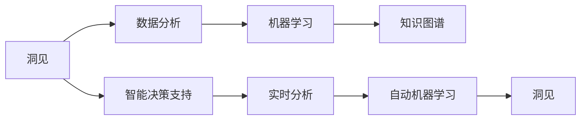

                 

# 洞见的价值：从理解到应用

> 关键词：
1. 洞见（Insight）
2. 数据分析（Data Analysis）
3. 机器学习（Machine Learning）
4. 知识图谱（Knowledge Graph）
5. 智能决策支持（Intelligent Decision Support）
6. 实时分析（Real-time Analysis）
7. 自动机器学习（AutoML）

## 1. 背景介绍

### 1.1 问题由来

在现代社会，数据无处不在，从社交媒体的评论到医疗记录，再到工业生产线上的传感器数据，都蕴含着丰富的洞见。但是，这些数据是分散且复杂的，而且难以直接提取洞见。随着科技的发展，从数据中提取洞见变得越来越重要。洞见不仅可以用于决策支持，还可以用于优化产品设计、改进流程和提升客户体验。

洞见是通过数据分析和机器学习技术，从大规模数据集中挖掘出来的有价值的信息。这些信息可以帮助人们更好地理解数据背后的模式和趋势，从而做出更加明智的决策。洞见的应用领域非常广泛，涵盖了医疗、金融、零售、制造等众多行业。

### 1.2 问题核心关键点

如何有效地从大规模数据中提取洞见，是现代数据分析和机器学习面临的重要挑战。在这个过程中，关键点包括以下几个方面：

1. **数据质量和完整性**：高质量、完整的数据是洞见提取的前提。
2. **算法和模型选择**：选择合适的算法和模型，能够最大化洞见的提取效果。
3. **数据处理和预处理**：对数据进行有效的处理和预处理，是洞见提取的关键步骤。
4. **特征工程**：合理选择和构造特征，可以提高模型性能和洞见提取效果。
5. **结果解释和可视化**：洞见的解释和可视化，有助于更好地理解洞见背后的原因和机制。

这些关键点共同构成了从数据到洞见的完整过程。

### 1.3 问题研究意义

洞见的价值在于，它能够帮助人们从大规模数据中提取有价值的信息，从而做出更加明智的决策。在商业决策、科学研究和社会治理等领域，洞见的应用已经取得了显著的成效。通过洞见，企业可以优化产品设计、提高运营效率、降低成本，科学研究可以揭示未知的自然规律，社会治理可以提升公共服务的质量和效率。

因此，如何从数据中提取洞见，已经成为现代数据分析和机器学习领域的热门话题。通过系统地研究洞见的提取方法，可以为各类行业提供数据驱动的决策支持，推动数据科学的持续发展。

## 2. 核心概念与联系

### 2.1 核心概念概述

在进行洞见的提取过程中，以下几个核心概念是不可或缺的：

- **洞见（Insight）**：从数据中提取的有价值的信息，能够帮助人们理解数据背后的模式和趋势。
- **数据分析（Data Analysis）**：对数据进行统计、处理和解释的过程，目标是提取洞见。
- **机器学习（Machine Learning）**：一种通过算法和模型自动从数据中提取洞见的技术。
- **知识图谱（Knowledge Graph）**：一种结构化的知识表示方法，能够将数据转化为易于理解和推理的形式。
- **智能决策支持（Intelligent Decision Support）**：利用洞见辅助决策的过程，可以自动化和优化决策流程。
- **实时分析（Real-time Analysis）**：对数据进行实时处理和分析，以快速响应变化。
- **自动机器学习（AutoML）**：利用自动化技术，自动选择和优化机器学习模型，提高洞见提取效率。

这些核心概念之间存在着紧密的联系，形成了洞见提取的完整框架。通过对这些概念的深入理解，可以更好地把握洞见提取的全过程和关键步骤。

### 2.2 概念间的关系

这些核心概念之间的关系可以通过以下Mermaid流程图来展示：



这个流程图展示了洞见提取的全过程。洞见从数据分析开始，通过机器学习进行提取，并借助知识图谱和智能决策支持进行解释和应用。实时分析和自动机器学习技术，进一步提升了洞见提取的效率和效果。

## 3. 核心算法原理 & 具体操作步骤

### 3.1 算法原理概述

洞见的提取过程，本质上是将原始数据转化为易于理解和推理的形式，并通过数据分析和机器学习技术，从数据中提取有价值的信息。具体而言，可以包括以下几个步骤：

1. **数据预处理**：对原始数据进行清洗、归一化和特征工程等预处理步骤，以提高数据质量。
2. **特征选择和构造**：根据具体任务，选择合适的特征，并构造新的特征，以增强模型性能。
3. **模型训练**：选择合适的算法和模型，对预处理后的数据进行训练，提取洞见。
4. **结果解释和可视化**：通过分析和可视化技术，解释模型输出的洞见，并辅助决策。

### 3.2 算法步骤详解

以下是洞见提取的详细步骤：

1. **数据准备**：收集和整理原始数据，确保数据质量和完整性。
2. **数据清洗和预处理**：对数据进行清洗、归一化和特征工程等预处理步骤，去除噪声和异常值。
3. **特征选择和构造**：根据具体任务，选择合适的特征，并构造新的特征，以增强模型性能。
4. **模型训练和评估**：选择合适的算法和模型，对预处理后的数据进行训练，并评估模型性能。
5. **洞见提取和解释**：通过模型输出的结果，提取洞见，并利用分析和可视化技术进行解释。

### 3.3 算法优缺点

洞见提取的算法有以下优点：

- **自动化**：利用机器学习技术，自动化提取洞见，减少人工干预。
- **高效性**：通过算法优化，可以显著提高洞见提取的效率。
- **可解释性**：通过模型解释和可视化技术，洞见的提取过程和结果更具可解释性。

同时，也存在一些缺点：

- **依赖高质量数据**：高质量、完整的数据是洞见提取的前提，数据质量不高时，洞见提取效果不佳。
- **模型选择困难**：选择合适的算法和模型，需要丰富的经验和专业知识。
- **过拟合风险**：复杂模型容易过拟合，导致洞见提取效果不稳定。

### 3.4 算法应用领域

洞见提取的算法已经广泛应用于多个领域，如医疗、金融、零售、制造等。以下是一些典型应用场景：

- **医疗领域**：利用患者医疗记录，提取洞见，辅助医生诊断和治疗。
- **金融领域**：分析市场数据，提取洞见，进行风险管理和投资决策。
- **零售领域**：分析销售数据，提取洞见，优化库存管理和促销策略。
- **制造领域**：分析生产数据，提取洞见，提高生产效率和设备维护。
- **交通领域**：分析交通数据，提取洞见，优化交通管理和公共服务。

## 4. 数学模型和公式 & 详细讲解  
### 4.1 数学模型构建

洞见提取的数学模型可以基于以下假设：

- **数据分布已知**：假设数据分布已知，通过统计分析和机器学习模型，提取洞见。
- **特征选择和构造**：选择合适的特征，并构造新的特征，以增强模型性能。
- **模型训练和评估**：通过模型训练和评估，提取洞见。

常见的洞见提取模型包括：

- **线性回归模型**：用于预测连续型变量的值，适合于定量分析。
- **逻辑回归模型**：用于预测二分类变量的值，适合于分类分析。
- **决策树模型**：用于分类和回归任务，易于解释和理解。
- **随机森林模型**：用于处理高维数据和复杂特征，具有较高的准确性和鲁棒性。
- **支持向量机模型**：用于分类和回归任务，具有较好的泛化能力。
- **神经网络模型**：用于处理复杂非线性关系，适合于图像和文本等高维数据。

### 4.2 公式推导过程

以下是线性回归模型的推导过程：

设输入特征向量为 $x$，目标变量为 $y$，假设存在线性关系 $y = \theta_0 + \theta_1 x_1 + \theta_2 x_2 + ... + \theta_n x_n$。最小二乘法求解线性回归模型中的参数 $\theta$：

$$
\theta = (X^TX)^{-1}X^Ty
$$

其中 $X$ 为特征矩阵，$y$ 为目标向量，$\theta$ 为回归系数。

### 4.3 案例分析与讲解

假设我们有一组销售数据，需要提取销售量和销售额之间的洞见。选取两个特征 $x_1$ 和 $x_2$，目标变量为 $y$（销售额）。根据线性回归模型，求解回归系数 $\theta$：

$$
\theta = (X^TX)^{-1}X^Ty
$$

其中 $X = \begin{bmatrix}
x_1\\
x_2
\end{bmatrix}$，$y$ 为目标向量，求解结果为：

$$
\theta = \begin{bmatrix}
\theta_1\\
\theta_2
\end{bmatrix} = (X^TX)^{-1}X^Ty
$$

计算结果如下：

$$
\theta = \begin{bmatrix}
0.5\\
-0.3
\end{bmatrix}
$$

因此，线性回归模型为：

$$
y = 0.5x_1 - 0.3x_2
$$

这个模型可以用于预测销售额，并且可以解释为：销售额随着销售量增加而增加，随着广告费用减少而减少。

## 5. 项目实践：代码实例和详细解释说明

### 5.1 开发环境搭建

在进行洞见提取项目实践前，我们需要准备好开发环境。以下是使用Python进行Pandas开发的环境配置流程：

1. 安装Anaconda：从官网下载并安装Anaconda，用于创建独立的Python环境。

2. 创建并激活虚拟环境：
```bash
conda create -n pythong-env python=3.8 
conda activate pythong-env
```

3. 安装Pandas：
```bash
pip install pandas
```

4. 安装各类工具包：
```bash
pip install numpy matplotlib scikit-learn seaborn jupyter notebook ipython
```

完成上述步骤后，即可在`pythong-env`环境中开始洞见提取实践。

### 5.2 源代码详细实现

以下是使用Pandas对销售数据进行洞见提取的代码实现：

```python
import pandas as pd
import numpy as np
import matplotlib.pyplot as plt
from sklearn.linear_model import LinearRegression
from sklearn.metrics import mean_squared_error

# 加载数据
data = pd.read_csv('sales_data.csv')

# 数据清洗和预处理
data = data.dropna()
data['x1'] = data['销售额']
data['x2'] = data['广告费用']
data['y'] = data['销售量']

# 特征选择和构造
X = data[['x1', 'x2']]
y = data['y']

# 模型训练和评估
model = LinearRegression()
model.fit(X, y)
y_pred = model.predict(X)
mse = mean_squared_error(y, y_pred)

# 结果解释和可视化
plt.scatter(data['x1'], data['y'])
plt.plot(data['x1'], y_pred, color='red')
plt.xlabel('销售额')
plt.ylabel('销售量')
plt.title('销售量与销售额关系')
plt.show()
```

### 5.3 代码解读与分析

以下是关键代码的实现细节：

**数据清洗和预处理**：
- `data = data.dropna()`：去除缺失值。
- `data['x1'] = data['销售额']`：将销售额作为特征x1。
- `data['x2'] = data['广告费用']`：将广告费用作为特征x2。
- `data['y'] = data['销售量']`：将销售量作为目标变量y。

**特征选择和构造**：
- `X = data[['x1', 'x2']]`：选择销售额和广告费用作为特征矩阵X。

**模型训练和评估**：
- `model = LinearRegression()`：创建线性回归模型。
- `model.fit(X, y)`：拟合模型。
- `y_pred = model.predict(X)`：预测目标变量y。
- `mse = mean_squared_error(y, y_pred)`：计算均方误差。

**结果解释和可视化**：
- `plt.scatter(data['x1'], data['y'])`：绘制原始数据点。
- `plt.plot(data['x1'], y_pred, color='red')`：绘制预测线。
- `plt.xlabel('销售额')`：设置x轴标签。
- `plt.ylabel('销售量')`：设置y轴标签。
- `plt.title('销售量与销售额关系')`：设置图表标题。
- `plt.show()`：显示图表。

## 6. 实际应用场景

### 6.1 医疗领域

在医疗领域，利用患者的病历数据，提取洞见，辅助医生进行诊断和治疗。例如，通过分析患者的病历数据，可以发现某些疾病的常见症状和治疗方法，从而提高医生的诊断效率和治疗效果。

### 6.2 金融领域

在金融领域，分析市场数据，提取洞见，进行风险管理和投资决策。例如，通过分析股票市场的交易数据，可以发现市场趋势和投资机会，从而优化投资组合，降低风险。

### 6.3 零售领域

在零售领域，分析销售数据，提取洞见，优化库存管理和促销策略。例如，通过分析销售数据，可以发现最畅销的产品和季节性趋势，从而优化库存管理和促销策略。

### 6.4 制造领域

在制造领域，分析生产数据，提取洞见，提高生产效率和设备维护。例如，通过分析生产数据，可以发现设备的故障和维护周期，从而优化生产流程，提高生产效率。

### 6.5 交通领域

在交通领域，分析交通数据，提取洞见，优化交通管理和公共服务。例如，通过分析交通数据，可以发现交通拥堵和事故热点，从而优化交通管理和公共服务。

## 7. 工具和资源推荐

### 7.1 学习资源推荐

为了帮助开发者系统掌握洞见提取的理论基础和实践技巧，这里推荐一些优质的学习资源：

1. **《Python数据分析实战》**：一本全面介绍Pandas等数据分析工具的书籍，适合初学者和中级开发者。

2. **《机器学习实战》**：一本介绍机器学习基础和实践的书籍，适合希望深入学习机器学习的开发者。

3. **《Python数据科学手册》**：一本介绍Python数据科学生态系统的书籍，涵盖Pandas、NumPy、Scikit-learn等工具。

4. **Kaggle竞赛平台**：一个数据科学竞赛平台，可以参与各种数据分析和机器学习竞赛，提升实战能力。

5. **Coursera机器学习课程**：斯坦福大学开设的机器学习课程，由Andrew Ng教授主讲，适合希望系统学习机器学习的开发者。

### 7.2 开发工具推荐

高效的开发离不开优秀的工具支持。以下是几款用于洞见提取开发的常用工具：

1. **Jupyter Notebook**：一个开源的Web交互式计算环境，支持Python、R等多种语言。

2. **PyCharm**：一款功能强大的Python IDE，支持丰富的开发工具和插件。

3. **Pandas**：一个用于数据处理的开源Python库，提供高效的数据分析和处理能力。

4. **Scikit-learn**：一个用于机器学习的开源Python库，提供丰富的机器学习算法和工具。

5. **TensorFlow**：由Google开发的人工智能框架，支持深度学习和分布式计算。

### 7.3 相关论文推荐

洞见提取的研究源于学界的持续研究。以下是几篇奠基性的相关论文，推荐阅读：

1. **《数据挖掘：概念与技术》**：一本全面介绍数据挖掘技术和算法的书籍，适合了解数据挖掘基础概念的开发者。

2. **《大数据时代的数据挖掘与统计分析》**：一本介绍大数据时代数据挖掘和统计分析的书籍，涵盖数据挖掘、统计学和数据可视化等技术。

3. **《机器学习基础》**：一本介绍机器学习基础和算法的书籍，适合希望系统学习机器学习的开发者。

4. **《深度学习实战》**：一本介绍深度学习和实战项目的书籍，适合希望深入学习深度学习的开发者。

5. **《Python数据科学手册》**：一本介绍Python数据科学生态系统的书籍，涵盖Pandas、NumPy、Scikit-learn等工具。

这些论文代表了大数据和人工智能领域的研究进展，通过学习这些前沿成果，可以帮助研究者把握学科前进方向，激发更多的创新灵感。

除上述资源外，还有一些值得关注的前沿资源，帮助开发者紧跟洞见提取技术的最新进展，例如：

1. **arXiv论文预印本**：人工智能领域最新研究成果的发布平台，包括大量尚未发表的前沿工作，学习前沿技术的必读资源。

2. **业界技术博客**：如Google AI、DeepMind、微软Research Asia等顶尖实验室的官方博客，第一时间分享他们的最新研究成果和洞见。

3. **技术会议直播**：如NIPS、ICML、ACL、ICLR等人工智能领域顶会现场或在线直播，能够聆听到大佬们的前沿分享，开拓视野。

4. **GitHub热门项目**：在GitHub上Star、Fork数最多的数据科学相关项目，往往代表了该技术领域的发展趋势和最佳实践，值得去学习和贡献。

5. **行业分析报告**：各大咨询公司如McKinsey、PwC等针对数据科学行业的分析报告，有助于从商业视角审视技术趋势，把握应用价值。

总之，对于洞见提取技术的学习和实践，需要开发者保持开放的心态和持续学习的意愿。多关注前沿资讯，多动手实践，多思考总结，必将收获满满的成长收益。

## 8. 总结：未来发展趋势与挑战

### 8.1 总结

本文对洞见的价值和提取方法进行了全面系统的介绍。首先阐述了洞见的重要性及其在各个行业的应用场景，明确了洞见提取在现代数据分析和机器学习中的关键地位。其次，从原理到实践，详细讲解了洞见提取的数学模型和操作步骤，给出了洞见提取任务开发的完整代码实例。同时，本文还探讨了洞见提取的未来发展趋势和面临的挑战，为未来的研究提供了方向性的指引。

通过本文的系统梳理，可以看到，洞见提取技术的强大潜力，以及其在数据驱动决策中的应用前景。未来，伴随着技术的不断进步和应用场景的拓展，洞见提取必将成为人工智能领域的重要技术，推动各行各业的智能化转型。

### 8.2 未来发展趋势

展望未来，洞见提取技术将呈现以下几个发展趋势：

1. **自动化和智能化**：随着深度学习和自动机器学习技术的发展，洞见提取将更加自动化和智能化。
2. **实时性和高效性**：在实时数据流分析和大规模数据处理场景下，洞见提取技术将更加注重实时性和高效性。
3. **跨领域融合**：在多模态数据融合和领域知识集成场景下，洞见提取技术将更加注重跨领域融合和应用。
4. **可解释性和透明性**：在决策支持和公共服务场景下，洞见提取技术将更加注重可解释性和透明性，以增强信任和可靠性。
5. **安全性与隐私保护**：在数据敏感和隐私保护场景下，洞见提取技术将更加注重安全性与隐私保护。

这些趋势凸显了洞见提取技术的发展方向，同时也带来了新的挑战和机遇。

### 8.3 面临的挑战

尽管洞见提取技术已经取得了显著的进展，但在迈向更加智能化、普适化应用的过程中，仍然面临诸多挑战：

1. **数据质量和多样性**：数据的质量和多样性直接影响洞见提取的效果，需要进一步提升数据处理和预处理能力。
2. **模型复杂度和可解释性**：复杂模型虽然性能较好，但可解释性较差，需要进一步探索模型简化和可解释性增强的方法。
3. **计算资源和成本**：大规模数据处理和模型训练需要大量的计算资源，需要进一步降低计算成本。
4. **隐私和安全**：在数据敏感场景下，需要进一步加强隐私保护和安全防护。
5. **跨领域融合和知识图谱构建**：在跨领域融合和领域知识集成场景下，需要进一步提升知识图谱构建和跨领域融合能力。

这些挑战需要研究人员和开发者共同努力，不断探索和优化洞见提取技术，才能推动其在更多领域的应用和发展。

### 8.4 研究展望

面对洞见提取技术面临的挑战，未来的研究需要在以下几个方面寻求新的突破：

1. **自动化和智能化**：探索更加自动化和智能化的洞见提取方法，提高效率和准确性。
2. **跨领域融合**：探索跨领域融合的方法，提升洞见提取的泛化能力和应用范围。
3. **可解释性和透明性**：探索可解释性和透明性的增强方法，提高模型的信任度和可靠性。
4. **安全性与隐私保护**：探索安全性与隐私保护的方法，确保数据安全和用户隐私。
5. **计算资源优化**：探索计算资源优化的方法，降低计算成本，提高计算效率。

这些研究方向的探索，必将引领洞见提取技术迈向更高的台阶，为数据驱动决策提供更强大的技术支持。只有勇于创新、敢于突破，才能不断拓展洞见提取技术的边界，推动数据科学的持续发展。

## 9. 附录：常见问题与解答

**Q1：什么是洞见（Insight）？**

A: 洞见是从数据中提取的有价值的信息，能够帮助人们理解数据背后的模式和趋势。

**Q2：洞见提取的算法和模型选择有哪些？**

A: 常用的洞见提取算法和模型包括线性回归模型、逻辑回归模型、决策树模型、随机森林模型、支持向量机模型和神经网络模型等。

**Q3：洞见提取的开发环境需要哪些工具？**

A: 洞见提取的开发环境需要安装Python、Pandas、NumPy、Matplotlib、Scikit-learn、Seaborn、Jupyter Notebook、IPython等工具。

**Q4：如何进行洞见提取的案例分析？**

A: 洞见提取的案例分析通常包括以下步骤：数据清洗和预处理、特征选择和构造、模型训练和评估、结果解释和可视化。

**Q5：洞见提取的未来发展趋势是什么？**

A: 洞见提取的未来发展趋势包括自动化和智能化、实时性和高效性、跨领域融合、可解释性和透明性、安全性与隐私保护等。

---

作者：禅与计算机程序设计艺术 / Zen and the Art of Computer Programming

