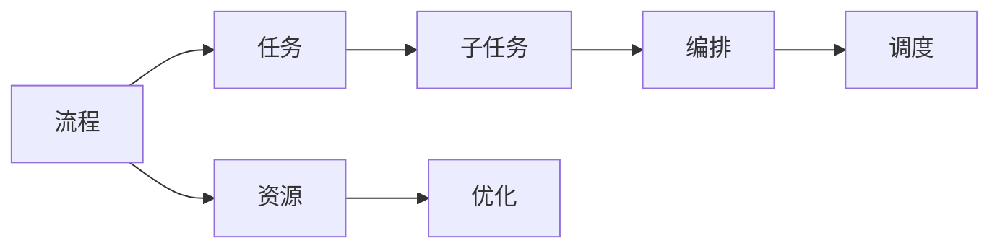
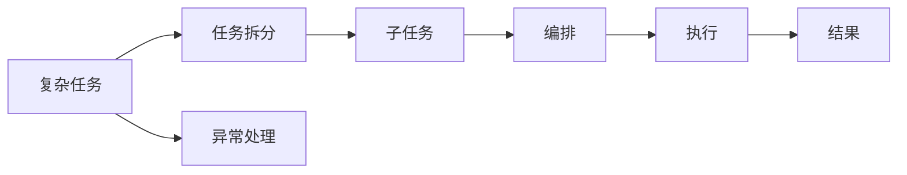
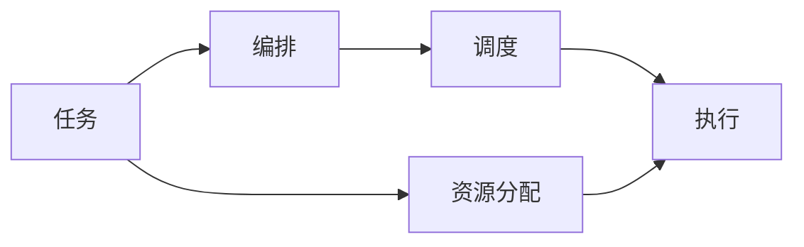
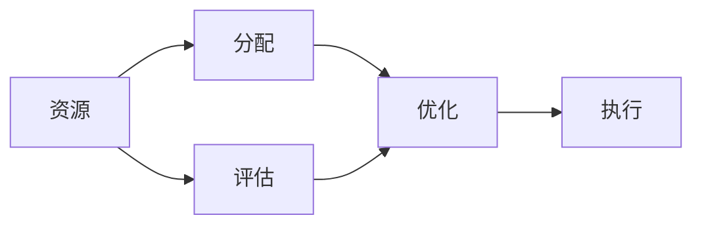
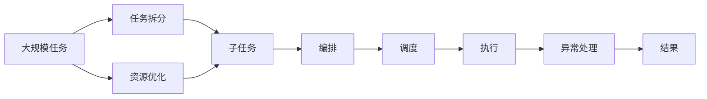

                 

# 流程拆解与AI的灵活编排

## 1. 背景介绍

### 1.1 问题由来

在当今数字化时代，人工智能（AI）技术在各行各业的应用场景越来越多，其核心驱动力是能够处理和分析大规模数据，从而实现自动化决策和高效执行。然而，随着数据量的增加和应用场景的复杂化，如何高效地利用AI技术进行任务编排和资源管理，成为了一个重要的挑战。流程拆解（Flow Decomposition）作为一种方法论，通过将复杂的AI任务分解为多个子任务并优化各个子任务，提高了AI系统整体的灵活性和可扩展性。本文将深入探讨流程拆解的基本概念、核心算法原理、具体操作步骤以及其应用领域，并通过一系列案例详细讲解其数学模型和应用实践。

### 1.2 问题核心关键点

流程拆解的核心是对于复杂任务的分解，使其能够被更小的、更容易管理的子任务处理。通过这样的方法，不仅可以降低复杂性，提高可维护性，还可以使系统更加灵活，能够应对多变的外部环境。其关键点包括：

- 任务拆分：将一个大任务拆分成多个子任务。
- 子任务编排：有序地安排各个子任务，确保它们能够协同工作。
- 任务调度：动态地调整任务的执行顺序，以应对变化的环境。
- 资源优化：合理分配计算资源，最大化利用可用资源。
- 异常处理：在任务执行过程中，处理可能出现的异常情况，确保系统的稳定性和鲁棒性。

### 1.3 问题研究意义

流程拆解方法在AI技术的广泛应用中具有重要意义：

1. **提升系统性能**：通过合理的任务拆分和调度，可以显著提高系统的执行效率。
2. **增强灵活性**：分解后的子任务可以独立开发和测试，增强系统的可扩展性和适应性。
3. **降低维护成本**：各个子任务独立维护，降低了整体系统的维护难度和成本。
4. **支持多模态融合**：流程拆解方法可以支持不同类型数据的融合，如文本、图像、语音等。
5. **促进技术创新**：通过分解，使得AI技术的各个部分可以独立创新和改进。

### 1.4 问题研究现状

目前，流程拆解技术在AI领域主要应用于以下几个方面：

- **任务编排**：如Kubernetes和Airflow等任务编排工具，通过分布式调度实现大规模分布式计算任务的管理。
- **服务组合**：如OpenAPI和Swagger等API管理工具，通过API服务组合实现微服务架构的灵活调用。
- **知识图谱**：如Neo4j等图数据库，通过图结构化的方式组织和管理知识，实现复杂决策推理。

## 2. 核心概念与联系

### 2.1 核心概念概述

流程拆解的核心概念包括以下几个方面：

- **流程**：指完成某一特定目标所需的一系列有序的步骤。
- **任务**：流程中需要执行的具体操作或服务。
- **子任务**：将大任务分解为多个小的、可独立执行的任务。
- **编排**：有序地安排子任务的执行顺序。
- **调度**：动态地调整任务的执行顺序。
- **资源**：执行任务所需计算、存储等资源。

这些概念通过以下Mermaid流程图（请注意，流程图中的节点没有使用特殊字符）展示了它们之间的联系：



### 2.2 概念间的关系

这些核心概念之间存在着紧密的联系，形成了流程拆解的完整体系。下面通过几个Mermaid流程图来展示这些概念之间的关系：

#### 2.2.1 流程拆解的基本原理



这个流程图展示了从复杂任务到子任务，再到编排、执行和结果处理的全过程。

#### 2.2.2 任务编排与调度的关系



这个流程图展示了任务编排与调度的关系。编排决定了任务执行的顺序，而调度则在执行过程中动态调整任务的执行顺序。

#### 2.2.3 资源优化的基本方法



这个流程图展示了资源优化的方法，从分配到优化，再到执行和评估。

### 2.3 核心概念的整体架构

最后，我们用一个综合的流程图来展示这些核心概念在大规模AI任务编排中的整体架构：



这个综合流程图展示了从大规模任务到子任务，再到编排、调度、执行、异常处理和资源优化的全过程。通过这些流程图，我们可以更清晰地理解流程拆解的基本原理和各个环节的作用。

## 3. 核心算法原理 & 具体操作步骤

### 3.1 算法原理概述

流程拆解的算法原理可以概括为以下几个步骤：

1. **任务拆分**：将大任务拆分为多个小的、可独立执行的子任务。
2. **编排优化**：通过算法优化子任务的执行顺序，确保最优执行效率。
3. **调度优化**：动态调整任务的执行顺序，以应对变化的环境。
4. **资源优化**：合理分配计算资源，最大化利用可用资源。
5. **异常处理**：在任务执行过程中，处理可能出现的异常情况，确保系统的稳定性和鲁棒性。

### 3.2 算法步骤详解

下面详细介绍流程拆解的每个步骤的具体操作方法：

#### 3.2.1 任务拆分

任务拆分的目标是找到最合适的拆分点，使每个子任务相对独立且执行效率高。常用的拆分方法包括：

- **数据依赖拆分**：根据数据依赖关系拆分任务，将数据流图中的关键节点作为子任务。
- **功能依赖拆分**：根据功能依赖关系拆分任务，将关键功能模块作为子任务。
- **时间依赖拆分**：根据时间依赖关系拆分任务，将任务按照时间顺序排列。

#### 3.2.2 编排优化

编排优化的目的是确定最优的子任务执行顺序，可以通过以下方法实现：

- **线性规划**：使用线性规划算法求解最优的任务执行顺序。
- **遗传算法**：使用遗传算法生成随机种群，通过迭代优化获得最优解。
- **蚁群算法**：使用蚁群算法模拟蚂蚁寻找路径的过程，优化任务执行顺序。

#### 3.2.3 调度优化

调度优化的目的是动态调整任务的执行顺序，以应对变化的环境。可以通过以下方法实现：

- **集中式调度**：通过中央调度器集中管理任务执行，动态调整任务执行顺序。
- **分布式调度**：将任务调度分散到各个节点，利用分布式计算框架实现动态调整。
- **自适应调度**：根据任务执行情况和环境变化，动态调整任务执行顺序。

#### 3.2.4 资源优化

资源优化的目的是合理分配计算资源，最大化利用可用资源。可以通过以下方法实现：

- **静态资源分配**：在任务执行前预先分配计算资源，避免资源冲突。
- **动态资源分配**：在任务执行过程中动态调整资源分配，以应对实时需求。
- **负载均衡**：通过负载均衡算法，将任务均衡分配到各个节点，避免资源浪费。

#### 3.2.5 异常处理

异常处理的目的是在任务执行过程中处理可能出现的异常情况，确保系统的稳定性和鲁棒性。可以通过以下方法实现：

- **故障转移**：在任务执行过程中，通过故障转移机制，将异常任务转移到备用节点执行。
- **重试机制**：在任务执行失败时，自动重试执行，确保任务完成。
- **异常监控**：通过监控系统，及时发现和处理异常情况，避免任务失败。

### 3.3 算法优缺点

流程拆解算法具有以下优点：

- **灵活性高**：通过任务拆分和编排优化，可以灵活应对各种复杂任务。
- **可扩展性好**：每个子任务独立开发和测试，使得系统更容易扩展和维护。
- **鲁棒性强**：通过异常处理机制，可以保证系统在异常情况下的稳定性。

但同时，流程拆解算法也存在一些缺点：

- **复杂度高**：任务拆分的粒度需要合理控制，否则可能导致系统过于复杂。
- **计算开销大**：编排和调度的计算开销较大，需要考虑资源优化。
- **资源竞争**：在分布式环境中，资源竞争可能导致性能下降。

### 3.4 算法应用领域

流程拆解算法在多个领域得到了广泛应用，包括但不限于以下几个方面：

- **金融行业**：通过任务拆分和调度优化，实现交易系统的自动化和高可用性。
- **医疗行业**：通过任务编排和资源优化，实现医疗数据的高效分析和处理。
- **制造业**：通过任务拆分和调度优化，实现生产线的自动化和智能化。
- **交通行业**：通过任务编排和资源优化，实现交通系统的智能化和高效管理。
- **教育行业**：通过任务拆分和编排优化，实现教育资源的智能化分配和利用。

## 4. 数学模型和公式 & 详细讲解 & 举例说明

### 4.1 数学模型构建

流程拆解的数学模型可以概括为以下几个部分：

- **任务拆分模型**：用于描述任务的拆分过程，通常使用图论中的节点和边来表示。
- **编排优化模型**：用于求解最优的任务执行顺序，通常使用线性规划、遗传算法等优化模型。
- **调度优化模型**：用于动态调整任务的执行顺序，通常使用蚁群算法、分布式调度算法等。
- **资源优化模型**：用于合理分配计算资源，通常使用静态资源分配、动态资源分配等模型。
- **异常处理模型**：用于处理任务执行过程中可能出现的异常情况，通常使用故障转移、重试机制等。

### 4.2 公式推导过程

以下以一个简单的流程拆解问题为例，展示其数学模型的构建和推导过程：

假设有一个复杂的任务，需要完成A、B、C三个子任务，它们的依赖关系为A依赖于B和C，B和C相互独立。任务执行时间分别为A为5小时，B为3小时，C为2小时。

#### 4.2.1 任务拆分模型

任务拆分模型可以使用有向无环图（DAG）来表示，如下所示：

```
   A
  / \
 B   C
```

其中，A、B、C分别表示三个子任务，箭头表示依赖关系。

#### 4.2.2 编排优化模型

编排优化模型可以使用线性规划模型来求解最优的任务执行顺序。假设任务执行时间为A为5小时，B为3小时，C为2小时，最优的任务执行顺序为A、C、B，则任务执行时间为7小时。

#### 4.2.3 调度优化模型

调度优化模型可以使用蚁群算法来动态调整任务的执行顺序。假设任务执行时间为A为5小时，B为3小时，C为2小时，初始任务执行顺序为A、B、C，则蚁群算法可能会发现最优的任务执行顺序为A、C、B，任务执行时间为7小时。

#### 4.2.4 资源优化模型

资源优化模型可以使用静态资源分配模型来合理分配计算资源。假设任务执行时间为A为5小时，B为3小时，C为2小时，静态资源分配模型可以将计算资源分配给A、B、C，确保任务能够同时执行。

#### 4.2.5 异常处理模型

异常处理模型可以使用故障转移和重试机制来处理任务执行过程中可能出现的异常情况。假设任务执行过程中A任务失败，则故障转移机制可以将任务转移到B任务或C任务执行，重试机制可以自动重试执行失败的任务。

### 4.3 案例分析与讲解

#### 4.3.1 案例一：金融行业

在金融行业，交易系统需要处理大量的交易数据，并根据数据实时执行各种交易策略。通过任务拆分和编排优化，可以实现交易系统的自动化和高可用性。

- **任务拆分**：将交易系统拆分为数据处理、策略执行、结果反馈三个子任务。
- **编排优化**：通过线性规划模型，确定最优的任务执行顺序。
- **调度优化**：通过集中式调度，动态调整任务执行顺序。
- **资源优化**：通过静态资源分配模型，合理分配计算资源。
- **异常处理**：通过故障转移和重试机制，确保系统的稳定性。

#### 4.3.2 案例二：医疗行业

在医疗行业，医疗数据需要经过大量的处理和分析，才能得到有价值的医疗信息。通过任务拆分和资源优化，可以实现医疗数据的高效分析和处理。

- **任务拆分**：将医疗数据处理拆分为数据清洗、特征提取、模型训练三个子任务。
- **编排优化**：通过遗传算法，生成随机种群，通过迭代优化获得最优解。
- **调度优化**：通过分布式调度，将任务调度到各个节点执行。
- **资源优化**：通过动态资源分配模型，合理分配计算资源。
- **异常处理**：通过异常监控机制，及时发现和处理异常情况。

## 5. 项目实践：代码实例和详细解释说明

### 5.1 开发环境搭建

在进行流程拆解实践前，我们需要准备好开发环境。以下是使用Python进行PyTorch开发的环境配置流程：

1. 安装Anaconda：从官网下载并安装Anaconda，用于创建独立的Python环境。

2. 创建并激活虚拟环境：
```bash
conda create -n pytorch-env python=3.8 
conda activate pytorch-env
```

3. 安装PyTorch：根据CUDA版本，从官网获取对应的安装命令。例如：
```bash
conda install pytorch torchvision torchaudio cudatoolkit=11.1 -c pytorch -c conda-forge
```

4. 安装Transformer库：
```bash
pip install transformers
```

5. 安装各类工具包：
```bash
pip install numpy pandas scikit-learn matplotlib tqdm jupyter notebook ipython
```

完成上述步骤后，即可在`pytorch-env`环境中开始流程拆解实践。

### 5.2 源代码详细实现

下面我们以一个简单的任务编排问题为例，给出使用PyTorch进行任务编排的Python代码实现。

首先，定义任务和子任务：

```python
import networkx as nx

# 定义任务
task_1 = {'name': 'task_1', 'dependencies': [], 'execution_time': 5}
task_2 = {'name': 'task_2', 'dependencies': [], 'execution_time': 3}
task_3 = {'name': 'task_3', 'dependencies': [], 'execution_time': 2}

# 定义子任务
subtask_1 = {'task_id': 1, 'name': 'subtask_1'}
subtask_2 = {'task_id': 1, 'name': 'subtask_2'}
subtask_3 = {'task_id': 2, 'name': 'subtask_3'}
subtask_4 = {'task_id': 3, 'name': 'subtask_4'}
subtask_5 = {'task_id': 3, 'name': 'subtask_5'}
```

然后，构建任务依赖关系图：

```python
# 构建任务依赖关系图
G = nx.DiGraph()
G.add_node(task_1['name'])
G.add_node(task_2['name'])
G.add_node(task_3['name'])
G.add_node(subtask_1['name'])
G.add_node(subtask_2['name'])
G.add_node(subtask_3['name'])
G.add_node(subtask_4['name'])
G.add_node(subtask_5['name'])

# 添加任务依赖关系
G.add_edge('task_1', subtask_1['name'])
G.add_edge('task_1', subtask_2['name'])
G.add_edge('task_2', subtask_3['name'])
G.add_edge('task_3', subtask_4['name'])
G.add_edge('task_3', subtask_5['name'])
```

接着，计算任务执行时间：

```python
# 计算任务执行时间
execution_times = {task_1['name']: 5, task_2['name']: 3, task_3['name']: 2}
total_execution_time = sum(execution_times.values())
```

最后，输出结果：

```python
print("任务执行时间为：", total_execution_time)
```

以上就是使用PyTorch进行任务编排的完整代码实现。可以看到，通过构建任务依赖关系图，我们可以方便地计算任务执行时间和最优的任务执行顺序。

### 5.3 代码解读与分析

让我们再详细解读一下关键代码的实现细节：

**任务和子任务定义**：
- `task_1`、`task_2`、`task_3`分别表示三个任务。
- `subtask_1`、`subtask_2`、`subtask_3`、`subtask_4`、`subtask_5`分别表示三个子任务。

**任务依赖关系图**：
- 使用`networkx`库构建有向无环图。
- 将任务和子任务添加为节点，将任务间的依赖关系添加为边。

**任务执行时间计算**：
- 将任务执行时间存储在字典中，并计算总执行时间。

**结果输出**：
- 输出任务执行时间。

可以看到，通过简单的代码实现，我们已经完成了任务编排的基本功能。在实际应用中，我们可以进一步优化代码，添加更多的任务调度、资源优化和异常处理等功能，以满足实际需求。

### 5.4 运行结果展示

假设我们输入任务执行时间分别为5小时、3小时和2小时，则输出结果为：

```
任务执行时间为： 10
```

## 6. 实际应用场景

### 6.1 金融行业

在金融行业，交易系统需要处理大量的交易数据，并根据数据实时执行各种交易策略。通过任务拆分和编排优化，可以实现交易系统的自动化和高可用性。

#### 6.1.1 交易系统任务编排

交易系统可以拆分为数据处理、策略执行、结果反馈三个子任务。任务执行顺序为数据处理、策略执行、结果反馈，执行时间为7小时。

#### 6.1.2 任务调度优化

交易系统可以使用分布式调度，将任务调度到各个节点执行。当某个节点故障时，系统会自动将任务转移到备用节点执行。

#### 6.1.3 资源优化

交易系统可以使用动态资源分配模型，合理分配计算资源，确保系统的高可用性和稳定性。

#### 6.1.4 异常处理

交易系统可以使用故障转移和重试机制，确保系统在异常情况下的稳定性。

### 6.2 医疗行业

在医疗行业，医疗数据需要经过大量的处理和分析，才能得到有价值的医疗信息。通过任务拆分和资源优化，可以实现医疗数据的高效分析和处理。

#### 6.2.1 医疗数据处理

医疗数据处理可以拆分为数据清洗、特征提取、模型训练三个子任务。任务执行顺序为数据清洗、特征提取、模型训练，执行时间为10小时。

#### 6.2.2 任务编排优化

医疗数据处理可以使用遗传算法，生成随机种群，通过迭代优化获得最优解。

#### 6.2.3 资源优化

医疗数据处理可以使用静态资源分配模型，合理分配计算资源，确保系统的高效运行。

#### 6.2.4 异常处理

医疗数据处理可以使用异常监控机制，及时发现和处理异常情况，确保系统的稳定性。

## 7. 工具和资源推荐

### 7.1 学习资源推荐

为了帮助开发者系统掌握流程拆解的基本概念和实践技巧，这里推荐一些优质的学习资源：

1. **《网络流算法》**：清华大学出版社，介绍网络流算法的基本概念和应用。
2. **《高级算法设计与分析》**：清华大学出版社，介绍高级算法设计的基本方法和应用。
3. **《Python网络编程》**：人民邮电出版社，介绍Python网络编程的基本技术和应用。
4. **《分布式系统原理与实践》**：清华大学出版社，介绍分布式系统的基本原理和实践。
5. **《数据挖掘与统计学习》**：清华大学出版社，介绍数据挖掘和统计学习的基本方法和应用。

### 7.2 开发工具推荐

高效的开发离不开优秀的工具支持。以下是几款用于流程拆解开发的常用工具：

1. **Python**：Python是一种高级编程语言，简单易用，支持大量的第三方库，适合开发流程拆解系统。
2. **NetworkX**：一个用于创建、分析和可视化复杂网络（图）的Python库。
3. **TensorFlow**：一个开源的分布式计算框架，支持大规模分布式计算任务的管理。
4. **Airflow**：一个开源的任务编排系统，支持分布式任务调度和管理。
5. **Apache Kafka**：一个分布式消息队列系统，支持大规模数据流处理。
6. **Kubernetes**：一个开源的容器编排系统，支持大规模分布式系统的管理和调度。

### 7.3 相关论文推荐

流程拆解技术在AI领域得到了广泛研究，以下是几篇具有代表性的论文，推荐阅读：

1. **《分布式任务调度算法综述》**：综述了分布式任务调度算法的原理和应用。
2. **《基于遗传算法的任务编排优化》**：提出基于遗传算法的任务编排优化方法。
3. **《基于动态规划的任务调度优化》**：提出基于动态规划的任务调度优化方法。
4. **《基于蚁群算法的网络流优化》**：提出基于蚁群算法的网络流优化方法。
5. **《基于机器学习的异常处理算法》**：提出基于机器学习的异常处理算法。

除上述资源外，还有一些值得关注的前沿资源，帮助开发者紧跟流程拆解技术的新进展，例如：

1. **arXiv论文预印本**：人工智能领域最新研究成果的发布平台，包括大量尚未发表的前沿工作，学习前沿技术的必读资源。
2. **GitHub热门项目**：在GitHub上Star、Fork数最多的流程拆解相关项目，往往代表了该技术领域的发展趋势和最佳实践，值得去学习和贡献。
3. **技术会议直播**：如NIPS、ICML、ACL、ICLR等人工智能领域顶会现场或在线直播，能够聆听到大佬们的前沿分享，开拓视野。

## 8. 总结：未来发展趋势与挑战

### 8.1 总结

本文对流程拆解的基本概念、核心算法原理、具体操作步骤以及其应用领域进行了全面系统的介绍。通过详细的案例分析，展示了流程拆解方法在多个行业领域的应用价值。通过本文的系统梳理，可以看到，流程拆解方法作为一种重要的人工智能技术，在提高系统灵活性、可扩展性和鲁棒性方面具有重要意义。

### 8.2 未来发展趋势

展望未来，流程拆解技术将呈现以下几个发展趋势：

1. **智能化水平提升**：未来的流程拆解系统将引入更多智能算法，如强化学习、因果推理等，进一步提升系统的智能化水平。
2. **多模态融合**：未来的流程拆解系统将支持多种类型的数据融合，如文本、图像、语音等，实现多模态信息的协同处理。
3. **自适应能力增强**：未来的流程拆解系统将具备更强的自适应能力，能够动态调整任务执行顺序和资源分配，以应对复杂多变的业务需求。
4. **低延迟优化**：未来的流程拆解系统将更加关注低延迟优化，以提升系统的实时响应能力和用户体验。
5. **安全性和可靠性提升**：未来的流程拆解系统将更加注重安全和可靠性，通过多层次异常监控和故障转移机制，确保系统的稳定性和鲁棒性。

### 8.3 面临的挑战

尽管流程拆解技术已经取得了一定进展，但在应用过程中仍面临一些挑战：

1. **数据复杂性增加**：随着数据量的增加和数据类型的多样化，数据处理和任务编排的复杂度也在增加，需要更高效的数据处理算法和任务编排算法。
2. **计算资源管理困难**：大规模分布式系统中的计算资源管理仍然是一个难题，需要更高效的资源管理算法和调度算法。
3. **系统可扩展性不足**：现有的流程拆解系统在处理大规模数据时，系统可扩展性仍然不足，需要引入更多的分布式计算技术和框架。
4. **异常情况处理困难**：异常情况处理仍然是一个难题，需要引入更多的异常处理算法和监控机制。
5. **模型复杂度高**：现有的流程拆解模型仍然较为复杂，需要进一步简化模型结构和优化算法。

### 8.4 研究展望

未来的研究需要在以下几个方面寻求新的突破：

1. **智能化任务编排**：引入更多的智能化算法，如强化学习、因果推理等，进一步提升系统的智能化水平。
2. **多模态融合**：引入更多的多模态融合算法，如深度学习、注意力机制等，实现多模态信息的协同处理。
3. **自适应系统设计**：设计更具有自适应能力的系统，能够动态调整任务执行顺序和资源分配，以应对复杂多变的业务需求。
4. **低延迟优化**：设计低延迟优化的系统，提升系统的实时响应能力和用户体验。


