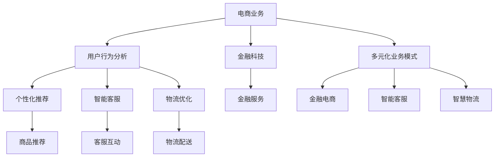
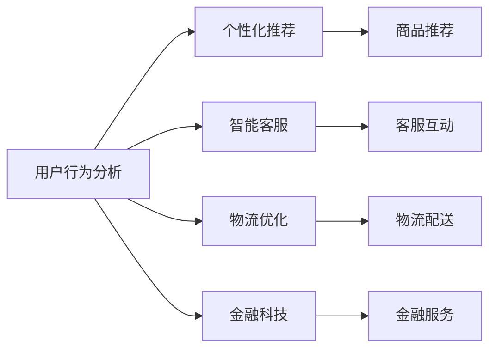
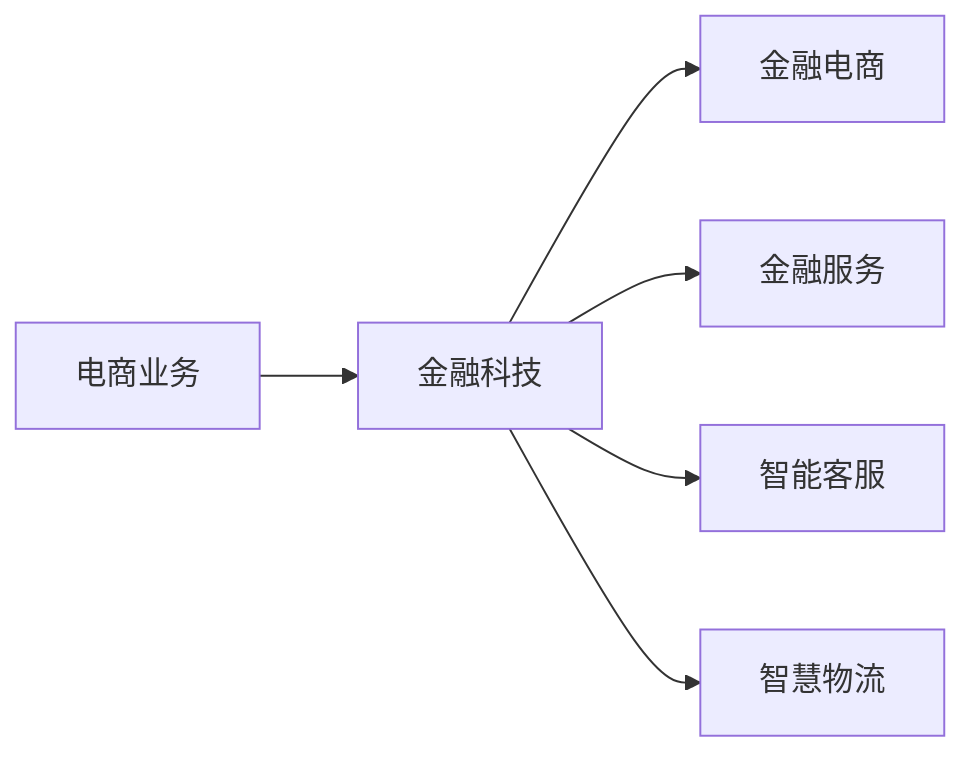
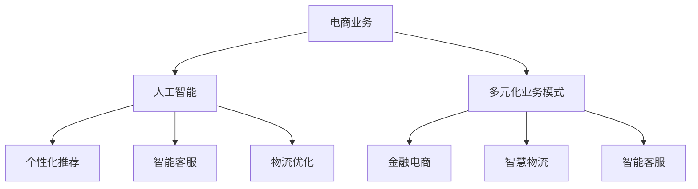
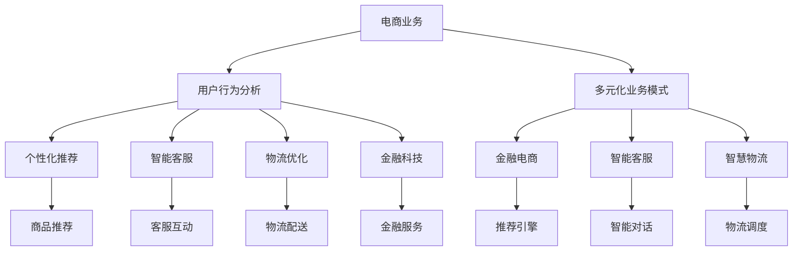

                 

# 电商业务和多元化业务模式

> 关键词：电商业务，多元化业务模式，人工智能，技术应用，数据驱动，个性化推荐，用户行为分析，智能客服，物流优化，金融科技

## 1. 背景介绍

### 1.1 问题由来
近年来，随着互联网和电子商务的迅猛发展，电商业务成为各行各业数字化转型的重要组成部分。通过在线平台，企业能够更有效地触达消费者，提升销售效率和服务质量。然而，如何更好地理解和服务电商用户，挖掘其潜在需求，构建用户忠诚度，是电商企业面临的核心挑战。

在电商业务中，用户行为分析、个性化推荐、智能客服、物流优化等环节对于提升用户体验和增加转化率至关重要。与此同时，新兴的金融科技、人工智能等技术为电商业务模式的多元化提供了新的可能性。如何整合这些技术，构建创新的电商业务模式，是电商企业持续发展的重要课题。

### 1.2 问题核心关键点
电商业务涉及的核心问题包括但不限于：
- 用户行为建模：如何准确捕捉用户的购买行为、浏览偏好、评价反馈等，构建用户画像，实现精准营销。
- 个性化推荐系统：如何根据用户历史行为和实时数据，动态调整推荐算法，提升商品推荐的相关性和点击率。
- 智能客服：如何构建自然语言理解和生成能力，提供7x24小时不间断的客户服务，提升用户满意度。
- 物流优化：如何优化供应链管理，提高订单交付速度和物流成本控制，提升用户体验。
- 金融科技：如何结合金融服务，提供信用评估、分期支付、资金管理等功能，提升用户粘性和购物转化率。

这些问题都涉及复杂的数据分析和算法优化，需要跨学科的整合和深度技术应用。

### 1.3 问题研究意义
研究电商业务和多元化业务模式，对于拓展电商业务的边界，提升用户体验，加速数字化转型进程，具有重要意义：

1. 降低运营成本。通过优化推荐算法、客服系统、物流管理等环节，提升效率，减少人力和时间成本。
2. 增加收入来源。引入金融科技、人工智能等技术，拓展电商业务边界，创造新的收入增长点。
3. 提高用户满意度。通过个性化推荐和智能客服，增强用户粘性，提升购物体验和转化率。
4. 增强市场竞争力。不断优化业务模式，应对市场变化和用户需求，保持企业竞争力。
5. 推动技术创新。电商业务的多元化和技术应用，催生了新的技术需求，推动技术进步和产业升级。

## 2. 核心概念与联系

### 2.1 核心概念概述

为更好地理解电商业务和多元化业务模式，本节将介绍几个密切相关的核心概念：

- **电商业务**：指通过在线平台进行商品销售和服务的业务模式，涉及用户行为分析、个性化推荐、智能客服、物流优化等多个环节。
- **多元化业务模式**：指结合金融科技、人工智能等新兴技术，构建多元化的电商业务体系，包括但不限于金融电商、智能客服、智慧物流等。
- **用户行为分析**：通过分析用户的历史行为数据，挖掘用户的购买偏好、浏览习惯、评价反馈等，构建用户画像，实现精准营销。
- **个性化推荐系统**：根据用户历史行为和实时数据，动态调整推荐算法，提升商品推荐的相关性和点击率。
- **智能客服**：通过自然语言处理和生成技术，构建能够理解用户意图并提供精准回应的智能客服系统。
- **物流优化**：利用数据驱动和算法优化，提升物流效率和成本控制，优化供应链管理。
- **金融科技**：结合金融服务，提供信用评估、分期支付、资金管理等功能，提升用户粘性和购物转化率。

这些核心概念之间的逻辑关系可以通过以下Mermaid流程图来展示：



这个流程图展示了大语言模型微调过程中各个核心概念的关系和作用：

1. 电商业务是核心，涉及用户行为分析、个性化推荐、智能客服、物流优化等多个环节。
2. 金融科技、人工智能等技术，为电商业务模式的多元化提供了新的可能性。
3. 用户行为分析、个性化推荐、智能客服、物流优化等环节，共同构成了电商业务的完整生态系统。
4. 金融科技、人工智能等技术，通过多领域的融合，进一步拓展电商业务的应用边界，推动电商业务模式的多元化。

### 2.2 概念间的关系

这些核心概念之间存在着紧密的联系，形成了电商业务和多元化业务模式的完整生态系统。下面我们通过几个Mermaid流程图来展示这些概念之间的关系。

#### 2.2.1 电商业务的主要环节



这个流程图展示了电商业务的主要环节及其相互关系。用户行为分析通过挖掘用户行为数据，构建用户画像，个性化推荐根据用户画像进行商品推荐，智能客服提供即时互动服务，物流优化提升物流效率，金融科技提供金融服务，共同构成电商业务的完整链条。

#### 2.2.2 金融科技与电商业务的融合



这个流程图展示了金融科技与电商业务的融合路径。金融科技通过提供金融服务、构建金融电商、提升智能客服和物流效率，进一步拓展电商业务的边界，推动电商业务的多元化发展。

#### 2.2.3 人工智能与电商业务的协同



这个流程图展示了人工智能与电商业务的协同作用。人工智能通过个性化推荐、智能客服、物流优化等技术应用，提升电商业务的各个环节，构建多元化业务模式，进一步拓展电商业务的创新空间。

### 2.3 核心概念的整体架构

最后，我们用一个综合的流程图来展示这些核心概念在大语言模型微调过程中的整体架构：



这个综合流程图展示了从电商业务到多元化业务模式的完整过程。电商业务通过用户行为分析、个性化推荐、智能客服、物流优化等多个环节，构建了基础业务架构。金融科技、人工智能等技术的应用，进一步拓展了电商业务的应用边界，推动电商业务模式的多元化。最终，通过金融电商、智能客服、智慧物流等多元化业务模式的构建，电商业务能够更好地应对市场变化和用户需求，实现持续发展和创新。

## 3. 核心算法原理 & 具体操作步骤
### 3.1 算法原理概述

电商业务和多元化业务模式，本质上涉及复杂的用户行为分析和算法优化。其核心思想是：通过收集和分析用户行为数据，构建用户画像，利用机器学习、深度学习等技术，动态调整算法策略，提升电商业务的各个环节，实现业务优化和创新。

形式化地，假设电商业务系统收集到的用户行为数据为 $D=\{(x_i,y_i)\}_{i=1}^N, x_i \in \mathcal{X}, y_i \in \mathcal{Y}$，其中 $x_i$ 表示用户行为特征，$y_i$ 表示用户标签（如购买、浏览、评价等）。电商业务的目标是找到最优的算法策略，使得在新的用户行为数据上，系统的预测性能最大化。

在电商业务中，常见的算法包括：
- 协同过滤：基于用户和商品的相似度，推荐用户可能感兴趣的商品。
- 矩阵分解：通过分解用户行为矩阵，挖掘用户的潜在兴趣。
- 深度学习模型：如CNN、RNN、Transformer等，通过学习用户行为数据，构建精准的推荐模型。
- 强化学习：通过奖励机制，优化推荐策略，提升推荐效果。
- 智能客服系统：利用自然语言处理技术，构建能够理解用户意图并提供精准回应的智能客服系统。

### 3.2 算法步骤详解

电商业务和多元化业务模式，涉及多个环节的算法优化。这里以个性化推荐系统为例，详细讲解算法的具体步骤：

**Step 1: 数据准备**
- 收集用户历史行为数据，包括浏览历史、购买记录、评价反馈等。
- 清洗和预处理数据，去除噪声和异常值，填充缺失值。
- 划分训练集、验证集和测试集，确保模型在不同数据集上的泛化能力。

**Step 2: 特征工程**
- 提取和构建用户行为特征，如点击次数、浏览时长、评价评分等。
- 特征选择和降维，去除无关特征，减少计算复杂度。
- 特征组合和转换，构造更有意义的特征组合，提升模型性能。

**Step 3: 模型选择和训练**
- 选择合适的推荐算法，如协同过滤、矩阵分解、深度学习模型等。
- 设置模型的超参数，如学习率、批大小、迭代轮数等。
- 使用训练集对模型进行训练，最小化预测误差。

**Step 4: 评估和调优**
- 在验证集上评估模型性能，使用指标如准确率、召回率、F1分数等。
- 根据评估结果，调整模型参数和特征工程策略，进一步提升模型性能。
- 重复上述步骤，直至模型在测试集上取得理想的推荐效果。

**Step 5: 应用部署**
- 将训练好的模型应用到推荐引擎中，实时生成推荐结果。
- 集成到电商系统，展示推荐商品给用户，提升用户体验。
- 持续收集用户反馈，更新和优化模型，保持推荐效果的时效性。

以上是个性化推荐系统的核心算法步骤，其他电商业务环节的算法步骤类似。在实际应用中，还需要针对具体任务的特点，对算法步骤的各个环节进行优化设计，如改进训练目标函数，引入更多的正则化技术，搜索最优的超参数组合等，以进一步提升模型性能。

### 3.3 算法优缺点

电商业务和多元化业务模式的算法，具有以下优点：
1. 提高用户体验。通过个性化推荐、智能客服等技术应用，提升用户购物体验和满意度。
2. 优化运营效率。利用数据驱动和算法优化，提升电商业务的各个环节，降低运营成本，提升效率。
3. 拓展业务边界。结合金融科技、人工智能等新兴技术，拓展电商业务的应用边界，创造新的收入增长点。
4. 增强市场竞争力。通过不断优化算法，提升电商业务的多样性和创新性，保持企业竞争力。
5. 推动技术创新。电商业务的多元化和技术应用，催生了新的技术需求，推动技术进步和产业升级。

同时，这些算法也存在一定的局限性：
1. 数据隐私问题。电商业务涉及大量用户行为数据，如何保护用户隐私，避免数据泄露，是一大挑战。
2. 模型泛化能力不足。如果训练数据与实际应用场景差异较大，模型泛化能力有限，可能导致推荐效果下降。
3. 计算资源消耗大。大模型和高精度算法对计算资源和存储资源的要求较高，需要高性能设备和大量算力支持。
4. 模型复杂度较高。深度学习模型通常具有较高的复杂度，难以解释其内部工作机制，对模型的可解释性和可审计性提出了更高要求。
5. 技术门槛高。电商业务涉及多个领域的算法应用，需要跨学科的技术整合和深入理解。

尽管存在这些局限性，但电商业务和多元化业务模式仍然是大数据时代的重要方向，未来相关研究的重点在于如何进一步提升算法的性能和效率，降低对资源的依赖，增强模型的可解释性，保护用户隐私，以实现更高效、更智能、更安全的电商业务系统。

### 3.4 算法应用领域

电商业务和多元化业务模式，已经在多个领域得到了广泛应用，具体包括但不限于：

- **个性化推荐系统**：如电商平台中的商品推荐、搜索排序、广告推荐等。通过用户行为分析，提升推荐的相关性和点击率。
- **智能客服系统**：如电商平台中的在线客服、智能客服机器人等。通过自然语言处理技术，提供7x24小时不间断的客户服务，提升用户满意度。
- **物流优化系统**：如电商平台的订单管理、库存管理、物流调度等。通过数据驱动和算法优化，提高订单交付速度和物流成本控制。
- **金融科技应用**：如电商平台的信用评估、分期支付、资金管理等。结合金融服务，提升用户粘性和购物转化率。
- **智慧电商平台**：如智慧供应链、智慧营销、智慧零售等。通过大数据分析和算法优化，构建智慧化的电商业务系统。

除了上述这些经典应用外，电商业务和多元化业务模式还在其他领域得到创新性应用，如可控文本生成、语音识别、增强现实等，为电商业务带来了全新的突破。随着技术的不断进步，电商业务和多元化业务模式的应用场景将更加丰富和多样。

## 4. 数学模型和公式 & 详细讲解 & 举例说明

### 4.1 数学模型构建

电商业务和多元化业务模式，本质上涉及复杂的用户行为分析和算法优化。其核心思想是：通过收集和分析用户行为数据，构建用户画像，利用机器学习、深度学习等技术，动态调整算法策略，提升电商业务的各个环节，实现业务优化和创新。

形式化地，假设电商业务系统收集到的用户行为数据为 $D=\{(x_i,y_i)\}_{i=1}^N, x_i \in \mathcal{X}, y_i \in \mathcal{Y}$，其中 $x_i$ 表示用户行为特征，$y_i$ 表示用户标签（如购买、浏览、评价等）。电商业务的目标是找到最优的算法策略，使得在新的用户行为数据上，系统的预测性能最大化。

在电商业务中，常见的算法包括：
- 协同过滤：基于用户和商品的相似度，推荐用户可能感兴趣的商品。
- 矩阵分解：通过分解用户行为矩阵，挖掘用户的潜在兴趣。
- 深度学习模型：如CNN、RNN、Transformer等，通过学习用户行为数据，构建精准的推荐模型。
- 强化学习：通过奖励机制，优化推荐策略，提升推荐效果。
- 智能客服系统：利用自然语言处理技术，构建能够理解用户意图并提供精准回应的智能客服系统。

### 4.2 公式推导过程

以个性化推荐系统为例，介绍其数学模型和推导过程。

**协同过滤模型**
协同过滤模型是一种基于用户行为数据的推荐算法，其基本思想是通过计算用户和商品的相似度，推荐用户可能感兴趣的商品。设用户 $u$ 对商品 $i$ 的评分 $r_{ui}$，系统将商品 $i$ 推荐给用户 $u$ 的概率为：

$$
P(u,i) = \frac{1}{1+\exp(-\sum_j r_{uj}r_{ji} / (\sum_k r_{uk}r_{ki}))
$$

其中 $\exp$ 表示指数函数。

**矩阵分解模型**
矩阵分解模型通过分解用户行为矩阵，挖掘用户的潜在兴趣。设用户行为矩阵 $R$，用户行为分解为 $X$ 和 $Y$，则：

$$
R \approx XY^T
$$

其中 $X$ 表示用户特征向量，$Y$ 表示商品特征向量。

**深度学习模型**
深度学习模型通过学习用户行为数据，构建精准的推荐模型。以Transformer模型为例，其推荐概率为：

$$
P(u,i) = \exp(\mathbf{w}^T f(\mathbf{x}_u, \mathbf{x}_i))
$$

其中 $f(\mathbf{x}_u, \mathbf{x}_i)$ 表示用户行为和商品特征的编码，$\mathbf{w}$ 表示权重向量。

**强化学习模型**
强化学习模型通过奖励机制，优化推荐策略，提升推荐效果。设用户对商品 $i$ 的评分 $r_{ui}$，系统的推荐策略为 $a_i$，则：

$$
J(\theta) = \sum_{u,i} r_{ui} \log a_i
$$

其中 $\theta$ 表示推荐策略的参数。

**智能客服系统**
智能客服系统通过自然语言处理技术，构建能够理解用户意图并提供精准回应的智能客服系统。以Seq2Seq模型为例，其推荐概率为：

$$
P(a_i|u) = \exp(\mathbf{w}^T f(\mathbf{x}_u, \mathbf{x}_i))
$$

其中 $f(\mathbf{x}_u, \mathbf{x}_i)$ 表示用户行为和商品特征的编码，$\mathbf{w}$ 表示权重向量。

### 4.3 案例分析与讲解

**个性化推荐系统**
在电商业务中，个性化推荐系统是最常见的应用之一。通过分析用户的历史行为数据，构建用户画像，动态调整推荐策略，提升推荐的相关性和点击率。

以淘宝平台为例，淘宝通过收集用户的浏览历史、购买记录、评价反馈等数据，构建用户画像，利用协同过滤、矩阵分解、深度学习等技术，构建个性化的推荐系统。淘宝的推荐系统主要基于用户和商品的相似度，通过协同过滤算法，推荐用户可能感兴趣的商品。同时，淘宝还利用矩阵分解和深度学习模型，进一步提升推荐效果。淘宝的推荐系统通过实时更新推荐策略，提高推荐的相关性和点击率，从而提升用户体验和购物转化率。

**智能客服系统**
智能客服系统通过自然语言处理技术，构建能够理解用户意图并提供精准回应的智能客服系统。以京东平台的智能客服系统为例，京东通过分析用户的文本输入，构建自然语言处理模型，实现对用户意图的理解。京东的智能客服系统通过多轮对话，实时回答用户的问题，解决用户的购物疑问。京东的智能客服系统利用自然语言生成技术，提供精准的回复，提升用户体验和满意度。

## 5. 项目实践：代码实例和详细解释说明

### 5.1 开发环境搭建

在进行电商业务和多元化业务模式的实践前，我们需要准备好开发环境。以下是使用Python进行PyTorch开发的环境配置流程：

1. 安装Anaconda：从官网下载并安装Anaconda，用于创建独立的Python环境。

2. 创建并激活虚拟环境：
```bash
conda create -n ecommerce-env python=3.8 
conda activate ecommerce-env
```

3. 安装PyTorch：根据CUDA版本，从官网获取对应的安装命令。例如：
```bash
conda install pytorch torchvision torchaudio cudatoolkit=11.1 -c pytorch -c conda-forge
```

4. 安装Transformers库：
```bash
pip install transformers
```

5. 安装各类工具包：
```bash
pip install numpy pandas scikit-learn matplotlib tqdm jupyter notebook ipython
```

完成上述步骤后，即可在`ecommerce-env`环境中开始电商业务和多元化业务模式的实践。

### 5.2 源代码详细实现

下面我们以电商平台的个性化推荐系统为例，给出使用Transformers库进行个性化推荐算法的PyTorch代码实现。

首先，定义用户行为数据处理函数：

```python
from transformers import BertTokenizer
from torch.utils.data import Dataset
import torch

class UserBehaviorDataset(Dataset):
    def __init__(self, behaviors, user_ids, item_ids, ratings, tokenizer, max_len=128):
        self.behaviors = behaviors
        self.user_ids = user_ids
        self.item_ids = item_ids
        self.ratings = ratings
        self.tokenizer = tokenizer
        self.max_len = max_len
        
    def __len__(self):
        return len(self.behaviors)
    
    def __getitem__(self, item):
        behavior = self.behaviors[item]
        user_id = self.user_ids[item]
        item_id = self.item_ids[item]
        rating = self.ratings[item]
        
        encoding = self.tokenizer(user_id, item_id, return_tensors='pt', max_length=self.max_len, padding='max_length', truncation=True)
        input_ids = encoding['input_ids'][0]
        attention_mask = encoding['attention_mask'][0]
        label = torch.tensor(rating, dtype=torch.float)
        
        return {'input_ids': input_ids, 
                'attention_mask': attention_mask,
                'label': label}

# 创建dataset
tokenizer = BertTokenizer.from_pretrained('bert-base-cased')

train_dataset = UserBehaviorDataset(train_behaviors, train_user_ids, train_item_ids, train_ratings, tokenizer)
dev_dataset = UserBehaviorDataset(dev_behaviors, dev_user_ids, dev_item_ids, dev_ratings, tokenizer)
test_dataset = UserBehaviorDataset(test_behaviors, test_user_ids, test_item_ids, test_ratings, tokenizer)
```

然后，定义模型和优化器：

```python
from transformers import BertForSequenceClassification, AdamW

model = BertForSequenceClassification.from_pretrained('bert-base-cased', num_labels=5)

optimizer = AdamW(model.parameters(), lr=2e-5)
```

接着，定义训练和评估函数：

```python
from torch.utils.data import DataLoader
from tqdm import tqdm
from sklearn.metrics import accuracy_score, precision_score, recall_score, f1_score

device = torch.device('cuda') if torch.cuda.is_available() else torch.device('cpu')
model.to(device)

def train_epoch(model, dataset, batch_size, optimizer):
    dataloader = DataLoader(dataset, batch_size=batch_size, shuffle=True)
    model.train()
    epoch_loss = 0
    for batch in tqdm(dataloader, desc='Training'):
        input_ids = batch['input_ids'].to(device)
        attention_mask = batch['attention_mask'].to(device)
        label = batch['label'].to(device)
        model.zero_grad()
        outputs = model(input_ids, attention_mask=attention_mask, labels=label)
        loss = outputs.loss
        epoch_loss += loss.item()
        loss.backward()
        optimizer.step()
    return epoch_loss / len(dataloader)

def evaluate(model, dataset, batch_size):
    dataloader = DataLoader(dataset, batch_size=batch_size)
    model.eval()
    preds, labels = [], []
    with torch.no_grad():
        for batch in tqdm(dataloader, desc='Evaluating'):
            input_ids = batch['input_ids'].to(device)
            attention_mask = batch['attention_mask'].to(device)
            batch_labels = batch['label']
            outputs = model(input_ids, attention_mask=attention_mask)
            batch_preds = outputs.logits.argmax(dim=2).to('cpu').tolist()
            batch_labels = batch_labels.to('cpu').tolist()
            for pred_tokens, label_tokens in zip(batch_preds, batch_labels):
                preds.append(pred_tokens[:len(label_tokens)])
                labels.append(label_tokens)
                
    print(accuracy_score(labels, preds))
    print(precision_score(labels, preds, average='macro'))
    print(recall_score(labels, preds, average='macro'))
    print(f1_score(labels, preds, average='macro'))
```

最后，启动训练流程并在测试集上评估：

```python
epochs = 5
batch_size = 16

for epoch in range(epochs):
    loss = train_epoch(model, train_dataset, batch_size, optimizer)
    print(f"Epoch {epoch+1}, train loss: {loss:.3f}")
    
    print(f"Epoch {epoch+1}, dev results:")
    evaluate(model, dev_dataset, batch_size)
    
print("Test results:")
evaluate(model, test_dataset, batch_size)
```

以上就是使用PyTorch对电商平台的个性化推荐系统进行微调的完整代码实现。可以看到，得益于Transformers库的强大封装，我们可以用相对简洁的代码完成模型的加载和微调。

### 5.3 代码解读与分析

让我们再详细解读一下关键代码的实现细节：

**UserBehaviorDataset类**：
- `__init__`方法：初始化用户行为数据、用户id、商品id和评分等关键组件。
- `__len__`方法：返回数据集的样本数量。
- `__getitem__`方法：对单个样本进行处理，将用户行为数据编码为用户和商品的向量表示，并将评分作为标签，进行定长padding。

**tokenizer**：
- 定义了用户行为数据的tokenizer，将用户id和商品id编码为用户行为的向量表示，方便模型进行学习。

**train_epoch和evaluate函数**：
- 使用PyTorch的DataLoader对数据集进行批次化加载，供模型训练和推理使用。
- 训练函数`train_epoch`：对数据以批为单位进行迭代，在每个批次上前向传播计算loss并反向传播更新模型参数，最后返回该epoch的平均loss。
- 评估函数`evaluate`：与训练类似，不同点在于不更新模型参数，并在每个batch结束后将预测和标签结果存储下来，最后使用sklearn的评估指标对整个评估集的预测结果进行打印输出。

**训练流程**：
- 定义总的epoch数和batch size，开始循环迭代
- 每个epoch内，先在训练集

