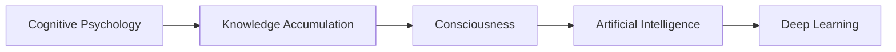
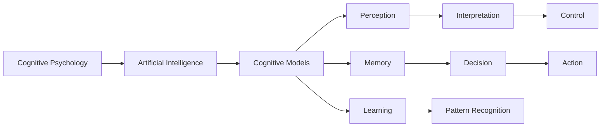

                 

# 知识积累在意识中的角色

> 关键词：知识积累,意识,认知心理学,人工智能,深度学习

## 1. 背景介绍

### 1.1 问题由来
在当前科技快速发展的时代，人工智能（AI）和深度学习（Deep Learning）技术正以前所未有的速度改变着我们的生活方式和社会结构。然而，人工智能的背后，是人类通过长期的知识积累和认知能力的自然进化。本文将深入探讨知识积累在意识中的角色，揭示其在人类认知和人工智能发展中的关键地位。

### 1.2 问题核心关键点
知识积累是人类认知和智能的核心要素，其在意识中的角色包括以下几个关键点：
1. **信息处理能力**：人类通过积累知识，具备了强大的信息处理能力，能够理解和推理复杂的现象。
2. **决策制定**：知识积累帮助人类在面对不同情境时，做出更准确、高效的决策。
3. **创造力**：知识的多样性和深度为人类提供了丰富的创意基础，推动了创新和创造。
4. **情感理解**：知识积累帮助人类更好地理解他人的情感和动机，增强了人际交流的深度和广度。
5. **文化传承**：知识积累是文化传承的基础，通过教育和社会交流，知识和技能得以传递和发扬。

这些关键点表明，知识积累在人类意识中扮演着基础性和综合性的角色，是认知和智能发展的重要推动力。

### 1.3 问题研究意义
研究知识积累在意识中的角色，对于理解和构建更加智能、高效的AI系统具有重要意义：
1. **促进AI理解人类行为**：通过深入理解知识积累的作用机制，AI可以更好地模拟人类的认知和决策过程。
2. **提高AI的适应性和创造力**：借鉴人类知识积累的方式，AI可以更灵活地适应新环境和任务，并产生新的知识。
3. **增强AI的可解释性**：理解和解释知识积累的路径，有助于提升AI系统的透明度和可解释性。
4. **推动AI伦理发展**：通过研究知识积累对意识的影响，可以为AI伦理设计提供理论基础。

## 2. 核心概念与联系

### 2.1 核心概念概述

为更好地理解知识积累在意识中的角色，本节将介绍几个密切相关的核心概念：

- **认知心理学**：研究人类认知过程及其影响因素的心理学分支，关注知觉、记忆、思维、情感等心理过程。
- **知识积累**：指个体通过经验和学习获得的信息、技能和概念的积累，是认知发展的基石。
- **意识**：心理学术语，指个体对自身和环境的感知、思考和自我认知，是认知活动的核心。
- **人工智能**：计算机系统通过算法和数据模拟人类智能的过程，包括学习、推理、感知等。
- **深度学习**：一种基于神经网络的机器学习技术，通过多层次的非线性处理实现对复杂数据的理解和建模。

这些核心概念之间的逻辑关系可以通过以下Mermaid流程图来展示：



这个流程图展示了核心概念之间的联系：

1. 认知心理学研究知识积累的过程，为人工智能提供理论基础。
2. 知识积累是人类意识的基础，也是人工智能的重要组成部分。
3. 人工智能利用深度学习技术，模拟人类认知和知识积累的机制。

### 2.2 概念间的关系

这些核心概念之间存在着紧密的联系，形成了知识积累在意识中的完整生态系统。下面我们通过几个Mermaid流程图来展示这些概念之间的关系。

#### 2.2.1 认知心理学与人工智能



这个流程图展示了认知心理学与人工智能之间的联系。认知心理学为人工智能提供了理论框架，指导机器模拟人类的认知模型，包括感知、记忆、学习等过程。

#### 2.2.2 知识积累与深度学习

```mermaid
graph TB
    A[Knowledge Accumulation] --> B[Deep Learning]
    B --> C[Neural Networks]
    C --> D[Feature Extraction]
    C --> E[Representation Learning]
    C --> F[Transfer Learning]
    D --> G[Classification]
    E --> H[Regression]
    F --> I[Fine-Tuning]
    G --> J[Supervised Learning]
    H --> K[Unsupervised Learning]
    I --> L[Adaptation]
    J --> M[Reinforcement Learning]
    K --> N[Anomaly Detection]
    L --> O[Domain Adaptation]
    M --> P[Reinforcement]
    N --> Q[Generative Models]
    O --> R[Causal Inference]
    P --> S[Reinforcement]
    Q --> T[Automatic Speech Recognition]
    R --> U[Cross-Modal Learning]
    S --> V[AutoML]
    T --> W[Text-to-Speech Synthesis]
    U --> X[Computer Vision]
    V --> Y[Hyperparameter Optimization]
    W --> Z[Text Summarization]
    X --> AA[Image Segmentation]
    Y --> AB[Cognative Insights]
    Z --> AC[Model Interpretation]
    AA --> AD[Object Detection]
    AB --> AE[Interpretation Framework]
    AC --> AF[Model-Agnostic Methods]
    AD --> AG[Semantic Segmentation]
    AE --> AH[Knowledge Graphs]
    AF --> AI[Cognition-Aware Algorithms]
    AG --> AJ[Domain-Specific Learning]
    AH --> AK[Knowledge Extraction]
    AI --> AL[Transfer Learning]
    AJ --> AM[Cognitive Biases]
    AK --> AN[Causal Learning]
    AL --> AO[Cross-Domain Learning]
    AM --> AP[Conscious Explanations]
    AN --> AQ[Explained Variance]
    AO --> AR[Domain Generalization]
    AP --> AS[Explainable AI]
    AQ --> AT[Domain Specific Reasoning]
    AR --> AU[Counterfactual Reasoning]
    AS --> AV[Knowledge Graphs]
    AT --> AW[Causal Reasoning]
    AU --> AX[Causal Inference]
    AV --> AY[Cognitive Augmentation]
    AW --> AZ[Causal Learning]
    AX --> BA[Generative Reasoning]
    AY --> BB[Human-AI Collaboration]
    AZ --> BC[Causal Interpretation]
    BA --> BD[Causal Graphs]
    BB --> BE[Causal Optimization]
    BC --> BF[Causal Analytics]
    BD --> BG[Causal Models]
    BE --> BH[Causal Planning]
    BF --> BI[Causal Learning]
    BG --> BJ[Causal Inference]
    BH --> BK[Causal Decision]
    BI --> BL[Causal Reasoning]
    BJ --> BM[Causal Inference]
    BK --> BN[Causal Planning]
    BL --> BO[Causal Interpretation]
    BM --> BP[Causal Models]
    BN --> BR[Causal Optimization]
    BO --> BS[Causal Analytics]
    BP --> BT[Causal Graphs]
    BR --> BX[Causal Learning]
    BS --> BY[Causal Planning]
    BT --> BZ[Causal Models]
    BZ --> CA[Causal Interpretation]
    CA --> CB[Causal Graphs]
    CB --> CC[Causal Optimization]
    CC --> CD[Causal Analytics]
    CD --> CE[Causal Reasoning]
    CE --> CF[Causal Learning]
    CF --> CG[Causal Inference]
    CG --> CH[Causal Planning]
    CH --> CI[Causal Interpretation]
    CI --> CJ[Causal Models]
    CJ --> CK[Causal Optimization]
    CK --> CL[Causal Analytics]
    CL --> CM[Causal Reasoning]
    CM --> CN[Causal Learning]
    CN --> CO[Causal Inference]
    CO --> CP[Causal Planning]
    CP --> CQ[Causal Interpretation]
    CQ --> CR[Causal Models]
    CR --> CS[Causal Optimization]
    CS --> CT[Causal Analytics]
    CT --> CU[Causal Reasoning]
    CU --> CV[Causal Learning]
    CV --> CW[Causal Inference]
    CW --> CX[Causal Planning]
    CX --> CY[Causal Interpretation]
    CY --> CZ[Causal Models]
    CZ --> DA[Causal Optimization]
    DA --> DB[Causal Analytics]
    DB --> DC[Causal Reasoning]
    DC --> DD[Causal Learning]
    DD --> DE[Causal Inference]
    DE --> DF[Causal Planning]
    DF --> DG[Causal Interpretation]
    DG --> DH[Causal Models]
    DH --> DI[Causal Optimization]
    DI --> DJ[Causal Analytics]
    DJ --> DK[Causal Reasoning]
    DK --> DL[Causal Learning]
    DL --> DM[Causal Inference]
    DM --> DN[Causal Planning]
    DN --> DO[Causal Interpretation]
    DO --> DP[Causal Models]
    DP --> DQ[Causal Optimization]
    DQ --> DR[Causal Analytics]
    DR --> DS[Causal Reasoning]
    DS --> DT[Causal Learning]
    DT --> DU[Causal Inference]
    DU --> DV[Causal Planning]
    DV --> DW[Causal Interpretation]
    DW --> DX[Causal Models]
    DX --> DY[Causal Optimization]
    DY --> DZ[Causal Analytics]
    DZ --> EA[Causal Reasoning]
    EA --> EB[Causal Learning]
    EB --> EC[Causal Inference]
    EC --> ED[Causal Planning]
    ED --> EE[Causal Interpretation]
    EE --> EF[Causal Models]
    EF --> EG[Causal Optimization]
    EG --> EH[Causal Analytics]
    EH --> EI[Causal Reasoning]
    EI --> EJ[Causal Learning]
    EJ --> EK[Causal Inference]
    EK --> EL[Causal Planning]
    EL --> EM[Causal Interpretation]
    EM --> EN[Causal Models]
    EN --> EO[Causal Optimization]
    EO --> EP[Causal Analytics]
    EP --> EQ[Causal Reasoning]
    EQ --> ER[Causal Learning]
    ER --> ES[Causal Inference]
    ES --> ET[Causal Planning]
    ET --> EU[Causal Interpretation]
    EU --> EV[Causal Models]
    EV --> EX[Causal Optimization]
    EX --> EY[Causal Analytics]
    EY --> EZ[Causal Reasoning]
    EZ --> FA[Causal Learning]
    FA --> FB[Causal Inference]
    FB --> FC[Causal Planning]
    FC --> FD[Causal Interpretation]
    FD --> FE[Causal Models]
    FE --> FF[Causal Optimization]
    FF --> FG[Causal Analytics]
    FG --> FH[Causal Reasoning]
    FH --> FI[Causal Learning]
    FI --> FJ[Causal Inference]
    FJ --> FK[Causal Planning]
    FK --> FL[Causal Interpretation]
    FL --> FM[Causal Models]
    FM --> FN[Causal Optimization]
    FN --> FO[Causal Analytics]
    FO --> FP[Causal Reasoning]
    FP --> FQ[Causal Learning]
    FQ --> FR[Causal Inference]
    FR --> FS[Causal Planning]
    FS --> FT[Causal Interpretation]
    FT --> FU[Causal Models]
    FU --> FV[Causal Optimization]
    FV --> FW[Causal Analytics]
    FW --> FX[Causal Reasoning]
    FX --> FY[Causal Learning]
    FY --> FZ[Causal Inference]
    FZ --> GA[Causal Planning]
    GA --> GB[Causal Interpretation]
    GB --> GC[Causal Models]
    GC --> GD[Causal Optimization]
    GD --> GE[Causal Analytics]
    GE --> GF[Causal Reasoning]
    GF --> GG[Causal Learning]
    GG --> GH[Causal Inference]
    GH --> GI[Causal Planning]
    GI --> GJ[Causal Interpretation]
    GJ --> GK[Causal Models]
    GK --> GL[Causal Optimization]
    GL --> GM[Causal Analytics]
    GM --> GN[Causal Reasoning]
    GN --> GO[Causal Learning]
    GO --> GP[Causal Inference]
    GP --> GQ[Causal Planning]
    GQ --> GR[Causal Interpretation]
    GR --> GS[Causal Models]
    GS --> GT[Causal Optimization]
    GT --> GU[Causal Analytics]
    GU --> GV[Causal Reasoning]
    GV --> GW[Causal Learning]
    GW --> GX[Causal Inference]
    GX --> GY[Causal Planning]
    GY --> GZ[Causal Interpretation]
    GZ --> HA[Causal Models]
    HA --> HB[Causal Optimization]
    HB --> HC[Causal Analytics]
    HC --> HD[Causal Reasoning]
    HD --> HE[Causal Learning]
    HE --> HF[Causal Inference]
    HF --> HG[Causal Planning]
    HG --> HH[Causal Interpretation]
    HH --> HI[Causal Models]
    HI --> HJ[Causal Optimization]
    HJ --> HK[Causal Analytics]
    HK --> HL[Causal Reasoning]
    HL --> HM[Causal Learning]
    HM --> HN[Causal Inference]
    HN --> HO[Causal Planning]
    HO --> HP[Causal Interpretation]
    HP --> HQ[Causal Models]
    HQ --> HR[Causal Optimization]
    HR --> HS[Causal Analytics]
    HS --> HT[Causal Reasoning]
    HT --> HU[Causal Learning]
    HU --> HV[Causal Inference]
    HV --> HW[Causal Planning]
    HW --> HX[Causal Interpretation]
    HX --> HY[Causal Models]
    HY --> HZ[Causal Optimization]
    HZ --> IA[Causal Analytics]
    IA --> IB[Causal Reasoning]
    IB --> IC[Causal Learning]
    IC --> ID[Causal Inference]
    ID --> IE[Causal Planning]
    IE --> IF[Causal Interpretation]
    IF --> IG[Causal Models]
    IG --> IH[Causal Optimization]
    IH --> II[Causal Analytics]
    II --> IQ[Causal Reasoning]
    IQ --> IR[Causal Learning]
    IR --> IS[Causal Inference]
    IS --> IT[Causal Planning]
    IT --> IU[Causal Interpretation]
    IU --> IV[Causal Models]
    IV --> IW[Causal Optimization]
    IW --> IX[Causal Analytics]
    IX --> IY[Causal Reasoning]
    IY --> IZ[Causal Learning]
    IZ --> JA[Causal Inference]
    JA --> JB[Causal Planning]
    JB --> JC[Causal Interpretation]
    JC --> JD[Causal Models]
    JD --> JE[Causal Optimization]
    JE --> JF[Causal Analytics]
    JF --> JG[Causal Reasoning]
    JG --> JH[Causal Learning]
    JH --> JI[Causal Inference]
    JI --> JJ[Causal Planning]
    JJ --> JK[Causal Interpretation]
    JK --> JL[Causal Models]
    JL --> JM[Causal Optimization]
    JM --> JN[Causal Analytics]
    JN --> JO[Causal Reasoning]
    JO --> JP[Causal Learning]
    JP --> JQ[Causal Inference]
    JQ --> JR[Causal Planning]
    JR --> JS[Causal Interpretation]
    JS --> JT[Causal Models]
    JT --> JU[Causal Optimization]
    JU --> JV[Causal Analytics]
    JV --> JW[Causal Reasoning]
    JW --> JX[Causal Learning]
    JX --> JY[Causal Inference]
    JY --> JZ[Causal Planning]
    JZ --> KA[Causal Interpretation]
    KA --> KB[Causal Models]
    KB --> KC[Causal Optimization]
    KC --> KD[Causal Analytics]
    KD --> KE[Causal Reasoning]
    KE --> KF[Causal Learning]
    KF --> KG[Causal Inference]
    KG --> KH[Causal Planning]
    KH --> KI[Causal Interpretation]
    KI --> KJ[Causal Models]
    KJ --> KK[Causal Optimization]
    KK --> KL[Causal Analytics]
    KL --> KM[Causal Reasoning]
    KM --> KN[Causal Learning]
    KN --> KO[Causal Inference]
    KO --> KP[Causal Planning]
    KP --> KQ[Causal Interpretation]
    KQ --> KR[Causal Models]
    KR --> KS[Causal Optimization]
    KS --> KT[Causal Analytics]
    KT --> KU[Causal Reasoning]
    KU --> KV[Causal Learning]
    KV --> KW[Causal Inference]
    KW --> KX[Causal Planning]
    KX --> KY[Causal Interpretation]
    KY --> KZ[Causal Models]
    KZ --> LA[Causal Optimization]
    LA --> LB[Causal Analytics]
    LB --> LC[Causal Reasoning]
    LC --> LD[Causal Learning]
    LD --> LE[Causal Inference]
    LE --> LF[Causal Planning]
    LF --> LG[Causal Interpretation]
    LG --> LH[Causal Models]
    LH --> LI[Causal Optimization]
    LI --> LJ[Causal Analytics]
    LJ --> LK[Causal Reasoning]
    LK --> LL[Causal Learning]
    LL --> LM[Causal Inference]
    LM --> LN[Causal Planning]
    LN --> LO[Causal Interpretation]
    LO --> LP[Causal Models]
    LP --> LQ[Causal Optimization]
    LQ --> LR[Causal Analytics]
    LR --> LS[Causal Reasoning]
    LS --> LT[Causal Learning]
    LT --> LU[Causal Inference]
    LU --> LV[Causal Planning]
    LV --> LW[Causal Interpretation]
    LW --> LX[Causal Models]
    LX --> LY[Causal Optimization]
    LY --> LZ[Causal Analytics]
    LZ --> MA[Causal Reasoning]
    MA --> MB[Causal Learning]
    MB --> MC[Causal Inference]
    MC --> MD[Causal Planning]
    MD --> ME[Causal Interpretation]
    ME --> MF[Causal Models]
    MF --> MG[Causal Optimization]
    MG --> MH[Causal Analytics]
    MH --> MI[Causal Reasoning]
    MI --> MJ[Causal Learning]
    MJ --> MK[Causal Inference]
    MK --> ML[Causal Planning]
    ML --> MM[Causal Interpretation]
    MM --> MN[Causal Models]
    MN --> MO[Causal Optimization]
    MO --> MP[Causal Analytics]
    MP --> MQ[Causal Reasoning]
    MQ --> MR[Causal Learning]
    MR --> MS[Causal Inference]
    MS --> MT[Causal Planning]
    MT --> MU[Causal Interpretation]
    MU --> MV[Causal Models]
    MV --> MW[Causal Optimization]
    MW --> MX[Causal Analytics]
    MX --> MY[Causal Reasoning]
    MY --> MZ[Causal Learning]
    MZ --> NA[Causal Inference]
    NA --> NB[Causal Planning]
    NB --> NC[Causal Interpretation]
    NC --> ND[Causal Models]
    ND --> NE[Causal Optimization]
    NE --> NF[Causal Analytics]
    NF --> NG[Causal Reasoning]
    NG --> NH[Causal Learning]
    NH --> NI[Causal Inference]
    NI --> NJ[Causal Planning]
    NJ --> NK[Causal Interpretation]
    NK --> NL[Causal Models]
    NL --> NM[Causal Optimization]
    NM --> NN[Causal Analytics]
    NN --> NO[Causal Reasoning]
    NO --> NP[Causal Learning]
    NP --> NQ[Causal Inference]
    NQ --> NR[Causal Planning]
    NR --> NS[Causal Interpretation]
    NS --> NT[Causal Models]
    NT --> NU[Causal Optimization]
    NU --> NV[Causal Analytics]
    NV --> NW[Causal Reasoning]
    NW --> NX[Causal Learning]
    NX --> NY[Causal Inference]
    NY --> NZ[Causal Planning]
    NZ --> OA[Causal Interpretation]
    OA --> OB[Causal Models]
    OB --> OC[Causal Optimization]
    OC --> OD[Causal Analytics]
    OD --> OE[Causal Reasoning]
    OE --> OF[Causal Learning]
    OF --> OG[Causal Inference]
    OG --> OH[Causal Planning]
    OH --> OI[Causal Interpretation]
    OI --> OJ[Causal Models]
    OJ --> OK[Causal Optimization]
    OK --> OL[Causal Analytics]
    OL --> OM[Causal Reasoning]
    OM --> ON[Causal Learning]
    ON --> OP[Causal Inference]
    OP --> OQ[Causal Planning]
    OQ --> OR[Causal Interpretation]
    OR --> OS[Causal Models]
    OS --> OT[Causal Optimization]
    OT --> OU[Causal Analytics]
    OU --> OV[Causal Reasoning]
    OV --> OW[Causal Learning]
    OW --> OX[Causal Inference]
    OX --> OY[Causal Planning]
    OY --> OZ[Causal Interpretation]
    OZ --> PA[Causal Models]
    PA --> PB[Causal Optimization]
    PB --> PC[Causal Analytics]
    PC --> PD[Causal Reasoning]
    PD --> PE[Causal Learning]
    PE --> PF[Causal Inference]
    PF --> PG[Causal Planning]
    PG --> PH[Causal Interpretation]
    PH --> PI[Causal Models]
    PI --> PJ[Causal Optimization]
    PJ --> PK[Causal Analytics]
    PK --> PL[Causal Reasoning]
    PL --> PM[Causal Learning]
    PM --> PN[Causal Inference]
    PN --> PO[Causal Planning]
    PO --> PP[Causal Interpretation]
    PP --> PQ[Causal Models]
    PQ --> PR[Causal Optimization]
    PR --> PS[Causal Analytics]
    PS --> PT[Causal Reasoning]
    PT --> PU[Causal Learning]
    PU --> PV[Causal Inference]
    PV --> PW[Causal Planning]
    PW --> PX[Causal Interpretation]
    PX --> PY[Causal Models]
    PY --> PZ[Causal Optimization]
    PZ --> QA[Causal Analytics]
    QA --> QB[Causal Reasoning]
    QB --> QC[Causal Learning]
    QC --> QD[Causal Inference]
    QD --> QE[Causal Planning]
    QE --> QF[Causal Interpretation]
    QF --> QG[Causal Models]
    QG --> QH[Causal Optimization]
    QH --> QI[Causal Analytics]
    QI --> QJ[Causal Reasoning]
    QJ --> QK[Causal Learning]
    QK --> QL[Causal Inference]
    QL --> QM[Causal Planning]
    QM --> QN[Causal Interpretation]
    QN --> QO[Causal Models]
    QO --> QP[Causal Optimization]
    QP --> QQ[Causal Analytics]
    QQ --> QR[Causal Reasoning]
    QR --> QS[Causal Learning]
    QS --> QT[Causal Inference]
    QT --> QU[Causal Planning]
    QU --> QV[Causal Interpretation]
    QV --> QW[Causal Models]
    QW --> QX[Causal Optimization]
    QX --> QY[Causal Analytics]
    QY --> QZ[Causal Reasoning]
    QZ --> RA[Causal Learning]
    RA --> RB[Causal Inference]
    RB --> RC[Causal Planning]
    RC --> RD[Causal Interpretation]
    RD --> RE[Causal Models]
    RE --> RF[Causal Optimization]
    RF --> RG[Causal Analytics]
    RG --> RH[Causal Reasoning]
    RH --> RI[Causal Learning]
    RI --> RJ[Causal Inference]
    RJ --> RK[Causal Planning]
    RK --> RL[Causal Interpretation]
    RL --> RM[Causal Models]
    RM --> RN[Causal Optimization]
    RN --> RO[Causal Analytics]
    RO --> RP[Causal Reasoning]
    RP --> RQ[Causal Learning]
    RQ --> RR[Causal Inference]
    RR --> RS[Causal Planning]
    RS --> RT[Causal Interpretation]
    RT --> RU[Causal Models]
    RU --> RV[Causal Optimization]
    RV --> RW[Causal Analytics]
    RW --> RX[Causal Reasoning]
    RX --> RY[Causal Learning]
    RY --> RZ[Causal Inference]
    RZ --> SA[Causal Planning]
    SA --> SB[Causal Interpretation]
    SB --> SC[Causal Models]
    SC --> SD[Causal Optimization]
    SD --> SE[Causal Analytics]
    SE --> SF[Causal Reasoning]
    SF --> SG[Causal Learning]
    SG --> SH[Causal Inference]
    SH

