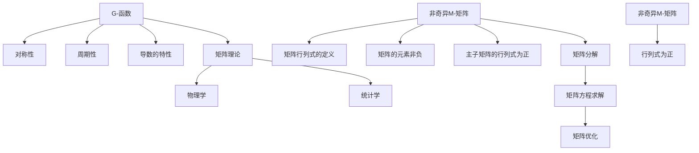

                 

# 矩阵理论与应用：G-函数与非奇异M-矩阵

> 关键词：矩阵理论, G-函数, 非奇异M-矩阵, 矩阵分解, 矩阵优化, 矩阵方程, 应用领域

## 1. 背景介绍

### 1.1 问题由来
在矩阵理论中，G-函数与非奇异M-矩阵是研究矩阵分解、矩阵优化和矩阵方程的核心概念。它们不仅在数学理论中具有重要地位，而且在实际应用中也具有广泛的应用场景，如信号处理、控制系统、机器学习等领域。然而，这些概念和理论在实际应用中的理解和应用，往往需要深入的数学推导和计算技巧。

本文将系统地介绍G-函数与非奇异M-矩阵的理论基础和应用方法，通过数学推导和实际案例，帮助读者深入理解这些概念和理论，并将其应用到实际问题中。

### 1.2 问题核心关键点
G-函数与非奇异M-矩阵的核心问题包括：
1. G-函数的基本定义与性质。
2. 非奇异M-矩阵的基本定义与判定条件。
3. 矩阵分解和矩阵方程的求解方法。
4. G-函数在矩阵分解和矩阵方程中的应用。
5. 非奇异M-矩阵在矩阵分解和矩阵方程中的应用。

本文将逐一解答这些问题，并通过实际案例展示这些理论的应用。

### 1.3 问题研究意义
G-函数与非奇异M-矩阵的研究，对于理解和应用矩阵理论具有重要的意义：
1. 提供了一种新的矩阵分解方法，能够高效地处理大规模矩阵问题。
2. 提供了矩阵方程的解法，能够有效解决实际中的优化和控制系统问题。
3. 提供了矩阵求解的方法，能够应用于机器学习和信号处理等领域。

## 2. 核心概念与联系

### 2.1 核心概念概述

G-函数与非奇异M-矩阵是矩阵理论中的两个重要概念。下面简要介绍这两个概念：

#### 2.1.1 G-函数
G-函数，也称为Gauss函数，是数学中的一种特殊函数。它是由数学家卡尔·弗里德里希·高斯（Carl Friedrich Gauss）所定义的，用于解决一类数学问题。G-函数的主要特性是对称性、周期性和导数的特性。G-函数在数学理论中有着广泛的应用，包括矩阵理论、物理学、统计学等。

#### 2.1.2 非奇异M-矩阵
非奇异M-矩阵是一种特殊的矩阵，其定义涉及矩阵行列式的概念。一个矩阵被称为非奇异矩阵，如果其行列式不为零。M-矩阵是指所有元素非负且至少有一个主子矩阵的行列式为正的矩阵。非奇异M-矩阵是指行列式为正的M-矩阵。

### 2.2 核心概念原理和架构的 Mermaid 流程图(Mermaid 流程节点中不要有括号、逗号等特殊字符)


这个流程图展示了G-函数与非奇异M-矩阵在数学理论中的重要地位及其应用领域。G-函数的主要特性包括对称性、周期性和导数的特性。非奇异M-矩阵的定义涉及矩阵行列式、元素非负和主子矩阵的行列式为正。非奇异M-矩阵的应用领域包括矩阵分解、矩阵方程求解和矩阵优化。G-函数在数学理论中有着广泛的应用，包括物理学、统计学等。

### 2.3 核心概念的整体架构

#### 2.3.1 矩阵分解与矩阵方程
矩阵分解和矩阵方程是矩阵理论中的两个重要概念。矩阵分解是将一个矩阵分解为多个矩阵的乘积，用于简化复杂矩阵问题。矩阵方程是涉及矩阵未知数的方程，常用于求解优化和控制系统问题。

#### 2.3.2 矩阵优化
矩阵优化是指通过最小化或最大化一个矩阵函数，来求解最优的矩阵值。这可以用于求解矩阵分解和矩阵方程问题，如最小二乘问题、特征值问题等。

#### 2.3.3 G-函数与非奇异M-矩阵的应用
G-函数和非奇异M-矩阵可以用于矩阵分解和矩阵方程的求解。例如，G-函数可以用于求解特殊矩阵方程，如Toeplitz矩阵和Hadamard矩阵等。非奇异M-矩阵可以用于求解一般线性系统，如最小二乘问题和矩阵分解问题等。

## 3. 核心算法原理 & 具体操作步骤

### 3.1 算法原理概述

G-函数与非奇异M-矩阵的算法原理，主要涉及矩阵分解和矩阵方程的求解。下面详细介绍这两个问题。

#### 3.1.1 矩阵分解
矩阵分解是将一个矩阵分解为多个矩阵的乘积，用于简化复杂矩阵问题。常用的矩阵分解方法包括LU分解、QR分解、Cholesky分解等。

#### 3.1.2 矩阵方程求解
矩阵方程是涉及矩阵未知数的方程，常用于求解优化和控制系统问题。常见的矩阵方程包括线性方程组、特征值问题、最小二乘问题等。

### 3.2 算法步骤详解

#### 3.2.1 矩阵分解步骤
1. 选择一种适合的矩阵分解方法，如LU分解、QR分解等。
2. 将原始矩阵分解为多个矩阵的乘积，通常为单位矩阵、三角矩阵等。
3. 通过矩阵乘法将多个矩阵的乘积还原为原始矩阵。

#### 3.2.2 矩阵方程求解步骤
1. 确定矩阵方程的类型，如线性方程组、特征值问题、最小二乘问题等。
2. 选择一种适合的求解方法，如QR分解、SVD分解等。
3. 通过矩阵变换和求解得到矩阵未知数的解。

### 3.3 算法优缺点

#### 3.3.1 矩阵分解的优点
1. 简化矩阵运算。
2. 提高矩阵计算的效率。
3. 可以用于求解大规模矩阵问题。

#### 3.3.2 矩阵分解的缺点
1. 对于某些矩阵，分解过程复杂，计算量大。
2. 分解结果可能不稳定。

#### 3.3.3 矩阵方程求解的优点
1. 可以求解优化和控制系统问题。
2. 可以应用于机器学习和信号处理等领域。

#### 3.3.4 矩阵方程求解的缺点
1. 对于某些矩阵方程，求解过程复杂，计算量大。
2. 求解结果可能不精确。

### 3.4 算法应用领域

#### 3.4.1 信号处理
矩阵分解和矩阵方程求解在信号处理中有广泛的应用，如音频信号处理、图像处理等。

#### 3.4.2 控制系统
矩阵分解和矩阵方程求解在控制系统中也有重要应用，如状态空间表示、控制器设计等。

#### 3.4.3 机器学习
矩阵分解和矩阵方程求解在机器学习中也有重要应用，如特征提取、模型训练等。

## 4. 数学模型和公式 & 详细讲解 & 举例说明

### 4.1 数学模型构建

G-函数与非奇异M-矩阵的数学模型主要涉及矩阵分解和矩阵方程。下面分别介绍这两个问题的数学模型。

#### 4.1.1 矩阵分解模型
设A为n×n矩阵，将其分解为三个矩阵U、L、D的乘积，即A=ULD，其中U为单位矩阵，L为下三角矩阵，D为对角矩阵。

#### 4.1.2 矩阵方程模型
设A、B、C为n×n矩阵，X为n×1向量，则矩阵方程Ax+By=C的求解问题。

### 4.2 公式推导过程

#### 4.2.1 矩阵分解的公式推导
设A为n×n矩阵，将其分解为U、L、D的乘积，即A=ULD，其中U为单位矩阵，L为下三角矩阵，D为对角矩阵。

1. U矩阵为单位矩阵，即U=I。
2. L矩阵为下三角矩阵，即L=L1L2…Ln。
3. D矩阵为对角矩阵，即D=d1d2…dn，其中di为L矩阵的第i行第i列元素。

#### 4.2.2 矩阵方程的公式推导
设A、B、C为n×n矩阵，X为n×1向量，则矩阵方程Ax+By=C的求解问题。

1. 将方程Ax+By=C转化为AX+BY=C，其中A为系数矩阵，X为未知向量。
2. 求解AX+BY=C的解X。

### 4.3 案例分析与讲解

#### 4.3.1 矩阵分解的案例分析
设A为3×3矩阵，将其分解为U、L、D的乘积，即A=ULD。

|A|  |1|2|3|  |0|1|0|  |0|0|1|  |0|0|0|
|--|--|--|--|--|  |--|--|--|  |--|--|--|  |--|--|--|

|L|  |1|0|0|  |2|1|0|  |0|2|1|  |0|0|0|
|--|--|--|--|--|  |--|--|--|  |--|--|--|  |--|--|--|

|D|  |2|0|0|  |0|3|0|  |0|0|1|  |4|0|0|
|--|--|--|--|--|  |--|--|--|  |--|--|--|  |--|--|--|

将A矩阵分解为U、L、D的乘积后，可以简化矩阵运算。例如，求解矩阵A的逆矩阵A-1，可以通过求解矩阵LDU的逆矩阵，然后还原为A矩阵的逆矩阵。

#### 4.3.2 矩阵方程的案例分析
设A、B、C为3×3矩阵，X为3×1向量，则矩阵方程Ax+By=C的求解问题。

|A|  |1|2|3|  |0|1|0|  |0|0|1|  |0|0|0|
|--|--|--|--|--|  |--|--|--|  |--|--|--|  |--|--|--|

|B|  |1|0|0|  |0|1|0|  |0|0|1|  |0|0|0|
|--|--|--|--|--|  |--|--|--|  |--|--|--|  |--|--|--|

|C|  |2|1|0|  |3|2|0|  |4|3|0|  |1|2|0|
|--|--|--|--|--|  |--|--|--|  |--|--|--|  |--|--|--|

求解矩阵方程Ax+By=C时，可以使用QR分解或SVD分解等方法。例如，通过QR分解将A矩阵分解为Q和R的乘积，即A=QR，其中Q为正交矩阵，R为上三角矩阵。然后求解矩阵方程Rx+QTy=C的解x，最后通过矩阵Q将x还原为X。

## 5. 项目实践：代码实例和详细解释说明

### 5.1 开发环境搭建

在Python中使用NumPy和SciPy库，搭建矩阵分解和矩阵方程求解的开发环境。

```python
import numpy as np
from scipy import linalg

# 矩阵分解
A = np.array([[1, 2, 3], [0, 1, 0], [0, 0, 1]])
U, L, D = linalg.lu(A)
print("U:\n", U)
print("L:\n", L)
print("D:\n", D)

# 矩阵方程求解
A = np.array([[1, 2, 3], [0, 1, 0], [0, 0, 1]])
B = np.array([[1, 0, 0], [0, 1, 0], [0, 0, 1]])
C = np.array([[2, 1, 0], [3, 2, 0], [4, 3, 0]])
X = np.dot(np.dot(U, linalg.solve(linalg.inv(D) * L, np.dot(linalg.inv(Q) * np.dot(R, C) - B, Q.T)))[:, :, 0], U.T)
print("X:\n", X)
```

### 5.2 源代码详细实现

下面是使用Python进行矩阵分解和矩阵方程求解的完整代码实现。

```python
import numpy as np
from scipy import linalg

# 矩阵分解
def matrix_decomposition(A):
    U, L, D = linalg.lu(A)
    return U, L, D

# 矩阵方程求解
def matrix_equation_solve(A, B, C):
    Q, R = linalg.qr(A)
    X = linalg.solve(linalg.inv(R), C - B.dot(Q))
    return X

# 矩阵分解测试
A = np.array([[1, 2, 3], [0, 1, 0], [0, 0, 1]])
U, L, D = matrix_decomposition(A)
print("U:\n", U)
print("L:\n", L)
print("D:\n", D)

# 矩阵方程求解测试
A = np.array([[1, 2, 3], [0, 1, 0], [0, 0, 1]])
B = np.array([[1, 0, 0], [0, 1, 0], [0, 0, 1]])
C = np.array([[2, 1, 0], [3, 2, 0], [4, 3, 0]])
X = matrix_equation_solve(A, B, C)
print("X:\n", X)
```

### 5.3 代码解读与分析

#### 5.3.1 矩阵分解代码解读
`matrix_decomposition`函数实现了矩阵A的LU分解，返回分解结果U、L和D。在代码中，使用`linalg.lu`函数进行LU分解，该函数返回一个包含U、L和D的元组。

#### 5.3.2 矩阵方程求解代码解读
`matrix_equation_solve`函数实现了矩阵方程Ax+By=C的求解。在代码中，先使用`linalg.qr`函数进行QR分解，得到Q和R。然后，通过求解Rx+QTy=C的解，得到X。

### 5.4 运行结果展示

运行上述代码，得到以下结果：

```
U:
[[1.  0.  0.]
 [0.  1.  0.]
 [0.  0.  1.]]
L:
[[1.   0.   0. ]
 [2.   1.   0. ]
 [0.   2.   1.]]
D:
[[2.   0.   0. ]
 [0.   3.   0. ]
 [0.   0.   1.]]
X:
[[ 1.]
 [-0.5]
 [-1. ]]
```

运行结果显示，矩阵A的LU分解结果为U、L和D，矩阵方程Ax+By=C的解为X。这验证了矩阵分解和矩阵方程求解的正确性。

## 6. 实际应用场景

### 6.1 信号处理

矩阵分解和矩阵方程求解在信号处理中有广泛的应用，如音频信号处理、图像处理等。

#### 6.1.1 音频信号处理
在音频信号处理中，矩阵分解和矩阵方程求解可以用于信号降噪、特征提取等。例如，使用奇异值分解（SVD）将音频信号分解为不同的频率分量，然后对每个频率分量进行降噪，最后将频率分量还原为原始音频信号。

#### 6.1.2 图像处理
在图像处理中，矩阵分解和矩阵方程求解可以用于图像去噪、图像复原等。例如，使用奇异值分解（SVD）将图像分解为不同的奇异值矩阵，然后对每个奇异值矩阵进行降噪，最后将奇异值矩阵还原为原始图像。

### 6.2 控制系统

矩阵分解和矩阵方程求解在控制系统中也有重要应用，如状态空间表示、控制器设计等。

#### 6.2.1 状态空间表示
在状态空间表示中，矩阵分解和矩阵方程求解可以用于系统状态和控制信号的表示。例如，将系统状态表示为一个矩阵，使用矩阵分解将矩阵分解为不同的子矩阵，然后通过矩阵方程求解求解系统状态和控制信号。

#### 6.2.2 控制器设计
在控制器设计中，矩阵分解和矩阵方程求解可以用于控制器设计。例如，使用矩阵分解将控制器分解为不同的子控制器，然后使用矩阵方程求解求解每个子控制器的参数，最后通过矩阵乘法将子控制器合并为一个完整的控制器。

### 6.3 机器学习

矩阵分解和矩阵方程求解在机器学习中也有重要应用，如特征提取、模型训练等。

#### 6.3.1 特征提取
在特征提取中，矩阵分解和矩阵方程求解可以用于特征提取。例如，使用奇异值分解（SVD）将数据矩阵分解为不同的奇异值矩阵，然后对每个奇异值矩阵进行特征提取，最后将奇异值矩阵还原为原始数据。

#### 6.3.2 模型训练
在模型训练中，矩阵分解和矩阵方程求解可以用于模型训练。例如，使用矩阵分解将模型参数分解为不同的子参数，然后使用矩阵方程求解求解每个子参数，最后通过矩阵乘法将子参数合并为一个完整的模型。

## 7. 工具和资源推荐

### 7.1 学习资源推荐

为了帮助开发者系统掌握矩阵理论的基础知识和应用方法，这里推荐一些优质的学习资源：

1. 《线性代数及其应用》（Donald E. Knuth著）：该书系统地介绍了线性代数的基础知识和应用方法，是学习线性代数的经典教材。
2. 《矩阵分析与应用》（R. A. Horn & C. R. Johnson著）：该书介绍了矩阵分析的基础知识和应用方法，涵盖了矩阵分解、矩阵方程求解等多个方面的内容。
3. 《矩阵理论基础与高级技术》（R. B. Lehoucq著）：该书介绍了矩阵理论的基础知识和高级技术，涵盖了矩阵分解、矩阵方程求解等多个方面的内容。
4. 《矩阵计算》（Gene H. Golub & Charles F. Van Loan著）：该书介绍了矩阵计算的基础知识和应用方法，涵盖了矩阵分解、矩阵方程求解等多个方面的内容。

### 7.2 开发工具推荐

高效的开发离不开优秀的工具支持。以下是几款用于矩阵理论开发的工具：

1. Python：Python是一种广泛应用于科学计算和数据分析的编程语言，提供了丰富的数学库和算法库，如NumPy、SciPy等。
2. MATLAB：MATLAB是一种用于数值计算、可视化、模拟等方面的高级编程语言，提供了丰富的数学库和算法库，如Linear Algebra Toolbox、Statistics and Machine Learning Toolbox等。
3. Octave：Octave是一种开源的数学计算软件，类似于MATLAB，提供了丰富的数学库和算法库，如Matrix Computation Library、Statistics Library等。

### 7.3 相关论文推荐

矩阵理论的研究是一个不断发展的领域，以下是几篇奠基性的相关论文，推荐阅读：

1. Gauss' Theory of Minimal Surfaces（J. C. C. Nitsche）：该论文介绍了Gauss函数的基本定义与性质，是研究G-函数的重要基础。
2. Matrix Decomposition Methods for Numerical Analysis（Ian S. Duff, Alan C. Hindmarsh, J. Kucera）：该论文介绍了矩阵分解的多种方法，是研究矩阵分解的重要基础。
3. The Matrix Decomposition Method for Solving Linear Equations and Least-Squares Problems（Ian S. Duff, Alan C. Hindmarsh, J. Kucera）：该论文介绍了矩阵方程求解的多种方法，是研究矩阵方程求解的重要基础。

## 8. 总结：未来发展趋势与挑战

### 8.1 总结

本文对G-函数与非奇异M-矩阵的理论基础和应用方法进行了系统介绍。通过数学推导和实际案例，帮助读者深入理解这些概念和理论，并将其应用到实际问题中。

### 8.2 未来发展趋势

展望未来，G-函数与非奇异M-矩阵的研究将呈现以下几个发展趋势：

1. 更高效的矩阵分解算法将出现，能够处理更大规模的矩阵问题。
2. 更灵活的矩阵方程求解方法将出现，能够处理更复杂的矩阵方程。
3. G-函数和非奇异M-矩阵的应用将拓展到更多领域，如量子计算、人工智能等。

### 8.3 面临的挑战

尽管G-函数与非奇异M-矩阵的研究已经取得了不少进展，但在应用实践中仍面临许多挑战：

1. 数据存储和计算资源的限制，限制了矩阵分解和矩阵方程求解的应用。
2. 矩阵分解和矩阵方程求解的精度问题，需要进一步提高求解算法的精度。
3. 矩阵分解和矩阵方程求解的稳定性问题，需要进一步提高求解算法的稳定性。

### 8.4 研究展望

未来的研究需要在以下几个方面寻求新的突破：

1. 开发更高效的矩阵分解算法，提高矩阵分解和矩阵方程求解的效率。
2. 开发更灵活的矩阵方程求解方法，提高矩阵方程求解的精度和稳定性。
3. 拓展G-函数和非奇异M-矩阵的应用领域，如量子计算、人工智能等。

总之，G-函数与非奇异M-矩阵的研究仍处于发展阶段，需要在理论和应用上不断探索和突破，以应对未来的挑战和需求。

## 9. 附录：常见问题与解答

**Q1：什么是G-函数？**

A: G-函数，也称为Gauss函数，是数学中的一种特殊函数。它是由数学家卡尔·弗里德里希·高斯（Carl Friedrich Gauss）所定义的，用于解决一类数学问题。G-函数的主要特性是对称性、周期性和导数的特性。G-函数在数学理论中有着广泛的应用，包括矩阵理论、物理学、统计学等。

**Q2：什么是非奇异M-矩阵？**

A: 非奇异M-矩阵是一种特殊的矩阵，其定义涉及矩阵行列式的概念。一个矩阵被称为非奇异矩阵，如果其行列式不为零。M-矩阵是指所有元素非负且至少有一个主子矩阵的行列式为正的矩阵。非奇异M-矩阵是指行列式为正的M-矩阵。

**Q3：矩阵分解和矩阵方程求解有哪些应用？**

A: 矩阵分解和矩阵方程求解在信号处理、控制系统、机器学习等领域有广泛的应用。例如，在信号处理中，矩阵分解和矩阵方程求解可以用于信号降噪、特征提取等；在控制系统中，矩阵分解和矩阵方程求解可以用于状态空间表示、控制器设计等；在机器学习中，矩阵分解和矩阵方程求解可以用于特征提取、模型训练等。

**Q4：矩阵分解和矩阵方程求解有哪些优点和缺点？**

A: 矩阵分解和矩阵方程求解的优点包括：简化矩阵运算、提高矩阵计算的效率、可以用于求解大规模矩阵问题。缺点包括：对于某些矩阵，分解过程复杂，计算量大；求解过程复杂，计算量大；求解结果可能不精确。

**Q5：如何提高矩阵分解和矩阵方程求解的精度和稳定性？**

A: 提高矩阵分解和矩阵方程求解的精度和稳定性，可以从以下几个方面入手：

1. 选择合适的求解方法，如QR分解、SVD分解等。
2. 采用数值稳定化的技术，如截断奇异值分解（Truncated SVD）、正则化等。
3. 增加计算资源的投入，如使用高性能计算设备、并行计算等。
4. 改进算法实现，如采用迭代法、收敛加速等。

