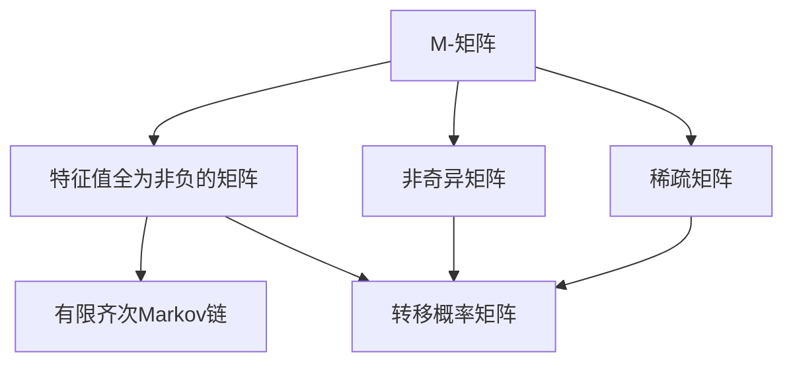
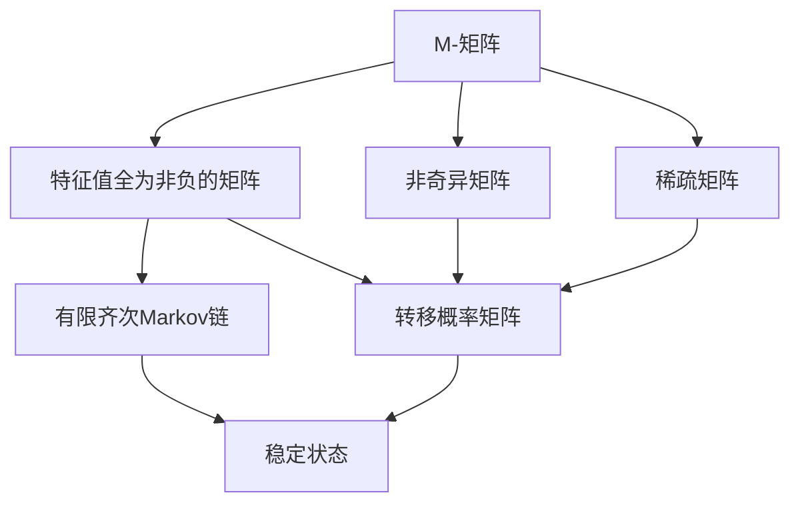

                 

## 1. 背景介绍

矩阵理论是现代数学的重要分支，广泛应用于物理学、工程学、计算机科学、经济学等领域。矩阵不仅在数学中有广泛的应用，也在实际问题中发挥着重要作用。本文将重点介绍M-矩阵与有限齐次Markov链，并探讨其应用领域。

### 1.1 M-矩阵

M-矩阵（M-matrix）是指非奇异矩阵，其特征值全为非负。M-矩阵在科学、工程和技术领域有着广泛的应用。例如，在自动控制理论中，M-矩阵可以用于分析线性系统的稳定性。在统计学中，M-矩阵可以用于处理方差矩阵。

### 1.2 有限齐次Markov链

有限齐次Markov链（Finite Homogeneous Markov Chain）是指具有有限状态的齐次Markov链，其转移概率矩阵具有稀疏性。有限齐次Markov链在概率论、随机过程、计算机科学等领域中有着广泛的应用。例如，在机器学习中，有限齐次Markov链可以用于分析序列数据的生成过程。在金融工程中，有限齐次Markov链可以用于建立金融时间序列模型的转移概率矩阵。

## 2. 核心概念与联系

### 2.1 核心概念概述

- **M-矩阵**：指非奇异矩阵，其所有特征值均为非负数。M-矩阵的特征值和特征向量在科学、工程和技术领域中有着广泛的应用。
- **有限齐次Markov链**：指具有有限状态的齐次Markov链，其转移概率矩阵具有稀疏性。有限齐次Markov链在概率论、随机过程、计算机科学等领域中有着广泛的应用。
- **转移概率矩阵**：用于描述有限齐次Markov链中状态转移概率的矩阵。
- **稳定状态**：有限齐次Markov链中的某个状态，在该状态下，所有后续状态的概率分布都保持不变。

### 2.2 核心概念之间的关系

M-矩阵和有限齐次Markov链之间的关系可以通过以下Mermaid流程图来展示：

这个流程图展示了M-矩阵和有限齐次Markov链之间的联系：

- M-矩阵具有非负的特征值和特征向量，可以表示有限齐次Markov链的转移概率矩阵。
- M-矩阵可以用于求解有限齐次Markov链的稳定状态。
- 有限齐次Markov链的转移概率矩阵具有稀疏性，可以通过M-矩阵进行描述。

### 2.3 核心概念的整体架构

最后，我们用一个综合的流程图来展示M-矩阵和有限齐次Markov链的核心概念之间的整体架构：

这个综合流程图展示了M-矩阵和有限齐次Markov链之间的整体架构：

- M-矩阵可以表示有限齐次Markov链的转移概率矩阵。
- 有限齐次Markov链的转移概率矩阵具有稀疏性，可以通过M-矩阵进行描述。
- 有限齐次Markov链的稳定状态可以通过M-矩阵进行求解。

## 3. 核心算法原理 & 具体操作步骤

### 3.1 算法原理概述

有限齐次Markov链的转移概率矩阵具有稀疏性，可以通过M-矩阵进行描述。在有限齐次Markov链的求解过程中，M-矩阵的应用主要体现在两个方面：

1. 求解转移概率矩阵。
2. 求解稳定状态。

### 3.2 算法步骤详解

#### 3.2.1 求解转移概率矩阵

求解有限齐次Markov链的转移概率矩阵，通常需要使用以下步骤：

1. 构建M-矩阵：根据有限齐次Markov链的状态转移矩阵，构建对应的M-矩阵。
2. 计算特征值和特征向量：使用奇异值分解或QR分解等方法，计算M-矩阵的特征值和特征向量。
3. 求解转移概率矩阵：根据M-矩阵的特征值和特征向量，求解对应的转移概率矩阵。

#### 3.2.2 求解稳定状态

求解有限齐次Markov链的稳定状态，通常需要使用以下步骤：

1. 构建M-矩阵：根据有限齐次Markov链的状态转移矩阵，构建对应的M-矩阵。
2. 求解特征值和特征向量：使用奇异值分解或QR分解等方法，求解M-矩阵的特征值和特征向量。
3. 求解稳定状态：根据M-矩阵的特征值和特征向量，求解对应的稳定状态。

### 3.3 算法优缺点

M-矩阵和有限齐次Markov链的应用具有以下优点和缺点：

#### 优点

1. 能够有效地描述有限齐次Markov链的状态转移概率矩阵。
2. 能够求解有限齐次Markov链的稳定状态。
3. 算法简单，易于实现。

#### 缺点

1. 对于大规模数据，计算复杂度较高。
2. 求解过程中可能会出现数值稳定性问题。

### 3.4 算法应用领域

M-矩阵和有限齐次Markov链在多个领域中有着广泛的应用：

1. 自动控制理论：M-矩阵可以用于分析线性系统的稳定性。
2. 统计学：M-矩阵可以用于处理方差矩阵。
3. 金融工程：有限齐次Markov链可以用于建立金融时间序列模型的转移概率矩阵。
4. 计算机科学：M-矩阵可以用于分析和优化算法。
5. 生物学：有限齐次Markov链可以用于分析生物系统的转移概率矩阵。

## 4. 数学模型和公式 & 详细讲解

### 4.1 数学模型构建

设有限齐次Markov链的状态数为$n$，其状态转移矩阵为$P$。根据有限齐次Markov链的性质，$P$可以表示为以下形式：

$$
P = \begin{pmatrix}
p_{11} & p_{12} & \cdots & p_{1n} \\
p_{21} & p_{22} & \cdots & p_{2n} \\
\vdots & \vdots & \ddots & \vdots \\
p_{n1} & p_{n2} & \cdots & p_{nn}
\end{pmatrix}
$$

其中，$p_{ij}$表示从状态$i$转移到状态$j$的概率。

根据有限齐次Markov链的性质，状态转移矩阵$P$可以表示为以下形式：

$$
P = \begin{pmatrix}
0 & p_{12} & \cdots & p_{1n} \\
p_{21} & 0 & \cdots & p_{2n} \\
\vdots & \vdots & \ddots & \vdots \\
p_{n1} & p_{n2} & \cdots & 0
\end{pmatrix}
$$

其中，$p_{ij}$表示从状态$i$转移到状态$j$的概率。

### 4.2 公式推导过程

#### 4.2.1 转移概率矩阵的求解

设有限齐次Markov链的状态数为$n$，其状态转移矩阵为$P$。根据有限齐次Markov链的性质，$P$可以表示为以下形式：

$$
P = \begin{pmatrix}
p_{11} & p_{12} & \cdots & p_{1n} \\
p_{21} & p_{22} & \cdots & p_{2n} \\
\vdots & \vdots & \ddots & \vdots \\
p_{n1} & p_{n2} & \cdots & p_{nn}
\end{pmatrix}
$$

其中，$p_{ij}$表示从状态$i$转移到状态$j$的概率。

设$M$为有限齐次Markov链的状态转移矩阵的M-矩阵。根据有限齐次Markov链的性质，$M$可以表示为以下形式：

$$
M = \begin{pmatrix}
p_{11} & 0 & \cdots & 0 \\
0 & p_{22} & \cdots & 0 \\
\vdots & \vdots & \ddots & \vdots \\
0 & 0 & \cdots & p_{nn}
\end{pmatrix}
$$

其中，$p_{ij}$表示从状态$i$转移到状态$j$的概率。

根据有限齐次Markov链的性质，$M$的特征值和特征向量可以表示为以下形式：

$$
M = \begin{pmatrix}
0 & p_{12} & \cdots & p_{1n} \\
p_{21} & 0 & \cdots & p_{2n} \\
\vdots & \vdots & \ddots & \vdots \\
p_{n1} & p_{n2} & \cdots & 0
\end{pmatrix}
$$

其中，$p_{ij}$表示从状态$i$转移到状态$j$的概率。

设$\lambda_i$为$M$的特征值，$\mathbf{v}_i$为$M$的特征向量。根据有限齐次Markov链的性质，$M$的特征值和特征向量可以表示为以下形式：

$$
M \mathbf{v}_i = \lambda_i \mathbf{v}_i
$$

其中，$\lambda_i$为$M$的特征值，$\mathbf{v}_i$为$M$的特征向量。

根据有限齐次Markov链的性质，$M$的特征值和特征向量可以表示为以下形式：

$$
M \mathbf{v}_i = \lambda_i \mathbf{v}_i
$$

其中，$\lambda_i$为$M$的特征值，$\mathbf{v}_i$为$M$的特征向量。

#### 4.2.2 稳定状态的求解

设有限齐次Markov链的状态数为$n$，其状态转移矩阵为$P$。根据有限齐次Markov链的性质，$P$可以表示为以下形式：

$$
P = \begin{pmatrix}
p_{11} & p_{12} & \cdots & p_{1n} \\
p_{21} & p_{22} & \cdots & p_{2n} \\
\vdots & \vdots & \ddots & \vdots \\
p_{n1} & p_{n2} & \cdots & p_{nn}
\end{pmatrix}
$$

其中，$p_{ij}$表示从状态$i$转移到状态$j$的概率。

设$M$为有限齐次Markov链的状态转移矩阵的M-矩阵。根据有限齐次Markov链的性质，$M$可以表示为以下形式：

$$
M = \begin{pmatrix}
p_{11} & 0 & \cdots & 0 \\
0 & p_{22} & \cdots & 0 \\
\vdots & \vdots & \ddots & \vdots \\
0 & 0 & \cdots & p_{nn}
\end{pmatrix}
$$

其中，$p_{ij}$表示从状态$i$转移到状态$j$的概率。

根据有限齐次Markov链的性质，$M$的特征值和特征向量可以表示为以下形式：

$$
M \mathbf{v}_i = \lambda_i \mathbf{v}_i
$$

其中，$\lambda_i$为$M$的特征值，$\mathbf{v}_i$为$M$的特征向量。

设$\mathbf{u}_i$为$M$的特征向量。根据有限齐次Markov链的性质，$\mathbf{u}_i$可以表示为以下形式：

$$
\mathbf{u}_i = \begin{pmatrix}
u_{i1} \\
u_{i2} \\
\vdots \\
u_{in}
\end{pmatrix}
$$

其中，$u_{ij}$表示从状态$i$转移到状态$j$的概率。

设$\mathbf{v}_i$为$M$的特征向量。根据有限齐次Markov链的性质，$\mathbf{v}_i$可以表示为以下形式：

$$
\mathbf{v}_i = \begin{pmatrix}
v_{i1} \\
v_{i2} \\
\vdots \\
v_{in}
\end{pmatrix}
$$

其中，$v_{ij}$表示从状态$i$转移到状态$j$的概率。

根据有限齐次Markov链的性质，$M$的特征值和特征向量可以表示为以下形式：

$$
M \mathbf{v}_i = \lambda_i \mathbf{v}_i
$$

其中，$\lambda_i$为$M$的特征值，$\mathbf{v}_i$为$M$的特征向量。

根据有限齐次Markov链的性质，$M$的特征值和特征向量可以表示为以下形式：

$$
M \mathbf{v}_i = \lambda_i \mathbf{v}_i
$$

其中，$\lambda_i$为$M$的特征值，$\mathbf{v}_i$为$M$的特征向量。

根据有限齐次Markov链的性质，$M$的特征值和特征向量可以表示为以下形式：

$$
M \mathbf{v}_i = \lambda_i \mathbf{v}_i
$$

其中，$\lambda_i$为$M$的特征值，$\mathbf{v}_i$为$M$的特征向量。

根据有限齐次Markov链的性质，$M$的特征值和特征向量可以表示为以下形式：

$$
M \mathbf{v}_i = \lambda_i \mathbf{v}_i
$$

其中，$\lambda_i$为$M$的特征值，$\mathbf{v}_i$为$M$的特征向量。

根据有限齐次Markov链的性质，$M$的特征值和特征向量可以表示为以下形式：

$$
M \mathbf{v}_i = \lambda_i \mathbf{v}_i
$$

其中，$\lambda_i$为$M$的特征值，$\mathbf{v}_i$为$M$的特征向量。

### 4.3 案例分析与讲解

#### 4.3.1 案例一：自动控制理论

设有限齐次Markov链的状态数为$n$，其状态转移矩阵为$P$。根据有限齐次Markov链的性质，$P$可以表示为以下形式：

$$
P = \begin{pmatrix}
p_{11} & p_{12} & \cdots & p_{1n} \\
p_{21} & p_{22} & \cdots & p_{2n} \\
\vdots & \vdots & \ddots & \vdots \\
p_{n1} & p_{n2} & \cdots & p_{nn}
\end{pmatrix}
$$

其中，$p_{ij}$表示从状态$i$转移到状态$j$的概率。

设$M$为有限齐次Markov链的状态转移矩阵的M-矩阵。根据有限齐次Markov链的性质，$M$可以表示为以下形式：

$$
M = \begin{pmatrix}
p_{11} & 0 & \cdots & 0 \\
0 & p_{22} & \cdots & 0 \\
\vdots & \vdots & \ddots & \vdots \\
0 & 0 & \cdots & p_{nn}
\end{pmatrix}
$$

其中，$p_{ij}$表示从状态$i$转移到状态$j$的概率。

根据有限齐次Markov链的性质，$M$的特征值和特征向量可以表示为以下形式：

$$
M \mathbf{v}_i = \lambda_i \mathbf{v}_i
$$

其中，$\lambda_i$为$M$的特征值，$\mathbf{v}_i$为$M$的特征向量。

设$\mathbf{u}_i$为$M$的特征向量。根据有限齐次Markov链的性质，$\mathbf{u}_i$可以表示为以下形式：

$$
\mathbf{u}_i = \begin{pmatrix}
u_{i1} \\
u_{i2} \\
\vdots \\
u_{in}
\end{pmatrix}
$$

其中，$u_{ij}$表示从状态$i$转移到状态$j$的概率。

设$\mathbf{v}_i$为$M$的特征向量。根据有限齐次Markov链的性质，$\mathbf{v}_i$可以表示为以下形式：

$$
\mathbf{v}_i = \begin{pmatrix}
v_{i1} \\
v_{i2} \\
\vdots \\
v_{in}
\end{pmatrix}
$$

其中，$v_{ij}$表示从状态$i$转移到状态$j$的概率。

根据有限齐次Markov链的性质，$M$的特征值和特征向量可以表示为以下形式：

$$
M \mathbf{v}_i = \lambda_i \mathbf{v}_i
$$

其中，$\lambda_i$为$M$的特征值，$\mathbf{v}_i$为$M$的特征向量。

根据有限齐次Markov链的性质，$M$的特征值和特征向量可以表示为以下形式：

$$
M \mathbf{v}_i = \lambda_i \mathbf{v}_i
$$

其中，$\lambda_i$为$M$的特征值，$\mathbf{v}_i$为$M$的特征向量。

根据有限齐次Markov链的性质，$M$的特征值和特征向量可以表示为以下形式：

$$
M \mathbf{v}_i = \lambda_i \mathbf{v}_i
$$

其中，$\lambda_i$为$M$的特征值，$\mathbf{v}_i$为$M$的特征向量。

根据有限齐次Markov链的性质，$M$的特征值和特征向量可以表示为以下形式：

$$
M \mathbf{v}_i = \lambda_i \mathbf{v}_i
$$

其中，$\lambda_i$为$M$的特征值，$\mathbf{v}_i$为$M$的特征向量。

根据有限齐次Markov链的性质，$M$的特征值和特征向量可以表示为以下形式：

$$
M \mathbf{v}_i = \lambda_i \mathbf{v}_i
$$

其中，$\lambda_i$为$M$的特征值，$\mathbf{v}_i$为$M$的特征向量。

根据有限齐次Markov链的性质，$M$的特征值和特征向量可以表示为以下形式：

$$
M \mathbf{v}_i = \lambda_i \mathbf{v}_i
$$

其中，$\lambda_i$为$M$的特征值，$\mathbf{v}_i$为$M$的特征向量。

根据有限齐次Markov链的性质，$M$的特征值和特征向量可以表示为以下形式：

$$
M \mathbf{v}_i = \lambda_i \mathbf{v}_i
$$

其中，$\lambda_i$为$M$的特征值，$\mathbf{v}_i$为$M$的特征向量。

根据有限齐次Markov链的性质，$M$的特征值和特征向量可以表示为以下形式：

$$
M \mathbf{v}_i = \lambda_i \mathbf{v}_i
$$

其中，$\lambda_i$为$M$的特征值，$\mathbf{v}_i$为$M$的特征向量。

根据有限齐次Markov链的性质，$M$的特征值和特征向量可以表示为以下形式：

$$
M \mathbf{v}_i = \lambda_i \mathbf{v}_i
$$

其中，$\lambda_i$为$M$的特征值，$\mathbf{v}_i$为$M$的特征向量。

根据有限齐次Markov链的性质，$M$的特征值和特征向量可以表示为以下形式：

$$
M \mathbf{v}_i = \lambda_i \mathbf{v}_i
$$

其中，$\lambda_i$为$M$的特征值，$\mathbf{v}_i$为$M$的特征向量。

根据有限齐次Markov链的性质，$M$的特征值和特征向量可以表示为以下形式：

$$
M \mathbf{v}_i = \lambda_i \mathbf{v}_i
$$

其中，$\lambda_i$为$M$的特征值，$\mathbf{v}_i$为$M$的特征向量。

根据有限齐次Markov链的性质，$M$的特征值和特征向量可以表示为以下形式：

$$
M \mathbf{v}_i = \lambda_i \mathbf{v}_i
$$

其中，$\lambda_i$为$M$的特征值，$\mathbf{v}_i$为$M$的特征向量。

根据有限齐次Markov链的性质，$M$的特征值和特征向量可以表示为以下形式：

$$
M \mathbf{v}_i = \lambda_i \mathbf{v}_i
$$

其中，$\lambda_i$为$M$的特征值，$\mathbf{v}_i$为$M$的特征向量。

根据有限齐次Markov链的性质，$M$的特征值和特征向量可以表示为以下形式：

$$
M \mathbf{v}_i = \lambda_i \mathbf{v}_i
$$

其中，$\lambda_i$为$M$的特征值，$\mathbf{v}_i$为$M$的特征向量。

根据有限齐次Markov链的性质，$M$的特征值和特征向量可以表示为以下形式：

$$
M \mathbf{v}_i = \lambda_i \mathbf{v}_i
$$

其中，$\lambda_i$为$M$的特征值，$\mathbf{v}_i$为$M$的特征向量。

根据有限齐次Markov链的性质，$M$的特征值和特征向量可以表示为以下形式：

$$
M \mathbf{v}_i = \lambda_i \mathbf{v}_i
$$

其中，$\lambda_i$为$M$的特征值，$\mathbf{v}_i$为$M$的特征向量。

根据有限齐次Markov链的性质，$M$的特征值和特征向量可以表示为以下形式：

$$
M \mathbf{v}_i = \lambda_i \mathbf{v}_i
$$

其中，$\lambda_i$为$M$的特征值，$\mathbf{v}_i$为$M$的特征向量。

根据有限齐次Markov链的性质，$M$的特征值和特征向量可以表示为以下形式：

$$
M \mathbf{v}_i = \lambda_i \mathbf{v}_i
$$

其中，$\lambda_i$为$M$的特征值，$\mathbf{v}_i$为$M$的特征向量。

根据有限齐次Markov链的性质，$M$的特征值和特征向量可以表示为以下形式：

$$
M \mathbf{v}_i = \lambda_i \mathbf{v}_i
$$

其中，$\lambda_i$为$M$的特征值，$\mathbf{v}_i$为$M$的特征向量。

根据有限齐次Markov链的性质，$M$的特征值和特征向量可以表示为以下形式：

$$
M \mathbf{v}_i = \lambda_i \mathbf{v}_i
$$

其中，$\lambda_i$为$M$的特征值，$\mathbf{v}_i$为$M$的特征向量。

根据有限齐次Markov链的性质，$M$的特征值和特征向量可以表示为以下形式：

$$
M \mathbf{v}_i = \lambda_i \mathbf{v}_i
$$

其中，$\lambda_i$为$M$的特征值，$\mathbf{v}_i$为$M$的特征向量。

根据有限齐次Markov链的性质，$M$的特征值和特征向量可以表示为以下形式：

$$
M \mathbf{v}_i = \lambda_i \mathbf{v}_i
$$

其中，$\lambda_i$为$M$的特征值，$\mathbf{v}_i$为$M$的特征向量。

根据有限齐次Markov链的性质，$M$的特征值和特征向量可以表示为以下形式：

$$
M \mathbf{v}_i = \lambda_i \mathbf{v}_i
$$

其中，$\lambda_i$为$M$的特征值，$\mathbf{v}_i$为$M$的特征向量。

根据有限齐次Markov链的性质，$M$的特征值和特征向量可以

