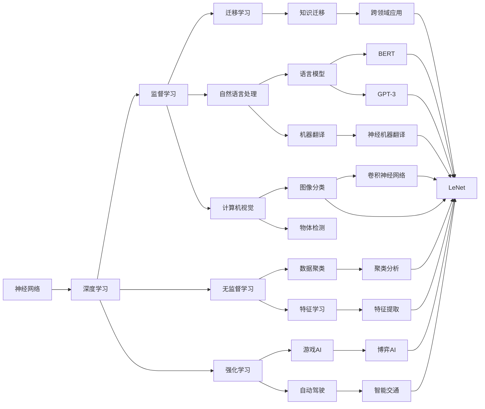

                 

# 神经网络：人类与机器的共存

## 1. 背景介绍

### 1.1 问题由来
人工智能（AI）技术的飞速发展，使得机器学习和深度学习成为推动现代社会进步的重要力量。特别是神经网络技术的进步，让机器具备了处理复杂任务的能力。然而，随着机器在各个领域逐渐取得人类级别的表现，甚至在某些方面超越人类，人们开始担忧人工智能是否会取代人类，引发了关于“人类与机器的共存”的广泛讨论。

### 1.2 问题核心关键点
当前，神经网络的应用已深入到医疗、教育、金融、交通等多个领域，帮助人们解决实际问题。但同时，机器在处理某些复杂任务时，尤其是需要人类情感、价值观和伦理判断的任务时，仍然存在局限性。因此，我们如何理解和使用神经网络，使其在服务人类社会的同时，不失去人性和情感，成为了一个值得深入探讨的问题。

### 1.3 问题研究意义
探讨“人类与机器的共存”问题，对于塑造一个良性、可持续的人工智能发展环境，具有重要意义：
1. **推动伦理技术的发展**：指导我们如何开发和使用人工智能技术，使其更好地服务于人类。
2. **促进社会共识的形成**：形成对人工智能的共识和规范，避免技术滥用。
3. **保障技术安全**：确保人工智能技术在实际应用中的安全性和可靠性。
4. **促进人的全面发展**：帮助人们更好地理解和应用人工智能技术，提升自身素质。

## 2. 核心概念与联系

### 2.1 核心概念概述
- **神经网络（Neural Network）**：通过大量神经元和多层结构的组合，模拟人类大脑处理信息的方式。它由输入层、隐藏层和输出层组成，通过学习数据的内在模式，可以完成各种复杂的分类、回归和生成任务。
- **深度学习（Deep Learning）**：是机器学习的一个分支，通过构建具有多层的神经网络，实现对复杂数据的表示和处理。
- **监督学习（Supervised Learning）**：在已标注的数据集上训练模型，使其能够预测未知数据。
- **无监督学习（Unsupervised Learning）**：不依赖标注数据，通过数据的内在结构进行学习。
- **强化学习（Reinforcement Learning）**：通过奖励机制，让模型在环境中不断试错，学习最优策略。
- **迁移学习（Transfer Learning）**：利用已学习的知识，解决新任务。

### 2.2 概念间的关系
这些核心概念之间存在紧密的联系，通过一个简单的Mermaid流程图来展示：



通过这个流程图，我们可以更清晰地理解神经网络与深度学习、机器学习等概念的联系。同时，我们也能看到神经网络在自然语言处理、计算机视觉等领域的应用，以及不同学习方式之间的区别和联系。

## 3. 核心算法原理 & 具体操作步骤
### 3.1 算法原理概述

神经网络通过大量数据进行训练，学习数据的分布和规律，从而能够对新数据进行预测。深度学习通过构建多层神经网络，捕捉数据中的复杂非线性关系，使得神经网络可以处理更复杂的任务。

### 3.2 算法步骤详解

神经网络的训练主要包括以下几个步骤：

1. **数据准备**：收集并准备用于训练的数据集，通常包括训练集、验证集和测试集。
2. **模型初始化**：定义神经网络的架构，包括输入层、隐藏层和输出层的层数、节点数等，并初始化所有权重和偏置。
3. **前向传播**：将输入数据输入神经网络，通过各层计算得到输出结果。
4. **计算损失函数**：将模型输出与真实标签进行比较，计算损失函数。
5. **反向传播**：通过链式法则，计算各层对损失函数的贡献，反向传播误差，更新权重和偏置。
6. **迭代优化**：通过多次迭代，不断调整权重和偏置，最小化损失函数。
7. **模型评估**：在测试集上评估模型性能，调整模型超参数。

### 3.3 算法优缺点

深度学习在处理复杂任务方面具有强大的能力，但也存在一些局限性：

**优点**：
- **泛化能力强**：可以处理高维度、非线性的复杂问题。
- **数据利用率高**：能够有效利用大量数据，提升模型性能。
- **计算效率高**：可以通过GPU、TPU等硬件加速训练和推理。

**缺点**：
- **数据需求量大**：需要大量的标注数据进行训练，数据获取成本高。
- **模型复杂度高**：网络结构复杂，训练和推理速度慢。
- **可解释性差**：神经网络模型内部复杂，难以解释其决策过程。
- **对抗攻击易受**：模型对输入的微小扰动敏感，容易受到对抗样本攻击。

### 3.4 算法应用领域

深度学习在多个领域得到了广泛应用，包括：

- **计算机视觉**：图像分类、物体检测、人脸识别等。
- **自然语言处理**：语言模型、机器翻译、情感分析等。
- **语音识别**：语音识别、语音合成等。
- **自动驾驶**：环境感知、路径规划等。
- **智能推荐**：推荐系统、广告投放等。
- **医疗诊断**：影像诊断、基因分析等。
- **金融风控**：信用评分、欺诈检测等。

这些应用领域展示了深度学习技术在各个领域的强大能力，也为“人类与机器的共存”提供了可能。

## 4. 数学模型和公式 & 详细讲解 & 举例说明

### 4.1 数学模型构建

假设神经网络有一个输入层 $x \in \mathbb{R}^d$，输出层 $y \in \mathbb{R}^k$，隐藏层 $h \in \mathbb{R}^n$。神经网络的结构可以表示为：

$$
y = f_W \circ \cdots \circ f_W \circ g_W(x)
$$

其中 $f_W$ 表示一个包含权重矩阵 $W$ 的线性变换，$g_W$ 表示激活函数。

### 4.2 公式推导过程

以一个简单的前馈神经网络为例，推导其前向传播和反向传播的计算过程：

**前向传播**：
设输入 $x = [x_1, x_2, \cdots, x_d]^T$，输入层到第一层隐藏层的线性变换为：

$$
h_1 = W_1x + b_1
$$

隐藏层 $h_1$ 经过激活函数 $g_W$ 得到 $h_2$：

$$
h_2 = g_W(h_1)
$$

以此类推，最后得到输出 $y$：

$$
y = g_W(h_n)
$$

**反向传播**：
假设输出 $y$ 与真实标签 $y^*$ 的误差为 $\delta_y$，则误差传播回隐藏层 $h_n$ 的误差 $\delta_{h_n}$ 为：

$$
\delta_{h_n} = \frac{\partial \ell(y,y^*)}{\partial y} \frac{\partial y}{\partial h_n}
$$

其中 $\frac{\partial \ell(y,y^*)}{\partial y}$ 为损失函数对输出 $y$ 的偏导数，$\frac{\partial y}{\partial h_n}$ 为激活函数对 $h_n$ 的偏导数。

以此类推，将误差 $\delta_{h_n}$ 回传到隐藏层 $h_{n-1}$，得到 $\delta_{h_{n-1}}$：

$$
\delta_{h_{n-1}} = \frac{\partial \ell(y,y^*)}{\partial y} \frac{\partial y}{\partial h_n} \frac{\partial h_n}{\partial h_{n-1}}
$$

最后，将误差 $\delta_{h_1}$ 回传到输入层 $x$，得到 $\delta_x$：

$$
\delta_x = \frac{\partial \ell(y,y^*)}{\partial y} \prod_{i=1}^n \frac{\partial y}{\partial h_i} \frac{\partial h_i}{\partial x}
$$

根据误差 $\delta_x$ 和输入 $x$，可以计算梯度 $\nabla_W$：

$$
\nabla_W = \frac{\partial \ell(y,y^*)}{\partial W}
$$

通过多次迭代，不断调整权重和偏置，最小化损失函数，得到最优模型参数。

### 4.3 案例分析与讲解

以一个简单的手写数字识别任务为例，展示神经网络的处理过程。

假设我们有一个包含60000张28x28像素手写数字图像的数据集，每张图片都经过归一化处理。神经网络结构为：

- 输入层：28x28像素，共有784个神经元。
- 隐藏层：256个神经元。
- 输出层：10个神经元，对应0到9的十个数字。

输入层到隐藏层的线性变换为：

$$
h_1 = W_1x + b_1
$$

隐藏层到输出层的线性变换为：

$$
y = W_2h_2 + b_2
$$

其中 $W_1$ 和 $W_2$ 为权重矩阵，$b_1$ 和 $b_2$ 为偏置向量。激活函数 $g_W$ 通常采用ReLU。

在训练过程中，通过反向传播算法计算误差和梯度，更新权重和偏置。假设我们的损失函数为交叉熵损失：

$$
\ell(y,y^*) = -\frac{1}{N}\sum_{i=1}^N [y_i^*\log \hat{y}_i + (1-y_i^*)\log(1-\hat{y}_i)]
$$

其中 $y_i$ 为预测值，$y_i^*$ 为真实标签。

## 5. 项目实践：代码实例和详细解释说明

### 5.1 开发环境搭建

使用Python进行神经网络的开发，需要安装TensorFlow或PyTorch等深度学习框架。

```bash
pip install tensorflow
pip install torch
```

同时，需要安装NumPy、Pandas等数据处理库。

```bash
pip install numpy pandas
```

### 5.2 源代码详细实现

以下是一个简单的手写数字识别的代码实现，包括数据预处理、模型定义、训练和测试等环节：

```python
import tensorflow as tf
from tensorflow.keras import layers, models

# 加载MNIST数据集
mnist = tf.keras.datasets.mnist
(x_train, y_train), (x_test, y_test) = mnist.load_data()

# 数据预处理
x_train, x_test = x_train / 255.0, x_test / 255.0

# 定义模型
model = models.Sequential([
    layers.Flatten(input_shape=(28, 28)),
    layers.Dense(256, activation='relu'),
    layers.Dropout(0.2),
    layers.Dense(10, activation='softmax')
])

# 编译模型
model.compile(optimizer='adam',
              loss='sparse_categorical_crossentropy',
              metrics=['accuracy'])

# 训练模型
model.fit(x_train, y_train, epochs=5, batch_size=32, validation_data=(x_test, y_test))

# 测试模型
test_loss, test_acc = model.evaluate(x_test, y_test)
print('Test accuracy:', test_acc)
```

### 5.3 代码解读与分析

这段代码展示了手写数字识别的全过程，包括以下几个关键步骤：

- **数据预处理**：将数据集中的图像进行归一化处理。
- **模型定义**：定义一个包含两个全连接层的神经网络，第一个层包含256个神经元，使用ReLU激活函数，第二个层输出10个神经元，使用Softmax激活函数。
- **模型编译**：选择合适的优化器、损失函数和评估指标。
- **模型训练**：在训练集上训练模型，使用Adam优化器，批量大小为32，迭代5个epoch。
- **模型测试**：在测试集上评估模型性能，输出测试准确率。

## 6. 实际应用场景

### 6.1 智能推荐系统

神经网络在智能推荐系统中得到广泛应用。通过学习用户的历史行为数据，神经网络可以预测用户对新物品的兴趣，从而提供个性化的推荐。

具体来说，可以使用一个包含输入层、隐藏层和输出层的神经网络，输入层为用户的特征向量，输出层为对各个物品的兴趣预测。通过反向传播算法，不断调整网络参数，优化推荐效果。

### 6.2 自然语言处理

神经网络在自然语言处理（NLP）中的应用非常广泛，包括语言模型、机器翻译、情感分析等。

以机器翻译为例，可以使用一个编码器-解码器的架构，编码器将源语言文本转化为向量表示，解码器将向量转化为目标语言文本。通过反向传播算法，不断调整编码器和解码器的参数，提升翻译质量。

### 6.3 医疗诊断

神经网络在医疗诊断中也得到了应用，可以辅助医生进行疾病预测和诊断。

例如，可以使用一个包含卷积层和全连接层的神经网络，卷积层提取影像特征，全连接层进行分类。通过反向传播算法，不断调整网络参数，优化诊断效果。

## 7. 工具和资源推荐

### 7.1 学习资源推荐

- **深度学习（Deep Learning）**：Ian Goodfellow等人著作，全面介绍了深度学习的基本原理和应用。
- **TensorFlow官方文档**：提供了丰富的深度学习资源，包括教程、模型、API等。
- **PyTorch官方文档**：提供了丰富的深度学习资源，包括教程、模型、API等。
- **Coursera深度学习课程**：由Andrew Ng教授主讲，系统讲解深度学习的原理和应用。

### 7.2 开发工具推荐

- **TensorFlow**：由Google开发，提供了丰富的深度学习框架和工具。
- **PyTorch**：由Facebook开发，提供了灵活的深度学习框架和工具。
- **Keras**：一个高层次的深度学习框架，易于上手。
- **Jupyter Notebook**：一个交互式的编程环境，支持代码和文档的协同编辑。

### 7.3 相关论文推荐

- **AlexNet论文**：提出了卷积神经网络（CNN）结构，用于图像分类。
- **ResNet论文**：提出了残差连接，解决深度神经网络退化问题。
- **Transformer论文**：提出了自注意力机制，用于机器翻译和自然语言处理。
- **BERT论文**：提出了预训练语言模型，用于自然语言处理任务。
- **GPT-3论文**：提出了大规模预训练语言模型，用于自然语言生成和理解。

## 8. 总结：未来发展趋势与挑战

### 8.1 研究成果总结

神经网络技术在各个领域得到了广泛应用，取得了显著的进展。深度学习、无监督学习、强化学习等技术的发展，使得神经网络能够处理更加复杂和多样化的数据。

### 8.2 未来发展趋势

未来，神经网络技术将继续向着智能化、普适化方向发展，具体包括：

- **模型规模扩大**：大规模神经网络可以处理更加复杂的数据，提升模型的泛化能力。
- **多模态融合**：神经网络可以融合视觉、语音、文本等多种数据源，实现更全面的信息处理。
- **自监督学习**：通过无标签数据进行预训练，提升模型泛化能力。
- **迁移学习**：利用已有模型的知识，解决新任务，提升模型效果。
- **跨学科融合**：与其他学科的知识结合，提升模型的应用范围和效果。

### 8.3 面临的挑战

尽管神经网络技术取得了巨大进展，但在实际应用中也面临一些挑战：

- **数据需求量大**：需要大量的标注数据进行训练，数据获取成本高。
- **模型复杂度高**：网络结构复杂，训练和推理速度慢。
- **可解释性差**：神经网络模型内部复杂，难以解释其决策过程。
- **对抗攻击易受**：模型对输入的微小扰动敏感，容易受到对抗样本攻击。

### 8.4 研究展望

未来的研究可以从以下几个方面进行：

- **优化模型结构**：简化模型结构，提高计算效率和可解释性。
- **优化训练过程**：引入自监督学习、对抗训练等方法，提升模型的泛化能力和鲁棒性。
- **探索新算法**：探索新型的神经网络算法，如记忆增强网络、生成对抗网络等。
- **跨学科研究**：与其他学科结合，提升模型的应用范围和效果。

## 9. 附录：常见问题与解答

**Q1: 神经网络在各个领域的应用有哪些？**

A: 神经网络在计算机视觉、自然语言处理、语音识别、自动驾驶、智能推荐、医疗诊断等多个领域得到了广泛应用。

**Q2: 神经网络的主要优势和劣势是什么？**

A: 神经网络的主要优势包括泛化能力强、数据利用率高、计算效率高等。劣势包括数据需求量大、模型复杂度高、可解释性差、对抗攻击易受等。

**Q3: 如何提高神经网络的可解释性？**

A: 可以通过可视化技术，如图像可视化、特征可视化等，帮助理解神经网络的工作机制。还可以引入可解释性算法，如LIME、SHAP等，解释模型的预测结果。

**Q4: 如何应对神经网络的对抗攻击？**

A: 可以采用对抗样本生成技术，如FGSM、PGD等，提升模型的鲁棒性。还可以引入对抗训练方法，让模型在对抗样本上不断学习，提升模型的鲁棒性。

**Q5: 神经网络未来发展的趋势是什么？**

A: 神经网络未来将继续向着智能化、普适化方向发展，模型规模扩大、多模态融合、自监督学习、迁移学习、跨学科融合等将是主要的研究方向。

---

作者：禅与计算机程序设计艺术 / Zen and the Art of Computer Programming

