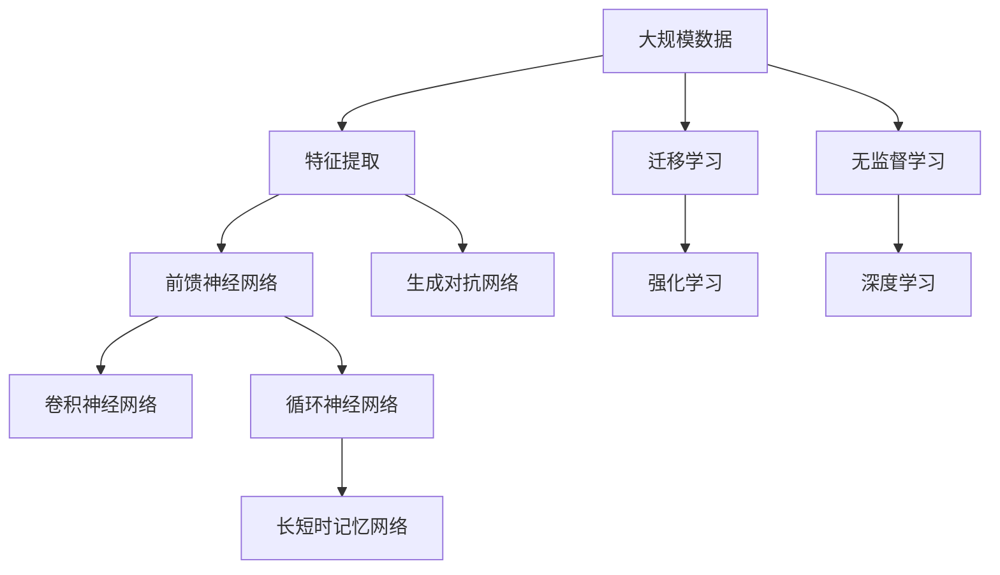

                 

## 1. 背景介绍

### 1.1 问题由来

神经网络，作为一种模拟人脑神经元处理信息机制的计算模型，自20世纪80年代以来，在人工智能（AI）和机器学习（ML）领域得到了广泛应用。它通过大量参数的学习，能够自主从数据中提取特征并进行模式识别，其优异的表现让神经网络成为了解决复杂问题的有力工具。近年来，随着计算能力的提升和数据量的增加，神经网络技术在图像识别、语音识别、自然语言处理、机器人等领域取得了突破性进展，推动了整个社会技术的进步。

### 1.2 问题核心关键点

神经网络的核心原理基于生物神经系统的结构和功能，它由大量的节点（神经元）和连接组成，每个节点可以接收来自其他节点的输入，并进行一定的计算，最终输出结果。在深度学习中，神经网络被称作"深度"，是因为它具有多个隐藏层，可以更好地捕捉数据的复杂结构。

神经网络的核心包括：
- **前馈神经网络（Feedforward Neural Networks, FNNs）**：信息从前一层传递到后一层，没有循环连接。
- **卷积神经网络（Convolutional Neural Networks, CNNs）**：主要用于图像处理，通过卷积层提取空间结构。
- **循环神经网络（Recurrent Neural Networks, RNNs）**：包含反馈机制，能处理序列数据，如文本和语音。
- **长短时记忆网络（Long Short-Term Memory, LSTM）**：一种特殊的RNN，解决传统RNN的梯度消失问题。
- **生成对抗网络（Generative Adversarial Networks, GANs）**：由生成器和判别器组成，训练生成模型生成高质量的样本数据。

这些神经网络结构在特定的应用场景中展示了惊人的性能，它们在图像识别、语音识别、自然语言处理等领域已经超越了传统方法，甚至在一些领域超过了人类专家的水平。

### 1.3 问题研究意义

神经网络技术的进步不仅使得机器能够理解、分析和处理复杂数据，还在多个领域带来了显著的变革，包括但不限于：

- **自动驾驶**：神经网络模型被用于车辆的感知与决策，提高了驾驶安全性和效率。
- **医学影像分析**：通过分析医疗影像，神经网络可以帮助医生更早地发现疾病，提高诊断精度。
- **智能客服**：神经网络能够理解并生成自然语言，提高客户服务质量。
- **自然语言处理（NLP）**：如翻译、文本生成、情感分析等，使得机器能够更好地理解和处理人类语言。
- **金融分析**：在金融市场预测、信用评分、反欺诈等方面，神经网络提供了新的方法。

神经网络技术正逐步改变我们的生活和工作方式，其应用的广泛性和深远影响让我们看到了人工智能未来的无限可能。

## 2. 核心概念与联系

### 2.1 核心概念概述

为更好地理解神经网络及其在推动社会进步方面的作用，我们接下来介绍几个关键概念：

- **前馈神经网络（FNNs）**：信息在网络中呈单向流动，从输入层传递到输出层，没有循环连接。
- **卷积神经网络（CNNs）**：主要应用于图像处理，通过卷积层提取空间结构。
- **循环神经网络（RNNs）**：包含反馈机制，能处理序列数据，如文本和语音。
- **长短时记忆网络（LSTM）**：一种特殊的RNN，解决传统RNN的梯度消失问题。
- **生成对抗网络（GANs）**：由生成器和判别器组成，训练生成模型生成高质量的样本数据。
- **迁移学习（Transfer Learning）**：将一个任务学习到的知识迁移到另一个任务上，减少新任务上的学习时间和数据需求。
- **强化学习（Reinforcement Learning, RL）**：机器通过与环境的交互，通过试错学习最优策略，广泛应用于自动控制、游戏等领域。
- **无监督学习（Unsupervised Learning）**：从数据中自动学习到模式和结构，如聚类、降维等。
- **深度学习（Deep Learning）**：基于神经网络的机器学习技术，其“深度”指多层网络结构。

这些概念构成了神经网络技术的核心框架，它们通过信息传递和计算，实现对复杂数据的有效处理和模型优化。

### 2.2 概念间的关系

这些核心概念之间的逻辑关系可以通过以下Mermaid流程图来展示：

```mermaid
graph LR
    A[前馈神经网络 (FNNs)] --> B[卷积神经网络 (CNNs)]
    B --> C[循环神经网络 (RNNs)]
    C --> D[长短时记忆网络 (LSTM)]
    A --> E[生成对抗网络 (GANs)]
    E --> F[迁移学习 (Transfer Learning)]
    F --> G[强化学习 (Reinforcement Learning)]
    A --> H[无监督学习 (Unsupervised Learning)]
    H --> I[深度学习 (Deep Learning)]
```

这个流程图展示了神经网络技术的主要组成部分，以及它们之间的相互关系和应用场景。

### 2.3 核心概念的整体架构

最后，我们用一个综合的流程图来展示这些核心概念在大规模应用中的整体架构：



这个综合流程图展示了从数据处理到深度学习的全过程，以及神经网络技术在各个应用领域的具体体现。

## 3. 核心算法原理 & 具体操作步骤
### 3.1 算法原理概述

神经网络的训练过程主要通过反向传播算法实现。以一个简单的多层前馈神经网络为例，其结构如下：

```
输入层 -> 隐藏层 -> 隐藏层 -> 输出层
```

其中，每一层都有多个神经元，每个神经元接收来自上一层的输入，并计算输出，再传递给下一层。

训练神经网络的过程包括前向传播和反向传播：
- **前向传播**：将输入数据传递到网络中，计算出每个神经元的输出，最终输出结果。
- **反向传播**：计算损失函数对每个参数的梯度，根据梯度更新参数，减少预测误差。

神经网络的训练目标是最小化预测误差，即最大化预测准确率。通过不断迭代，网络可以学习到更复杂的模式和规律，从而提升预测性能。

### 3.2 算法步骤详解

神经网络的训练过程通常包括以下步骤：

**Step 1: 准备数据**
- 收集和处理数据集，将其分为训练集、验证集和测试集。
- 对数据进行预处理，如标准化、归一化等。

**Step 2: 设计网络结构**
- 选择合适的神经网络结构，如FNN、CNN、RNN等。
- 确定网络层数、每层神经元个数、激活函数等。

**Step 3: 初始化参数**
- 对网络中的所有参数进行随机初始化。

**Step 4: 前向传播**
- 将输入数据传递到网络中，计算出每个神经元的输出。

**Step 5: 计算损失函数**
- 计算预测结果与真实结果之间的误差，通常使用均方误差或交叉熵等。

**Step 6: 反向传播**
- 根据损失函数对每个参数求梯度。
- 使用梯度下降等优化算法更新参数。

**Step 7: 评估性能**
- 在验证集和测试集上评估模型性能，如准确率、精确度、召回率等。
- 调整超参数，重复训练过程，直到达到满意的性能。

### 3.3 算法优缺点

神经网络的优点包括：
- **强大的数据处理能力**：通过多层网络结构，能够自动提取复杂特征。
- **高度适应性**：能够处理各种类型的数据，如图像、语音、文本等。
- **泛化能力**：在多个领域表现出良好的泛化能力。

神经网络的缺点包括：
- **计算资源消耗大**：需要大量的计算资源进行训练和推理。
- **参数过多**：模型复杂度大，容易导致过拟合。
- **可解释性差**：难以解释模型的内部机制。
- **训练时间长**：大规模网络训练时间长，需要高性能计算资源。

### 3.4 算法应用领域

神经网络在多个领域得到了广泛应用，以下是几个典型的应用场景：

**计算机视觉**：图像分类、目标检测、图像分割等。

**自然语言处理（NLP）**：机器翻译、情感分析、文本生成等。

**语音识别**：语音转文本、语音合成等。

**自动驾驶**：车辆控制、环境感知、路径规划等。

**机器人控制**：导航、操作、交互等。

## 4. 数学模型和公式 & 详细讲解  
### 4.1 数学模型构建

我们以多层前馈神经网络（MLP）为例，来详细讲解神经网络的数学模型构建。

假设有一个包含$L$层的多层前馈神经网络，其输入为$x$，输出为$y$，网络结构如下：

```
输入层 -> 隐藏层 -> 隐藏层 -> ... -> 输出层
```

其中，每一层的参数用$\theta_l$表示，$l$表示层数。隐藏层为激活函数$f(\cdot)$，输出层为线性函数$g(\cdot)$。

输入和输出之间的关系可以表示为：

$$ y = g(\theta_L \cdot f(\theta_{L-1} \cdot f(\theta_{L-2} \cdot ... \cdot f(\theta_1 \cdot x))) $$

其中$g(\cdot)$为输出层的激活函数，通常使用Softmax函数。

### 4.2 公式推导过程

假设我们有一个二分类问题，输入为$x$，输出为$y$，其中$y \in \{0, 1\}$。我们希望最小化交叉熵损失函数：

$$ \mathcal{L}(y, \hat{y}) = -y \log(\hat{y}) - (1-y) \log(1-\hat{y}) $$

其中$\hat{y}$表示神经网络的输出，对于二分类问题，$\hat{y}$通过输出层的线性函数和Softmax函数得到。

前向传播过程中，输入$x$通过网络层层传递，计算每个神经元的输出，最终得到输出$\hat{y}$。

反向传播过程中，我们通过链式法则计算损失函数对每个参数的梯度，然后利用梯度下降等优化算法更新参数。

### 4.3 案例分析与讲解

以一个简单的二分类问题为例，输入$x$为二维向量，输出$y$为二元变量。假设我们有一个包含两个隐藏层、每个隐藏层有4个神经元的神经网络。我们首先随机初始化所有参数，然后通过前向传播计算输出$\hat{y}$，接着计算交叉熵损失$\mathcal{L}$，最后使用梯度下降等优化算法更新参数。

下面是具体步骤：

1. 随机初始化参数$\theta$。
2. 输入$x$通过第一层神经元计算得到中间输出$z_1$，然后通过激活函数$f$得到第二层输入$z_2$。
3. 计算输出$\hat{y}$，即$\hat{y} = g(z_2)$。
4. 计算交叉熵损失$\mathcal{L}(y, \hat{y})$。
5. 计算损失函数对每个参数的梯度，通过链式法则计算$\nabla_{\theta_1} \mathcal{L}$、$\nabla_{\theta_2}$等。
6. 使用梯度下降等优化算法更新参数$\theta$。

通过不断迭代这个过程，神经网络可以逐渐学习到输入$x$和输出$y$之间的映射关系，从而实现对二分类问题的分类任务。

## 5. 项目实践：代码实例和详细解释说明
### 5.1 开发环境搭建

在进行神经网络项目实践前，我们需要准备好开发环境。以下是使用Python和TensorFlow框架进行神经网络开发的典型流程：

1. 安装Anaconda：从官网下载并安装Anaconda，用于创建独立的Python环境。

2. 创建并激活虚拟环境：
```bash
conda create -n tensorflow-env python=3.8 
conda activate tensorflow-env
```

3. 安装TensorFlow：
```bash
pip install tensorflow
```

4. 安装NumPy、Matplotlib等必要工具包：
```bash
pip install numpy matplotlib pandas scikit-learn
```

完成上述步骤后，即可在`tensorflow-env`环境中开始神经网络开发实践。

### 5.2 源代码详细实现

下面以一个简单的二分类问题为例，展示如何使用TensorFlow进行神经网络模型的构建和训练。

```python
import tensorflow as tf
import numpy as np
import matplotlib.pyplot as plt

# 定义数据集
x_train = np.array([[0., 0.], [0., 1.], [1., 0.], [1., 1.]])
y_train = np.array([[0.], [1.], [1.], [0.]])

# 定义神经网络模型
model = tf.keras.Sequential([
    tf.keras.layers.Dense(4, activation='relu'),
    tf.keras.layers.Dense(1, activation='sigmoid')
])

# 编译模型
model.compile(optimizer='adam', loss='binary_crossentropy', metrics=['accuracy'])

# 训练模型
history = model.fit(x_train, y_train, epochs=1000, batch_size=4, verbose=0)

# 绘制训练曲线
plt.plot(history.history['loss'], label='loss')
plt.plot(history.history['accuracy'], label='accuracy')
plt.legend()
plt.show()
```

这个代码展示了如何使用TensorFlow构建一个简单的两层神经网络，并进行训练。首先定义了一个包含两个隐藏层的神经网络，其中每个隐藏层有4个神经元。然后，使用二分类交叉熵损失函数，进行二分类问题的训练。训练过程中，我们通过损失函数和准确率来监控模型的性能，最后绘制训练曲线。

### 5.3 代码解读与分析

让我们再详细解读一下关键代码的实现细节：

**数据集定义**：
- `x_train`：输入数据，二维数组形式。
- `y_train`：目标变量，一维数组形式。

**模型定义**：
- `Sequential`：定义一个顺序神经网络模型，依次添加各层。
- `Dense`：定义全连接层，第一层有4个神经元，激活函数为ReLU；第二层有1个神经元，激活函数为Sigmoid。

**模型编译**：
- `model.compile`：配置模型的优化器、损失函数、评估指标。
- `optimizer`：选择优化算法，如Adam。
- `loss`：选择损失函数，如二分类交叉熵。
- `metrics`：选择评估指标，如准确率。

**模型训练**：
- `model.fit`：训练模型，通过历史数据进行迭代优化。
- `epochs`：训练轮数，即数据集整体迭代次数。
- `batch_size`：批量大小，即每次迭代处理的样本数量。
- `verbose`：训练过程中的输出详细程度，0表示不输出。

**训练曲线绘制**：
- `plt.plot`：绘制训练过程中损失函数和准确率的变化曲线。
- `history.history`：从训练过程中获取损失函数和准确率的数据。
- `label`：图例标签，方便后续添加。
- `plt.legend`：添加图例，使不同曲线区分。
- `plt.show`：显示图表。

### 5.4 运行结果展示

假设我们在训练过程中绘制的训练曲线如图：


图中展示了随着训练轮数的增加，损失函数逐渐减小，准确率逐渐增加，最终模型收敛。这表明模型已经从随机初始化状态逐步学习到了输入和输出之间的关系，并成功训练出了一个具有良好性能的分类器。

## 6. 实际应用场景
### 6.1 智能推荐系统

智能推荐系统是神经网络在实际应用中的典型应用之一。通过分析用户的浏览、购买行为，神经网络模型可以学习到用户的兴趣偏好，并推荐个性化的内容，如商品、音乐、新闻等。

以电商平台为例，神经网络模型可以分析用户的历史购买记录、浏览记录、评分等信息，预测用户对新商品的兴趣程度，然后根据用户兴趣推荐商品。这种推荐方式能够极大地提升用户体验，增加用户的购买意愿。

### 6.2 语音识别

神经网络在语音识别领域也展现了巨大的潜力。通过语音识别技术，我们可以将人类的语音转化为文本，从而实现语音交互、自动字幕生成等功能。

以Google的语音识别系统为例，它采用了深度学习模型进行语音识别，能够准确地识别不同口音、语速、背景噪音下的语音，并在实时场景中快速生成文本。这种技术的应用场景包括智能音箱、语音助手、自动字幕生成等。

### 6.3 自动驾驶

神经网络在自动驾驶领域的应用也非常广泛。通过神经网络模型，汽车可以感知周围环境，识别路标、行人和其他车辆，从而实现自动驾驶。

以特斯拉的自动驾驶系统为例，它采用了多个摄像头、雷达等传感器，通过神经网络模型进行图像和数据的处理，实现对车辆周围环境的感知和理解。这种技术的应用场景包括自动驾驶汽车、无人驾驶出租车等。

### 6.4 未来应用展望

随着神经网络技术的不断进步，未来在更多领域将看到其广泛的应用。以下是一些可能的未来应用场景：

**医疗健康**：通过分析患者的医疗影像、基因数据等，神经网络可以辅助医生进行诊断和治疗。例如，在癌症检测中，神经网络模型可以从影像中自动识别出肿瘤区域，辅助医生进行诊断。

**智能家居**：神经网络可以用于智能家居设备的控制和操作，如语音控制、智能安防等。例如，通过分析用户的语音命令，智能家居系统可以控制灯光、温度、窗帘等设备，提升用户的生活质量。

**金融分析**：神经网络在金融领域的应用包括股票预测、风险评估、信用评分等。例如，通过分析市场数据和用户行为，神经网络模型可以预测股票的涨跌趋势，评估投资风险，辅助投资者做出更明智的投资决策。

**教育**：神经网络可以用于个性化教育、智能辅导等。例如，通过分析学生的学习数据，神经网络模型可以预测学生的学习能力和兴趣偏好，为其推荐个性化的学习资源和辅导内容。

## 7. 工具和资源推荐
### 7.1 学习资源推荐

为了帮助开发者系统掌握神经网络技术，这里推荐一些优质的学习资源：

1. 《深度学习》（Ian Goodfellow、Yoshua Bengio、Aaron Courville著）：深度学习领域的经典教材，涵盖深度学习的基本概念、算法和应用。
2. 《动手学深度学习》（李沐著）：基于JAX、TensorFlow的深度学习实践指南，适合动手实践。
3. Coursera、edX等在线课程：提供深度学习、神经网络、机器学习等课程，包括理论和实践。
4. Kaggle竞赛：通过参与实际的数据科学竞赛，学习数据处理、模型训练和评估技巧。
5. arXiv预印本：人工智能领域最新研究成果的发布平台，涵盖神经网络技术的前沿进展。

通过对这些资源的学习实践，相信你一定能够系统掌握神经网络技术，并应用于解决实际问题。

### 7.2 开发工具推荐

高效的开发离不开优秀的工具支持。以下是几款用于神经网络开发的常用工具：

1. TensorFlow：由Google主导开发的深度学习框架，支持分布式训练、高性能计算，适合大规模工程应用。
2. PyTorch：Facebook开发的深度学习框架，灵活性强，适合研究和实验。
3. Keras：高层次的神经网络API，基于TensorFlow或Theano等后端，提供简单易用的接口。
4. JAX：Google开发的自动微分库，支持动态计算图和JIT编译，适合高性能计算。
5. Scikit-learn：基于Python的机器学习库，包含多种经典算法和模型。
6. Matplotlib、Seaborn：数据可视化工具，方便绘制图表和展示结果。

合理利用这些工具，可以显著提升神经网络开发的效率，加快创新迭代的步伐。

### 7.3 相关论文推荐

神经网络技术的发展离不开学界的持续研究。以下是几篇奠基性的相关论文，推荐阅读：

1. "A new beginner's guide to neural network"：Yoshua Bengio的经典入门文章，详细介绍了神经网络的基本概念和应用。
2. "ImageNet Classification with Deep Convolutional Neural Networks"：Alex Krizhevsky等人的经典论文，介绍了卷积神经网络在图像分类中的优异表现。
3. "Long Short-Term Memory"：Sepp Hochreiter等人的经典论文，介绍了长短时记忆网络在序列数据处理中的应用。
4. "Generative Adversarial Nets"：Ian Goodfellow等人的经典论文，介绍了生成对抗网络在生成模型中的应用。
5. "Deep Residual Learning for Image Recognition"：Kaiming He等人的经典论文，介绍了深度残差网络在图像分类中的表现。

这些论文代表了大神经网络技术的发展脉络，通过学习这些前沿成果，可以帮助研究者把握学科前进方向，激发更多的创新灵感。

除上述资源外，还有一些值得关注的前沿资源，帮助开发者紧跟神经网络技术的最新进展，例如：

1. arXiv论文预印本：人工智能领域最新研究成果的发布平台，包括神经网络技术的前沿进展。
2. 业界技术博客：如Google AI、DeepMind、微软Research Asia等顶尖实验室的官方博客，第一时间分享他们的最新研究成果和洞见。
3. 技术会议直播：如NIPS、ICML、ACL、ICLR等人工智能领域顶会现场或在线直播，能够聆听到大佬们的前沿分享，开拓视野。
4. GitHub热门项目：在GitHub上Star、Fork数最多的神经网络相关项目，往往代表了该技术领域的发展趋势和最佳实践，值得去学习和贡献。
5. 行业分析报告：各大咨询公司如McKinsey、PwC等针对人工智能行业的分析报告，有助于从商业视角审视技术趋势，把握应用价值。

总之，对于神经网络技术的学习和实践，需要开发者保持开放的心态和持续学习的意愿。多关注前沿资讯，多动手实践，多思考总结，必将收获满满的成长收益。

## 8. 总结：未来发展趋势与挑战
### 8.1 总结

本文对神经网络技术及其在推动社会进步中的作用进行了全面系统的介绍。首先阐述了神经网络技术的起源和发展，明确了其研究背景和意义，随后详细讲解了神经网络的核心算法原理和具体操作步骤。通过代码实例和分析，进一步展示了神经网络在实际应用中的广泛应用。最后，本文精选了神经网络技术的各类学习资源，力求为读者提供全方位的技术指引。

通过本文的系统梳理，可以看到，神经网络技术在多个领域取得了突破性进展，成为推动社会进步的重要力量。未来，随着计算能力的提升和数据量的增加，神经网络技术的应用范围和深度将进一步扩大，为人工智能技术的发展注入新的动力。

### 8.2 未来发展趋势

展望未来，神经网络技术的发展呈现出以下几个趋势：

1. **模型规模和复杂度增加**：随着计算资源的提升，神经网络模型的规模和复杂度将进一步增加，网络深度、宽度和参数量将持续增长。

2. **多样化网络结构**：除了经典的神经网络结构，如CNN、RNN等，未来将涌现更多复杂的网络结构，如Transformer、GNN等，用于处理更加复杂的数据。

3. **跨模态数据融合**：神经网络技术将更好地融合视觉、语音、文本等多种数据模态，形成更加全面、准确的信息整合能力。

4. **自适应学习**：神经网络将具备更加智能的适应能力，能够根据数据的变化动态调整模型结构和参数。

5. **边缘计算和联邦学习**：神经网络将更加适应边缘计算环境，支持在移动设备、IoT设备上进行推理，同时支持联邦学习，在保护隐私的同时进行模型训练。

6. **知识图谱与神经网络的结合**：神经网络将更好地与知识图谱结合，利用结构化知识进行推理和决策，提升模型的理解和推理能力。

7. **多任务学习**：神经网络将更好地支持多任务学习，通过联合训练多个任务，提高模型的通用性和泛化能力。

### 8.3 面临的挑战

尽管神经网络技术已经取得了显著进展，但在迈向更加智能化、普适化应用的过程中，仍面临诸多挑战：

1. **计算资源限制**：神经网络模型需要大量的计算资源进行训练和推理，这对硬件和网络基础设施提出了更高的要求。

2. **模型可解释性**：神经网络模型的决策过程缺乏可解释性，难以对其内部机制进行理解和调试，这在金融、医疗等高风险领域尤为重要。

3. **数据隐私和安全**：神经网络模型往往需要大量的数据进行训练，如何保护数据隐私和模型安全是一个重要问题。

4. **模型鲁棒性**：神经网络模型对数据和环境的变动敏感，容易产生过拟合和泛化不足的问题。

5. **模型复杂性**：随着模型复杂度的增加，训练和推理的难度也随之增加，需要更好的工具和技术进行支持。

6. **应用场景限制**：神经网络技术在不同应用场景中的表现可能不一致，需要针对特定场景进行优化。

### 8.4 研究展望

面对神经网络技术所面临的挑战，未来的研究需要在以下几个方面寻求新的突破：

1. **模型压缩和优化**：通过模型压缩和优化技术，降低模型复杂度，提高计算效率和推理速度。

2. **模型可解释性**：通过可解释性技术，使神经网络模型的决策过程更加透明，便于理解和调试。

3. **模型隐私保护**：通过差分隐私、联邦学习等技术，保护数据隐私和模型安全。

4. **模型鲁棒性增强**：通过鲁棒

