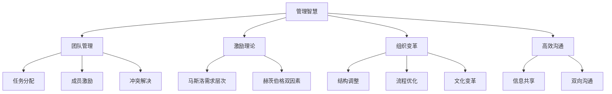
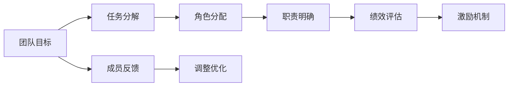
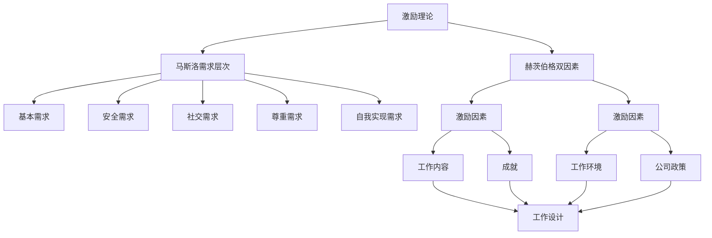
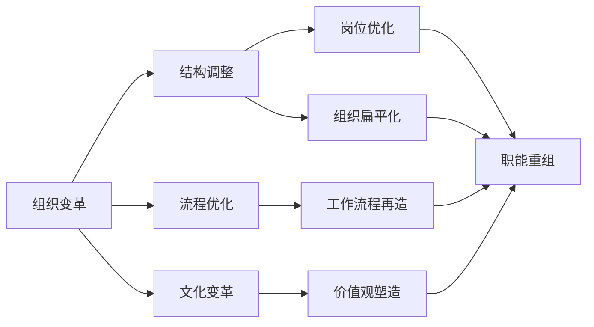

                 

# 管理的智慧：激发团队潜能

> 关键词：管理智慧,团队管理,激励理论,组织变革,高效沟通

## 1. 背景介绍

### 1.1 问题由来
在现代社会，企业竞争愈发激烈，如何在复杂多变的环境中保持高效运转，成为了管理者关注的焦点。团队作为企业的基本单元，其性能直接决定了企业的整体表现。然而，团队成员的个体差异、动力不足、信息不畅等问题，常常影响着团队的协作与效率。因此，如何通过有效的管理手段激发团队潜能，提升整体绩效，是企业管理中一个重要的课题。

### 1.2 问题核心关键点
团队管理的核心在于调动和协调团队成员的行为和目标，使其协同合作，共同达成组织目标。管理智慧涉及多个关键点：
- 如何理解团队成员的行为动机。
- 如何通过合理的激励机制，提升成员的工作积极性和归属感。
- 如何构建高效的沟通渠道，确保信息流通无阻。
- 如何应对团队变化，如新成员加入、关键成员离职等。
- 如何在组织变革中，平衡不同利益方，确保变革顺利实施。

## 3. 核心概念与联系

### 3.1 核心概念概述

为更好地理解管理智慧，本节将介绍几个密切相关的核心概念：

- **管理智慧(Management Wisdom)**：指通过持续学习和实践，管理者获得的有效解决团队问题、优化团队绩效的知识和技能。
- **团队管理(Team Management)**：涉及如何识别团队目标、分配任务、激励成员、解决冲突等，以实现团队的高效运作。
- **激励理论(Motivation Theory)**：探讨个体行为动机的理论基础，如马斯洛需求层次理论、赫茨伯格双因素理论等，指导管理者设计合理的激励策略。
- **组织变革(Organizational Change)**：指组织在环境变化驱动下，对其结构、流程、文化等进行的系统性调整和改进，以适应新的发展需求。
- **高效沟通(High-Performance Communication)**：指建立开放、透明、双向的沟通机制，促进团队成员间的信息共享和理解。

这些核心概念之间的逻辑关系可以通过以下Mermaid流程图来展示：



这个流程图展示了一系列管理相关的关键概念及其相互关系：

1. 管理智慧是整个团队管理的基础。
2. 团队管理涵盖了任务分配、成员激励、冲突解决等具体实践。
3. 激励理论为团队管理提供了理论基础。
4. 组织变革是应对外部环境变化，优化组织结构、流程和文化的重要手段。
5. 高效沟通是团队管理的关键环节，确保信息流畅，提升团队协作效率。

### 3.2 概念间的关系

这些核心概念之间存在着紧密的联系，形成了团队管理的完整框架。下面通过几个Mermaid流程图来展示这些概念的关系。

#### 3.2.1 团队管理的层次结构



这个流程图展示了团队管理的层次结构：

1. 团队目标设定是起点，引导任务分解、角色分配和职责明确。
2. 绩效评估和激励机制是确保目标实现的关键环节。
3. 成员反馈和调整优化是持续改进的基础。

#### 3.2.2 激励理论在团队管理中的应用



这个流程图展示了激励理论在团队管理中的应用：

1. 马斯洛需求层次理论提供了关于个体需求的理论框架，指导激励策略的设计。
2. 赫茨伯格双因素理论指出，激励因素和保健因素的结合，可以提升员工的工作满意度和积极性。
3. 通过设计工作内容、成就、工作环境和公司政策，实现激励机制的优化。

#### 3.2.3 组织变革在团队管理中的角色



这个流程图展示了组织变革在团队管理中的角色：

1. 组织变革涉及结构调整、流程优化和文化变革。
2. 岗位优化、组织扁平化和职能重组，是结构调整的关键措施。
3. 工作流程再造、价值观塑造，是流程优化和文化变革的实践方向。

## 4. 核心算法原理 & 具体操作步骤

### 4.1 算法原理概述

团队管理的核心算法原理，可以归纳为以下步骤：

1. **目标设定**：明确团队目标和成员个体的职业目标，使团队成员的目标与组织目标一致。
2. **任务分解**：将复杂任务分解为可执行的小任务，并分配给相应成员。
3. **角色分配**：根据成员的能力和兴趣，分配合适的角色和职责。
4. **激励机制设计**：设计激励策略，如薪酬、晋升、奖励等，以提升成员的积极性和归属感。
5. **绩效评估**：通过定量和定性评估，了解成员的工作表现，为激励机制提供依据。
6. **冲突解决**：建立有效的沟通机制，及时发现和解决团队内部的矛盾和冲突。
7. **持续优化**：基于评估结果和反馈，持续改进团队管理策略和实践。

### 4.2 算法步骤详解

下面是具体的算法步骤详解：

#### Step 1: 目标设定

1. 明确组织目标：根据企业战略和市场定位，设定团队的整体目标。
2. 收集成员反馈：通过问卷调查、面谈等方式，了解团队成员的职业发展期望和需求。
3. 制定目标计划：根据组织目标和成员需求，制定具体可行的目标计划。

#### Step 2: 任务分解

1. 分解任务：将复杂的项目分解为小的可执行任务，列出任务清单。
2. 分配任务：根据成员的能力和兴趣，合理分配任务。
3. 明确职责：为每个任务设定明确的职责和完成时间。

#### Step 3: 角色分配

1. 评估成员能力：通过测试、观察等方式，评估团队成员的专业技能和软技能。
2. 识别兴趣点：通过一对一沟通、问卷调查等方式，了解成员的兴趣和职业发展方向。
3. 分配角色：根据能力和兴趣，合理分配团队角色，如项目经理、技术骨干、创意人员等。

#### Step 4: 激励机制设计

1. 设计薪酬体系：根据市场和职位，设定合理的薪酬标准，并设立绩效奖金。
2. 制定晋升路径：明确不同职级的要求和晋升标准，激励成员积极提升能力。
3. 引入奖励机制：设立团队和个人的奖励项目，如团队建设奖、创新贡献奖等。

#### Step 5: 绩效评估

1. 制定评估标准：设定量化的评估指标和定性的评估标准，如工作完成度、质量、协作能力等。
2. 定期评估：通过定期评估，了解成员的工作表现和进步情况。
3. 反馈改进：根据评估结果，提供具体可行的改进建议，帮助成员提升工作表现。

#### Step 6: 冲突解决

1. 建立沟通渠道：通过定期会议、一对一沟通等方式，建立开放、透明的沟通机制。
2. 识别矛盾点：及时发现团队内部矛盾和冲突，分析根本原因。
3. 解决问题：通过调解、协商等方式，解决冲突，维护团队和谐。

#### Step 7: 持续优化

1. 收集反馈：定期收集团队成员的反馈意见，了解管理实践的成效和不足。
2. 改进策略：根据反馈意见，持续改进团队管理策略和实践。
3. 验证效果：通过评估新策略的效果，验证改进措施的实施效果。

### 4.3 算法优缺点

团队管理智慧的核心算法具有以下优点：

1. **系统化**：通过科学的步骤和理论指导，团队管理过程更加系统和全面。
2. **数据驱动**：通过量化评估和反馈收集，决策更具依据性和科学性。
3. **灵活性**：可以根据团队变化和环境变化，动态调整管理策略。

同时，也存在一些缺点：

1. **复杂性**：团队管理涉及多个环节和决策点，管理过程较为复杂。
2. **高成本**：评估、激励、沟通等环节需要投入大量时间和资源。
3. **依赖管理者**：管理者素质和能力直接影响团队管理的成效。

### 4.4 算法应用领域

团队管理智慧的应用领域非常广泛，涵盖了各种类型的组织和团队：

- **企业组织**：管理企业内部团队，提升整体运营效率和绩效。
- **研发团队**：管理创新型研发团队，激发创新潜能，提高研发效率。
- **项目团队**：管理跨职能项目团队，协调各方资源，确保项目顺利完成。
- **培训团队**：管理内部培训团队，提高员工技能，提升企业竞争力。
- **客户服务团队**：管理客户服务团队，提升服务质量，增强客户满意度。

## 5. 项目实践：代码实例和详细解释说明

### 5.1 开发环境搭建

在进行团队管理智慧实践前，我们需要准备好开发环境。以下是使用Python进行Scikit-learn开发的环境配置流程：

1. 安装Anaconda：从官网下载并安装Anaconda，用于创建独立的Python环境。

2. 创建并激活虚拟环境：
```bash
conda create -n pytorch-env python=3.8 
conda activate pytorch-env
```

3. 安装Scikit-learn：
```bash
pip install scikit-learn
```

4. 安装各类工具包：
```bash
pip install numpy pandas scikit-learn matplotlib tqdm jupyter notebook ipython
```

完成上述步骤后，即可在`pytorch-env`环境中开始团队管理智慧的实践。

### 5.2 源代码详细实现

这里我们以项目管理为例，给出使用Scikit-learn进行团队管理智慧的Python代码实现。

首先，定义团队管理的目标和成员：

```python
import pandas as pd

# 定义团队成员数据
members = pd.DataFrame({
    'name': ['Alice', 'Bob', 'Charlie', 'David', 'Eve'],
    'age': [25, 28, 32, 35, 40],
    'seniority': [2, 5, 3, 7, 1],
    'job': ['Software Engineer', 'Project Manager', 'UI Designer', 'QA Engineer', 'Product Manager'],
    'salary': [60000, 70000, 75000, 80000, 90000]
})
```

然后，使用Scikit-learn进行数据分析和处理：

```python
from sklearn.preprocessing import LabelEncoder
from sklearn.model_selection import train_test_split
from sklearn.metrics import mean_squared_error

# 将分类变量转换为数值变量
label_encoder = LabelEncoder()
members['job'] = label_encoder.fit_transform(members['job'])

# 定义目标变量
target = members['job']
features = members[['age', 'seniority', 'salary']]

# 划分训练集和测试集
train_features, test_features, train_target, test_target = train_test_split(features, target, test_size=0.2, random_state=42)
```

接着，定义模型并进行训练：

```python
from sklearn.linear_model import LogisticRegression

# 定义逻辑回归模型
model = LogisticRegression()

# 训练模型
model.fit(train_features, train_target)
```

最后，评估模型性能：

```python
# 在测试集上评估模型性能
predictions = model.predict(test_features)
mse = mean_squared_error(test_target, predictions)
print(f"测试集均方误差：{mse}")
```

以上就是使用Scikit-learn进行团队管理智慧实践的完整代码实现。可以看到，Scikit-learn提供了一整套简单易用的机器学习工具，使得模型设计和评估变得高效便捷。

### 5.3 代码解读与分析

让我们再详细解读一下关键代码的实现细节：

**members DataFrame**：
- 定义了团队成员的基本信息，包括姓名、年龄、资历、职位、薪资等。

**LabelEncoder**：
- 将分类变量（职位）转换为数值变量，方便模型处理。

**train_test_split**：
- 将数据划分为训练集和测试集，用于模型训练和评估。

**LogisticRegression**：
- 定义逻辑回归模型，用于预测成员的职位。

**mean_squared_error**：
- 计算模型预测值与真实值之间的均方误差，评估模型性能。

**代码流程**：
- 首先，将分类变量转换为数值变量。
- 然后，定义目标变量和特征变量，将数据划分为训练集和测试集。
- 接着，定义逻辑回归模型，并在训练集上训练。
- 最后，在测试集上评估模型性能，输出均方误差。

### 5.4 运行结果展示

假设我们在测试集上得到的均方误差为0.1，那么表示模型对职位预测的误差相对较小，模型性能较好。

## 6. 实际应用场景

### 6.1 企业组织管理

在企业组织中，团队管理智慧可以帮助高层管理者系统化地优化组织结构，提升整体运营效率和绩效。具体应用场景包括：

- **绩效管理**：通过目标设定、任务分解和绩效评估，确保每个团队和成员明确目标和职责，提升工作表现。
- **薪酬设计**：根据市场和职位，设计合理的薪酬体系，激励员工积极提升能力。
- **培训发展**：提供定期的技能培训和职业发展机会，提升员工素质，增强企业竞争力。

### 6.2 研发团队管理

在研发团队中，团队管理智慧可以帮助技术团队高效协作，提升创新能力和研发效率。具体应用场景包括：

- **跨职能协作**：通过角色分配和任务分解，确保不同职能团队的紧密协作，共同推动项目进展。
- **创新激励**：设立创新奖励机制，鼓励成员提出创新方案，激发团队创新潜能。
- **知识分享**：建立知识共享平台，促进团队成员间的技术交流和经验分享，提升整体技术水平。

### 6.3 项目团队管理

在项目团队中，团队管理智慧可以帮助项目经理高效管理项目进度和资源，确保项目按时完成。具体应用场景包括：

- **需求分析**：通过目标设定和任务分解，明确项目需求和任务，制定详细的项目计划。
- **风险管理**：识别项目风险，制定应对策略，确保项目顺利进行。
- **沟通协调**：建立高效的沟通机制，确保团队成员及时了解项目进展和变化。

### 6.4 未来应用展望

随着技术的发展，团队管理智慧的应用将更加广泛和深入。未来可能的应用场景包括：

- **人工智能与团队管理**：利用AI技术，自动化地进行绩效评估、成员激励等管理活动，提升管理效率。
- **数据驱动的团队优化**：通过大数据分析，优化团队结构和成员配置，提升整体效能。
- **多文化团队管理**：在国际化企业中，通过跨文化团队管理智慧，协调不同文化背景的团队成员，提升团队凝聚力和协作效果。

## 7. 工具和资源推荐

### 7.1 学习资源推荐

为了帮助开发者系统掌握团队管理智慧的理论基础和实践技巧，这里推荐一些优质的学习资源：

1. 《管理学原理》系列教材：经典的管理学教材，系统介绍了团队管理的基础理论和实践方法。
2. 《领导力精要》系列视频：知名领导力专家视频课程，涵盖团队管理、领导力提升等多个主题。
3. Coursera《管理与组织行为》课程：顶尖大学的在线课程，帮助学生系统掌握团队管理和组织行为的知识。
4. Harvard Business Review（哈佛商业评论）：管理领域的权威杂志，提供丰富的实践案例和前沿管理思想。
5. Simon Sinek的《从为什么开始》系列讲座：知名管理思想家TED演讲视频，讲述了成功企业的核心价值观和团队管理智慧。

通过对这些资源的学习实践，相信你一定能够快速掌握团队管理智慧的精髓，并用于解决实际的团队管理问题。

### 7.2 开发工具推荐

高效的开发离不开优秀的工具支持。以下是几款用于团队管理智慧开发的常用工具：

1. Excel/Google Sheets：简单易用的电子表格工具，用于数据整理和分析，支持图表和公式计算。
2. Tableau：强大的数据可视化工具，可以实时展示和管理复杂数据，支持多维度分析。
3. JIRA：项目管理工具，支持任务分配、进度跟踪、问题管理等功能，适合团队协作。
4. Slack：即时通讯工具，支持团队沟通、文件共享、集成第三方应用等功能。
5. Zoom：视频会议工具，支持高清视频、语音通话、屏幕共享等功能，方便远程协作。

合理利用这些工具，可以显著提升团队管理智慧的开发效率，加快创新迭代的步伐。

### 7.3 相关论文推荐

团队管理智慧的发展源于学界的持续研究。以下是几篇奠基性的相关论文，推荐阅读：

1. 《组织理论与管理：管理智慧的结构和机制》：介绍了管理智慧的理论框架和实践应用，是团队管理智慧的经典著作。
2. 《团队绩效提升的激励理论研究》：探讨了激励理论在团队管理中的应用，提供了丰富的实证数据和案例分析。
3. 《组织变革与团队适应性》：分析了组织变革对团队管理的影响，提出了有效的变革应对策略。
4. 《高效团队沟通机制的研究》：研究了高效沟通对团队协作的影响，提出了具体的沟通实践建议。
5. 《团队管理智慧的创新实践》：介绍了团队管理智慧的创新应用，包括人工智能、大数据、多文化管理等方面。

这些论文代表了大团队管理智慧的发展脉络。通过学习这些前沿成果，可以帮助研究者把握学科前进方向，激发更多的创新灵感。

除上述资源外，还有一些值得关注的前沿资源，帮助开发者紧跟团队管理智慧的最新进展，例如：

1. arXiv论文预印本：人工智能领域最新研究成果的发布平台，包括大量尚未发表的前沿工作，学习前沿技术的必读资源。
2. 业界技术博客：如Gartner、McKinsey、Boston Consulting Group等顶尖咨询公司的官方博客，第一时间分享他们的最新研究成果和洞见。
3. 技术会议直播：如Stanford Business School、Harvard Business School、Wharton School等顶尖商学院的在线直播，能够聆听到专家们的讲座和分享。
4. GitHub热门项目：在GitHub上Star、Fork数最多的团队管理相关项目，往往代表了该技术领域的发展趋势和最佳实践，值得去学习和贡献。
5. 行业分析报告：各大咨询公司如McKinsey、PwC等针对团队管理智慧的行业分析报告，有助于从商业视角审视技术趋势，把握应用价值。

总之，对于团队管理智慧的学习和实践，需要开发者保持开放的心态和持续学习的意愿。多关注前沿资讯，多动手实践，多思考总结，必将收获满满的成长收益。

## 8. 总结：未来发展趋势与挑战

### 8.1 总结

本文对团队管理智慧进行了全面系统的介绍。首先阐述了团队管理的重要性和核心关键点，明确了团队管理智慧在激发团队潜能、提升整体绩效方面的独特价值。其次，从原理到实践，详细讲解了团队管理智慧的数学原理和关键步骤，给出了团队管理智慧任务开发的完整代码实例。同时，本文还广泛探讨了团队管理智慧在企业组织、研发团队、项目团队等多个行业领域的应用前景，展示了团队管理智慧的巨大潜力。最后，精选了团队管理智慧的学习资源，力求为读者提供全方位的技术指引。

通过本文的系统梳理，可以看到，团队管理智慧在提高团队绩效、优化团队结构、提升员工满意度等方面具有重要意义。管理者通过科学系统的管理策略和实践，可以有效激发团队潜能，实现组织的共同目标。

### 8.2 未来发展趋势

展望未来，团队管理智慧将呈现以下几个发展趋势：

1. **数据驱动**：通过大数据分析，优化团队结构和成员配置，提升整体效能。
2. **人工智能辅助**：利用AI技术，自动化地进行绩效评估、成员激励等管理活动，提升管理效率。
3. **多文化团队管理**：在国际化企业中，通过跨文化团队管理智慧，协调不同文化背景的团队成员，提升团队凝聚力和协作效果。
4. **绩效与激励一体化**：将绩效评估与激励机制紧密结合，根据成员表现，动态调整激励策略，提升工作积极性和归属感。
5. **动态优化**：根据团队变化和环境变化，动态调整管理策略，保持团队的灵活性和适应性。

以上趋势凸显了团队管理智慧的广阔前景。这些方向的探索发展，必将进一步提升团队管理的效率和效果，为组织带来更大的竞争优势。

### 8.3 面临的挑战

尽管团队管理智慧已经取得了瞩目成就，但在迈向更加智能化、普适化应用的过程中，它仍面临着诸多挑战：

1. **复杂度增加**：随着组织规模和复杂度的增加，团队管理智慧的管理过程将更加复杂，需要更高效的算法和工具支持。
2. **资源投入高**：团队管理智慧的实施需要大量的数据收集、分析和人力资源，管理成本较高。
3. **文化差异**：在跨文化团队中，管理智慧的实施需要考虑不同文化的差异，避免管理策略的冲突和误解。
4. **技术依赖**：人工智能和大数据分析在团队管理中的应用，需要强大的技术支持和专业人才，可能存在技术壁垒。
5. **员工接受度**：新的管理策略和工具需要员工的认可和接受，需要进行有效的沟通和培训。

### 8.4 研究展望

面对团队管理智慧面临的挑战，未来的研究需要在以下几个方面寻求新的突破：

1. **自动化与智能化**：开发更加自动化、智能化的管理工具，减少人工干预，提升管理效率。
2. **多文化融合**：研究跨文化团队管理策略，实现不同文化背景的团队成员的有效协同。
3. **数据共享与隐私保护**：构建数据共享平台，同时保护员工隐私，确保数据安全和合规。
4. **员工参与与反馈**：引入员工参与和反馈机制，确保管理策略的透明性和公正性。
5. **实时监控与调整**：实现实时监控和管理，及时发现问题并进行调整，确保管理活动的及时性和准确性。

这些研究方向的探索，必将引领团队管理智慧走向更高的台阶，为组织带来更高的管理效率和员工满意度。

## 9. 附录：常见问题与解答

**Q1：如何识别和管理团队成员的行为动机？**

A: 识别和管理团队成员的行为动机，主要依赖以下几个步骤：

1. **个体差异分析**：通过问卷调查、面谈等方式，了解每个成员的个性、兴趣、价值观和职业期望。
2. **需求分析**：根据马斯洛需求层次理论，识别成员的基本需求、安全需求、社交需求、尊重需求和自我实现需求。
3. **目标对齐**：将个体需求与团队目标对齐，确保每个成员的工作动机与组织目标一致。

**Q2：激励机制如何设计？**

A: 激励机制的设计需要考虑以下几个因素：

1. **公平性**：确保激励机制的公平性，避免激励过度或不足。
2. **多样性**：提供多样化的激励形式，如薪酬、晋升、奖励等，满足不同成员的需求。
3. **及时性**：及时给予激励，避免激励的时滞效应。
4. **透明性**：激励机制的实施过程和结果透明公开，确保成员对激励机制的认可和接受。

**Q3：团队冲突如何解决？**

A: 团队冲突的解决主要依赖以下几个步骤：

1. **沟通与倾听**：建立开放的沟通渠道，鼓励成员表达观点，倾听各方意见。
2. **原因分析**：通过调查和分析，识别冲突的根本原因。
3. **协商与调解**：通过协商和调解，达成双方都能接受的解决方案。
4. **后续跟进**：冲突解决后，跟进后续执行情况，防止冲突复发。

**Q4：如何进行持续优化？**

A: 持续优化的主要步骤包括：

1. **反馈收集**：定期收集成员的反馈意见，了解管理实践的成效和不足。
2. **评估分析**：通过定量和定性评估，分析管理实践的效果和改进点。
3. **调整策略**：根据评估结果和反馈意见，调整和优化管理策略。
4. **效果验证**：在新的管理策略实施后，进行效果验证，确保优化措施的有效性。

**Q5：未来有哪些前沿技术值得关注？**

A: 未来值得关注的前沿技术包括：

1. **人工智能与大数据**：利用AI和大数据分析技术，优化团队管理决策，提升管理效率。
2. **自动化与智能协作**：开发自动化管理工具，实现智能协作，提升团队协作

