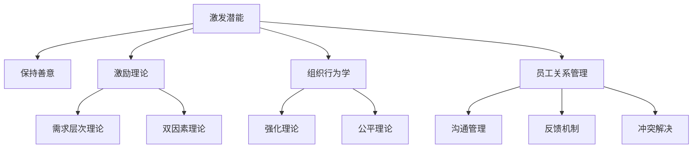

                 

# 管理的本质：激发潜能与善意

## 1. 背景介绍

### 1.1 问题由来

现代企业管理已成为各行各业竞争的核心要素。然而，随着企业规模的扩大和业务复杂度的提升，传统的管理理念和方式面临诸多挑战。如何激励员工、优化流程、提高效率、降低成本，成为许多企业管理者关注的焦点。特别是在当前全球疫情背景下，企业面临的挑战更加严峻，需要找到更为高效的解决方案。

### 1.2 问题核心关键点

管理学是一门综合性学科，涉及经济学、心理学、社会学等多个领域。本节将探讨管理学的核心概念与方法，强调激发员工潜能和保持善意的管理理念。

- **激发潜能**：通过科学的管理手段，挖掘员工潜力，提升工作效率，实现个人和组织价值的最大化。
- **保持善意**：在管理过程中，营造良好的企业文化和人际关系，促进员工的幸福感和归属感。

### 1.3 问题研究意义

研究管理的本质，特别是如何激发员工潜能和保持善意，对于提升企业的竞争力、促进员工个人成长、构建和谐的企业文化具有重要意义：

1. **提升企业竞争力**：高效的员工管理能够增强企业的创新能力和市场响应速度，增强企业竞争力。
2. **促进员工成长**：通过激发潜能和保持善意，帮助员工实现职业目标，提高个人工作满意度。
3. **构建企业文化**：良好的企业文化能够提升员工的凝聚力和归属感，形成正向的工作氛围。
4. **降低管理成本**：有效的员工管理可以减少人员流失，提高员工留存率，降低人力资源成本。

## 2. 核心概念与联系

### 2.1 核心概念概述

为更好地理解如何激发潜能与保持善意，本节将介绍几个密切相关的核心概念：

- **激发潜能**：指通过特定的管理手段和策略，发掘员工的内在潜力，提升其工作表现和效率。
- **保持善意**：指在管理过程中，关注员工的心理健康和情感需求，营造积极和谐的工作环境。
- **激励理论**：涉及多种理论模型，如马斯洛需求层次理论、赫茨伯格双因素理论等，用于指导激励策略的设计。
- **组织行为学**：研究个体和群体在组织中的行为模式，强调人的行为动因和影响因素。
- **员工关系管理**：通过沟通、反馈、冲突管理等方式，改善员工关系，提高团队协作效率。

这些核心概念共同构成了企业管理的基础，为激发潜能和保持善意提供了理论和方法指导。

### 2.2 概念间的关系

这些核心概念之间存在着紧密的联系，形成了企业管理的多维视角。

- **激发潜能**与**保持善意**：两者相辅相成，激发潜能依赖于员工的幸福感和归属感，而保持善意则促进潜能的进一步挖掘和发挥。
- **激励理论**与**组织行为学**：激励理论提供了员工行为动因的理论基础，而组织行为学研究了这些动因在实际工作环境中的应用和影响。
- **员工关系管理**：通过对员工关系的管理，可以增强员工的信任和忠诚度，为激发潜能和保持善意创造良好条件。

这些概念之间的关系可以通过以下Mermaid流程图来展示：



这个流程图展示了几大核心概念之间的相互关系和作用路径。

### 2.3 核心概念的整体架构

最后，我们用一个综合的流程图来展示这些核心概念在大企业管理中的整体架构：

```mermaid
graph TB
    A[员工] --> B[激发潜能]
    A --> C[保持善意]
    B --> D[激励措施]
    C --> E[员工福利]
    B --> F[培训与发展]
    C --> G[心理健康]
    D --> H[绩效管理]
    D --> I[薪酬体系]
    E --> J[职业规划]
    F --> K[创新激励]
    G --> L[工作环境]
    H --> M[目标设定]
    I --> N[成本控制]
    J --> O[晋升机制]
    K --> P[项目激励]
    L --> Q[职业满意度]
    M --> R[绩效反馈]
    N --> S[绩效考核]
    O --> T[员工留存]
    P --> U[团队协作]
    Q --> V[员工忠诚]
    R --> W[改进措施]
    S --> X[持续改进]
    T --> Y[业务绩效]
    U --> Z[协作效率]
    W --> AA[文化建设]
    X --> AB[持续发展]
    Y --> AC[市场响应]
    Z --> AD[创新能力]
    AA --> AE[文化认同]
    AB --> AF[文化活力]
    AC --> AG[文化竞争力]
    AD --> AH[文化创新]
    AE --> AI[文化影响力]
    AF --> AJ[文化包容]
    AG --> AK[文化凝聚]
    AH --> AL[文化创造]
    AI --> AM[文化品牌]
    AJ --> AN[文化差异]
    AK --> AO[文化传承]
    AL --> AP[文化融合]
    AM --> AQ[文化增值]
    AN --> AR[文化增值]
    AO --> AS[文化传承]
    AP --> AT[文化创造]
    AQ --> AU[文化增值]
    AR --> AV[文化增值]
    AS --> AW[文化传承]
    AT --> AX[文化创造]
    AU --> AY[文化增值]
    AV --> AZ[文化增值]
    AW --> BA[文化品牌]
    AX --> BB[文化创新]
    AY --> BC[文化竞争力]
    AZ --> BD[文化包容]
    BA --> BE[文化认同]
    BB --> BF[文化活力]
    BC --> BG[文化凝聚]
    BD --> BH[文化差异]
    BE --> BI[文化品牌]
    BF --> BJ[文化创新]
    BG --> BK[文化竞争力]
    BH --> BL[文化包容]
    BI --> BM[文化品牌]
    BJ --> BN[文化创新]
    BK --> BO[文化竞争力]
    BL --> BP[文化包容]
    BM --> BQ[文化品牌]
    BN --> BR[文化创新]
    BO --> BS[文化竞争力]
    BP --> BT[文化包容]
    BQ --> BU[文化品牌]
    BR --> BV[文化创新]
    BS --> BW[文化竞争力]
    BT --> BX[文化包容]
    BU --> BY[文化品牌]
    BV --> BZ[文化创新]
    BW --> CA[文化创造]
    BX --> CB[文化融合]
    BY --> CC[文化增值]
    BZ --> CD[文化增值]
    CA --> CE[文化传承]
    CB --> CF[文化融合]
    CC --> CG[文化增值]
    CD --> CH[文化增值]
    CE --> CI[文化传承]
    CF --> CJ[文化融合]
    CG --> CK[文化增值]
    CH --> CL[文化增值]
    CI --> CM[文化传承]
    CJ --> CN[文化融合]
    CK --> CO[文化增值]
    CL --> CM[文化传承]
    CM --> CN[文化融合]
    CN --> CO[文化增值]
    CO --> CP[文化传承]
    CP --> CQ[文化融合]
    CQ --> CR[文化增值]
    CR --> CS[文化增值]
    CP --> CT[文化传承]
    CQ --> CU[文化融合]
    CR --> CV[文化增值]
    CS --> CW[文化增值]
    CT --> CZ[文化传承]
    CU --> CV[文化融合]
    CV --> CZ[文化增值]
    CW --> DX[文化创造]
    CZ --> DA[文化包容]
    DX --> DB[文化品牌]
    DA --> DC[文化认同]
    DB --> DD[文化活力]
    DC --> DE[文化凝聚]
    DD --> DF[文化差异]
    DE --> DG[文化包容]
    DF --> DH[文化创新]
    DG --> DI[文化品牌]
    DH --> DJ[文化创新]
    DI --> DK[文化竞争力]
    DJ --> DL[文化包容]
    DK --> DM[文化活力]
    DL --> DN[文化差异]
    DM --> DO[文化凝聚]
    DN --> DP[文化包容]
    DO --> DQ[文化差异]
    DP --> DR[文化包容]
    DQ --> DS[文化差异]
    DR --> DT[文化包容]
    DS --> DU[文化活力]
    DT --> DV[文化差异]
    DU --> DW[文化凝聚]
    DV --> DX[文化创新]
    DW --> DY[文化竞争力]
    DX --> DZ[文化包容]
    DY --> DB[文化认同]
    DZ --> EK[文化创造]
    EK --> EL[文化增值]
    EL --> EM[文化增值]
    EM --> EN[文化增值]
    EN --> EOS[文化增值]
    EOS --> EO[文化增值]
    EO --> EP[文化增值]
    EP --> EQ[文化增值]
    EQ --> ER[文化增值]
    ER --> ES[文化增值]
    ES --> ET[文化增值]
    ET --> EU[文化增值]
    EU --> EV[文化增值]
    EV --> EW[文化增值]
    EW --> EX[文化增值]
    EX --> EY[文化增值]
    EY --> EZ[文化增值]
    EZ --> FA[文化增值]
    FA --> FB[文化增值]
    FB --> FC[文化增值]
    FC --> FD[文化增值]
    FD --> FE[文化增值]
    FE --> FF[文化增值]
    FF --> FG[文化增值]
    FG --> FH[文化增值]
    FH --> FI[文化增值]
    FI --> FJ[文化增值]
    FJ --> FK[文化增值]
    FK --> FL[文化增值]
    FL --> FM[文化增值]
    FM --> FN[文化增值]
    FN --> FO[文化增值]
    FO --> FP[文化增值]
    FP --> FQ[文化增值]
    FQ --> FR[文化增值]
    FR --> FS[文化增值]
    FS --> FT[文化增值]
    FT --> FU[文化增值]
    FU --> FV[文化增值]
    FV --> FW[文化增值]
    FW --> FX[文化增值]
    FX --> FY[文化增值]
    FY --> FZ[文化增值]
    FZ --> GA[文化增值]
    GA --> GB[文化增值]
    GB --> GC[文化增值]
    GC --> GD[文化增值]
    GD --> GE[文化增值]
    GE --> GF[文化增值]
    GF --> GG[文化增值]
    GG --> GH[文化增值]
    GH --> GI[文化增值]
    GI --> GJ[文化增值]
    GJ --> GK[文化增值]
    GK --> GL[文化增值]
    GL --> GM[文化增值]
    GM --> GN[文化增值]
    GN --> GO[文化增值]
    GO --> GP[文化增值]
    GP --> GQ[文化增值]
    GQ --> GR[文化增值]
    GR --> GS[文化增值]
    GS --> GT[文化增值]
    GT --> GU[文化增值]
    GU --> GV[文化增值]
    GV --> GW[文化增值]
    GW --> GX[文化增值]
    GX --> GY[文化增值]
    GY --> GZ[文化增值]
    GZ --> HA[文化增值]
    HA --> HB[文化增值]
    HB --> HC[文化增值]
    HC --> HD[文化增值]
    HD --> HE[文化增值]
    HE --> HF[文化增值]
    HF --> HG[文化增值]
    HG --> HH[文化增值]
    HH --> HI[文化增值]
    HI --> HJ[文化增值]
    HJ --> HK[文化增值]
    HK --> HL[文化增值]
    HL --> HM[文化增值]
    HM --> HN[文化增值]
    HN --> HO[文化增值]
    HO --> HP[文化增值]
    HP --> HQ[文化增值]
    HQ --> HR[文化增值]
    HR --> HS[文化增值]
    HS --> HT[文化增值]
    HT --> HU[文化增值]
    HU --> HV[文化增值]
    HV --> HW[文化增值]
    HW --> HX[文化增值]
    HX --> HY[文化增值]
    HY --> HZ[文化增值]
    HZ --> IA[文化增值]
    IA --> IB[文化增值]
    IB --> IC[文化增值]
    IC --> ID[文化增值]
    ID --> IE[文化增值]
    IE --> IF[文化增值]
    IF --> IG[文化增值]
    IG --> IH[文化增值]
    IH --> II[文化增值]
    II --> IJ[文化增值]
    IJ --> IK[文化增值]
    IK --> IL[文化增值]
    IL --> IM[文化增值]
    IM --> IN[文化增值]
    IN --> IO[文化增值]
    IO --> IP[文化增值]
    IP --> IQ[文化增值]
    IQ --> IR[文化增值]
    IR --> IS[文化增值]
    IS --> IT[文化增值]
    IT --> IU[文化增值]
    IU --> IV[文化增值]
    IV --> IW[文化增值]
    IW --> IX[文化增值]
    IX --> IY[文化增值]
    IY --> IZ[文化增值]
    IZ --> JA[文化增值]
    JA --> JB[文化增值]
    JB --> JC[文化增值]
    JC --> JD[文化增值]
    JD -->JE[文化增值]
    JE --> JF[文化增值]
    JF --> JG[文化增值]
    JG --> JH[文化增值]
    JH --> JI[文化增值]
    JI --> JJ[文化增值]
    JJ --> JK[文化增值]
    JK --> JL[文化增值]
    JL --> JM[文化增值]
    JM --> JN[文化增值]
    JN --> JO[文化增值]
    JO --> JP[文化增值]
    JP --> JQ[文化增值]
    JQ --> JR[文化增值]
    JR --> JS[文化增值]
    JS --> JT[文化增值]
    JT --> JU[文化增值]
    JU --> JV[文化增值]
    JV --> JW[文化增值]
    JW --> JX[文化增值]
    JX --> JY[文化增值]
    JY --> JZ[文化增值]
    JZ --> KA[文化增值]
    KA --> KB[文化增值]
    KB --> KC[文化增值]
    KC --> KD[文化增值]
    KD --> KE[文化增值]
    KE --> KF[文化增值]
    KF --> KG[文化增值]
    KG --> KH[文化增值]
    KH --> KI[文化增值]
    KI --> KJ[文化增值]
    KJ --> KK[文化增值]
    KK --> KL[文化增值]
    KL --> KM[文化增值]
    KM --> KN[文化增值]
    KN --> KO[文化增值]
    KO --> KP[文化增值]
    KP --> KQ[文化增值]
    KQ --> KR[文化增值]
    KR --> KS[文化增值]
    KS --> KT[文化增值]
    KT --> KU[文化增值]
    KU --> KV[文化增值]
    KV --> KW[文化增值]
    KW --> KX[文化增值]
    KX --> KY[文化增值]
    KY --> KZ[文化增值]
    KZ --> LA[文化增值]
    LA --> LB[文化增值]
    LB --> LC[文化增值]
    LC --> LD[文化增值]
    LD --> LE[文化增值]
    LE --> LF[文化增值]
    LF --> LG[文化增值]
    LG --> LH[文化增值]
    LH --> LI[文化增值]
    LI --> LJ[文化增值]
    LJ --> LK[文化增值]
    LK --> LL[文化增值]
    LL --> LM[文化增值]
    LM --> LN[文化增值]
    LN --> LO[文化增值]
    LO --> LP[文化增值]
    LP --> LQ[文化增值]
    LQ --> LR[文化增值]
    LR --> LS[文化增值]
    LS --> LT[文化增值]
    LT --> LU[文化增值]
    LU --> LV[文化增值]
    LV --> LW[文化增值]
    LW --> LX[文化增值]
    LX --> LY[文化增值]
    LY --> LZ[文化增值]
    LZ --> MA[文化增值]
    MA --> MB[文化增值]
    MB --> MC[文化增值]
    MC --> MD[文化增值]
    MD --> ME[文化增值]
    ME --> MF[文化增值]
    MF --> MG[文化增值]
    MG --> MH[文化增值]
    MH --> MI[文化增值]
    MI --> MJ[文化增值]
    MJ --> MK[文化增值]
    MK --> ML[文化增值]
    ML --> MM[文化增值]
    MM --> MN[文化增值]
    MN --> MO[文化增值]
    MO --> MP[文化增值]
    MP --> MQ[文化增值]
    MQ --> MR[文化增值]
    MR --> MS[文化增值]
    MS --> MT[文化增值]
    MT --> MU[文化增值]
    MU --> MV[文化增值]
    MV --> MW[文化增值]
    MW --> MX[文化增值]
    MX --> MY[文化增值]
    MY --> MZ[文化增值]
    MZ --> NA[文化增值]
    NA --> NB[文化增值]
    NB --> NC[文化增值]
    NC --> ND[文化增值]
    ND --> NE[文化增值]
    NE --> NF[文化增值]
    NF --> NG[文化增值]
    NG --> NH[文化增值]
    NH --> NI[文化增值]
    NI --> NJ[文化增值]
    NJ --> NK[文化增值]
    NK --> NL[文化增值]
    NL --> NM[文化增值]
    NM --> NN[文化增值]
    NN --> NO[文化增值]
    NO --> NP[文化增值]
    NP --> NQ[文化增值]
    NQ --> NR[文化增值]
    NR --> NS[文化增值]
    NS --> NT[文化增值]
    NT --> NU[文化增值]
    NU --> NV[文化增值]
    NV --> NW[文化增值]
    NW --> NX[文化增值]
    NX --> NY[文化增值]
    NY --> NZ[文化增值]
    NZ --> OA[文化增值]
    OA --> OB[文化增值]
    OB --> OC[文化增值]
    OC --> OD[文化增值]
    OD --> OE[文化增值]
    OE --> OF[文化增值]
    OF --> OG[文化增值]
    OG --> OH[文化增值]
    OH --> OI[文化增值]
    OI --> OJ[文化增值]
    OJ --> OK[文化增值]
    OK --> OL[文化增值]
    OL --> OM[文化增值]
    OM --> ON[文化增值]
    ON --> OP[文化增值]
    OP --> OQ[文化增值]
    OQ --> OR[文化增值]
    OR --> OS[文化增值]
    OS --> OT[文化增值]
    OT --> OU[文化增值]
    OU -->OV[文化增值]
    OV --> OW[文化增值]
    OW --> OX[文化增值]
    OX --> OY[文化增值]
    OY --> OZ[文化增值]
    OZ --> PA[文化增值]
    PA --> PB[文化增值]
    PB --> PC[文化增值]
    PC --> PD[文化增值]
    PD --> PE[文化增值]
    PE --> PF[文化增值]
    PF --> PG[文化增值]
    PG --> PH[文化增值]
    PH --> PI[文化增值]
    PI --> PJ[文化增值]
    PJ --> PK[文化增值]
    PK --> PL[文化增值]
    PL --> PM[文化增值]
    PM --> PN[文化增值]
    PN --> PO[文化增值]
    PO --> PP[文化增值]
    PP --> PQ[文化增值]
    PQ --> PR[文化增值]
    PR --> PS[文化增值]
    PS --> PT[文化增值]
    PT -->PU[文化增值]
    PU --> PV[文化增值]
    PV --> PW[文化增值]
    PW --> PX[文化增值]
    PX --> PY[文化增值]
    PY --> PZ[文化增值]
    PZ --> QA[文化增值]
    QA --> QB[文化增值]
    QB --> QC[文化增值]
    QC --> QD[文化增值]
    QD --> QE[文化增值]
    QE --> QF[文化增值]
    QF --> QG[文化增值]
    QG --> QH[文化增值]
    QH --> QI[文化增值]
    QI --> QJ[文化增值]
    QJ --> QK[文化增值]
    QK --> QL[文化增值]
    QL --> QM[文化增值]
    QM --> QN[文化增值]
    QN --> QO[文化增值]
    QO --> QP[文化增值]
    QP --> QQ[文化增值]
    QQ --> QR[文化增值]
    QR --> QS[文化增值]
    QS --> QT[文化增值]
    QT --> QU[文化增值]
    QU --> QV[文化增值]
    QV --> QW[文化增值]
    QW --> QX[文化增值]
    QX --> QY[文化增值]
    QY --> QZ[文化增值]
    QZ --> RA[文化增值]
    RA --> RB[文化增值]
    RB --> RC[文化增值]
    RC --> RD[文化增值]
    RD --> RE[文化增值]
    RE --> RF[文化增值]
    RF --> RG[文化增值]
    RG --> RH[文化增值]
    RH --> RI[文化增值]
    RI --> RJ[文化增值]
    RJ --> RK[文化增值]
    RK --> RL[文化增值]
    RL --> RM[文化增值]
    RM --> RN[文化增值]
    RN --> RO[文化增值]
    RO --> RP[文化增值]
    RP --> RQ[文化增值]
    RQ --> RR[文化增值]
    RR --> RS[文化增值]
    RS --> RT[文化增值]
    RT --> RU[文化增值]
    RU --> RV[文化增值]
    RV --> RW[文化增值]
    RW --> RX[文化增值]
    RX --> RY[文化增值]
    RY --> RZ[文化增值]
    RZ --> SA[文化增值]
    SA --> SB[文化增值]
    SB --> SC[文化增值]
    SC --> SD[文化增值]
    SD --> SE[文化增值]
    SE --> SF[文化增值]
    SF --> SG[文化增值]
    SG --> SH[文化增值]
    SH --> SI[文化增值]
    SI --> SJ[文化增值]
    SJ --> SK[文化增值]
    SK --> SL[文化增值]
    SL --> SM[文化增值]
    SM --> SN[文化增值]
    SN --> SO[文化增值]
    SO --> SP[文化增值]
    SP --> SQ[文化增值]
    SQ --> SR[文化增值]
    SR --> SS[文化增值]
    SS --> ST[文化增值]
    ST --> SU[文化增值]
    SU --> SV[文化增值]
    SV --> SW[文化增值]
    SW --> SX[文化增值]
    SX --> SY[文化增值]
    SY --> SZ[文化增值]
    SZ --> TA[文化增值]
    TA --> TB[文化增值]
    TB --> TC[文化增值]
    TC --> TD[文化增值]
    TD --> TE[文化增值]
    TE --> TF[文化增值]
    TF --> TG[文化增值]
    TG --> TH[文化增值]
    TH --> TI[文化增值]
    TI --> TJ[文化增值]
    TJ --> TK[文化增值]
    TK --> TL[文化增值]
    TL --> TM[文化增值]
    TM --> TN[文化增值]
    TN --> TO[文化增值]
    TO --> TP[文化增值]
    TP --> TQ[文化增值]
    TQ --> TR[文化增值]
    TR --> TS[文化增值]
    TS --> TT[文化增值]
    TT --> TU[文化增值]
    TU --> TV[文化增值]
    TV --> TW[文化增值]
    TW --> TX[文化增值]
    TX --> TY[文化增值]
    TY --> TZ[文化增值]
    TZ --> UA[文化增值]
    UA --> UB[文化增值]
    UB --> UC[文化增值]
    UC --> UD[文化增值]
    UD --> UE[文化增值]
    UE --> UF[文化增值]
    UF --> UG[文化增值]
    UG --> UH[文化增值]
    UH --> UI[文化增值]
    UI --> UJ[文化增值]
    UJ --> UK[文化增值]
    UK --> UL[文化增值]
    UL --> UM[文化增值]
    UM --> UN[文化增值]
    UN --> UO[文化增值]
    UO --> UP[文化增值]
    UP --> UQ[文化增值]
    UQ --> UR[文化增值]
    UR --> US[文化增值]
    US --> UT[文化增值]
    UT --> UU[文化增值]
    UU --> UV[文化增值]
    UV --> UW[文化增值]
    UW --> UX[文化增值]
    UX --> UY[文化增值]
    UY --> UZ[文化增值]
    UZ --> VA[文化增值]
    VA --> VB[文化增值]
    VB --> VC[文化增值]
    VC --> VD[文化增值]
    VD --> VE[文化增值]
    VE --> VF[文化增值]
    VF --> VG[文化增值]
    VG --> VH[文化增值]
    VH --> VI[文化增值]
    VI --> VJ[文化增值]
    VJ --> VK[文化增值]
    VK --> VL[文化增值]
    VL --> VM[文化增值]
    VM --> VN[文化增值]
    VN --> VO[文化增值]
    VO --> VP[文化增值]
    VP --> VQ[文化增值]
    VQ --> VR[文化增值]
    VR --> VS[文化增值]
    VS --> VT[文化增值]
    VT --> VU[文化增值]
    VU --> VV[文化增值]
    V

