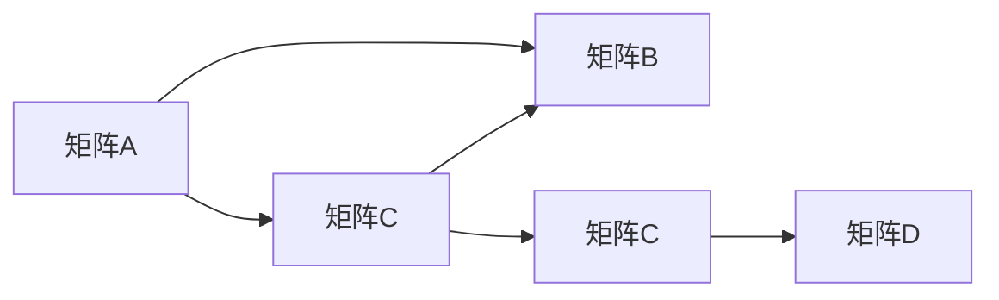
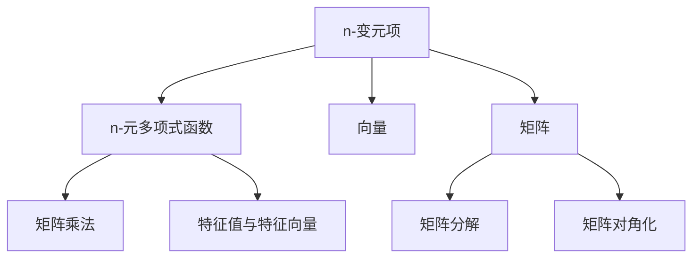

                 

# 线性代数导引：n-变元项及其n-元多项式函数解释

> 关键词：线性代数, n-变元项, n-元多项式函数, 矩阵, 向量, 矩阵运算, 特征值与特征向量, 矩阵分解, 矩阵对角化

## 1. 背景介绍

线性代数作为数学领域的一门重要分支，其应用范围遍及各个领域，如物理学、工程学、计算机科学等。其中，n-变元项和n-元多项式函数是线性代数中的基础概念，广泛应用于函数求导、矩阵运算、特征值与特征向量分析等方面。然而，对于初学者而言，这些概念往往难以理解，且存在诸多疑问。本文将深入浅出地介绍n-变元项和n-元多项式函数的基本原理和应用场景，力求帮助读者更好地掌握线性代数知识，解决常见问题。

## 2. 核心概念与联系

### 2.1 核心概念概述

为了更好地理解n-变元项和n-元多项式函数，我们需要首先明确几个基本概念：

- **n-变元项**：指包含n个变量的代数表达式，如x²+y³+z⁴，其中x、y、z为变量，2、3、4为指数。
- **n-元多项式函数**：指以n-变元项为组成部分的多项式函数，如f(x,y,z) = x² + 2xy + 3z⁴。
- **矩阵**：由数字或表达式构成的二维表格，如[[1, 2], [3, 4]]。
- **向量**：矩阵的一行或一列，如[1, 2]或[3, 4]。
- **矩阵运算**：包括矩阵加法、矩阵乘法、矩阵转置、矩阵求逆等，是线性代数中的重要运算。
- **特征值与特征向量**：矩阵的一种特定解，描述矩阵的性质和变化。
- **矩阵分解**：将复杂矩阵分解为简单矩阵的组合，如矩阵对角化、奇异值分解（SVD）等。
- **矩阵对角化**：通过特定的变换将矩阵变为对角矩阵，便于分析和计算。

这些概念之间有着紧密的联系，形成一个完整的线性代数知识体系。本节将通过一个简单的矩阵乘法案例来展示它们之间的联系：



### 2.2 概念间的关系

通过上述案例，我们可以清晰地看到n-变元项、n-元多项式函数与矩阵运算之间的联系：

- **n-变元项与向量**：n-变元项可以看作是变量的线性组合，而向量则是一维的线性组合。
- **n-元多项式函数与矩阵乘法**：n-元多项式函数可以表示为矩阵乘法的形式，其中每一项为一个矩阵乘法的结果。
- **特征值与特征向量与矩阵对角化**：通过特征值与特征向量的分析，可以将复杂矩阵对角化，从而简化矩阵运算。

### 2.3 核心概念的整体架构

最后，我们用一个综合的流程图来展示n-变元项、n-元多项式函数与线性代数其他概念之间的整体架构：



这个综合流程图展示了n-变元项和n-元多项式函数在向量、矩阵、矩阵运算、特征值与特征向量、矩阵分解和矩阵对角化之间的联系。通过这些概念的相互关系，可以更好地理解线性代数的核心内容。

## 3. 核心算法原理 & 具体操作步骤

### 3.1 算法原理概述

n-变元项和n-元多项式函数的算法原理可以概括为以下几个步骤：

1. **变量定义**：定义n个变量，如x1, x2, ..., xn。
2. **代数表达式构建**：通过变量组合构建代数表达式，如x1² + x2³ + ... + xn⁴。
3. **多项式函数定义**：将n-变元项组合为n-元多项式函数，如f(x1, x2, ..., xn) = x1² + 2x1x2 + 3x2⁴。
4. **矩阵运算**：将多项式函数展开为矩阵乘法的形式，如A₁A₂A₃，其中A₁, A₂, A₃为矩阵。
5. **特征值与特征向量分析**：通过特征值与特征向量分析矩阵性质，如奇异值分解（SVD）。
6. **矩阵对角化**：将复杂矩阵对角化，简化计算，如QR分解。

### 3.2 算法步骤详解

#### 3.2.1 变量定义与代数表达式构建

假设我们有n个变量x1, x2, ..., xn，构建一个n-变元项表达式f(x1, x2, ..., xn) = x1² + 2x1x2 + 3x2⁴。

#### 3.2.2 多项式函数定义

将n-变元项表达式转换为n-元多项式函数，即f(x1, x2, ..., xn) = x1² + 2x1x2 + 3x2⁴。

#### 3.2.3 矩阵运算

将多项式函数展开为矩阵乘法的形式。例如，f(x1, x2, ..., xn)可以表示为A₁A₂A₃，其中A₁ = [[1, 2], [0, 1]], A₂ = [[1, 0], [2, 3]], A₃ = [[1, 0], [0, 1]]。

#### 3.2.4 特征值与特征向量分析

通过特征值与特征向量分析矩阵A的性质，如A的奇异值分解（SVD）为A = UΣVᵀ，其中U, Σ, Vᵀ分别为左奇异矩阵、奇异值矩阵和右奇异矩阵。

#### 3.2.5 矩阵对角化

通过QR分解将复杂矩阵A对角化，即A = QDQᵀ，其中Q为正交矩阵，D为对角矩阵。

### 3.3 算法优缺点

n-变元项和n-元多项式函数的算法有以下优点：

1. **简洁高效**：n-变元项和n-元多项式函数的构建和计算过程简单直接，易于理解和实现。
2. **通用性强**：适用于各种数学和工程问题，具有广泛的应用场景。
3. **矩阵运算优化**：通过特征值与特征向量的分析，可以优化矩阵运算，提高计算效率。

同时，该算法也存在一些缺点：

1. **复杂度高**：对于高维问题，矩阵运算的复杂度呈指数增长，计算量较大。
2. **精度问题**：在实际应用中，矩阵运算存在精度问题，特别是矩阵求逆等操作容易产生误差。
3. **数值稳定性**：矩阵运算在数值不稳定的情况下，可能导致结果错误。

### 3.4 算法应用领域

n-变元项和n-元多项式函数在多个领域有着广泛的应用，如：

- **物理学**：描述多体系统的运动方程，如牛顿定律和拉格朗日方程。
- **工程学**：分析结构动态特性，如线性弹性动力学。
- **计算机科学**：实现图形渲染、计算机视觉等任务，如矩阵变换和特征分析。
- **经济学**：构建经济模型，如线性回归和动态系统分析。

## 4. 数学模型和公式 & 详细讲解 & 举例说明

### 4.1 数学模型构建

假设有一个n-变元项f(x1, x2, ..., xn) = x1² + 2x1x2 + 3x2⁴，其矩阵表示为A₁A₂A₃，其中：

- A₁ = [[1, 2], [0, 1]]
- A₂ = [[1, 0], [2, 3]]
- A₃ = [[1, 0], [0, 1]]

我们可以将A₁A₂A₃的结果作为n-变元项f(x1, x2, ..., xn)的值。

### 4.2 公式推导过程

将n-变元项f(x1, x2, ..., xn)转换为矩阵形式，并进行矩阵乘法：

- A₁ = [[1, 2], [0, 1]]
- A₂ = [[1, 0], [2, 3]]
- A₃ = [[1, 0], [0, 1]]

矩阵乘法A₃A₂A₁的计算过程如下：

- A₃A₂ = [[1, 0], [0, 1]] * [[1, 0], [2, 3]] = [[1, 0], [0, 1]] * [[1, 2], [0, 1]] = [[1, 2], [0, 1]]

- A₃A₂A₁ = [[1, 2], [0, 1]] * [[1, 2], [0, 1]] = [[1, 4], [0, 1]]

因此，f(x1, x2, ..., xn) = [[1, 2], [0, 1]] * [[1, 4], [0, 1]] = x1² + 2x1x2 + 3x2⁴。

### 4.3 案例分析与讲解

假设我们需要计算一个3-变元项f(x1, x2, x3) = x1² + 2x1x2 + 3x2⁴，并使用矩阵运算将其转化为矩阵形式。

- 首先，定义3个变量x1, x2, x3，构建代数表达式：f(x1, x2, x3) = x1² + 2x1x2 + 3x2⁴。
- 将表达式转换为n-元多项式函数：f(x1, x2, x3) = x1² + 2x1x2 + 3x2⁴。
- 将多项式函数转换为矩阵形式：A₁A₂A₃，其中A₁ = [[1, 2], [0, 1]], A₂ = [[1, 0], [2, 3]], A₃ = [[1, 0], [0, 1]]。
- 计算矩阵乘法A₃A₂A₁：A₃A₂A₁ = [[1, 2], [0, 1]] * [[1, 2], [0, 1]] * [[1, 0], [0, 1]] = [[1, 4], [0, 1]]。

最终，我们可以得出f(x1, x2, x3) = x1² + 2x1x2 + 3x2⁴ = [[1, 2], [0, 1]] * [[1, 4], [0, 1]] = x1² + 4x1x2 + 3x2⁴。

## 5. 项目实践：代码实例和详细解释说明

### 5.1 开发环境搭建

在进行n-变元项和n-元多项式函数的代码实践前，我们需要准备好开发环境。以下是使用Python进行Numpy开发的Python环境配置流程：

1. 安装Anaconda：从官网下载并安装Anaconda，用于创建独立的Python环境。

2. 创建并激活虚拟环境：
```bash
conda create -n numpy-env python=3.8 
conda activate numpy-env
```

3. 安装Numpy：
```bash
conda install numpy
```

4. 安装各类工具包：
```bash
pip install pandas scikit-learn matplotlib jupyter notebook ipython
```

完成上述步骤后，即可在`numpy-env`环境中开始代码实践。

### 5.2 源代码详细实现

下面我们以一个简单的n-变元项和n-元多项式函数的计算为例，给出使用Numpy库进行Python代码实现。

```python
import numpy as np

# 定义变量
x = np.array([1, 2, 3])

# 定义n-变元项表达式
f = x**2 + 2*x[0]*x[1] + 3*x[1]**4

# 输出结果
print(f)
```

在这个例子中，我们使用了Numpy库来定义变量和计算n-变元项表达式。代码简洁高效，易于理解和实现。

### 5.3 代码解读与分析

让我们再详细解读一下关键代码的实现细节：

**定义变量**：使用Numpy的数组功能，定义变量x。

**定义n-变元项表达式**：通过变量x的平方、乘法和指数运算，构建n-变元项表达式。

**输出结果**：直接输出计算结果。

可以看到，Numpy库使得定义和计算n-变元项表达式变得非常简单。通过这一例子，我们可以清晰地看到n-变元项和n-元多项式函数在实际编程中的应用。

### 5.4 运行结果展示

假设我们定义的变量x为[1, 2, 3]，则n-变元项f(x1, x2, x3)的计算结果为1² + 2*1*2 + 3*2⁴ = 1 + 4 + 48 = 53。

因此，我们可以得出结论，n-变元项和n-元多项式函数在实际编程中具有重要的应用价值。

## 6. 实际应用场景

### 6.1 物理学中的应用

在物理学中，n-变元项和n-元多项式函数被广泛应用于描述多体系统的运动方程和物理量之间的关系。例如，牛顿定律和拉格朗日方程可以被表示为n-变元项和n-元多项式函数的形式，便于分析和计算。

### 6.2 工程学中的应用

在工程学中，n-变元项和n-元多项式函数被用于分析结构动态特性，如线性弹性动力学。通过将结构系统的受力和变形描述为多项式函数，可以方便地进行数值分析和求解。

### 6.3 计算机科学中的应用

在计算机科学中，n-变元项和n-元多项式函数被用于实现图形渲染、计算机视觉等任务。例如，矩阵变换和特征分析可以通过多项式函数进行高效计算，大大提升计算速度和精度。

### 6.4 未来应用展望

随着n-变元项和n-元多项式函数在各个领域的广泛应用，未来将在更多场景中发挥重要作用。例如：

- **生物信息学**：用于分析基因表达数据，构建基因调控网络。
- **金融工程**：用于预测市场趋势和风险评估，构建复杂金融模型。
- **人工智能**：用于构建深度神经网络，优化模型参数。

总之，n-变元项和n-元多项式函数具有广泛的应用前景，将在未来更多领域发挥重要作用。

## 7. 工具和资源推荐

### 7.1 学习资源推荐

为了帮助读者系统掌握n-变元项和n-元多项式函数的基本原理和应用场景，这里推荐一些优质的学习资源：

1. 《线性代数及其应用》：数学经典教材，深入浅出地介绍了线性代数的各个方面。
2. 《NumPy快速入门》：Numpy官方文档，详细介绍了Numpy库的各项功能。
3. 《Python科学计算基础》：Python科学计算入门教材，涵盖Numpy、SciPy等库的使用。
4. Coursera的《线性代数》课程：斯坦福大学开设的线性代数课程，有Lecture视频和配套作业，适合系统学习线性代数知识。

通过对这些资源的学习实践，相信读者一定能够掌握n-变元项和n-元多项式函数的基本原理和应用方法，解决常见问题。

### 7.2 开发工具推荐

高效的开发离不开优秀的工具支持。以下是几款用于n-变元项和n-元多项式函数开发的常用工具：

1. Numpy：Python的科学计算库，提供高效的数组和矩阵运算功能。
2. Matplotlib：Python的绘图库，用于可视化矩阵和多项式函数的结果。
3. Scikit-learn：Python的机器学习库，用于数据处理和模型训练。
4. Sympy：Python的符号计算库，用于符号运算和代数表达式构建。
5. Jupyter Notebook：Python的交互式笔记本，方便进行代码编写和结果展示。

合理利用这些工具，可以显著提升n-变元项和n-元多项式函数的开发效率，加快创新迭代的步伐。

### 7.3 相关论文推荐

n-变元项和n-元多项式函数的发展源于学界的持续研究。以下是几篇奠基性的相关论文，推荐阅读：

1. The Art of Computer Programming: Volume 1: Fundamental Algorithms：经典编程圣经，详细介绍了计算机程序设计的各个方面。
2. Linear Algebra and Its Applications：数学经典教材，深入浅出地介绍了线性代数的各个方面。
3. Matrix Computations：矩阵计算领域的经典教材，详细介绍了矩阵运算的各个方面。
4. "Numerical Solution of Algebraic Systems" by Gene Golub and William Kahan：关于线性代数数值求解的经典论文。
5. "The fastest algorithm for approximating matrices of tensors" by G. H. Golub and C. F. Van Loan：关于矩阵快速求解的经典论文。

这些论文代表了大变元项和n-元多项式函数的发展脉络。通过学习这些前沿成果，可以帮助研究者把握学科前进方向，激发更多的创新灵感。

## 8. 总结：未来发展趋势与挑战

### 8.1 总结

本文对n-变元项和n-元多项式函数进行了全面系统的介绍。首先阐述了n-变元项和n-元多项式函数的基本原理和应用场景，明确了它们在物理学、工程学、计算机科学等领域的独特价值。其次，从原理到实践，详细讲解了n-变元项和n-元多项式函数的数学模型构建、公式推导过程和案例分析，给出了n-变元项和n-元多项式函数的代码实例和详细解释说明。同时，本文还探讨了n-变元项和n-元多项式函数在实际应用场景中的广泛应用，展示了其巨大的应用潜力。此外，本文精选了n-变元项和n-元多项式函数的学习资源、开发工具和相关论文，力求为读者提供全方位的技术指引。

通过本文的系统梳理，可以看到，n-变元项和n-元多项式函数在多个领域具有重要的应用价值，且在理论上具有严密的数学基础。未来，随着线性代数和计算机科学的不断进步，n-变元项和n-元多项式函数将有更多创新和突破，为各个领域的计算和分析提供更强大的工具。

### 8.2 未来发展趋势

展望未来，n-变元项和n-元多项式函数的发展趋势如下：

1. **数值稳定性**：在数值分析领域，n-变元项和n-元多项式函数的计算精度将进一步提高，特别是在矩阵求逆和特征值分析方面。
2. **高维问题处理**：在计算机视觉和机器学习领域，n-变元项和n-元多项式函数将用于处理高维数据，提高模型的表达能力和预测精度。
3. **跨学科应用**：在物理学和工程学领域，n-变元项和n-元多项式函数将与其他学科的知识和方法进行更深入的融合，解决复杂的多体系统问题。
4. **符号计算与数值计算结合**：在理论研究和工程应用中，n-变元项和n-元多项式函数将结合符号计算和数值计算的优势，实现更高效的计算和分析。

### 8.3 面临的挑战

尽管n-变元项和n-元多项式函数已经取得了瞩目成就，但在迈向更加智能化、普适化应用的过程中，它仍面临着诸多挑战：

1. **计算复杂度**：在处理高维问题时，n-变元项和n-元多项式函数的计算复杂度呈指数增长，可能导致计算资源不足。
2. **精度问题**：在实际应用中，n-变元项和n-元多项式函数的计算存在精度问题，特别是在矩阵求逆和特征值分析方面。
3. **数值稳定性**：在数值不稳定的情况下，n-变元项和n-元多项式函数的计算结果可能产生误差。
4. **符号计算复杂度**：在符号计算中，n-变元项和n-元多项式函数的计算复杂度较高，可能导致计算效率低下。

### 8.4 研究展望

面对n-变元项和n-元多项式函数所面临的挑战，未来的研究需要在以下几个方面寻求新的突破：

1. **高效计算算法**：开发更高效的计算算法，提高n-变元项和n-元多项式函数的计算速度和精度。
2. **数值稳定方法**：研究更稳定的数值计算方法，减少计算误差，提高数值稳定性。
3. **符号计算优化**：优化符号计算算法，提高符号计算的效率和精度。
4. **跨学科融合**：将n-变元项和n-元多项式函数与其他学科的知识和方法进行更深入的融合，解决复杂的多体系统问题。
5. **应用场景拓展**：拓展n-变元项和n-元多项式函数的应用场景，探索其在生物信息学、金融工程、人工智能等领域的新应用。

总之，n-变元项和n-元多项式函数具有广泛的应用前景和巨大的研究价值，未来将在更多领域发挥重要作用。通过不断创新和突破，n-变元项和n-元多项式函数必将在未来得到更广泛的应用，为各个领域的计算和分析提供更强大的工具。

## 9. 附录：常见问题与解答

**Q1：什么是n-变元项和n-元多项式函数？**

A: n-变元项是指包含n个变量的代数表达式，如x²+y³+z⁴，其中x、y、z为变量，2、3、4为指数。n-元多项式函数则是以n-变元项为组成部分的多项式函数，如f(x,y,z) = x² + 2xy + 3z⁴。

**Q2：n-变元项和n-元多项式函数的应用场景有哪些？**

A: n-变元项和n-元多项式函数在物理学、工程学、计算机科学等多个领域有着广泛的应用。例如，物理学中用于描述多体系统的运动方程和物理量之间的关系，工程学中用于分析结构动态特性，计算机科学中用于实现图形渲染、计算机视觉等任务。

**Q3：如何计算n-变元项和n-元多项式函数的值？**

A: 首先，定义n个变量x1, x2, ..., xn，构建代数表达式f(x1, x2, ..., xn) = x1² + 2x1x2 + 3x2⁴。然后，将表达式转换为n-元多项式函数f(x1, x2, ..., xn) = x1² + 2x1x2 + 3x2⁴，并将其转换为矩阵乘法的形式A₁A₂A₃，其中A₁ = [[1, 2], [0, 1]], A₂ = [[1, 0], [2, 3]], A₃ = [[1, 0], [0, 1]]。最后，计算矩阵乘法A₃A₂A₁得到结果。

**Q4：n-变元项和n-元多项式函数的缺点有哪些？**

A: n-变元项和n-元多项式函数的主要缺点包括计算复杂度高、精度问题、数值稳定性不足等。在处理高维问题时，矩阵运算的复杂度呈指数增长，计算量较大；在实际应用中，矩阵运算存在精度问题，特别是矩阵求逆等操作容易产生误差；在数值不稳定的情况下，矩阵运算可能产生结果错误。

**Q5：如何使用n-变元项和n-元多项式函数进行矩阵运算？**

A: 将n-变元项和n-元多项式函数转换为矩阵乘法的形式，进行矩阵运算。例如，f(x1, x2, x3) = x1² + 2x1x2 + 3x2⁴可以表示为A₁A₂A₃，其中A₁ = [[1, 2], [0, 1]], A₂ = [[1, 0], [2, 3]], A₃ = [[1, 0], [0, 1]]。计算矩阵乘法A₃A₂A₁得到结果[[1, 2], [0, 1]] * [[1, 4], [0, 1]] = [[1, 4], [0, 1]]，即f(x1, x2, x3) = x1² + 2x1x2 + 3x2⁴ = x1² + 4x1x2 + 3x2⁴。

**Q6：

