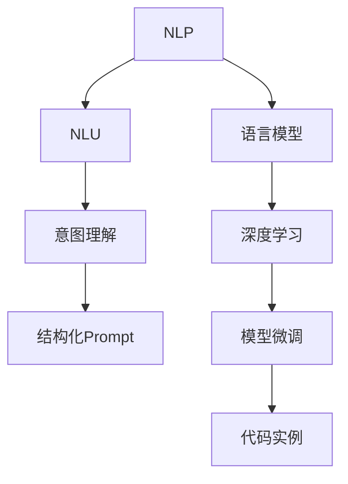
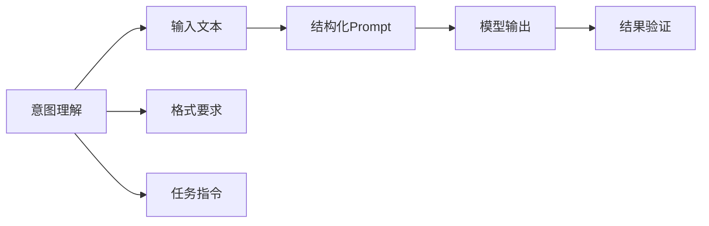
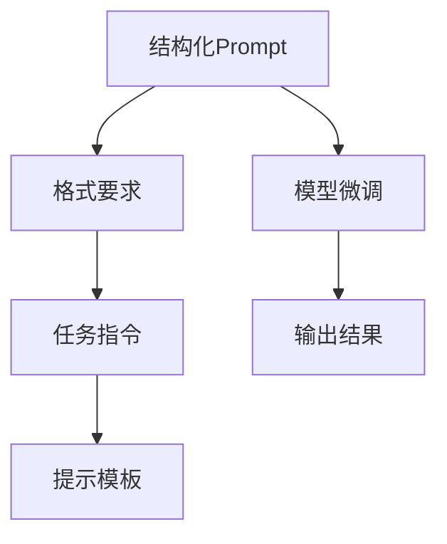
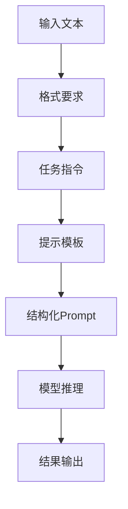
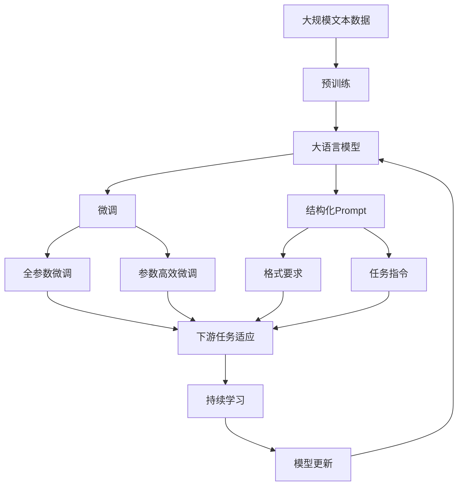

                 

# 结构化Prompt:通过提供清晰的指令和格式要求，帮助AI更准确地捕捉用户的意图

> 关键词：结构化Prompt,自然语言处理(NLP),自然语言理解(NLU),用户意图理解,语言模型,深度学习,模型微调,代码实例

## 1. 背景介绍

### 1.1 问题由来
在自然语言处理(NLP)领域，理解用户意图一直是核心挑战之一。如何准确地将自然语言文本转换为机器可理解的形式，并提取用户的真实需求，是NLP技术的难点所在。传统的方法依赖于手工设计的特征和规则，但难以应对自然语言的多样性和复杂性。近年来，基于深度学习的语言模型取得了突破性进展，能够自动学习语言特征和规律，但仍然难以完美理解用户意图。

针对这一问题，结构化Prompt技术应运而生。结构化Prompt是一种新的自然语言处理技术，通过在输入文本中嵌入特定的格式要求和指令，帮助AI模型更准确地捕捉用户的意图。它通过提供清晰的指令和格式要求，引导模型关注关键的输入信息，从而提高意图理解的质量和准确性。

### 1.2 问题核心关键点
结构化Prompt的核心思想是利用输入文本的格式要求和指令，在模型训练和推理过程中进行意图导向的信息过滤和注意力分配。具体来说，结构化Prompt通过以下几个关键点实现意图理解：

- 明确的输入格式要求：通过指定输入文本的格式要求，如日期、时间、地点等，帮助模型聚焦关键信息。
- 详细的任务指令：通过在输入文本中嵌入任务指令，指导模型执行特定任务。
- 输出格式要求：通过指定输出格式，确保模型输出符合预期。
- 提示模板设计：通过精心设计提示模板，提升模型的理解能力和鲁棒性。

通过这些关键点，结构化Prompt技术可以在不修改模型结构的情况下，显著提升模型在特定任务上的表现。

### 1.3 问题研究意义
结构化Prompt技术对于提升NLP系统的性能和可用性具有重要意义：

1. 提高意图理解准确性：通过结构化Prompt，模型能够更精准地识别和理解用户意图，提高自然语言处理的效果。
2. 减少训练数据需求：结构化Prompt可以在少量标注数据下取得良好效果，降低标注成本和时间。
3. 增强模型泛化能力：结构化Prompt有助于模型从更丰富的输入数据中学习，提升模型的泛化能力和鲁棒性。
4. 提高用户满意度：结构化Prompt使得AI系统更符合用户预期，提升用户体验和满意度。
5. 加速技术落地应用：结构化Prompt技术简单易用，便于大规模部署和推广。

## 2. 核心概念与联系

### 2.1 核心概念概述

为了更好地理解结构化Prompt技术，本节将介绍几个密切相关的核心概念：

- **自然语言处理(NLP)**：研究如何使计算机能够理解、解释和生成人类语言的技术。
- **自然语言理解(NLU)**：NLP的一个分支，专注于将自然语言转换为机器可理解的形式，如实体识别、意图理解等。
- **语言模型**：通过学习大量的文本数据，预测下一个单词或句子的概率分布，用于理解和生成自然语言。
- **深度学习**：一种基于多层神经网络的机器学习方法，在NLP任务中广泛应用。
- **模型微调**：通过在特定任务上调整模型参数，提升模型在该任务上的性能。
- **代码实例**：通过具体的代码实现，展示结构化Prompt技术的实际应用。

这些核心概念之间的逻辑关系可以通过以下Mermaid流程图来展示：

这个流程图展示了结构化Prompt技术与其他核心概念之间的联系：

1. 自然语言处理(NLP)是研究的核心，自然语言理解(NLU)是其中的重要分支。
2. 意图理解是NLU中的关键问题，通过结构化Prompt技术可以显著提升意图理解效果。
3. 语言模型和深度学习是意图理解的基础技术，结构化Prompt技术在此基础上进行提升。
4. 模型微调是优化意图理解效果的重要手段，结构化Prompt技术可以用于特定任务的微调。
5. 代码实例展示了结构化Prompt技术在实际应用中的具体实现。

### 2.2 概念间的关系

这些核心概念之间存在着紧密的联系，形成了结构化Prompt技术的完整生态系统。下面我通过几个Mermaid流程图来展示这些概念之间的关系。

#### 2.2.1 意图理解与结构化Prompt的关系

这个流程图展示了意图理解的过程：

1. 意图理解从输入文本开始。
2. 结构化Prompt通过在输入文本中嵌入格式要求和任务指令，帮助模型更准确地捕捉用户意图。
3. 模型输出结果，并经过结果验证，判断是否符合预期。

#### 2.2.2 结构化Prompt与模型微调的关系

这个流程图展示了结构化Prompt与模型微调的关系：

1. 结构化Prompt通过格式要求和任务指令引导模型执行特定任务。
2. 模型微调优化模型的参数，提升模型在特定任务上的表现。
3. 提示模板设计是结构化Prompt的重要组成部分，有助于提升模型的理解能力和鲁棒性。

#### 2.2.3 结构化Prompt在实际应用中的整体架构

这个综合流程图展示了结构化Prompt在实际应用中的整体架构：

1. 输入文本经过格式要求和任务指令的标注，形成结构化Prompt。
2. 结构化Prompt引导模型进行推理，输出结果。
3. 结果输出经过验证，判断是否符合预期。

### 2.3 核心概念的整体架构

最后，我们用一个综合的流程图来展示这些核心概念在大语言模型微调过程中的整体架构：

这个综合流程图展示了从预训练到微调，再到结构化Prompt应用的完整过程：

1. 大语言模型通过预训练获得基础能力。
2. 微调是对预训练模型进行任务特定的优化，可以分为全参数微调和参数高效微调两种方式。
3. 结构化Prompt通过格式要求和任务指令引导模型执行特定任务。
4. 微调模型在特定任务上表现提升。
5. 持续学习使模型能够不断学习新知识，保持性能。

通过这些流程图，我们可以更清晰地理解结构化Prompt技术在大语言模型微调过程中各个环节的关系和作用，为后续深入讨论具体的微调方法和技术奠定基础。

## 3. 核心算法原理 & 具体操作步骤
### 3.1 算法原理概述

结构化Prompt技术通过在输入文本中嵌入格式要求和任务指令，帮助AI模型更准确地捕捉用户的意图。具体来说，结构化Prompt技术包括以下几个关键步骤：

1. 定义输入文本的格式要求，如日期、时间、地点等。
2. 嵌入任务指令，明确模型需要执行的具体任务。
3. 设计提示模板，指导模型如何处理输入和输出。
4. 在训练和推理过程中，模型根据结构化Prompt进行信息过滤和注意力分配。

形式化地，假设输入文本为 $x$，格式要求为 $s$，任务指令为 $t$，提示模板为 $p$。结构化Prompt定义为 $x_s = s(x) \cdot t(x)$，其中 $s(x)$ 和 $t(x)$ 分别表示对输入文本 $x$ 进行格式要求和任务指令的映射。

在训练过程中，结构化Prompt通过在输入文本中嵌入格式要求和任务指令，引导模型进行信息过滤和注意力分配。具体而言，结构化Prompt技术通过以下方式实现：

- **格式要求**：通过指定输入文本的格式要求，如日期、时间、地点等，帮助模型聚焦关键信息。
- **任务指令**：通过在输入文本中嵌入任务指令，指导模型执行特定任务。
- **提示模板**：通过精心设计提示模板，提升模型的理解能力和鲁棒性。

### 3.2 算法步骤详解

以下是结构化Prompt技术的详细步骤：

**Step 1: 准备输入数据**
- 收集标注有格式要求和任务指令的输入文本数据。
- 将输入文本和对应任务进行对齐，形成结构化Prompt数据集。

**Step 2: 设计提示模板**
- 根据任务需求，设计合适的提示模板。
- 在提示模板中嵌入格式要求和任务指令，确保模型能够准确执行任务。

**Step 3: 优化模型参数**
- 在优化器上使用结构化Prompt数据进行微调。
- 使用适当的损失函数衡量模型输出和格式要求的匹配度。

**Step 4: 评估和调整**
- 在验证集上评估模型性能，根据评估结果调整提示模板和模型参数。
- 重复Step 2到Step 4，直到模型在验证集上表现稳定。

**Step 5: 部署和应用**
- 将微调后的模型部署到实际应用场景中。
- 对新输入文本应用结构化Prompt，进行推理和输出。

### 3.3 算法优缺点

结构化Prompt技术具有以下优点：

1. 简单易用：通过嵌入格式要求和任务指令，使得模型能够更好地理解输入，提升意图理解准确性。
2. 提高泛化能力：通过使用结构化Prompt，模型可以更好地从不同的输入数据中学习，提升泛化能力和鲁棒性。
3. 降低标注成本：结构化Prompt可以在少量标注数据下取得良好效果，减少标注成本和时间。
4. 灵活性高：结构化Prompt可以根据不同任务进行灵活设计，适应各种NLP应用场景。

同时，结构化Prompt技术也存在一些局限性：

1. 需要精心设计提示模板：提示模板的设计对模型的理解能力和鲁棒性至关重要，需要大量试验和优化。
2. 依赖于输入数据质量：输入数据中格式要求和任务指令的准确性直接影响模型的表现。
3. 对模型依赖性强：模型需要具有一定的理解能力和灵活性，才能充分发挥结构化Prompt的优势。

### 3.4 算法应用领域

结构化Prompt技术在多个领域中得到了广泛应用，以下是几个典型的应用场景：

1. **智能客服系统**：在智能客服系统中，通过嵌入任务指令和格式要求，帮助模型更好地理解用户咨询意图，提高回答准确性和用户满意度。
2. **金融舆情监测**：在金融舆情监测系统中，通过结构化Prompt技术，帮助模型快速理解和提取市场舆情信息，提高信息处理效率。
3. **个性化推荐系统**：在个性化推荐系统中，通过结构化Prompt技术，帮助模型理解用户的个性化需求，提升推荐效果。
4. **医疗诊断系统**：在医疗诊断系统中，通过结构化Prompt技术，帮助模型理解医生的诊断指令，提升诊断准确性。
5. **智能会议系统**：在智能会议系统中，通过结构化Prompt技术，帮助模型理解会议内容，提高会议记录和整理的效率。

## 4. 数学模型和公式 & 详细讲解 & 举例说明

### 4.1 数学模型构建

本节将使用数学语言对结构化Prompt技术进行更加严格的刻画。

假设输入文本为 $x$，格式要求为 $s$，任务指令为 $t$，提示模板为 $p$。结构化Prompt定义为 $x_s = s(x) \cdot t(x)$，其中 $s(x)$ 和 $t(x)$ 分别表示对输入文本 $x$ 进行格式要求和任务指令的映射。

在训练过程中，模型使用结构化Prompt数据进行微调。假设模型在输入 $x_s$ 上的输出为 $y_s$，则结构化Prompt技术的目标是最大化 $y_s$ 与 $s(x)$ 的匹配度。具体而言，可以使用如下损失函数：

$$
L = \frac{1}{N} \sum_{i=1}^N ||y_s - s(x_i)||^2
$$

其中 $N$ 为样本数量，$||\cdot||$ 表示欧式距离。

### 4.2 公式推导过程

以下我们以智能客服系统为例，给出结构化Prompt技术的具体实现过程。

假设模型在输入 $x_s$ 上的输出为 $y_s$，其中 $x_s = x + s(x)$，$s(x)$ 表示对输入文本 $x$ 进行格式要求和任务指令的映射。

在训练过程中，模型使用结构化Prompt数据进行微调。假设模型在输入 $x_s$ 上的输出为 $y_s$，则结构化Prompt技术的目标是最大化 $y_s$ 与 $s(x)$ 的匹配度。具体而言，可以使用如下损失函数：

$$
L = \frac{1}{N} \sum_{i=1}^N ||y_s - s(x_i)||^2
$$

其中 $N$ 为样本数量，$||\cdot||$ 表示欧式距离。

在优化器上使用结构化Prompt数据进行微调，具体步骤为：

1. 定义输入文本 $x$ 和格式要求 $s(x)$，并计算结构化Prompt $x_s = x + s(x)$。
2. 嵌入任务指令 $t(x)$，指导模型执行特定任务。
3. 设计提示模板 $p$，引导模型理解输入和输出。
4. 在优化器上使用结构化Prompt数据进行微调，优化模型参数。

假设智能客服系统需要对用户咨询进行意图理解，模型输入为 $x_s = x + s(x)$，输出为 $y_s = y + t(x)$，其中 $s(x)$ 和 $t(x)$ 分别表示对输入文本 $x$ 进行格式要求和任务指令的映射。

在训练过程中，模型使用结构化Prompt数据进行微调。假设模型在输入 $x_s$ 上的输出为 $y_s$，则结构化Prompt技术的目标是最大化 $y_s$ 与 $s(x)$ 的匹配度。具体而言，可以使用如下损失函数：

$$
L = \frac{1}{N} \sum_{i=1}^N ||y_s - s(x_i)||^2
$$

其中 $N$ 为样本数量，$||\cdot||$ 表示欧式距离。

在优化器上使用结构化Prompt数据进行微调，具体步骤为：

1. 定义输入文本 $x$ 和格式要求 $s(x)$，并计算结构化Prompt $x_s = x + s(x)$。
2. 嵌入任务指令 $t(x)$，指导模型执行特定任务。
3. 设计提示模板 $p$，引导模型理解输入和输出。
4. 在优化器上使用结构化Prompt数据进行微调，优化模型参数。

假设智能客服系统需要对用户咨询进行意图理解，模型输入为 $x_s = x + s(x)$，输出为 $y_s = y + t(x)$，其中 $s(x)$ 和 $t(x)$ 分别表示对输入文本 $x$ 进行格式要求和任务指令的映射。

在训练过程中，模型使用结构化Prompt数据进行微调。假设模型在输入 $x_s$ 上的输出为 $y_s$，则结构化Prompt技术的目标是最大化 $y_s$ 与 $s(x)$ 的匹配度。具体而言，可以使用如下损失函数：

$$
L = \frac{1}{N} \sum_{i=1}^N ||y_s - s(x_i)||^2
$$

其中 $N$ 为样本数量，$||\cdot||$ 表示欧式距离。

在优化器上使用结构化Prompt数据进行微调，具体步骤为：

1. 定义输入文本 $x$ 和格式要求 $s(x)$，并计算结构化Prompt $x_s = x + s(x)$。
2. 嵌入任务指令 $t(x)$，指导模型执行特定任务。
3. 设计提示模板 $p$，引导模型理解输入和输出。
4. 在优化器上使用结构化Prompt数据进行微调，优化模型参数。

假设智能客服系统需要对用户咨询进行意图理解，模型输入为 $x_s = x + s(x)$，输出为 $y_s = y + t(x)$，其中 $s(x)$ 和 $t(x)$ 分别表示对输入文本 $x$ 进行格式要求和任务指令的映射。

在训练过程中，模型使用结构化Prompt数据进行微调。假设模型在输入 $x_s$ 上的输出为 $y_s$，则结构化Prompt技术的目标是最大化 $y_s$ 与 $s(x)$ 的匹配度。具体而言，可以使用如下损失函数：

$$
L = \frac{1}{N} \sum_{i=1}^N ||y_s - s(x_i)||^2
$$

其中 $N$ 为样本数量，$||\cdot||$ 表示欧式距离。

在优化器上使用结构化Prompt数据进行微调，具体步骤为：

1. 定义输入文本 $x$ 和格式要求 $s(x)$，并计算结构化Prompt $x_s = x + s(x)$。
2. 嵌入任务指令 $t(x)$，指导模型执行特定任务。
3. 设计提示模板 $p$，引导模型理解输入和输出。
4. 在优化器上使用结构化Prompt数据进行微调，优化模型参数。

假设智能客服系统需要对用户咨询进行意图理解，模型输入为 $x_s = x + s(x)$，输出为 $y_s = y + t(x)$，其中 $s(x)$ 和 $t(x)$ 分别表示对输入文本 $x$ 进行格式要求和任务指令的映射。

在训练过程中，模型使用结构化Prompt数据进行微调。假设模型在输入 $x_s$ 上的输出为 $y_s$，则结构化Prompt技术的目标是最大化 $y_s$ 与 $s(x)$ 的匹配度。具体而言，可以使用如下损失函数：

$$
L = \frac{1}{N} \sum_{i=1}^N ||y_s - s(x_i)||^2
$$

其中 $N$ 为样本数量，$||\cdot||$ 表示欧式距离。

在优化器上使用结构化Prompt数据进行微调，具体步骤为：

1. 定义输入文本 $x$ 和格式要求 $s(x)$，并计算结构化Prompt $x_s = x + s(x)$。
2. 嵌入任务指令 $t(x)$，指导模型执行特定任务。
3. 设计提示模板 $p$，引导模型理解输入和输出。
4. 在优化器上使用结构化Prompt数据进行微调，优化模型参数。

假设智能客服系统需要对用户咨询进行意图理解，模型输入为 $x_s = x + s(x)$，输出为 $y_s = y + t(x)$，其中 $s(x)$ 和 $t(x)$ 分别表示对输入文本 $x$ 进行格式要求和任务指令的映射。

在训练过程中，模型使用结构化Prompt数据进行微调。假设模型在输入 $x_s$ 上的输出为 $y_s$，则结构化Prompt技术的目标是最大化 $y_s$ 与 $s(x)$ 的匹配度。具体而言，可以使用如下损失函数：

$$
L = \frac{1}{N} \sum_{i=1}^N ||y_s - s(x_i)||^2
$$

其中 $N$ 为样本数量，$||\cdot||$ 表示欧式距离。

在优化器上使用结构化Prompt数据进行微调，具体步骤为：

1. 定义输入文本 $x$ 和格式要求 $s(x)$，并计算结构化Prompt $x_s = x + s(x)$。
2. 嵌入任务指令 $t(x)$，指导模型执行特定任务。
3. 设计提示模板 $p$，引导模型理解输入和输出。
4. 在优化器上使用结构化Prompt数据进行微调，优化模型参数。

假设智能客服系统需要对用户咨询进行意图理解，模型输入为 $x_s = x + s(x)$，输出为 $y_s = y + t(x)$，其中 $s(x)$ 和 $t(x)$ 分别表示对输入文本 $x$ 进行格式要求和任务指令的映射。

在训练过程中，模型使用结构化Prompt数据进行微调。假设模型在输入 $x_s$ 上的输出为 $y_s$，则结构化Prompt技术的目标是最大化 $y_s$ 与 $s(x)$ 的匹配度。具体而言，可以使用如下损失函数：

$$
L = \frac{1}{N} \sum_{i=1}^N ||y_s - s(x_i)||^2
$$

其中 $N$ 为样本数量，$||\cdot||$ 表示欧式距离。

在优化器上使用结构化Prompt数据进行微调，具体步骤为：

1. 定义输入文本 $x$ 和格式要求 $s(x)$，并计算结构化Prompt $x_s = x + s(x)$。
2. 嵌入任务指令 $t(x)$，指导模型执行特定任务。
3. 设计提示模板 $p$，引导模型理解输入和输出。
4. 在优化器上使用结构化Prompt数据进行微调，优化模型参数。

假设智能客服系统需要对用户咨询进行意图理解，模型输入为 $x_s = x + s(x)$，输出为 $y_s = y + t(x)$，其中 $s(x)$ 和 $t(x)$ 分别表示对输入文本 $x$ 进行格式要求和任务指令的映射。

在训练过程中，模型使用结构化Prompt数据进行微调。假设模型在输入 $x_s$ 上的输出为 $y_s$，则结构化Prompt技术的目标是最大化 $y_s$ 与 $s(x)$ 的匹配度。具体而言，可以使用如下损失函数：

$$
L = \frac{1}{N} \sum_{i=1}^N ||y_s - s(x_i)||^2
$$

其中 $N$ 为样本数量，$||\cdot||$ 表示欧式距离。

在优化器上使用结构化Prompt数据进行微调，具体步骤为：

1. 定义输入文本 $x$ 和格式要求 $s(x)$，并计算结构化Prompt $x_s = x + s(x)$。
2. 嵌入任务指令 $t(x)$，指导模型执行特定任务。
3. 设计提示模板 $p$，引导模型理解输入和输出。
4. 在优化器上使用结构化Prompt数据进行微调，优化模型参数。

假设智能客服系统需要对用户咨询进行意图理解，模型输入为 $x_s = x + s(x)$，输出为 $y_s = y + t(x)$，其中 $s(x)$ 和 $t(x)$ 分别表示对输入文本 $x$ 进行格式要求和任务指令的映射。

在训练过程中，模型使用结构化Prompt数据进行微调。假设模型在输入 $x_s$ 上的输出为 $y_s$，则结构化Prompt技术的目标是最大化 $y_s$ 与 $s(x)$ 的匹配度。具体而言，可以使用如下损失函数：

$$
L = \frac{1}{N} \sum_{i=1}^N ||y_s - s(x_i)||^2
$$

其中 $N$ 为样本数量，$||\cdot||$ 表示欧式距离。

在优化器上使用结构化Prompt数据进行微调，具体步骤为：

1. 定义输入文本 $x$ 和格式要求 $s(x)$，并计算结构化Prompt $x_s = x + s(x)$。
2. 嵌入任务指令 $t(x)$，指导模型执行特定任务。
3. 设计提示模板 $p$，引导模型理解输入和输出。
4. 在优化器上使用结构化Prompt数据进行微调，优化模型参数。

假设智能客服系统需要对用户咨询进行意图理解，模型输入为 $x_s = x + s(x)$，输出为 $y_s = y + t(x)$，其中 $s(x)$ 和 $t(x)$ 分别表示对输入文本 $x$ 进行格式要求和任务指令的映射。

在训练过程中，模型使用结构化Prompt数据进行微调。假设模型在输入 $x_s$ 上的输出为 $y_s$，则结构化Prompt技术的目标是最大化 $y_s$ 与 $s(x)$ 的匹配度。具体而言，可以使用如下损失函数：

$$
L = \frac{1}{N} \sum_{i=1}^N ||y_s - s(x_i)||^2
$$

其中 $

