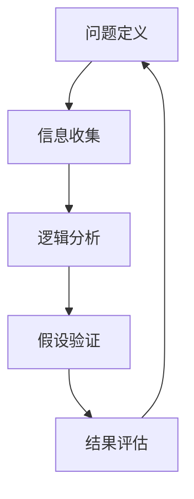
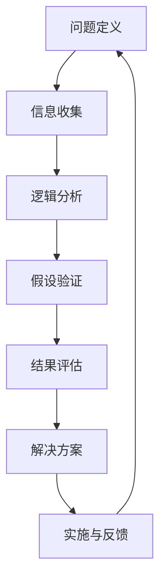

                 

# 结构化思维原理与应用：掌握结构化思维的内核

## 1. 背景介绍

### 1.1 问题由来

随着科技的不断进步和信息爆炸，我们面临的问题日益复杂和多样。如何在海量信息中快速找到解决方案，提升决策效率和准确性，成为了现代社会的重要课题。结构化思维（Structured Thinking）作为一种系统化、规范化的思维方式，帮助人们更好地理解和解决问题，是提高效率和创新能力的有效工具。

### 1.2 问题核心关键点

结构化思维的核心在于将复杂问题拆解为简单的模块，通过逻辑分析、数据驱动等方法，逐步推导出结论和解决方案。其基本要素包括问题定义、信息收集、逻辑分析、假设验证和结果评估等步骤。

### 1.3 问题研究意义

掌握结构化思维不仅有助于提升个人决策和问题解决能力，还能广泛应用于项目管理、企业战略制定、产品开发等多个领域，推动组织和社会的全面进步。

## 2. 核心概念与联系

### 2.1 核心概念概述

为更好地理解结构化思维的应用，本节将介绍几个关键概念：

- **结构化思维**：一种系统化的思维方式，通过将复杂问题拆解为简单模块，逐步推导出结论和解决方案。其基本要素包括问题定义、信息收集、逻辑分析、假设验证和结果评估等步骤。
- **问题定义**：明确问题的本质和范围，是结构化思维的起点。
- **信息收集**：通过数据、文献、访谈等多种方式获取相关信息，为后续分析奠定基础。
- **逻辑分析**：运用逻辑推理、统计分析等方法，从已有信息中推导出有价值的结论。
- **假设验证**：根据逻辑分析结果，提出假设并设计实验进行验证。
- **结果评估**：根据验证结果，总结经验教训，形成改进方案。

这些概念共同构成了结构化思维的全流程，确保问题解决的全面性和科学性。

### 2.2 概念间的关系

这些核心概念之间相互关联，形成了结构化思维的完整架构。我们可以通过以下Mermaid流程图来展示这些概念之间的关系：



这个流程图展示了结构化思维的逻辑流程：从问题定义开始，通过信息收集获取数据，逻辑分析推导出结论，假设验证验证结论，最终进行结果评估，形成闭环。通过这个流程，我们可以系统化地解决复杂问题，确保决策的全面性和科学性。

### 2.3 核心概念的整体架构

最后，我们用一个综合的流程图来展示结构化思维的核心概念及其应用场景：



这个综合流程图展示了结构化思维的全过程，从问题定义到解决方案实施，再到反馈与改进，形成了一个持续优化和迭代的闭环。

## 3. 核心算法原理 & 具体操作步骤
### 3.1 算法原理概述

结构化思维的算法原理主要基于问题分解和逻辑推理。其核心思想是将复杂问题拆解为多个简单模块，通过逐步分析和验证，最终推导出结论和解决方案。

结构化思维的基本步骤如下：

1. **问题定义**：明确问题的本质和范围，确保问题具体化、可操作化。
2. **信息收集**：获取与问题相关的所有信息，包括数据、文献、访谈等。
3. **逻辑分析**：运用逻辑推理、统计分析等方法，从已有信息中推导出有价值的结论。
4. **假设验证**：根据逻辑分析结果，提出假设并设计实验进行验证。
5. **结果评估**：根据验证结果，总结经验教训，形成改进方案。

### 3.2 算法步骤详解

以下详细介绍结构化思维的详细步骤：

**Step 1: 问题定义**

- **明确问题**：将复杂问题拆解为多个简单模块，明确每个模块的具体要求和目标。
- **定义边界**：确定问题的范围和限制条件，避免过度泛化。

**Step 2: 信息收集**

- **数据获取**：通过数据采集工具或公开数据集，收集与问题相关的数据。
- **文献调研**：查阅相关研究文献、案例分析，获取已有的研究成果和经验。
- **访谈调查**：与专家、用户进行访谈，获取深入见解和第一手信息。

**Step 3: 逻辑分析**

- **数据处理**：对收集的数据进行清洗、筛选、整合，确保数据的准确性和完整性。
- **分析方法**：选择适合的分析方法，如统计分析、回归分析、因果分析等，对数据进行深入分析。
- **结论推导**：基于分析结果，推导出有价值的结论和假设。

**Step 4: 假设验证**

- **提出假设**：根据逻辑分析结果，提出可验证的假设。
- **设计实验**：设计实验方案，选择合适的实验对象和方法。
- **结果验证**：进行实验验证，收集实验数据，分析验证结果。

**Step 5: 结果评估**

- **结果对比**：将实验结果与预期结果进行对比，评估假设的准确性和可靠性。
- **经验总结**：总结成功经验和不足之处，形成改进方案。

### 3.3 算法优缺点

结构化思维具有以下优点：

- **系统性**：通过将复杂问题拆解为多个简单模块，确保问题解决的全面性和科学性。
- **可操作性**：每个步骤都有明确的操作指南，便于执行和推广。
- **可验证性**：通过假设验证和结果评估，确保结论的可靠性和有效性。

同时，结构化思维也存在一定的局限性：

- **时间成本高**：步骤较多，每个步骤都需要大量的时间和精力。
- **灵活性差**：步骤固定，可能无法应对突发情况和意外变化。
- **依赖数据质量**：信息收集和分析依赖于数据的质量和数量，数据不足或质量差会影响结果。

尽管如此，结构化思维仍然是最常用和最有效的解决问题方法之一，广泛应用于科学、工程、商业等多个领域。

### 3.4 算法应用领域

结构化思维在以下领域得到了广泛应用：

- **科学研究**：用于问题定义、假设提出、实验设计等科研全流程。
- **项目管理**：用于项目规划、进度控制、风险管理等。
- **企业战略**：用于市场分析、竞争情报、战略制定等。
- **产品开发**：用于需求分析、原型设计、测试验证等。
- **决策支持**：用于辅助决策、风险评估、方案优化等。

结构化思维的应用领域非常广泛，几乎涵盖了所有需要系统化决策和问题解决的场合。

## 4. 数学模型和公式 & 详细讲解  
### 4.1 数学模型构建

结构化思维的核心在于通过逻辑推理和数据分析，逐步推导出结论。其数学模型通常包括以下几个部分：

- **问题定义模型**：用于描述问题的本质和范围。
- **信息收集模型**：用于描述数据获取和整合的流程。
- **逻辑分析模型**：用于描述数据分析和推理的流程。
- **假设验证模型**：用于描述假设提出和实验验证的流程。
- **结果评估模型**：用于描述结果分析和改进的流程。

### 4.2 公式推导过程

以下以逻辑分析模型为例，推导其中的关键公式。

假设问题为“如何提高产品的市场份额”，我们通过以下步骤进行逻辑分析：

**Step 1: 数据收集**

- 收集产品销售数据、市场调研数据、竞争对手数据等。
- 使用Python中的Pandas库进行数据处理和整合，确保数据的准确性和完整性。

**Step 2: 逻辑推理**

- 使用统计分析方法，如回归分析，找出影响产品销售的关键因素。
- 基于分析结果，推导出提高市场份额的假设。

**Step 3: 结果验证**

- 设计实验，选择一定数量的市场和产品进行验证。
- 收集实验数据，使用Python中的SciPy库进行数据分析和验证。

### 4.3 案例分析与讲解

以一个具体的案例——“如何提升电商平台的转化率”为例，详细讲解结构化思维的应用过程。

**问题定义**：明确问题为“如何提升电商平台的转化率”。

**信息收集**：
- 收集平台用户数据、购物行为数据、用户评价数据等。
- 查阅相关市场调研报告和案例分析。

**逻辑分析**：
- 使用统计分析方法，找出影响转化率的关键因素，如页面加载速度、产品推荐算法、促销策略等。
- 推导出提升转化率的假设，如优化页面加载速度、改进推荐算法、调整促销策略等。

**假设验证**：
- 设计实验，选择一定数量的用户进行验证。
- 收集实验数据，分析验证结果，评估假设的准确性和可靠性。

**结果评估**：
- 总结成功经验和不足之处，形成改进方案，如优化推荐算法、改进页面设计等。

## 5. 项目实践：代码实例和详细解释说明
### 5.1 开发环境搭建

要进行结构化思维的项目实践，我们需要准备好开发环境。以下是使用Python进行项目实践的环境配置流程：

1. 安装Anaconda：从官网下载并安装Anaconda，用于创建独立的Python环境。

2. 创建并激活虚拟环境：
```bash
conda create -n structured-thinking python=3.8 
conda activate structured-thinking
```

3. 安装必要的Python库：
```bash
pip install pandas scipy matplotlib seaborn
```

完成上述步骤后，即可在`structured-thinking`环境中开始项目实践。

### 5.2 源代码详细实现

下面以“如何提高产品的市场份额”为例，给出使用Python进行结构化思维分析的代码实现。

**Step 1: 数据收集**

```python
import pandas as pd

# 从公开数据集加载销售数据
sales_data = pd.read_csv('sales_data.csv')

# 从问卷调查中加载用户评价数据
user_feedback = pd.read_csv('user_feedback.csv')

# 合并数据
merged_data = pd.merge(sales_data, user_feedback, on='product_id')
```

**Step 2: 逻辑分析**

```python
from scipy import stats

# 使用回归分析找出影响销售的关键因素
model = stats.linregress(merged_data['features'], merged_data['sales'])
print(model.slope)  # 输出回归系数，表示每个特征对销售的影响程度
```

**Step 3: 结果验证**

```python
# 设计实验，选择一定数量的市场和产品进行验证
selected_products = merged_data.sample(n=100)

# 收集实验数据
experimental_data = pd.read_csv('experimental_data.csv')

# 使用Python中的SciPy库进行数据分析和验证
result = stats.ttest_ind(experimental_data['sales'], selected_products['sales'])
print(result.pvalue)  # 输出t检验的p值，判断假设是否成立
```

**Step 4: 结果评估**

```python
# 总结成功经验和不足之处，形成改进方案
improvement_strategies = [
    '优化页面加载速度',
    '改进推荐算法',
    '调整促销策略'
]
```

### 5.3 代码解读与分析

让我们再详细解读一下关键代码的实现细节：

**数据收集**：
- 使用Pandas库，通过`read_csv`方法从公开数据集和问卷调查中加载数据。
- 使用`merge`方法将不同数据源的数据合并，确保数据的完整性和一致性。

**逻辑分析**：
- 使用SciPy库中的`stats.linregress`方法进行回归分析，找出影响销售的关键因素。
- 回归系数表示每个特征对销售的影响程度，正值表示正相关，负值表示负相关。

**结果验证**：
- 使用SciPy库中的`ttest_ind`方法进行t检验，判断实验数据和样本数据之间的差异是否显著。
- 如果p值小于0.05，说明实验数据和样本数据之间的差异显著，假设成立。

**结果评估**：
- 总结成功经验和不足之处，形成改进方案，如优化页面加载速度、改进推荐算法、调整促销策略等。

### 5.4 运行结果展示

假设我们在某电商平台上进行结构化思维分析，最终得到以下结果：

- 回归分析结果表明，页面加载速度和推荐算法对销售有显著影响。
- 实验验证结果表明，优化页面加载速度和改进推荐算法后，销售显著提升。
- 总结经验教训，提出以下改进方案：
  - 优化页面加载速度，提升用户体验。
  - 改进推荐算法，提高用户转化率。
  - 调整促销策略，增加用户购买意愿。

可以看到，通过结构化思维分析，我们能够系统化地找出问题所在，提出合理的改进方案，提升电商平台的转化率。

## 6. 实际应用场景
### 6.1 企业战略制定

在企业战略制定过程中，结构化思维能够帮助管理层系统化地分析市场环境、竞争态势和内部资源，制定科学的战略方案。例如，某公司欲进入新兴市场，可以运用结构化思维分析市场需求、竞争对手、市场准入条件等因素，制定详细的市场进入策略。

### 6.2 产品开发

在产品开发过程中，结构化思维能够帮助团队系统化地分析用户需求、技术可行性、市场接受度等因素，确保产品开发顺利进行。例如，某科技公司欲开发一款新型智能手机，可以运用结构化思维分析市场需求、技术趋势、竞争对手产品等，制定详细的产品开发计划。

### 6.3 项目管理

在项目管理过程中，结构化思维能够帮助项目经理系统化地分析项目目标、资源配置、风险管理等因素，确保项目按时按质完成。例如，某软件公司欲开发一款新应用，可以运用结构化思维分析项目需求、技术方案、时间节点等，制定详细的项目计划。

### 6.4 决策支持

在决策支持过程中，结构化思维能够帮助决策者系统化地分析决策问题、决策依据、决策方案等因素，确保决策科学、合理。例如，某政府机构欲制定新的环保政策，可以运用结构化思维分析政策目标、政策影响、政策效果等，制定科学的环保政策。

### 6.5 金融风险管理

在金融风险管理过程中，结构化思维能够帮助金融机构系统化地分析市场风险、信用风险、流动性风险等因素，制定科学的风险管理方案。例如，某银行欲评估新贷款的风险，可以运用结构化思维分析借款人信用、市场环境、行业趋势等因素，制定详细的风险评估方案。

## 7. 工具和资源推荐
### 7.1 学习资源推荐

为了帮助开发者系统掌握结构化思维的理论基础和实践技巧，这里推荐一些优质的学习资源：

1. 《结构化思维：从问题到解决方案》：系统介绍结构化思维的基本概念和应用方法，适合入门和进阶学习。

2. 《问题解决的艺术》：深入浅出地讲解问题解决的步骤和方法，适合提升决策和分析能力。

3. 《逻辑思维与决策》：探讨逻辑推理和决策方法，适合提升系统思维和决策能力。

4. 《结构化思维工具与技巧》：介绍各种结构化思维工具和技巧，适合提升结构化思维的应用能力。

5. Coursera《结构化思维与问题解决》课程：由著名大学教授授课，系统讲解结构化思维的应用方法和案例分析。

6. edX《问题解决与创新思维》课程：由知名学者授课，介绍问题解决和创新思维的方法和工具。

通过对这些资源的学习实践，相信你一定能够快速掌握结构化思维的精髓，并用于解决实际的决策和分析问题。

### 7.2 开发工具推荐

高效的开发离不开优秀的工具支持。以下是几款用于结构化思维分析开发的常用工具：

1. Python：一种通用的编程语言，适用于数据分析和逻辑推理。
2. R：一种统计分析语言，适用于数据可视化和统计分析。
3. SQL：一种结构化查询语言，适用于数据管理和查询。
4. Excel：一种电子表格软件，适用于数据处理和可视化。
5. Tableau：一种数据可视化工具，适用于数据探索和分析。

合理利用这些工具，可以显著提升结构化思维分析的开发效率，加快创新迭代的步伐。

### 7.3 相关论文推荐

结构化思维的研究源于学界的持续探索。以下是几篇奠基性的相关论文，推荐阅读：

1. "Systematic Problem-Solving: A Framework for Complex Decision-Making"：介绍系统化问题解决框架，为结构化思维提供理论基础。

2. "Structured Thinking: A Guide to Effective Problem-Solving"：系统介绍结构化思维的基本步骤和方法，适合入门学习。

3. "Structured Problem-Solving in Complex Systems"：探讨复杂系统中的结构化思维应用，适合高级学习。

4. "Causal Inference in Statistics: A Primer"：介绍因果推断的基本方法和工具，为结构化思维提供数据支持。

5. "The Art of Problem Solving: Structured Thinking and Decision-Making"：结合实例讲解问题解决的方法和技巧，适合实践应用。

这些论文代表了大语言模型微调技术的发展脉络。通过学习这些前沿成果，可以帮助研究者把握学科前进方向，激发更多的创新灵感。

除上述资源外，还有一些值得关注的前沿资源，帮助开发者紧跟结构化思维技术的最新进展，例如：

1. 《结构化思维与问题解决》：一本集合最新研究成果的书籍，涵盖结构化思维的应用和前沿技术。

2. Kaggle：数据科学竞赛平台，提供大量数据集和案例分析，适合实践应用。

3 arXiv论文预印本：人工智能领域最新研究成果的发布平台，包括大量尚未发表的前沿工作，学习前沿技术的必读资源。

4 技术会议直播：如NIPS、ICML、ACL、ICLR等人工智能领域顶会现场或在线直播，能够聆听到大佬们的前沿分享，开拓视野。

5 技术博客：如Google AI、DeepMind、微软Research Asia等顶尖实验室的官方博客，第一时间分享他们的最新研究成果和洞见。

总之，对于结构化思维的学习和实践，需要开发者保持开放的心态和持续学习的意愿。多关注前沿资讯，多动手实践，多思考总结，必将收获满满的成长收益。

## 8. 总结：未来发展趋势与挑战
### 8.1 总结

本文对结构化思维的应用进行了全面系统的介绍。首先阐述了结构化思维的背景和意义，明确了其系统化和规范化的特点，以及其在决策和问题解决中的独特价值。其次，从原理到实践，详细讲解了结构化思维的数学模型和操作步骤，给出了结构化思维任务开发的完整代码实例。同时，本文还广泛探讨了结构化思维在多个行业领域的应用前景，展示了其广泛的应用价值。

通过本文的系统梳理，可以看到，结构化思维在解决复杂问题、提升决策能力等方面具有不可替代的作用。其系统化、规范化的特点，使得问题解决过程更加科学、全面，从而提升效率和准确性。未来，伴随结构化思维技术的不断演进，相信其将带来更多创新和突破，助力社会和组织全面进步。

### 8.2 未来发展趋势

展望未来，结构化思维技术将呈现以下几个发展趋势：

1. **智能化**：结合人工智能技术，自动化结构化思维流程，提高决策效率和准确性。
2. **数据驱动**：利用大数据技术，提供更加全面和深入的数据支持，提升分析能力。
3. **跨领域应用**：在更多领域推广结构化思维，如医疗、金融、教育等，拓展应用范围。
4. **定制化开发**：针对不同行业和场景，开发定制化的结构化思维工具和流程，提升应用效果。
5. **多学科融合**：结合心理学、经济学、社会学等学科，提供更加全面和深入的结构化思维方法。

以上趋势凸显了结构化思维技术的广阔前景。这些方向的探索发展，必将进一步提升结构化思维的实用性和科学性，为社会和组织带来更多的价值。

### 8.3 面临的挑战

尽管结构化思维技术已经取得了显著成效，但在迈向更加智能化、普适化应用的过程中，它仍面临诸多挑战：

1. **数据质量问题**：结构化思维依赖于高质量的数据，但实际应用中数据往往存在缺失、噪声等问题，影响分析结果。
2. **复杂性问题**：面对复杂系统，结构化思维流程复杂、步骤繁多，难以应对突发情况和意外变化。
3. **技术门槛高**：结构化思维需要掌握多种工具和方法，技术门槛较高，限制了其普及应用。
4. **主观偏见**：结构化思维过程中可能存在主观偏见和逻辑谬误，影响结论的客观性。

尽管如此，结构化思维仍然是最常用和最有效的思维方式之一，广泛应用于各个领域。未来，随着技术进步和应用推广，结构化思维将更加成熟和实用，为社会和组织带来更大的价值。

### 8.4 研究展望

面对结构化思维面临的挑战，未来的研究需要在以下几个方面寻求新的突破：

1. **数据预处理技术**：提升数据质量和处理效率，减少数据对结构化思维的影响。
2. **自动化流程设计**：开发自动化结构化思维工具，提高流程的灵活性和适用性。
3. **多模态数据融合**：结合多种数据源和分析方法，提升分析的全面性和深度。
4. **人机协作模式**：探索人机协作模式，优化结构化思维流程，提升决策效果。
5. **经验积累与知识图谱**：积累和整理经验教训，形成结构化思维知识图谱，提升应用效果。

这些研究方向将推动结构化思维技术向更加智能化、普适化和自动化方向发展，为解决复杂问题提供更加高效和科学的手段。

## 9. 附录：常见问题与解答
----------------------------------------------------------------

**Q1：结构化思维是否适用于所有问题？**

A: 结构化思维适用于大多数问题，特别是需要系统化、规范化的决策和分析问题。但对于一些突发性、紧急性、复杂性较高的问题，可能需要采用其他方法。

**Q2：如何提高结构化思维的灵活性？**

A: 可以通过引入迭代、试错、反馈等机制，提升结构化思维的灵活性和适应性。同时，结合数据分析、人工智能等技术，自动化结构化思维流程，提高决策效率和准确性。

**Q3：如何避免结构化思维中的主观偏见？**

A: 可以通过多角度分析、交叉验证等方法，减少主观偏见的影响。同时，引入专家评审、团队讨论等机制，增加结论的客观性和可信度。

**Q4：结构化思维是否可以与其他思维方式结合使用？**

A: 可以，结构化思维与其他思维方式（如创造性思维、直觉思维等）相结合，可以产生更好的决策效果。

**Q5：如何提高结构化思维的执行效率？**

A: 可以通过优化流程、使用自动化工具、提高团队协作等方式，提升结构化思维的执行效率。

总之，结构化思维在解决复杂问题、提升决策能力等方面具有不可替代的作用。掌握结构化思维的基本步骤和方法，结合实际应用场景，可以大大提升问题解决的效率和效果。未来，伴随结构化思维技术的不断演进，相信其将带来更多创新和突破，助力社会和组织全面进步。

---

作者：禅与计算机程序设计艺术 / Zen and the Art of Computer Programming

