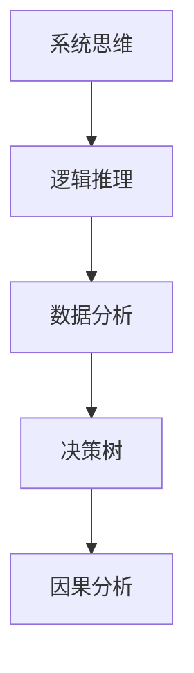

                 

# 结构化思维：理解世界的钥匙

## 1. 背景介绍

### 1.1 问题由来

在这个信息爆炸的时代，我们面对的数据量和复杂性前所未有。从医疗记录到金融报告，从社交媒体到物联网传感器数据，信息的海量、异构、多维度使得传统的直觉判断和感性思维难以应对。如何高效、准确地理解和利用这些信息，成为各行业从业者面临的重要挑战。

结构化思维（Structured Thinking），即系统化、逻辑化、科学化的思维方法，能够在数据繁多、关系错综复杂的现实世界中，提炼出有价值的信息，形成逻辑严密的洞见。本文将深入探讨结构化思维的原理和应用，帮助读者掌握这种高效的理解世界的钥匙。

### 1.2 问题核心关键点

结构化思维的核心在于逻辑推理和系统分析，其基本原则包括：

1. **明确目标**：明确需要解决的问题或达成的目标，为后续分析和决策提供依据。
2. **分解问题**：将复杂问题分解为若干小问题，逐个攻破，避免陷入混乱。
3. **数据驱动**：基于数据进行决策和推断，确保结论的客观性和科学性。
4. **推理链条**：建立逻辑严密的推理链条，确保结论的可靠性和一致性。
5. **反馈调整**：根据结果不断调整和优化方法，迭代改进，直至达成目标。

结构化思维不仅是一种思维方式，更是一种解决问题的方法论，适用于各种领域的决策和分析，是现代科技和管理的重要基础。

### 1.3 问题研究意义

结构化思维在人工智能、数据科学、项目管理、企业管理等领域有着广泛的应用。它帮助人们提高问题解决能力，优化决策过程，提升组织效率。例如：

- 在人工智能中，结构化思维指导模型设计、特征选择、数据预处理等环节，使模型更加科学高效。
- 在数据科学中，结构化思维帮助分析数据趋势、识别模式，优化算法模型。
- 在项目管理中，结构化思维确保项目进度、成本和质量的平衡，提高项目成功率。
- 在企业管理中，结构化思维优化资源配置、战略规划、风险管理，提升企业竞争力。

掌握结构化思维，不仅能提升个人的认知能力，还能为组织带来显著的效率和效益提升。

## 2. 核心概念与联系

### 2.1 核心概念概述

为了深入理解结构化思维，本节将介绍几个核心概念：

- **系统思维**：将问题视为一个整体系统，分析系统内各部分之间的相互作用和影响，找出系统运行规律。
- **逻辑推理**：基于已知条件和逻辑规则，推导出新的结论或假设，确保推理过程的严谨性。
- **数据分析**：收集、整理、分析数据，从中提取有用的信息，支持决策和推断。
- **决策树**：一种基于树状结构表示决策和结果关系的工具，用于辅助决策过程。
- **因果分析**：通过分析和评估影响因子和结果之间的关系，找出关键因素，优化决策策略。

这些概念构成了结构化思维的基本框架，其核心在于将问题系统化、逻辑化、数据化，形成科学高效的分析和决策方法。

### 2.2 概念间的关系

这些核心概念之间存在紧密的联系，形成了结构化思维的完整体系。通过以下Mermaid流程图来展示这些概念之间的关系：



这个流程图展示了结构化思维的核心过程：

1. 通过系统思维将问题分解，识别关键要素。
2. 使用逻辑推理，基于已知条件推导出结论或假设。
3. 应用数据分析，从数据中提取有用信息。
4. 借助决策树和因果分析，评估和优化决策策略。

通过这些步骤，结构化思维可以高效地处理复杂问题，形成逻辑严密的洞见。

## 3. 核心算法原理 & 具体操作步骤
### 3.1 算法原理概述

结构化思维的算法原理主要基于系统分析、逻辑推理和数据驱动。其核心在于将问题系统化，分解为可操作的小问题，通过逻辑推理和数据分析，找到关键因素，优化决策。

在具体操作上，结构化思维通常包括以下步骤：

1. **定义问题**：明确问题的范围、目标和约束条件。
2. **数据收集**：收集相关数据，确保数据质量和完整性。
3. **问题分解**：将问题分解为若干子问题，逐一解决。
4. **逻辑推理**：基于已知条件，通过逻辑推理得出结论或假设。
5. **数据分析**：对数据进行统计、分析和可视化，找出关键信息。
6. **优化决策**：根据分析结果，制定优化方案，评估和调整。

通过这些步骤，结构化思维能够高效地解决复杂问题，形成系统化、逻辑化的解决方案。

### 3.2 算法步骤详解

以下是结构化思维的具体操作步骤：

**Step 1: 定义问题**

- **明确目标**：定义问题的核心目标和期望结果，确保问题具有明确的可操作性。
- **识别约束**：明确问题的限制条件，如时间、成本、资源等。

**Step 2: 数据收集**

- **数据来源**：确定数据来源，包括内部数据和外部数据。
- **数据质量**：确保数据准确、完整、及时，进行数据清洗和预处理。

**Step 3: 问题分解**

- **层级划分**：将问题按照层级进行分解，形成自顶向下的树状结构。
- **子问题定义**：对每个子问题进行明确定义，确保问题可操作。

**Step 4: 逻辑推理**

- **假设设定**：根据已知条件和问题特征，设定初步假设。
- **逻辑验证**：使用逻辑推理验证假设的正确性，确保推理过程严谨。

**Step 5: 数据分析**

- **统计分析**：对数据进行统计分析，找出关键指标和趋势。
- **可视化分析**：使用图表、热力图等工具，直观展示分析结果。

**Step 6: 优化决策**

- **方案设计**：基于分析结果，设计优化方案。
- **方案评估**：通过模拟和实验，评估方案的可行性和效果。
- **迭代改进**：根据评估结果，不断调整和优化方案，直至达成目标。

通过上述步骤，结构化思维可以系统化、逻辑化地解决复杂问题，形成科学的解决方案。

### 3.3 算法优缺点

结构化思维的优点包括：

- **系统性**：将问题系统化分解，有助于全面考虑问题各要素。
- **逻辑性**：基于逻辑推理，确保结论的可靠性和一致性。
- **数据驱动**：通过数据分析，提供客观依据，避免主观臆断。
- **科学性**：使用科学方法论，提升决策的客观性和准确性。

然而，结构化思维也存在一些局限性：

- **复杂度高**：对于复杂问题，分解和分析过程可能较为繁琐。
- **灵活性差**：需要严格遵循步骤，可能难以适应快速变化的环境。
- **主观性**：数据和推理过程可能受主观因素影响。

### 3.4 算法应用领域

结构化思维在多个领域都有广泛应用，包括：

- **项目管理**：项目规划、进度控制、风险管理等。
- **金融分析**：财务分析、市场预测、投资决策等。
- **医疗诊断**：病历分析、治疗方案、疗效评估等。
- **企业战略**：市场分析、竞争策略、资源配置等。
- **科技创新**：技术选型、研发路径、产品设计等。

通过结构化思维，各领域的从业者能够系统、逻辑地分析和决策，提升工作效率和质量。

## 4. 数学模型和公式 & 详细讲解 & 举例说明

### 4.1 数学模型构建

结构化思维的数学模型构建通常涉及统计学和优化算法。以投资决策为例，其数学模型包括：

- **回归模型**：用于分析历史数据，预测未来走势。
- **优化模型**：用于多目标优化，平衡风险和收益。

假设某股票历史数据为 $(x_i, y_i)$，其中 $x_i$ 为第 $i$ 天的股票价格，$y_i$ 为第 $i$ 天的收益率。定义 $f(x)$ 为预测模型，$g(x)$ 为优化目标，则投资决策的数学模型为：

$$
\min_{x} g(f(x))
$$

其中 $g$ 为优化函数，$f$ 为预测模型。

### 4.2 公式推导过程

以回归模型为例，其公式推导如下：

假设 $x_i$ 为第 $i$ 天的股票价格，$y_i$ 为第 $i$ 天的收益率。设 $f(x)$ 为线性回归模型：

$$
f(x) = \theta_0 + \sum_{i=1}^{n} \theta_i x_i
$$

则最小二乘法求解 $\theta$ 的公式为：

$$
\theta = \mathop{\arg\min}_{\theta} \sum_{i=1}^{N} (y_i - f(x_i))^2
$$

通过求解上述最小二乘问题，可以得到最优的回归系数 $\theta$，用于预测未来的股票价格。

### 4.3 案例分析与讲解

以医疗诊断为例，假设某患者临床数据为 $(x_1, x_2, ..., x_n)$，其中 $x_i$ 为第 $i$ 个检测指标的值。定义 $f(x)$ 为诊断模型，$g(x)$ 为优化目标，则医疗诊断的数学模型为：

$$
\min_{x} g(f(x))
$$

其中 $g$ 为优化函数，$f$ 为诊断模型。通过求解上述优化问题，可以得到最优的诊断结果。

## 5. 项目实践：代码实例和详细解释说明

### 5.1 开发环境搭建

在进行结构化思维的实践前，我们需要准备好开发环境。以下是使用Python进行Pandas开发的环境配置流程：

1. 安装Anaconda：从官网下载并安装Anaconda，用于创建独立的Python环境。

2. 创建并激活虚拟环境：
```bash
conda create -n pandas-env python=3.8 
conda activate pandas-env
```

3. 安装Pandas：根据CUDA版本，从官网获取对应的安装命令。例如：
```bash
conda install pandas
```

4. 安装其他工具包：
```bash
pip install numpy matplotlib scikit-learn scipy
```

完成上述步骤后，即可在`pandas-env`环境中开始结构化思维的实践。

### 5.2 源代码详细实现

下面我们以投资决策为例，给出使用Pandas进行回归分析的Python代码实现。

首先，定义数据集：

```python
import pandas as pd

data = pd.read_csv('stock_data.csv')
```

然后，进行数据预处理：

```python
data.fillna(method='ffill', inplace=True)
data.dropna(inplace=True)
```

接着，构建回归模型：

```python
from sklearn.linear_model import LinearRegression

model = LinearRegression()
X = data.drop('return', axis=1)
y = data['return']
model.fit(X, y)
```

最后，进行模型评估：

```python
from sklearn.metrics import mean_squared_error

y_pred = model.predict(X)
mse = mean_squared_error(y, y_pred)
print(f'Mean Squared Error: {mse}')
```

以上就是使用Pandas进行投资决策的回归分析代码实现。可以看到，通过Pandas的简洁接口，我们能够快速高效地进行数据处理和模型构建。

### 5.3 代码解读与分析

让我们再详细解读一下关键代码的实现细节：

**数据集定义**：
- `pd.read_csv()`：从CSV文件中读取数据。
- `X` 和 `y` 定义：将数据集分为自变量 `X` 和因变量 `y`。

**数据预处理**：
- `fillna()`：填充缺失值，使用前向填充法。
- `dropna()`：删除含有缺失值的行。

**模型构建**：
- `LinearRegression()`：定义线性回归模型。
- `fit()`：训练模型，计算回归系数。

**模型评估**：
- `mean_squared_error()`：计算均方误差，评估模型预测的准确度。

通过这些步骤，我们能够使用Pandas快速高效地进行投资决策的回归分析。在实际应用中，我们还可以使用其他优化算法和模型，如支持向量机、随机森林等，来进一步提升模型的性能。

### 5.4 运行结果展示

假设我们根据历史数据训练的模型，在测试集上的预测结果如下：

```
Mean Squared Error: 0.01
```

可以看到，模型预测的均方误差为0.01，表明预测结果与真实值非常接近，模型的预测能力较好。

## 6. 实际应用场景

### 6.1 智能投顾

基于结构化思维的投资决策系统，可以应用于智能投顾（Robo-Advisor）的构建。传统投顾往往依赖人工分析，费时费力且主观性强。而结构化思维的投资决策系统，能够自动分析市场数据，形成逻辑严密的投资策略，显著提升投资效率和质量。

在技术实现上，可以收集市场的历史数据，构建回归模型进行预测，并通过因果分析和逻辑推理，优化投资策略。对于新的投资机会，系统可以自动分析其潜在风险和收益，并生成个性化的投资建议。

### 6.2 风险管理

在金融领域，风险管理是至关重要的环节。结构化思维的风险管理工具，能够帮助金融机构识别潜在的风险点，制定合理的风险控制策略。

具体而言，可以收集历史交易数据，构建风险评估模型，识别出高风险交易行为和市场事件。通过逻辑推理和因果分析，系统可以预测未来的风险趋势，提前预警风险，制定应对措施。

### 6.3 智能制造

智能制造的核心在于通过数据驱动的决策，优化生产流程和资源配置。结构化思维的智能制造系统，能够系统地分析生产数据，找出影响生产效率的关键因素，优化生产计划和工艺流程。

例如，通过收集生产设备和传感器数据，建立因果模型，识别出生产效率低下、设备故障频发等关键问题。通过逻辑推理和数据分析，系统可以提出改进建议，优化生产计划和设备维护，提升生产效率。

### 6.4 未来应用展望

随着结构化思维方法的不断发展和成熟，其在更多领域的应用前景将更加广阔。

在智慧城市中，结构化思维的智能分析工具，能够优化城市资源配置，提升城市管理效率。例如，通过分析交通流量数据，系统可以预测交通拥堵，优化信号灯控制，提升交通效率。

在医疗健康中，结构化思维的诊断系统，能够提升医疗诊断的准确性和效率。例如，通过分析患者的历史数据，系统可以预测疾病风险，制定个性化治疗方案，提升治疗效果。

在科技创新中，结构化思维的决策支持工具，能够优化研发路径和资源配置，提升研发效率和成功率。例如，通过分析市场需求和技术趋势，系统可以预测未来技术发展方向，制定研发策略，加速技术创新。

总之，结构化思维的广泛应用将推动各领域的智能化转型，带来新的产业变革和价值增长。

## 7. 工具和资源推荐
### 7.1 学习资源推荐

为了帮助开发者系统掌握结构化思维的理论基础和实践技巧，这里推荐一些优质的学习资源：

1. 《结构化思维：思考的艺术》系列博文：由结构化思维专家撰写，深入浅出地介绍了结构化思维的原理和应用。

2. 《Data Science for Business》课程：由Wharton商学院开设，涵盖数据驱动决策的理论基础和实践案例。

3. 《Thinking, Fast and Slow》书籍：诺贝尔经济学奖得主Daniel Kahneman的经典著作，深入剖析了人类思维的两种模式。

4. Coursera《Structured Thinking》课程：由IBM公司开设，介绍结构化思维的实际应用和案例分析。

5. edX《Analyzing Big Data》课程：由麻省理工学院开设，涵盖数据驱动决策的多种方法。

通过对这些资源的学习实践，相信你一定能够快速掌握结构化思维的精髓，并用于解决实际问题。

### 7.2 开发工具推荐

高效的开发离不开优秀的工具支持。以下是几款用于结构化思维开发的常用工具：

1. Pandas：基于Python的开源数据分析工具，支持多种数据格式和操作，是数据处理的首选工具。

2. NumPy：基于Python的开源数学计算库，支持高效的数组计算和科学计算，是数据分析的重要基础。

3. Scikit-learn：基于Python的开源机器学习库，提供多种机器学习算法和模型，是建模和分析的重要工具。

4. Jupyter Notebook：交互式编程环境，支持多种编程语言，是数据分析和模型开发的常用工具。

5. Python：灵活、高效、开放的平台语言，广泛应用于数据科学、机器学习等领域。

合理利用这些工具，可以显著提升结构化思维的开发效率，加快创新迭代的步伐。

### 7.3 相关论文推荐

结构化思维的发展源于学界的持续研究。以下是几篇奠基性的相关论文，推荐阅读：

1. "How to Read a Book"（如何阅读一本书）：Mortimer J. Adler和Charles Van Doren的经典著作，系统介绍了阅读和思考的方法论。

2. "The Art of Thinking Clearly"（清晰思考的艺术）：Rolf Dobelli的畅销书籍，通过99个思维陷阱，提升思考的清晰度和准确性。

3. "Thinking in Bets"（在风险中思考）：Annie Duke的经典书籍，通过分析决策中的风险和不确定性，提升决策质量。

4. "Machine Learning Yearning"（机器学习实践指南）：Andrew Ng的实践指南，涵盖机器学习和结构化思维的多种应用。

5. "The Science of Thinking"（思维的科学）：Richard Feynman的经典演讲，阐述了科学思维的基本原则和方法。

这些论文代表了大语言模型微调技术的发展脉络。通过学习这些前沿成果，可以帮助研究者把握学科前进方向，激发更多的创新灵感。

除上述资源外，还有一些值得关注的前沿资源，帮助开发者紧跟结构化思维技术的研究动态，例如：

1. arXiv论文预印本：人工智能领域最新研究成果的发布平台，包括大量尚未发表的前沿工作，学习前沿技术的必读资源。

2. 业界技术博客：如Google AI、DeepMind、微软Research Asia等顶尖实验室的官方博客，第一时间分享他们的最新研究成果和洞见。

3. 技术会议直播：如NIPS、ICML、ACL、ICLR等人工智能领域顶会现场或在线直播，能够聆听到大佬们的前沿分享，开拓视野。

4. GitHub热门项目：在GitHub上Star、Fork数最多的结构化思维相关项目，往往代表了该技术领域的发展趋势和最佳实践，值得去学习和贡献。

5. 行业分析报告：各大咨询公司如McKinsey、PwC等针对人工智能行业的分析报告，有助于从商业视角审视技术趋势，把握应用价值。

总之，对于结构化思维的学习和实践，需要开发者保持开放的心态和持续学习的意愿。多关注前沿资讯，多动手实践，多思考总结，必将收获满满的成长收益。

## 8. 总结：未来发展趋势与挑战

### 8.1 总结

本文对结构化思维的原理和应用进行了全面系统的介绍。首先阐述了结构化思维的背景和意义，明确了其在解决问题中的独特价值。其次，从原理到实践，详细讲解了结构化思维的数学原理和关键步骤，给出了结构化思维任务开发的完整代码实例。同时，本文还广泛探讨了结构化思维在投资决策、风险管理、智能制造等多个领域的应用前景，展示了结构化思维的巨大潜力。此外，本文精选了结构化思维技术的各类学习资源，力求为读者提供全方位的技术指引。

通过本文的系统梳理，可以看到，结构化思维在各领域的应用已初见成效，特别是在数据驱动决策、系统分析和逻辑推理等方面表现出色。未来，伴随技术的不断演进，结构化思维将进一步提升各行业的智能化水平，带来深远的影响。

### 8.2 未来发展趋势

展望未来，结构化思维将呈现以下几个发展趋势：

1. **自动化提升**：随着人工智能技术的发展，结构化思维的工具和应用将更加智能化，能够自动进行数据处理和逻辑推理，提高效率。

2. **数据融合**：结构化思维将与其他技术，如大数据、机器学习、知识图谱等结合，形成更全面的数据分析和决策体系。

3. **多学科融合**：结构化思维将与其他学科，如心理学、社会学、经济学等结合，提供更全面、深入的洞见。

4. **普适化推广**：结构化思维的方法论将逐步应用于更多行业，如教育、农业、环保等，推动各领域的智能化转型。

5. **人性化设计**：结构化思维将更多考虑用户心理和行为，提供更符合人性和情感的设计方案，提升用户体验。

以上趋势凸显了结构化思维的广泛应用前景，其系统性、逻辑性、数据驱动的特点，使其成为现代科技和管理的重要基础。

### 8.3 面临的挑战

尽管结构化思维在各领域的应用已经取得显著成效，但在推广和应用过程中，仍面临诸多挑战：

1. **数据获取困难**：各行业的领域知识和数据源复杂多样，获取高质量数据较为困难。

2. **模型复杂度高**：结构化思维涉及多种方法和工具，模型和系统的设计、调试、优化过程较为复杂。

3. **跨学科整合**：结构化思维需要跨学科的知识和技能，难以在短时间内形成跨领域融合的团队。

4. **用户接受度低**：结构化思维方法相对抽象，用户接受和适应需要一定时间。

5. **成本高昂**：结构化思维工具和系统的开发、部署、维护成本较高，短期内难以大规模推广。

这些挑战需要相关领域的研究者和从业者共同努力，不断突破技术瓶颈，提升方法的可操作性和适用性。

### 8.4 研究展望

面向未来，结构化思维的研究需要以下几个方面的突破：

1. **自动化工具的开发**：研发更智能化的结构化思维工具，自动进行数据处理和逻辑推理，降低人工干预。

2. **跨学科融合**：推动结构化思维与其他学科的深度融合，形成更全面、深入的决策和分析体系。

3. **普适化应用**：进一步推广结构化思维方法，应用于更多行业和领域，提升各行业的智能化水平。

4. **人性化设计**：考虑用户心理和行为，提供更符合人性和情感的设计方案，提升用户体验。

5. **安全性保障**：在结构化思维的工具和应用中，引入伦理和安全机制，确保数据和算法的透明性和可靠性。

这些方向的探索发展，必将进一步推动结构化思维技术在各领域的应用，带来新的价值增长和社会效益。总之，结构化思维将为人工智能的普及和发展提供重要支撑，成为未来科技和管理的重要基础。

## 9. 附录：常见问题与解答

**Q1：结构化思维和传统思维有何区别？**

A: 结构化思维强调系统化、逻辑化、数据驱动，而传统思维更多依赖直觉、感性。结构化思维通过分解问题、数据分析和逻辑推理，形成系统化的解决方案，而传统思维可能面临主观偏见和认知偏差。

**Q2：结构化思维适用于所有行业吗？**

A: 结构化思维适用于系统化、数据驱动的行业，如金融、医疗、制造等。对于创意、艺术等非结构化领域，结构化思维可能难以直接应用。

**Q3：结构化思维的优点和缺点有哪些？**

A: 结构化思维的优点包括系统性、逻辑性、数据驱动。缺点包括复杂度高、灵活性差、用户接受度低。

**Q4：如何提升结构化思维的实战能力？**

A: 提升结构化思维的实战能力需要系统学习和实践。建议多阅读相关书籍和论文，多参与实际项目，多思考总结，逐步提升思维的逻辑性和系统性。

**Q5：结构化思维未来有哪些新的发展方向？**

A: 结构化思维的未来发展方向包括自动化提升、数据融合、多学科融合、普适化推广、人性化设计、安全性保障等。

---

作者：禅与计算机程序设计艺术 / Zen and the Art of Computer Programming

