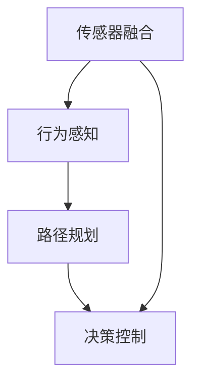
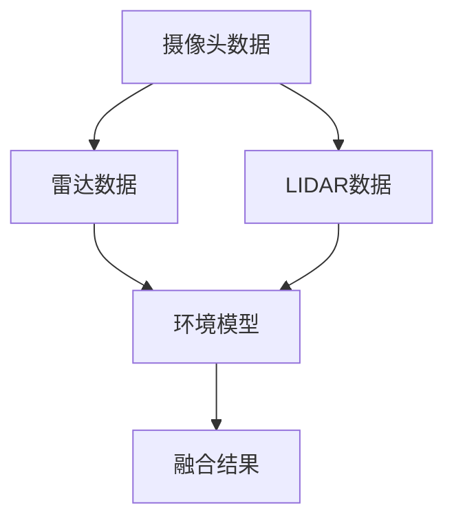
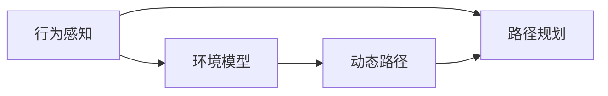
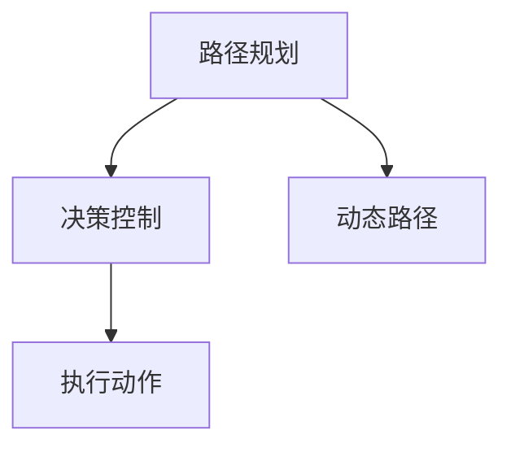
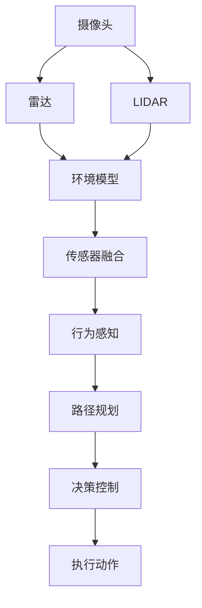

                 

# 自动驾驶界的头部玩家与新进入者

> 关键词：自动驾驶,高级驾驶辅助系统(ADAS),传感器融合,行为感知,路径规划,决策控制

## 1. 背景介绍

### 1.1 问题由来
自动驾驶技术近年来取得了长足进步，但高级驾驶辅助系统(ADAS)仍是自动驾驶发展的重要基础。ADAS通过融合多种传感器数据，实现对车辆周围环境的感知与理解，并据此进行路径规划和决策控制，是实现自动驾驶的关键组件。然而，ADAS面临诸多技术挑战，包括传感器融合、行为感知、路径规划和决策控制等多个子系统。本文将详细介绍这些核心组件，并探讨新进入者在ADAS领域面临的机遇和挑战。

### 1.2 问题核心关键点
自动驾驶领域的核心关键点包括：
- 传感器融合：将不同传感器（如摄像头、雷达、激光雷达等）数据进行有效整合，获得准确的环境信息。
- 行为感知：识别和预测周围车辆的行驶行为，进行实时动态交通情况分析。
- 路径规划：根据感知结果，生成最优驾驶路径，确保行驶安全。
- 决策控制：根据路径规划结果，控制车辆加速、制动、转向等操作，实现自动驾驶。

这些组件共同构成了ADAS系统的核心能力，是自动驾驶技术实现的基础。本文将围绕这些核心组件，深入探讨ADAS的关键技术，并分析新进入者面临的机遇与挑战。

### 1.3 问题研究意义
ADAS作为自动驾驶的重要组成部分，其性能直接影响自动驾驶的安全性和可靠性。研究ADAS的核心组件，对于提升自动驾驶系统的整体性能，确保道路安全，具有重要意义：

1. 技术突破：了解ADAS的关键技术，有助于进行技术创新和改进，提升系统性能。
2. 安全保障：掌握传感器融合、行为感知等核心技术，能更好地保障驾驶安全，降低交通事故发生率。
3. 用户体验：通过优化路径规划和决策控制算法，提升用户体验，增加用户对自动驾驶技术的信任。
4. 市场竞争：了解新进入者在ADAS领域的挑战，有助于制定市场策略，占据竞争优势。
5. 行业发展：深入研究ADAS技术，能为自动驾驶行业的发展提供理论基础和实践指导。

## 2. 核心概念与联系

### 2.1 核心概念概述

为更好地理解ADAS系统，本节将介绍几个密切相关的核心概念：

- 高级驾驶辅助系统(ADAS)：利用传感器和算法实现车辆驾驶辅助的系统，包含多个子系统如传感器融合、行为感知、路径规划和决策控制。
- 传感器融合：将多种传感器数据（如摄像头、雷达、激光雷达等）进行整合，生成准确的环境信息。
- 行为感知：识别和预测周围车辆的行驶行为，如加速、减速、转向等，生成动态交通情况分析。
- 路径规划：根据感知结果，生成最优驾驶路径，避开障碍物和危险区域。
- 决策控制：根据路径规划结果，控制车辆加速、制动、转向等操作，实现自动驾驶。

这些核心概念之间的逻辑关系可以通过以下Mermaid流程图来展示：

这个流程图展示了一幅ADAS系统从感知、理解到控制的全过程，帮助理解各子系统之间的关系。

### 2.2 概念间的关系

这些核心概念之间存在着紧密的联系，形成了ADAS系统的完整生态系统。下面我通过几个Mermaid流程图来展示这些概念之间的关系。

#### 2.2.1 传感器融合过程

这个流程图展示了传感器融合的基本过程，即将不同传感器的数据进行整合，生成环境模型，为行为感知和路径规划提供基础信息。

#### 2.2.2 行为感知与路径规划的关系

这个流程图展示了行为感知和路径规划之间的关系。行为感知通过环境模型识别和预测车辆行为，路径规划则根据感知结果生成动态路径，避开障碍物和危险区域。

#### 2.2.3 决策控制与路径规划的关系

这个流程图展示了决策控制和路径规划之间的关系。决策控制根据路径规划结果，控制车辆动作，实现自动驾驶。

### 2.3 核心概念的整体架构

最后，我们用一个综合的流程图来展示这些核心概念在大规模环境下的应用过程：

这个综合流程图展示了从传感器数据获取、融合、感知、规划到控制的整个ADAS系统工作流程。通过理解这些核心概念，我们可以更好地把握ADAS的工作原理和优化方向。

## 3. 核心算法原理 & 具体操作步骤
### 3.1 算法原理概述

ADAS系统的核心算法涉及多个子系统，包括传感器融合、行为感知、路径规划和决策控制。下面将逐一介绍这些核心算法的原理。

**传感器融合**
传感器融合是将不同传感器数据进行有效整合，生成准确的环境信息。常用的融合算法包括：
- Kalman滤波器：通过融合多传感器数据，生成最优的环境状态估计。
- 粒子滤波器：通过蒙特卡洛方法，对传感器数据进行概率建模，实现数据融合。
- 统计融合算法：如加权平均、Dempster-Shafer证据理论等，通过统计方法实现传感器数据融合。

**行为感知**
行为感知主要通过环境模型，识别和预测周围车辆的行驶行为。常用的行为感知算法包括：
- 卡尔曼滤波器：通过融合多传感器数据，生成最优的环境状态估计。
- 粒子滤波器：通过蒙特卡洛方法，对车辆行为进行概率建模，实现行为预测。
- 模型预测控制：通过建立车辆行为模型，预测未来行为，生成动态路径。

**路径规划**
路径规划主要根据感知结果，生成最优驾驶路径。常用的路径规划算法包括：
- A*算法：通过启发式搜索，生成最优路径，避开障碍物和危险区域。
- D*算法：动态路径规划，适应环境变化，生成实时路径。
- 曲线规划算法：如样条曲线规划、曲线拟合等，生成平滑连续的路径。

**决策控制**
决策控制主要根据路径规划结果，控制车辆动作，实现自动驾驶。常用的决策控制算法包括：
- 模型预测控制：通过建立车辆行为模型，预测未来行为，生成控制策略。
- 基于模糊逻辑的控制：通过模糊逻辑规则，控制车辆动作。
- 多目标优化：通过多目标优化方法，平衡加速、制动、转向等操作，实现最优控制。

### 3.2 算法步骤详解

#### 3.2.1 传感器融合算法步骤
1. 数据采集：通过摄像头、雷达、激光雷达等传感器，采集环境数据。
2. 数据预处理：对采集到的数据进行去噪、校准等预处理操作。
3. 数据融合：将不同传感器数据进行融合，生成准确的环境模型。
4. 状态估计：通过融合结果，生成车辆状态估计，包括位置、速度、方向等。
5. 输出结果：将状态估计结果输出，供行为感知和路径规划使用。

#### 3.2.2 行为感知算法步骤
1. 环境建模：通过传感器融合结果，生成环境模型。
2. 行为预测：通过行为感知算法，预测周围车辆的行驶行为。
3. 动态分析：根据行为预测结果，进行动态交通情况分析。
4. 输出结果：将行为预测和动态分析结果输出，供路径规划和决策控制使用。

#### 3.2.3 路径规划算法步骤
1. 路径生成：根据感知结果，生成路径规划算法所需的输入数据。
2. 路径搜索：通过路径规划算法，生成最优路径。
3. 路径优化：对生成的路径进行优化，确保路径连续和安全性。
4. 输出结果：将路径规划结果输出，供决策控制使用。

#### 3.2.4 决策控制算法步骤
1. 路径接收：接收路径规划结果。
2. 动作规划：根据路径规划结果，生成车辆动作规划。
3. 控制策略：通过决策控制算法，生成控制策略。
4. 执行动作：根据控制策略，控制车辆动作。
5. 输出结果：将执行结果输出，供下一轮路径规划和决策控制使用。

### 3.3 算法优缺点

**传感器融合算法**
优点：
- 通过融合多种传感器数据，生成准确的环境模型。
- 可以有效去除传感器数据噪声，提高数据可靠性。

缺点：
- 算法复杂度较高，计算成本较高。
- 融合算法需要精确建模，对传感器性能要求高。

**行为感知算法**
优点：
- 能够实时识别和预测车辆行为，提高动态分析准确性。
- 可以适应复杂交通环境，提高行驶安全性。

缺点：
- 行为感知算法依赖于传感器数据，对传感器性能要求高。
- 行为预测存在不确定性，需要处理复杂交通环境。

**路径规划算法**
优点：
- 能够生成最优路径，避开障碍物和危险区域。
- 可以适应动态环境变化，实现实时路径规划。

缺点：
- 路径规划算法依赖于行为感知结果，对传感器性能要求高。
- 路径规划复杂度较高，计算成本较高。

**决策控制算法**
优点：
- 能够生成最优控制策略，实现自动驾驶。
- 能够适应复杂交通环境，提高行驶安全性。

缺点：
- 决策控制算法依赖于路径规划结果，对传感器性能要求高。
- 控制策略复杂度较高，计算成本较高。

### 3.4 算法应用领域

ADAS系统的核心算法广泛应用于自动驾驶领域的多个子系统，包括传感器融合、行为感知、路径规划和决策控制等。这些算法技术的发展，直接推动了自动驾驶技术的进步。

具体而言，ADAS系统在以下几个方面得到了广泛应用：
- 自动驾驶车辆：ADAS系统是实现自动驾驶的关键组件，广泛应用于各种类型的自动驾驶车辆中。
- 高级驾驶辅助系统：ADAS系统为驾驶辅助提供了有力支持，改善了驾驶体验和安全性。
- 智能交通系统：ADAS系统通过车辆间的信息交互，提升了整个交通系统的智能化水平。
- 智能停车系统：ADAS系统在智能停车过程中，实现了高精度定位和路径规划。
- 车辆安全辅助：ADAS系统为车辆提供了多种安全辅助功能，如盲点监测、车道保持等。

ADAS系统的核心算法广泛应用于上述领域，推动了智能交通技术的发展，提升了驾驶安全性和用户体验。

## 4. 数学模型和公式 & 详细讲解 & 举例说明

### 4.1 数学模型构建

#### 4.1.1 传感器融合数学模型
传感器融合的主要数学模型包括卡尔曼滤波器、粒子滤波器和统计融合算法等。这里以卡尔曼滤波器为例，介绍其基本数学模型。

设传感器融合过程中，车辆状态向量为 $\mathbf{x} = [x,y,\dot{x},\dot{y}]^T$，过程噪声协方差矩阵为 $Q$，传感器测量噪声协方差矩阵为 $R$。传感器融合过程可以通过以下数学模型进行描述：
$$
\mathbf{x}_{k+1} = \mathbf{F}_k \mathbf{x}_k + \mathbf{w}_k
$$
$$
\mathbf{z}_k = \mathbf{H}_k \mathbf{x}_k + \mathbf{v}_k
$$

其中 $\mathbf{w}_k$ 和 $\mathbf{v}_k$ 分别表示过程噪声和测量噪声，$\mathbf{F}_k$ 和 $\mathbf{H}_k$ 分别表示状态转移矩阵和测量矩阵。

卡尔曼滤波器的核心思想是通过贝叶斯公式，对传感器数据进行融合，生成最优的环境模型。具体步骤如下：

1. 初始化：设置状态向量 $\mathbf{x}_0$ 和协方差矩阵 $P_0$。
2. 预测：根据车辆状态模型和控制输入，生成预测状态向量 $\mathbf{x}_{k+1|k}$ 和协方差矩阵 $P_{k+1|k}$。
3. 更新：根据测量数据，计算状态更新量和协方差更新量，生成状态估计量和协方差估计量 $\mathbf{x}_{k|k}$ 和 $P_{k|k}$。
4. 输出：将状态估计量和协方差估计量输出，供下一步计算使用。

#### 4.1.2 行为感知数学模型
行为感知主要通过行为感知算法，识别和预测周围车辆的行驶行为。常用的行为感知算法包括粒子滤波器和模型预测控制等。这里以粒子滤波器为例，介绍其基本数学模型。

设车辆行为状态向量为 $\mathbf{u} = [a,v,\dot{a},\dot{v}]^T$，行为感知过程中，车辆行为状态向量 $\mathbf{u}$ 可以通过以下数学模型进行描述：
$$
\mathbf{u}_{k+1} = \mathbf{A}_k \mathbf{u}_k + \mathbf{w}_k
$$
$$
\mathbf{z}_k = \mathbf{C}_k \mathbf{u}_k + \mathbf{v}_k
$$

其中 $\mathbf{A}_k$ 和 $\mathbf{C}_k$ 分别表示行为状态转移矩阵和测量矩阵，$\mathbf{w}_k$ 和 $\mathbf{v}_k$ 分别表示行为噪声和测量噪声。

粒子滤波器的核心思想是通过蒙特卡洛方法，对行为状态进行概率建模，实现行为预测。具体步骤如下：

1. 初始化：设置行为状态粒子 $\mathbf{u}^{(1)}$ 和行为状态粒子协方差矩阵 $P^{(1)}$。
2. 预测：根据车辆行为模型，生成预测粒子 $\mathbf{u}^{(i)}$ 和粒子协方差矩阵 $P^{(i)}$。
3. 更新：根据测量数据，计算粒子更新量和粒子协方差更新量，生成粒子估计量和粒子协方差估计量。
4. 输出：将粒子估计量和粒子协方差估计量输出，供下一步计算使用。

#### 4.1.3 路径规划数学模型
路径规划主要通过路径规划算法，生成最优驾驶路径。常用的路径规划算法包括A*算法和D*算法等。这里以A*算法为例，介绍其基本数学模型。

设路径规划过程中，车辆位置向量为 $\mathbf{p} = [x,y]^T$，路径规划目标为从起点 $\mathbf{p}_0$ 到终点 $\mathbf{p}_n$。路径规划过程中，车辆位置向量 $\mathbf{p}$ 可以通过以下数学模型进行描述：
$$
\mathbf{p}_{k+1} = \mathbf{g}(\mathbf{p}_k, \mathbf{a}_k)
$$

其中 $\mathbf{g}$ 表示路径规划函数，$\mathbf{a}_k$ 表示路径规划控制输入。

A*算法的核心思想是通过启发式搜索，生成最优路径，避开障碍物和危险区域。具体步骤如下：

1. 初始化：设置起点 $\mathbf{p}_0$ 和终点 $\mathbf{p}_n$，生成空路径列表 $G$ 和开放列表 $F$。
2. 扩展：根据启发式函数和路径长度，生成扩展节点，加入开放列表 $F$。
3. 闭合：根据启发式函数和路径长度，生成闭合节点，更新路径列表 $G$。
4. 输出：根据路径列表 $G$，生成最优路径。

#### 4.1.4 决策控制数学模型
决策控制主要通过决策控制算法，生成最优控制策略，实现自动驾驶。常用的决策控制算法包括模型预测控制和基于模糊逻辑的控制等。这里以模型预测控制为例，介绍其基本数学模型。

设决策控制过程中，车辆状态向量为 $\mathbf{x} = [x,y,\dot{x},\dot{y}]^T$，控制输入向量为 $\mathbf{a} = [a,v,\dot{a},\dot{v}]^T$，决策控制目标为最小化车辆加速度和转向角。决策控制过程中，车辆状态向量 $\mathbf{x}$ 可以通过以下数学模型进行描述：
$$
\mathbf{x}_{k+1} = \mathbf{F}_k \mathbf{x}_k + \mathbf{w}_k
$$
$$
\mathbf{y}_k = \mathbf{H}_k \mathbf{x}_k + \mathbf{v}_k
$$

其中 $\mathbf{w}_k$ 和 $\mathbf{v}_k$ 分别表示过程噪声和测量噪声，$\mathbf{F}_k$ 和 $\mathbf{H}_k$ 分别表示状态转移矩阵和测量矩阵。

模型预测控制的核心思想是通过车辆行为模型，预测未来行为，生成控制策略。具体步骤如下：

1. 初始化：设置初始状态 $\mathbf{x}_0$ 和初始控制输入 $\mathbf{a}_0$。
2. 预测：根据车辆行为模型，生成预测状态 $\mathbf{x}_{k+1|k}$ 和预测控制输入 $\mathbf{a}_{k+1|k}$。
3. 优化：根据目标函数，生成最优控制输入 $\mathbf{a}_k$。
4. 输出：将最优控制输入 $\mathbf{a}_k$ 输出，供下一步控制使用。

### 4.2 公式推导过程

#### 4.2.1 传感器融合公式推导
卡尔曼滤波器是传感器融合算法的经典模型之一，其基本公式推导如下：

1. 状态预测：
$$
\mathbf{x}_{k+1|k} = \mathbf{F}_k \mathbf{x}_k
$$
$$
P_{k+1|k} = \mathbf{F}_k P_k \mathbf{F}_k^T + Q_k
$$

2. 测量更新：
$$
\mathbf{K}_k = P_k \mathbf{H}_k^T (\mathbf{H}_k P_k \mathbf{H}_k^T + R_k)^{-1}
$$
$$
\mathbf{x}_{k|k} = \mathbf{x}_{k+1|k} + \mathbf{K}_k (\mathbf{z}_k - \mathbf{H}_k \mathbf{x}_{k+1|k})
$$
$$
P_{k|k} = (I - \mathbf{K}_k \mathbf{H}_k)^T P_{k+1|k} (I - \mathbf{K}_k \mathbf{H}_k)^T + \mathbf{R}_k
$$

其中 $\mathbf{F}_k$ 和 $\mathbf{H}_k$ 分别表示状态转移矩阵和测量矩阵，$\mathbf{Q}_k$ 和 $\mathbf{R}_k$ 分别表示过程噪声和测量噪声协方差矩阵，$\mathbf{K}_k$ 表示卡尔曼增益，$\mathbf{I}$ 表示单位矩阵。

#### 4.2.2 行为感知公式推导
粒子滤波器是行为感知算法的经典模型之一，其基本公式推导如下：

1. 粒子初始化：
$$
\mathbf{u}^{(1)} = \mathbf{u}_0
$$
$$
P^{(1)} = P_0
$$

2. 粒子预测：
$$
\mathbf{u}^{(i)} = \mathbf{A}_k \mathbf{u}_k^{(i)}
$$
$$
P^{(i)} = \mathbf{A}_k P_k^{(i)} \mathbf{A}_k^T + Q_k
$$

3. 粒子更新：
$$
\mathbf{w}^{(i)} = \mathbf{C}_k (\mathbf{u}_k^{(i)} - \mathbf{u}_{k|k-1}^{(i)})
$$
$$
P^{(i)} = P^{(i)} \mathbf{C}_k \mathbf{C}_k^T + V_k
$$

4. 粒子输出：
$$
\mathbf{x}_{k|k} = \frac{\sum_i \mathbf{w}^{(i)} \mathbf{u}_k^{(i)}}{\sum_i \mathbf{w}^{(i)}}
$$
$$
P_{k|k} = \frac{\sum_i \mathbf{w}^{(i)} P^{(i)}}{\sum_i \mathbf{w}^{(i)}}
$$

其中 $\mathbf{A}_k$ 和 $\mathbf{C}_k$ 分别表示行为状态转移矩阵和测量矩阵，$\mathbf{Q}_k$ 和 $\mathbf{V}_k$ 分别表示行为噪声和测量噪声协方差矩阵，$\mathbf{w}^{(i)}$ 表示粒子权重。

#### 4.2.3 路径规划公式推导
A*算法是路径规划算法的经典模型之一，其基本公式推导如下：

1. 开放列表初始化：
$$
F_{init} = \{ (p_0, f_0) \}
$$

2. 扩展节点生成：
$$
f_{k+1} = h(p_{k+1}) + g(p_{k+1}, p_k)
$$
$$
F_{next} = \{ (p_k, f_k) \}
$$

3. 闭合列表更新：
$$
F_{next} = F_{next} \cup F_{init}
$$

4. 最优路径生成：
$$
path = \arg\min_{path} \sum_{i} d(p_i, p_{i+1})
$$

其中 $g(p, p_k) = \sqrt{(x - x_k)^2 + (y - y_k)^2}$ 表示节点之间的路径距离，$h(p)$ 表示启发式函数，$f_{k+1} = g_{k+1} + h_{k+1}$ 表示节点到起点的路径评估值，$d(p_i, p_{i+1})$ 表示节点之间的距离，$F_{next}$ 表示当前扩展的节点列表，$path$ 表示最优路径。

#### 4.2.4 决策控制公式推导
模型预测控制是决策控制算法的经典模型之一，其基本公式推导如下：

1. 状态预测：
$$
\mathbf{x}_{k+1|k} = \mathbf{F}_k \mathbf{x}_k
$$

2. 控制策略生成：
$$
\mathbf{J}(\mathbf{a}) = \frac{1}{2} \mathbf{x}_{k+1|k}^T Q_{k+1} \mathbf{x}_{k+1|k} + \frac{1}{2} \mathbf{a}^T R_k \mathbf{a}
$$
$$
\frac{\partial \mathbf{J}(\mathbf{a})}{\partial \mathbf{a}} = \mathbf{x}_{k+1|k}^T \mathbf{F}_k^T Q_{k+1} \mathbf{F}_k + R_k
$$

3. 控制策略输出：
$$
\mathbf{a}_k = -(\mathbf{F}_k^T Q_{k+1} \mathbf{F}_k + R_k)^{-1} \mathbf{F}_k^T Q_{k+1} \mathbf{x}_k
$$

其中 $\mathbf{Q}_{k+1}$ 和 $\mathbf{R}_k$ 分别表示过程噪声和测量噪声协方差矩阵，$\mathbf{a}$ 表示控制输入向量，$\mathbf{J}(\mathbf{a})$ 表示目标函数。

### 4.3 案例分析与讲解

#### 4.3.1 传感器融合案例分析
在ADAS系统中，传感器融合算法是最重要的组件之一。下面以一个具体的案例，分析传感器融合算法的应用。

假设有一个自动驾驶车辆，配备了摄像头、雷达和激光雷达等多种传感器。车辆在行驶过程中，需要实时获取周围环境信息，进行动态分析。传感器融合算法的核心任务是，将摄像头、雷达和激光雷达的数据进行整合，生成最优的环境模型，供后续行为感知和路径规划使用。

传感器融合算法需要解决以下问题：
- 摄像头传感器数据：捕捉车辆前方和两侧的图像信息，识别道路标志和车辆。
- 雷达传感器数据：捕捉车辆前方和两侧的雷达反射信号，检测障碍物和车辆。
- 激光雷达传感器数据：捕捉车辆前方的激光点云信息，生成高精度的环境地图。
- 数据整合：将摄像头、雷达和激光雷达的数据进行整合，生成准确的环境模型。
- 状态估计：根据整合后的数据，生成车辆状态估计，供后续计算使用。

以卡尔曼滤波器为例，传感器融合算法的应用步骤如下：
1. 数据采集：

