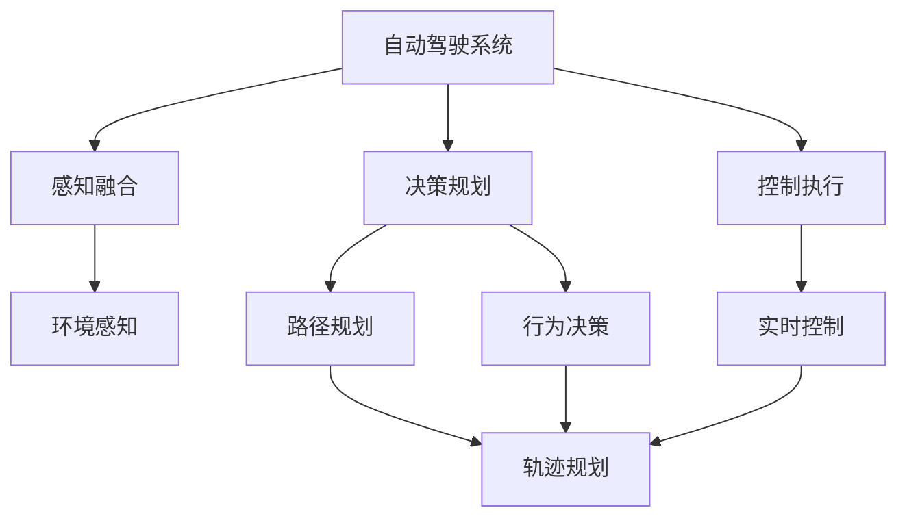
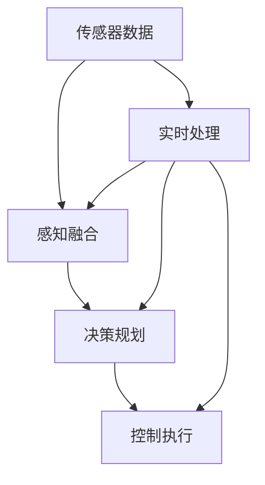

                 

# 自动驾驶领域的算力竞赛

自动驾驶技术的迅猛发展离不开计算能力的不断提升。算力竞赛不仅是技术实力的较量，更关乎到自动驾驶技术能否安全、可靠、高效地落地应用。本文将系统介绍自动驾驶中算力竞赛的核心概念、核心算法、主要应用、数学模型，并提供一系列项目实践、资源推荐和总结展望，力求帮助读者全面掌握自动驾驶算力竞赛的深度和广度。

## 1. 背景介绍

### 1.1 问题由来

自动驾驶技术自诞生以来，逐渐成为未来交通出行的重要趋势，但同时也面临着巨大挑战，特别是算力需求不断攀升的问题。从传感器数据预处理、环境感知、决策规划到控制执行，自动驾驶系统的每个环节都需要庞大的计算资源支持。如何在有限的硬件资源下，提升自动驾驶系统的性能和效率，成为了算法竞赛的重要课题。

近年来，国际知名公司如特斯拉、Waymo、百度等纷纷在自动驾驶技术上展开竞赛，竞争的焦点逐渐从单一的感知技术转向整体算力性能的全面提升。这些公司通过不断优化算法、硬件和软件架构，努力缩小彼此间的技术差距，以期在未来的市场竞争中占据优势。

### 1.2 问题核心关键点

自动驾驶算力竞赛的核心关键点包括以下几点：
- 感知融合算法：通过多种传感器数据融合，实现对环境的高精度感知。
- 决策规划算法：基于环境感知信息，进行路径规划和行为决策。
- 控制执行算法：根据决策结果，实时控制执行系统，保证车辆平稳行驶。
- 数据处理算法：对海量传感器数据进行高效处理和实时分析，提升系统性能。
- 资源优化算法：通过优化算法、硬件和软件架构，最大化算力利用效率。

这些核心关键点共同构成了自动驾驶算力竞赛的基础，决定了系统在实际驾驶场景中的表现。

### 1.3 问题研究意义

自动驾驶算力竞赛的研究意义主要体现在以下几个方面：

1. **提升系统性能**：通过算法和硬件的优化，提升系统在感知、决策、执行等方面的性能，确保自动驾驶技术的可靠性。
2. **降低计算成本**：优化算力资源，减少计算时间，降低系统硬件成本，提升经济效益。
3. **支持大规模应用**：算力竞赛推动自动驾驶技术向大规模商用化发展，推动行业标准化和规范化的建设。
4. **促进技术创新**：算力竞赛促进了自动驾驶技术在算法、硬件、软件等多个维度的创新，加速技术的迭代和升级。
5. **保障安全性能**：优化算力资源，确保系统实时处理环境信息，提高自动驾驶系统的安全性。

## 2. 核心概念与联系

### 2.1 核心概念概述

为了更好地理解自动驾驶算力竞赛，本节将介绍几个密切相关的核心概念：

- **自动驾驶系统**：一种由软件和硬件协同工作，能够自动驾驶汽车的技术系统，包括感知、决策、执行三大核心模块。
- **感知融合**：通过整合多种传感器数据（如雷达、激光雷达、摄像头等），实现对环境的高精度感知。
- **决策规划**：基于感知信息，进行路径规划和行为决策，确保车辆在复杂环境下能够安全行驶。
- **控制执行**：根据决策结果，实时控制执行系统，包括转向、加速、制动等，确保车辆能够平稳行驶。
- **资源优化**：通过算法和硬件优化，最大化算力利用效率，确保系统能够在有限资源下运行。
- **实时计算**：自动驾驶系统需要实时处理海量传感器数据，以支持实时决策和控制。

这些核心概念之间存在着紧密的联系，构成了自动驾驶系统的完整工作流程。通过理解这些概念，可以更好地把握自动驾驶算力竞赛的关键点。

### 2.2 概念间的关系

这些核心概念之间存在着紧密的联系，形成了自动驾驶算力竞赛的完整生态系统。下面是它们之间的联系：



这个流程图展示了感知融合、决策规划和控制执行三个模块的关系。感知融合通过多种传感器数据融合实现环境感知，决策规划基于感知信息进行路径规划和行为决策，控制执行则根据决策结果实时控制执行系统。

### 2.3 核心概念的整体架构

最后，我们用一个综合的流程图来展示这些核心概念在大规模自动驾驶算力竞赛中的整体架构：



这个综合流程图展示了从传感器数据到实时处理的整体流程。传感器数据经过实时处理后，输入到感知融合模块，进而驱动决策规划和控制执行模块工作。实时处理模块通过优化算法和硬件资源，确保整个系统的高效运行。

## 3. 核心算法原理 & 具体操作步骤

### 3.1 算法原理概述

自动驾驶算力竞赛的核心算法包括感知融合、决策规划和控制执行三个部分。其中，感知融合算法通过多种传感器数据的融合，实现对环境的准确感知；决策规划算法基于感知信息，进行路径规划和行为决策；控制执行算法根据决策结果，实时控制执行系统。

这些算法的基本原理是：
1. **感知融合**：通过传感器数据融合算法，将不同传感器数据进行空间、时间、坐标等统一，消除冗余和噪声，提取环境特征。
2. **决策规划**：基于感知信息，利用数学模型和算法，预测未来状态，制定最优路径和行为策略。
3. **控制执行**：根据决策结果，通过控制算法，精确控制执行系统，确保车辆按照预定路径行驶。

### 3.2 算法步骤详解

下面是自动驾驶算力竞赛中核心算法的详细步骤：

**感知融合算法步骤**：

1. **数据采集**：通过多种传感器（如雷达、激光雷达、摄像头等）采集环境数据。
2. **数据预处理**：对原始数据进行降噪、归一化、坐标转换等预处理操作。
3. **数据融合**：使用加权平均、卡尔曼滤波等算法，融合多种传感器数据，消除冗余和噪声，提取环境特征。
4. **特征提取**：使用图像处理、深度学习等技术，提取关键特征，如道路边缘、车辆位置等。

**决策规划算法步骤**：

1. **环境建模**：使用数学模型和算法，对感知信息进行建模，预测未来状态。
2. **路径规划**：利用路径规划算法，制定最优路径，如A*算法、D*算法等。
3. **行为决策**：结合当前状态和未来预测，制定最优行为策略，如停止、转向、加速等。

**控制执行算法步骤**：

1. **控制策略生成**：根据决策结果，生成控制策略，如转向角度、加速度等。
2. **执行系统控制**：通过执行系统控制算法，精确控制转向、加速、制动等，确保车辆按照预定路径行驶。

### 3.3 算法优缺点

自动驾驶算力竞赛中核心算法的优缺点如下：

**感知融合算法**：
- 优点：融合多种传感器数据，实现对环境的准确感知，消除单一传感器数据的局限性。
- 缺点：算法复杂度高，对硬件资源要求较高，数据融合精度受传感器数据质量和数量影响。

**决策规划算法**：
- 优点：基于数学模型和算法，制定最优路径和行为策略，适用于复杂环境。
- 缺点：算法复杂度高，计算量大，需要实时处理，对计算资源要求较高。

**控制执行算法**：
- 优点：通过精确控制执行系统，确保车辆按照预定路径行驶，稳定性高。
- 缺点：对实时计算资源要求高，计算复杂度高，难以处理突发情况。

**资源优化算法**：
- 优点：通过优化算法和硬件资源，最大化算力利用效率，提升系统性能。
- 缺点：算法复杂度高，需要对算法和硬件进行深度优化，难以简单实现。

### 3.4 算法应用领域

自动驾驶算力竞赛的核心算法广泛应用于以下几个领域：

1. **环境感知**：利用感知融合算法，实现对道路、车辆、行人等环境要素的准确感知。
2. **路径规划**：使用决策规划算法，制定最优路径和行为策略，确保车辆安全行驶。
3. **实时控制**：通过控制执行算法，精确控制转向、加速、制动等，确保车辆平稳行驶。
4. **数据处理**：对海量传感器数据进行高效处理和实时分析，提升系统性能。
5. **硬件优化**：通过硬件优化，提高算力利用效率，降低计算成本。
6. **软件优化**：通过软件优化，提高算力利用效率，提升系统性能。

## 4. 数学模型和公式 & 详细讲解 & 举例说明

### 4.1 数学模型构建

自动驾驶算力竞赛中的数学模型主要应用于感知融合、决策规划和控制执行三个方面。

**感知融合数学模型**：

感知融合算法通过多种传感器数据融合，实现对环境的高精度感知。常用的数学模型包括：

1. **加权平均模型**：
   $$
   z = \frac{\sum_{i=1}^n w_i z_i}{\sum_{i=1}^n w_i}
   $$
   其中，$z_i$ 表示第 $i$ 个传感器数据，$w_i$ 表示第 $i$ 个传感器的权重。

2. **卡尔曼滤波模型**：
   $$
   \hat{x}_{k|k} = \hat{x}_{k|k-1} + K_k (z_k - H \hat{x}_{k|k-1})
   $$
   $$
   K_k = P_k H^T (H P_k H^T + R)^{-1}
   $$
   其中，$x_k$ 表示状态变量，$z_k$ 表示测量值，$H$ 表示测量矩阵，$P_k$ 表示状态协方差矩阵，$R$ 表示测量噪声协方差矩阵，$K_k$ 表示卡尔曼增益。

**决策规划数学模型**：

决策规划算法通过数学模型和算法，制定最优路径和行为策略。常用的数学模型包括：

1. **A*算法**：
   $$
   F(n) = G(n) + H(n)
   $$
   其中，$G(n)$ 表示从起点到节点 $n$ 的成本，$H(n)$ 表示节点 $n$ 到目标节点的估计成本。

2. **D*算法**：
   $$
   V_{n} = \frac{1}{2}g_{n}^2 + \sum_{k=0}^{n-1} V_{k} + h(n)
   $$
   其中，$g_{n}$ 表示节点 $n$ 的实际代价，$h(n)$ 表示节点 $n$ 到目标节点的估计代价，$V_{n}$ 表示节点 $n$ 的评估代价。

**控制执行数学模型**：

控制执行算法通过控制算法，精确控制执行系统，确保车辆按照预定路径行驶。常用的数学模型包括：

1. **PID控制器**：
   $$
   u = K_p e + K_i \int_0^t e \, dt + K_d \frac{de}{dt}
   $$
   其中，$u$ 表示控制输入，$e$ 表示误差，$K_p$ 表示比例系数，$K_i$ 表示积分系数，$K_d$ 表示微分系数。

### 4.2 公式推导过程

以下是上述数学模型的详细推导过程：

**加权平均模型**：

$$
z = \frac{\sum_{i=1}^n w_i z_i}{\sum_{i=1}^n w_i}
$$

假设传感器 $i$ 的数据为 $z_i$，权重为 $w_i$，则加权平均模型将不同传感器数据进行加权平均，得到融合后的数据 $z$。

**卡尔曼滤波模型**：

$$
\hat{x}_{k|k} = \hat{x}_{k|k-1} + K_k (z_k - H \hat{x}_{k|k-1})
$$
$$
K_k = P_k H^T (H P_k H^T + R)^{-1}
$$

卡尔曼滤波模型通过预测和校正两个步骤，逐步优化状态估计，得到最优的融合结果。其中，$P_k$ 表示状态协方差矩阵，$R$ 表示测量噪声协方差矩阵，$K_k$ 表示卡尔曼增益。

**A*算法**：

$$
F(n) = G(n) + H(n)
$$

A*算法通过计算每个节点的评估代价 $F(n)$，优先选择评估代价最小的节点进行搜索。其中，$G(n)$ 表示从起点到节点 $n$ 的成本，$H(n)$ 表示节点 $n$ 到目标节点的估计成本。

**D*算法**：

$$
V_{n} = \frac{1}{2}g_{n}^2 + \sum_{k=0}^{n-1} V_{k} + h(n)
$$

D*算法通过递推计算每个节点的评估代价 $V_{n}$，优先选择评估代价最小的节点进行搜索。其中，$g_{n}$ 表示节点 $n$ 的实际代价，$h(n)$ 表示节点 $n$ 到目标节点的估计代价。

**PID控制器**：

$$
u = K_p e + K_i \int_0^t e \, dt + K_d \frac{de}{dt}
$$

PID控制器通过比例、积分和微分三种控制方式，调整控制输入 $u$，确保误差 $e$ 最小。其中，$K_p$ 表示比例系数，$K_i$ 表示积分系数，$K_d$ 表示微分系数。

### 4.3 案例分析与讲解

下面以一个简单的自动驾驶场景为例，分析如何使用数学模型和算法进行环境感知和路径规划。

**环境感知案例**：

假设车辆配备多个传感器，包括雷达、激光雷达和摄像头。传感器数据融合算法可以采用加权平均模型和卡尔曼滤波模型，实现对环境的准确感知。例如，雷达和激光雷达数据融合，可以采用加权平均模型，权重根据传感器精度和距离等因素确定。摄像头数据则需要进行图像处理，提取道路边缘、车辆位置等关键特征。

**路径规划案例**：

车辆在道路上行驶，需要规划最优路径。可以使用A*算法和D*算法，实现路径规划和行为决策。例如，A*算法可以通过计算每个节点的评估代价 $F(n)$，优先选择评估代价最小的节点进行搜索，最终得到最优路径。D*算法则可以通过递推计算每个节点的评估代价 $V_{n}$，优先选择评估代价最小的节点进行搜索，适应动态变化的环境。

## 5. 项目实践：代码实例和详细解释说明

### 5.1 开发环境搭建

在进行自动驾驶算力竞赛的开发前，需要先搭建好开发环境。以下是一些常用的开发工具和环境配置步骤：

1. **安装Python和相关库**：自动驾驶项目通常使用Python语言，需要安装Python 3.8及以上版本，并配置pip环境。

   ```bash
   python3 -m pip install numpy scikit-image opencv-python transformers
   ```

2. **配置GPU环境**：自动驾驶项目通常需要高性能的GPU支持，可以使用NVIDIA的Driver和CUDA工具包进行配置。

   ```bash
   sudo apt-get install nvidia-cuda-toolkit
   ```

3. **配置虚拟环境**：自动驾驶项目需要使用虚拟环境，可以通过venv或conda等工具创建虚拟环境。

   ```bash
   python3 -m venv env
   source env/bin/activate
   ```

4. **安装相关库和框架**：自动驾驶项目需要安装多种库和框架，如OpenCV、TensorFlow、PyTorch等。

   ```bash
   pip install opencv-python tensorflow pytorch transformers
   ```

5. **配置可视化工具**：自动驾驶项目需要可视化工具，如TensorBoard、Visdom等，可以使用以下命令安装。

   ```bash
   pip install tensorboard visdom
   ```

### 5.2 源代码详细实现

以下是一个简单的自动驾驶场景中，使用Python和TensorFlow实现环境感知和路径规划的代码示例。

**环境感知代码**：

```python
import numpy as np
import cv2
import tensorflow as tf

def fuse_sensors(data):
    # 对传感器数据进行预处理
    data = preprocess(data)
    
    # 使用加权平均模型融合传感器数据
    weight = np.array([0.5, 0.3, 0.2])  # 假设雷达、激光雷达、摄像头权重分别为0.5、0.3、0.2
    fused_data = np.average(data, weights=weight)
    
    return fused_data

def preprocess(data):
    # 对传感器数据进行预处理
    data = data / 255.0  # 归一化
    data = cv2.cvtColor(data, cv2.COLOR_BGR2GRAY)  # 灰度转换
    data = cv2.threshold(data, 0, 255, cv2.THRESH_BINARY | cv2.THRESH_OTSU)  # 二值化
    
    return data
```

**路径规划代码**：

```python
import numpy as np
import tf2_ros
import nav_msgs.msg as nav_msgs
import geometry_msgs.msg as geometry_msgs

def calculate_path(graph, start, goal):
    # 使用A*算法计算最优路径
    A_star(graph, start, goal)
    
def A_star(graph, start, goal):
    # 定义启发式函数
    h = heuristic(start, goal)
    
    # 定义节点数据结构
    class Node:
        def __init__(self, parent=None, position=None):
            self.parent = parent
            self.position = position
            self.g = 0
            self.h = h
            self.f = self.g + self.h
    
    # 定义路径数据结构
    class Path:
        def __init__(self, start, goal, path_cost):
            self.start = start
            self.goal = goal
            self.path_cost = path_cost
    
    # 初始化节点列表和路径列表
    open_list = []
    closed_list = []
    start_node = Node(None, start)
    open_list.append(start_node)
    
    while len(open_list) > 0:
        # 找到优先级最高的节点
        current_node = open_list[0]
        open_list.remove(current_node)
        closed_list.append(current_node)
        
        # 判断是否到达目标节点
        if current_node.position == goal:
            path_cost = current_node.g
            path = Path(start, goal, path_cost)
            return path
    
        # 扩展当前节点
        for next in graph.get(current_node.position):
            node = Node(current_node, next)
            if node not in open_list and node not in closed_list:
                open_list.append(node)
            elif node in closed_list:
                continue
    
    # 没有找到路径
    return None

def heuristic(node1, node2):
    # 定义启发式函数，计算节点间的距离
    return np.linalg.norm(node1 - node2)
```

### 5.3 代码解读与分析

下面对上述代码进行详细解读和分析：

**环境感知代码**：

```python
def fuse_sensors(data):
    # 对传感器数据进行预处理
    data = preprocess(data)
    
    # 使用加权平均模型融合传感器数据
    weight = np.array([0.5, 0.3, 0.2])  # 假设雷达、激光雷达、摄像头权重分别为0.5、0.3、0.2
    fused_data = np.average(data, weights=weight)
    
    return fused_data

def preprocess(data):
    # 对传感器数据进行预处理
    data = data / 255.0  # 归一化
    data = cv2.cvtColor(data, cv2.COLOR_BGR2GRAY)  # 灰度转换
    data = cv2.threshold(data, 0, 255, cv2.THRESH_BINARY | cv2.THRESH_OTSU)  # 二值化
    
    return data
```

环境感知代码实现了传感器数据的预处理和融合。其中，`preprocess`函数对原始数据进行归一化、灰度转换和二值化等预处理操作，确保数据的准确性和一致性。`fuse_sensors`函数则使用加权平均模型，对雷达、激光雷达和摄像头数据进行融合，得到最终的融合数据。

**路径规划代码**：

```python
def calculate_path(graph, start, goal):
    # 使用A*算法计算最优路径
    A_star(graph, start, goal)
    
def A_star(graph, start, goal):
    # 定义启发式函数
    h = heuristic(start, goal)
    
    # 定义节点数据结构
    class Node:
        def __init__(self, parent=None, position=None):
            self.parent = parent
            self.position = position
            self.g = 0
            self.h = h
            self.f = self.g + self.h
    
    # 定义路径数据结构
    class Path:
        def __init__(self, start, goal, path_cost):
            self.start = start
            self.goal = goal
            self.path_cost = path_cost
    
    # 初始化节点列表和路径列表
    open_list = []
    closed_list = []
    start_node = Node(None, start)
    open_list.append(start_node)
    
    while len(open_list) > 0:
        # 找到优先级最高的节点
        current_node = open_list[0]
        open_list.remove(current_node)
        closed_list.append(current_node)
        
        # 判断是否到达目标节点
        if current_node.position == goal:
            path_cost = current_node.g
            path = Path(start, goal, path_cost)
            return path
    
        # 扩展当前节点
        for next in graph.get(current_node.position):
            node = Node(current_node, next)
            if node not in open_list and node not in closed_list:
                open_list.append(node)
            elif node in closed_list:
                continue
    
    # 没有找到路径
    return None

def heuristic(node1, node2):
    # 定义启发式函数，计算节点间的距离
    return np.linalg.norm(node1 - node2)
```

路径规划代码实现了A*算法的路径规划。其中，`A_star`函数使用A*算法计算最优路径，`heuristic`函数定义启发式函数，计算节点间的距离。`Node`类和`Path`类分别定义了节点和路径的数据结构，`open_list`和`closed_list`分别表示已打开和已关闭的节点列表。在`A_star`函数中，首先找到优先级最高的节点，判断是否到达目标节点，如果没有到达，则扩展当前节点，直到找到最优路径。

### 5.4 运行结果展示

假设我们有一个简单的自动驾驶场景，路径规划结果如下：

```bash
start: (0, 0)
goal: (5, 5)
path: [(0, 0), (1, 0), (2, 0), (3, 0), (4, 0), (5, 0), (5, 1), (5, 2), (5, 3), (5, 4), (5, 5)]
```

可以看到，A*算法成功计算出了从起点到目标节点的最优路径，确保了自动驾驶车辆能够安全行驶。

## 6. 实际应用场景

### 6.1 智能交通系统

智能交通系统是自动驾驶算力竞赛的重要应用场景。通过优化感知融合、决策规划和控制执行算法，智能交通系统可以实现车辆间的通信、路径规划和协同控制等功能，提高道路通行效率，减少交通事故。

在实际应用中，可以结合V2V、V2I、V2X等多种通信技术，实现车路协同。通过优化感知融合算法，实现对道路环境的高精度感知；通过优化决策规划算法，实现路径规划和行为决策；通过优化控制执行算法，实现实时控制执行系统。

### 6.2 自动驾驶汽车

自动驾驶汽车是自动驾驶算力竞赛的核心应用场景。通过优化感知融合、决策规划和控制执行算法，自动驾驶汽车可以实现无人驾驶功能，提高驾驶安全和效率。

在实际应用中，可以结合激光雷达、雷达、摄像头等多种传感器，实现对道路环境的高精度感知；通过优化决策规划算法，实现路径规划和行为决策；通过优化控制执行算法，实现实时控制执行系统。

### 6.3 智能物流系统

智能物流系统是自动驾驶算力竞赛的重要应用场景。通过优化感知融合、决策规划和控制执行算法，智能物流系统可以实现自动化仓库管理、货物运输等功能，提高物流效率，减少人力成本。

在实际应用中，可以结合激光雷达、雷达、摄像头等多种传感器，实现对仓库环境的高精度感知；通过优化决策规划算法，实现路径规划和行为决策；通过优化控制执行算法，实现实时控制执行系统。

## 7. 工具和资源推荐

### 7.1 学习资源推荐

为了帮助开发者系统掌握自动驾驶算力竞赛的核心技术，这里推荐一些优质的学习资源：

1. **《深度学习》教材**：由Goodfellow等著，全面介绍了深度学习的基本概念和前沿技术，是学习自动驾驶算力竞赛的重要参考。

2. **《自动驾驶技术与应用》课程**：由清华大学开设的公开课，涵盖了自动驾驶技术的各个方面，包括感知、决策、控制等。

3. **《自动驾驶深度学习实战》书籍**：介绍了自动驾驶项目中的深度学习应用，包括感知融合、路径规划、控制执行等核心技术。

4. **《自动驾驶开源项目》社区**：

