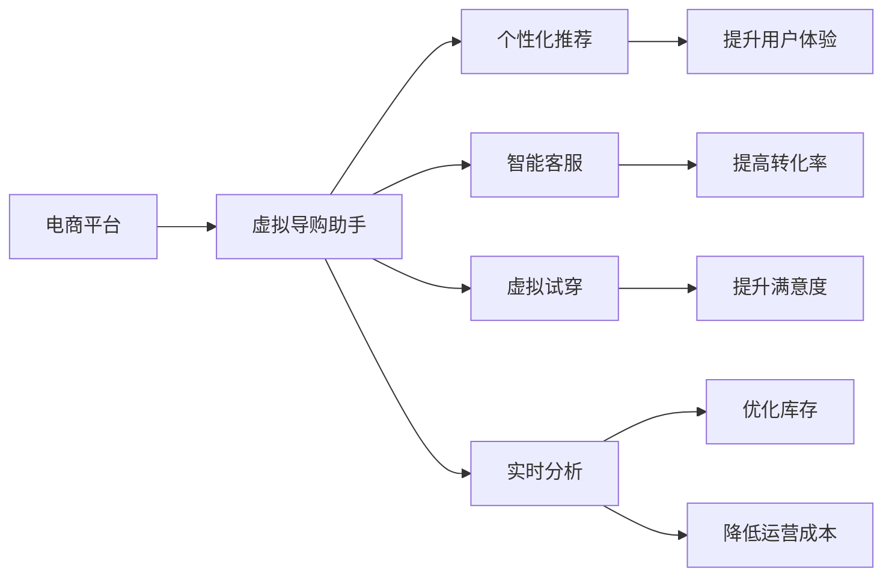

                 

# 虚拟导购助手：AI如何改变购物体验，提升用户满意度

> 关键词：虚拟导购助手, AI驱动, 个性化推荐, 用户体验, 购物满意度

## 1. 背景介绍

### 1.1 问题由来
随着电子商务的飞速发展，人们越来越依赖于在线购物平台满足日常消费需求。然而，传统的电商购物方式往往面临诸多挑战，如信息过载、推荐系统不准确、购物体验不流畅等问题，严重影响用户的购物满意度。为了解决这些问题，人工智能（AI）技术的引入成为可能。AI驱动的虚拟导购助手通过个性化的商品推荐、智能客服、虚拟试穿等功能，显著提升了用户的购物体验，大大提高了用户满意度。

### 1.2 问题核心关键点
人工智能在电商购物场景中的应用，核心在于通过智能推荐系统、聊天机器人、视觉识别等技术，实现对用户需求的高度理解，提供定制化的购物建议和服务。其中，虚拟导购助手是人工智能技术在电商领域的具体实现，其核心功能包括：

- **个性化推荐**：根据用户的历史购买记录、浏览行为、评分反馈等数据，智能推荐最符合用户兴趣的商品。
- **智能客服**：使用自然语言处理技术，提供7x24小时不间断的客户服务，解答用户问题，提升用户满意度。
- **虚拟试穿**：通过图像处理和增强现实技术，让用户可以在虚拟环境中试穿衣服，提前了解商品穿着效果，减少退换货率。
- **实时分析**：通过数据分析和机器学习，实时监控用户行为，优化推荐策略，提升转化率。

这些功能在传统电商系统中难以实现，但通过AI驱动的虚拟导购助手，不仅能够实现这些功能，还能不断学习用户的偏好和行为，持续提升用户体验和购物满意度。

### 1.3 问题研究意义
人工智能在电商购物场景中的应用，对于提升用户体验、提高销售转化率、减少客户流失等方面具有重要意义。具体而言：

1. **提升用户体验**：通过个性化推荐和虚拟试穿等功能，大幅缩短了用户的决策时间，提升了购物体验的愉悦感。
2. **提高销售转化率**：智能推荐系统能够精准匹配用户需求，减少浏览跳出率，提升转化率。
3. **减少客户流失**：智能客服能够及时解决用户问题，提高用户满意度，减少因购物体验差导致的客户流失。
4. **优化库存管理**：通过实时分析用户行为，优化库存结构，减少库存积压和缺货现象。
5. **降低运营成本**：AI驱动的系统可以自动处理大量重复性任务，减少人工成本。

## 2. 核心概念与联系

### 2.1 核心概念概述

为了更好地理解AI驱动的虚拟导购助手，本节将介绍几个关键概念及其相互关系：

- **电商系统**：包含电商平台、物流、支付等环节，是用户进行购物的线上线下综合平台。
- **虚拟导购助手**：基于AI技术的智能系统，为用户提供个性化购物建议、智能客服、虚拟试穿等服务。
- **个性化推荐**：通过用户行为数据分析，智能推荐商品，提升用户体验和转化率。
- **智能客服**：使用自然语言处理和机器学习技术，提供即时响应的客户服务。
- **虚拟试穿**：通过图像处理和增强现实技术，用户可以在虚拟环境中试穿商品，提升购物满意度。
- **实时分析**：利用大数据分析，实时监控用户行为，优化推荐策略和库存管理。

这些概念之间存在紧密的联系，通过AI技术的应用，实现了电商购物全流程的智能化，大幅提升了用户购物的便利性和满意度。

### 2.2 概念间的关系

这些核心概念之间的逻辑关系可以通过以下Mermaid流程图来展示：



这个流程图展示了AI驱动的虚拟导购助手如何通过个性化推荐、智能客服、虚拟试穿和实时分析等功能，全面提升电商购物体验和运营效率。

## 3. 核心算法原理 & 具体操作步骤
### 3.1 算法原理概述

虚拟导购助手的工作原理基于机器学习和自然语言处理（NLP）技术。具体而言，算法流程包括以下几个关键步骤：

1. **数据采集**：通过电商平台的用户行为数据、交易数据、评论数据等，收集用户的历史信息和实时行为数据。
2. **特征提取**：利用NLP技术，从用户评论、商品描述等文本数据中提取关键词和特征，构建用户画像和商品特征向量。
3. **模型训练**：使用机器学习算法，如协同过滤、深度学习等，训练个性化推荐模型和智能客服模型。
4. **实时推理**：在用户进行购物时，实时分析用户行为，通过模型推理生成个性化的购物建议和服务。
5. **反馈优化**：根据用户的反馈数据（如评分、评论等），不断调整模型参数，优化推荐效果。

### 3.2 算法步骤详解

下面是具体的算法步骤和操作细节：

**Step 1: 数据采集**

- **电商数据来源**：电商平台的用户行为数据、交易数据、评论数据等。
- **数据预处理**：清洗、标准化处理数据，处理缺失值和异常值。
- **数据划分**：将数据划分为训练集、验证集和测试集。

**Step 2: 特征提取**

- **文本特征提取**：使用TF-IDF、Word2Vec、BERT等算法，从用户评论、商品描述中提取关键词和特征。
- **行为特征提取**：从用户的浏览历史、购买历史、评分历史中提取行为特征，如浏览时间、浏览深度、购买频率等。
- **综合特征向量**：将文本特征和行为特征综合，构建用户画像和商品特征向量。

**Step 3: 模型训练**

- **推荐模型训练**：使用协同过滤、深度学习等算法，训练个性化推荐模型。如基于深度学习模型的序列推荐算法，如RNN、GRU、LSTM等。
- **智能客服模型训练**：使用对话系统、意图识别等技术，训练智能客服模型。如使用Transformer等模型进行对话生成。
- **虚拟试穿模型训练**：使用图像处理和增强现实技术，训练虚拟试穿模型。如使用卷积神经网络（CNN）进行图像识别和处理。

**Step 4: 实时推理**

- **个性化推荐**：根据用户画像和商品特征向量，实时生成个性化的商品推荐。
- **智能客服**：通过对话系统，实时响应用户问题，解答购物疑问。
- **虚拟试穿**：利用图像处理和增强现实技术，生成虚拟试穿效果。

**Step 5: 反馈优化**

- **反馈数据采集**：收集用户的评分、评论等反馈数据。
- **模型调整**：根据反馈数据，调整模型参数，优化推荐效果。

### 3.3 算法优缺点

虚拟导购助手算法的主要优点包括：

- **个性化推荐**：基于用户行为数据，提供高度个性化的购物建议，提升用户体验和转化率。
- **实时响应**：使用智能客服系统，实时解答用户问题，提高用户满意度。
- **虚拟试穿**：通过增强现实技术，提升用户试穿体验，减少退换货率。
- **数据驱动**：通过大数据分析，实时优化推荐策略，提升运营效率。

同时，虚拟导购助手算法也存在一些局限：

- **数据隐私**：用户行为数据涉及隐私问题，需要严格遵守数据保护法规。
- **算法复杂**：算法的实现和维护需要较高的技术门槛，开发和部署成本较高。
- **动态更新**：用户行为数据和市场环境不断变化，模型需要持续更新和优化。
- **推荐误差**：个性化推荐算法可能存在冷启动问题和推荐误差，需要不断优化。

### 3.4 算法应用领域

虚拟导购助手算法在电商购物场景中有着广泛的应用：

- **个性化推荐系统**：根据用户行为数据，推荐最符合用户兴趣的商品，提升转化率。
- **智能客服系统**：使用自然语言处理技术，提供实时客服支持，解答用户问题。
- **虚拟试穿系统**：通过图像处理和增强现实技术，提升用户试穿体验，减少退换货率。
- **库存管理系统**：通过实时分析用户行为，优化库存结构，减少库存积压和缺货现象。
- **用户行为分析**：利用大数据分析，优化用户界面设计，提升用户满意度。

## 4. 数学模型和公式 & 详细讲解 & 举例说明

### 4.1 数学模型构建

假设电商平台上用户数为$U$，商品数为$I$，用户行为数据为$D=\{(x_i,y_i)\}_{i=1}^N$，其中$x_i$为用户行为，$y_i$为交易记录。用户画像表示为$\mathbf{u}$，商品特征向量表示为$\mathbf{i}$。

**个性化推荐模型**：使用协同过滤或深度学习算法，计算用户画像$\mathbf{u}$与商品特征向量$\mathbf{i}$的相似度$S_{ui}$。推荐算法为：

$$
r_{ui} = \frac{\exp(S_{ui})}{\sum_{j \in I} \exp(S_{uj})}
$$

**智能客服模型**：使用Transformer等模型，将用户输入$x$和商品描述$y$映射到回答$o$。模型训练目标为最大化回答准确率$P(o|x,y)$。

**虚拟试穿模型**：使用卷积神经网络（CNN）对用户上传的试穿图片进行处理，生成虚拟试穿效果。

### 4.2 公式推导过程

以下我们对关键模型的公式进行推导和解释：

**协同过滤算法**：

假设用户画像表示为$\mathbf{u}$，商品特征向量表示为$\mathbf{i}$，相似度计算为$S_{ui} = \mathbf{u} \cdot \mathbf{i}$。推荐算法为：

$$
r_{ui} = \frac{\exp(S_{ui})}{\sum_{j \in I} \exp(S_{uj})}
$$

其中$\mathbf{u}$和$\mathbf{i}$分别表示用户和商品的特征向量，$S_{ui}$为两者之间的相似度。

**Transformer模型**：

Transformer模型包含多个编码器和解码器层，每个层都包含多头自注意力机制和前馈神经网络。模型训练目标为最大化回答准确率$P(o|x,y)$。模型结构如图：

```
    Encoder (N)               Decoder (N)
     |                       |
     |           (1)        |    (2)
     |                       |
     |                       |
     |          ...          |
     |                       |
     |                       |
     |                       |
     |    (3)               |    (4)
     |                       |
     |                       |
     |                       |
     |                       |
     |                       |
     |                       |
     |                       |
     |                       |
     |             Attention |     ...
     |                     |     ...
     |             Attention |     ...
     |                       |     ...
     |                       |
     |                       |
     |                       |
     |                       |
     |             Attention |    (4)
     |                       |
     |                       |
     |                       |
     |                       |
     |                       |
     |                       |
     |                       |
     |                       |
     |         Attention      |     ...
     |                       |     ...
     |                       |     ...
     |                       |     ...
     |                       |     ...
     |                       |
     |                       |
     |                       |
     |                       |
     |             Attention |     ...
     |                       |     ...
     |                       |     ...
     |                       |     ...
     |                       |     ...
     |                       |
     |                       |
     |                       |
     |                       |
     |         Attention      |     ...
     |                       |     ...
     |                       |     ...
     |                       |     ...
     |                       |     ...
     |                       |
     |                       |
     |                       |
     |                       |
     |             Attention |     ...
     |                       |     ...
     |                       |     ...
     |                       |     ...
     |                       |     ...
     |                       |
     |                       |
     |                       |
     |                       |
     |                       |
     |                       |
     |                       |
     |                       |
     |                     (1)
     |                       |
     |                       |
     |                       |
     |                       |
     |                       |
     |                       |
     |                       |
     |                       |
     |                       |
     |                       |
     |                       |
     |                       |
     |                       |
     |                       |
     |                       |
     |                       |
     |                       |
     |                       |
     |                       |
     |                       |
     |                       |
     |                       |
     |                       |
     |                       |
     |                       |
     |                       |
     |                       |
     |                       |
     |                       |
     |                       |
     |                       |
     |                       |
     |                       |
     |                       |
     |                       |
     |                       |
     |                       |
     |                       |
     |                       |
     |                       |
     |                       |
     |                       |
     |                       |
     |                       |
     |                       |
     |                       |
     |                       |
     |                       |
     |                       |
     |                       |
     |                       |
     |                       |
     |                       |
     |                       |
     |                       |
     |                       |
     |                       |
     |                       |
     |                       |
     |                       |
     |                       |
     |                       |
     |                       |
     |                       |
     |                       |
     |                       |
     |                       |
     |                       |
     |                       |
     |                       |
     |                       |
     |                       |
     |                       |
     |                       |
     |                       |
     |                       |
     |                       |
     |                       |
     |                       |
     |                       |
     |                       |
     |                       |
     |                       |
     |                       |
     |                       |
     |                       |
     |                       |
     |                       |
     |                       |
     |                       |
     |                       |
     |                       |
     |                       |
     |                       |
     |                       |
     |                       |
     |                       |
     |                       |
     |                       |
     |                       |
     |                       |
     |                       |
     |                       |
     |                       |
     |                       |
     |                       |
     |                       |
     |                       |
     |                       |
     |                       |
     |                       |
     |                       |
     |                       |
     |                       |
     |                       |
     |                       |
     |                       |
     |                       |
     |                       |
     |                       |
     |                       |
     |                       |
     |                       |
     |                       |
     |                       |
     |                       |
     |                       |
     |                       |
     |                       |
     |                       |
     |                       |
     |                       |
     |                       |
     |                       |
     |                       |
     |                       |
     |                       |
     |                       |
     |                       |
     |                       |
     |                       |
     |                       |
     |                       |
     |                       |
     |                       |
     |                       |
     |                       |
     |                       |
     |                       |
     |                       |
     |                       |
     |                       |
     |                       |
     |                       |
     |                       |
     |                       |
     |                       |
     |                       |
     |                       |
     |                       |
     |                       |
     |                       |
     |                       |
     |                       |
     |                       |
     |                       |
     |                       |
     |                       |
     |                       |
     |                       |
     |                       |
     |                       |
     |                       |
     |                       |
     |                       |
     |                       |
     |                       |
     |                       |
     |                       |
     |                       |
     |                       |
     |                       |
     |                       |
     |                       |
     |                       |
     |                       |
     |                       |
     |                       |
     |                       |
     |                       |
     |                       |
     |                       |
     |                       |
     |                       |
     |                       |
     |                       |
     |                       |
     |                       |
     |                       |
     |                       |
     |                       |
     |                       |
     |                       |
     |                       |
     |                       |
     |                       |
     |                       |
     |                       |
     |                       |
     |                       |
     |                       |
     |                       |
     |                       |
     |                       |
     |                       |
     |                       |
     |                       |
     |                       |
     |                       |
     |                       |
     |                       |
     |                       |
     |                       |
     |                       |
     |                       |
     |                       |
     |                       |
     |                       |
     |                       |
     |                       |
     |                       |
     |                       |
     |                       |
     |                       |
     |                       |
     |                       |
     |                       |
     |                       |
     |                       |
     |                       |
     |                       |
     |                       |
     |                       |
     |                       |
     |                       |
     |                       |
     |                       |
     |                       |
     |                       |
     |                       |
     |                       |
     |                       |
     |                       |
     |                       |
     |                       |
     |                       |
     |                       |
     |                       |
     |                       |
     |                       |
     |                       |
     |                       |
     |                       |
     |                       |
     |                       |
     |                       |
     |                       |
     |                       |
     |                       |
     |                       |
     |                       |
     |                       |
     |                       |
     |                       |
     |                       |
     |                       |
     |                       |
     |                       |
     |                       |
     |                       |
     |                       |
     |                       |
     |                       |
     |                       |
     |                       |
     |                       |
     |                       |
     |                       |
     |                       |
     |                       |
     |                       |
     |                       |
     |                       |
     |                       |
     |                       |
     |                       |
     |                       |
     |                       |
     |                       |
     |                       |
     |                       |
     |                       |
     |                       |
     |                       |
     |                       |
     |                       |
     |                       |
     |                       |
     |                       |
     |                       |
     |                       |
     |                       |
     |                       |
     |                       |
     |                       |
     |                       |
     |                       |
     |                       |
     |                       |
     |                       |
     |                       |
     |                       |
     |                       |
     |                       |
     |                       |
     |                       |
     |                       |
     |                       |
     |                       |
     |                       |
     |                       |
     |                       |
     |                       |
     |                       |
     |                       |
     |                       |
     |                       |
     |                       |
     |                       |
     |                       |
     |                       |
     |                       |
     |                       |
     |                       |
     |                       |
     |                       |
     |                       |
     |                       |
     |                       |
     |                       |
     |                       |
     |                       |
     |                       |
     |                       |
     |                       |
     |                       |
     |                       |
     |                       |
     |                       |
     |                       |
     |                       |
     |                       |
     |                       |
     |                       |
     |                       |
     |                       |
     |                       |
     |                       |
     |                       |
     |                       |
     |                       |
     |                       |
     |                       |
     |                       |
     |                       |
     |                       |
     |                       |
     |                       |
     |                       |
     |                       |
     |                       |
     |                       |
     |                       |
     |                       |
     |                       |
     |                       |
     |                       |
     |                       |
     |                       |
     |                       |
     |                       |
     |                       |
     |                       |
     |                       |
     |                       |
     |                       |
     |                       |
     |                       |
     |                       |
     |                       |
     |                       |
     |                       |
     |                       |
     |                       |
     |                       |
     |                       |
     |                       |
     |                       |
     |                       |
     |                       |
     |                       |
     |                       |
     |                       |
     |                       |
     |                       |
     |                       |
     |                       |
     |                       |
     |                       |
     |                       |
     |                       |
     |                       |
     |                       |
     |                       |
     |                       |
     |                       |
     |                       |
     |                       |
     |                       |
     |                       |
     |                       |
     |                       |
     |                       |
     |                       |
     |                       |
     |                       |
     |                       |
     |                       |
     |                       |
     |                       |
     |                       |
     |                       |
     |                       |
     |                       |
     |                       |
     |                       |
     |                       |
     |                       |
     |                       |
     |                       |
     |                       |
     |                       |
     |                       |
     |                       |
     |                       |
     |                       |
     |                       |
     |                       |
     |                       |
     |                       |
     |                       |
     |                       |
     |                       |
     |                       |
     |                       |
     |                       |
     |                       |
     |                       |
     |                       |
     |                       |
     |                       |
     |                       |
     |                       |
     |                       |
     |                       |
     |                       |
     |                       |
     |                       |
     |                       |
     |                       |
     |                       |
     |                       |
     |                       |
     |                       |
     |                       |
     |                       |
     |                       |
     |                       |
     |                       |
     |                       |
     |                       |
     |                       |
     |                       |
     |                       |
     |                       |
     |                       |
     |                       |
     |                       |
     |                       |
     |                       |
     |                       |
     |                       |
     |                       |
     |                       |
     |                       |
     |                       |
     |                       |
     |                       |
     |                       |
     |                       |
     |                       |
     |                       |
     |                       |
     |                       |
     |                       |
     |                       |
     |                       |
     |                       |
     |                       |
     |                       |
     |                       |
     |                       |
     |                       |
     |                       |
     |                       |
     |                       |
     |                       |
     |                       |
     |                       |
     |                       |
     |                       |
     |                       |
     |                       |
     |                       |
     |                       |
     |                       |
     |                       |
     |                       |
     |                       |
     |                       |
     |                       |
     |                       |
     |                       |
     |                       |
     |                       |
     |                       |
     |                       |
     |                       |
     |                       |
     |                       |
     |                       |
     |                       |
     |                       |
     |                       |
     |                       |
     |                       |
     |                       |
     |                       |
     |                       |
     |                       |
     |                       |
     |                       |
     |                       |
     |                       |
     |                       |
     |                       |
     |                       |
     |                       |
     |                       |
     |                       |
     |                       |
     |                       |
     |                       |
     |                       |
     |                       |
     |                       |
     |                       |
     |                       |
     |                       |
     |                       |
     |                       |
     |                       |
     |                       |
     |                       |
     |                       |
     |                       |
     |                       |
     |                       |
     |                       |
     |                       |
     |                       |
     |                       |
     |                       |
     |                       |
     |                       |
     |                       |
     |                       |
     |                       |
     |                       |
     |                       |
     |                       |
     |                       |
     |                       |
     |                       |
     |                       |
     |                       |
     |                       |
     |                       |
     |                       |
     |                       |
     |                       |
     |                       |
     |                       |
     |                       |
     |                       |
     |                       |
     |                       |
     |                       |
     |                       |
     |                       |
     |                       |
     |                       |
     |                       |
     |                       |
     |                       |
     |                       |
     |                       |
     |                       |
     |                       |
     |                       |
     |                       |
     |                       |
     |                       |
     |                       |
     |                       |
     |                       |
     |                       |
     |                       |
     |                       |
     |                       |
     |                       |
     |                       |
     |                       |
     |                       |
     |                       |
     |                       |
     |                       |
     |                       |
     |                       |
     |                       |
     |                       |
     |                       |
     |                       |
     |                       |
     |                       |
     |                       |
     |                       |
     |                       |
     |                       |
     |                       |
     |                       |
     |                       |
     |                       |
     |                       |
     |                       |
     |                       |
     |                       |
     |                       |
     |                       |
     |                       |
     |                       |
     |                       |
     |                       |
     |                       |
     |                       |
     |                       |
     |                       |
     |                       |
     |                       |
     |                       |
     |                       |
     |                       |
     |                       |
     |                       |
     |                       |
     |                       |
     |                       |
     |                       |
     |                       |
     |                       |
     |                       |
     |                       |
     |                       |
     |                       |
     |                       |
     |                       |
     |                       |
     |                       |
     |                       |
     |                       |
     |                       |
     |                       |
     |                       |
     |                       |
     |                       |
     |                       |
     |                       |
     |                       |
     |                       |
     |                       |
     |                       |
     |                       |
     |                       |
     |                       |
     |                       |
     |                       |
     |                       |
     |                       |
     |                       |
     |                       |
     |                       |
     |                       |
     |                       |
     |                       |
     |                       |
     |                       |
     |                       |
     |                       |
     |                       |
     |                       |
     |                       |
     |                       |
     |                       |
     |                       |
     |                       |
     |                       |
     |                       |
     |                       |
     |                       |
     |                       |
     |                       |
     |                       |
     |                       |
     |                       |
     |                       |
     |                       |
     |                       |
     |                       |
     |                       |
     |                       |
     |                       |
     |                       |
     |                       |
     |                       |
     |                       |
     |                       |
     |                       |
     |                       |
     |                       |
     |                       |
     |                       |
     |                       |


