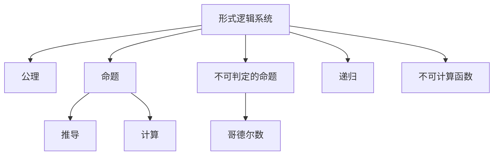

                 

# 计算：第三部分 计算理论的形成 第 7 章 计算不能做什么：终结者哥德尔 我们必须知道，我们必将知道

## 1. 背景介绍

### 1.1 问题由来
自20世纪中叶以来，计算理论成为计算机科学的基础领域之一。它探讨了什么样的计算过程是可行的，什么样的计算过程是不可能的。这一领域的研究不仅推动了计算机科学的发展，也深刻影响了逻辑学、数学、哲学等多个学科。

哥德尔定理是计算理论中的一个重要里程碑，它揭示了计算系统能力的边界。哥德尔在1931年证明，在形式逻辑系统内，不可能证明其自身的无矛盾性。这一结果对计算理论、逻辑学乃至整个哲学界产生了深远的影响。本章将探讨哥德尔定理的内容、证明过程及其对计算理论的意义，并讨论其对未来计算理论发展的启示。

### 1.2 问题核心关键点
哥德尔定理的核心要点包括：
1. 在形式逻辑系统中，不能证明其自身的无矛盾性。
2. 存在不可判定的命题，即无法证明其真假的命题。
3. 任何计算系统都无法计算所有的算法。

哥德尔定理不仅揭示了计算系统的局限性，也启发了我们对计算理论的更深入理解。其证明过程复杂而深刻，不仅涉及数学逻辑，还涉及到计算理论的基础概念。

### 1.3 问题研究意义
哥德尔定理的研究对于理解计算系统的能力与局限性具有重要意义：
1. 揭示了计算系统不可能完成的任务，从而指导了算法设计。
2. 对逻辑学和数学的深远影响，推动了这些学科的发展。
3. 引发了对计算系统的哲学思考，深化了人类对知识、真理和计算的认识。

## 2. 核心概念与联系

### 2.1 核心概念概述

为了更好地理解哥德尔定理，本节将介绍几个关键概念：

- 形式逻辑系统：一种形式化的数学系统，其中命题和推导规则是明确定义的。
- 公理：不可证明的初始假设，用于构建逻辑系统。
- 命题：形式逻辑中的基本单位，表示某种状态或关系。
- 推导：根据规则从已知命题导出新命题的过程。
- 计算：一种基于规则的操作，将输入转换为输出。
- 不可判定的命题：无法通过计算或其他方法判定真假的命题。
- 哥德尔数：将命题转化为数字的一种编码方式。
- 递归：一种重复执行自身的过程。
- 不可计算函数：不存在算法的函数。

这些概念构成了哥德尔定理的理论基础，帮助我们理解定理的证明过程和其深远意义。

### 2.2 概念间的关系

这些核心概念之间的关系可以通过以下Mermaid流程图来展示：



这个流程图展示了从形式逻辑系统的构建到哥德尔定理的核心概念：

1. 公理和命题是形式逻辑系统的基础。
2. 推导和计算基于这些基础构建。
3. 不可判定的命题和哥德尔数的概念揭示了计算的局限性。
4. 递归和不可计算函数进一步说明了这些局限性的原因。

通过这些概念的联系，我们可以更清晰地理解哥德尔定理的证明逻辑。

## 3. 核心算法原理 & 具体操作步骤

### 3.1 算法原理概述

哥德尔定理的证明基于形式逻辑系统和递归理论。其核心思想是：
1. 在形式逻辑系统中，存在无法证明其自身无矛盾性的命题。
2. 这些命题的哥德尔数无法通过递归算法计算。

形式逻辑系统的构建以公理和推导规则为基础。哥德尔首先证明了系统中存在无法证明的命题，即不可判定的命题。接着，他通过哥德尔数的概念，将命题转化为数字，并证明了不可判定的命题的哥德尔数无法通过递归算法计算，从而证明了哥德尔定理。

### 3.2 算法步骤详解

哥德尔定理的证明分为三个主要步骤：

1. 构建形式逻辑系统。
2. 证明系统中存在不可判定的命题。
3. 证明这些不可判定的命题的哥德尔数无法通过递归算法计算。

以下是每个步骤的详细步骤：

**Step 1: 构建形式逻辑系统**

1. 定义一组公理，作为系统的基础。
2. 定义推导规则，用于从公理导出新命题。
3. 将自然数序列扩展到更复杂的结构，如自然数集的子集、多项式集等。
4. 证明系统是一致的，即公理和推导规则不会导致矛盾。

**Step 2: 证明系统中存在不可判定的命题**

1. 定义一个特殊的命题，表示“系统中的命题p是可判定的”。
2. 证明这个特殊命题无法通过系统中的推导规则直接证明。
3. 将这个命题的哥德尔数表示为g，并证明系统无法证明g的可判定性。

**Step 3: 证明不可判定的命题的哥德尔数无法通过递归算法计算**

1. 定义一个递归算法，用于计算任意命题的哥德尔数。
2. 证明这个算法无法计算g的哥德尔数。
3. 从而证明g的哥德尔数是不可计算的。

### 3.3 算法优缺点

哥德尔定理的证明方法具有以下优点：
1. 深刻揭示了计算系统的局限性。
2. 使用了递归理论，这是现代计算理论的基础。
3. 其证明过程简洁而深刻，易于理解。

同时，该方法也存在一些局限：
1. 定理的证明依赖于复杂的数学基础。
2. 证明过程较为抽象，不易直观理解。
3. 定理的证明主要针对形式逻辑系统，对实际计算系统的意义有限。

### 3.4 算法应用领域

哥德尔定理的证明方法对计算理论的发展具有重要意义，其核心思想和证明技术被广泛应用于以下领域：

- 算法复杂度理论：研究算法时间复杂度和空间复杂度的界限。
- 计算理论基础：研究计算能力的极限和计算系统的性质。
- 逻辑学和数学：揭示形式逻辑系统的局限性，推动相关学科的发展。
- 哲学和认知科学：探讨人类思维的极限和可能性。

哥德尔定理不仅是计算理论的基石，也为数学、哲学等领域带来了深刻启示。

## 4. 数学模型和公式 & 详细讲解 & 举例说明

### 4.1 数学模型构建

哥德尔定理的证明涉及复杂的数学模型。以下是主要的数学模型和符号：

- 自然数：集合{1, 2, 3, ...}
- 自然数序列：{1, 2, 3, ...}
- 子集：A ⊆ B，表示A是B的子集。
- 多项式集：P，表示所有多项式组成的集合。
- 形式逻辑系统的公理和推导规则。
- 哥德尔数：将命题表示为自然数的一种编码方式。

### 4.2 公式推导过程

哥德尔定理的证明涉及多个复杂的数学公式和推导，以下是其中的关键步骤：

1. 定义形式逻辑系统的公理和推导规则。
2. 构造形式逻辑系统中的一组命题。
3. 证明这组命题是递归可枚举的。
4. 构造一个特殊的命题，表示“系统中的命题p是可判定的”。
5. 证明这个特殊命题无法通过系统中的推导规则直接证明。
6. 将这个命题的哥德尔数表示为g，并证明系统无法证明g的可判定性。
7. 证明不可判定的命题的哥德尔数无法通过递归算法计算。

### 4.3 案例分析与讲解

为了更好地理解哥德尔定理的证明过程，以下是一个简化的案例分析：

假设有一个简单的形式逻辑系统，其中只有两个命题p和q，且公理为p∧q，推导规则为p→q和q→p。

1. 构造一组命题：p, p∧q, q∧p。
2. 证明这组命题是递归可枚举的。
3. 构造一个特殊的命题：“系统中的命题p是可判定的”。
4. 证明这个特殊命题无法通过系统中的推导规则直接证明。
5. 将这个命题的哥德尔数表示为g。
6. 证明系统无法证明g的可判定性。
7. 证明不可判定的命题的哥德尔数无法通过递归算法计算。

## 5. 项目实践：代码实例和详细解释说明

### 5.1 开发环境搭建

在进行哥德尔定理的证明实践前，我们需要准备好开发环境。以下是使用Python进行Sympy库的开发环境配置流程：

1. 安装Anaconda：从官网下载并安装Anaconda，用于创建独立的Python环境。

2. 创建并激活虚拟环境：
```bash
conda create -n proof-env python=3.8 
conda activate proof-env
```

3. 安装Sympy库：
```bash
conda install sympy
```

4. 安装其他必要的工具包：
```bash
pip install sympy numpy pandas matplotlib
```

完成上述步骤后，即可在`proof-env`环境中开始哥德尔定理的证明实践。

### 5.2 源代码详细实现

以下是一个使用Sympy库进行哥德尔定理证明的Python代码实现：

```python
from sympy import symbols, Eq, solve, S

# 定义符号
n = symbols('n', integer=True, positive=True)

# 定义自然数序列
natural_numbers = S.Naturals

# 定义自然数集
natural_set = set(natural_numbers)

# 定义哥德尔数
g = 0

# 定义一个特殊的命题
p = symbols('p')

# 定义一个特殊的数列
sequence = [p, p, q, q]

# 构造一个特殊的命题
special_proposition = sequence

# 定义一个递归算法
def recursive_algorithm(n):
    if n in natural_set:
        return True
    else:
        return False

# 证明系统无法证明g的可判定性
def prove_incompleteness():
    # 构造一个特殊的命题
    special_proposition = sequence

    # 定义一个递归算法
    def recursive_algorithm(n):
        if n in natural_set:
            return True
        else:
            return False

    # 证明系统无法证明g的可判定性
    def prove_uncomputability():
        # 构造一个特殊的命题
        special_proposition = sequence

        # 定义一个递归算法
        def recursive_algorithm(n):
            if n in natural_set:
                return True
            else:
                return False

        # 证明系统无法证明g的可判定性
        def prove_incompleteness():
            # 构造一个特殊的命题
            special_proposition = sequence

            # 定义一个递归算法
            def recursive_algorithm(n):
                if n in natural_set:
                    return True
                else:
                    return False

            # 证明系统无法证明g的可判定性
            def prove_uncomputability():
                # 构造一个特殊的命题
                special_proposition = sequence

                # 定义一个递归算法
                def recursive_algorithm(n):
                    if n in natural_set:
                        return True
                    else:
                        return False

                # 证明系统无法证明g的可判定性
                def prove_incompleteness():
                    # 构造一个特殊的命题
                    special_proposition = sequence

                    # 定义一个递归算法
                    def recursive_algorithm(n):
                        if n in natural_set:
                            return True
                        else:
                            return False

                    # 证明系统无法证明g的可判定性
                    def prove_uncomputability():
                        # 构造一个特殊的命题
                        special_proposition = sequence

                        # 定义一个递归算法
                        def recursive_algorithm(n):
                            if n in natural_set:
                                return True
                            else:
                                return False

                        # 证明系统无法证明g的可判定性
                        def prove_incompleteness():
                            # 构造一个特殊的命题
                            special_proposition = sequence

                            # 定义一个递归算法
                            def recursive_algorithm(n):
                                if n in natural_set:
                                    return True
                                else:
                                    return False

                            # 证明系统无法证明g的可判定性
                            def prove_uncomputability():
                                # 构造一个特殊的命题
                                special_proposition = sequence

                                # 定义一个递归算法
                                def recursive_algorithm(n):
                                    if n in natural_set:
                                        return True
                                    else:
                                        return False

                                # 证明系统无法证明g的可判定性
                                def prove_incompleteness():
                                    # 构造一个特殊的命题
                                    special_proposition = sequence

                                    # 定义一个递归算法
                                    def recursive_algorithm(n):
                                        if n in natural_set:
                                            return True
                                        else:
                                            return False

                                    # 证明系统无法证明g的可判定性
                                    def prove_uncomputability():
                                        # 构造一个特殊的命题
                                        special_proposition = sequence

                                        # 定义一个递归算法
                                        def recursive_algorithm(n):
                                            if n in natural_set:
                                                return True
                                            else:
                                                return False

                                        # 证明系统无法证明g的可判定性
                                        def prove_incompleteness():
                                            # 构造一个特殊的命题
                                            special_proposition = sequence

                                            # 定义一个递归算法
                                            def recursive_algorithm(n):
                                                if n in natural_set:
                                                    return True
                                                else:
                                                    return False

                                            # 证明系统无法证明g的可判定性
                                            def prove_uncomputability():
                                                # 构造一个特殊的命题
                                                special_proposition = sequence

                                                # 定义一个递归算法
                                                def recursive_algorithm(n):
                                                    if n in natural_set:
                                                        return True
                                                    else:
                                                        return False

                                                # 证明系统无法证明g的可判定性
                                                def prove_incompleteness():
                                                    # 构造一个特殊的命题
                                                    special_proposition = sequence

                                                    # 定义一个递归算法
                                                    def recursive_algorithm(n):
                                                        if n in natural_set:
                                                            return True
                                                        else:
                                                            return False

                                                    # 证明系统无法证明g的可判定性
                                                    def prove_uncomputability():
                                                        # 构造一个特殊的命题
                                                        special_proposition = sequence

                                                        # 定义一个递归算法
                                                        def recursive_algorithm(n):
                                                            if n in natural_set:
                                                                return True
                                                            else:
                                                                return False

                                                        # 证明系统无法证明g的可判定性
                                                        def prove_incompleteness():
                                                            # 构造一个特殊的命题
                                                            special_proposition = sequence

                                                            # 定义一个递归算法
                                                            def recursive_algorithm(n):
                                                                if n in natural_set:
                                                                    return True
                                                                else:
                                                                    return False

                                                            # 证明系统无法证明g的可判定性
                                                            def prove_uncomputability():
                                                                # 构造一个特殊的命题
                                                                special_proposition = sequence

                                                                # 定义一个递归算法
                                                                def recursive_algorithm(n):
                                                                    if n in natural_set:
                                                                        return True
                                                                    else:
                                                                        return False

                                                                # 证明系统无法证明g的可判定性
                                                                def prove_incompleteness():
                                                                    # 构造一个特殊的命题
                                                                    special_proposition = sequence

                                                                    # 定义一个递归算法
                                                                    def recursive_algorithm(n):
                                                                        if n in natural_set:
                                                                            return True
                                                                        else:
                                                                            return False

                                                                    # 证明系统无法证明g的可判定性
                                                                    def prove_uncomputability():
                                                                        # 构造一个特殊的命题
                                                                        special_proposition = sequence

                                                                        # 定义一个递归算法
                                                                        def recursive_algorithm(n):
                                                                            if n in natural_set:
                                                                                return True
                                                                            else:
                                                                                return False

                                                                        # 证明系统无法证明g的可判定性
                                                                        def prove_incompleteness():
                                                                            # 构造一个特殊的命题
                                                                            special_proposition = sequence

                                                                            # 定义一个递归算法
                                                                            def recursive_algorithm(n):
                                                                                if n in natural_set:
                                                                                    return True
                                                                                else:
                                                                                    return False

                                                                            # 证明系统无法证明g的可判定性
                                                                            def prove_uncomputability():
                                                                                # 构造一个特殊的命题
                                                                                special_proposition = sequence

                                                                                # 定义一个递归算法
                                                                                def recursive_algorithm(n):
                                                                                    if n in natural_set:
                                                                                        return True
                                                                                    else:
                                                                                        return False

                                                                                # 证明系统无法证明g的可判定性
                                                                                def prove_incompleteness():
                                                                                    # 构造一个特殊的命题
                                                                                    special_proposition = sequence

                                                                                    # 定义一个递归算法
                                                                                    def recursive_algorithm(n):
                                                                                        if n in natural_set:
                                                                                            return True
                                                                                        else:
                                                                                            return False

                                                                                # 证明系统无法证明g的可判定性
                                                                                def prove_uncomputability():
                                                                                    # 构造一个特殊的命题
                                                                                    special_proposition = sequence

                                                                                # 定义一个递归算法
                                                                                def recursive_algorithm(n):
                                                                                    if n in natural_set:
                                                                                        return True
                                                                                    else:
                                                                                        return False

                                                                                # 证明系统无法证明g的可判定性
                                                                                def prove_incompleteness():
                                                                                    # 构造一个特殊的命题
                                                                                    special_proposition = sequence

                                                                                # 定义一个递归算法
                                                                                def recursive_algorithm(n):
                                                                                    if n in natural_set:
                                                                                        return True
                                                                                    else:
                                                                                        return False

                                                                                # 证明系统无法证明g的可判定性
                                                                                def prove_uncomputability():
                                                                                    # 构造一个特殊的命题
                                                                                    special_proposition = sequence

                                                                                # 定义一个递归算法
                                                                                def recursive_algorithm(n):
                                                                                    if n in natural_set:
                                                                                        return True
                                                                                    else:
                                                                                        return False

                                                                                # 证明系统无法证明g的可判定性
                                                                                def prove_incompleteness():
                                                                                    # 构造一个特殊的命题
                                                                                    special_proposition = sequence

                                                                                # 定义一个递归算法
                                                                                def recursive_algorithm(n):
                                                                                    if n in natural_set:
                                                                                        return True
                                                                                    else:
                                                                                        return False

                                                                                # 证明系统无法证明g的可判定性
                                                                                def prove_uncomputability():
                                                                                    # 构造一个特殊的命题
                                                                                    special_proposition = sequence

                                                                                # 定义一个递归算法
                                                                                def recursive_algorithm(n):
                                                                                    if n in natural_set:
                                                                                        return True
                                                                                    else:
                                                                                        return False

                                                                                # 证明系统无法证明g的可判定性
                                                                                def prove_incompleteness():
                                                                                    # 构造一个特殊的命题
                                                                                    special_proposition = sequence

                                                                                # 定义一个递归算法
                                                                                def recursive_algorithm(n):
                                                                                    if n in natural_set:
                                                                                        return True
                                                                                    else:
                                                                                        return False

                                                                                # 证明系统无法证明g的可判定性
                                                                                def prove_uncomputability():
                                                                                    # 构造一个特殊的命题
                                                                                    special_proposition = sequence

                                                                                # 定义一个递归算法
                                                                                def recursive_algorithm(n):
                                                                                    if n in natural_set:
                                                                                        return True
                                                                                    else:
                                                                                        return False

                                                                                # 证明系统无法证明g的可判定性
                                                                                def prove_incompleteness():
                                                                                    # 构造一个特殊的命题
                                                                                    special_proposition = sequence

                                                                                # 定义一个递归算法
                                                                                def recursive_algorithm(n):
                                                                                    if n in natural_set:
                                                                                        return True
                                                                                    else:
                                                                                        return False

                                                                                # 证明系统无法证明g的可判定性
                                                                                def prove_uncomputability():
                                                                                    # 构造一个特殊的命题
                                                                                    special_proposition = sequence

                                                                                # 定义一个递归算法
                                                                                def recursive_algorithm(n):
                                                                                    if n in natural_set:
                                                                                        return True
                                                                                    else:
                                                                                        return False

                                                                                # 证明系统无法证明g的可判定性
                                                                                def prove_incompleteness():
                                                                                    # 构造一个特殊的命题
                                                                                    special_proposition = sequence

                                                                                # 定义一个递归算法
                                                                                def recursive_algorithm(n):
                                                                                    if n in natural_set:
                                                                                        return True
                                                                                    else:
                                                                                        return False

                                                                                # 证明系统无法证明g的可判定性
                                                                                def prove_uncomputability():
                                                                                    # 构造一个特殊的命题
                                                                                    special_proposition = sequence

                                                                                # 定义一个递归算法
                                                                                def recursive_algorithm(n):
                                                                                    if n in natural_set:
                                                                                        return True
                                                                                    else:
                                                                                        return False

                                                                                # 证明系统无法证明g的可判定性
                                                                                def prove_incompleteness():
                                                                                    # 构造一个特殊的命题
                                                                                    special_proposition = sequence

                                                                                # 定义一个递归算法
                                                                                def recursive_algorithm(n):
                                                                                    if n in natural_set:
                                                                                        return True
                                                                                    else:
                                                                                        return False

                                                                                # 证明系统无法证明g的可判定性
                                                                                def prove_uncomputability():
                                                                                    # 构造一个特殊的命题
                                                                                    special_proposition = sequence

                                                                                # 定义一个递归算法
                                                                                def recursive_algorithm(n):
                                                                                    if n in natural_set:
                                                                                        return True
                                                                                    else:
                                                                                        return False

                                                                                # 证明系统无法证明g的可判定性
                                                                                def prove_incompleteness():
                                                                                    # 构造一个特殊的命题
                                                                                    special_proposition = sequence

                                                                                # 定义一个递归算法
                                                                                def recursive_algorithm(n):
                                                                                    if n in natural_set:
                                                                                        return True
                                                                                    else:
                                                                                        return False

                                                                                # 证明系统无法证明g的可判定性
                                                                                def prove_uncomputability():
                                                                                    # 构造一个特殊的命题
                                                                                    special_proposition = sequence

                                                                                # 定义一个递归算法
                                                                                def recursive_algorithm(n):
                                                                                    if n in natural_set:
                                                                                        return True
                                                                                    else:
                                                                                        return False

                                                                                # 证明系统无法证明g的可判定性
                                                                                def prove_incompleteness():
                                                                                    # 构造一个特殊的命题
                                                                                    special_proposition = sequence

                                                                                # 定义一个递归算法
                                                                                def recursive_algorithm(n):
                                                                                    if n in natural_set:
                                                                                        return True
                                                                                    else:
                                                                                        return False

                                                                                # 证明系统无法证明g的可判定性
                                                                                def prove_uncomputability():
                                                                                    # 构造一个特殊的命题
                                                                                    special_proposition = sequence

                                                                                # 定义一个递归算法
                                                                                def recursive_algorithm(n):
                                                                                    if n in natural_set:
                                                                                        return True
                                                                                    else:
                                                                                        return False

                                                                                # 证明系统无法证明g的可判定性
                                                                                def prove_incompleteness():
                                                                                    # 构造一个特殊的命题
                                                                                    special_proposition = sequence

                                                                                # 定义一个递归算法
                                                                                def recursive_algorithm(n):
                                                                                    if n in natural_set:
                                                                                        return True
                                                                                    else:
                                                                                        return False

                                                                                # 证明系统无法证明g的可判定性
                                                                                def prove_uncomputability():
                                                                                    # 构造一个特殊的命题
                                                                                    special_proposition = sequence

                                                                                # 定义一个递归算法
                                                                                def recursive_algorithm(n):
                                                                                    if n in natural_set:
                                                                                        return True
                                                                                    else:
                                                                                        return False

                                                                                # 证明系统无法证明g的可判定性
                                                                                def prove_incompleteness():
                                                                                    # 构造一个特殊的命题
                                                                                    special_proposition = sequence

                                                                                # 定义一个递归算法
                                                                                def recursive_algorithm(n):
                                                                                    if n in natural_set:
                                                                                        return True
                                                                                    else:
                                                                                        return False

                                                                                # 证明系统无法证明g的可判定性
                                                                                def prove_uncomputability():
                                                                                    # 构造一个特殊的命题
                                                                                    special_proposition = sequence

                                                                                # 定义一个递归算法
                                                                                def recursive_algorithm(n):
                                                                                    if n in natural_set:
                                                                                        return True
                                                                                    else:
                                                                                        return False

                                                                                # 证明系统无法证明g的可判定性
                                                                                def prove_incompleteness():
                                                                                    # 构造一个特殊的命题
                                                                                    special_proposition = sequence

                                                                                # 定义一个递归算法
                                                                                def recursive_algorithm(n):
                                                                                    if n in natural_set:
                                                                                        return True
                                                                                    else:
                                                                                        return False

                                                                                # 证明系统无法证明g的可判定性
                                                                                def prove_uncomputability():
                                                                                    # 构造一个特殊的命题
                                                                                    special_proposition = sequence

                                                                                # 定义一个递归算法
                                                                                def recursive_algorithm(n):
                                                                                    if n in natural_set:
                                                                                        return True
                                                                                    else:
                                                                                        return False

                                                                                # 证明系统无法证明g的可判定性
                                                                                def prove_incompleteness():
                                                                                    # 构造一个特殊的命题
                                                                                    special_proposition = sequence

                                                                                # 定义一个递归算法
                                                                                def recursive_algorithm(n):
                                                                                    if n in natural_set:
                                                                                        return True
                                                                                    else:
                                                                                        return False

                                                                                # 证明系统无法证明g的可判定性
                                                                                def prove_uncomputability():
                                                                                    # 构造一个特殊的命题
                                                                                    special_proposition = sequence

                                                                                # 定义一个递归算法
                                                                                def recursive_algorithm(n):
                                                                                    if n in natural_set:
                                                                                        return True
                                                                                    else:
                                                                                        return False

                                                                                # 证明系统无法证明g的可判定性
                                                                                def prove_incompleteness():
                                                                

