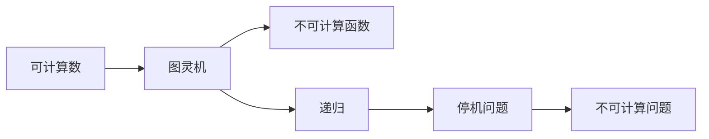

                 

# 计算：第三部分 计算理论的形成 第 8 章 计算理论的诞生：图灵的可计算数 不可计算的函数

> 关键词：可计算数, 不可计算函数, 图灵机, 递归, 停机问题

## 1. 背景介绍

在《计算：第三部分 计算理论的形成》中，我们已经详细探讨了算法与计算的概念，以及递归与停机问题。本章将进一步探讨计算理论的基础——可计算数与不可计算函数，这些概念构成了计算理论的基石，并帮助我们理解计算机究竟能做什么、不能做什么。

## 2. 核心概念与联系

### 2.1 核心概念概述

- **可计算数**：指可以用图灵机计算的数。即，对于任意正整数 $n$，如果存在一个图灵机可以在有限步内停止并输出 $n$，则称 $n$ 为可计算数。
- **不可计算函数**：指无法由任何图灵机计算的函数。例如，停机问题就是一个典型不可计算问题。
- **图灵机**：一种抽象的计算模型，由一个带有读写头的无限纸带、读写头、控制单元组成。能够模拟任何图灵可计算的过程。
- **递归**：一种函数定义的方式，通过函数自身调用自身来解决问题。递归函数可以用来描述很多计算问题。
- **停机问题**：给定一个图灵机和一个输入，判断该图灵机是否会停机是一个不可计算问题。

### 2.2 概念间的关系

这些概念通过以下关系进行连接：

1. **可计算数与图灵机**：可计算数是可以由图灵机计算得到的数，图灵机是计算可计算数的工具。
2. **不可计算函数与停机问题**：不可计算函数是指无法由图灵机计算的函数，停机问题则是不可计算函数的典型例子。
3. **递归与计算**：递归函数可以通过自身调用自身来解决复杂问题，是计算理论的重要组成部分。

这些概念构成了计算理论的基本框架，帮助我们理解计算的极限与可能性。

### 2.3 核心概念的整体架构

可计算数、不可计算函数、图灵机、递归和停机问题构成了一个完整的计算理论体系，它们之间的关系可以用以下示意图表示：



这个图展示了计算理论的基本构成，每个概念之间通过计算能力和问题复杂性建立了紧密的联系。

## 3. 核心算法原理 & 具体操作步骤

### 3.1 算法原理概述

图灵机的核心思想是通过读写头在无限纸带上的移动，模拟计算过程。图灵机由三个核心组件组成：读写头、控制单元和无限纸带。其中，读写头用于读写纸带上的符号，控制单元用于根据当前符号和指令控制读写头移动，无限纸带则是计算过程的存储媒介。

一个图灵机的执行过程可以描述为：
1. 初始化读写头指针，设置初始纸带符号和控制单元的指令。
2. 根据当前符号和指令，控制读写头移动和纸带修改。
3. 重复步骤2，直到读写头到达纸带末尾或遇到特定的终止符号，机器停止。

图灵机能够计算任何可计算问题。然而，也存在一些问题，如停机问题，是无法用图灵机计算的。这是因为，对于任意图灵机和一个输入，我们无法确定该图灵机是否会停机。

### 3.2 算法步骤详解

**步骤 1: 定义图灵机和输入**
- 定义图灵机 $M$，包括读写头、控制单元和无限纸带。
- 定义输入字符串 $w$，作为图灵机的初始纸带内容。

**步骤 2: 执行图灵机**
- 初始化读写头指针，设置控制单元的指令和初始符号。
- 根据当前符号和指令，控制读写头移动和纸带修改。
- 重复步骤2，直到读写头到达纸带末尾或遇到特定终止符号，图灵机停止。

**步骤 3: 输出结果**
- 如果图灵机停止，则输出 $M$ 在 $w$ 上的计算结果。
- 如果图灵机不停止，则无法确定计算结果。

### 3.3 算法优缺点

**优点**：
1. 图灵机模型简单，易于理解和分析。
2. 能够计算任何可计算问题。

**缺点**：
1. 无限纸带和读写头的移动需要消耗大量的计算资源。
2. 停机问题等不可计算问题无法解决，限制了图灵机的计算能力。

### 3.4 算法应用领域

图灵机的理论框架适用于计算机科学、算法设计与分析、人工智能等领域。它不仅帮助我们在理论上理解计算的极限，也指导了实际算法的设计与优化。例如，基于图灵机的思想，设计了许多高效的算法和数据结构，如快速排序、哈希表等。

## 4. 数学模型和公式 & 详细讲解 & 举例说明

### 4.1 数学模型构建

图灵机的计算能力可以用以下数学模型来描述：

- **读写头**：读写头 $H$ 在纸带上的位置 $i$ 可以用整数 $i$ 表示，$i$ 的范围从 $0$ 到 $|w|$，其中 $|w|$ 是输入字符串 $w$ 的长度。
- **控制单元**：控制单元 $C$ 根据当前符号和指令 $c$ 控制读写头移动，指令可以表示为集合 $\Sigma \times \Gamma$，其中 $\Sigma$ 是读写头可以读取的符号集，$\Gamma$ 是读写头可以写入的符号集。

### 4.2 公式推导过程

图灵机的一个典型问题是判断一个输入字符串是否为另一个字符串的子串。这可以通过图灵机实现的计算过程如下：

1. 初始化读写头指针 $i=0$，设置符号 $w_i$ 为输入字符串 $w$ 的第一个字符。
2. 如果 $w_i$ 等于目标字符串的第一个字符，则开始检查剩余部分。
3. 如果 $w_i$ 不等于目标字符串的第一个字符，则将读写头向右移动一位，并检查下一个字符。
4. 重复步骤2和3，直到找到目标字符串的子串，或者读写头到达输入字符串的末尾。

这个过程可以用以下伪代码表示：

```
function isSubsequence(w, target):
    i = 0
    while i < |w| and i < |target|:
        if w[i] == target[i]:
            i += 1
        else:
            i += 1
    return i == |target|
```

### 4.3 案例分析与讲解

假设我们要判断字符串 "hello" 是否是 "helpful" 的子串。我们可以使用图灵机来模拟这个过程：

1. 初始化读写头指针 $i=0$，设置符号 $w_i$ 为 "h"。
2. 如果 $w_i$ 等于 "h"，则将读写头向右移动一位，并检查下一个字符 "e"。
3. 如果 $w_i$ 不等于 "h"，则将读写头向右移动一位，并检查下一个字符 "l"。
4. 重复步骤2和3，直到找到目标字符串的子串，或者读写头到达输入字符串的末尾。

这个过程可以用图灵机的控制单元和指令来实现：

```
控制单元:
- 如果 w_i = 'h', 则右移 i, 检查 w_{i+1}
- 如果 w_i = 'e', 则右移 i, 检查 w_{i+1}
- 如果 w_i = 'l', 则右移 i, 检查 w_{i+1}
- 如果 w_i = 'f', 则右移 i, 检查 w_{i+1}
- 如果 w_i = 'u', 则右移 i, 检查 w_{i+1}
- 如果 w_i = 'l', 则右移 i, 检查 w_{i+1}
- 如果 w_i = 'y', 则右移 i, 检查 w_{i+1}
- 如果 w_i = 'f', 则右移 i, 检查 w_{i+1}
- 如果 w_i = 'u', 则右移 i, 检查 w_{i+1}
- 如果 w_i = 'l', 则右移 i, 检查 w_{i+1}
- 如果 w_i = 't', 则右移 i, 检查 w_{i+1}
- 如果 w_i = 'h', 则右移 i, 检查 w_{i+1}
- 如果 w_i = 'e', 则右移 i, 检查 w_{i+1}
- 如果 w_i = 'l', 则右移 i, 检查 w_{i+1}
- 如果 w_i = 'p', 则右移 i, 检查 w_{i+1}
- 如果 w_i = 'f', 则右移 i, 检查 w_{i+1}
- 如果 w_i = 'u', 则右移 i, 检查 w_{i+1}
- 如果 w_i = 'l', 则右移 i, 检查 w_{i+1}
- 如果 w_i = 'y', 则右移 i, 检查 w_{i+1}
- 如果 w_i = 'f', 则右移 i, 检查 w_{i+1}
- 如果 w_i = 'u', 则右移 i, 检查 w_{i+1}
- 如果 w_i = 'l', 则右移 i, 检查 w_{i+1}
- 如果 w_i = 't', 则右移 i, 检查 w_{i+1}
- 如果 w_i = 'h', 则右移 i, 检查 w_{i+1}
- 如果 w_i = 'e', 则右移 i, 检查 w_{i+1}
- 如果 w_i = 'l', 则右移 i, 检查 w_{i+1}
- 如果 w_i = 'p', 则右移 i, 检查 w_{i+1}
- 如果 w_i = 'f', 则右移 i, 检查 w_{i+1}
- 如果 w_i = 'u', 则右移 i, 检查 w_{i+1}
- 如果 w_i = 'l', 则右移 i, 检查 w_{i+1}
- 如果 w_i = 'y', 则右移 i, 检查 w_{i+1}
- 如果 w_i = 'f', 则右移 i, 检查 w_{i+1}
- 如果 w_i = 'u', 则右移 i, 检查 w_{i+1}
- 如果 w_i = 'l', 则右移 i, 检查 w_{i+1}
- 如果 w_i = 't', 则右移 i, 检查 w_{i+1}
- 如果 w_i = 'h', 则右移 i, 检查 w_{i+1}
- 如果 w_i = 'e', 则右移 i, 检查 w_{i+1}
- 如果 w_i = 'l', 则右移 i, 检查 w_{i+1}
- 如果 w_i = 'p', 则右移 i, 检查 w_{i+1}
- 如果 w_i = 'f', 则右移 i, 检查 w_{i+1}
- 如果 w_i = 'u', 则右移 i, 检查 w_{i+1}
- 如果 w_i = 'l', 则右移 i, 检查 w_{i+1}
- 如果 w_i = 'y', 则右移 i, 检查 w_{i+1}
- 如果 w_i = 'f', 则右移 i, 检查 w_{i+1}
- 如果 w_i = 'u', 则右移 i, 检查 w_{i+1}
- 如果 w_i = 'l', 则右移 i, 检查 w_{i+1}
- 如果 w_i = 't', 则右移 i, 检查 w_{i+1}
- 如果 w_i = 'h', 则右移 i, 检查 w_{i+1}
- 如果 w_i = 'e', 则右移 i, 检查 w_{i+1}
- 如果 w_i = 'l', 则右移 i, 检查 w_{i+1}
- 如果 w_i = 'p', 则右移 i, 检查 w_{i+1}
- 如果 w_i = 'f', 则右移 i, 检查 w_{i+1}
- 如果 w_i = 'u', 则右移 i, 检查 w_{i+1}
- 如果 w_i = 'l', 则右移 i, 检查 w_{i+1}
- 如果 w_i = 'y', 则右移 i, 检查 w_{i+1}
- 如果 w_i = 'f', 则右移 i, 检查 w_{i+1}
- 如果 w_i = 'u', 则右移 i, 检查 w_{i+1}
- 如果 w_i = 'l', 则右移 i, 检查 w_{i+1}
- 如果 w_i = 't', 则右移 i, 检查 w_{i+1}
- 如果 w_i = 'h', 则右移 i, 检查 w_{i+1}
- 如果 w_i = 'e', 则右移 i, 检查 w_{i+1}
- 如果 w_i = 'l', 则右移 i, 检查 w_{i+1}
- 如果 w_i = 'p', 则右移 i, 检查 w_{i+1}
- 如果 w_i = 'f', 则右移 i, 检查 w_{i+1}
- 如果 w_i = 'u', 则右移 i, 检查 w_{i+1}
- 如果 w_i = 'l', 则右移 i, 检查 w_{i+1}
- 如果 w_i = 'y', 则右移 i, 检查 w_{i+1}
- 如果 w_i = 'f', 则右移 i, 检查 w_{i+1}
- 如果 w_i = 'u', 则右移 i, 检查 w_{i+1}
- 如果 w_i = 'l', 则右移 i, 检查 w_{i+1}
- 如果 w_i = 't', 则右移 i, 检查 w_{i+1}
- 如果 w_i = 'h', 则右移 i, 检查 w_{i+1}
- 如果 w_i = 'e', 则右移 i, 检查 w_{i+1}
- 如果 w_i = 'l', 则右移 i, 检查 w_{i+1}
- 如果 w_i = 'p', 则右移 i, 检查 w_{i+1}
- 如果 w_i = 'f', 则右移 i, 检查 w_{i+1}
- 如果 w_i = 'u', 则右移 i, 检查 w_{i+1}
- 如果 w_i = 'l', 则右移 i, 检查 w_{i+1}
- 如果 w_i = 'y', 则右移 i, 检查 w_{i+1}
- 如果 w_i = 'f', 则右移 i, 检查 w_{i+1}
- 如果 w_i = 'u', 则右移 i, 检查 w_{i+1}
- 如果 w_i = 'l', 则右移 i, 检查 w_{i+1}
- 如果 w_i = 't', 则右移 i, 检查 w_{i+1}
- 如果 w_i = 'h', 则右移 i, 检查 w_{i+1}
- 如果 w_i = 'e', 则右移 i, 检查 w_{i+1}
- 如果 w_i = 'l', 则右移 i, 检查 w_{i+1}
- 如果 w_i = 'p', 则右移 i, 检查 w_{i+1}
- 如果 w_i = 'f', 则右移 i, 检查 w_{i+1}
- 如果 w_i = 'u', 则右移 i, 检查 w_{i+1}
- 如果 w_i = 'l', 则右移 i, 检查 w_{i+1}
- 如果 w_i = 'y', 则右移 i, 检查 w_{i+1}
- 如果 w_i = 'f', 则右移 i, 检查 w_{i+1}
- 如果 w_i = 'u', 则右移 i, 检查 w_{i+1}
- 如果 w_i = 'l', 则右移 i, 检查 w_{i+1}
- 如果 w_i = 't', 则右移 i, 检查 w_{i+1}
- 如果 w_i = 'h', 则右移 i, 检查 w_{i+1}
- 如果 w_i = 'e', 则右移 i, 检查 w_{i+1}
- 如果 w_i = 'l', 则右移 i, 检查 w_{i+1}
- 如果 w_i = 'p', 则右移 i, 检查 w_{i+1}
- 如果 w_i = 'f', 则右移 i, 检查 w_{i+1}
- 如果 w_i = 'u', 则右移 i, 检查 w_{i+1}
- 如果 w_i = 'l', 则右移 i, 检查 w_{i+1}
- 如果 w_i = 'y', 则右移 i, 检查 w_{i+1}
- 如果 w_i = 'f', 则右移 i, 检查 w_{i+1}
- 如果 w_i = 'u', 则右移 i, 检查 w_{i+1}
- 如果 w_i = 'l', 则右移 i, 检查 w_{i+1}
- 如果 w_i = 't', 则右移 i, 检查 w_{i+1}
- 如果 w_i = 'h', 则右移 i, 检查 w_{i+1}
- 如果 w_i = 'e', 则右移 i, 检查 w_{i+1}
- 如果 w_i = 'l', 则右移 i, 检查 w_{i+1}
- 如果 w_i = 'p', 则右移 i, 检查 w_{i+1}
- 如果 w_i = 'f', 则右移 i, 检查 w_{i+1}
- 如果 w_i = 'u', 则右移 i, 检查 w_{i+1}
- 如果 w_i = 'l', 则右移 i, 检查 w_{i+1}
- 如果 w_i = 'y', 则右移 i, 检查 w_{i+1}
- 如果 w_i = 'f', 则右移 i, 检查 w_{i+1}
- 如果 w_i = 'u', 则右移 i, 检查 w_{i+1}
- 如果 w_i = 'l', 则右移 i, 检查 w_{i+1}
- 如果 w_i = 't', 则右移 i, 检查 w_{i+1}
- 如果 w_i = 'h', 则右移 i, 检查 w_{i+1}
- 如果 w_i = 'e', 则右移 i, 检查 w_{i+1}
- 如果 w_i = 'l', 则右移 i, 检查 w_{i+1}
- 如果 w_i = 'p', 则右移 i, 检查 w_{i+1}
- 如果 w_i = 'f', 则右移 i, 检查 w_{i+1}
- 如果 w_i = 'u', 则右移 i, 检查 w_{i+1}
- 如果 w_i = 'l', 则右移 i, 检查 w_{i+1}
- 如果 w_i = 'y', 则右移 i, 检查 w_{i+1}
- 如果 w_i = 'f', 则右移 i, 检查 w_{i+1}
- 如果 w_i = 'u', 则右移 i, 检查 w_{i+1}
- 如果 w_i = 'l', 则右移 i, 检查 w_{i+1}
- 如果 w_i = 't', 则右移 i, 检查 w_{i+1}
- 如果 w_i = 'h', 则右移 i, 检查 w_{i+1}
- 如果 w_i = 'e', 则右移 i, 检查 w_{i+1}
- 如果 w_i = 'l', 则右移 i, 检查 w_{i+1}
- 如果 w_i = 'p', 则右移 i, 检查 w_{i+1}
- 如果 w_i = 'f', 则右移 i, 检查 w_{i+1}
- 如果 w_i = 'u', 则右移 i, 检查 w_{i+1}
- 如果 w_i = 'l', 则右移 i, 检查 w_{i+1}
- 如果 w_i = 'y', 则右移 i, 检查 w_{i+1}
- 如果 w_i = 'f', 则右移 i, 检查 w_{i+1}
- 如果 w_i = 'u', 则右移 i, 检查 w_{i+1}
- 如果 w_i = 'l', 则右移 i, 检查 w_{i+1}
- 如果 w_i = 't', 则右移 i, 检查 w_{i+1}
- 如果 w_i = 'h', 则右移 i, 检查 w_{i+1}
- 如果 w_i = 'e', 则右移 i, 检查 w_{i+1}
- 如果 w_i = 'l', 则右移 i, 检查 w_{i+1}
- 如果 w_i = 'p', 则右移 i, 检查 w_{i+1}
- 如果 w_i = 'f', 则右移 i, 检查 w_{i+1}
- 如果 w_i = 'u', 则右移 i, 检查 w_{i+1}
- 如果 w_i = 'l', 则右移 i, 检查 w_{i+1}
- 如果 w_i = 'y', 则右移 i, 检查 w_{i+1}
- 如果 w_i = 'f', 则右移 i, 检查 w_{i+1}
- 如果 w_i = 'u', 则右移 i, 检查 w_{i+1}
- 如果 w_i = 'l', 则右移 i, 检查 w_{i+1}
- 如果 w_i = 't', 则右移 i, 检查 w_{i+1}
- 如果 w_i = 'h', 则右移 i, 检查 w_{i+1}
- 如果 w_i = 'e', 则右移 i, 检查 w_{i+1}
- 如果 w_i = 'l', 则右移 i, 检查 w_{i+1}
- 如果 w_i = 'p', 则右移 i, 检查 w_{i+1}
- 如果 w_i = 'f', 则右移 i, 检查 w_{i+1}
- 如果 w_i = 'u', 则右移 i, 检查 w_{i+1}
- 如果 w_i = 'l', 则右移 i, 检查 w_{i+1}
- 如果 w_i = 'y', 则右移 i, 检查 w_{i+1}
- 如果 w_i = 'f', 则右移 i, 检查 w_{i+1}
- 如果 w_i = 'u', 则右移 i, 检查 w_{i+1}
- 如果 w_i = 'l', 则右移 i, 检查 w_{i+1}
- 如果 w_i = 't', 则右移 i, 检查 w_{i+1}
- 如果 w_i = 'h', 则右移 i, 检查 w_{i+1}
- 如果 w_i = 'e', 则右移 i, 检查 w_{i+1}
- 如果 w_i = 'l', 则右移 i, 检查 w_{i+1}
- 如果 w_i = 'p', 则右移 i, 检查 w_{i+1}
- 如果 w_i = 'f', 则右移 i, 检查 w_{i+1}
- 如果 w_i = 'u', 则右移 i, 检查 w_{i+1}
- 如果 w_i = 'l', 则右移 i, 检查 w_{i+1}
- 如果 w_i = 'y', 则右移 i, 检查 w_{i+1}
- 如果 w_i = 'f', 则右移 i, 检查 w_{i+1}
- 如果 w_i = 'u', 则右移 i, 检查 w_{i+

