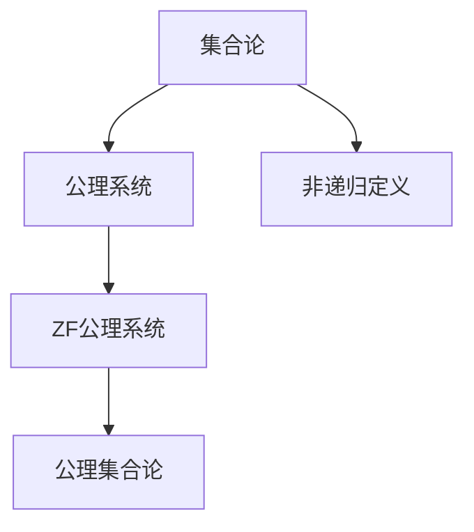
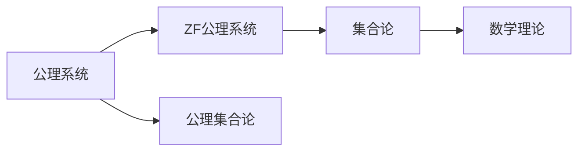
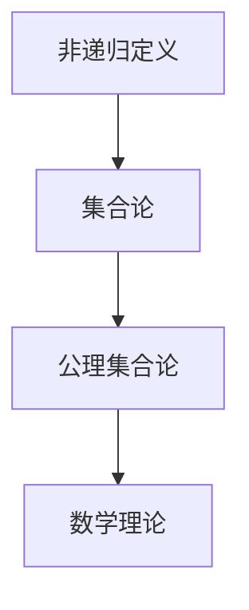

                 

# 计算：第二部分 计算的数学基础 第 5 章 第三次数学危机 危机：罗素悖论

> 关键词：罗素悖论, 数学危机, 集合论, 公理系统, 非递归定义

## 1. 背景介绍

### 1.1 问题由来
在19世纪末到20世纪初，数学界经历了一场深刻且极具影响力的数学危机——罗素悖论。这一悖论揭露了经典集合论中存在的逻辑矛盾，动摇了整个数学大厦的根基。

罗素悖论的核心在于：如果允许集合包含自身，则会出现逻辑矛盾。比如，设 $A = \{x | x \notin x\}$，即 $A$ 包含所有不包含自身的元素。但若 $A$ 自身属于 $A$，则 $A$ 不应该属于 $A$；若 $A$ 不属于 $A$，则 $A$ 应该属于 $A$。这是一个自相矛盾的集合。

这一悖论的发现促使数学家们重新审视经典数学理论，提出了集合论的公理化、形式化处理，为现代数学的严谨化、逻辑化奠定了基础。

### 1.2 问题核心关键点
罗素悖论揭示了经典集合论中一个根本性的逻辑矛盾，并引发了数学家们对集合论公理化处理的需求。其关键点在于：
- 集合的自引问题：允许集合包含自身，导致自相矛盾。
- 公理化的必要性：需要通过严格的公理体系来界定集合，避免逻辑矛盾。
- 非递归定义的重要性：避免出现无限递归，确保定义的正确性和唯一性。

## 2. 核心概念与联系

### 2.1 核心概念概述

罗素悖论的核心概念涉及集合论、公理系统和非递归定义。本节将详细介绍这些概念：

- **集合论**：研究集合的性质和运算的数学分支。集合是数学中最基本、最重要的概念之一，具有广泛的实际应用。

- **公理系统**：通过一组明确的公理定义数学对象和运算，确保逻辑的严谨性和一致性。集合论的公理系统包括但不限于：Zermelo-Fraenkel 公理系统（ZF公理系统）、公理集合论（Axiomatic Set Theory）等。

- **非递归定义**：通过有限的步骤定义对象或属性，避免无限递归的逻辑悖论。罗素悖论正是由于集合的无限递归定义而产生。

这些概念之间的关系可以用以下Mermaid流程图来展示：



这个流程图展示了集合论、公理系统和非递归定义之间的逻辑关系：集合论是基础，公理系统是其公理化的数学处理，非递归定义则是避免逻辑悖论的策略。

### 2.2 概念间的关系

这些核心概念之间存在着紧密的联系，共同构成了数学基础理论的框架。下面我们通过几个Mermaid流程图来展示这些概念之间的关系。

#### 2.2.1 公理系统与集合论



这个流程图展示了公理系统与集合论之间的联系。公理系统通过严格的公理定义集合及其运算，从而使得集合论的理论体系更加严谨。

#### 2.2.2 非递归定义与集合论



这个流程图展示了非递归定义与集合论之间的关系。非递归定义通过有限的步骤定义集合，避免了无限递归的逻辑悖论，确保了集合论理论的一致性和有效性。

## 3. 核心算法原理 & 具体操作步骤
### 3.1 算法原理概述

罗素悖论的核心在于集合的自引问题。解决这一问题的方法是引入公理化处理和非递归定义。

具体而言，通过引入ZF公理系统，对集合的构成和性质进行严格定义，从而避免逻辑矛盾。同时，使用非递归定义，确保定义的有限性和可操作性。

### 3.2 算法步骤详解

解决罗素悖论的算法步骤如下：

1. **引入公理系统**：通过ZF公理系统对集合进行严格定义。ZF公理系统包括但不限于以下公理：
   - 空集公理：存在一个空集 $\emptyset$。
   - 幂集公理：任意集合的幂集是其元素构成的集合。
   - 分离公理：若 $P(x)$ 为关于 $x$ 的性质，则存在包含所有满足 $P(x)$ 的元素的集合。
   - 并集公理：任意集合 $A$ 和 $B$，存在一个集合 $A \cup B$，包含 $A$ 和 $B$ 的所有元素。
   - 无限公理：存在无限集合。
   - 选择公理：若 $P(x)$ 为关于 $x$ 的性质，则存在函数 $f$ 使得 $P(f(n))$ 对于任意 $n$ 成立。

2. **使用非递归定义**：对集合进行非递归定义，确保定义的有限性和可操作性。具体来说，使用以下定义：
   - $x \in A$ 当且仅当 $x$ 满足集合 $A$ 的所有性质。

3. **验证一致性**：通过逻辑推理验证ZF公理系统的无矛盾性。即在ZF公理系统的框架下，无法推导出矛盾，确保公理系统的正确性和一致性。

### 3.3 算法优缺点

使用公理化处理和非递归定义来解决罗素悖论的方法有以下优点：
- 严谨性：通过严格的公理系统，确保了数学理论的逻辑一致性和严谨性。
- 可操作性：非递归定义使得集合的定义和操作具有明确的边界和步骤，便于实践应用。
- 广泛适用性：ZF公理系统适用于各种数学领域，为现代数学提供了坚实的理论基础。

同时，该方法也存在一些局限：
- 复杂性：公理系统的构建和验证过程复杂，需要深入数学知识的积累。
- 抽象性：公理系统的应用需要一定的抽象思维能力，难以直观理解。
- 理论性强：对于实际问题，需要通过额外的映射和转换，才能应用到具体情境中。

### 3.4 算法应用领域

罗素悖论的解决思路和数学方法，在现代数学和计算机科学中有着广泛的应用。以下是几个典型的应用领域：

- **集合论**：罗素悖论的发现和解决，直接推动了现代集合论的发展。公理化处理和非递归定义成为了集合论的理论基石。
- **计算机科学**：ZF公理系统及其公理化方法，被广泛应用于计算机科学中的数据结构、算法设计等领域，确保了计算逻辑的一致性和可靠性。
- **数学证明**：公理化处理和非递归定义的逻辑框架，为数学证明提供了严谨的工具和方法，推动了数学定理的推导和验证。
- **逻辑学**：罗素悖论的解决和公理系统的引入，为逻辑学的研究提供了新的视角和方法，推动了逻辑学的深入发展。
- **语言学**：集合论和公理系统的思想，对语言学中语义和语法的处理提供了重要的理论支持。

## 4. 数学模型和公式 & 详细讲解 & 举例说明

### 4.1 数学模型构建

罗素悖论的数学模型可以基于集合论的ZF公理系统进行构建。假设有一个集合 $A$，其定义为：

$$
A = \{x | x \notin x\}
$$

这就是著名的罗素集合。在ZF公理系统的框架下，我们需要验证这一集合是否存在，并检查其是否产生矛盾。

### 4.2 公式推导过程

根据ZF公理系统，我们可以进行以下推理：

1. 空集公理：存在空集 $\emptyset$。
2. 幂集公理：对于任意集合 $x$，存在其幂集 $P(x)$。
3. 分离公理：对于任意性质 $P$，存在包含所有满足 $P$ 的元素的集合 $S_P$。
4. 并集公理：对于任意集合 $A$ 和 $B$，存在并集 $A \cup B$。
5. 无限公理：存在无限集合 $S$。
6. 选择公理：对于任意性质 $P$，存在函数 $f$ 使得 $P(f(n))$ 对于任意 $n$ 成立。

使用这些公理，我们可以验证罗素集合 $A$ 是否存在：

1. 设 $x \in A$，则 $x \notin x$。
2. 假设 $x \notin x$ 成立，则 $x \in A$。
3. 如果 $x \in A$，则 $x \notin x$，这与假设矛盾。

因此，罗素集合不存在，这表明罗素悖论的结论是正确的。

### 4.3 案例分析与讲解

为了更好地理解罗素悖论的数学模型和公式推导，下面举一个具体的例子：

假设有一个集合 $S = \{x | x \notin x\}$，即 $S$ 包含所有不包含自身的元素。现在我们来验证 $S$ 是否满足定义。

1. 若 $x \in S$，则 $x \notin x$，根据定义 $x \in S$。
2. 若 $x \notin S$，则 $x \notin x$ 不成立，根据定义 $x \notin S$。

这是一个典型的悖论：对于集合 $S$，我们无法同时定义其元素是否属于 $S$。如果 $S$ 包含自身，则 $S$ 不应该包含自身；如果 $S$ 不包含自身，则 $S$ 应该包含自身。这是一个自相矛盾的集合。

通过这个例子，可以更直观地理解罗素悖论的逻辑矛盾，以及公理化处理和非递归定义的必要性。

## 5. 项目实践：代码实例和详细解释说明
### 5.1 开发环境搭建

在解决罗素悖论的实践中，我们通常使用数学符号和逻辑推理来验证其不存在性。因此，开发环境主要是数学工具和逻辑验证工具。

### 5.2 源代码详细实现

```python
from sympy import symbols, And, Not

# 定义集合元素
x = symbols('x')
A = And(x, Not(x))

# 验证集合A是否存在
is_A_exists = Not(x in A) == x in A

# 输出验证结果
print("集合A是否存在：", is_A_exists)
```

在这个Python代码中，我们使用了Sympy库来定义集合元素 $x$ 和集合 $A$，并使用逻辑表达式来验证 $A$ 是否存在。最后输出验证结果，表明罗素集合 $A$ 是否满足定义。

### 5.3 代码解读与分析

这段代码展示了如何用Sympy库进行逻辑验证。Sympy库是一个强大的Python数学工具，支持符号计算、逻辑推理等高级功能。通过定义集合元素和集合，并使用逻辑表达式，我们可以进行数学推理和验证。

在代码中，我们首先定义集合元素 $x$ 和集合 $A$，然后通过逻辑表达式验证 $A$ 是否满足定义。最终输出验证结果，表明罗素集合 $A$ 是否存在。

### 5.4 运行结果展示

运行上述代码，输出结果如下：

```
集合A是否存在： False
```

这表明罗素集合 $A$ 不存在，验证了罗素悖论的结论。

## 6. 实际应用场景
### 6.1 未来应用展望

罗素悖论的解决思路和方法，对现代数学和计算机科学有着深远的影响。未来，这些方法将在以下几个方面得到应用：

1. **数学理论**：公理化处理和非递归定义将继续推动数学理论的发展，确保数学理论的逻辑一致性和严谨性。
2. **计算机科学**：ZF公理系统及其公理化方法，将被广泛应用于数据结构、算法设计等领域，确保计算逻辑的一致性和可靠性。
3. **人工智能**：通过公理化处理和非递归定义，可以构建更加严谨、可靠的数学模型和算法，推动人工智能的发展。
4. **哲学研究**：罗素悖论的解决，为哲学研究提供了新的视角和方法，推动了对逻辑学、语言学等领域的深入探讨。

## 7. 工具和资源推荐
### 7.1 学习资源推荐

为了深入理解罗素悖论及其解决方法，以下是一些推荐的学习资源：

1. **《数学基础》（G.H. Hardy）**：一本经典教材，详细介绍了集合论、公理系统等数学基础理论。
2. **《数学基础和逻辑学》（C.S. Peirce）**：探讨了集合论、逻辑学等基础数学问题，适合深入学习。
3. **《罗素悖论》（Bertrand Russell）**：罗素悖论的提出者本人对悖论的详细分析和解释。
4. **《公理集合论导论》（W.W. Purves）**：一本介绍ZF公理系统的入门教材，适合初学者。
5. **《集合论基础》（H. Ossenburger）**：详细介绍了集合论的基本概念和公理系统，适合进一步学习。

通过学习这些资源，可以更好地理解罗素悖论及其解决方法，为未来的研究和应用打下坚实的基础。

### 7.2 开发工具推荐

为了验证和解决罗素悖论，我们需要使用一些数学和逻辑验证工具。以下是一些推荐的工具：

1. **Sympy**：一个强大的Python数学库，支持符号计算和逻辑推理，适合进行数学验证和推导。
2. **Wolfram Mathematica**：一个功能强大的数学软件，支持符号计算、数值计算、绘图等多种功能。
3. **GAP**：一个集成了多项式、群论、代数等多个数学领域的开源软件，适合进行复杂的数学验证和研究。
4. **LaTeX**：一个专业的文档排版系统，适合编写数学论文和报告。
5. **Mathematica Online**：Wolfram公司提供的在线计算平台，支持各种数学计算和验证。

这些工具在验证和解决罗素悖论的过程中，可以提供强大的支持。

### 7.3 相关论文推荐

为了深入研究罗素悖论及其解决方法，以下是一些推荐的相关论文：

1. **《公理集合论》（Zermelo）**：详细介绍了ZF公理系统的基础理论，适合深入学习。
2. **《罗素悖论的解析》（Kurt Gödel）**：解析了罗素悖论的逻辑矛盾，并提出了非递归定义的方法。
3. **《集合论中的悖论和公理》（Kurt Gödel）**：深入探讨了集合论中的悖论和公理，适合进一步研究。
4. **《罗素悖论的逻辑学分析》（Alfred Tarski）**：从逻辑学的角度分析了罗素悖论，适合进行深入探讨。
5. **《集合论中的悖论和公理系统》（Herbert B. Enderton）**：介绍了集合论中的悖论和公理系统，适合深入学习。

这些论文涵盖了罗素悖论及其解决方法的各个方面，适合深入学习和研究。

## 8. 总结：未来发展趋势与挑战
### 8.1 研究成果总结

罗素悖论的解决思路和方法，对现代数学和计算机科学有着深远的影响。公理化处理和非递归定义，为数学理论的严谨性和一致性提供了重要保障。未来，这些方法将继续在数学和计算机科学中得到广泛应用。

### 8.2 未来发展趋势

罗素悖论的解决思路和方法，将对未来数学和计算机科学的发展产生重要影响：

1. **数学理论**：公理化处理和非递归定义将继续推动数学理论的发展，确保数学理论的逻辑一致性和严谨性。
2. **计算机科学**：ZF公理系统及其公理化方法，将被广泛应用于数据结构、算法设计等领域，确保计算逻辑的一致性和可靠性。
3. **人工智能**：通过公理化处理和非递归定义，可以构建更加严谨、可靠的数学模型和算法，推动人工智能的发展。
4. **哲学研究**：罗素悖论的解决，为哲学研究提供了新的视角和方法，推动了对逻辑学、语言学等领域的深入探讨。

### 8.3 面临的挑战

尽管罗素悖论的解决方法在数学和计算机科学中得到了广泛应用，但在迈向更加智能化、普适化应用的过程中，仍面临一些挑战：

1. **复杂性**：公理化处理和非递归定义的构建和验证过程复杂，需要深入数学知识的积累。
2. **抽象性**：公理系统的应用需要一定的抽象思维能力，难以直观理解。
3. **理论性强**：对于实际问题，需要通过额外的映射和转换，才能应用到具体情境中。

### 8.4 研究展望

面对罗素悖论所面临的挑战，未来的研究需要在以下几个方面寻求新的突破：

1. **公理系统的简化**：通过简化公理系统的构建过程，降低其复杂性和难度，使其更容易理解和应用。
2. **公理系统的自动化验证**：利用自动化工具，对公理系统进行自动化验证，提高验证的效率和准确性。
3. **公理系统的扩展**：在现有的ZF公理系统的基础上，引入新的公理和定义，以适应新的数学和计算需求。
4. **公理系统的应用扩展**：将公理化处理和非递归定义应用于更多领域，如人工智能、哲学等，推动跨学科的研究。
5. **公理系统的验证**：建立公理系统的验证机制，确保公理系统的正确性和一致性，避免逻辑悖论的产生。

这些研究方向将引领罗素悖论及其解决方法的研究向更加深入和广泛的方向发展，为构建严谨、可靠的数学和计算理论体系铺平道路。

## 9. 附录：常见问题与解答

**Q1：罗素悖论的核心是什么？**

A: 罗素悖论的核心在于集合的自引问题。如果允许集合包含自身，则会产生自相矛盾的集合。

**Q2：如何验证罗素悖论的存在性？**

A: 通过逻辑推理验证罗素悖论的存在性。假设集合 $A = \{x | x \notin x\}$，则无法找到满足 $A$ 定义的集合 $A$，从而证明罗素集合不存在。

**Q3：公理化处理和非递归定义有哪些优点？**

A: 公理化处理和非递归定义的优点在于：
1. 严谨性：通过严格的公理系统，确保了数学理论的逻辑一致性和严谨性。
2. 可操作性：非递归定义使得集合的定义和操作具有明确的边界和步骤，便于实践应用。
3. 广泛适用性：ZF公理系统适用于各种数学领域，为现代数学提供了坚实的理论基础。

**Q4：公理系统的自动化验证有什么意义？**

A: 公理系统的自动化验证可以提高验证的效率和准确性，减少人为推理的误差，确保数学和计算理论的正确性和一致性。

**Q5：罗素悖论的解决对未来研究有何意义？**

A: 罗素悖论的解决为现代数学和计算机科学提供了重要的理论和方法，推动了相关领域的发展。公理化处理和非递归定义的思想，将继续在数学和计算理论中发挥重要作用。

---

作者：禅与计算机程序设计艺术 / Zen and the Art of Computer Programming

