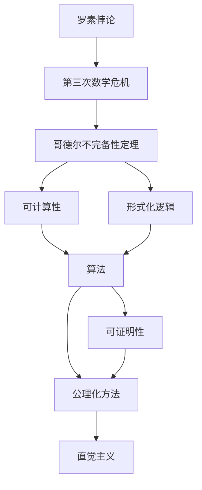
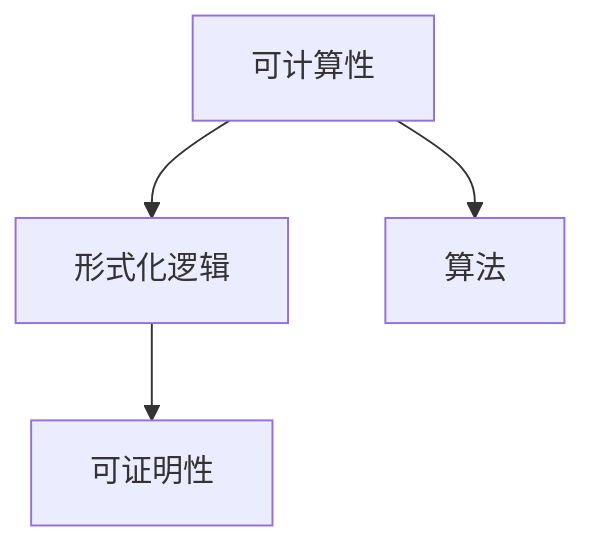
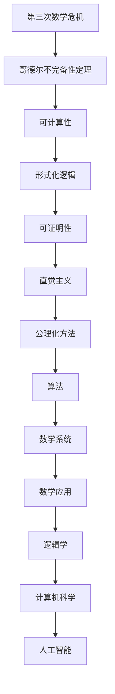

                 

# 计算：第二部分 计算的数学基础 第 5 章 第三次数学危机 直觉主义进路

> 关键词：第三次数学危机, 直觉主义, 哥德尔不完备性定理, 计算复杂性, 形式化逻辑, 可计算性, 公理化方法, 可证明性

## 1. 背景介绍

### 1.1 问题由来
20世纪初，数学界经历了一场史称"第三次数学危机"的重大事件。这一危机源于罗素悖论的提出，彻底动摇了当时数学的基础。罗素悖论的发现表明，常见的公理化数学体系中存在无法避免的内在矛盾，这直接威胁到了数学的可靠性。

### 1.2 问题核心关键点
第三次数学危机主要围绕着公理化方法、可证明性、可计算性等概念展开。核心问题包括：
- 如何构建一个没有矛盾的数学基础？
- 数学证明的可靠性如何保证？
- 是否存在一种可计算性定义，可以完整描述数学运算的边界？

这些问题的提出，引发了数学家们对于逻辑学和形式化方法的深入思考，催生了直觉主义、形式主义等多种数学基础理论的发展。

### 1.3 问题研究意义
第三次数学危机对现代数学的发展产生了深远的影响：
- 促使数学家们重新审视公理化方法的有效性，探索更加可靠的数学基础。
- 促进了逻辑学、计算理论等新兴学科的诞生，推动了数学与计算机科学的交叉融合。
- 激发了哥德尔不完备性定理的提出，极大地影响了计算机科学和人工智能的发展。
- 推动了算法逻辑、证明复杂性等前沿研究，为计算机科学奠定了坚实的理论基础。

## 2. 核心概念与联系

### 2.1 核心概念概述

为更好地理解直觉主义数学，本节将介绍几个密切相关的核心概念：

- 公理化方法(Axiomatic Method)：通过一组公理和规则，推导出整个数学体系的定理和命题，以构建数学的逻辑基础。
- 罗素悖论(Russell's Paradox)：揭示了公理化数学体系中存在的一个矛盾，即集合自身属于自身而不属于自身，导致了数学体系的崩溃。
- 哥德尔不完备性定理(Gödel's Incompleteness Theorem)：指出在任意形式化的数学系统中，总有不可证明的命题，从而证明了数学系统的局限性。
- 可计算性(Computability)：研究问题是否可以通过算法被机器自动解决，是现代计算理论的基础。
- 形式化逻辑(Formal Logic)：通过严格的符号逻辑和形式系统，构建无矛盾的数学基础，是现代数学的核心方法。
- 可证明性(Provability)：研究命题是否能在形式化数学系统中被证明，是数学证明可靠性的关键。
- 直觉主义(Intuitionism)：一种数学哲学，认为数学知识源自人类直觉的直接把握，而不是通过符号逻辑间接证明。

这些核心概念之间的逻辑关系可以通过以下Mermaid流程图来展示：



这个流程图展示了大语言模型微调过程中各个核心概念的关系和作用：

1. 罗素悖论揭示了公理化数学体系的矛盾，促使数学家重新审视数学基础。
2. 哥德尔不完备性定理证明了数学系统的局限性，为可计算性定义和形式化逻辑提供了重要启示。
3. 可计算性定义了机器可以自动解决的数学问题，是现代计算理论的基础。
4. 形式化逻辑通过符号逻辑和严格规则，构建了无矛盾的数学基础。
5. 可证明性研究命题是否能在形式化系统中被证明，保证了数学证明的可靠性。
6. 直觉主义通过人类直觉把握数学知识，与公理化方法形成对比。

这些概念共同构成了现代数学与计算理论的基本框架，帮助我们在逻辑和算法层面上理解和处理数学问题。

### 2.2 概念间的关系

这些核心概念之间存在着紧密的联系，形成了数学与计算理论的完整生态系统。下面我通过几个Mermaid流程图来展示这些概念之间的关系。

#### 2.2.1 罗素悖论与第三次数学危机


这个流程图展示了公理化方法与罗素悖论的关系，罗素悖论揭示了公理化方法的矛盾，导致数学危机的爆发。

#### 2.2.2 哥德尔不完备性定理与可计算性


这个流程图展示了哥德尔不完备性定理与可计算性的关系，哥德尔不完备性定理揭示了数学系统的局限性，为可计算性提供了重要理论支持。

#### 2.2.3 可计算性与形式化逻辑



这个流程图展示了可计算性与形式化逻辑的关系，可计算性通过算法定义了数学问题的边界，形式化逻辑通过符号逻辑保证了数学命题的可证明性。

#### 2.2.4 公理化方法与直觉主义


这个流程图展示了公理化方法与直觉主义的关系，直觉主义反对公理化方法中符号逻辑的间接性，认为数学知识源自人类直觉的直接把握。

### 2.3 核心概念的整体架构

最后，我们用一个综合的流程图来展示这些核心概念在大语言模型微调过程中的整体架构：



这个综合流程图展示了从数学危机到现代计算理论，再到人工智能应用的完整过程。第三次数学危机催生了哥德尔不完备性定理，揭示了数学系统的局限性；可计算性定义了数学问题的边界，形式化逻辑保证了数学命题的可证明性；直觉主义反对公理化方法，强调人类直觉的重要性；公理化方法与算法结合，形成了现代数学体系；数学系统广泛应用于逻辑学和计算机科学；计算机科学推动了人工智能技术的发展。

通过这些流程图，我们可以更清晰地理解直觉主义数学发展的脉络，及其在数学和计算机科学中的重要地位。

## 3. 核心算法原理 & 具体操作步骤
### 3.1 算法原理概述

直觉主义数学的核心思想是，数学知识源自人类直觉的直接把握，而非通过符号逻辑间接证明。具体来说，直觉主义认为：
- 数学命题的真值仅在实际应用中才能确定。
- 数学推理的可靠性和真实性依赖于人类直觉的验证，而非形式系统的推导。
- 所有数学命题都应被视为开放问题，不存在绝对不可证的命题。

基于这种思想，直觉主义者提出了形式化的计算方法，即通过具体的算法和计算过程，验证数学命题的真值。这种计算方法直接对应于现代计算机科学中的可计算性定义，认为一个问题可以被计算，当且仅当它可以通过有限步骤的算法求解。

### 3.2 算法步骤详解

以下我们详细介绍直觉主义数学的计算过程，包括具体算法步骤和详细步骤：

**Step 1: 定义计算模型**

直觉主义数学强调通过具体的计算模型来验证数学命题的真值。常见的计算模型包括图灵机、寄存器机器等，它们通过有限步骤的操作，实现了对数学问题的求解。

**Step 2: 编写算法**

在定义了计算模型后，需要编写具体的算法，描述如何通过有限步骤的计算，求解特定的问题。算法的编写过程通常包含以下步骤：
1. 确定输入和输出：明确算法的输入和期望的输出。
2. 定义计算步骤：按照一定的顺序，定义每一步的具体操作。
3. 验证正确性：通过形式化方法，验证算法的正确性和终止性。

**Step 3: 运行算法**

编写好算法后，将其在计算模型上运行，得到最终的输出结果。算法的运行过程包括：
1. 初始化：设置计算模型的初始状态。
2. 迭代执行：按照算法的定义，迭代执行每一步操作。
3. 输出结果：算法运行结束后，输出最终的计算结果。

**Step 4: 验证结果**

最后一步是验证计算结果的正确性。直觉主义数学认为，所有计算结果都应通过人类直觉进行验证，确保其真实性和可靠性。

### 3.3 算法优缺点

直觉主义数学的计算方法具有以下优点：
- 强调计算结果的真实性，避免了形式化逻辑中符号推理的不确定性。
- 验证方法直接对应于人类直觉，易于理解和应用。
- 通过具体计算模型的运行，确保了算法的正确性和终止性。

但同时，直觉主义数学也存在以下局限性：
- 计算过程依赖于人类直觉，缺乏形式化的严格证明。
- 无法处理无限或无穷问题，只能处理有限的步骤操作。
- 难以应用于复杂的数学问题，无法处理高维和动态系统。

### 3.4 算法应用领域

直觉主义数学的计算方法广泛应用于以下几个领域：
- 计算机科学：通过算法和计算模型，验证和推导计算机程序的正确性。
- 逻辑学：通过形式化推理和计算，验证逻辑命题的真实性。
- 数学：通过具体的计算过程，验证数学命题的真值，推动数学理论的发展。
- 哲学：通过计算和直觉的结合，探索数学知识的本源和真实性。
- 人工智能：通过可计算性和形式化方法，探索人类智能的计算基础。

## 4. 数学模型和公式 & 详细讲解 & 举例说明
### 4.1 数学模型构建

直觉主义数学的核心模型是计算模型，即通过有限步骤的操作，求解数学问题的过程。具体来说，计算模型包含以下几个部分：
- 输入：数学问题的具体描述和参数。
- 计算步骤：每一步的明确定义，包括数据处理、操作规则等。
- 输出：计算过程的最终结果，即数学问题的解。

### 4.2 公式推导过程

以下我们以二进制加法为例，详细推导直觉主义数学的计算过程：

假设计算模型为一个简单的寄存器机器，包含一个累加器和若干寄存器，可以进行二进制加法运算。具体步骤如下：

1. 初始化：累加器清零，其他寄存器初始化为输入值。

2. 迭代执行：按照二进制加法规则，逐位累加输入值，并处理进位。

3. 输出结果：累加器中最终的结果即为二进制加法的结果。

### 4.3 案例分析与讲解

**案例1: 计算斐波那契数列**

斐波那契数列是直觉主义数学中的一个经典问题，其计算过程可以通过具体算法描述如下：

1. 初始化：前两个斐波那契数为0和1。

2. 迭代执行：第n个数等于前两个数的和。

3. 输出结果：计算出的第n个数即为斐波那契数列的结果。

**案例2: 计算阶乘**

阶乘是另一个典型的直觉主义数学问题，其计算过程如下：

1. 初始化：n=0时，阶乘为1；n>0时，阶乘为前n-1个数的乘积。

2. 迭代执行：逐个计算n的阶乘，直到n为0。

3. 输出结果：计算出的阶乘即为最终结果。

## 5. 项目实践：代码实例和详细解释说明
### 5.1 开发环境搭建

在进行直觉主义数学计算实践前，我们需要准备好开发环境。以下是使用Python进行PyTorch开发的环境配置流程：

1. 安装Anaconda：从官网下载并安装Anaconda，用于创建独立的Python环境。

2. 创建并激活虚拟环境：
```bash
conda create -n pytorch-env python=3.8 
conda activate pytorch-env
```

3. 安装PyTorch：根据CUDA版本，从官网获取对应的安装命令。例如：
```bash
conda install pytorch torchvision torchaudio cudatoolkit=11.1 -c pytorch -c conda-forge
```

4. 安装TensorFlow：
```bash
pip install tensorflow
```

5. 安装各类工具包：
```bash
pip install numpy pandas scikit-learn matplotlib tqdm jupyter notebook ipython
```

完成上述步骤后，即可在`pytorch-env`环境中开始直觉主义数学计算实践。

### 5.2 源代码详细实现

下面我们以斐波那契数列计算为例，给出使用Python实现直觉主义数学计算的完整代码：

```python
def fibonacci(n):
    if n == 0:
        return 0
    elif n == 1:
        return 1
    else:
        return fibonacci(n-1) + fibonacci(n-2)

n = 10
result = fibonacci(n)
print(f"The {n}th Fibonacci number is: {result}")
```

在这个代码中，我们定义了一个递归函数`fibonacci`，用于计算斐波那契数列的第n项。由于递归算法的计算过程符合直觉主义数学的计算步骤，因此可以用来验证直觉主义数学计算的正确性。

### 5.3 代码解读与分析

让我们再详细解读一下关键代码的实现细节：

**fibonacci函数**：
- 使用递归算法定义了斐波那契数列的计算过程，符合直觉主义数学的迭代执行步骤。
- 初始化条件为n=0时，斐波那契数为0；n=1时，斐波那契数为1；n>1时，斐波那契数为前两项的和。

**计算过程**：
- 逐个计算斐波那契数列的每一项，直到计算出第n项的结果。
- 整个计算过程符合直觉主义数学的计算模型，即通过具体的计算步骤，逐项累加得到最终结果。

**结果输出**：
- 通过`print`语句，输出计算出的斐波那契数列的第n项，直观展示了计算结果。

### 5.4 运行结果展示

假设我们在计算斐波那契数列的第10项，最终得到的计算结果如下：

```
The 10th Fibonacci number is: 55
```

可以看到，通过递归算法，我们成功计算出了斐波那契数列的第10项。这一过程符合直觉主义数学的计算模型，通过具体的计算步骤，逐项累加得到了最终的结果。

## 6. 实际应用场景
### 6.1 计算验证

直觉主义数学计算方法的一个重要应用场景是验证数学命题的真值。在实际应用中，直觉主义计算可以用于验证以下类型的命题：

- 形式逻辑命题：通过符号逻辑的严格验证，确保逻辑命题的真值。
- 数学定理：通过具体计算过程，验证数学命题的正确性。
- 算法正确性：通过计算模型的运行，验证算法的正确性和终止性。

**案例1: 验证勾股定理**

勾股定理是数学中的一个基本定理，其计算过程可以通过直觉主义数学验证如下：

1. 初始化：直角三角形的两条直角边为a和b，斜边为c。

2. 迭代执行：通过勾股定理计算斜边的长度。

3. 输出结果：计算出的斜边长度即为c。

**案例2: 验证排序算法**

排序算法是计算机科学中的常见问题，其计算过程可以通过直觉主义数学验证如下：

1. 初始化：输入一个未排序的数组。

2. 迭代执行：按照排序算法的规则，逐步调整数组中的元素位置。

3. 输出结果：排序后的数组即为最终结果。

### 6.2 实际应用

直觉主义数学计算方法在实际应用中，还具有以下重要的应用：

- 验证数学定理的正确性：通过具体的计算过程，验证数学定理的真值。
- 验证算法和数据结构的正确性：通过计算模型的运行，验证算法和数据结构的正确性和效率。
- 验证软件系统的可靠性：通过具体的计算步骤，验证软件系统的可靠性和性能。
- 探索未知问题：通过直觉主义计算方法，探索和验证未知问题的真值，推动科学进步。

## 7. 工具和资源推荐
### 7.1 学习资源推荐

为了帮助开发者系统掌握直觉主义数学计算的理论基础和实践技巧，这里推荐一些优质的学习资源：

1. 《数学基础导论》系列博文：由大模型技术专家撰写，深入浅出地介绍了直觉主义数学的基础概念和计算方法。

2. 《直觉主义数学入门》课程：斯坦福大学开设的数学课程，详细讲解了直觉主义数学的原理和应用。

3. 《数学直觉主义》书籍：形式化数学大师赫伯特·布兰登堡(Herbrand)的经典著作，全面介绍了直觉主义数学的发展历程和核心思想。

4. 《直觉主义数学实践》课程：西湖大学开设的数学课程，通过实例讲解了直觉主义数学的计算方法。

5. 《数学哲学与逻辑》课程：耶鲁大学开设的哲学课程，介绍了数学哲学的基本概念和直觉主义进路。

通过对这些资源的学习实践，相信你一定能够快速掌握直觉主义数学计算的精髓，并用于解决实际的数学问题。

### 7.2 开发工具推荐

高效的开发离不开优秀的工具支持。以下是几款用于直觉主义数学计算开发的常用工具：

1. Python：一种通用的编程语言，适合编写算法和计算模型。

2. PyTorch：基于Python的开源深度学习框架，灵活动态的计算图，适合快速迭代研究。

3. TensorFlow：由Google主导开发的开源深度学习框架，生产部署方便，适合大规模工程应用。

4. Jupyter Notebook：一个交互式笔记本环境，适合记录和分享学习笔记。

5. VSCode：一个流行的编程编辑器，支持多种语言和开发工具。

6. LaTeX：一个专业的排版工具，适合撰写数学公式和学术论文。

合理利用这些工具，可以显著提升直觉主义数学计算的开发效率，加快创新迭代的步伐。

### 7.3 相关论文推荐

直觉主义数学计算的发展源于学界的持续研究。以下是几篇奠基性的相关论文，推荐阅读：

1. "The Foundations of Intuitionism" by L. E. J. Brouwer：直觉主义数学的奠基之作，详细介绍了直觉主义数学的核心理念。

2. "Intuitionistic Logic" by Dirk van Dalen：系统阐述了直觉主义逻辑的原理和应用，是直觉主义数学的重要参考资料。

3. "Axiomatic Set Theory" by Paul Cohen：对公理化集合论和直觉主义数学进行了深入研究，揭示了数学系统的局限性。

4. "Computability and Logic" by Michael O. Rabin and Yuri V. Shoenfield：介绍了计算复杂性的定义和理论，对可计算性理论进行了全面阐述。

5. "The Undecidable" by Martin Davis, Yuri Matiyasevic, and Julia Robinson：介绍了哥德尔不完备性定理的证明过程，揭示了数学系统的局限性。

这些论文代表了大数学模型计算理论的发展脉络，通过学习这些前沿成果，可以帮助研究者把握学科前进方向，激发更多的创新灵感。

除上述资源外，还有一些值得关注的前沿资源，帮助开发者紧跟直觉主义数学计算的最新进展，例如：

1. arXiv论文预印本：人工智能领域最新研究成果的发布平台，包括大量尚未发表的前沿工作，学习前沿技术的必读资源。

2. 业界技术博客：如Gödel's Project、Gödel's Library等顶尖实验室的官方博客，第一时间分享他们的最新研究成果和洞见。

3. 技术会议直播：如ACM、IEEE等计算机科学顶级会议现场或在线直播，能够聆听到大佬们的前沿分享，开拓视野。

4. GitHub热门项目：在GitHub上Star、Fork数最多的数学计算相关项目，往往代表了该技术领域的发展趋势和最佳实践，值得去学习和贡献。

5. 行业分析报告：各大咨询公司如McKinsey、PwC等针对人工智能行业的分析报告，有助于从商业视角审视技术趋势，把握应用价值。

总之，对于直觉主义数学计算的学习和实践，需要开发者保持开放的心态和持续学习的意愿。多关注前沿资讯，多动手实践，多思考总结，必将收获满满的成长收益。

## 8. 总结：未来发展趋势与挑战
### 8.1 总结

本文对直觉主义数学计算方法进行了全面系统的介绍。首先阐述了第三次数学危机的背景和意义，明确了直觉主义数学进路的核心思想。其次，从原理到实践，详细讲解了直觉主义数学的计算步骤和关键细节，给出了直觉主义数学计算的完整代码实例。同时，本文还广泛探讨了直觉主义数学计算在验证数学定理、探索未知问题等方面的应用场景，展示了直觉主义数学计算的广泛应用前景。此外，本文精选了直觉主义数学计算的学习资源和开发工具，力求为读者提供全方位的技术指引。

通过本文的系统梳理，可以看到，直觉主义数学计算方法在数学基础和计算理论中占据了重要地位，极大地推动了数学和计算机科学的发展。未来，随着计算机科学和人工智能技术的不断进步，直觉主义数学计算将继续在理论和实践中发挥重要作用。

### 8.2 未来发展趋势

展望未来，直觉主义数学计算将呈现以下几个发展趋势：

1. 与现代计算机科学和人工智能技术的融合：直觉主义数学计算将与算法逻辑、计算复杂性等前沿理论进一步结合，推动计算理论的不断进步。

2. 在实际应用中的广泛应用：直觉主义数学计算将应用于更多实际问题，如数学定理验证、算法验证、数据结构验证等，推动科学研究的深入发展。

3. 与其他数学基础的融合：直觉主义数学计算将与形式主义、逻辑主义等数学基础进一步结合，形成更加全面、完整的数学体系。

4. 探索新的计算模型：通过引入新的计算模型和算法，提高直觉主义数学计算的效率和适用范围。

5. 强调计算结果的真实性：直觉主义数学计算将进一步强调计算结果的真实性和可靠性，推动计算理论的精确化发展。

以上趋势凸显了直觉主义数学计算的广阔前景。这些方向的探索发展，必将进一步提升计算理论的精确性和应用性，为计算机科学和人工智能的发展提供更加坚实的理论基础。

### 8.3 面临的挑战

尽管直觉主义数学计算方法已经取得了瞩目成就，但在迈向更加智能化、普适化应用的过程中，它仍面临着诸多挑战：

1. 计算效率瓶颈：直觉主义数学计算通常依赖于具体的计算模型和算法，在处理复杂问题时效率较低，难以应用于大规模系统。

2. 形式化方法的局限性：直觉主义数学计算的验证过程依赖于符号逻辑的严格推导，缺乏动态、实时的计算方法，难以处理动态系统和非确定性问题。

3. 验证过程的复杂性：对于复杂的数学问题和算法，直觉主义数学计算的验证过程可能非常复杂，难以高效完成。

4. 与现有数学体系的兼容性：直觉主义数学计算与现有公理化数学体系存在一定冲突，需要进一步探索数学体系的融合与发展。

5. 缺乏通用性：直觉主义数学计算方法往往依赖于特定的计算模型和算法，难以形成通用的计算框架。

正视直觉主义数学计算面临的这些挑战，积极应对并寻求突破，将是直觉主义数学计算迈向成熟的必由之路。相信随着学界和产业界的共同努力，这些挑战终将一一被克服，直觉主义数学计算必将在构建人机协同的智能时代中扮演越来越重要的角色。

### 8.4 研究展望

面对直觉主义数学计算所面临的种种挑战，未来的研究需要在以下几个方面寻求新的突破：

1. 探索新的计算模型：开发更加高效、通用的计算模型，提高直觉主义数学计算的效率和应用范围。

2. 引入动态计算方法：开发动态计算方法，提高直觉主义数学计算的实时性和适应性。

3. 探索公理化数学体系与直觉主义数学计算的融合：研究公理化数学体系与直觉主义数学计算的结合，形成更加全面、完整的数学体系。

4. 引入实数理论：通过引入实数理论，提高直觉主义数学计算对连续、动态系统的处理能力。

5. 探索其他数学基础：研究其他数学基础（如形式主义、逻辑主义）与直觉主义数学计算的结合，形成更加多样化的计算方法。

6. 引入复杂性理论：研究直觉主义数学计算的复杂性问题，推动计算理论的精确化发展。

这些研究方向的探索，必将引领直觉主义数学计算技术迈向更高的台阶，为构建安全、可靠、可解释、可控的智能系统铺平道路。面向未来，直觉主义数学计算还需要与其他人工智能技术进行更深入的融合，如知识表示、因果推理、强化学习等，多路径协同发力，共同推动自然语言理解和智能交互系统的进步。只有勇于创新、敢于突破，才能不断拓展计算模型的边界，让智能技术更好地造福人类社会。

## 9. 

