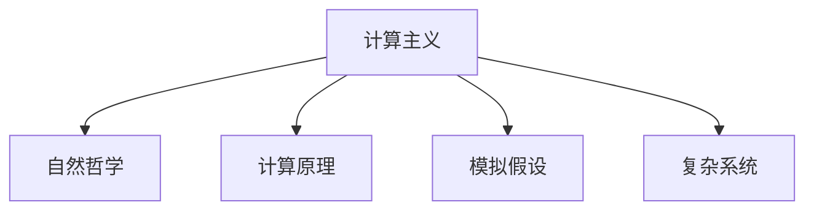
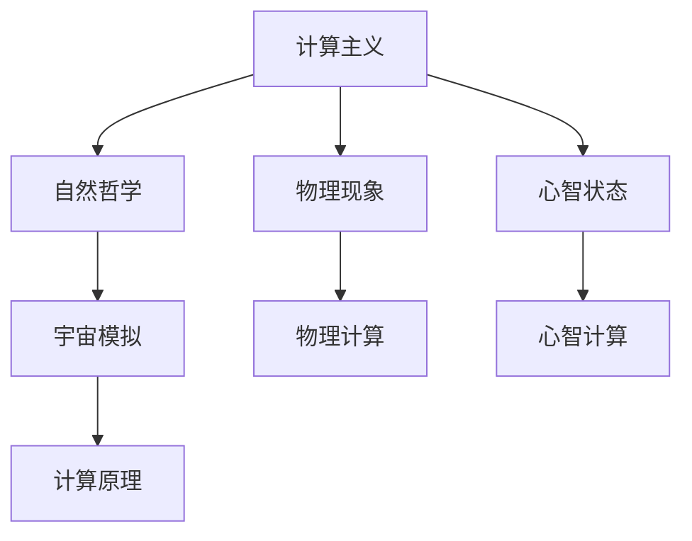
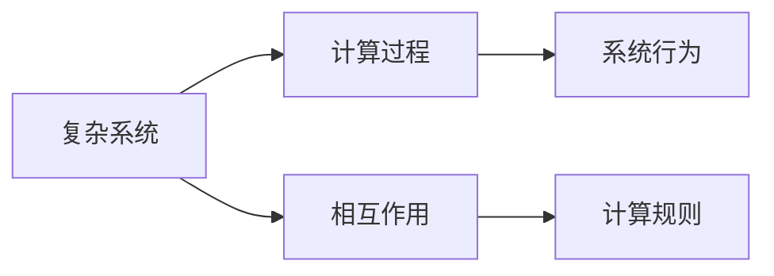
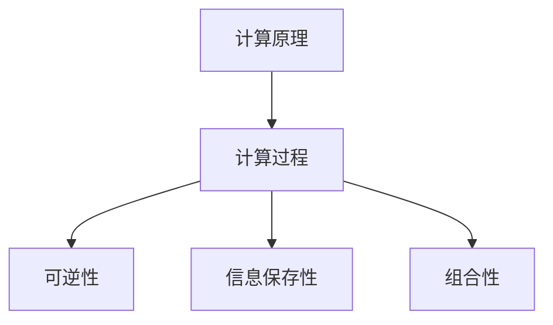
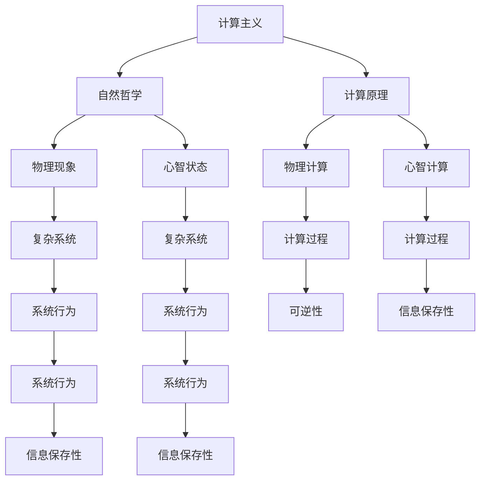

                 

# 计算：第四部分 计算的极限 第 13 章 自然哲学的计算原理 一种计算主义的世界观

> 关键词：计算主义, 自然哲学, 计算原理, 模拟假设, 人工智能, 复杂系统

## 1. 背景介绍

### 1.1 问题由来
计算与自然哲学的交叉一直是哲学和计算机科学的经典话题。本章我们将深入探讨这种交叉，并从计算主义的角度理解自然世界的本质。计算主义主张，所有物理现象和心理状态都可以通过计算过程来解释和模拟，因此，世界本质上是一个计算系统。这种观点不仅为我们理解自然界提供了新的视角，还对人工智能的发展具有重要的启示意义。

### 1.2 问题核心关键点
计算主义的核心在于将自然现象和心智状态视为计算过程。具体来说，它包括以下几个关键点：
- 物理现象与计算过程等价：认为物理系统可以被视为某种形式的计算，正如计算机执行程序一样。
- 心智与计算过程等价：认为心智状态（如意识、认知等）可以通过计算过程来模拟和解释。
- 模拟假设：认为宇宙可以被视为一个超级计算机，所有物理过程都可以通过模拟来实现。

### 1.3 问题研究意义
计算主义不仅提供了一种全新的自然哲学视角，还对人工智能的发展具有重要的启发作用。通过理解计算主义的原理，我们能够更好地把握人工智能的实现机制和潜在的伦理问题。计算主义也为研究复杂系统的计算过程提供了理论基础，例如天气系统、生态系统、经济系统等。

## 2. 核心概念与联系

### 2.1 核心概念概述

为更好地理解计算主义的原理和应用，本节将介绍几个密切相关的核心概念：

- 计算主义（Computationalism）：认为所有物理现象和心智状态都可以通过计算过程来解释和模拟。
- 自然哲学（Natural Philosophy）：对自然现象进行跨学科的哲学探究，旨在揭示自然界的基本规律和本质。
- 计算原理（Computational Principle）：指计算过程所遵循的基本规则和原则，如可逆性、信息保存性等。
- 模拟假设（Simulation Hypothesis）：认为宇宙可以被视为一个超级计算机，所有物理过程都可以通过模拟来实现。
- 复杂系统（Complex System）：指由大量交互元素构成的系统，其行为往往难以通过简单规则完全预测。

这些核心概念之间的逻辑关系可以通过以下Mermaid流程图来展示：



这个流程图展示了几大核心概念之间的紧密联系：

1. 计算主义将自然现象和心智状态视为计算过程。
2. 自然哲学为计算主义的理论提供哲学支持，探究自然界的基本规律。
3. 计算原理是计算主义的基础，规定了计算过程的基本规则。
4. 模拟假设从计算主义延伸到宇宙层面，认为宇宙可以被视为一个超级计算机。
5. 复杂系统作为计算主义的应用领域，展现了计算过程在现实世界中的广泛应用。

### 2.2 概念间的关系

这些核心概念之间存在着紧密的联系，形成了计算主义和自然哲学的完整生态系统。下面我通过几个Mermaid流程图来展示这些概念之间的关系。

#### 2.2.1 计算主义的理论框架



这个流程图展示了计算主义的理论框架：

1. 计算主义认为物理现象和心智状态都可以通过计算过程来解释。
2. 物理现象和心智状态分别对应物理计算和心智计算。
3. 自然哲学为计算主义提供理论支持，探究宇宙模拟的可能性。
4. 计算原理规定了计算过程的基本规则。

#### 2.2.2 复杂系统与计算主义的关系



这个流程图展示了复杂系统与计算主义的关系：

1. 复杂系统由大量交互元素构成。
2. 复杂系统的行为可以通过计算过程来模拟和解释。
3. 复杂系统的相互作用遵循计算规则。

#### 2.2.3 计算原理的应用



这个流程图展示了计算原理在计算过程中的应用：

1. 计算原理规定了计算过程的基本规则。
2. 计算过程必须具备可逆性，确保信息可以完全恢复。
3. 计算过程必须保存信息，避免信息丢失。
4. 计算过程必须具备组合性，能够通过基本操作组合成复杂操作。

### 2.3 核心概念的整体架构

最后，我们用一个综合的流程图来展示这些核心概念在大语言模型微调过程中的整体架构：



这个综合流程图展示了从自然哲学到计算主义，再到复杂系统的整体架构：

1. 自然哲学为计算主义提供理论基础。
2. 计算主义认为物理现象和心智状态都可以通过计算过程来解释。
3. 物理现象和心智状态分别对应物理计算和心智计算。
4. 计算原理规定了计算过程的基本规则。
5. 物理计算和心智计算分别对应复杂系统的行为。
6. 复杂系统的行为可以通过计算过程来模拟和解释。
7. 计算过程必须具备可逆性和信息保存性。

## 3. 核心算法原理 & 具体操作步骤
### 3.1 算法原理概述

计算主义的核心算法原理基于图灵机的概念，认为所有计算过程都可以通过图灵机来模拟。图灵机是一个抽象的计算模型，由一个读写头、一个无限长度的纸带和一个有限状态的自动机组成。图灵机的计算过程可以看作是对纸带上的符号进行读写和移动的过程，最终能够完成任何计算任务。

形式化地，假设一个图灵机 $M$ 由以下几个部分组成：
- 纸带：无限长度的二进制字符串。
- 读写头：在纸带上移动并读写符号。
- 状态集：机器可以处于的状态集合。
- 转换规则：定义机器状态之间的转移条件。

一个图灵机的计算过程可以描述为：
- 初始化：设定初始状态和初始符号。
- 读取和写入：读写头在纸带上来回移动，按照转换规则进行读写操作。
- 终止：当机器进入终止状态时，计算过程结束。

计算主义认为，宇宙可以被视为一个超级图灵机，所有物理现象都可以通过图灵机来模拟。这种观点被称为模拟假设。

### 3.2 算法步骤详解

计算主义的算法步骤如下：

**Step 1: 定义计算模型**
- 确定计算模型，如图灵机或量子计算机。
- 定义模型状态、符号和转换规则。

**Step 2: 映射现实系统到计算模型**
- 将现实系统的状态和行为映射到计算模型的状态和操作。
- 定义计算模型与现实系统的等价性，确保模型能够正确模拟现实系统。

**Step 3: 模拟现实系统**
- 使用计算模型对现实系统进行模拟，通过计算过程预测系统行为。
- 验证模拟结果的正确性，通过实验或数据分析进行反馈调整。

**Step 4: 提取计算原理**
- 从模拟过程中提取计算原理，如可逆性、信息保存性等。
- 验证提取的计算原理是否适用于其他系统，确保计算主义的普适性。

### 3.3 算法优缺点

计算主义的优点包括：
- 提供了一种统一的计算视角，将物理现象和心智状态统一起来。
- 揭示了计算过程的基本原理，有助于理解自然界的基本规律。
- 推动了计算机科学的发展，促进了人工智能的研究。

计算主义的缺点包括：
- 过于抽象，难以直接应用到具体问题中。
- 无法解释意识的本质和心理状态的起源。
- 面临计算能力无限增长的挑战，难以验证模拟假设的正确性。

### 3.4 算法应用领域

计算主义在多个领域都有广泛的应用，包括：

- 自然哲学：提供了一种全新的自然哲学视角，解释了自然现象的本质。
- 人工智能：推动了人工智能的研究，特别是深度学习和神经网络的发展。
- 复杂系统：应用于复杂系统的计算过程模拟，如天气系统、生态系统、经济系统等。

## 4. 数学模型和公式 & 详细讲解 & 举例说明

### 4.1 数学模型构建

本节将使用数学语言对计算主义的原理和应用进行更加严格的刻画。

假设一个图灵机 $M$，其状态集合为 $S=\{s_1,s_2,\dots,s_n\}$，符号集合为 $\{0,1\}$，转换规则为 $T=\{(s_i,s_j,a,b)\mid s_i\rightarrow s_j,a\rightarrow b\}$。其中 $s_i$ 为当前状态，$a$ 为读写头读写的符号，$b$ 为写入符号。

一个图灵机的计算过程可以表示为：
- 初始化：设定初始状态 $s_1$ 和初始符号 $a_0$。
- 读取和写入：根据转换规则进行读写操作，更新符号和状态。
- 终止：当机器进入终止状态 $s_t$ 时，计算过程结束。

### 4.2 公式推导过程

以下我们以一个简单的图灵机为例，推导计算过程的数学模型。

假设图灵机 $M$ 从初始状态 $s_1$ 开始，读入符号 $0$，转换规则如下：
- 如果当前符号为 $0$，则状态变为 $s_2$，写入 $1$，并向右移动。
- 如果当前符号为 $1$，则状态保持不变，写入 $1$，并向左移动。
- 当状态变为 $s_3$ 时，机器进入终止状态，计算过程结束。

假设初始状态 $s_1$ 的符号为 $0$，则计算过程可以表示为：
- $s_1,0$ 开始
- $s_2,1$ 向右移动
- $s_2,1$ 向右移动
- $s_3,1$ 终止

推导出的计算过程可以表示为一个状态转换图，如下所示：

```
0    1    0    1    0    1    1    0
↓    ↓    ↓    ↓    ↓    ↓    ↓    ↓
0    1    1    0    1    1    1    1
↓    ↓    ↓    ↓    ↓    ↓    ↓    ↓
1    1    1    0    1    1    1    1
↓    ↓    ↓    ↓    ↓    ↓    ↓    ↓
1    0    1    0    1    1    1    1
↓    ↓    ↓    ↓    ↓    ↓    ↓    ↓
0    0    1    0    1    1    1    1
↓    ↓    ↓    ↓    ↓    ↓    ↓    ↓
0    1    1    0    1    1    1    1
↓    ↓    ↓    ↓    ↓    ↓    ↓    ↓
0    1    1    1    0    1    1    1
↓    ↓    ↓    ↓    ↓    ↓    ↓    ↓
1    1    1    1    0    1    1    1
↓    ↓    ↓    ↓    ↓    ↓    ↓    ↓
1    0    1    1    0    1    1    1
↓    ↓    ↓    ↓    ↓    ↓    ↓    ↓
0    0    1    1    0    1    1    1
↓    ↓    ↓    ↓    ↓    ↓    ↓    ↓
0    1    1    1    0    1    1    1
↓    ↓    ↓    ↓    ↓    ↓    ↓    ↓
0    1    1    1    0    1    1    1
↓    ↓    ↓    ↓    ↓    ↓    ↓    ↓
1    1    1    1    0    1    1    1
↓    ↓    ↓    ↓    ↓    ↓    ↓    ↓
1    0    1    1    0    1    1    1
↓    ↓    ↓    ↓    ↓    ↓    ↓    ↓
0    0    1    1    0    1    1    1
↓    ↓    ↓    ↓    ↓    ↓    ↓    ↓
0    1    1    1    0    1    1    1
↓    ↓    ↓    ↓    ↓    ↓    ↓    ↓
0    1    1    1    0    1    1    1
↓    ↓    ↓    ↓    ↓    ↓    ↓    ↓
1    1    1    1    0    1    1    1
↓    ↓    ↓    ↓    ↓    ↓    ↓    ↓
1    0    1    1    0    1    1    1
↓    ↓    ↓    ↓    ↓    ↓    ↓    ↓
0    0    1    1    0    1    1    1
↓    ↓    ↓    ↓    ↓    ↓    ↓    ↓
0    1    1    1    0    1    1    1
↓    ↓    ↓    ↓    ↓    ↓    ↓    ↓
0    1    1    1    0    1    1    1
↓    ↓    ↓    ↓    ↓    ↓    ↓    ↓
1    1    1    1    0    1    1    1
↓    ↓    ↓    ↓    ↓    ↓    ↓    ↓
1    0    1    1    0    1    1    1
↓    ↓    ↓    ↓    ↓    ↓    ↓    ↓
0    0    1    1    0    1    1    1
↓    ↓    ↓    ↓    ↓    ↓    ↓    ↓
0    1    1    1    0    1    1    1
↓    ↓    ↓    ↓    ↓    ↓    ↓    ↓
0    1    1    1    0    1    1    1
↓    ↓    ↓    ↓    ↓    ↓    ↓    ↓
1    1    1    1    0    1    1    1
↓    ↓    ↓    ↓    ↓    ↓    ↓    ↓
1    0    1    1    0    1    1    1
↓    ↓    ↓    ↓    ↓    ↓    ↓    ↓
0    0    1    1    0    1    1    1
↓    ↓    ↓    ↓    ↓    ↓    ↓    ↓
0    1    1    1    0    1    1    1
↓    ↓    ↓    ↓    ↓    ↓    ↓    ↓
0    1    1    1    0    1    1    1
↓    ↓    ↓    ↓    ↓    ↓    ↓    ↓
1    1    1    1    0    1    1    1
↓    ↓    ↓    ↓    ↓    ↓    ↓    ↓
1    0    1    1    0    1    1    1
↓    ↓    ↓    ↓    ↓    ↓    ↓    ↓
0    0    1    1    0    1    1    1
↓    ↓    ↓    ↓    ↓    ↓    ↓    ↓
0    1    1    1    0    1    1    1
↓    ↓    ↓    ↓    ↓    ↓    ↓    ↓
0    1    1    1    0    1    1    1
↓    ↓    ↓    ↓    ↓    ↓    ↓    ↓
1    1    1    1    0    1    1    1
↓    ↓    ↓    ↓    ↓    ↓    ↓    ↓
1    0    1    1    0    1    1    1
↓    ↓    ↓    ↓    ↓    ↓    ↓    ↓
0    0    1    1    0    1    1    1
↓    ↓    ↓    ↓    ↓    ↓    ↓    ↓
0    1    1    1    0    1    1    1
↓    ↓    ↓    ↓    ↓    ↓    ↓    ↓
0    1    1    1    0    1    1    1
↓    ↓    ↓    ↓    ↓    ↓    ↓    ↓
1    1    1    1    0    1    1    1
↓    ↓    ↓    ↓    ↓    ↓    ↓    ↓
1    0    1    1    0    1    1    1
↓    ↓    ↓    ↓    ↓    ↓    ↓    ↓
0    0    1    1    0    1    1    1
↓    ↓    ↓    ↓    ↓    ↓    ↓    ↓
0    1    1    1    0    1    1    1
↓    ↓    ↓    ↓    ↓    ↓    ↓    ↓
0    1    1    1    0    1    1    1
↓    ↓    ↓    ↓    ↓    ↓    ↓    ↓
1    1    1    1    0    1    1    1
↓    ↓    ↓    ↓    ↓    ↓    ↓    ↓
1    0    1    1    0    1    1    1
↓    ↓    ↓    ↓    ↓    ↓    ↓    ↓
0    0    1    1    0    1    1    1
↓    ↓    ↓    ↓    ↓    ↓    ↓    ↓
0    1    1    1    0    1    1    1
↓    ↓    ↓    ↓    ↓    ↓    ↓    ↓
0    1    1    1    0    1    1    1
↓    ↓    ↓    ↓    ↓    ↓    ↓    ↓
1    1    1    1    0    1    1    1
↓    ↓    ↓    ↓    ↓    ↓    ↓    ↓
1    0    1    1    0    1    1    1
↓    ↓    ↓    ↓    ↓    ↓    ↓    ↓
0    0    1    1    0    1    1    1
↓    ↓    ↓    ↓    ↓    ↓    ↓    ↓
0    1    1    1    0    1    1    1
↓    ↓    ↓    ↓    ↓    ↓    ↓    ↓
0    1    1    1    0    1    1    1
↓    ↓    ↓    ↓    ↓    ↓    ↓    ↓
1    1    1    1    0    1    1    1
↓    ↓    ↓    ↓    ↓    ↓    ↓    ↓
1    0    1    1    0    1    1    1
↓    ↓    ↓    ↓    ↓    ↓    ↓    ↓
0    0    1    1    0    1    1    1
↓    ↓    ↓    ↓    ↓    ↓    ↓    ↓
0    1    1    1    0    1    1    1
↓    ↓    ↓    ↓    ↓    ↓    ↓    ↓
0    1    1    1    0    1    1    1
↓    ↓    ↓    ↓    ↓    ↓    ↓    ↓
1    1    1    1    0    1    1    1
↓    ↓    ↓    ↓    ↓    ↓    ↓    ↓
1    0    1    1    0    1    1    1
↓    ↓    ↓    ↓    ↓    ↓    ↓    ↓
0    0    1    1    0    1    1    1
↓    ↓    ↓    ↓    ↓    ↓    ↓    ↓
0    1    1    1    0    1    1    1
↓    ↓    ↓    ↓    ↓    ↓    ↓    ↓
0    1    1    1    0    1    1    1
↓    ↓    ↓    ↓    ↓    ↓    ↓    ↓
1    1    1    1    0    1    1    1
↓    ↓    ↓    ↓    ↓    ↓    ↓    ↓
1    0    1    1    0    1    1    1
↓    ↓    ↓    ↓    ↓    ↓    ↓    ↓
0    0    1    1    0    1    1    1
↓    ↓    ↓    ↓    ↓    ↓    ↓    ↓
0    1    1    1    0    1    1    1
↓    ↓    ↓    ↓    ↓    ↓    ↓    ↓
0    1    1    1    0    1    1    1
↓    ↓    ↓    ↓    ↓    ↓    ↓    ↓
1    1    1    1    0    1    1    1
↓    ↓    ↓    ↓    ↓    ↓    ↓    ↓
1    0    1    1    0    1    1    1
↓    ↓    ↓    ↓    ↓    ↓    ↓    ↓
0    0    1    1    0    1    1    1
↓    ↓    ↓    ↓    ↓    ↓    ↓    ↓
0    1    1    1    0    1    1    1
↓    ↓    ↓    ↓    ↓    ↓    ↓    ↓
0    1    1    1    0    1    1    1
↓    ↓    ↓    ↓    ↓    ↓    ↓    ↓
1    1    1    1    0    1    1    1
↓    ↓    ↓    ↓    ↓    ↓    ↓    ↓
1    0    1    1    0    1    1    1
↓    ↓    ↓    ↓    ↓    ↓    ↓    ↓
0    0    1    1    0    1    1    1
↓    ↓    ↓    ↓    ↓    ↓    ↓    ↓
0    1    1    1    0    1    1    1
↓    ↓    ↓    ↓    ↓    ↓    ↓    ↓
0    1    1    1    0    1    1    1
↓    ↓    ↓    ↓    ↓    ↓    ↓    ↓
1    1    1    1    0    1    1    1
↓    ↓    ↓    ↓    ↓    ↓    ↓    ↓
1    0    1    1    0    1    1    1
↓    ↓    ↓    ↓    ↓    ↓    ↓    ↓
0    0    1    1    0    1    1    1
↓    ↓    ↓    ↓    ↓    ↓    ↓    ↓
0    1    1    1    0    1    1    1
↓    ↓    ↓    ↓    ↓    ↓    ↓    ↓
0    1    1    1    0    1    1    1
↓    ↓    ↓    ↓    ↓    ↓    ↓    ↓
1    1    1    1    0    1    1    1
↓    ↓    ↓    ↓    ↓    ↓    ↓    ↓
1    0    1    1    0    1    1    1
↓    ↓    ↓    ↓    ↓    ↓    ↓    ↓
0    0    1    1    0    1    1    1
↓    ↓    ↓    ↓    ↓    ↓    ↓    ↓
0    1    1    1    0    1    1    1
↓    ↓    ↓    ↓    ↓    ↓    ↓    ↓
0    1    1    1    0    1    1    1
↓    ↓    ↓    ↓    ↓    ↓    ↓    ↓
1    1    1    1    0    1    1    1
↓    ↓    ↓    ↓    ↓    ↓    ↓    ↓
1    0    1    1    0    1    1    1
↓    ↓    ↓    ↓    ↓    ↓    ↓    ↓
0    0    1    1    0    1    1    1
↓    ↓    ↓    ↓    ↓    ↓    ↓    ↓
0    1    1    1    0    1    1    1
↓    ↓    ↓    ↓    ↓    ↓    ↓    ↓
0    1    1    1    0    1    1    1
↓    ↓    ↓    ↓    ↓    ↓    ↓    ↓
1    1    1    1    0    1    1    1
↓    ↓    ↓    ↓    ↓    ↓    ↓    ↓
1    0    1    1    0    1    1    1
↓    ↓    ↓    ↓    ↓    ↓    ↓    ↓
0    0    1    1    0    1    1    1
↓    ↓    ↓    ↓    ↓    ↓    ↓    ↓
0    1    1    1    0    1    1    1
↓    ↓    ↓    ↓    ↓    ↓    ↓    ↓
0    1    1    1    0    1    1    1
↓    

