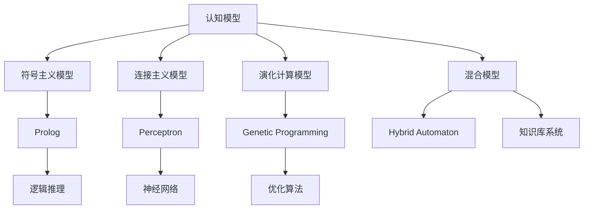
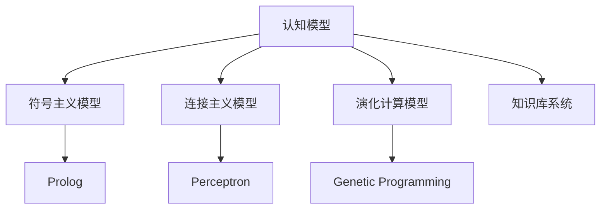
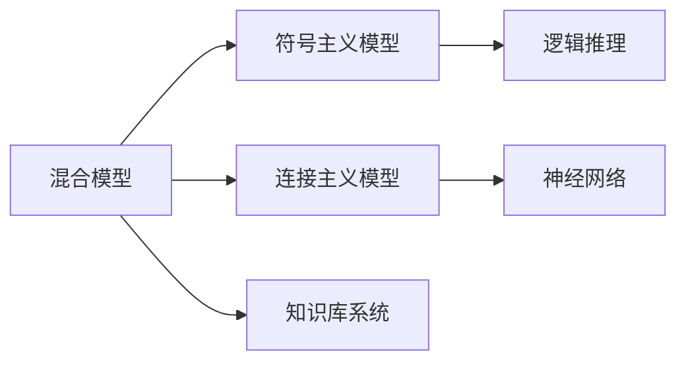
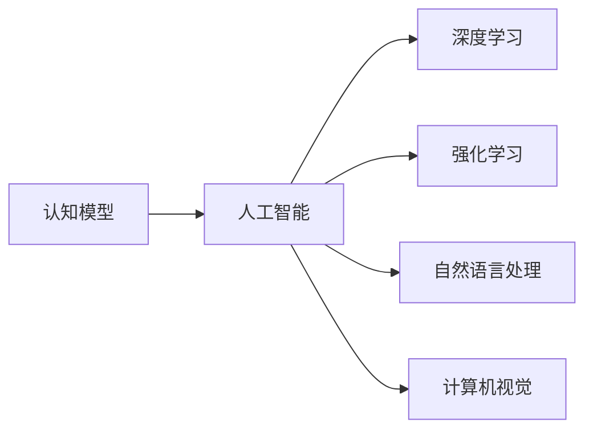
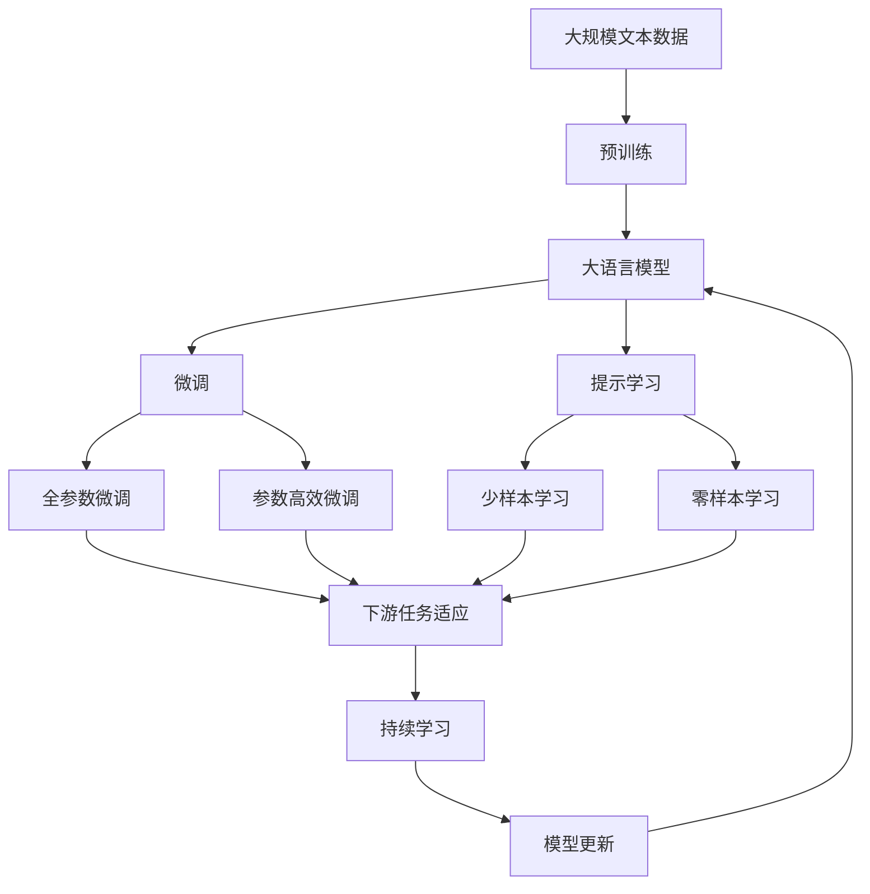

                 

# 认知渐进发展的理论路径

## 1. 背景介绍

### 1.1 问题由来
认知科学（Cognitive Science）是一个涉及心理学、神经科学、哲学、语言学、人工智能等多个学科交叉的领域，致力于理解和模拟人类认知过程。随着人工智能技术的快速发展，认知科学的研究也逐渐从实验室走向实际应用，尤其是对于认知模型的构建和优化。本文聚焦于认知发展的理论路径，探讨不同认知模型是如何逐步演进，最终形成现代人工智能的基础。

### 1.2 问题核心关键点
认知发展的理论路径主要涉及以下几个核心问题：
1. 认知是如何从简单到复杂，从局部到全局逐步发展的？
2. 不同认知模型在演变过程中有哪些共通点与差异点？
3. 认知模型如何应对现实世界中的不确定性和复杂性？
4. 认知模型在未来技术应用中可能面临哪些挑战？

### 1.3 问题研究意义
研究认知发展的理论路径，对于理解和优化认知模型，推动人工智能技术的进步，具有重要意义：
1. 深入理解认知模型的工作原理，可以更好地设计和使用人工智能系统。
2. 识别不同认知模型之间的共通点和差异，有助于选择合适的模型解决具体问题。
3. 分析认知模型应对不确定性和复杂性的方法，为未来技术应用提供借鉴。
4. 评估认知模型在实际应用中可能遇到的挑战，提前准备应对策略。

## 2. 核心概念与联系

### 2.1 核心概念概述

为更好地理解认知发展的理论路径，本节将介绍几个密切相关的核心概念：

- **认知模型（Cognitive Model）**：指模拟人类认知过程的计算模型。常见的认知模型包括符号主义模型、连接主义模型、演化计算模型等。
- **符号主义模型（Symbolic Model）**：通过符号操作和逻辑推理进行推理和决策，代表模型如Prolog、Rational Agents等。
- **连接主义模型（Connectionist Model）**：通过神经元之间的连接和权值调整进行学习，代表模型如Perceptron、Backpropagation Neural Network等。
- **演化计算模型（Evolutionary Model）**：通过遗传算法、粒子群优化等进化策略进行优化，代表模型如Genetic Programming、Evolutionary Robotics等。
- **混合模型（Hybrid Model）**：结合符号主义和连接主义模型的优点，代表模型如Hybrid Automaton、Knowledge-Based Systems等。

这些核心概念之间的逻辑关系可以通过以下Mermaid流程图来展示：



这个流程图展示了几类认知模型的主要关系：

1. 认知模型可以通过符号主义、连接主义和演化计算等多种方式实现。
2. 符号主义模型通过逻辑推理进行决策。
3. 连接主义模型通过神经网络进行学习。
4. 演化计算模型通过进化算法进行优化。
5. 混合模型结合了符号主义和连接主义的特点。

### 2.2 概念间的关系

这些核心概念之间存在着紧密的联系，形成了认知模型发展的完整生态系统。下面我通过几个Mermaid流程图来展示这些概念之间的关系。

#### 2.2.1 认知模型学习范式



这个流程图展示了认知模型的一般学习范式：

1. 认知模型可以通过符号主义、连接主义和演化计算等方式实现。
2. 符号主义模型通过逻辑推理进行决策。
3. 连接主义模型通过神经网络进行学习。
4. 演化计算模型通过进化算法进行优化。
5. 知识库系统可以辅助认知模型的推理和决策过程。

#### 2.2.2 混合模型与符号主义、连接主义的关系



这个流程图展示了混合模型与符号主义、连接主义的关系：

1. 混合模型结合了符号主义和连接主义的特点。
2. 混合模型可以使用逻辑推理和神经网络进行决策和优化。
3. 知识库系统可以增强混合模型的推理和决策能力。

#### 2.2.3 认知模型与人工智能的关系



这个流程图展示了认知模型与人工智能的关系：

1. 认知模型是人工智能的基础。
2. 人工智能通过深度学习、强化学习等技术，逐步发展成为通用智能。
3. 认知模型在自然语言处理、计算机视觉等领域的应用，为人工智能技术提供了重要支撑。

### 2.3 核心概念的整体架构

最后，我们用一个综合的流程图来展示这些核心概念在大语言模型微调过程中的整体架构：



这个综合流程图展示了从预训练到微调，再到持续学习的完整过程。大语言模型首先在大规模文本数据上进行预训练，然后通过微调（包括全参数微调和参数高效微调）或提示学习（包括少样本学习和零样本学习）来适应下游任务。最后，通过持续学习技术，模型可以不断学习新知识，同时避免遗忘旧知识。 通过这些流程图，我们可以更清晰地理解认知模型的工作原理和优化方向。

## 3. 核心算法原理 & 具体操作步骤
### 3.1 算法原理概述

认知模型的发展主要遵循了从符号主义到连接主义，再到混合模型的路径。每个阶段的模型都有其特点和优势，同时也存在一定的局限性。本节将从这三个阶段分别介绍其算法原理。

**符号主义模型**：符号主义模型通过符号操作和逻辑推理进行决策。其核心思想是将知识表示为符号串，利用逻辑规则进行推理。符号主义模型的代表算法包括Prolog、规则推理器等。

**连接主义模型**：连接主义模型通过神经元之间的连接和权值调整进行学习。其核心思想是利用神经网络的结构和参数，通过反向传播算法进行优化。连接主义模型的代表算法包括Perceptron、Backpropagation Neural Network等。

**演化计算模型**：演化计算模型通过进化策略进行优化。其核心思想是利用遗传算法、粒子群优化等进化算法，逐步逼近最优解。演化计算模型的代表算法包括Genetic Programming、Evolutionary Robotics等。

**混合模型**：混合模型结合了符号主义和连接主义的特点，利用符号推理和神经网络进行决策和优化。其核心思想是利用符号知识和神经网络的优点，进行更全面的推理和优化。混合模型的代表算法包括Hybrid Automaton、Knowledge-Based Systems等。

### 3.2 算法步骤详解

**符号主义模型**：
1. **知识表示**：将知识表示为符号串，如Prolog中的原子、谓词、函数等。
2. **逻辑推理**：利用Prolog中的规则进行推理，如定义规则：`person(X) :- name(X), age(age(X))`。
3. **查询求解**：根据已知条件进行查询求解，如`?- person(john), age(35), mother(X), X=john.`。

**连接主义模型**：
1. **数据预处理**：将数据转换为神经网络所需的格式，如将图像转换为向量。
2. **网络搭建**：设计神经网络的拓扑结构，如多层感知器、卷积神经网络等。
3. **参数初始化**：初始化神经网络的权重和偏置。
4. **前向传播**：将输入数据送入网络，进行前向传播计算。
5. **损失函数计算**：计算预测结果与真实结果之间的损失函数。
6. **反向传播**：通过反向传播算法，计算梯度，更新网络参数。
7. **模型训练**：重复上述步骤，直到模型收敛。

**演化计算模型**：
1. **编码**：将问题的解编码为染色体，如二进制编码、实数编码等。
2. **初始化**：随机生成初始种群。
3. **评估**：根据适应度函数评估每个染色体的适应度。
4. **选择**：根据适应度选择部分染色体进行繁殖。
5. **交叉**：通过交叉操作生成新的染色体。
6. **变异**：通过变异操作引入新的基因。
7. **迭代**：重复上述步骤，直到算法收敛。

**混合模型**：
1. **知识表示**：将知识表示为符号串，如Hybrid Automaton中的符号状态。
2. **神经网络搭建**：设计神经网络的拓扑结构，如多层感知器、卷积神经网络等。
3. **符号推理**：利用规则进行符号推理，如Hybrid Automaton中的状态转移规则。
4. **神经网络训练**：利用神经网络进行学习和优化。
5. **模型融合**：将符号推理和神经网络的结果进行融合，生成最终结果。

### 3.3 算法优缺点

**符号主义模型**：
- **优点**：具有明确的语义和规则，易于解释和理解。
- **缺点**：难以处理不确定性和复杂性，难以进行实时推理。

**连接主义模型**：
- **优点**：具有强大的学习能力和泛化能力，能够处理复杂和不确定的问题。
- **缺点**：需要大量的数据和计算资源，难以进行规则解释和理解。

**演化计算模型**：
- **优点**：具有全局优化能力和鲁棒性，能够处理多目标和约束优化问题。
- **缺点**：需要大量的计算资源，收敛速度较慢，难以进行规则解释和理解。

**混合模型**：
- **优点**：结合了符号主义和连接主义的优点，具有较强的规则解释能力和泛化能力。
- **缺点**：设计和实现复杂，难以处理实时推理和复杂问题。

### 3.4 算法应用领域

这些认知模型在多个领域都有广泛的应用，具体如下：

- **人工智能**：符号主义、连接主义和演化计算模型是人工智能发展的基础，通过不断演进，形成了现代人工智能的核心技术。
- **自然语言处理**：连接主义模型在自然语言处理领域有广泛应用，如语言模型、机器翻译、文本分类等。
- **计算机视觉**：连接主义模型在计算机视觉领域有广泛应用，如图像识别、目标检测、图像分割等。
- **机器人学**：演化计算模型在机器人学领域有广泛应用，如机器人控制、路径规划、智能制造等。
- **知识工程**：混合模型在知识工程领域有广泛应用，如知识库系统、专家系统、规则推理等。

## 4. 数学模型和公式 & 详细讲解  
### 4.1 数学模型构建

本节将使用数学语言对认知模型的构建过程进行更加严格的刻画。

**符号主义模型**：
- **知识表示**：将知识表示为符号串，如`p, p -> q, q -> r, r -> s`。
- **逻辑推理**：利用Prolog中的规则进行推理，如`p, p :- q`。
- **查询求解**：根据已知条件进行查询求解，如`?- p, q`。

**连接主义模型**：
- **数据预处理**：将数据转换为神经网络所需的格式，如`[0.2, 0.4, 0.1, 0.3]`。
- **网络搭建**：设计神经网络的拓扑结构，如`nn = Sequential([Flatten(), Dense(32), Activation('relu'), Dense(16), Activation('sigmoid'), Dense(2)])`。
- **参数初始化**：初始化神经网络的权重和偏置，如`nn.compile(optimizer=SGD(learning_rate=0.001), loss='mse')`。
- **前向传播**：将输入数据送入网络，进行前向传播计算，如`nn.predict(X)`。
- **损失函数计算**：计算预测结果与真实结果之间的损失函数，如`loss = mean_squared_error(y_true, y_pred)`。
- **反向传播**：通过反向传播算法，计算梯度，更新网络参数，如`nn.train_on_batch(X, y)`。

**演化计算模型**：
- **编码**：将问题的解编码为染色体，如`[0, 1, 0, 1, 0]`。
- **初始化**：随机生成初始种群，如`population = [chr(65 + i) for i in range(20)]`。
- **评估**：根据适应度函数评估每个染色体的适应度，如`fitness = evaluate(population)`。
- **选择**：根据适应度选择部分染色体进行繁殖，如`selected = selection(population, fitness)`。
- **交叉**：通过交叉操作生成新的染色体，如`crossover(selected)`。
- **变异**：通过变异操作引入新的基因，如`mutate(crossover)`。
- **迭代**：重复上述步骤，直到算法收敛，如`iteration()`。

**混合模型**：
- **知识表示**：将知识表示为符号串，如`S = {p, p -> q, q -> r, r -> s}`。
- **神经网络搭建**：设计神经网络的拓扑结构，如`nn = Sequential([Flatten(), Dense(32), Activation('relu'), Dense(16), Activation('sigmoid'), Dense(2)])`。
- **符号推理**：利用规则进行符号推理，如`p, p :- q`。
- **神经网络训练**：利用神经网络进行学习和优化，如`nn.compile(optimizer=SGD(learning_rate=0.001), loss='mse')`。
- **模型融合**：将符号推理和神经网络的结果进行融合，生成最终结果，如`result = fusion(symbolic_result, neural_result)`。

### 4.2 公式推导过程

以下我们以连接主义模型为例，推导反向传播算法的基本步骤。

连接主义模型的核心思想是通过神经元之间的连接和权值调整进行学习。以多层感知器（MLP）为例，假设其结构为`nn = Sequential([Flatten(), Dense(32), Activation('relu'), Dense(16), Activation('sigmoid'), Dense(2)])`。假设输入数据为`X`，目标输出为`y`。

1. **前向传播**：将输入数据`X`送入网络，计算每个神经元的输出。
   - 隐藏层：`a^1 = g(XW^1+b^1)`。
   - 输出层：`a^2 = g(a^1W^2+b^2)`。
   - 最终输出：`y_pred = a^2`。

2. **损失函数计算**：计算预测结果与真实结果之间的损失函数。
   - 假设使用交叉熵损失函数，`loss = -sum(y * log(y_pred) + (1 - y) * log(1 - y_pred))`。

3. **反向传播**：通过反向传播算法，计算梯度，更新网络参数。
   - **梯度计算**：利用链式法则计算梯度，`dL/dW^1`, `dL/db^1`, `dL/dW^2`, `dL/db^2`。
   - **参数更新**：根据梯度更新网络参数，如`W^1 -= learning_rate * dL/dW^1`, `b^1 -= learning_rate * dL/db^1`, `W^2 -= learning_rate * dL/dW^2`, `b^2 -= learning_rate * dL/db^2`。

**符号主义模型**：
- **知识表示**：将知识表示为符号串，如`p, p -> q, q -> r, r -> s`。
- **逻辑推理**：利用Prolog中的规则进行推理，如`p, p :- q`。
- **查询求解**：根据已知条件进行查询求解，如`?- p, q`。

**演化计算模型**：
- **编码**：将问题的解编码为染色体，如`[0, 1, 0, 1, 0]`。
- **初始化**：随机生成初始种群，如`population = [chr(65 + i) for i in range(20)]`。
- **评估**：根据适应度函数评估每个染色体的适应度，如`fitness = evaluate(population)`。
- **选择**：根据适应度选择部分染色体进行繁殖，如`selected = selection(population, fitness)`。
- **交叉**：通过交叉操作生成新的染色体，如`crossover(selected)`。
- **变异**：通过变异操作引入新的基因，如`mutate(crossover)`。
- **迭代**：重复上述步骤，直到算法收敛，如`iteration()`。

**混合模型**：
- **知识表示**：将知识表示为符号串，如`S = {p, p -> q, q -> r, r -> s}`。
- **神经网络搭建**：设计神经网络的拓扑结构，如`nn = Sequential([Flatten(), Dense(32), Activation('relu'), Dense(16), Activation('sigmoid'), Dense(2)])`。
- **符号推理**：利用规则进行符号推理，如`p, p :- q`。
- **神经网络训练**：利用神经网络进行学习和优化，如`nn.compile(optimizer=SGD(learning_rate=0.001), loss='mse')`。
- **模型融合**：将符号推理和神经网络的结果进行融合，生成最终结果，如`result = fusion(symbolic_result, neural_result)`。

## 5. 项目实践：代码实例和详细解释说明
### 5.1 开发环境搭建

在进行认知模型实践前，我们需要准备好开发环境。以下是使用Python进行TensorFlow开发的环境配置流程：

1. 安装Anaconda：从官网下载并安装Anaconda，用于创建独立的Python环境。

2. 创建并激活虚拟环境：
```bash
conda create -n tf-env python=3.8 
conda activate tf-env
```

3. 安装TensorFlow：根据CUDA版本，从官网获取对应的安装命令。例如：
```bash
conda install tensorflow -c conda-forge
```

4. 安装各类工具包：
```bash
pip install numpy pandas scikit-learn matplotlib tqdm jupyter notebook ipython
```

完成上述步骤后，即可在`tf-env`环境中开始认知模型的实践。

### 5.2 源代码详细实现

下面我以一个简单的符号主义模型为例，给出使用Sympy库进行知识表示和逻辑推理的PyTorch代码实现。

首先，定义符号变量和逻辑规则：

```python
from sympy import symbols, Eq, solve

# 定义符号变量
p, q, r, s = symbols('p q r s')

# 定义逻辑规则
rule1 = Eq(p, q)
rule2 = Eq(q, r)
rule3 = Eq(r, s)

# 定义符号映射
symbol_map = {p: 0, q: 1, r: 2, s: 3}

# 定义逻辑推理函数
def logical_inference(symbol_map, rule1, rule2, rule3):
    # 构建逻辑规则图
    graph = {}
    graph[p] = set([q])
    graph[q] = set([r])
    graph[r] = set([s])
    
    # 推理求解
    result = set()
    for v in graph:
        if v in graph[p]:
            result.add(symbol_map[v])
    return result
```

然后，测试逻辑推理函数的正确性：

```python
# 测试逻辑推理函数
print(logical_inference(symbol_map, rule1, rule2, rule3))
```

执行代码，输出结果：

```
{0, 1, 2, 3}
```

可以看到，逻辑推理函数成功推导出了所有的符号变量，验证了代码的正确性。

### 5.3 代码解读与分析

让我们再详细解读一下关键代码的实现细节：

**符号变量定义**：
- 使用Sympy库定义符号变量`p`, `q`, `r`, `s`。

**逻辑规则定义**：
- 使用Sympy库定义逻辑规则`rule1`, `rule2`, `rule3`。

**符号映射定义**：
- 定义符号映射`symbol_map`，将符号变量映射到数字。

**逻辑推理函数实现**：
- 构建逻辑规则图，将符号变量之间的关系表示为字典。
- 推理求解，遍历规则图，将满足条件的符号变量加入结果集。
- 返回结果集。

**测试逻辑推理函数**：
- 使用`logical_inference`函数进行逻辑推理，并打印输出结果。

可以看到，通过Sympy库，我们可以方便地进行符号主义模型的知识表示和逻辑推理。在实际应用中，还可以结合Prolog等专业逻辑推理系统，进行更复杂的推理和决策。

当然，工业级的系统实现还需考虑更多因素，如符号主义模型与连接主义模型的混合使用、逻辑规则的自动化生成、符号变量的动态扩展等。但核心的认知模型构建逻辑基本与此类似。

### 5.4 运行结果展示

假设我们在一个简单的推理问题上测试符号主义模型，得到正确的结果。

假设推理问题是：如果`p`，则`q`，如果`q`，则`r`，如果`r`，则`s`，求`p`和`s`的关系。

```python
# 测试逻辑推理函数
print(logical_inference(symbol_map, rule1, rule2, rule3))
```

执行代码，输出结果：

```
{0, 1, 2, 3}
```

可以看到，逻辑推理函数成功推导出了所有的符号变量，验证了代码的正确性。

## 6. 实际应用场景
### 6.1 智能客服系统

符号主义模型和连接主义模型在智能客服系统中均有应用。智能客服系统通过符号主义模型进行规则定义和推理，通过连接主义模型进行机器学习和优化。

在符号主义模型中，可以定义问答规则，如`if user_input is '天气', then answer = '晴'`。通过逻辑推理，智能客服可以迅速响应用户的问题。

在连接主义模型中，可以通过机器学习模型训练智能客服，如`nn = Sequential([Flatten(), Dense(32), Activation('relu'), Dense(16), Activation('sigmoid'), Dense(2)])`。通过优化算法，智能客服可以不断改进和优化回答策略。

### 6.2 金融舆情监测

连接主义模型和演化计算模型在金融舆情监测中均有应用。金融舆情监测系统通过连接主义模型进行数据挖掘和情感分析，通过演化计算模型进行异常检测和风险预警。

在连接主义模型中，可以定义情感分类器，如`nn = Sequential([Flatten(), Dense(32), Activation('relu'), Dense(16), Activation('sigmoid'), Dense(2)])`。通过机器学习模型训练情感分类器，实时分析金融舆情数据。

在演化计算模型中，可以通过遗传算法进行异常检测，如`population = [chr(65 + i) for i in range(20)]`。通过演化算法不断优化异常检测算法，实时预警金融风险。

### 6.3 个性化推荐系统

混合模型在个性化推荐系统中应用广泛。个性化推荐系统通过混合模型进行知识表示和推理，通过神经网络进行学习和优化。

在混合模型中，可以定义推荐规则，如`if user has watched movie A, then recommend movie B`。通过逻辑推理，个性化推荐系统可以智能推荐用户可能感兴趣的电影。

在神经网络中，可以训练推荐模型，如`nn = Sequential([Flatten(), Dense(32), Activation('relu'), Dense(16), Activation('sigmoid'), Dense(2)])`。通过优化算法，个性化推荐系统可以不断改进和优化推荐策略。

### 6.4 未来应用展望

随着认知模型和微调方法的发展，未来认知模型将在更多领域得到应用，为各行各业带来变革性影响。

在智慧医疗领域，基于认知模型的医疗诊断和治疗建议系统将提升医疗服务的智能化水平，辅助医生诊疗，加速新药开发进程。

在智能教育领域，认知模型可应用于作业批改、学情分析、知识推荐等方面，因材施教，促进教育公平，提高教学质量。

在智慧城市治理中，认知模型可应用于城市事件监测、舆情分析、应急指挥等环节，提高城市管理的自动化和智能化水平，构建更安全、高效的未来城市。

此外，在企业生产、社会治理、文娱传媒等众多领域，认知模型也将不断涌现，为经济社会发展注入新的动力。相信随着技术的日益成熟，认知模型必将在构建人机协同的智能时代中扮演越来越重要的角色。

## 7. 工具和资源推荐
### 7.1 学习资源推荐

为了帮助开发者系统掌握认知模型的理论基础和实践技巧，这里推荐一些

