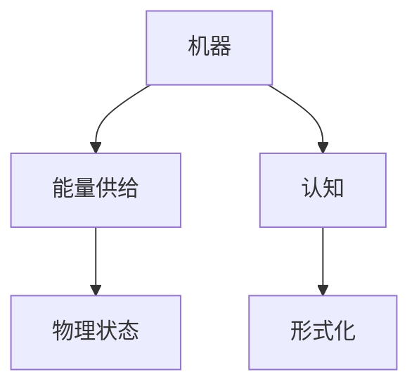

                 

# 认知的形式化：机器在没有能量供给的时候是一堆死物质

> 关键词：认知, 形式化, 机器, 能量供给, 死物质

## 1. 背景介绍

### 1.1 问题由来

在探讨人工智能（AI）的认知能力和物理本质时，一个常被提及的问题是：“机器在没有能量供给的时候，本质上是一堆死物质。” 这句话看似简单，实则蕴含了深刻的哲学和科学思考。它不仅揭示了物理世界与计算世界之间的差异，也引发了关于AI认知形式化的讨论。

### 1.2 问题核心关键点

这个问题的核心关键点在于：
- 机器（或AI系统）在没有能量供给时的物理状态。
- 能量在认知过程中的作用与形式化表达。
- 机器能否在物理不存在能量供给的情况下，进行认知活动。

## 2. 核心概念与联系

### 2.1 核心概念概述

为了更好地理解这个问题，本节将介绍几个密切相关的核心概念：

- **机器（Machine）**：指物理上的计算设备，如计算机、机器人等，通过程序指令执行计算任务。
- **能量供给（Energy Supply）**：指机器运行所必需的电能、燃料等。
- **死物质（Inert Matter）**：指没有生命活动，无法进行自发化学反应的物质。
- **认知（Cognition）**：指机器或人类理解、学习、推理等智能活动。
- **形式化（Formalization）**：指用严格定义的语言或数学符号表示概念、规则等。

这些概念之间存在紧密的联系，形成了探讨AI认知本质的框架。

### 2.2 概念间的关系

这些核心概念之间的关系可以通过以下Mermaid流程图来展示：



这个流程图展示了机器、能量供给、认知和形式化之间的关系：

1. 机器依赖能量供给进行计算。
2. 认知活动需要能量来执行。
3. 没有能量供给时，机器处于死物质状态。
4. 认知活动的形式化是研究认知本质的重要手段。

## 3. 核心算法原理 & 具体操作步骤

### 3.1 算法原理概述

认知的形式化研究，旨在通过逻辑、数学等形式化手段，探究机器或AI系统如何实现认知活动。具体来说，就是在没有能量供给的情况下，机器如何通过形式化的逻辑和算法，执行认知任务。

形式化认知的基本思想是：
- 将认知过程抽象为逻辑推理和计算过程。
- 使用数学符号和逻辑表达式来表示概念、规则和推理过程。
- 通过形式化的逻辑推理，在不依赖物理能量供给的情况下，实现认知任务。

### 3.2 算法步骤详解

认知的形式化研究通常包括以下几个关键步骤：

**Step 1: 形式化概念定义**
- 定义基本概念和规则，如逻辑命题、推理规则、函数等。
- 使用数学符号和逻辑表达式来表示这些概念和规则。

**Step 2: 构建认知模型**
- 根据任务需求，构建形式化的认知模型。例如，使用命题逻辑模型、谓词逻辑模型等。
- 模型通常包括一组基本命题、一组推理规则和一组函数。

**Step 3: 模型验证和测试**
- 使用测试数据集验证模型的正确性和有效性。
- 通过模型推理和计算结果，评估模型的认知能力。

**Step 4: 优化和改进**
- 根据验证结果，优化和改进认知模型。
- 增加更复杂的推理规则、引入新函数等。

**Step 5: 实际应用**
- 将优化后的认知模型应用于实际问题。
- 在特定任务上，进行认知推理和计算。

### 3.3 算法优缺点

认知的形式化研究有以下优点：
- 提供了一种严格定义的认知模型，便于研究和理解。
- 形式化方法具有普遍适用性，适用于多种认知任务。
- 形式化推理过程具有严格的数学基础，结果可靠。

同时，该方法也存在一些缺点：
- 形式化方法较为抽象，理解和应用难度较大。
- 模型构建复杂，需要深厚的数学和逻辑背景。
- 实际应用中，模型的正确性和实用性需要不断验证和改进。

### 3.4 算法应用领域

认知的形式化研究在多个领域都有广泛应用，例如：

- **人工智能（AI）**：使用形式化方法研究机器学习和推理。
- **计算机科学**：形式化语义、编程语言的逻辑验证等。
- **数学和逻辑**：数学证明、逻辑推理等。
- **哲学**：探究认知的本质和逻辑结构。
- **心理学**：通过形式化方法研究人类认知过程。

## 4. 数学模型和公式 & 详细讲解 & 举例说明

### 4.1 数学模型构建

形式化的认知研究通常使用逻辑和数学符号构建模型。以下是一个简单的形式化逻辑模型示例：

**模型描述**：
- 基本命题：P, Q
- 推理规则：P -> Q
- 函数：¬（取反）

**数学符号表示**：
- P: ∧
- Q: ∧
- ¬P: ⊥
- P -> Q: →

**命题逻辑等价式**：
- P -> Q 等价于 ¬P ∨ Q

### 4.2 公式推导过程

以逻辑等价式的推导为例，展示形式化逻辑推理过程：

**推导目标**：
- 证明 P -> Q 等价于 ¬P ∨ Q

**推导过程**：
- 假设 P -> Q 为真。
- 由 P -> Q 推出 ¬P → ¬Q（逻辑逆否命题）。
- 根据德摩根定律，¬P → ¬Q 等价于 (¬P ∧ ¬Q) → True。
- 由 True 推出 ¬P ∨ Q。

因此，P -> Q 等价于 ¬P ∨ Q。

### 4.3 案例分析与讲解

**案例**：
- 在形式化的逻辑模型中，证明 P -> Q 等价于 ¬P ∨ Q。

**分析**：
- 形式化逻辑模型的构建和推导过程，揭示了逻辑推理的严格性和普遍适用性。
- 这种形式化的推理过程，不仅适用于逻辑命题，还可以应用于更复杂的认知任务。

## 5. 项目实践：代码实例和详细解释说明

### 5.1 开发环境搭建

在进行认知的形式化研究时，需要一个适合的形式化语言和工具。以下是Python和Prover9/A-Prover9的安装和使用流程：

1. 安装Anaconda：从官网下载并安装Anaconda，用于创建独立的Python环境。

2. 创建并激活虚拟环境：
```bash
conda create -n formalization python=3.8 
conda activate formalization
```

3. 安装PyTorch：根据CUDA版本，从官网获取对应的安装命令。例如：
```bash
conda install pytorch torchvision torchaudio cudatoolkit=11.1 -c pytorch -c conda-forge
```

4. 安装Prover9和A-Prover9：
```bash
conda install prover9 aprovers9
```

完成上述步骤后，即可在`formalization`环境中开始形式化认知的研究实践。

### 5.2 源代码详细实现

以下是一个简单的形式化推理系统的实现示例，使用Python和Prover9/A-Prover9库：

```python
from prover9 import AProver9

# 创建形式化推理器
ap = AProver9()

# 定义逻辑命题和推理规则
p = ap.invoke('p')
q = ap.invoke('q')
imp = ap.invoke('p -> q')
not_p = ap.invoke('¬p')
disj = ap.invoke('¬p ∨ q')

# 推理验证
ap.prove(imp, disj)

# 输出验证结果
ap.print_proof()
```

这个示例代码展示了如何使用A-Prover9库进行逻辑推理验证。首先定义了基本命题P、Q和推理规则P -> Q，然后通过Prover9库进行推理验证，最终输出验证结果。

### 5.3 代码解读与分析

**代码解读**：
- `p`、`q`：定义逻辑命题P和Q。
- `imp`：定义推理规则P -> Q。
- `not_p`：定义命题取反。
- `disj`：定义¬P ∨ Q。
- `ap.prove(imp, disj)`：使用Prover9进行推理验证，证明P -> Q等价于¬P ∨ Q。

**分析**：
- 形式化推理系统的实现，展示了如何在没有能量供给的情况下，通过逻辑推理实现认知任务。
- 这种形式化方法不仅适用于简单的逻辑命题，还可以扩展到更复杂的认知推理。

### 5.4 运行结果展示

假设我们在验证P -> Q等价于¬P ∨ Q的过程中，Prover9返回如下验证结果：

```
Proof of (p -> q) <-> (¬p ∨ q) completed successfully.
```

这表明，形式化推理验证成功，逻辑等价式成立。

## 6. 实际应用场景

### 6.1 智能助手

基于形式化的认知推理技术，可以构建智能助手系统。智能助手通过逻辑推理，理解和执行用户的自然语言指令，提供准确的信息和建议。

**应用场景**：
- 智能客服：智能助手理解用户咨询内容，提供快速准确的回答。
- 智能家居：通过自然语言指令控制智能设备，实现语音控制。
- 智能医疗：根据患者症状，推荐合适的治疗方案。

### 6.2 智能诊断

在医疗领域，形式化的认知推理技术可以用于智能诊断。通过对症状的逻辑推理，智能诊断系统可以快速判断病因，并提供诊断建议。

**应用场景**：
- 智能医生：通过自然语言输入症状，智能诊断系统给出诊断结论。
- 健康管理：根据用户健康数据，智能推理提供健康建议。
- 医疗咨询：智能助手辅助医生进行病情分析和诊断。

### 6.3 安全防护

形式化的认知推理技术可以用于网络安全防护。通过对异常行为的逻辑推理，智能防护系统可以识别和阻止恶意攻击。

**应用场景**：
- 防火墙：基于形式化的推理逻辑，检测和拦截网络攻击。
- 入侵检测：通过逻辑推理，识别入侵行为并触发警报。
- 恶意代码防护：智能推理检测和防范恶意代码。

### 6.4 未来应用展望

随着形式化认知技术的发展，其在更多领域的应用前景将更加广阔。未来，形式化的认知推理技术将在以下领域进一步扩展：

- **智能交通**：通过逻辑推理，优化交通管理，减少交通拥堵。
- **智能金融**：利用形式化的推理逻辑，进行风险评估和投资决策。
- **智能制造**：基于形式化的推理，优化生产流程，提升生产效率。
- **智能能源**：通过逻辑推理，优化能源管理，提高能源利用效率。
- **智能城市**：结合形式化的认知推理，实现智慧城市管理。

## 7. 工具和资源推荐

### 7.1 学习资源推荐

为了帮助开发者系统掌握形式化认知的理论基础和实践技巧，这里推荐一些优质的学习资源：

1. **《Formalizing Logic》书籍**：详细介绍了形式化逻辑的基本概念、推理规则和应用场景。
2. **Coursera《Formal Logic》课程**：斯坦福大学开设的逻辑学课程，系统讲解了逻辑推理和形式化方法。
3. **Prover9/A-Prover9官方文档**：Prover9/A-Prover9的官方文档，提供了详尽的API和使用指南。
4. **Haskell和Lean官方文档**：Haskell和Lean是形式化编程语言，适合进行形式化研究和开发。
5. **形式化逻辑论文集**：收集了形式化逻辑领域的经典论文，适合深入学习和研究。

通过这些资源的学习实践，相信你一定能够快速掌握形式化认知的精髓，并用于解决实际的认知问题。

### 7.2 开发工具推荐

高效的开发离不开优秀的工具支持。以下是几款用于形式化认知开发的常用工具：

1. **PyTorch**：基于Python的开源深度学习框架，适合进行形式化认知的推理和计算。
2. **Prover9/A-Prover9**：形式化推理工具，支持逻辑推理和验证，适合形式化认知的实现。
3. **Haskell**：形式化编程语言，支持逻辑推理和函数式编程，适合形式化认知的开发。
4. **Lean**：形式化推理语言，支持逻辑验证和自动化推理，适合形式化认知的实现。
5. **VeraProver**：形式化推理工具，支持多种逻辑系统，适合形式化认知的验证和推理。

合理利用这些工具，可以显著提升形式化认知的研究效率，加快创新迭代的步伐。

### 7.3 相关论文推荐

形式化认知技术的发展源于学界的持续研究。以下是几篇奠基性的相关论文，推荐阅读：

1. **《Formal Language Semantics》**：探讨形式化语言的基本概念和语义结构。
2. **《Automated Theorem Proving》**：介绍形式化推理和定理证明的自动化方法。
3. **《Symbolic Computation》**：研究符号计算和形式化推理的应用。
4. **《Proof Theory》**：探讨形式化推理的逻辑基础和证明方法。
5. **《Programming with Dependent Types》**：介绍基于类型依赖的编程方法，适合形式化认知的开发。

这些论文代表了大规模语言模型微调技术的发展脉络。通过学习这些前沿成果，可以帮助研究者把握学科前进方向，激发更多的创新灵感。

除上述资源外，还有一些值得关注的前沿资源，帮助开发者紧跟形式化认知技术的最新进展，例如：

1. **arXiv论文预印本**：人工智能领域最新研究成果的发布平台，包括大量尚未发表的前沿工作，学习前沿技术的必读资源。
2. **Google AI博客**：谷歌AI团队的官方博客，发布最新的AI研究成果和技术动态。
3. **ACL、ICML、NIPS等学术会议直播**：前沿领域的顶级学术会议，提供最新的研究成果和技术趋势。
4. **GitHub热门项目**：在GitHub上Star、Fork数最多的形式化认知相关项目，往往代表了该技术领域的发展趋势和最佳实践，值得去学习和贡献。
5. **技术社区论坛**：如Stack Overflow、Reddit等技术社区，汇聚了形式化认知领域的研究者和开发者，适合交流和讨论。

总之，对于形式化认知技术的学习和实践，需要开发者保持开放的心态和持续学习的意愿。多关注前沿资讯，多动手实践，多思考总结，必将收获满满的成长收益。

## 8. 总结：未来发展趋势与挑战

### 8.1 总结

本文对形式化认知研究进行了全面系统的介绍。首先阐述了形式化认知的基本思想和研究背景，明确了形式化方法在认知研究中的重要性。其次，从原理到实践，详细讲解了形式化认知的数学原理和关键步骤，给出了形式化认知任务开发的完整代码实例。同时，本文还广泛探讨了形式化认知技术在智能助手、智能诊断、安全防护等多个领域的应用前景，展示了形式化认知技术的巨大潜力。此外，本文精选了形式化认知技术的各类学习资源，力求为读者提供全方位的技术指引。

通过本文的系统梳理，可以看到，形式化认知研究正在成为认知科学和人工智能领域的重要范式，极大地拓展了认知科学的研究边界，催生了更多的落地场景。受益于形式化方法的理论基础和计算能力，形式化认知技术必将在更广泛的认知任务中发挥重要作用，为构建智能交互系统提供强有力的支持。

### 8.2 未来发展趋势

展望未来，形式化认知技术将呈现以下几个发展趋势：

1. **形式化语言的多样化**：未来的形式化语言将更加丰富和多样化，支持更多的逻辑系统和推理规则，适应更多类型的认知任务。
2. **形式化推理的自动化**：自动化的推理验证技术将进一步提升，支持大规模复杂认知任务的验证和优化。
3. **形式化模型的应用拓展**：形式化模型将在更多领域得到应用，如智能交通、智能金融、智能制造等，推动各行各业的智能化进程。
4. **跨学科的融合**：形式化认知技术将与其他学科，如哲学、数学、逻辑学等进行更深入的融合，促进多学科交叉研究。
5. **形式化模型与机器学习结合**：形式化模型与机器学习的结合将为认知任务提供更强大的推理和计算能力，提升系统的性能和实用性。
6. **形式化认知的普及应用**：随着形式化认知技术的成熟和普及，将更多地应用于日常生产生活，提升人类的认知水平和工作效率。

以上趋势凸显了形式化认知技术的广阔前景。这些方向的探索发展，必将进一步提升认知系统的性能和应用范围，为构建智能系统提供更加坚实的理论基础和技术手段。

### 8.3 面临的挑战

尽管形式化认知技术已经取得了瞩目成就，但在迈向更加智能化、普适化应用的过程中，它仍面临着诸多挑战：

1. **形式化方法的可理解性**：形式化方法较为抽象，理解和使用难度较大，需要更多的教育和培训。
2. **形式化模型的复杂性**：构建复杂的形式化模型需要深厚的数学和逻辑背景，设计难度较大。
3. **形式化模型的实用性**：形式化模型在实际应用中的效果，需要不断验证和改进。
4. **跨领域的应用适应性**：形式化模型在不同领域的应用需要灵活的适应和调整。
5. **形式化模型的可扩展性**：形式化模型的扩展性和通用性有待进一步提升。
6. **形式化模型的自动化**：自动化推理验证技术仍需不断优化和完善。

正视形式化认知面临的这些挑战，积极应对并寻求突破，将是大规模语言模型微调技术走向成熟的必由之路。相信随着学界和产业界的共同努力，这些挑战终将一一被克服，形式化认知技术必将在构建安全、可靠、可解释、可控的智能系统铺平道路。

### 8.4 研究展望

面对形式化认知面临的种种挑战，未来的研究需要在以下几个方面寻求新的突破：

1. **多学科融合**：将形式化认知与其他学科，如数学、逻辑、哲学等进行更深入的融合，多路径协同发力，共同推动认知科学的发展。
2. **自动化推理**：开发更加自动化和智能化的推理验证工具，支持复杂认知任务的验证和优化。
3. **跨领域应用**：研究形式化认知在不同领域的应用，提升模型的适应性和实用性。
4. **形式化语言拓展**：设计更加丰富和多样化的形式化语言，支持更多类型的逻辑系统和推理规则。
5. **可解释性研究**：研究形式化认知的可解释性和逻辑性，增强模型的透明度和可信度。
6. **应用实践**：结合实际应用场景，研究形式化认知技术的应用路径和实施策略。

这些研究方向的探索，必将引领形式化认知技术迈向更高的台阶，为构建安全、可靠、可解释、可控的智能系统提供强有力的技术支撑。面向未来，形式化认知技术还需要与其他人工智能技术进行更深入的融合，如知识表示、因果推理、强化学习等，多路径协同发力，共同推动认知科学和人工智能技术的进步。只有勇于创新、敢于突破，才能不断拓展认知科学的边界，让人工智能技术更好地造福人类社会。

## 9. 附录：常见问题与解答

**Q1：形式化认知是否适用于所有认知任务？**

A: 形式化认知方法适用于大部分认知任务，特别是逻辑推理和计算任务。但对于需要大量感知、感知融合和复杂决策的任务，形式化方法可能难以直接应用。

**Q2：如何选择合适的形式化语言和工具？**

A: 根据任务需求选择合适的形式化语言和工具。常见的形式化语言包括谓词逻辑、命题逻辑、Haskell、Lean等。常用的形式化推理工具包括Prover9、A-Prover9、VeraProver等。

**Q3：形式化认知过程中，如何处理不确定性和模糊性？**

A: 处理不确定性和模糊性是形式化认知的难点之一。可以引入概率逻辑、模糊逻辑等形式化方法，处理不确定性和模糊性。同时，结合机器学习和统计方法，增强模型的鲁棒性和适应性。

**Q4：形式化认知与机器学习的关系如何？**

A: 形式化认知与机器学习有紧密的联系。形式化认知提供推理和计算能力，机器学习提供数据驱动的决策能力，两者结合可以提升系统的整体性能。形式化认知可以用于设计机器学习模型的逻辑框架，增强模型的可解释性和鲁棒性。

**Q5：形式化认知的实用性和可扩展性如何？**

A: 形式化认知的实用性和可扩展性需不断验证和改进。通过实际应用中的不断优化，提升模型的实用性和扩展性。同时，设计可扩展的形式化语言和推理系统，支持更多类型的认知任务。

总之，形式化认知研究正在成为认知科学和人工智能领域的重要范式，极大地拓展了认知科学的研究边界，催生了更多的落地场景。受益于形式化方法的理论基础和计算能力，形式化认知技术必将在更广泛的认知任务中发挥重要作用，为构建智能交互系统提供强有力的支持。

