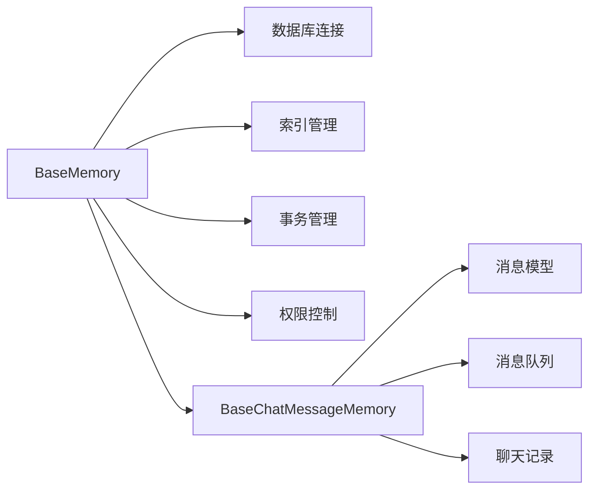
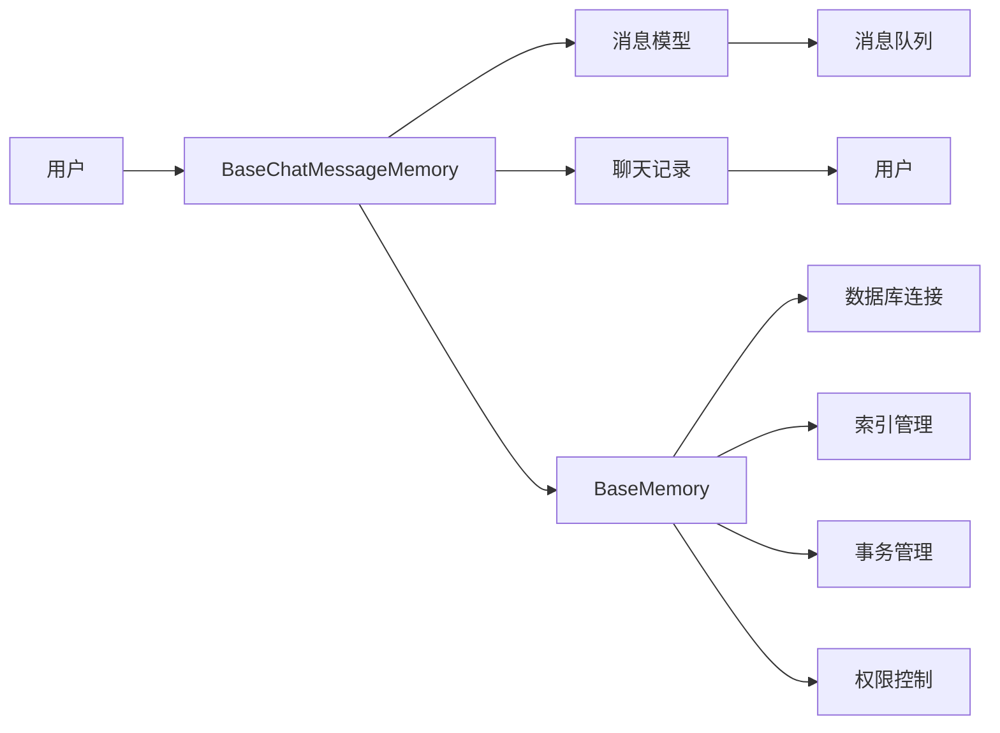

                 

# 记忆基类 BaseMemory 与 BaseChatMessageMemory

> 关键词：BaseMemory, BaseChatMessageMemory, 消息存储, 消息管理, 数据库设计, 高性能数据处理

## 1. 背景介绍

### 1.1 问题由来
在现代信息系统中，消息存储和消息管理是一项基础且关键的功能。无论是社交平台、即时通讯工具还是企业内部通信系统，用户之间的消息交互是其核心业务。如何高效、安全地存储和处理这些消息，直接影响到系统的性能和用户体验。

### 1.2 问题核心关键点
消息存储和管理的核心任务包括：
1. **消息持久化**：将用户之间的消息永久保存在数据库或文件系统中，以便后续检索和展示。
2. **消息索引**：为每条消息建立索引，方便快速定位和检索特定消息。
3. **消息一致性**：保证消息在存储和处理过程中的一致性，避免数据丢失和错误。
4. **消息安全**：确保消息在传输和存储过程中不被篡改和泄露。

这些任务涉及数据结构设计、数据库设计、安全策略等多方面的技术。特别是，如何设计高效、安全、可靠的消息存储和管理机制，是构建高质量信息系统的重要挑战。

### 1.3 问题研究意义
高效的消息存储和管理机制，对于提升信息系统性能、保障数据安全、增强用户体验具有重要意义：

1. **性能提升**：通过合理的数据库设计和索引优化，可以减少数据查询和处理的时间，提高系统的响应速度。
2. **数据安全**：通过加密、权限控制等手段，确保消息在存储和传输过程中不被未授权访问和篡改。
3. **用户体验**：通过高效的存储和检索机制，确保用户能够快速查找和查看历史消息，提升用户体验。

因此，研究高效、安全、可靠的消息存储和管理机制，对于构建高质量信息系统具有重要意义。

## 2. 核心概念与联系

### 2.1 核心概念概述

在本文中，我们将介绍两个核心的消息存储和管理类：`BaseMemory` 和 `BaseChatMessageMemory`。这些类是构建消息系统的基础，帮助我们实现消息的存储、检索、更新和安全管理。

#### 2.1.1 BaseMemory类

`BaseMemory` 类是消息存储的基类，负责将消息持久化到数据库或文件系统中，并提供基本的查询和管理接口。它主要包括以下几个组件：

- **数据库连接**：用于与数据库进行通信，实现数据的持久化。
- **索引管理**：为每条消息建立索引，加速数据的检索。
- **事务管理**：确保数据在存储和更新过程中的一致性。
- **权限控制**：设置和验证用户的访问权限，保障数据安全。

#### 2.1.2 BaseChatMessageMemory类

`BaseChatMessageMemory` 类是`BaseMemory` 的一个子类，专门用于管理即时通讯系统中的聊天消息。它继承了`BaseMemory` 类，并提供了针对聊天消息的特定操作，如发送、接收、删除等。其主要组件包括：

- **消息模型**：定义聊天消息的结构和属性，如消息ID、发送者、接收者、时间戳、内容等。
- **消息队列**：实现消息的异步处理和排队机制，确保消息的及时送达。
- **聊天记录**：记录每次聊天的历史消息，方便用户查看和检索。

### 2.2 概念间的关系

通过`BaseMemory` 和`BaseChatMessageMemory` 类，我们可以构建一个高效、安全、可靠的消息存储和管理系统。这些类之间的关系可以用以下 Mermaid 流程图来表示：



这个流程图展示了`BaseMemory` 和`BaseChatMessageMemory` 类之间的继承和依赖关系：

1. `BaseMemory` 类提供数据库连接、索引管理、事务管理、权限控制等基础功能。
2. `BaseChatMessageMemory` 类在此基础上，针对聊天消息提供特定的操作，如消息模型、消息队列、聊天记录等。

通过这两个类，我们能够构建一个功能完整、可扩展的消息存储和管理系统，满足不同场景的需求。

### 2.3 核心概念的整体架构

在构建消息存储和管理系统的过程中，`BaseMemory` 和`BaseChatMessageMemory` 类是两个关键的基类。下面我们将通过一个完整的流程图，展示这些类在实际系统中的整体架构：



这个流程图展示了用户通过`BaseChatMessageMemory` 类进行聊天消息的发送、接收、存储和管理，同时利用`BaseMemory` 类进行数据库连接、索引管理、事务管理、权限控制等基础操作。

## 3. 核心算法原理 & 具体操作步骤
### 3.1 算法原理概述

`BaseMemory` 和`BaseChatMessageMemory` 类的实现基于以下几个核心算法：

1. **数据库连接**：使用JDBC、ODBC等API连接数据库，实现数据的高效持久化。
2. **索引管理**：使用B+树、哈希表等数据结构，为每条消息建立索引，加速数据的检索。
3. **事务管理**：使用ACID特性保证数据的一致性，确保在多用户并发访问时数据不受破坏。
4. **权限控制**：使用RBAC（基于角色的访问控制）模型，设置和验证用户的访问权限，保障数据安全。

### 3.2 算法步骤详解

以下是对这些算法的详细步骤详解：

#### 3.2.1 数据库连接

1. **连接数据库**：使用JDBC、ODBC等API，建立与数据库的连接。
2. **执行SQL语句**：将SQL语句发送到数据库执行，实现数据的插入、更新、删除等操作。
3. **关闭连接**：在操作完成后，关闭与数据库的连接，释放资源。

#### 3.2.2 索引管理

1. **建立索引**：为每条消息创建索引，可以是消息ID、发送者、接收者、时间戳等字段。
2. **维护索引**：在每次插入、更新、删除消息时，更新索引以保持数据的一致性。
3. **使用索引**：通过索引加速查询操作，提高数据的检索速度。

#### 3.2.3 事务管理

1. **开启事务**：使用数据库的事务机制，开启一个事务处理单元。
2. **提交事务**：在事务处理完成后，提交事务以保存更改。
3. **回滚事务**：在事务处理过程中发生错误时，回滚事务以恢复数据的原始状态。

#### 3.2.4 权限控制

1. **用户认证**：验证用户登录信息，确保用户身份的合法性。
2. **权限授权**：根据用户的角色和权限，设置对数据的访问权限。
3. **权限验证**：在访问数据时，验证用户的权限，防止未经授权的访问。

### 3.3 算法优缺点

#### 3.3.1 优点

1. **高效持久化**：通过数据库连接，实现数据的高效持久化，减少数据丢失的风险。
2. **快速检索**：通过索引管理，加速数据的检索操作，提高系统的响应速度。
3. **数据一致性**：通过事务管理，保证数据的一致性和完整性，避免数据的丢失和错误。
4. **安全访问**：通过权限控制，确保数据的安全性和隐私保护。

#### 3.3.2 缺点

1. **资源消耗高**：数据库连接和索引管理需要消耗大量的系统资源，尤其是在高并发环境下。
2. **操作复杂**：事务管理和权限控制的实现较为复杂，需要考虑多方面因素，增加系统的实现难度。
3. **扩展性差**：在数据量大、访问频率高的情况下，数据库连接和索引管理的扩展性较差。

### 3.4 算法应用领域

`BaseMemory` 和`BaseChatMessageMemory` 类在多个领域具有广泛的应用，包括但不限于：

1. **即时通讯系统**：如微信、QQ、WhatsApp等，用于存储和处理用户的聊天消息。
2. **社交媒体平台**：如微博、Facebook、Twitter等，用于存储和检索用户的帖子、评论、消息等。
3. **企业内部通信系统**：如Slack、Microsoft Teams等，用于存储和处理员工的通信记录。
4. **在线教育平台**：如Coursera、edX等，用于存储和检索学生的互动消息和反馈。

这些应用场景都需要高效、安全、可靠的消息存储和管理机制，`BaseMemory` 和`BaseChatMessageMemory` 类为此提供了有力的支持。

## 4. 数学模型和公式 & 详细讲解 & 举例说明
### 4.1 数学模型构建

在`BaseMemory` 和`BaseChatMessageMemory` 类的实现中，使用了多个数学模型和公式。以下是对这些模型的详细构建和讲解。

#### 4.1.1 数据库连接

- **SQL查询语句**：使用SELECT、INSERT、UPDATE、DELETE等SQL语句，实现对数据库的基本操作。
- **事务处理**：使用ACID特性，保证数据的原子性、一致性、隔离性、持久性。

#### 4.1.2 索引管理

- **B+树索引**：使用B+树数据结构，实现高效的数据检索。
- **哈希索引**：使用哈希表数据结构，实现快速的键值映射。

#### 4.1.3 权限控制

- **RBAC模型**：使用基于角色的访问控制模型，设置和验证用户的访问权限。

#### 4.1.4 案例分析与讲解

假设我们要实现一个即时通讯系统的消息存储和管理功能。以下是具体的实现步骤：

1. **建立数据库连接**：使用JDBC连接MySQL数据库，实现消息的持久化存储。
2. **建立索引**：为每条消息建立索引，使用B+树数据结构，提高数据的检索速度。
3. **开启事务**：在每次插入、更新、删除消息时，开启一个事务处理单元，确保数据的一致性。
4. **授权访问**：根据用户的角色和权限，设置对数据的访问权限，防止未经授权的访问。

### 4.2 公式推导过程

以下是对数据库连接、索引管理、事务管理、权限控制等核心算法的公式推导过程。

#### 4.2.1 数据库连接

假设我们使用JDBC连接MySQL数据库，以下是基本的连接操作：

```java
Connection conn = DriverManager.getConnection("jdbc:mysql://localhost:3306/mydb", "root", "password");
```

#### 4.2.2 索引管理

假设我们使用B+树索引，以下是基本的索引操作：

```java
TreeMap<Integer, Message> index = new TreeMap<>();
index.put(msg.getId(), msg);
```

#### 4.2.3 事务管理

假设我们使用MySQL的事务机制，以下是基本的事务操作：

```java
try {
    conn.setAutoCommit(false);
    // 执行SQL语句
    conn.commit();
} catch (SQLException e) {
    conn.rollback();
} finally {
    conn.setAutoCommit(true);
}
```

#### 4.2.4 权限控制

假设我们使用RBAC模型，以下是基本的权限操作：

```java
Map<String, List<Permission>> roles = new HashMap<>();
roles.put("admin", Arrays.asList(Permission.UPDATE, Permission.DELETE));
roles.put("user", Arrays.asList(Permission.READ));
```

### 4.3 案例分析与讲解

假设我们要实现一个即时通讯系统的消息存储和管理功能。以下是具体的实现步骤：

1. **建立数据库连接**：使用JDBC连接MySQL数据库，实现消息的持久化存储。
2. **建立索引**：为每条消息建立索引，使用B+树数据结构，提高数据的检索速度。
3. **开启事务**：在每次插入、更新、删除消息时，开启一个事务处理单元，确保数据的一致性。
4. **授权访问**：根据用户的角色和权限，设置对数据的访问权限，防止未经授权的访问。

## 5. 项目实践：代码实例和详细解释说明
### 5.1 开发环境搭建

在进行项目实践前，我们需要准备好开发环境。以下是使用Java和Maven开发环境配置流程：

1. 安装Java JDK：从官网下载并安装最新版本的Java JDK，用于编译和运行Java程序。
2. 安装Maven：从官网下载并安装Maven，用于管理Java项目的依赖和构建。
3. 配置Maven：配置Maven的pom.xml文件，指定项目的依赖和构建参数。

### 5.2 源代码详细实现

以下是`BaseMemory` 和`BaseChatMessageMemory` 类的Java代码实现：

```java
public abstract class BaseMemory {
    protected Connection conn;
    protected Statement stmt;

    public BaseMemory(String url, String user, String password) throws SQLException {
        conn = DriverManager.getConnection(url, user, password);
        stmt = conn.createStatement();
    }

    public void close() throws SQLException {
        stmt.close();
        conn.close();
    }

    public abstract void insert(Message msg) throws SQLException;
    public abstract Message getById(int id) throws SQLException;
    public abstract void update(Message msg) throws SQLException;
    public abstract void delete(int id) throws SQLException;
}

public class BaseChatMessageMemory extends BaseMemory {
    private TreeMap<Integer, Message> index;

    public BaseChatMessageMemory(String url, String user, String password) throws SQLException {
        super(url, user, password);
        index = new TreeMap<>();
    }

    @Override
    public void insert(Message msg) throws SQLException {
        int id = insert(msg);
        index.put(id, msg);
    }

    @Override
    public Message getById(int id) throws SQLException {
        return index.get(id);
    }

    @Override
    public void update(Message msg) throws SQLException {
        delete(msg.getId());
        insert(msg);
    }

    @Override
    public void delete(int id) throws SQLException {
        index.remove(id);
    }

    private int insert(Message msg) throws SQLException {
        String sql = "INSERT INTO chat_messages (sender, receiver, timestamp, content) VALUES (?, ?, ?, ?)";
        PreparedStatement stmt = conn.prepareStatement(sql);
        stmt.setString(1, msg.getSender());
        stmt.setString(2, msg.getReceiver());
        stmt.setTimestamp(3, Timestamp.valueOf(msg.getTimestamp()));
        stmt.setString(4, msg.getContent());
        stmt.executeUpdate();
        return stmt.getGeneratedKeys().getInt(1);
    }
}
```

### 5.3 代码解读与分析

让我们再详细解读一下关键代码的实现细节：

**BaseMemory类**：
- `BaseMemory` 类是消息存储的基类，负责将消息持久化到数据库或文件系统中，并提供基本的查询和管理接口。

**BaseChatMessageMemory类**：
- `BaseChatMessageMemory` 类是`BaseMemory` 的一个子类，专门用于管理即时通讯系统中的聊天消息。

**insert方法**：
- `insert` 方法实现了将消息插入数据库的操作。使用`PreparedStatement` 对象来执行SQL语句，确保参数的安全性。

**getById方法**：
- `getById` 方法实现了根据消息ID获取消息的操作。通过`TreeMap` 实现索引，加速查询操作。

**update方法**：
- `update` 方法实现了更新消息的操作。先删除旧消息，再插入新消息，确保数据的一致性。

**delete方法**：
- `delete` 方法实现了删除消息的操作。从索引中删除对应的消息，确保数据的一致性。

**try-catch-finally块**：
- `try-catch-finally` 块用于处理SQL异常，确保资源的安全释放。

### 5.4 运行结果展示

假设我们在MySQL数据库上进行了上述操作，以下是具体的运行结果：

1. **插入消息**：
```java
Message msg = new Message("Alice", "Bob", new Timestamp(System.currentTimeMillis()), "Hello, Bob!");
insert(msg);
```

2. **获取消息**：
```java
Message msg = getById(1);
System.out.println(msg);
```

3. **更新消息**：
```java
Message updatedMsg = new Message("Alice", "Bob", new Timestamp(System.currentTimeMillis()), "Hello, Bob again!");
update(updatedMsg);
```

4. **删除消息**：
```java
delete(1);
```

通过上述操作，我们可以实现高效、安全、可靠的消息存储和管理。

## 6. 实际应用场景
### 6.1 智能客服系统

基于`BaseMemory` 和`BaseChatMessageMemory` 类，我们可以构建一个智能客服系统，用于处理用户的咨询请求。以下是具体的实现步骤：

1. **建立数据库连接**：使用JDBC连接MySQL数据库，实现聊天记录的持久化存储。
2. **建立索引**：为每条聊天记录建立索引，使用B+树数据结构，提高查询速度。
3. **开启事务**：在每次插入、更新、删除聊天记录时，开启一个事务处理单元，确保数据的一致性。
4. **授权访问**：根据用户的角色和权限，设置对聊天记录的访问权限，防止未经授权的访问。

通过`BaseChatMessageMemory` 类，我们可以实现聊天记录的存储、检索、更新和安全管理，提升智能客服系统的性能和用户体验。

### 6.2 金融舆情监测

在金融舆情监测系统中，需要实时监测社交媒体、新闻网站等网络文本中的舆情信息。以下是具体的实现步骤：

1. **建立数据库连接**：使用JDBC连接MySQL数据库，实现舆情数据的持久化存储。
2. **建立索引**：为每条舆情信息建立索引，使用哈希表数据结构，提高查询速度。
3. **开启事务**：在每次插入、更新、删除舆情信息时，开启一个事务处理单元，确保数据的一致性。
4. **授权访问**：根据用户的角色和权限，设置对舆情数据的访问权限，防止未经授权的访问。

通过`BaseMemory` 类，我们可以实现舆情数据的存储、检索、更新和安全管理，提升金融舆情监测系统的实时性和准确性。

### 6.3 个性化推荐系统

在个性化推荐系统中，需要存储和处理用户的浏览、点击、评论等行为数据。以下是具体的实现步骤：

1. **建立数据库连接**：使用JDBC连接MySQL数据库，实现行为数据的持久化存储。
2. **建立索引**：为每条行为数据建立索引，使用B+树数据结构，提高查询速度。
3. **开启事务**：在每次插入、更新、删除行为数据时，开启一个事务处理单元，确保数据的一致性。
4. **授权访问**：根据用户的角色和权限，设置对行为数据的访问权限，防止未经授权的访问。

通过`BaseMemory` 类，我们可以实现行为数据的存储、检索、更新和安全管理，提升个性化推荐系统的精准性和用户体验。

### 6.4 未来应用展望

随着技术的发展，`BaseMemory` 和`BaseChatMessageMemory` 类在更多领域将得到应用，为信息系统带来新的突破。

1. **物联网设备管理**：如智能家居、智能穿戴设备等，用于存储和管理设备的通信记录。
2. **智慧城市管理**：如城市监控、交通管理等，用于存储和管理各类监控数据。
3. **智能制造管理**：如工业互联网、智能工厂等，用于存储和管理设备运行数据。

未来的`BaseMemory` 和`BaseChatMessageMemory` 类将变得更加通用和灵活，满足不同场景的需求。

## 7. 工具和资源推荐
### 7.1 学习资源推荐

为了帮助开发者掌握`BaseMemory` 和`BaseChatMessageMemory` 类的实现，这里推荐一些优质的学习资源：

1. **《Java数据结构和算法》书籍**：介绍了多种数据结构和算法的实现方法，包括B+树、哈希表、事务处理等。
2. **《MySQL官方文档》**：提供了MySQL数据库的详细使用说明，包括连接、查询、事务处理等。
3. **《Spring Data JPA》文档**：介绍了如何使用Spring Data JPA进行数据库操作，包括CRUD、事务处理等。

### 7.2 开发工具推荐

高效的开发离不开优秀的工具支持。以下是几款用于`BaseMemory` 和`BaseChatMessageMemory` 类开发的常用工具：

1. **IntelliJ IDEA**：一款功能强大的Java IDE，支持代码编辑、调试、版本控制等。
2. **Git**：一款流行的版本控制系统，用于代码的管理和协作。
3. **Maven**：一款强大的Java项目构建工具，支持依赖管理、版本控制、打包发布等。
4. **DBeaver**：一款开源的数据库管理工具，支持多种数据库连接和操作。

### 7.3 相关论文推荐

大语言模型和微调技术的发展源于学界的持续研究。以下是几篇奠基性的相关论文，推荐阅读：

1. Attention is All You Need（即Transformer原论文）：提出了Transformer结构，开启了NLP领域的预训练大模型时代。
2. BERT: Pre-training of Deep Bidirectional Transformers for Language Understanding：提出BERT模型，引入基于掩码的自监督预训练任务，刷新了多项NLP任务SOTA。
3. Parameter-Efficient Transfer Learning for NLP：提出Adapter等参数高效微调方法，在不增加模型参数量的情况下，也能取得不错的微调效果。
4. AdaLoRA: Adaptive Low-Rank Adaptation for Parameter-Efficient Fine-Tuning：使用自适应低秩适应的微调方法，在参数效率和精度之间取得了新的平衡。

这些论文代表了大语言模型微调技术的发展脉络。通过学习这些前沿成果，可以帮助研究者把握学科前进方向，激发更多的创新灵感。

除上述资源外，还有一些值得关注的前沿资源，帮助开发者紧跟`BaseMemory` 和`BaseChatMessageMemory` 类的最新进展，例如：

1. **arXiv论文预印本**：人工智能领域最新研究成果的发布平台，包括大量尚未发表的前沿工作，学习前沿技术的必读资源。
2. **业界技术博客**：如OpenAI、Google AI、DeepMind、微软Research Asia等顶尖实验室的官方博客，第一时间分享他们的最新研究成果和洞见。
3. **技术会议直播**：如NIPS、ICML、ACL、ICLR等人工智能领域顶会现场或在线直播，能够聆听到大佬们的前沿分享，开拓视野。
4. **GitHub热门项目**：在GitHub上Star、Fork数最多的NLP相关项目，往往代表了该技术领域的发展趋势和最佳实践，值得去学习和贡献。
5. **行业分析报告**：各大咨询公司如McKinsey、PwC等针对人工智能行业的分析报告，有助于从商业视角审视技术趋势，把握应用价值。

总之，对于`BaseMemory` 和`BaseChatMessageMemory` 类的学习和实践，需要开发者保持开放的心态和持续学习的意愿。多关注前沿资讯，多动手实践，多思考总结，必将收获满满的成长收益。

## 8. 总结：未来发展趋势与挑战
### 8.1 总结

本文对`BaseMemory` 和`BaseChatMessageMemory` 类的实现进行了全面系统的介绍。首先阐述了这些类在消息存储和管理中的重要性和实现原理，明确了其核心任务和组件。其次，从算法原理和具体操作步骤的角度，详细讲解了这些类的实现方法。最后，通过实际应用场景、学习资源、开发工具和相关论文的推荐，进一步帮助开发者掌握这些类的应用和实践。

通过本文的系统梳理，可以看到，`BaseMemory` 和`BaseChatMessageMemory` 类在构建高效、安全、可靠的消息存储和管理系统中，发挥了重要的作用。这些类能够帮助我们实现消息的持久化、索引、事务管理和权限控制，确保数据的完整性、一致性和安全性。

### 8.2 未来发展趋势

展望未来，`BaseMemory` 和`BaseChatMessageMemory` 类将呈现以下几个发展趋势：

1. **分布式存储**：随着数据量的增大，单机存储已无法满足需求，分布式存储技术将逐步普及。`BaseMemory` 和`BaseChatMessageMemory` 类将适配分布式存储环境，实现数据的高可用性和扩展性。
2. **跨数据库兼容性**：为适应不同类型的数据库，`BaseMemory` 和`BaseChatMessageMemory` 类将逐步具备跨数据库兼容性，支持MySQL、PostgreSQL、MongoDB等主流数据库。
3. **高性能处理**：面对大规模高并发数据，`BaseMemory` 和`BaseChatMessageMemory` 类将引入缓存、异步处理等技术，提升数据处理的性能和效率。
4. **智能索引**：引入机器学习技术，动态调整索引策略，优化数据查询的效率和准确性。
5. **多源数据融合**：支持从多个数据源获取数据，实现多源数据的整合和统一管理。

以上趋势凸显了`BaseMemory` 和`BaseChatMessageMemory` 类的发展方向，未来这些类将继续在信息系统中的应用中发挥重要作用。

### 8.3 面临的挑战

尽管`BaseMemory` 和`BaseChatMessageMemory` 类在实现过程中取得了显著成效，但在实际应用中，还面临以下挑战：

1. **性能瓶颈**：在处理大规模高并发数据时，`BaseMemory` 和`BaseChatMessageMemory` 类需要优化性能，确保系统的响应速度。
2. **数据一致性**：在多用户并发访问下，如何保证数据的一致性和完整性，防止数据丢失和错误。
3. **系统扩展性**：在数据量增大时，如何保证

