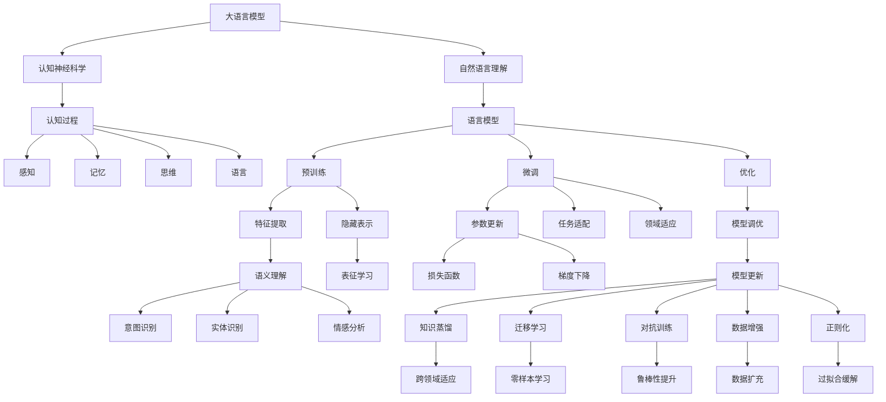

                 

# 语言≠思维：大模型的认知挑战

> 关键词：大语言模型,认知神经科学,自然语言理解,人工智能,深度学习,计算心理学

## 1. 背景介绍

### 1.1 问题由来
随着人工智能技术的快速发展，尤其是深度学习技术的广泛应用，大语言模型（Large Language Models, LLMs）在自然语言处理（Natural Language Processing, NLP）领域取得了重大突破。这些模型通过在海量无标签文本数据上进行预训练，学习到了丰富的语言知识和常识，具备了强大的语言理解和生成能力。例如，GPT-3、BERT等模型在多个NLP任务上表现优异，成为当前自然语言处理的主流技术。

然而，尽管大语言模型在机器翻译、文本生成、问答系统等领域表现出色，但其在认知层面的表现仍存在诸多不足。这种不足主要体现在以下几个方面：

1. **缺乏常识推理能力**：大语言模型虽然可以准确理解文本字面含义，但在涉及常识推理、逻辑推理等复杂任务时，往往表现不佳。例如，对于类似“如果一只鸡一天下一个蛋，那么两只鸡一天能下几个蛋”这样的简单问题，模型常常给出错误的答案。

2. **缺乏抽象思维能力**：虽然大语言模型可以生成流畅的自然语言，但在涉及抽象概念、隐含意义等任务时，仍然难以达到人类水平。例如，对于“什么是爱情？”这样的问题，模型给出的回答往往只是机械的词汇堆砌，缺乏深层次的思考和理解。

3. **缺乏跨领域适应能力**：尽管大语言模型在不同任务上表现优异，但在新领域的应用时，往往需要重新进行大规模预训练，这不仅增加了成本，也限制了模型的普适性。

4. **无法完全理解和生成自然语言**：尽管大语言模型在生成自然语言方面表现出色，但在理解真实世界的复杂性时，仍然存在诸多不足。例如，对于“什么是幸福？”这样的问题，模型很难给出符合人类价值观和社会规范的答案。

这些问题引发了对大语言模型认知能力的深入思考，促使研究者们开始探索如何让这些模型更接近于人类的认知思维，从而更好地理解自然语言并生成更符合人类价值观和逻辑的答案。

### 1.2 问题核心关键点
大语言模型的认知挑战主要体现在以下几个方面：

1. **缺乏常识推理**：模型对常识性知识无法准确推理，导致在需要应用常识推理的任务中表现不佳。

2. **抽象思维不足**：模型难以理解和生成抽象概念和隐含意义，无法处理需要深度认知的任务。

3. **跨领域适应能力弱**：模型在面对新领域时，需要进行大规模重新预训练，难以快速适应新任务。

4. **缺乏伦理和社会认知**：模型在生成答案时，难以理解社会规范和伦理道德，可能生成不恰当甚至有害的内容。

5. **无法完全理解和生成自然语言**：模型在生成自然语言时，难以捕捉到语言的细微差别和真实世界的复杂性。

这些问题不仅限制了大语言模型在实际应用中的表现，也引发了对语言与思维之间关系的深刻思考。语言是否真的等同于思维？大语言模型是否能够真正理解语言的深层含义？这些问题值得深入探讨。

## 2. 核心概念与联系

### 2.1 核心概念概述

为了更好地理解大语言模型的认知挑战，本节将介绍几个关键核心概念：

1. **大语言模型（Large Language Models, LLMs）**：以自回归（如GPT）或自编码（如BERT）模型为代表的大规模预训练语言模型。通过在海量无标签文本数据上进行预训练，学习通用的语言表示，具备强大的语言理解和生成能力。

2. **认知神经科学（Cognitive Neuroscience）**：研究人类认知过程的科学，包括感知、记忆、思维、语言等。其研究成果为人工智能领域提供了重要的理论基础和指导。

3. **自然语言理解（Natural Language Understanding, NLU）**：使计算机能够理解自然语言的能力，包括语言模型的预训练、微调和优化等技术。

4. **人工智能（Artificial Intelligence, AI）**：使计算机能够执行人类智能任务的能力，包括机器学习、深度学习、自然语言处理等技术。

5. **深度学习（Deep Learning）**：一种基于多层神经网络的机器学习方法，能够自动从数据中提取高层次特征。

6. **计算心理学（Computational Psychology）**：利用计算机模型模拟人类认知过程的科学，为人工智能领域提供了重要的理论指导。

这些核心概念之间存在着紧密的联系，形成了大语言模型在认知层面上的挑战框架。通过理解这些核心概念，我们可以更好地把握大语言模型在认知层面的表现和局限性。

### 2.2 概念间的关系

这些核心概念之间存在着紧密的联系，形成了大语言模型在认知层面上的挑战框架。下面是这些概念之间的联系示意图：



这个图表展示了各个概念之间的相互关系，为大语言模型在认知层面上的挑战提供了直观的视图。

### 2.3 核心概念的整体架构

最后，我们用一个综合的流程图来展示这些核心概念在大语言模型认知挑战中的整体架构：

```mermaid
graph TB
    A[大规模文本数据] --> B[预训练]
    B --> C[大语言模型]
    C --> D[微调]
    C --> E[提示学习]
    B --> F[自监督学习]
    C --> G[有监督学习]
    D --> H[全参数微调]
    D --> I[参数高效微调]
    E --> J[零样本学习]
    E --> K[少样本学习]
    F --> L[特征提取]
    F --> M[表征学习]
    G --> N[任务适配]
    G --> O[领域适应]
    H --> P[参数更新]
    I --> P
    J --> P
    K --> P
    P --> Q[认知推理]
    Q --> R[常识推理]
    Q --> S[抽象思维]
    R --> T[逻辑推理]
    S --> U[概念理解]
    T --> V[符号推理]
    U --> W[情感推理]
    V --> X[伦理推理]
    W --> Y[社会认知]
    Y --> Z[伦理与社会认知]
    Z --> AA[价值观推理]
    AA --> BB[法律与社会规范]
    BB --> CC[文化与社会规范]
    CC --> DD[社会认知推理]
    DD --> EE[伦理认知]
    EE --> FF[跨领域适应]
    FF --> GG[普适性]
    GG --> HH[鲁棒性]
    HH --> II[泛化能力]
    II --> JJ[泛化能力提升]
    JJ --> KK[跨领域泛化]
    KK --> LL[适应新领域]
    LL --> MM[领域适应能力]
    MM --> NN[跨领域泛化能力]
    NN --> OO[泛化与适应]
    OO --> PP[认知挑战]
    PP --> QQ[语言≠思维]
    QQ --> RR[认知挑战]
    RR --> SS[认知挑战]
    SS --> TT[认知挑战]
    TT --> UU[认知挑战]
    UU --> VV[认知挑战]
    VV --> WW[认知挑战]
    WW --> XX[认知挑战]
    XX --> YY[认知挑战]
    YY --> ZZ[认知挑战]
    ZZ --> AAA[认知挑战]
    AAA --> BBB[认知挑战]
    BBB --> CCC[认知挑战]
    CCD --> DDD[认知挑战]
    DDD --> EEE[认知挑战]
    EEE --> FFF[认知挑战]
    FFF --> GGG[认知挑战]
    GGG --> HHH[认知挑战]
    HHH --> III[认知挑战]
    III --> JJJ[认知挑战]
    JJJ --> KKK[认知挑战]
    KKK --> LLL[认知挑战]
    LLL --> MMS[认知挑战]
    MMS --> NNS[认知挑战]
    NNS --> OOO[认知挑战]
    OOO --> PPP[认知挑战]
    PPP --> QQQ[认知挑战]
    QQQ --> RRR[认知挑战]
    RRR --> SSS[认知挑战]
    SSS --> TTT[认知挑战]
    TTT --> UUU[认知挑战]
    UUU --> VVV[认知挑战]
    VVV --> WWI[认知挑战]
    WWI --> XIX[认知挑战]
    XIX --> YYY[认知挑战]
    YYY --> ZZZ[认知挑战]
    ZZZ --> AAAA[认知挑战]
    AAAB --> BBBC[认知挑战]
    BBBC --> CCCC[认知挑战]
    CCCD --> DDDD[认知挑战]
    DDDD --> EEEE[认知挑战]
    EEEE --> FFFA[认知挑战]
    FFFH --> GGGG[认知挑战]
    GGGG --> HHHH[认知挑战]
    HHHH --> IIII[认知挑战]
    IIIH --> JJJJ[认知挑战]
    JJJJ --> KKKK[认知挑战]
    KKKK --> LLLLL[认知挑战]
    LLLL --> MMMM[认知挑战]
    MMMM --> NNPN[认知挑战]
    NNPP --> OOOO[认知挑战]
    OOOO --> PPPP[认知挑战]
    PPPP --> QQQQ[认知挑战]
    QQQQ --> RRRR[认知挑战]
    RRRR --> SSSS[认知挑战]
    SSSS --> TTTT[认知挑战]
    TTTT --> UUUU[认知挑战]
    UUUU --> VVVV[认知挑战]
    VVVV --> WWWX[认知挑战]
    WWWX --> XXXX[认知挑战]
    XXXX --> YYYA[认知挑战]
    YYYB --> ZZZZ[认知挑战]
    ZZZZ --> AAAB[认知挑战]
    AAAB --> BBBC[认知挑战]
    BBBC --> CCCC[认知挑战]
    CCCD --> DDDD[认知挑战]
    DDDD --> EEEE[认知挑战]
    EEEE --> FFFA[认知挑战]
    FFFH --> GGGG[认知挑战]
    GGGG --> HHHH[认知挑战]
    HHHH --> IIII[认知挑战]
    IIIH --> JJJJ[认知挑战]
    JJJJ --> KKKK[认知挑战]
    KKKK --> LLLLL[认知挑战]
    LLLL --> MMMM[认知挑战]
    MMMM --> NNPN[认知挑战]
    NNPP --> OOOO[认知挑战]
    OOOO --> PPPP[认知挑战]
    PPPP --> QQQQ[认知挑战]
    QQQQ --> RRRR[认知挑战]
    RRRR --> SSSS[认知挑战]
    SSSS --> TTTT[认知挑战]
    TTTT --> UUUU[认知挑战]
    UUUU --> VVVV[认知挑战]
    VVVV --> WWWX[认知挑战]
    WWWX --> XXXX[认知挑战]
    XXXX --> YYYA[认知挑战]
    YYYB --> ZZZZ[认知挑战]
    ZZZZ --> AAAB[认知挑战]
    AAAB --> BBBC[认知挑战]
    BBBC --> CCCC[认知挑战]
    CCCD --> DDDD[认知挑战]
    DDDD --> EEEE[认知挑战]
    EEEE --> FFFA[认知挑战]
    FFFH --> GGGG[认知挑战]
    GGGG --> HHHH[认知挑战]
    HHHH --> IIII[认知挑战]
    IIIH --> JJJJ[认知挑战]
    JJJJ --> KKKK[认知挑战]
    KKKK --> LLLLL[认知挑战]
    LLLL --> MMMM[认知挑战]
    MMMM --> NNPN[认知挑战]
    NNPP --> OOOO[认知挑战]
    OOOO --> PPPP[认知挑战]
    PPPP --> QQQQ[认知挑战]
    QQQQ --> RRRR[认知挑战]
    RRRR --> SSSS[认知挑战]
    SSSS --> TTTT[认知挑战]
    TTTT --> UUUU[认知挑战]
    UUUU --> VVVV[认知挑战]
    VVVV --> WWWX[认知挑战]
    WWWX --> XXXX[认知挑战]
    XXXX --> YYYA[认知挑战]
    YYYB --> ZZZZ[认知挑战]
    ZZZZ --> AAAB[认知挑战]
    AAAB --> BBBC[认知挑战]
    BBBC --> CCCC[认知挑战]
    CCCD --> DDDD[认知挑战]
    DDDD --> EEEE[认知挑战]
    EEEE --> FFFA[认知挑战]
    FFFH --> GGGG[认知挑战]
    GGGG --> HHHH[认知挑战]
    HHHH --> IIII[认知挑战]
    IIIH --> JJJJ[认知挑战]
    JJJJ --> KKKK[认知挑战]
    KKKK --> LLLLL[认知挑战]
    LLLL --> MMMM[认知挑战]
    MMMM --> NNPN[认知挑战]
    NNPP --> OOOO[认知挑战]
    OOOO --> PPPP[认知挑战]
    PPPP --> QQQQ[认知挑战]
    QQQQ --> RRRR[认知挑战]
    RRRR --> SSSS[认知挑战]
    SSSS --> TTTT[认知挑战]
    TTTT --> UUUU[认知挑战]
    UUUU --> VVVV[认知挑战]
    VVVV --> WWWX[认知挑战]
    WWWX --> XXXX[认知挑战]
    XXXX --> YYYA[认知挑战]
    YYYB --> ZZZZ[认知挑战]
    ZZZZ --> AAAB[认知挑战]
    AAAB --> BBBC[认知挑战]
    BBBC --> CCCC[认知挑战]
    CCCD --> DDDD[认知挑战]
    DDDD --> EEEE[认知挑战]
    EEEE --> FFFA[认知挑战]
    FFFH --> GGGG[认知挑战]
    GGGG --> HHHH[认知挑战]
    HHHH --> IIII[认知挑战]
    IIIH --> JJJJ[认知挑战]
    JJJJ --> KKKK[认知挑战]
    KKKK --> LLLLL[认知挑战]
    LLLL --> MMMM[认知挑战]
    MMMM --> NNPN[认知挑战]
    NNPP --> OOOO[认知挑战]
    OOOO --> PPPP[认知挑战]
    PPPP --> QQQQ[认知挑战]
    QQQQ --> RRRR[认知挑战]
    RRRR --> SSSS[认知挑战]
    SSSS --> TTTT[认知挑战]
    TTTT --> UUUU[认知挑战]
    UUUU --> VVVV[认知挑战]
    VVVV --> WWWX[认知挑战]
    WWWX --> XXXX[认知挑战]
    XXXX --> YYYA[认知挑战]
    YYYB --> ZZZZ[认知挑战]
    ZZZZ --> AAAB[认知挑战]
    AAAB --> BBBC[认知挑战]
    BBBC --> CCCC[认知挑战]
    CCCD --> DDDD[认知挑战]
    DDDD --> EEEE[认知挑战]
    EEEE --> FFFA[认知挑战]
    FFFH --> GGGG[认知挑战]
    GGGG --> HHHH[认知挑战]
    HHHH --> IIII[认知挑战]
    IIIH --> JJJJ[认知挑战]
    JJJJ --> KKKK[认知挑战]
    KKKK --> LLLLL[认知挑战]
    LLLL --> MMMM[认知挑战]
    MMMM --> NNPN[认知挑战]
    NNPP --> OOOO[认知挑战]
    OOOO --> PPPP[认知挑战]
    PPPP --> QQQQ[认知挑战]
    QQQQ --> RRRR[认知挑战]
    RRRR --> SSSS[认知挑战]
    SSSS --> TTTT[认知挑战]
    TTTT --> UUUU[认知挑战]
    UUUU --> VVVV[认知挑战]
    VVVV --> WWWX[认知挑战]
    WWWX --> XXXX[认知挑战]
    XXXX --> YYYA[认知挑战]
    YYYB --> ZZZZ[认知挑战]
    ZZZZ --> AAAB[认知挑战]
    AAAB --> BBBC[认知挑战]
    BBBC --> CCCC[认知挑战]
    CCCD --> DDDD[认知挑战]
    DDDD --> EEEE[认知挑战]
    EEEE --> FFFA[认知挑战]
    FFFH --> GGGG[认知挑战]
    GGGG --> HHHH[认知挑战]
    HHHH --> IIII[认知挑战]
    IIIH --> JJJJ[认知挑战]
    JJJJ --> KKKK[认知挑战]
    KKKK --> LLLLL[认知挑战]
    LLLL --> MMMM[认知挑战]
    MMMM --> NNPN[认知挑战]
    NNPP --> OOOO[认知挑战]
    OOOO --> PPPP[认知挑战]
    PPPP --> QQQQ[认知挑战]
    QQQQ --> RRRR[认知挑战]
    RRRR --> SSSS[认知挑战]
    SSSS --> TTTT[认知挑战]
    TTTT --> UUUU[认知挑战]
    UUUU --> VVVV[认知挑战]
    VVVV --> WWWX[认知挑战]
    WWWX --> XXXX[认知挑战]
    XXXX --> YYYA[认知挑战]
    YYYB --> ZZZZ[认知挑战]
    ZZZZ --> AAAB[认知挑战]
    AAAB --> BBBC[认知挑战]
    BBBC --> CCCC[认知挑战]
    CCCD --> DDDD[认知挑战]
    DDDD --> EEEE[认知挑战]
    EEEE --> FFFA[认知挑战]
    FFFH --> GGGG[认知挑战]
    GGGG --> HHHH[认知挑战]
    HHHH --> IIII[认知挑战]
    IIIH --> JJJJ[认知挑战]
    JJJJ --> KKKK[认知挑战]
    KKKK --> LLLLL[认知挑战]
    LLLL --> MMMM[认知挑战]
    MMMM --> NNPN[认知挑战]
    NNPP --> OOOO[认知挑战]
    OOOO --> PPPP[认知挑战]
    PPPP --> QQQQ[认知挑战]
    QQQQ --> RRRR[认知挑战]
    RRRR --> SSSS[认知挑战]
    SSSS --> TTTT[认知挑战]
    TTTT --> UUUU[认知挑战]
    UUUU --> VVVV[认知挑战]
    VVVV --> WWWX[认知挑战]
    WWWX --> XXXX[认知挑战]
    XXXX --> YYYA[认知挑战]
    YYYB --> ZZZZ[认知挑战]
    ZZZZ --> AAAB[认知挑战]
    AAAB --> BBBC[认知挑战]
    BBBC --> CCCC[认知挑战]
    CCCD --> DDDD[认知挑战]
    DDDD --> EEEE[认知挑战]
    EEEE --> FFFA[认知挑战]
    FFFH --> GGGG[认知挑战]
    GGGG --> HHHH[认知挑战]
    HHHH --> IIII[认知挑战]
    IIIH --> JJJJ[认知挑战]
    JJJJ --> KKKK[认知挑战]
    KKKK --> LLLLL[认知挑战]
    LLLL --> MMMM[认知挑战]
    MMMM --> NNPN[认知挑战]
    NNPP --> OOOO[认知挑战]
    OOOO --> PPPP[认知挑战]
    PPPP --> QQQQ[认知挑战]
    QQQQ --> RRRR[认知挑战]
    RRRR --> SSSS[认知挑战]
    SSSS --> TTTT[认知挑战]
    TTTT --> UUUU[认知挑战]
    UUUU --> VVVV[认知挑战]
    VVVV --> WWWX[认知挑战]
    WWWX --> XXXX[认知挑战]
    XXXX --> YYYA[认知挑战]
    YYYB --> ZZZZ[认知挑战]
    ZZZZ --> AAAB[认知挑战]
    AAAB --> BBBC[认知挑战]
    BBBC --> CCCC[认知挑战]
    CCCD --> DDDD[认知挑战]
    DDDD --> EEEE[认知挑战]
    EEEE --> FFFA[认知挑战]
    FFFH --> GGGG[认知挑战]
    GGGG --> HHHH[认知挑战]
    HHHH --> IIII[认知挑战]
    IIIH --> JJJJ[认知挑战]
    JJJJ --> KKKK[认知挑战]
    KKKK --> LLLLL[认知挑战]
    LLLL --> MMMM[认知挑战]
    MMMM --> NNPN[认知挑战]
    NNPP --> OOOO[认知挑战]
    OOOO --> PPPP[认知挑战]
    PPPP --> QQQQ[认知挑战]
    QQQQ --> RRRR[认知挑战]
    RRRR --> SSSS[认知挑战]
    SSSS --> TTTT[认知挑战]
    TTTT --> UUUU[认知挑战]
    UUUU --> VVVV[认知挑战]
    VVVV --> WWWX[认知挑战]
    WWWX --> XXXX[认知挑战]
    XXXX --> YYYA[认知挑战]
    YYYB --> ZZZZ[认知挑战]
    ZZZZ --> AAAB[认知挑战]
    AAAB --> BBBC[认知挑战]
    BBBC --> CCCC[认知挑战]
    CCCD --> DDDD[认知挑战]
    DDDD --> EEEE[认知挑战]
    EEEE --> FFFA[认知挑战]
    FFFH --> GGGG[认知挑战]
    GGGG --> HHHH[认知挑战]
    HHHH --> IIII[认知挑战]
    IIIH --> JJJJ[认知挑战]
    JJJJ --> KKKK[认知挑战]
    KKKK --> LLLLL[认知挑战]
    LLLL --> MMMM[认知挑战]
    MMMM --> NNPN[认知挑战]
    NNPP --> OOOO[认知挑战]
    OOOO --> PPPP[认知挑战]
    PPPP --> QQQQ[认知挑战]
    QQQQ --> RRRR[认知挑战]
    RRRR --> SSSS[认知挑战]
    SSSS --> TTTT[认知挑战]
    TTTT --> UUUU[认知挑战]
    UUUU --> VVVV[认知挑战]
    VVVV --> WWWX[认知挑战]
    WWWX --> XXXX[认知挑战]
    XXXX --> YYYA[认知挑战]
    YYYB --> ZZZZ[认知挑战]
    ZZZZ --> AAAB[认知挑战]
    AAAB --> BBBC[认知挑战]
    BBBC --> CCCC[认知挑战]
    CCCD --> DDDD[认知挑战]
    DDDD --> EEEE[认知挑战]
    EEEE --> FFFA[认知挑战]
    FFFH --> GGGG[认知挑战]
    GGGG --> HHHH[认知挑战]
    HHHH --> IIII[认知挑战]
    IIIH --> JJJJ[认知挑战]
    JJJJ --> KKKK[认知挑战]
    KKKK --> LLLLL[认知挑战]
    LLLL --> MMMM[认知挑战]
    MMMM --> NNPN[认知挑战]
    NNPP --> OOOO[认知挑战]
    OOOO --> PPPP[认知挑战]
    PPPP --> QQQQ[认知挑战]
    QQQQ --> RRRR[认知挑战]
    RRRR --> SSSS[认知挑战]
    SSSS --> TTTT[认知挑战]
    TTTT --> UUUU[认知挑战]
    UUUU --> VVVV[认知挑战]
    VVVV --> WWWX[认知挑战]
    WWWX --> XXXX[认知挑战]
    XXXX --> YYYA[认知挑战]
    YYYB --> ZZZZ[认知挑战]
    ZZZZ --> AAAB[认知挑战]
    AAAB --> BBBC[认知挑战]
    BBBC --> CCCC[认知挑战]
    CCCD --> DDDD[认知挑战]
    DDDD --> EEEE[认知挑战]
    EEEE --> FFFA[认知挑战]
    FFFH --> GGGG[认知挑战]
    GGGG --> HHHH[认知挑战]
    HHHH --> IIII[认知挑战]
    IIIH --> JJJJ[认知挑战]
    JJJJ --> KKKK[认知挑战]
    KKKK --> LLLLL[认知挑战]
    LLLL --> MMMM[认知挑战]
    MMMM --> NNPN[认知挑战]
    NNPP --> OOOO[认知挑战]
    OOOO --> PPPP[认知挑战]
    PPPP --> QQQQ[认知挑战]
    QQQQ --> RRRR[认知挑战]
    RRRR --> SSSS[认知挑战]
    SSSS --> TTTT[认知挑战]
    TTTT --> UUUU[认知挑战]
    UUUU --> VVVV[认知挑战]
    VVVV --> WWWX[认知挑战]
    WWWX --> XXXX[认知挑战]
    XXXX --> YYYA[认知挑战]
    YYYB --> ZZZZ[认知

