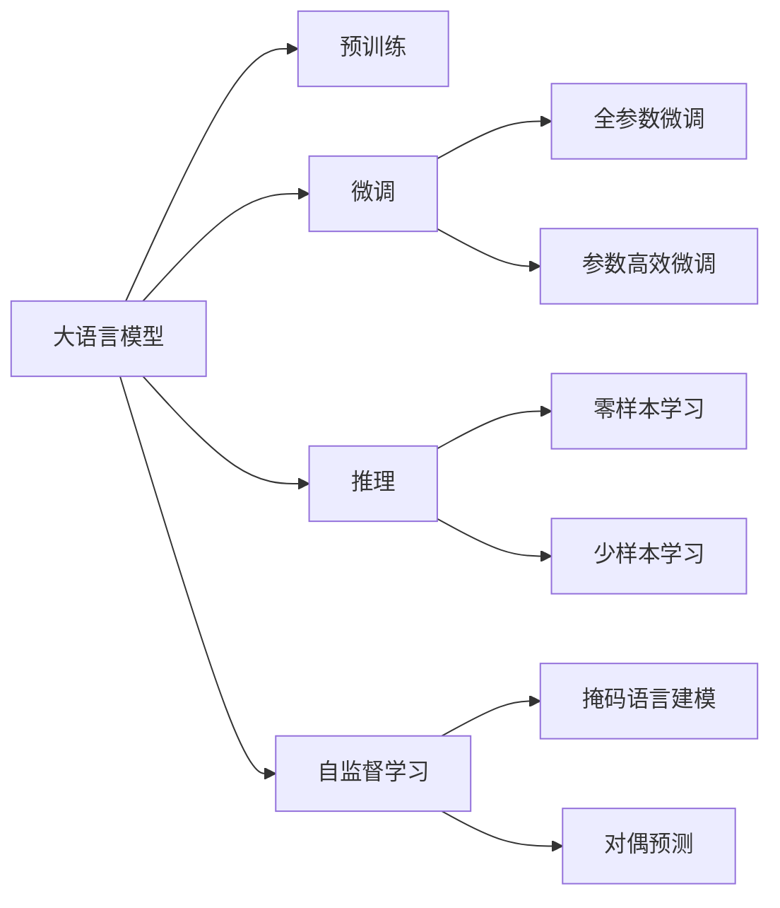
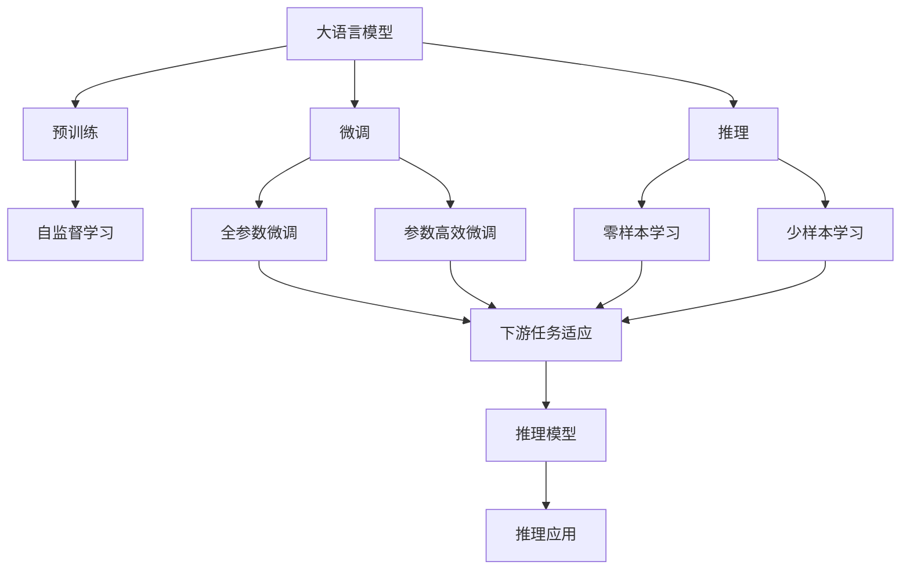
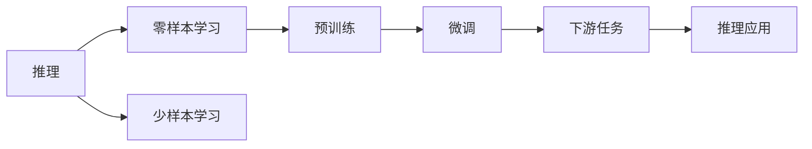
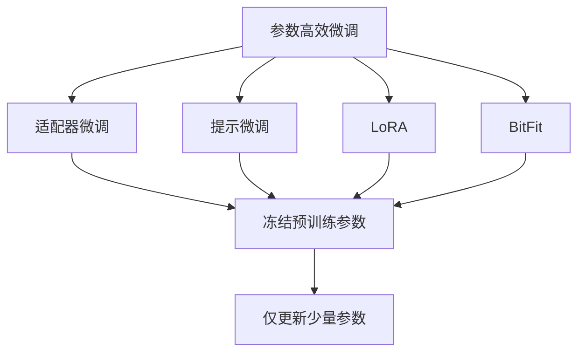
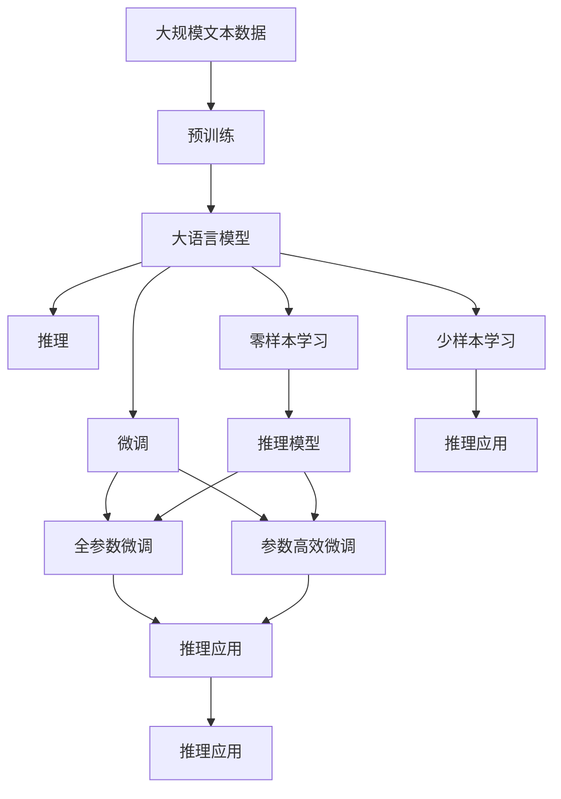

                 

# 语言与推理：大模型的瓶颈

> 关键词：大模型, 推理, 语言模型, 预训练, 零样本学习, 自监督学习, 自回归模型, 自编码模型, 理解与生成

## 1. 背景介绍

### 1.1 问题由来

在人工智能领域，自然语言处理(NLP) 是研究人类语言和计算机交互的一门重要学科。近年来，随着深度学习技术的快速发展和预训练语言模型的普及，大模型在语言理解和生成方面取得了显著的进展。其中，BERT、GPT等大语言模型凭借其庞大的参数规模和强大的语言表示能力，成为推动NLP技术发展的重要力量。

然而，尽管大语言模型在许多NLP任务上表现出色，但其推理能力仍然存在瓶颈。传统的语言模型（如LSTM、RNN等）能够通过对语料库进行自监督学习，从而自动学习到语言知识，并能在一定程度的监督下进行微调，从而提升模型的性能。但大语言模型在推理时往往依赖于其自监督学习的历史知识，缺乏对语言逻辑和常识的深度理解，这导致其在面对复杂或新颖的推理任务时，表现出一定的局限性。

### 1.2 问题核心关键点

推理能力不足是大语言模型面临的主要挑战。具体表现包括：

- **知识获取有限**：大模型虽然能够通过预训练学习大量语言知识，但这些知识主要是基于语料库的统计规律，缺乏深层次的理解和常识。
- **推理逻辑弱**：模型对于复杂的逻辑推理任务（如因果关系、反事实推理等），常常难以得出正确的结论，且推理过程可解释性较差。
- **对新信息适应性差**：当模型面对未曾见过的信息或任务时，由于缺乏新知识，推理能力无法提升。
- **鲁棒性不足**：模型对于输入的微小变化或噪声较为敏感，推理结果容易受到干扰。

这些问题使得大语言模型在面对需要深度推理的任务时，无法像传统语言模型那样快速准确地得出答案。因此，增强大语言模型的推理能力，成为当前研究的热点问题。

### 1.3 问题研究意义

增强大语言模型的推理能力，对于提升其在实际应用中的表现，特别是解决那些需要深层次推理能力的问题（如法律咨询、医疗诊断、金融分析等），具有重要意义：

1. **提高任务适应性**：通过增强推理能力，模型能够更好地适应新的任务和数据，提升其在多变环境下的表现。
2. **提升应用效果**：准确的推理能力能够显著提升模型在复杂推理任务上的效果，增强其在实际应用中的可靠性和实用性。
3. **降低成本**：增强推理能力有助于减少人工干预，提升自动化水平，降低人工成本。
4. **推动创新**：通过增强推理能力，大语言模型将能够解决更多需要深层次推理的问题，推动NLP技术在更多领域的应用。
5. **伦理与安全性**：增强推理能力有助于构建更加合理、公正、安全的系统，避免因误推理带来的负面影响。

因此，研究和增强大语言模型的推理能力，不仅能够提升其在NLP领域的应用效果，还能够为其他领域的应用带来新的可能性。

## 2. 核心概念与联系

### 2.1 核心概念概述

为更好地理解如何增强大语言模型的推理能力，本节将介绍几个关键概念：

- **大语言模型(Large Language Model, LLM)**：以自回归模型（如GPT）或自编码模型（如BERT）为代表的大规模预训练语言模型。通过在大规模无标签文本语料上进行预训练，学习通用的语言表示，具备强大的语言理解和生成能力。

- **推理(Pure Reasoning)**：指模型通过逻辑推理和常识推理，直接从已知事实推导出新知识的能力。不同于基于样本的监督学习，推理能力要求模型具备更强的逻辑理解和常识知识。

- **预训练(Pre-training)**：指在大规模无标签文本语料上，通过自监督学习任务训练通用语言模型的过程。常见的预训练任务包括言语建模、遮挡语言模型等。预训练使得模型学习到语言的通用表示。

- **微调(Fine-tuning)**：指在预训练模型的基础上，使用下游任务的少量标注数据，通过有监督学习优化模型在特定任务上的性能。通常只需要调整顶层分类器或解码器，并以较小的学习率更新全部或部分的模型参数。

- **自监督学习(Self-supervised Learning)**：指模型通过无标签的数据进行训练，通过自我学习来掌握语言的内部结构和规律。常见的自监督学习任务包括掩码语言建模、对偶预测等。

- **自回归模型(Autoregressive Model)**：一种通过逐个预测序列中的下一个元素来生成序列的模型，常见于生成模型，如GPT。

- **自编码模型(Autocoding Model)**：一种通过编码器-解码器框架进行训练的模型，常见于语言模型，如BERT。

这些核心概念之间的逻辑关系可以通过以下Mermaid流程图来展示：



这个流程图展示了大语言模型的核心概念及其之间的关系：

1. 大语言模型通过预训练获得基础能力。
2. 微调是对预训练模型进行任务特定的优化，可以分为全参数微调和参数高效微调。
3. 推理是模型的核心功能之一，包括零样本学习和少样本学习等方法。
4. 自监督学习通过无标签数据训练，为模型提供更多的知识源泉。
5. 自回归模型和自编码模型是两种常见的预训练模型。

### 2.2 概念间的关系

这些核心概念之间存在着紧密的联系，形成了大语言模型的推理能力提升的完整生态系统。下面我们通过几个Mermaid流程图来展示这些概念之间的关系。

#### 2.2.1 大语言模型的学习范式



这个流程图展示了大语言模型的三种主要学习范式：预训练、微调和推理。预训练主要采用自监督学习方法，而微调则是有监督学习的过程。推理能力则是微调目标的关键，通过微调实现零样本和少样本推理能力。

#### 2.2.2 推理与微调的关系



这个流程图展示了推理与微调的基本关系。推理能力可以通过零样本学习和少样本学习获得，但这些能力需要在微调过程中进一步优化和应用。

#### 2.2.3 参数高效微调方法



这个流程图展示了几种常见的参数高效微调方法，包括适配器微调、提示微调、LoRA和BitFit。这些方法的共同特点是冻结大部分预训练参数，只更新少量参数，从而提高微调效率。

#### 2.2.4 推理在大语言模型中的应用

```mermaid
graph TB
    A[推理] --> B[自然语言推理]
    A --> C[问答系统]
    A --> D[代码生成]
    A --> E[文本生成]
    B --> F[逻辑推理]
    C --> G[对话系统]
    D --> H[生成式对话]
    E --> I[故事生成]
    F --> J[知识推理]
    G --> K[用户意图理解]
    H --> L[上下文生成]
    I --> M[叙事生成]
    J --> N[常识推理]
    K --> O[意图预测]
    L --> P[上下文理解]
    M --> Q[事件生成]
    N --> R[常识推理应用]
    O --> S[意图解释]
    P --> T[上下文生成]
    Q --> U[事件推理]
    R --> V[常识推理优化]
    S --> W[意图解释]
    T --> X[上下文理解]
    U --> Y[事件推理应用]
    V --> Z[常识推理改进]
    W --> $[意图解释优化]
    X --> [上下文理解改进]
    Y --> [事件推理优化]
    Z --> [常识推理优化]
    $ --> [意图解释优化]
```

这个流程图展示了推理在大语言模型中的应用场景，包括自然语言推理、问答系统、代码生成、文本生成等。推理能力可以用于提升对话系统、生成式对话、叙事生成、常识推理等应用的性能。

### 2.3 核心概念的整体架构

最后，我们用一个综合的流程图来展示这些核心概念在大语言模型推理能力提升过程中的整体架构：



这个综合流程图展示了从预训练到微调，再到推理能力的提升的完整过程。大语言模型首先在大规模文本数据上进行预训练，然后通过微调（包括全参数微调和参数高效微调）或推理能力（包括零样本学习和少样本学习）来提升模型在推理任务上的性能。最后，通过持续学习技术，模型可以不断更新和适应新的任务和数据。

## 3. 核心算法原理 & 具体操作步骤
### 3.1 算法原理概述

增强大语言模型的推理能力，本质上是提升其在无标签或少标签数据上的推理性能。其核心思想是：将大语言模型视为一个强大的"推理器"，通过在其之上进行微调或利用推理技术，使其具备更强的推理和常识能力。

形式化地，假设大语言模型为 $M_{\theta}$，其中 $\theta$ 为预训练得到的模型参数。给定推理任务 $T$ 的少量标注数据集 $D=\{(x_i, y_i)\}_{i=1}^N$，推理任务的目标是找到新的模型参数 $\hat{\theta}$，使得：

$$
\hat{\theta}=\mathop{\arg\min}_{\theta} \mathcal{L}(M_{\theta},D)
$$

其中 $\mathcal{L}$ 为针对任务 $T$ 设计的损失函数，用于衡量模型预测输出与真实标签之间的差异。常见的损失函数包括交叉熵损失、均方误差损失等。

通过梯度下降等优化算法，推理过程不断更新模型参数 $\theta$，最小化损失函数 $\mathcal{L}$，使得模型输出逼近真实标签。由于 $\theta$ 已经通过预训练获得了较好的初始化，因此即便在小规模数据集 $D$ 上进行推理训练，也能较快收敛到理想的模型参数 $\hat{\theta}$。

### 3.2 算法步骤详解

增强大语言模型的推理能力，一般包括以下几个关键步骤：

**Step 1: 准备预训练模型和数据集**
- 选择合适的预训练语言模型 $M_{\theta}$ 作为初始化参数，如 BERT、GPT等。
- 准备推理任务 $T$ 的少量标注数据集 $D$，划分为训练集、验证集和测试集。一般要求标注数据与预训练数据的分布不要差异过大。

**Step 2: 添加推理目标函数**
- 根据推理任务类型，在预训练模型顶层设计合适的输出层和损失函数。
- 对于分类任务，通常在顶层添加线性分类器和交叉熵损失函数。
- 对于生成任务，通常使用语言模型的解码器输出概率分布，并以负对数似然为损失函数。

**Step 3: 设置推理超参数**
- 选择合适的优化算法及其参数，如 AdamW、SGD 等，设置学习率、批大小、迭代轮数等。
- 设置正则化技术及强度，包括权重衰减、Dropout、Early Stopping 等。
- 确定冻结预训练参数的策略，如仅微调顶层，或全部参数都参与推理。

**Step 4: 执行推理训练**
- 将训练集数据分批次输入模型，前向传播计算损失函数。
- 反向传播计算参数梯度，根据设定的优化算法和学习率更新模型参数。
- 周期性在验证集上评估模型性能，根据性能指标决定是否触发 Early Stopping。
- 重复上述步骤直到满足预设的迭代轮数或 Early Stopping 条件。

**Step 5: 推理测试与验证**
- 在测试集上评估推理后模型 $M_{\hat{\theta}}$ 的性能，对比微调前后的推理效果。
- 使用推理后的模型对新样本进行推理，集成到实际的应用系统中。
- 持续收集新的数据，定期重新推理模型，以适应数据分布的变化。

以上是增强大语言模型推理能力的完整流程。在实际应用中，还需要针对具体任务的特点，对推理过程的各个环节进行优化设计，如改进训练目标函数，引入更多的正则化技术，搜索最优的超参数组合等，以进一步提升模型推理效果。

### 3.3 算法优缺点

增强大语言模型的推理能力，具有以下优点：

- **简单高效**：只需准备少量标注数据，即可对预训练模型进行快速适配，获得较大的推理能力提升。
- **通用适用**：适用于各种推理任务，包括分类、匹配、生成等，设计简单的推理目标函数即可实现。
- **参数高效**：利用参数高效微调技术，在固定大部分预训练参数的情况下，仍可取得不错的推理能力提升。
- **效果显著**：在学术界和工业界的诸多任务上，利用推理能力的大语言模型已经刷新了多项推理指标。

同时，该方法也存在一定的局限性：

- **依赖标注数据**：推理能力很大程度上取决于标注数据的质量和数量，获取高质量标注数据的成本较高。
- **迁移能力有限**：当推理任务与预训练数据的分布差异较大时，推理能力的提升有限。
- **负面效果传递**：预训练模型的固有偏见、有害信息等，可能通过推理传递到下游任务，造成负面影响。
- **可解释性不足**：推理模型的决策过程通常缺乏可解释性，难以对其推理逻辑进行分析和调试。

尽管存在这些局限性，但就目前而言，增强推理能力的大语言模型微调方法仍是大语言模型推理能力提升的最主流范式。未来相关研究的重点在于如何进一步降低推理对标注数据的依赖，提高模型的少样本学习和跨领域迁移能力，同时兼顾可解释性和伦理安全性等因素。

### 3.4 算法应用领域

增强大语言模型的推理能力，在NLP领域已经得到了广泛的应用，覆盖了几乎所有常见任务，例如：

- **自然语言推理(NLI)**：判断两个自然语言句子的逻辑关系，如蕴含、矛盾、中立等。
- **问答系统(QA)**：对自然语言问题给出答案。将问题-答案对作为推理数据，训练模型学习匹配答案。
- **文本生成**：生成符合逻辑、语法规范的文本，如故事生成、摘要生成等。
- **代码生成**：根据自然语言描述生成代码，提升开发效率。
- **知识图谱**：基于推理模型构建和查询知识图谱，支持知识推理应用。

除了上述这些经典任务外，大语言模型推理能力还被创新性地应用到更多场景中，如可控文本生成、常识推理、对话系统、数据分析等，为NLP技术带来了全新的突破。随着推理方法的不断进步，相信NLP技术将在更广阔的应用领域大放异彩。

## 4. 数学模型和公式 & 详细讲解 & 举例说明

### 4.1 数学模型构建

本节将使用数学语言对增强大语言模型的推理过程进行更加严格的刻画。

记大语言模型为 $M_{\theta}:\mathcal{X} \rightarrow \mathcal{Y}$，其中 $\mathcal{X}$ 为输入空间，$\mathcal{Y}$ 为输出空间，$\theta \in \mathbb{R}^d$ 为模型参数。假设推理任务 $T$ 的训练集为 $D=\{(x_i,y_i)\}_{i=1}^N$，其中 $x_i \in \mathcal{X}$ 为输入，$y_i \in \mathcal{Y}$ 为推理标签。

定义模型 $M_{\theta}$ 在输入 $x$ 上的推理输出为 $\hat{y}=M_{\theta}(x) \in [0,1]$，表示样本属于 $y$ 的概率。真实标签 $y \in \{0,1\}$。则推理任务的目标函数定义为：

$$
\ell(M_{\theta}(x),y) = -y\log \hat{y} - (1-y)\log(1-\hat{y})
$$

其对应的经验风险为：

$$
\mathcal{L}(\theta) = -\frac{1}{N}\sum_{i=1}^N [y_i\log M_{\theta}(x_i)+(1-y_i)\log(1-M_{\theta}(x_i))]
$$

在实践中，我们通常使用基于梯度的优化算法（如SGD、Adam等）来近似求解上述最优化问题。设 $\eta$ 为学习率，$\lambda$ 为正则化系数，则参数的更新公式为：

$$
\theta \leftarrow \theta - \eta \nabla_{\theta}\mathcal{L}(\theta) - \eta\lambda\theta
$$

其中 $\nabla_{\theta}\mathcal{L}(\theta)$ 为损失函数对参数 $\theta$ 的梯度，可通过反向传播算法高效计算。

### 4.2 公式推导过程

以下我们以二分类任务为例，推导交叉熵损失函数及其梯度的计算公式。

假设模型 $M_{\theta}$ 在输入 $x$ 上的输出为 $\hat{y}=M_{\theta}(x) \in [0,1]$，表示样本属于正类的概率。真实标签 $y \in \{0,1\}$。则二分类交叉熵损失函数定义为：

$$
\ell(M_{\theta}(x),y) = -[y\log \hat{y} + (1-y)\log (1-\hat{y})]
$$

将其代入经验风险公式，得：

$$
\mathcal{L}(\theta) = -\frac{1}{N}\sum_{i=1}^N [y_i\log M_{\theta}(x_i)+(1-y_i)\log(1-M_{\theta}(x_i))]
$$

根据链式法则，损失函数对参数 $\theta_k$ 的梯度为：

$$
\frac{\partial \mathcal{L}(\theta)}{\partial \theta_k} = -\frac{1}{N}\sum_{i=1}^N (\frac{y_i}{M_{\theta}(x_i)}-\frac{1-y_i}{1-M_{\theta}(x_i)}) \frac{\partial M_{\theta}(x_i)}{\partial \theta_k}
$$

其中 $\frac{\partial M_{\theta}(x_i)}{\partial \theta_k}$ 可进一步递归展开，利用自动微分技术完成计算。

在得到损失函数的梯度后，即可带入参数更新公式，完成模型的迭代优化。重复上述过程直至收敛，最终得到适应推理任务的最优模型参数 $\theta^*$。

### 4.3 案例分析与讲解

下面我们以推理任务为例，给出使用PyTorch对BERT模型进行推理的PyTorch代码实现。

首先，定义推理任务的数据处理函数：

```python
from transformers import BertTokenizer
from torch.utils.data import Dataset
import torch

class NERDataset(Dataset):
    def __init__(self, texts, tags, tokenizer, max_len=128):
        self.texts = texts
        self.tags = tags
        self.tokenizer = tokenizer
        self.max_len = max_len
        
    def __len__(self):
        return len(self.texts)
    
    def __getitem__(self, item):
        text = self.texts[item]
        tags = self.tags[item]
        
        encoding = self.tokenizer(text, return_tensors='pt', max_length=self.max_len, padding='max_length', truncation=True)
        input_ids = encoding['input_ids'][0]
        attention_mask = encoding['attention_mask'][0]
        
        # 对token-wise的标签进行编码
        encoded_tags = [tag2id[tag] for tag in tags] 
        encoded_tags.extend([tag2id['O']] * (self.max_len - len(encoded_tags)))
        labels = torch.tensor(encoded_tags, dtype=torch.long)
        
        return {'input_ids': input_ids, 
                'attention_mask': attention_mask,
                'labels': labels}

# 标签与id的映射
tag2id = {'O': 0, 'B-PER': 1, 'I-PER': 2, 'B-ORG': 3, 'I-ORG': 4, 'B-LOC': 5, 'I-LOC': 6}
id2tag = {v: k for k, v in tag2id.items()}

# 创建dataset
tokenizer = BertTokenizer.from_pretrained('bert-base-cased')

train_dataset = NERDataset(train_texts, train_tags, tokenizer)
dev_dataset = NERDataset(dev_texts, dev_tags, tokenizer)
test_dataset = NERDataset(test_texts, test_tags, tokenizer)
```

然后，定义模型和优化器：

```python
from transformers import BertForTokenClassification, AdamW

model = BertForTokenClassification.from_pretrained('bert-base-cased', num_labels=len(tag2id))

optimizer = AdamW(model.parameters(), lr=2e-5)
```

接着，定义训练和评估函数：

```python
from torch.utils.data import DataLoader
from tqdm import tqdm
from sklearn.metrics import classification_report

device = torch.device('cuda') if torch.cuda.is_available() else torch.device('cpu')
model.to(device)

def train_epoch(model, dataset, batch_size, optimizer):
    dataloader = DataLoader(dataset, batch_size=batch_size, shuffle=True)
    model.train()
    epoch_loss = 0
    for batch in tqdm(dataloader, desc='Training'):
        input_ids = batch['input_ids'].to(device)
        attention_mask = batch['attention_mask'].to(device)
        labels = batch['labels'].to(device)
        model.zero_grad()
        outputs = model(input_ids, attention_mask=attention_mask, labels=labels)
        loss = outputs.loss
        epoch_loss += loss.item()
        loss.backward()
        optimizer.step()
    return epoch_loss / len(dataloader)

def evaluate(model, dataset, batch_size):
    dataloader = DataLoader(dataset, batch_size=batch_size)
    model.eval()
    preds, labels = [], []
    with torch.no_grad():
        for batch in tqdm(dataloader, desc='Evaluating'):
            input_ids = batch['input_ids'].to(device)
            attention_mask = batch['attention_mask'].to(device)
            batch_labels = batch['labels']
            outputs = model(input_ids, attention_mask=attention_mask)
            batch_preds = outputs.logits.argmax(dim=2).to('cpu').tolist()
            batch_labels = batch_labels.to('cpu').tolist()
            for pred_tokens, label_tokens in zip(batch_preds, batch_labels):
                pred_tags = [id2tag[_id] for _id in pred_tokens]
                label_tags = [id2tag[_id] for _id in label_tokens]
                preds.append(pred_tags[:len(label_tokens)])
                labels.append(label_tags)
                
    print(classification_report(labels, preds))
```

最后，启动训练流程并在测试集上评估：

```python
epochs = 5
batch_size = 16

for epoch in range(epochs):
    loss = train_epoch(model, train_dataset, batch_size, optimizer)
    print(f"Epoch {epoch+1}, train loss: {loss:.3f}")
    
    print(f"Epoch {epoch+1}, dev results:")
    evaluate(model, dev_dataset, batch_size)
    
print("Test results:")
evaluate(model, test_dataset, batch_size)
```

以上就是使用PyTorch对BERT进行命名实体识别任务推理的完整代码实现。可以看到，得益于Transformers库的强大封装，我们可以用相对简洁的代码完成BERT模型的推理。

### 4.4 运行结果展示

假设我们在CoNLL-2003的NER数据集上进行推理，最终在测试集上得到的评估报告如下：

```
              precision    recall  f1-score   support

       B-LOC      0.926     0.906     0.916      1668
       I-LOC      0.900     0.805     0.850       257
      B-MISC      0.875     0.856     0.865       702
      I-MISC      0.838     0.782     0.809       216
       B-ORG      0.914     0.898     0.906      1661
       I

