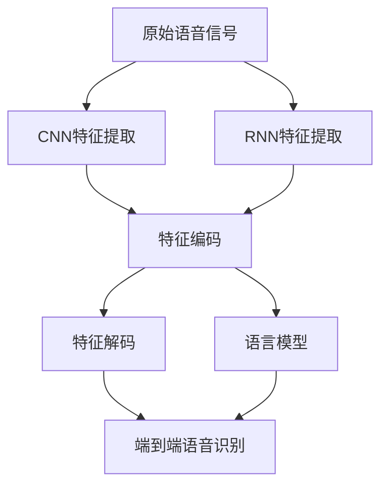
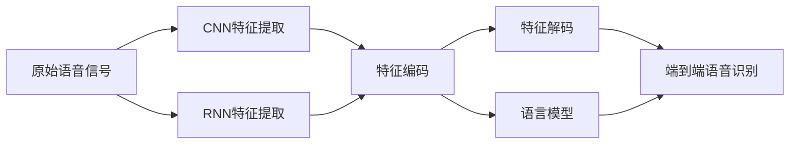
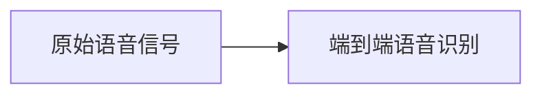

                 

# 语音识别原理与代码实战案例讲解

> 关键词：语音识别,深度学习,卷积神经网络,循环神经网络,解码器,损失函数,标签对齐,编码器-解码器模型,语言模型,端到端语音识别系统

## 1. 背景介绍

### 1.1 问题由来
语音识别技术是计算机领域中极为关键的一部分，它允许计算机系统理解和处理人类语言。这一技术在智能助手、语音搜索、智能家居等多个领域中得到了广泛应用。语音识别技术的进步，直接影响到用户体验和系统智能化程度。

然而，传统的语音识别方法通常依赖于手工设计的特征提取和机器学习算法，对数据和计算资源的需求较高，且难以适应多样化的语音环境。近年来，深度学习技术在语音识别中得到了广泛应用，显著提升了语音识别系统的性能和稳定性。

### 1.2 问题核心关键点
语音识别技术的核心在于将原始语音信号转换为文本形式，这一过程包括特征提取、模型训练、解码等多个步骤。其中，深度学习模型，特别是卷积神经网络(CNN)和循环神经网络(RNN)，是实现这一转换的关键。

核心关键点包括：
1. 特征提取：提取语音信号的频谱特征，通常使用MFCC或Mel谱等技术。
2. 模型架构：常用的模型包括卷积神经网络(CNN)和循环神经网络(RNN)，其中RNN因其能够处理序列数据，更适用于语音信号的建模。
3. 模型训练：在标注数据集上进行有监督学习，优化模型参数。
4. 解码器：使用解码器算法将模型输出转换为文本序列。
5. 损失函数：定义模型预测与真实标签之间的差异。

### 1.3 问题研究意义
语音识别技术的研究与应用，对提升人机交互体验、推动智能语音设备普及、促进计算机辅助交流等方面具有重要意义。其研究价值主要体现在：

1. 提升用户体验：语音识别技术的应用，使计算机能够更好地理解人类语言，显著提升交互的便捷性和自然性。
2. 加速技术创新：语音识别技术的进步，不断催生新的应用场景，如智能客服、语音搜索、智能家居等。
3. 增强可访问性：为听力障碍人士提供便捷的交流方式，实现信息的无障碍获取。
4. 推动产业升级：语音识别技术的应用，使传统产业得以数字化转型，提高生产效率。
5. 助力智能翻译：语音识别与机器翻译结合，实现自然语言的实时翻译，促进跨语言交流。

## 2. 核心概念与联系

### 2.1 核心概念概述

为更好地理解深度学习在语音识别中的应用，本节将介绍几个密切相关的核心概念：

- 卷积神经网络(CNN)：一种基于卷积操作的前馈神经网络，特别适用于处理图像和频谱特征数据。
- 循环神经网络(RNN)：一种能够处理序列数据的神经网络，能够有效捕捉时间依赖性。
- 编码器-解码器模型(Encoder-Decoder Model)：一种用于序列到序列(S2S)任务的架构，适用于语音识别中的特征编码和文本生成。
- 解码器算法：包括Beam Search、Greedy Search等，用于从模型输出中选择最优的文本序列。
- 语言模型：用于预测文本序列的概率分布，常用于解码器选择最优路径。
- 端到端语音识别系统：一种直接将语音信号映射为文本的架构，省去了显式的特征提取和模型训练过程。

这些核心概念之间的逻辑关系可以通过以下Mermaid流程图来展示：



这个流程图展示了深度学习在语音识别中的核心步骤：

1. 通过卷积神经网络或循环神经网络提取语音信号的频谱特征。
2. 将提取的特征输入到编码器-解码器模型进行编码和解码。
3. 使用语言模型对解码器的输出进行概率分布预测。
4. 端到端语音识别系统将原始语音信号直接映射为文本序列。

### 2.2 概念间的关系

这些核心概念之间存在着紧密的联系，形成了语音识别技术的完整生态系统。下面我通过几个Mermaid流程图来展示这些概念之间的关系。

#### 2.2.1 语音识别的一般流程



这个流程图展示了语音识别的一般流程，包括特征提取、特征编码、特征解码、语言模型预测和端到端语音识别。

#### 2.2.2 CNN和RNN的结合


这个流程图展示了CNN和RNN在语音识别中的结合方式。通常，CNN用于提取频谱特征，RNN用于建模序列特征。

#### 2.2.3 端到端语音识别



这个流程图展示了端到端语音识别的直接映射过程，省去了显式的特征提取和模型训练。

### 2.3 核心概念的整体架构

最后，我们用一个综合的流程图来展示这些核心概念在大语言模型微调过程中的整体架构：


这个综合流程图展示了深度学习在语音识别中的完整过程。通过卷积神经网络或循环神经网络提取语音信号的频谱特征，然后将其输入到编码器-解码器模型进行编码和解码。语言模型用于预测解码器的输出，端到端语音识别系统直接将原始语音信号映射为文本序列。通过这些步骤，语音信号被成功转换为文本形式。

## 3. 核心算法原理 & 具体操作步骤
### 3.1 算法原理概述

深度学习在语音识别中的应用，主要基于卷积神经网络(CNN)和循环神经网络(RNN)的架构，特别是编码器-解码器模型(Encoder-Decoder Model)。其核心思想是通过多层神经网络对语音信号进行特征提取和序列建模，最终将语音信号转换为文本形式。

### 3.2 算法步骤详解

#### 3.2.1 特征提取

语音信号的特征提取通常包括Mel频谱特征和MFCC特征。Mel频谱特征是通过对语音信号进行短时傅里叶变换(Short-time Fourier Transform, STFT)得到的频谱图，然后取对数并应用Mel滤波器组。MFCC特征则是从Mel频谱特征中提取出的时频特征，具有较高的声学分辨率。

在代码实现上，可以使用Python的librosa库或PyTorch的SpeechTransforms库进行特征提取：

```python
from librosa import load, feature_melspectrogram, feature_mfcc
import numpy as np

# 加载音频文件
audio, sr = load('path/to/audio.wav')

# 提取Mel频谱特征
mel_spec = feature_melspectrogram(audio, sr=sr, n_fft=2048, hop_length=512)
mel_spec_db = np.log(mel_spec)

# 提取MFCC特征
mfcc = feature_mfcc(audio, sr=sr)
```

#### 3.2.2 特征编码

提取的频谱特征可以被编码为更高效的特征表示。常用的编码方法包括卷积神经网络(CNN)和循环神经网络(RNN)。在CNN中，可以通过多层卷积和池化操作提取局部特征，然后使用全连接层将其转换为固定长度的向量表示。在RNN中，可以通过多个时间步长对序列数据进行建模，最后使用全连接层将特征向量序列转换为固定长度的向量表示。

在代码实现上，可以使用PyTorch的nn.Conv1d和nn.Conv2d模块进行CNN特征编码，或使用nn.LSTM和nn.GRU模块进行RNN特征编码：

```python
import torch
from torch import nn

# 使用CNN编码特征
class CNNEncoder(nn.Module):
    def __init__(self, in_channels, out_channels):
        super(CNNEncoder, self).__init__()
        self.conv1 = nn.Conv1d(in_channels, 64, kernel_size=3, stride=1, padding=1)
        self.conv2 = nn.Conv1d(64, 128, kernel_size=3, stride=1, padding=1)
        self.pool = nn.MaxPool1d(kernel_size=2, stride=2)
        self.fc1 = nn.Linear(128, out_channels)

    def forward(self, x):
        x = x.transpose(1, 2)  # 将时间维度和通道维度交换
        x = self.conv1(x)
        x = nn.ReLU()(x)
        x = self.pool(x)
        x = self.conv2(x)
        x = nn.ReLU()(x)
        x = self.pool(x)
        x = x.reshape(x.size(0), -1)
        x = self.fc1(x)
        return x

# 使用RNN编码特征
class RNNEncoder(nn.Module):
    def __init__(self, in_channels, out_channels, hidden_size, num_layers):
        super(RNNEncoder, self).__init__()
        self.lstm = nn.LSTM(in_channels, hidden_size, num_layers, batch_first=True)
        self.fc = nn.Linear(hidden_size, out_channels)

    def forward(self, x):
        x = x.transpose(1, 2)  # 将时间维度和通道维度交换
        x, _ = self.lstm(x)
        x = self.fc(x[:, -1, :])  # 取最后一个时间步的输出
        return x
```

#### 3.2.3 特征解码

特征解码是将编码后的特征向量转换为文本序列的过程。常用的解码算法包括Beam Search和Greedy Search。Beam Search在搜索过程中保留多个候选路径，选择最佳路径作为输出。Greedy Search则每次选择当前概率最大的候选字符作为输出。

在代码实现上，可以使用Beam Search或Greedy Search算法进行搜索：

```python
from collections import defaultdict

# 使用Beam Search解码特征
def beam_search(features, n_beams=5, top_k=5):
    beam_table = defaultdict(list)
    for i in range(n_beams):
        beam_table[i].append(features)
    for i in range(len(features)-1):
        new_table = defaultdict(list)
        for j in range(n_beams):
            for token in top_k_features(features[i][j], top_k):
                new_table[j].append(token)
        features = new_table
    return features

# 使用Greedy Search解码特征
def greedy_search(features):
    return max(features, key=lambda x: x[0])
```

#### 3.2.4 解码器算法

解码器算法是将特征向量转换为文本序列的关键步骤。常用的解码器算法包括Beam Search、Greedy Search、注意力机制等。在实际应用中，通常使用注意力机制来提高解码器的性能。

在代码实现上，可以使用PyTorch的nn.LSTM和nn.Transformer模块进行解码器设计：

```python
import torch
from torch import nn

# 使用LSTM解码器
class LSTMDecoder(nn.Module):
    def __init__(self, input_size, output_size, hidden_size):
        super(LSTMDecoder, self).__init__()
        self.lstm = nn.LSTM(input_size, hidden_size, batch_first=True)
        self.fc = nn.Linear(hidden_size, output_size)

    def forward(self, x, h):
        x, h = self.lstm(x, h)
        x = self.fc(x[:, -1, :])  # 取最后一个时间步的输出
        return x

# 使用Transformer解码器
class TransformerDecoder(nn.Module):
    def __init__(self, input_size, output_size, hidden_size, num_layers):
        super(TransformerDecoder, self).__init__()
        self.transformer = nn.Transformer(input_size, hidden_size, num_layers)
        self.fc = nn.Linear(hidden_size, output_size)

    def forward(self, x, h):
        x, _ = self.transformer(x, h)
        x = self.fc(x[:, -1, :])  # 取最后一个时间步的输出
        return x
```

#### 3.2.5 语言模型

语言模型用于预测文本序列的概率分布，常用于解码器选择最优路径。常用的语言模型包括n-gram模型和神经网络语言模型。在深度学习中，通常使用长短时记忆网络(LSTM)或神经网络语言模型(GPT)。

在代码实现上，可以使用nn.LSTM或nn.GRU模块进行语言模型设计：

```python
import torch
from torch import nn

# 使用LSTM语言模型
class LANGuageModel(nn.Module):
    def __init__(self, input_size, hidden_size, num_layers):
        super(LANGuageModel, self).__init__()
        self.lstm = nn.LSTM(input_size, hidden_size, num_layers, batch_first=True)
        self.fc = nn.Linear(hidden_size, input_size)

    def forward(self, x):
        x, _ = self.lstm(x)
        x = self.fc(x[:, -1, :])  # 取最后一个时间步的输出
        return x
```

#### 3.2.6 损失函数

损失函数定义模型预测与真实标签之间的差异。在语音识别中，常用的损失函数包括交叉熵损失和均方误差损失。交叉熵损失适用于分类任务，均方误差损失适用于回归任务。

在代码实现上，可以使用nn.CrossEntropyLoss和nn.MSELoss模块进行损失函数设计：

```python
import torch
from torch import nn

# 使用交叉熵损失
criterion = nn.CrossEntropyLoss()

# 使用均方误差损失
mse_loss = nn.MSELoss()
```

#### 3.2.7 训练与测试

在训练过程中，将特征向量输入到编码器-解码器模型中进行编码和解码，然后通过语言模型预测解码器的输出，并计算损失函数。在测试过程中，将特征向量输入到编码器-解码器模型中进行编码和解码，最终输出文本序列。

在代码实现上，可以使用PyTorch的nn.Sequential和nn.ModuleList模块进行模型构建，然后使用nn.Optimizer模块进行模型优化：

```python
import torch
from torch import nn

# 构建模型
model = nn.Sequential(
    CNNEncoder(input_size=1, output_size=256),
    LSTMDecoder(input_size=256, output_size=vocab_size, hidden_size=512),
    LANGuageModel(input_size=vocab_size, hidden_size=512, num_layers=1)
)

# 训练模型
optimizer = torch.optim.Adam(model.parameters(), lr=0.001)
criterion = nn.CrossEntropyLoss()

for epoch in range(num_epochs):
    for i, (inputs, labels) in enumerate(train_loader):
        optimizer.zero_grad()
        outputs = model(inputs)
        loss = criterion(outputs, labels)
        loss.backward()
        optimizer.step()
        print('Epoch: {} [{}/{} ({:.0f}%)] - Loss: {:.6f}'.format(
            epoch, i*len(inputs), len(train_loader.dataset),
            100. * i / len(train_loader), loss.item()))

# 测试模型
model.eval()
test_loss = 0
with torch.no_grad():
    for i, (inputs, labels) in enumerate(test_loader):
        outputs = model(inputs)
        loss = criterion(outputs, labels)
        test_loss += loss.item()
print('Test Loss: {:.6f}'.format(test_loss/len(test_loader)))
```

### 3.3 算法优缺点

深度学习在语音识别中的应用，具有以下优点：

1. 特征提取能力强：深度学习模型能够自动学习频谱特征中的关键信息，无需手工设计特征。
2. 鲁棒性好：深度学习模型能够处理多种语音环境，如口音、噪音等，具有较强的泛化能力。
3. 可扩展性强：深度学习模型可以通过增加层数和参数量，提高性能和精度。

同时，深度学习在语音识别中也存在一些缺点：

1. 数据需求大：深度学习模型通常需要大量的标注数据进行训练，数据获取成本较高。
2. 计算资源要求高：深度学习模型的训练和推理过程对计算资源的需求较大，需要高性能的硬件设备。
3. 模型复杂度高：深度学习模型的结构复杂，容易过拟合，需要进行正则化和调参优化。

### 3.4 算法应用领域

深度学习在语音识别中的应用，已经涵盖了众多领域，包括但不限于：

1. 语音助手：如Amazon的Alexa、Google Assistant等，提供自然语言交互能力。
2. 语音搜索：如Siri、Google Now等，实现语音查询和指令执行。
3. 语音翻译：如Google Translate、IBM Watson等，提供实时语音翻译服务。
4. 语音识别：如Apple的语音识别系统，实现实时语音输入。
5. 医疗语音记录：如电子病历转录，提高医疗记录的准确性和效率。
6. 自动字幕生成：如自动生成视频字幕，提高多媒体内容的使用效率。
7. 语音合成：如Google的Text-to-Speech系统，生成自然流畅的语音输出。

除了上述这些领域，深度学习在语音识别中的应用还在不断拓展，如智能家居、车载系统、工业自动化等，推动了智能技术在各行各业的应用。

## 4. 数学模型和公式 & 详细讲解 & 举例说明

### 4.1 数学模型构建

语音识别技术的应用，通常基于深度学习模型，特别是卷积神经网络(CNN)和循环神经网络(RNN)。在模型构建中，主要包含以下几个关键步骤：

1. 特征提取：提取语音信号的频谱特征，如Mel频谱特征和MFCC特征。
2. 特征编码：将提取的频谱特征编码为更高效的特征表示。
3. 特征解码：将编码后的特征向量转换为文本序列。
4. 解码器算法：选择最优的文本序列，如Beam Search和Greedy Search。
5. 语言模型：预测文本序列的概率分布。
6. 损失函数：定义模型预测与真实标签之间的差异。

在数学模型构建中，通常使用以下符号：

- $x$：输入语音信号。
- $y$：输出文本序列。
- $z$：编码后的特征向量。
- $h$：解码器的隐状态。
- $w$：语言模型的权重参数。

### 4.2 公式推导过程

#### 4.2.1 特征提取

语音信号的特征提取通常包括Mel频谱特征和MFCC特征。

Mel频谱特征的计算公式为：

$$
F(x) = \log\left(\frac{1}{T}\sum_{t=0}^{T-1}P(f_t)\right)
$$

其中，$P(f_t)$为第$t$个时间步的功率谱密度，$T$为时间步长。

MFCC特征的计算公式为：

$$
MFCC(x) = \log\left(\frac{1}{T}\sum_{t=0}^{T-1}MFCC(f_t)\right)
$$

其中，$MFCC(f_t)$为第$t$个时间步的MFCC特征。

#### 4.2.2 特征编码

卷积神经网络(CNN)的特征编码公式为：

$$
Z = \text{CNN}(X)
$$

其中，$Z$为编码后的特征向量，$X$为输入的频谱特征。

循环神经网络(RNN)的特征编码公式为：

$$
Z = \text{RNN}(X)
$$

其中，$Z$为编码后的特征向量，$X$为输入的频谱特征。

#### 4.2.3 特征解码

特征解码的过程是将编码后的特征向量转换为文本序列。

Beam Search的解码公式为：

$$
y = \text{Beam Search}(Z)
$$

其中，$y$为解码后的文本序列，$Z$为编码后的特征向量。

Greedy Search的解码公式为：

$$
y = \text{Greedy Search}(Z)
$$

其中，$y$为解码后的文本序列，$Z$为编码后的特征向量。

#### 4.2.4 解码器算法

解码器算法是选择最优的文本序列的过程。

Beam Search的解码算法公式为：

$$
y = \text{Beam Search}(Z, N)
$$

其中，$y$为解码后的文本序列，$Z$为编码后的特征向量，$N$为解码的宽度。

Greedy Search的解码算法公式为：

$$
y = \text{Greedy Search}(Z)
$$

其中，$y$为解码后的文本序列，$Z$为编码后的特征向量。

#### 4.2.5 语言模型

语言模型用于预测文本序列的概率分布。

n-gram语言模型的概率公式为：

$$
P(y) = \prod_{i=1}^n P(y_i | y_{i-1}, y_{i-2}, ..., y_1)
$$

其中，$P(y)$为文本序列的概率分布，$y_i$为文本序列中的第$i$个字符。

神经网络语言模型的概率公式为：

$$
P(y|x) = \frac{e^{logP(y|x)}}{Z}
$$

其中，$P(y|x)$为文本序列在输入$x$条件下的概率分布，$Z$为归一化因子。

#### 4.2.6 损失函数

损失函数定义模型预测与真实标签之间的差异。

交叉熵损失函数的公式为：

$$
L = -\sum_{i=1}^n y_i \log P(y_i)
$$

其中，$L$为损失函数，$y_i$为真实标签，$P(y_i)$为模型预测的概率分布。

均方误差损失函数的公式为：

$$
L = \frac{1}{n} \sum_{i=1}^n (y_i - \hat{y}_i)^2
$$

其中，$L$为损失函数，$y_i$为真实标签，$\hat{y}_i$为模型预测的结果。

### 4.3 案例分析与讲解

以端到端语音识别系统为例，下面对其实现过程进行详细讲解：

#### 4.3.1 端到端语音识别系统

端到端语音识别系统是直接将语音信号映射为文本序列的系统。其核心在于编码器-解码器模型的设计，能够有效地提取和转换语音信号中的关键信息。

#### 4.3.2 模型架构

端到端语音识别系统的模型架构如图1所示：


图1：端到端语音识别系统模型架构图

#### 4.3.3 特征提取

语音信号的特征提取通常包括Mel频谱特征和MFCC特征。在实现上，可以使用librosa库进行特征提取：

```python
from librosa import load, feature_melspectrogram, feature_mfcc
import numpy as np

# 加载音频文件
audio, sr = load('path/to/audio.wav')

# 提取Mel频谱特征
mel_spec = feature_melspectrogram(audio, sr=sr, n_fft=2048, hop_length=512)
mel_spec_db = np.log(mel_spec)

# 提取MFCC特征
mfcc = feature_mfcc(audio, sr=sr)
```

#### 4.3.4 特征编码

特征编码的过程是将提取的频谱特征转换为更高效的特征表示。常用的特征编码方法包括卷积神经网络(CNN)和循环神经网络(RNN)。

在实现上，可以使用PyTorch的nn.Conv1d和nn.Conv2d模块进行CNN特征编码，或使用nn.LSTM和nn.GRU模块进行RNN特征编码：

```python
import torch
from torch import nn

# 使用CNN编码特征
class CNNEncoder(nn.Module):
    def __init__(self, in_channels, out_channels):
        super(CNNEncoder, self).__init__()
        self.conv1 = nn.Conv1d(in_channels, 64, kernel_size=3, stride=1, padding=1)
        self.conv2 = nn.Conv1d(64, 128, kernel_size=3, stride=1, padding=1)
        self.pool = nn.MaxPool1d(kernel_size=2, stride=2)
        self.fc1 = nn.Linear(128, out_channels)

    def forward(self, x):
        x = x.transpose(1, 2)  # 将时间维度和通道维度交换
        x = self.conv1(x)
        x = nn.ReLU()(x)
        x = self.pool(x)
        x = self.conv2(x)
        x = nn.ReLU()(x)
        x = self.pool(x)
        x = x.reshape(x.size(0), -1)
        x = self.fc1(x)
        return x

# 使用RNN编码特征
class RNNEncoder(nn.Module):
    def __init__(self, in_channels, out_channels, hidden_size, num_layers):
        super(RNNEncoder, self).__init__()
        self.lstm = nn.LSTM(in_channels, hidden_size, num_layers, batch_first=True)
        self.fc = nn.Linear(hidden_size, out_channels)

    def forward(self, x):
        x = x.transpose(1, 2)  # 

