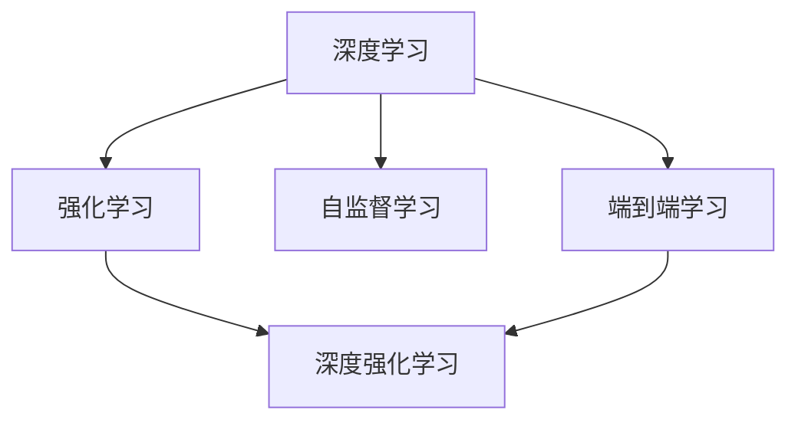
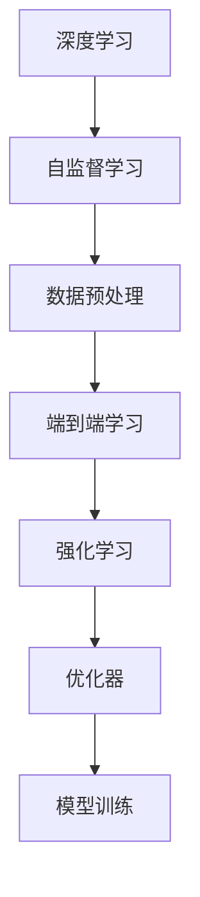
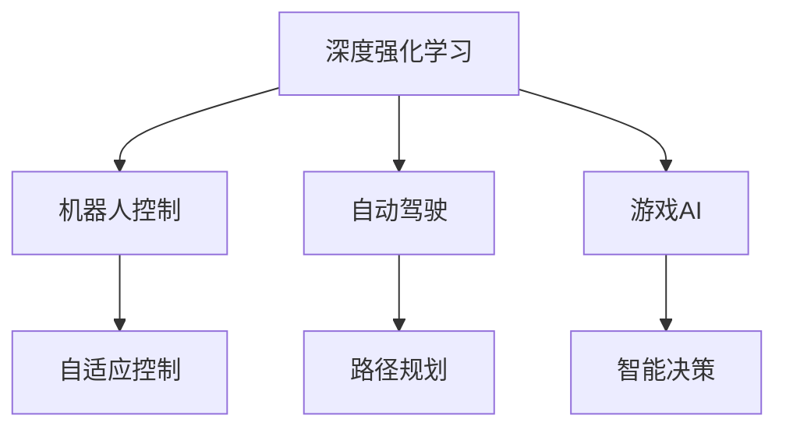
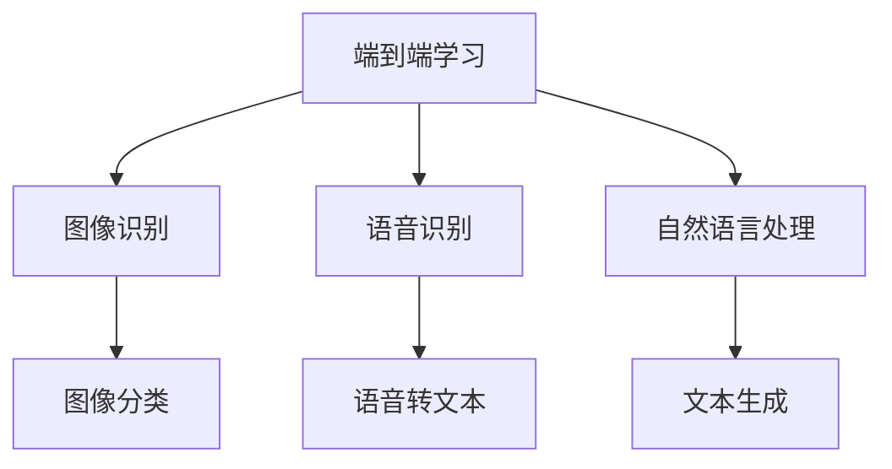
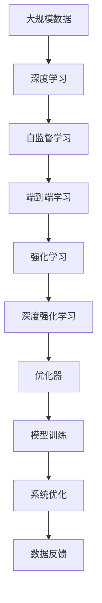

                 

# 软件 2.0 的发展趋势：深度学习、强化学习

## 1. 背景介绍

### 1.1 问题由来
随着科技的进步，软件行业正经历着前所未有的变革。从传统的软件工程到软件2.0时代，AI驱动的软件模型正在逐渐替代传统的软件模式。这种转变不仅仅是对程序和系统的重塑，更是对软件开发和运维理念的深刻革新。深度学习和强化学习作为人工智能的重要分支，在大数据、云计算、自动驾驶等众多领域都展现出强大的潜力，并成为推动软件2.0发展的重要力量。

### 1.2 问题核心关键点
深度学习和强化学习在软件开发中的应用，改变了传统的基于规则的软件开发方式，使得软件开发更加高效、智能和自动。其主要特点和优势包括：

- **高效性**：通过机器学习算法，可以快速分析大量数据，提取有用信息，优化算法和模型，加速软件设计和实现。
- **自动化**：强化学习算法可以通过模拟和优化，自动生成代码和调试，减少人工干预，提高开发效率。
- **自适应性**：深度学习模型可以通过在线学习，不断适应新数据和新环境，保持软件的长期可用性。
- **泛化能力**：强化学习算法能够从经验中学习，对未知问题进行有效预测和决策，提升软件的通用性和适应性。

深度学习和强化学习的融合，也成为新一代软件开发的重要趋势。通过深度学习和强化学习的协同作用，软件2.0将更加智能、高效、自适应，能够在复杂的业务环境中提供更加出色的解决方案。

### 1.3 问题研究意义
深度学习和强化学习的应用，不仅提升了软件的开发效率和质量，还推动了软件行业的智能化转型。研究深度学习和强化学习在软件开发中的应用，对于构建高效、智能的软件系统，推动软件行业的发展具有重要意义：

- **提升软件质量**：通过深度学习和强化学习，可以自动生成高质量的软件代码和设计方案，降低人工错误和疏漏，提升软件稳定性和可靠性。
- **加速软件迭代**：深度学习和强化学习可以自动化软件测试和优化，加速软件迭代和发布，缩短产品上市时间。
- **增强用户体验**：通过深度学习和强化学习，可以更好地理解和预测用户需求，设计更符合用户期望的软件产品，提升用户体验和满意度。
- **降低开发成本**：深度学习和强化学习可以自动化繁琐的软件开发任务，减少人工工作量，降低开发成本。
- **推动行业创新**：深度学习和强化学习可以应用于各种新兴技术和业务场景，为软件行业带来新的创新点和发展机遇。

## 2. 核心概念与联系

### 2.1 核心概念概述

为更好地理解深度学习和强化学习在软件开发中的应用，本节将介绍几个密切相关的核心概念：

- **深度学习(Deep Learning, DL)**：一种基于多层神经网络的机器学习技术，通过多层次的特征提取和抽象，能够处理和分析高维度、非结构化数据，如图像、声音、文本等。深度学习在大数据分析、图像识别、语音识别等领域展现出巨大潜力。

- **强化学习(Reinforcement Learning, RL)**：一种通过与环境交互，根据奖励信号优化行为策略的学习方法。强化学习在自动控制、游戏AI、机器人学等领域有广泛应用。

- **深度强化学习(Deep Reinforcement Learning, DRL)**：将深度学习与强化学习相结合，通过神经网络处理高维数据，并通过强化学习优化行为策略，能够处理更加复杂和动态的系统。

- **端到端学习(End-to-End Learning)**：一种从数据输入到输出完全由模型自动处理的机器学习方法，避免了繁琐的特征工程和中间变量，提升了数据处理和模型训练的效率。

- **自监督学习(Self-supervised Learning)**：一种利用数据自身的性质进行训练，无需额外标签的学习方法。自监督学习能够自动提取数据中的有用信息，提升模型的泛化能力。

这些核心概念之间的逻辑关系可以通过以下Mermaid流程图来展示：



这个流程图展示了大模型学习和强化学习在大规模数据分析和系统优化中的应用。

### 2.2 概念间的关系

这些核心概念之间存在着紧密的联系，形成了深度学习和强化学习在软件开发中的应用生态系统。下面我通过几个Mermaid流程图来展示这些概念之间的关系。

#### 2.2.1 深度学习和强化学习的应用范式



这个流程图展示了深度学习和强化学习在大规模数据分析和系统优化中的应用范式。自监督学习通过对数据进行预处理和特征提取，端到端学习自动进行特征提取和模型训练，强化学习通过优化器调整模型参数，实现系统的持续优化。

#### 2.2.2 深度强化学习的应用场景



这个流程图展示了深度强化学习在机器人控制、自动驾驶、游戏AI等应用场景中的具体应用。深度强化学习能够处理复杂动态系统，通过与环境的交互，不断优化行为策略，实现更加高效和精准的系统控制。

#### 2.2.3 端到端学习的应用场景



这个流程图展示了端到端学习在图像识别、语音识别、自然语言处理等应用场景中的应用。端到端学习能够直接从原始数据生成模型输出，避免了繁琐的中间步骤，提升了数据处理和模型训练的效率。

### 2.3 核心概念的整体架构

最后，我们用一个综合的流程图来展示这些核心概念在大规模数据分析和系统优化中的应用：



这个综合流程图展示了从数据输入到系统优化的完整过程。深度学习和强化学习通过数据预处理、端到端学习、模型训练和系统优化，实现了大规模数据分析和系统优化的自动化和智能化。

## 3. 核心算法原理 & 具体操作步骤
### 3.1 算法原理概述

深度学习和强化学习在软件开发中的应用，主要基于以下原理：

- **深度学习原理**：深度学习通过多层神经网络，对输入数据进行逐层抽象和特征提取，并利用反向传播算法优化模型参数，实现对复杂数据的自动处理和分析。
- **强化学习原理**：强化学习通过与环境交互，根据奖励信号优化行为策略，通过Q值或策略函数，优化决策过程，实现自动控制和优化。

深度学习和强化学习在软件开发中的应用，主要分为以下几个步骤：

1. **数据准备**：收集和整理大量数据，进行预处理和特征提取。
2. **模型构建**：构建深度学习模型或强化学习模型，选择合适的网络结构和优化算法。
3. **模型训练**：通过大量的数据和优化算法，训练模型参数，实现模型的自动优化。
4. **系统集成**：将训练好的模型集成到软件系统中，进行自动化的数据处理和决策。
5. **模型评估**：通过测试和评估，验证模型在实际应用中的效果，并进行必要的优化和改进。

### 3.2 算法步骤详解

#### 3.2.1 数据准备

数据准备是深度学习和强化学习应用的基础，需要收集和整理大量的数据，并进行预处理和特征提取。以下是数据准备的详细操作步骤：

1. **数据收集**：根据实际需求，收集相应的数据，如图像、语音、文本等。可以使用爬虫工具、API接口、数据库等方式获取数据。
2. **数据清洗**：对收集的数据进行清洗和预处理，去除噪声和异常数据，提升数据质量。可以使用数据清洗工具、规则匹配、异常检测等方法。
3. **特征提取**：对数据进行特征提取和编码，将数据转化为机器学习算法可处理的形式。可以使用PCA、LDA、特征哈希等方法。
4. **数据分割**：将数据划分为训练集、验证集和测试集，以便进行模型的训练和评估。可以使用交叉验证、留出法等方法。

#### 3.2.2 模型构建

模型构建是深度学习和强化学习应用的核心，需要选择合适的模型结构和优化算法。以下是模型构建的详细操作步骤：

1. **模型选择**：根据实际需求，选择深度学习模型或强化学习模型。可以选择常用的卷积神经网络、循环神经网络、自编码器、生成对抗网络等深度学习模型，或者Q值网络、策略网络等强化学习模型。
2. **网络结构设计**：根据模型选择，设计网络结构和参数设置。可以使用神经网络设计工具、自动机器学习工具等，生成最优网络结构。
3. **优化算法选择**：选择合适的优化算法，如Adam、SGD等，设置学习率、批大小、迭代轮数等。可以使用优化算法自动调参工具、超参数搜索工具等，优化模型性能。
4. **损失函数选择**：选择合适的损失函数，如交叉熵损失、均方误差损失等。可以使用自定义损失函数，提升模型精度。

#### 3.2.3 模型训练

模型训练是深度学习和强化学习应用的实践阶段，需要利用数据进行模型训练和优化。以下是模型训练的详细操作步骤：

1. **数据输入**：将训练数据输入模型，进行前向传播计算损失函数。可以使用数据批处理工具、自动批处理工具等，提升数据处理效率。
2. **反向传播**：根据损失函数计算模型参数梯度，利用反向传播算法进行参数更新。可以使用深度学习框架、自动微分工具等，实现高效的反向传播计算。
3. **优化算法更新**：根据梯度信息，使用优化算法更新模型参数，进行模型的优化和迭代。可以使用分布式优化工具、自动化优化工具等，提升模型训练效率。
4. **模型评估**：在验证集上评估模型性能，检测模型泛化能力，进行必要的优化和改进。可以使用自动化评估工具、可视化工具等，提升模型评估效率。

#### 3.2.4 系统集成

系统集成是深度学习和强化学习应用的目标阶段，需要将训练好的模型集成到软件系统中。以下是系统集成的详细操作步骤：

1. **API接口设计**：设计API接口，实现模型与软件系统的交互。可以使用RESTful API、SOAP API等，实现高效的数据交互。
2. **模型部署**：将训练好的模型部署到服务器或云平台，实现模型的实际应用。可以使用容器化工具、云平台工具等，提升模型部署效率。
3. **数据输入**：将待处理数据输入模型，进行自动化的数据处理和分析。可以使用数据输入工具、数据流工具等，提升数据处理效率。
4. **结果输出**：将模型的输出结果输出到软件系统中，实现自动化的决策和控制。可以使用数据输出工具、可视化工具等，提升结果输出效率。

#### 3.2.5 模型评估

模型评估是深度学习和强化学习应用的重要环节，需要验证模型在实际应用中的效果和性能。以下是模型评估的详细操作步骤：

1. **测试数据准备**：收集和整理测试数据，并进行预处理和特征提取。可以使用测试集、数据扩充技术等，提升测试数据质量。
2. **模型输入**：将测试数据输入模型，进行自动化的数据处理和分析。可以使用测试工具、数据流工具等，提升数据处理效率。
3. **结果输出**：将模型的输出结果进行评估和分析，检测模型效果和性能。可以使用自动化评估工具、可视化工具等，提升结果评估效率。
4. **优化改进**：根据评估结果，进行必要的优化和改进，提升模型性能。可以使用自动化优化工具、超参数搜索工具等，提升模型优化效率。

### 3.3 算法优缺点

深度学习和强化学习在软件开发中的应用，具有以下优点：

- **高效性**：深度学习和强化学习能够自动处理大量数据，提取有用信息，优化模型和算法，提升开发效率。
- **自动化**：深度学习和强化学习能够自动生成代码和调试，减少人工干预，提高开发效率。
- **自适应性**：深度学习和强化学习能够不断适应新数据和新环境，保持软件的长期可用性。
- **泛化能力**：深度学习和强化学习能够从经验中学习，对未知问题进行有效预测和决策，提升软件的通用性和适应性。

同时，深度学习和强化学习在软件开发中也存在一些缺点：

- **高计算需求**：深度学习和强化学习需要大量的计算资源，如图形处理器、深度学习框架、服务器等，增加了开发成本。
- **模型复杂性**：深度学习和强化学习模型的结构复杂，需要大量的经验和知识进行设计和调试，增加了开发难度。
- **数据依赖性**：深度学习和强化学习对数据质量有较高的要求，数据偏差、噪声等问题可能影响模型性能。
- **解释性不足**：深度学习和强化学习模型通常是黑盒系统，难以解释其内部工作机制和决策逻辑，增加了开发和维护难度。

尽管存在这些缺点，但深度学习和强化学习在软件开发中的应用仍然具有广阔的前景和潜力。随着技术的发展和优化，这些问题将逐步得到解决，深度学习和强化学习将成为软件开发的重要工具和方法。

### 3.4 算法应用领域

深度学习和强化学习在软件开发中的应用，已经覆盖了多个领域，具体如下：

1. **自动代码生成**：通过深度学习和强化学习，自动生成代码和文档，提高代码质量和开发效率。
2. **自动化测试**：通过深度学习和强化学习，自动生成测试用例和测试数据，提高测试覆盖率和测试效率。
3. **代码缺陷检测**：通过深度学习和强化学习，自动检测代码中的缺陷和错误，提升代码质量和可靠性。
4. **软件推荐系统**：通过深度学习和强化学习，推荐软件应用和服务，提升用户体验和满意度。
5. **智能客服系统**：通过深度学习和强化学习，自动处理客户咨询和问题，提高服务质量和效率。
6. **智能运维系统**：通过深度学习和强化学习，自动监控和优化系统性能，提升系统稳定性和可靠性。
7. **智能决策系统**：通过深度学习和强化学习，自动分析和决策，提升业务效率和决策质量。

深度学习和强化学习在软件开发中的应用，已经在多个行业和企业中得到应用和验证，取得了显著的效果和成果。

## 4. 数学模型和公式 & 详细讲解 & 举例说明

### 4.1 数学模型构建

在深度学习和强化学习的应用中，数学模型是非常重要的一环。这里以深度学习模型为例，介绍其数学模型的构建和推导。

假设深度学习模型为 $M_{\theta}(x)$，其中 $x$ 为输入数据，$\theta$ 为模型参数。模型的输出为 $y_{pred}$，真实标签为 $y_{true}$。定义损失函数为 $L(y_{pred}, y_{true})$，用于衡量模型预测输出与真实标签之间的差异。常见的损失函数包括交叉熵损失、均方误差损失等。

定义模型的训练集为 $D=\{(x_i, y_i)\}_{i=1}^N$，其中 $x_i$ 为输入数据，$y_i$ 为真实标签。定义模型的训练过程为最小化损失函数，即：

$$
\theta^* = \mathop{\arg\min}_{\theta} \frac{1}{N} \sum_{i=1}^N L(y_{pred}, y_{true})
$$

在实践中，通常使用基于梯度的优化算法，如Adam、SGD等，进行模型的训练。使用反向传播算法计算损失函数对模型参数的梯度，并利用优化算法进行参数更新。具体步骤如下：

1. **数据输入**：将训练数据输入模型，进行前向传播计算损失函数。
2. **反向传播**：根据损失函数计算模型参数梯度，利用反向传播算法进行参数更新。
3. **优化算法更新**：根据梯度信息，使用优化算法更新模型参数，进行模型的优化和迭代。
4. **模型评估**：在验证集上评估模型性能，检测模型泛化能力，进行必要的优化和改进。

### 4.2 公式推导过程

以下我们以深度学习模型中的卷积神经网络(Convolutional Neural Network, CNN)为例，推导交叉熵损失函数及其梯度的计算公式。

假设CNN的输出为 $y_{pred} = M_{\theta}(x)$，真实标签为 $y_{true} = y$。定义交叉熵损失函数为：

$$
L(y_{pred}, y_{true}) = -\frac{1}{N} \sum_{i=1}^N y_{true} \log y_{pred}
$$

其中，$y_{true}$ 和 $y_{pred}$ 的维度应一致，通常为 $N$ 维向量。在训练过程中，使用反向传播算法计算损失函数对模型参数的梯度。具体步骤如下：

1. **前向传播**：将训练数据输入模型，计算输出 $y_{pred}$。
2. **计算损失**：根据交叉熵损失函数，计算损失值 $L$。
3. **反向传播**：根据损失值 $L$，计算损失函数对输出 $y_{pred}$ 的梯度 $\nabla L$。
4. **梯度下降**：根据梯度 $\nabla L$，使用梯度下降算法更新模型参数 $\theta$。

在实践中，使用深度学习框架（如PyTorch、TensorFlow等）可以实现上述步骤的自动化，大大降低了开发难度。例如，在PyTorch中，可以使用如下代码实现上述步骤：

```python
import torch
import torch.nn as nn
import torch.optim as optim

# 定义CNN模型
class CNN(nn.Module):
    def __init__(self):
        super(CNN, self).__init__()
        self.conv1 = nn.Conv2d(3, 64, 3, padding=1)
        self.relu1 = nn.ReLU()
        self.pool1 = nn.MaxPool2d(2, 2)
        self.conv2 = nn.Conv2d(64, 128, 3, padding=1)
        self.relu2 = nn.ReLU()
        self.pool2 = nn.MaxPool2d(2, 2)
        self.fc1 = nn.Linear(128 * 28 * 28, 512)
        self.relu3 = nn.ReLU()
        self.fc2 = nn.Linear(512, 10)
        
    def forward(self, x):
        x = self.conv1(x)
        x = self.relu1(x)
        x = self.pool1(x)
        x = self.conv2(x)
        x = self.relu2(x)
        x = self.pool2(x)
        x = x.view(-1, 128 * 28 * 28)
        x = self.fc1(x)
        x = self.relu3(x)
        x = self.fc2(x)
        return x

# 定义交叉熵损失函数
criterion = nn.CrossEntropyLoss()

# 定义优化器
optimizer = optim.Adam(model.parameters(), lr=0.001)

# 定义训练函数
def train(model, criterion, optimizer, train_loader, num_epochs):
    for epoch in range(num_epochs):
        for i, (inputs, labels) in enumerate(train_loader):
            inputs, labels = inputs.to(device), labels.to(device)
            optimizer.zero_grad()
            outputs = model(inputs)
            loss = criterion(outputs, labels)
            loss.backward()
            optimizer.step()
            if i % 100 == 0:
                print('Epoch [{}/{}], Step [{}/{}], Loss: {:.4f}'.format(epoch+1, num_epochs, i+1, len(train_loader), loss.item()))
```

在上述代码中，使用了PyTorch的深度学习框架，定义了CNN模型和交叉熵损失函数，并使用Adam优化器进行模型训练。通过自动化训练过程，可以大大简化模型的构建和训练步骤。

### 4.3 案例分析与讲解

这里以深度学习在自然语言处理(NLP)领域的应用为例，介绍深度学习模型的应用案例。

假设我们使用CNN对文本进行情感分析。首先，需要将文本进行预处理，转化为模型可接受的输入数据。然后，构建CNN模型，并使用交叉熵损失函数进行训练。最后，在测试集上评估模型性能，并对新文本进行情感预测。

具体步骤如下：

1. **数据预处理**：对文本进行分词、去除停用词、词向量化等预处理，转化为模型可接受的输入数据。
2. **模型构建**：构建CNN模型，并使用交叉熵损失函数进行训练。
3. **模型评估**：在测试集上评估模型性能，检测模型泛化能力，进行必要的优化和改进。
4. **预测输出**：对新文本进行预处理和模型输入，得到情感预测结果。

在实践中，可以使用深度学习框架（如TensorFlow、Keras等），或者开源工具（如NLTK、spaCy等），实现上述步骤的自动化。例如，在Keras中，可以使用如下代码实现上述步骤：

```python
import numpy as np
import keras
import keras.layers as layers
from keras.models import Sequential
from keras.layers import Dense, Dropout, Embedding, LSTM, Conv1D, MaxPooling1D
from keras.preprocessing.text import Tokenizer
from keras.preprocessing.sequence import pad_sequences

# 定义文本数据
texts = ['text1', 'text2', 'text3']
labels = [1, 0, 1]

# 定义文本分词器
tokenizer = Tokenizer(num_words=1000, oov_token='<OOV>')
tokenizer.fit_on_texts(texts)
sequences = tokenizer.texts_to_sequences(texts)

# 对文本进行填充，使其长度一致
data = pad_sequences(sequences, maxlen=100)

# 构建模型
model = Sequential()
model.add(Embedding(1000, 32, input_length=100))
model.add(Conv1D(64, 5, activation='relu'))
model.add(MaxPooling1D(5))
model.add(LSTM(32))
model.add(Dense(1, activation='sigmoid'))
model.compile(loss='binary_crossentropy', optimizer='adam', metrics=['accuracy'])

# 训练模型
model.fit(data, np.array(labels), epochs=10, batch_size=32)

# 评估模型
test_texts = ['text4', 'text5']
test_sequences = tokenizer.texts_to_sequences(test_texts)
test_data = pad_sequences(test_sequences, maxlen=100)
predictions = model.predict(test_data)
print(predictions)

# 预测输出
texts = ['text6', 'text7']
text_sequences = tokenizer.texts_to_sequences(texts)
text_data = pad_sequences(text_sequences, maxlen=100)
prediction = model.predict(text_data)
print(prediction)
```

在上述代码中，使用了Keras的深度学习框架，构建了CNN模型，并使用交叉熵损失函数进行训练。通过自动化训练过程，可以大大简化模型的构建和训练步骤。

## 5. 项目实践：代码实例和详细解释说明

### 5.1 开发环境搭建

在进行深度学习和强化学习应用实践前，我们需要准备好开发环境。以下是使用Python进行PyTorch和TensorFlow开发的环境配置流程：

1. 安装Anaconda：从官网下载并安装Anaconda，用于创建独立的Python环境。

2. 创建并激活虚拟环境：
```bash
conda create -n pytorch-env python=3.8 
conda activate pytorch-env
```

3. 安装PyTorch：根据CUDA版本，从官网获取对应的安装命令。例如：
```bash
conda install pytorch torchvision torchaudio cudatoolkit=11.1 -c pytorch -c conda-forge
```

4. 安装TensorFlow：使用pip安装TensorFlow，并指定所需的CUDA版本。例如：
```bash
pip install tensorflow==2.4.0
```

5. 安装各类工具包：
```bash
pip install numpy pandas scikit-learn matplotlib tqdm jupyter notebook ipython
```

完成上述步骤后，即可在`pytorch-env`环境中开始深度学习和强化学习应用实践。

### 5.2 源代码详细实现

这里以强化学习在机器人控制中的应用为例，给出使用TensorFlow和OpenAI Gym库进行强化学习实践的PyTorch代码实现。

首先，导入必要的库和模块：

```python
import numpy as np
import tensorflow as tf
import gym
import tf_agents.agents.dqn as dqn
import tf_agents.agents.policy as policy
import tf_agents.agents.train as train
import tf_agents.agents.agents as agents
```

然后，定义机器人控制环境：

```python
# 定义机器人控制环境
env = gym.make('CartPole-v1')
```

接着，定义深度强化学习模型：

```python
# 定义Q网络
class QNetwork(tf.keras.Model):
    def __init__(self, input_shape, num_actions):
        super(QNetwork, self).__init__()
        self.input_shape = input_shape
        self.num_actions = num_actions
        self.fc1 = tf.keras.layers.Dense(128, activation='relu', input_shape=input_shape)
        self.fc2 = tf.keras.layers.Dense(128, activation='relu')
        self.fc3 = tf.keras.layers.Dense(num_actions, activation='softmax')
        
    def call(self, x):
        x = self.fc1(x)
        x = self.fc2(x)
        return self.fc3(x)
```

然后，定义训练函数：

```python
# 定义训练函数
def

