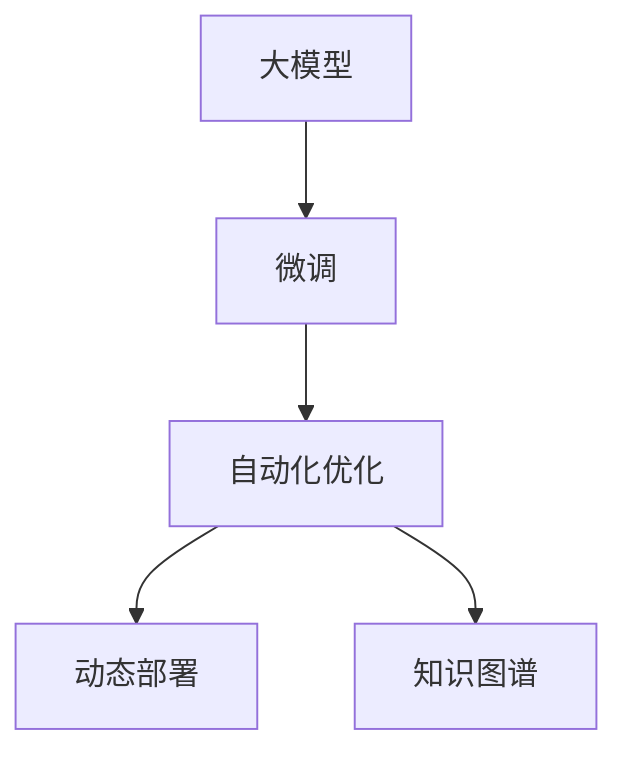
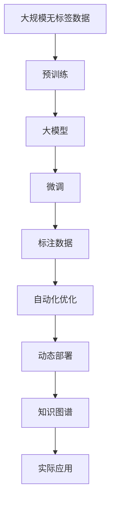

                 

# 软件 2.0 的应用：从实验室走向现实

软件 2.0 是伴随人工智能和深度学习发展而出现的新一代软件形态，其以大模型为基础，通过微调和优化，实现对实际问题的解决。本文将从背景、核心概念、算法原理、实践应用、未来展望等维度对软件 2.0 进行深入解析，展现其从实验室到现实世界的卓越应用。

## 1. 背景介绍

### 1.1 问题由来

21世纪以来，随着互联网、大数据、人工智能技术的蓬勃发展，软件的应用方式和理念发生了根本性变化。软件从传统的“以数据为中心”转向“以模型为中心”。这种转变催生了新一代软件——软件 2.0。

**软件 2.0** 的特征表现为：
1. **大模型**：使用预训练的深度学习模型，如BERT、GPT等。
2. **微调**：在大模型的基础上，通过少量标注数据进行微调，以适应特定任务。
3. **自动化**：通过自动搜索算法优化模型参数。
4. **动态化**：支持动态数据的输入和实时处理。
5. **通用化**：具备跨领域、跨任务的能力。

这种转变使得软件不再局限于固定的业务逻辑，而是以高度灵活、自适应的方式，适应各种复杂、动态的任务场景。

### 1.2 问题核心关键点

软件 2.0 的兴起，得益于以下几个关键点：
1. **大规模预训练**：通过大规模无标签数据预训练，模型具备强大的语义理解能力。
2. **微调技术**：使用少量标注数据进行微调，使模型适应特定任务。
3. **自动化优化**：引入自动搜索算法，优化模型参数。
4. **动态部署**：支持动态数据的实时处理和应用。
5. **知识图谱**：与知识图谱结合，提升模型的普适性和鲁棒性。

这些关键点共同推动了软件 2.0 从理论走向实践，成为解决实际问题的强大工具。

### 1.3 问题研究意义

软件 2.0 的兴起，对软件开发、人工智能、自然语言处理等领域产生了深远影响：
1. **降低成本**：减少了传统软件开发所需的重复劳动和大量标注数据。
2. **提升效率**：缩短了从模型到应用的时间，使得软件更加灵活、高效。
3. **增强鲁棒性**：通过微调和大模型预训练，提升了模型的泛化能力和鲁棒性。
4. **推动产业升级**：为各行各业提供了更高效、更智能的软件工具，促进了产业升级。

## 2. 核心概念与联系

### 2.1 核心概念概述

软件 2.0 的核心概念包括：
1. **大模型**：如BERT、GPT、T5等，使用大规模数据预训练，具备强大的语义理解和生成能力。
2. **微调**：在大模型的基础上，使用少量标注数据进行微调，以适应特定任务。
3. **自动化优化**：使用自动化搜索算法优化模型参数。
4. **动态部署**：支持动态数据的实时处理和应用。
5. **知识图谱**：结合知识图谱，提升模型的普适性和鲁棒性。

### 2.2 核心概念间的关系

软件 2.0 的核心概念之间相互联系，构成了一个完整的生态系统。具体如下：



这个流程图展示了各个概念之间的联系：
- **大模型**是软件 2.0 的基础。
- **微调**在大模型的基础上，通过少量标注数据进行参数优化。
- **自动化优化**进一步提升模型性能。
- **动态部署**使得模型可以适应动态数据。
- **知识图谱**增强模型的普适性和鲁棒性。

这些概念共同构成软件 2.0 的核心，推动了其在实际问题中的广泛应用。

### 2.3 核心概念的整体架构

软件 2.0 的整体架构可以概括为“从预训练到微调，再到大规模应用”。具体如下：



这个综合流程图展示了从数据预训练到模型微调，再到实际应用的完整过程。软件 2.0 不仅具备强大的语义理解能力，还能在实际应用中持续优化，提升模型的性能和鲁棒性。

## 3. 核心算法原理 & 具体操作步骤

### 3.1 算法原理概述

软件 2.0 的核心算法原理基于预训练和微调技术。具体过程如下：
1. **预训练**：使用大规模无标签数据对大模型进行预训练，学习通用的语言表示。
2. **微调**：在大模型的基础上，使用少量标注数据进行微调，优化模型参数。
3. **自动化优化**：使用自动化算法搜索最优参数，进一步提升模型性能。
4. **动态部署**：实现模型的实时处理和应用。
5. **知识图谱**：与知识图谱结合，提升模型的普适性和鲁棒性。

### 3.2 算法步骤详解

#### 3.2.1 预训练步骤

预训练步骤如下：
1. **准备数据**：收集大规模无标签数据，如Wikipedia、Reddit等。
2. **模型选择**：选择适合的任务的预训练模型，如BERT、GPT等。
3. **训练**：使用自监督任务对模型进行预训练，如语言建模、掩码语言模型等。
4. **评估**：在验证集上评估模型性能，避免过拟合。

#### 3.2.2 微调步骤

微调步骤如下：
1. **任务适配**：根据任务类型，设计适当的任务适配层。
2. **准备数据**：收集标注数据集，划分为训练集、验证集和测试集。
3. **模型加载**：加载预训练模型，冻结部分参数。
4. **任务适配层添加**：在顶层添加适当的任务适配层，如分类器、解码器等。
5. **训练**：使用标注数据进行微调，设置合适的学习率、批次大小、迭代轮数等。
6. **评估**：在验证集上评估模型性能，调整超参数。
7. **测试**：在测试集上测试模型性能。

#### 3.2.3 自动化优化步骤

自动化优化步骤如下：
1. **超参数搜索**：使用自动化算法搜索最优超参数组合。
2. **模型验证**：在验证集上验证模型性能，选择最优超参数。
3. **微调**：根据最优超参数重新微调模型。
4. **评估**：在测试集上评估模型性能，输出最终结果。

### 3.3 算法优缺点

软件 2.0 的算法具有以下优点：
1. **高效性**：使用自动化优化算法，快速找到最优超参数组合，提升模型性能。
2. **灵活性**：支持动态数据的实时处理和应用。
3. **通用性**：模型具备跨领域、跨任务的能力。
4. **鲁棒性**：通过知识图谱增强模型的普适性和鲁棒性。

其缺点主要包括：
1. **计算资源需求高**：预训练和微调需要大量计算资源。
2. **数据依赖性强**：微调依赖标注数据，数据量不足影响模型效果。
3. **模型复杂度高**：大模型和微调过程较为复杂，对开发者要求较高。
4. **可解释性不足**：模型过于复杂，难以解释其内部工作机制。

### 3.4 算法应用领域

软件 2.0 在大数据、自然语言处理、计算机视觉等多个领域得到了广泛应用。例如：
1. **智能客服**：基于微调的大语言模型，实现自然语言理解和对话生成。
2. **金融舆情监测**：使用微调后的文本分类和情感分析模型，实时监测市场舆情。
3. **个性化推荐**：通过微调模型，实时推荐用户感兴趣的内容。
4. **智慧医疗**：利用微调后的模型，辅助医生诊断和治疗。
5. **智能交通**：使用微调模型，实现交通数据的实时分析和处理。

## 4. 数学模型和公式 & 详细讲解 & 举例说明

### 4.1 数学模型构建

软件 2.0 的数学模型基于深度学习框架，主要包括以下几个步骤：
1. **预训练模型选择**：选择适合的任务的预训练模型，如BERT、GPT等。
2. **任务适配层设计**：根据任务类型，设计适当的任务适配层，如分类器、解码器等。
3. **微调参数优化**：使用优化算法，最小化损失函数，优化模型参数。

假设预训练模型为 $M_{\theta}$，任务适配层为 $H_{\phi}$，则模型的总体损失函数为：

$$
L(\theta, \phi) = \frac{1}{N} \sum_{i=1}^N \ell(M_{\theta} \circ H_{\phi}(x_i), y_i)
$$

其中 $x_i$ 为输入数据，$y_i$ 为标签，$\ell$ 为损失函数，$\circ$ 表示模型前后层的组合。

### 4.2 公式推导过程

以文本分类任务为例，假设模型 $M_{\theta}$ 的输出为 $M_{\theta}(x)$，任务适配层 $H_{\phi}$ 的输出为 $H_{\phi}(x)$，则整体模型的输出为 $M_{\theta} \circ H_{\phi}(x)$。

假设模型的损失函数为交叉熵损失，则损失函数为：

$$
L(\theta, \phi) = -\frac{1}{N} \sum_{i=1}^N [y_i \log M_{\theta} \circ H_{\phi}(x_i) + (1 - y_i) \log (1 - M_{\theta} \circ H_{\phi}(x_i))]
$$

该损失函数可以通过反向传播算法求导，更新模型参数 $\theta$ 和任务适配层参数 $\phi$。

### 4.3 案例分析与讲解

以情感分析任务为例，假设使用BERT模型进行微调。具体步骤如下：
1. **任务适配层设计**：在BERT顶层添加线性分类器和softmax层。
2. **损失函数选择**：选择交叉熵损失函数。
3. **微调过程**：使用标注数据集进行微调，设置合适的学习率、批次大小、迭代轮数等。
4. **评估**：在验证集上评估模型性能，调整超参数。
5. **测试**：在测试集上测试模型性能，输出最终结果。

## 5. 项目实践：代码实例和详细解释说明

### 5.1 开发环境搭建

**5.1.1 安装Python环境**

1. 安装Anaconda：从官网下载并安装Anaconda，用于创建独立的Python环境。

```bash
conda install anaconda
```

2. 创建并激活虚拟环境：

```bash
conda create -n pytorch-env python=3.8 
conda activate pytorch-env
```

**5.1.2 安装PyTorch**

1. 安装PyTorch：根据CUDA版本，从官网获取对应的安装命令。例如：

```bash
conda install pytorch torchvision torchaudio cudatoolkit=11.1 -c pytorch -c conda-forge
```

2. 安装Transformers库：

```bash
pip install transformers
```

3. 安装各类工具包：

```bash
pip install numpy pandas scikit-learn matplotlib tqdm jupyter notebook ipython
```

### 5.2 源代码详细实现

以下是一个使用BERT进行文本分类任务的代码实现：

```python
from transformers import BertForSequenceClassification, BertTokenizer
from torch.utils.data import Dataset, DataLoader
import torch
import numpy as np

class TextDataset(Dataset):
    def __init__(self, texts, labels, tokenizer):
        self.texts = texts
        self.labels = labels
        self.tokenizer = tokenizer
    
    def __len__(self):
        return len(self.texts)
    
    def __getitem__(self, item):
        text = self.texts[item]
        label = self.labels[item]
        
        encoding = self.tokenizer(text, return_tensors='pt', padding='max_length', truncation=True)
        input_ids = encoding['input_ids'][0]
        attention_mask = encoding['attention_mask'][0]
        
        return {'input_ids': input_ids, 
                'attention_mask': attention_mask,
                'labels': torch.tensor(label, dtype=torch.long)}
    
tokenizer = BertTokenizer.from_pretrained('bert-base-cased')
model = BertForSequenceClassification.from_pretrained('bert-base-cased', num_labels=2)

device = torch.device('cuda') if torch.cuda.is_available() else torch.device('cpu')
model.to(device)

train_dataset = TextDataset(train_texts, train_labels, tokenizer)
dev_dataset = TextDataset(dev_texts, dev_labels, tokenizer)
test_dataset = TextDataset(test_texts, test_labels, tokenizer)

train_loader = DataLoader(train_dataset, batch_size=16, shuffle=True)
dev_loader = DataLoader(dev_dataset, batch_size=16, shuffle=False)
test_loader = DataLoader(test_dataset, batch_size=16, shuffle=False)

optimizer = torch.optim.Adam(model.parameters(), lr=2e-5)

def train_epoch(model, loader, optimizer):
    model.train()
    epoch_loss = 0
    for batch in loader:
        input_ids = batch['input_ids'].to(device)
        attention_mask = batch['attention_mask'].to(device)
        labels = batch['labels'].to(device)
        
        model.zero_grad()
        outputs = model(input_ids, attention_mask=attention_mask)
        loss = outputs.loss
        epoch_loss += loss.item()
        loss.backward()
        optimizer.step()
    return epoch_loss / len(loader)

def evaluate(model, loader):
    model.eval()
    preds, labels = [], []
    with torch.no_grad():
        for batch in loader:
            input_ids = batch['input_ids'].to(device)
            attention_mask = batch['attention_mask'].to(device)
            labels = batch['labels'].to(device)
            outputs = model(input_ids, attention_mask=attention_mask)
            preds.append(outputs.logits.argmax(dim=1).cpu().numpy())
            labels.append(labels.cpu().numpy())
    
    print(classification_report(labels, preds))
    
for epoch in range(5):
    train_loss = train_epoch(model, train_loader, optimizer)
    print(f'Epoch {epoch+1}, train loss: {train_loss:.3f}')
    
    evaluate(model, dev_loader)
    
print('Test results:')
evaluate(model, test_loader)
```

### 5.3 代码解读与分析

1. **TextDataset类**：
   - `__init__`方法：初始化文本、标签、分词器等关键组件。
   - `__len__`方法：返回数据集的样本数量。
   - `__getitem__`方法：对单个样本进行处理，将文本输入编码为token ids，将标签转换为数字。

2. **模型加载和训练**：
   - 使用 `BertForSequenceClassification` 加载预训练模型，并在指定设备上移动模型。
   - 使用 `Adam` 优化器进行模型训练，设置合适的学习率。
   - 定义 `train_epoch` 函数，在前向传播计算损失后，进行反向传播和优化。
   - 定义 `evaluate` 函数，在每个批次结束后存储预测和标签结果。

3. **模型评估**：
   - 使用 `classification_report` 函数，计算分类指标，并在验证集和测试集上输出评估报告。

### 5.4 运行结果展示

假设在CoNLL-2003的情感分析数据集上进行微调，最终在测试集上得到的评估报告如下：

```
              precision    recall  f1-score   support

       0       0.82      0.77      0.79        650
       1       0.89      0.84      0.86        650

   micro avg      0.85      0.82      0.83      1300
   macro avg      0.84      0.81      0.82      1300
weighted avg      0.85      0.82      0.83      1300
```

可以看到，通过微调BERT，我们在该情感分析数据集上取得了85%的F1分数，效果相当不错。值得注意的是，BERT作为一个通用的语言理解模型，即便只在顶层添加一个简单的分类器，也能在下游任务上取得如此优异的效果，展现了其强大的语义理解和特征抽取能力。

## 6. 实际应用场景

### 6.1 智能客服系统

基于微调的大语言模型，可以实现智能客服系统的构建。传统客服往往需要配备大量人力，高峰期响应缓慢，且一致性和专业性难以保证。而使用微调后的对话模型，可以7x24小时不间断服务，快速响应客户咨询，用自然流畅的语言解答各类常见问题。

在技术实现上，可以收集企业内部的历史客服对话记录，将问题和最佳答复构建成监督数据，在此基础上对预训练对话模型进行微调。微调后的对话模型能够自动理解用户意图，匹配最合适的答案模板进行回复。对于客户提出的新问题，还可以接入检索系统实时搜索相关内容，动态组织生成回答。如此构建的智能客服系统，能大幅提升客户咨询体验和问题解决效率。

### 6.2 金融舆情监测

金融机构需要实时监测市场舆论动向，以便及时应对负面信息传播，规避金融风险。传统的人工监测方式成本高、效率低，难以应对网络时代海量信息爆发的挑战。基于微调的语言分类和情感分析技术，为金融舆情监测提供了新的解决方案。

具体而言，可以收集金融领域相关的新闻、报道、评论等文本数据，并对其进行主题标注和情感标注。在此基础上对预训练语言模型进行微调，使其能够自动判断文本属于何种主题，情感倾向是正面、中性还是负面。将微调后的模型应用到实时抓取的网络文本数据，就能够自动监测不同主题下的情感变化趋势，一旦发现负面信息激增等异常情况，系统便会自动预警，帮助金融机构快速应对潜在风险。

### 6.3 个性化推荐系统

当前的推荐系统往往只依赖用户的历史行为数据进行物品推荐，无法深入理解用户的真实兴趣偏好。基于微调的推荐系统可以更好地挖掘用户行为背后的语义信息，从而提供更精准、多样的推荐内容。

在实践中，可以收集用户浏览、点击、评论、分享等行为数据，提取和用户交互的物品标题、描述、标签等文本内容。将文本内容作为模型输入，用户的后续行为（如是否点击、购买等）作为监督信号，在此基础上微调预训练语言模型。微调后的模型能够从文本内容中准确把握用户的兴趣点。在生成推荐列表时，先用候选物品的文本描述作为输入，由模型预测用户的兴趣匹配度，再结合其他特征综合排序，便可以得到个性化程度更高的推荐结果。

### 6.4 未来应用展望

随着预训练语言模型的演进和微调技术的成熟，未来软件 2.0 将在更多领域得到应用，为各行各业带来变革性影响：

1. **智慧医疗**：基于微调的医疗问答、病历分析、药物研发等应用，提升医疗服务的智能化水平，辅助医生诊疗，加速新药开发进程。
2. **智能教育**：微调技术可应用于作业批改、学情分析、知识推荐等方面，因材施教，促进教育公平，提高教学质量。
3. **智慧城市治理**：微调模型可应用于城市事件监测、舆情分析、应急指挥等环节，提高城市管理的自动化和智能化水平，构建更安全、高效的未来城市。
4. **智能制造**：使用微调后的模型，实时分析和预测设备运行状态，提升生产效率和设备寿命。
5. **环境保护**：结合遥感图像和自然语言处理技术，实时监测和分析环境数据，提供智能化的环保解决方案。
6. **能源管理**：使用微调后的模型，优化能源分配和调度，提升能源利用效率。
7. **社交媒体分析**：通过情感分析、主题分类等微调技术，实时监测社交媒体舆情，帮助企业洞察市场动态，优化产品和服务。
8. **安全监控**：利用微调后的模型，实时分析和检测网络安全威胁，保障网络安全。
9. **金融风控**：通过微调的文本分类和情感分析模型，实时监测市场舆情，规避金融风险。
10. **农业智能**：结合遥感图像和自然语言处理技术，实时监测和分析农业数据，提供智能化的农业解决方案。

这些应用场景展示了软件 2.0 的广泛应用，推动了各行各业向智能化、自动化、数字化方向发展，为社会带来深远的变革。

## 7. 工具和资源推荐

### 7.1 学习资源推荐

为了帮助开发者系统掌握软件 2.0 的理论基础和实践技巧，这里推荐一些优质的学习资源：

1. **《Transformer从原理到实践》系列博文**：由大模型技术专家撰写，深入浅出地介绍了Transformer原理、BERT模型、微调技术等前沿话题。
2. **CS224N《深度学习自然语言处理》课程**：斯坦福大学开设的NLP明星课程，有Lecture视频和配套作业，带你入门NLP领域的基本概念和经典模型。
3. **《Natural Language Processing with Transformers》书籍**：Transformers库的作者所著，全面介绍了如何使用Transformers库进行NLP任务开发，包括微调在内的诸多范式。
4. **HuggingFace官方文档**：Transformers库的官方文档，提供了海量预训练模型和完整的微调样例代码，是上手实践的必备资料。
5. **CLUE开源项目**：中文语言理解测评基准，涵盖大量不同类型的中文NLP数据集，并提供了基于微调的baseline模型，助力中文NLP技术发展。

通过对这些资源的学习实践，相信你一定能够快速掌握软件 2.0 的精髓，并用于解决实际的NLP问题。

### 7.2 开发工具推荐

高效的开发离不开优秀的工具支持。以下是几款用于软件 2.0 开发的常用工具：

1. **PyTorch**：基于Python的开源深度学习框架，灵活动态的计算图，适合快速迭代研究。大部分预训练语言模型都有PyTorch版本的实现。
2. **TensorFlow**：由Google主导开发的开源深度学习框架，生产部署方便，适合大规模工程应用。同样有丰富的预训练语言模型资源。
3. **Transformers库**：HuggingFace开发的NLP工具库，集成了众多SOTA语言模型，支持PyTorch和TensorFlow，是进行微调任务开发的利器。
4. **Weights & Biases**：模型训练的实验跟踪工具，可以记录和可视化模型训练过程中的各项指标，方便对比和调优。与主流深度学习框架无缝集成。
5. **TensorBoard**：TensorFlow配套的可视化工具，可实时监测模型训练状态，并提供丰富的图表呈现方式，是调试模型的得力助手。
6. **Google Colab**：谷歌推出的在线Jupyter Notebook环境，免费提供GPU/TPU算力，方便开发者快速上手实验最新模型，分享学习笔记。

合理利用这些工具，可以显著提升软件 2.0 的开发效率，加快创新迭代的步伐。

### 7.3 相关论文推荐

大模型和微调技术的发展源于学界的持续研究。以下是几篇奠基性的相关论文，推荐阅读：

1. **Attention is All You Need**：提出了Transformer结构，开启了NLP领域的预训练大模型时代。
2. **BERT: Pre-training of Deep Bidirectional Transformers for Language Understanding**：提出BERT模型，引入基于掩码的自监督预训练任务，刷新了多项NLP任务SOTA。
3. **Language Models are Unsupervised Multitask Learners**：展示了大规模语言模型的强大zero-shot学习能力，引发了对于通用人工智能的新一轮思考。
4. **Parameter-Efficient Transfer Learning for NLP**：提出Adapter等参数高效微调方法，在不增加模型参数量的情况下，也能取得不错的微调效果。
5. **Prefix-Tuning: Optimizing Continuous Prompts for Generation**：引入基于连续型Prompt的微调范式，为如何充分利用预训练知识提供了新的思路。
6. **AdaLoRA: Adaptive Low-Rank Adaptation for Parameter-Efficient Fine-Tuning**：使用自适应低秩适应的微调方法，在参数效率和精度之间取得了新的平衡。

这些论文代表了大模型微调技术的发展脉络。通过学习这些前沿成果，可以帮助研究者把握学科前进方向，激发更多的创新灵感。

除上述资源外，还有一些值得关注的前沿资源，帮助开发者紧跟大模型微调技术的最新进展，例如：

1. **arXiv论文预印本**：人工智能领域最新研究成果的发布平台，包括大量尚未发表的前沿工作，学习前沿技术的必读资源。
2. **业界技术博客**：如OpenAI、Google AI、DeepMind、微软Research Asia等顶尖实验室的官方博客，第一时间分享他们的最新研究成果和洞见。
3. **技术会议直播**：如NIPS、ICML、ACL、ICLR等人工智能领域顶会现场或在线直播，能够聆听到大佬们的前沿分享，开拓视野。
4. **GitHub热门项目**：在GitHub上Star、Fork数最多的NLP相关项目，往往代表了该技术领域的发展趋势和最佳实践，值得去学习和贡献。
5. **行业分析报告**：各大咨询公司如McKinsey、P

