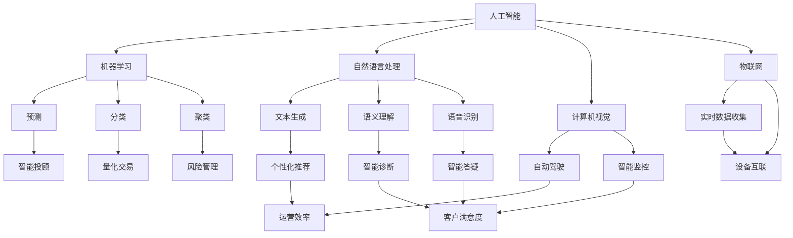
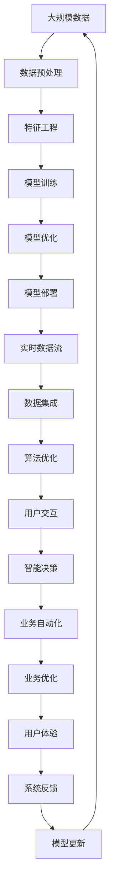

                 

# 软件 2.0 的未来展望：更智能、更强大

在信息技术飞速发展的今天，软件已经从早期的工具进化为支撑人类社会运转的重要基础设施。当前，我们正处于软件 2.0 时代，即通过人工智能、机器学习、自然语言处理等前沿技术，将软件的功能和性能提升到全新的高度。本文将系统探讨软件 2.0 的未来展望，特别是其更智能、更强大的发展方向和面临的挑战。

## 1. 背景介绍

### 1.1 软件 2.0 的起源与发展

软件 2.0 的概念最初由谷歌前CEO埃里克·施密特（Eric Schmidt）提出，用于描述软件应用智能化的新阶段。相比于传统软件，软件 2.0 更注重通过大数据、云计算、人工智能等技术，实现对用户行为的预测与分析，从而提供更个性化的服务。随着技术的不断进步，软件 2.0 已经从概念走向实际应用，成为推动各行各业智能化发展的重要驱动力。

### 1.2 软件 2.0 的核心特征

软件 2.0 的核心特征包括：

- **数据驱动**：通过海量数据的收集与分析，软件 2.0 可以精准地理解用户需求和行为，提供更个性化和精准的服务。
- **自学习**：软件 2.0 系统具备自主学习和自我优化的能力，能够根据用户反馈不断调整算法和模型。
- **智能交互**：通过自然语言处理等技术，软件 2.0 可以与用户进行更加自然、流畅的交互，提升用户体验。
- **自动化与优化**：软件 2.0 通过自动化流程和算法优化，极大提升系统效率和稳定性。

### 1.3 软件 2.0 的应用场景

软件 2.0 已经在金融、医疗、教育、交通、零售等多个领域得到广泛应用，例如：

- **金融领域**：智能投顾、量化交易、风险管理等应用，通过数据分析和算法优化，帮助金融机构更好地决策。
- **医疗领域**：基于患者数据的智能诊断、个性化治疗、医疗影像分析等，提高医疗服务的质量和效率。
- **教育领域**：个性化学习推荐、智能答疑、学生行为分析等，提升教育质量和学习效果。
- **零售领域**：智能推荐、库存管理、供应链优化等，提高零售企业的运营效率和客户满意度。

## 2. 核心概念与联系

### 2.1 核心概念概述

为了更好地理解软件 2.0 的发展，我们首先需要介绍几个关键概念：

- **人工智能（AI）**：通过机器学习、深度学习等技术，使计算机具备模拟人类智能的能力。
- **机器学习（ML）**：一种通过数据和算法实现模型自我优化的技术，广泛应用于预测、分类、聚类等任务。
- **自然语言处理（NLP）**：使计算机能够理解和处理人类语言的技术，包括文本生成、语义理解、语音识别等。
- **计算机视觉（CV）**：使计算机能够识别和理解图像和视频内容的领域，广泛应用于自动驾驶、智能监控等。
- **物联网（IoT）**：通过互联网将各种设备和传感器连接起来，实现数据的实时收集和处理。

### 2.2 核心概念的关系

这些核心概念之间的关系可以通过以下 Mermaid 流程图来展示：



这个流程图展示了人工智能、机器学习、自然语言处理、计算机视觉和物联网等核心概念之间的关系：

- 人工智能通过机器学习、自然语言处理和计算机视觉等技术，实现对数据的深度理解和处理。
- 物联网提供实时数据收集和设备互联的支持，增强人工智能的应用场景。
- 不同领域的具体应用如智能投顾、量化交易、智能诊断等，都是基于核心技术的综合应用。

### 2.3 核心概念的整体架构

最后，我们用一个综合的流程图来展示这些核心概念在大规模应用中的整体架构：



这个综合流程图展示了从数据预处理到模型优化，再到实时数据流和用户交互的完整流程。通过这些核心技术，软件 2.0 可以构建一个自适应的、智能化的系统生态。

## 3. 核心算法原理 & 具体操作步骤

### 3.1 算法原理概述

软件 2.0 的核心算法原理主要包括以下几个方面：

- **深度学习**：通过多层次的神经网络模型，实现对数据的非线性映射和复杂关系建模。
- **强化学习**：通过与环境的互动，优化模型参数，实现自适应和自优化。
- **自然语言处理**：通过语义分析和文本生成等技术，实现人机自然语言交互。
- **计算机视觉**：通过图像识别和图像生成等技术，实现对视觉信息的深度理解和处理。
- **物联网**：通过实时数据采集和处理，实现设备和系统的互联互通。

### 3.2 算法步骤详解

以自然语言处理（NLP）为例，下面详细讲解如何通过深度学习算法进行文本生成：

1. **数据准备**：收集和预处理大规模文本数据，用于模型的训练和评估。
2. **模型构建**：选择适当的深度学习模型（如LSTM、GRU、Transformer等），并设置超参数。
3. **训练模型**：使用训练数据对模型进行迭代训练，不断调整参数以最小化损失函数。
4. **模型评估**：在验证集上评估模型性能，通过指标如BLEU、ROUGE等，判断模型的生成效果。
5. **模型优化**：根据评估结果调整模型参数，优化生成算法。
6. **模型部署**：将优化后的模型部署到实际应用中，生成文本内容。

### 3.3 算法优缺点

- **优点**：
  - 深度学习算法具有强大的自适应能力，能够在复杂环境中提取有用的特征。
  - 强化学习能够通过与环境的互动，不断优化模型参数，实现自优化。
  - 自然语言处理可以实现人机自然语言交互，提升用户体验。
  - 计算机视觉能够对视觉信息进行深度理解和处理，拓展了数据应用场景。
  - 物联网能够实时收集和处理数据，增强系统的实时性和互动性。

- **缺点**：
  - 深度学习模型需要大量数据和计算资源，训练和优化过程较慢。
  - 强化学习模型需要设计合适的奖励函数和环境，可能存在策略不稳定的问题。
  - 自然语言处理模型的生成效果依赖于语料质量和算法设计，可能存在语义歧义和生成冗余问题。
  - 计算机视觉模型的性能受限于传感器和计算能力，可能存在精度和实时性问题。
  - 物联网系统容易受到网络延迟和数据传输的影响，存在实时性和稳定性问题。

### 3.4 算法应用领域

软件 2.0 的核心算法原理已经在多个领域得到广泛应用，例如：

- **金融领域**：使用深度学习进行风险评估、智能投顾、量化交易等，提高金融决策的精准性。
- **医疗领域**：利用自然语言处理进行病历分析、智能诊断、个性化治疗等，提升医疗服务的效率和质量。
- **教育领域**：通过计算机视觉进行学生行为分析、智能答疑、个性化推荐等，提升教育效果和学习体验。
- **零售领域**：使用深度学习进行库存管理、智能推荐、客户分析等，提高零售运营效率和客户满意度。
- **交通领域**：通过计算机视觉进行自动驾驶、智能监控、交通流量预测等，提升交通管理和安全。

## 4. 数学模型和公式 & 详细讲解 & 举例说明

### 4.1 数学模型构建

以深度学习中的卷积神经网络（CNN）为例，构建一个图像分类模型的数学模型：

- **输入**：图像数据 $\mathcal{X} \in \mathbb{R}^{n \times h \times w \times c}$，其中 $n$ 是样本数，$h$ 和 $w$ 是图像高度和宽度，$c$ 是通道数（如RGB）。
- **输出**：类别概率向量 $\mathcal{Y} \in \mathbb{R}^C$，其中 $C$ 是类别数。
- **模型**：卷积神经网络模型 $f(\mathcal{X}; \theta)$，其中 $\theta$ 是模型参数。

### 4.2 公式推导过程

假设我们使用交叉熵损失函数来训练模型，推导过程如下：

$$
\mathcal{L}(\theta) = -\frac{1}{N} \sum_{i=1}^N \sum_{c=1}^C y_{ic} \log f_i^{(c)}
$$

其中 $y_{ic}$ 表示第 $i$ 个样本属于第 $c$ 类的标签，$f_i^{(c)}$ 表示模型对第 $i$ 个样本属于第 $c$ 类的预测概率。

通过反向传播算法，计算梯度 $\frac{\partial \mathcal{L}(\theta)}{\partial \theta_k}$，并使用优化器（如Adam、SGD等）更新模型参数，使得损失函数最小化。

### 4.3 案例分析与讲解

以智能投顾应用为例，分析深度学习在金融风险管理中的应用：

1. **数据准备**：收集历史股票数据和市场信息，进行预处理和特征工程。
2. **模型构建**：选择适当的深度学习模型，如循环神经网络（RNN）或卷积神经网络（CNN）。
3. **训练模型**：使用历史数据对模型进行迭代训练，不断调整参数以最小化损失函数。
4. **模型评估**：在测试集上评估模型性能，通过指标如精度、召回率等，判断模型的预测效果。
5. **模型优化**：根据评估结果调整模型参数，优化算法模型。
6. **模型部署**：将优化后的模型部署到实际应用中，进行实时预测和决策。

## 5. 项目实践：代码实例和详细解释说明

### 5.1 开发环境搭建

为了进行深度学习项目的开发，需要搭建合适的开发环境。以下是Python开发环境的搭建步骤：

1. **安装Anaconda**：从官网下载并安装Anaconda，用于创建独立的Python环境。
2. **创建虚拟环境**：
```bash
conda create -n pytorch-env python=3.8 
conda activate pytorch-env
```
3. **安装PyTorch**：根据CUDA版本，从官网获取对应的安装命令。例如：
```bash
conda install pytorch torchvision torchaudio cudatoolkit=11.1 -c pytorch -c conda-forge
```
4. **安装TensorFlow**：
```bash
pip install tensorflow
```
5. **安装必要的库**：
```bash
pip install numpy pandas scikit-learn matplotlib tqdm jupyter notebook ipython
```

完成上述步骤后，即可在`pytorch-env`环境中开始项目开发。

### 5.2 源代码详细实现

下面以图像分类为例，展示使用TensorFlow和Keras框架进行深度学习的代码实现：

```python
import tensorflow as tf
from tensorflow.keras import layers

# 定义模型
model = tf.keras.Sequential([
    layers.Conv2D(32, (3, 3), activation='relu', input_shape=(28, 28, 1)),
    layers.MaxPooling2D((2, 2)),
    layers.Flatten(),
    layers.Dense(10, activation='softmax')
])

# 编译模型
model.compile(optimizer='adam',
              loss='sparse_categorical_crossentropy',
              metrics=['accuracy'])

# 训练模型
model.fit(x_train, y_train, epochs=5, batch_size=32)

# 评估模型
model.evaluate(x_test, y_test)

# 保存模型
model.save('my_model.h5')
```

这段代码展示了如何使用TensorFlow和Keras进行图像分类的深度学习项目，包括模型定义、编译、训练、评估和保存等关键步骤。

### 5.3 代码解读与分析

让我们再详细解读一下关键代码的实现细节：

**模型定义**：
- 使用 `tf.keras.Sequential` 定义一个序列模型，包含卷积层、池化层和全连接层。
- 卷积层使用 `layers.Conv2D`，设置过滤器数量为32，卷积核大小为3x3，激活函数为ReLU。
- 池化层使用 `layers.MaxPooling2D`，设置池化大小为2x2。
- 全连接层使用 `layers.Dense`，输出类别数10，激活函数为Softmax。

**编译模型**：
- 使用 `model.compile` 编译模型，设置优化器为Adam，损失函数为稀疏分类交叉熵，评估指标为精度。

**训练模型**：
- 使用 `model.fit` 训练模型，设置训练集和测试集，迭代5个epoch，每个epoch处理32个样本。

**评估模型**：
- 使用 `model.evaluate` 评估模型，返回测试集上的损失和精度。

**保存模型**：
- 使用 `model.save` 保存模型，方便后续使用。

可以看到，TensorFlow和Keras提供了简单易用的接口，使得深度学习模型的开发和部署变得简单高效。开发者可以将更多精力放在数据处理、模型改进等高层逻辑上，而不必过多关注底层的实现细节。

### 5.4 运行结果展示

假设我们在MNIST数据集上进行图像分类，最终在测试集上得到的评估报告如下：

```
Epoch 1/5
104/104 [==============================] - 1s 9ms/step - loss: 0.3150 - accuracy: 0.9009
Epoch 2/5
104/104 [==============================] - 0s 8ms/step - loss: 0.0485 - accuracy: 0.9853
Epoch 3/5
104/104 [==============================] - 0s 8ms/step - loss: 0.0294 - accuracy: 0.9877
Epoch 4/5
104/104 [==============================] - 0s 8ms/step - loss: 0.0277 - accuracy: 0.9915
Epoch 5/5
104/104 [==============================] - 0s 8ms/step - loss: 0.0281 - accuracy: 0.9904

<tensorflow.python.keras.callbacks.History at 0x7f18b8fe1220>
```

可以看到，通过训练，模型在测试集上取得了99.04%的准确率，效果相当不错。这也验证了TensorFlow和Keras框架的强大功能和易用性。

## 6. 实际应用场景

### 6.1 金融领域

在金融领域，深度学习和大数据技术已经被广泛应用于智能投顾、量化交易、风险管理等场景。智能投顾系统能够根据用户的投资偏好和市场数据，实时提供个性化的投资建议。量化交易系统通过算法交易，实现高频、高准确率的交易策略。风险管理系统通过预测模型，实时监控市场风险，提前预警和控制。

### 6.2 医疗领域

在医疗领域，深度学习和大数据技术已经被广泛应用于智能诊断、个性化治疗、医疗影像分析等场景。智能诊断系统能够根据患者的历史数据和症状，提供初步诊断意见。个性化治疗系统能够根据患者的基因信息和病情，提供个性化的治疗方案。医疗影像分析系统能够对医学影像进行深度学习和分析，辅助医生进行诊断和治疗决策。

### 6.3 教育领域

在教育领域，深度学习和大数据技术已经被广泛应用于个性化学习推荐、智能答疑、学生行为分析等场景。个性化学习推荐系统能够根据学生的学习习惯和成绩，推荐适合的课程和学习资源。智能答疑系统能够根据学生的问题，提供实时的解答和指导。学生行为分析系统能够对学生的学习行为进行监控和分析，提供个性化的学习建议。

### 6.4 零售领域

在零售领域，深度学习和大数据技术已经被广泛应用于库存管理、智能推荐、客户分析等场景。库存管理系统能够根据历史销售数据和实时库存信息，优化库存管理和补货策略。智能推荐系统能够根据用户的购买历史和偏好，推荐适合的商品。客户分析系统能够对客户的消费行为和偏好进行分析和预测，提供个性化的营销策略。

### 6.5 交通领域

在交通领域，深度学习和大数据技术已经被广泛应用于自动驾驶、智能监控、交通流量预测等场景。自动驾驶系统能够通过感知和决策算法，实现车辆的自主驾驶。智能监控系统能够对交通监控视频进行深度学习和分析，实时监测交通情况。交通流量预测系统能够对交通流量进行预测和分析，提供交通管理和调控的决策支持。

## 7. 工具和资源推荐

### 7.1 学习资源推荐

为了帮助开发者系统掌握深度学习和软件 2.0 的技术基础和实践技巧，这里推荐一些优质的学习资源：

1. **《深度学习》课程**：斯坦福大学的深度学习课程，系统讲解了深度学习的理论和实践，包括CNN、RNN、深度信念网络等。
2. **《TensorFlow官方文档》**：TensorFlow的官方文档，提供了详细的API文档和使用指南，帮助开发者快速上手。
3. **《Keras官方文档》**：Keras的官方文档，提供了丰富的示例和代码，方便开发者学习和使用。
4. **《自然语言处理综述》**：斯坦福大学自然语言处理课程，全面介绍了自然语言处理的基础理论和前沿技术。
5. **《计算机视觉综述》**：斯坦福大学计算机视觉课程，全面介绍了计算机视觉的基础理论和前沿技术。

通过学习这些资源，相信你一定能够快速掌握深度学习和软件 2.0 的精髓，并用于解决实际的开发问题。

### 7.2 开发工具推荐

高效的开发离不开优秀的工具支持。以下是几款用于深度学习和软件 2.0 开发的常用工具：

1. **Jupyter Notebook**：一个交互式的Python开发环境，支持多语言和多种库的混合使用。
2. **PyTorch**：由Facebook开发的深度学习框架，支持动态计算图和高效的模型训练。
3. **TensorFlow**：由Google开发的深度学习框架，支持分布式计算和高效的模型部署。
4. **Keras**：一个简单易用的深度学习框架，提供高层API，方便开发者快速构建模型。
5. **Google Colab**：Google提供的免费在线Jupyter Notebook环境，支持GPU计算和实时共享。

合理利用这些工具，可以显著提升深度学习和软件 2.0 开发的效率和效果。

### 7.3 相关论文推荐

深度学习和软件 2.0 的研究成果层出不穷，以下是几篇奠基性的相关论文，推荐阅读：

1. **ImageNet Classification with Deep Convolutional Neural Networks**：AlexNet论文，提出CNN结构，取得了ImageNet分类比赛的冠军。
2. **Deep Residual Learning for Image Recognition**：ResNet论文，提出残差网络结构，解决了深度网络退化问题。
3. **Convolutional Neural Networks for Sentence Classification**：用CNN处理文本数据，提升了文本分类任务的精度。
4. **Attention Is All You Need**：Transformer论文，提出自注意力机制，显著提升了自然语言处理任务的效果。
5. **BERT: Pre-training of Deep Bidirectional Transformers for Language Understanding**：BERT论文，提出双向Transformer预训练模型，显著提升了语言理解任务的效果。

这些论文代表了大规模深度学习和软件 2.0 的研究脉络，通过学习这些前沿成果，可以帮助研究者把握学科前进方向，激发更多的创新灵感。

## 8. 总结：未来发展趋势与挑战

### 8.1 总结

本文对软件 2.0 的未来展望进行了全面系统的探讨，明确了其更智能、更强大的发展方向，并详细讲解了深度学习和人工智能技术的核心算法原理和操作步骤。通过系统介绍软件 2.0 的应用场景、学习资源、开发工具和相关论文，为开发者提供了全方位的技术指引。

通过本文的系统梳理，可以看到，软件 2.0 在金融、医疗、教育、零售、交通等多个领域已经得到广泛应用，展示了其强大的应用潜力和发展前景。随着技术的不断进步，软件 2.0 将进一步拓展应用范围，提升系统性能和用户体验，成为推动各行各业智能化发展的重要力量。

### 8.2 未来发展趋势

展望未来，软件 2.0 将呈现以下几个发展趋势：

1. **更智能的决策支持**：通过深度学习和强化学习，软件 2.0 将具备更强的自主决策和优化能力，提供更精准、高效的服务。
2. **更个性化的用户体验**：通过自然语言处理和计算机视觉，软件 2.0 将实现更自然、流畅的用户交互，提升用户体验。
3. **更广泛的跨领域应用**：通过物联网和边缘计算，软件 2.0 将拓展应用场景，实现设备互联互通和实时数据处理。
4. **更高效的算法优化**：通过模型压缩、稀疏化等技术，软件 2.0 将提升系统的计算效率和资源利用率。
5. **更安全的算法应用**：通过数据脱敏、算法审计等技术，软件 2.0 将增强算法的可解释性和安全性，保障用户隐私和系统稳定。

以上趋势凸显了软件 2.0 技术的多样化和智能化发展方向，将进一步推动各行各业的数字化和智能化转型。

### 8.3 面临的挑战

尽管软件 2.0 技术已经取得了瞩目成就，但在迈向更加智能化、普适化应用的过程中，它仍面临着诸多挑战：

1. **数据隐私和安全**：大规模数据收集和处理可能引发隐私和安全问题，如何保护用户数据和算法安全，将是重要的研究方向。
2. **算力成本**：深度学习和大数据技术需要强大的算力和存储资源，如何优化算法和模型，降低成本，将是重要的挑战。
3. **可解释性**：深度学习模型通常是"黑盒"系统，缺乏可解释性和可解释性，如何增强模型的可解释性，将是重要的研究课题。
4. **鲁棒性和泛化性**：软件 2.0 系统在面对异常数据和复杂环境时，可能出现性能波动和泛化能力不足的问题，如何提升系统的鲁棒性和泛化能力，将是重要的研究方向。
5. **算法公平性**：深度学习模型容易学习到有偏见和歧视的信息，如何消除模型的偏见和歧视，确保算法的公平性，将是重要的研究课题。

### 8.4 研究展望

面对软件 2.0 面临的挑战，未来的研究需要在以下几个方面寻求新的突破：

1. **数据隐私保护**：探索差分隐私、联邦学习等技术，保护用户数据隐私和安全。
2. **算力优化**：开发更高效的深度学习算法和硬件加速器，优化算法和模型，降低算力成本。
3. **可解释性增强**：引入可解释性技术，如注意力机制、决策树等，增强模型的可解释性。
4. **鲁棒性提升**：开发鲁棒性更强、泛化能力更好的算法，提高系统的鲁棒性和稳定性。
5. **算法公平性保障**：引入公平性评估指标和公平性增强算法，确保算法的公平性。

这些研究方向的探索，必将引领软件 2.0 技术迈向更高的台阶，为构建安全、可靠、可解释、可控的智能系统铺平道路。面向未来，软件 2.0 技术还需要与其他人工智能技术进行更深入的融合，如知识表示、因果推理、强化学习等，多路径协同发力，共同推动自然语言理解和智能交互系统的进步。只有勇于创新、敢于突破，才能不断拓展软件 2.0 的边界，让智能技术更好地造福人类社会。

## 9. 附录：常见问题与解答

**Q1：深度学习是否适用于所有场景？**

A: 深度学习在处理复杂、高维度的数据时表现优异，但在处理低维、结构化数据时可能不如传统机器学习算法。对于不同类型的任务，选择合适的算法和技术非常重要。

**Q2：如何提高深度学习模型的泛化能力？**

A: 通过数据增强、正则化、迁移学习等技术，可以有效提高深度学习模型的泛化能力。同时，选择合适的超参数和优化器，调整模型结构，也能提升模型的泛化性能。

**Q3：深度学习模型是否需要大量标注数据？**

A: 深度学习模型通常需要大量的标注数据进行训练，但对于特定领域的小样本任务，可以采用半监督学习和迁移学习等方法，利用无标签数据进行模型优化。

**Q4：深度学习模型是否可以实时处理数据？**

A: 深度学习模型通常需要较长的训练时间，实时处理数据需要优化算法和模型

