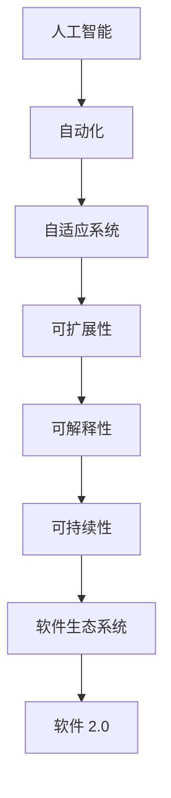

                 

# 软件 2.0 的未来愿景：创造更美好的世界

> 关键词：软件 2.0, 人工智能, 自动化, 创新, 效率, 可持续, 教育, 社会影响

## 1. 背景介绍

### 1.1 问题由来
在21世纪的第三个十年里，我们见证了人工智能(AI)和软件开发的深刻变革，这些变化正推动人类社会迈向一个全新的数字化时代。这个时代的标志是软件的智能化、自动化和个性化。这一变革的驱动力源自于软件 2.0 的兴起，它代表着从传统的编码-部署模式到智能软件生态系统的根本转变。

软件 2.0 是指那些能够自我演化、自我调整并自动优化其功能的智能软件。与软件 1.0 不同的是，软件 2.0 更加关注结果而非过程，以数据和算法为核心，通过持续学习和自我优化实现自动化的决策和执行。这一愿景不仅仅局限于科技领域，它还涵盖了教育、医疗、制造、交通等众多行业，有着巨大的应用潜力和深远的影响力。

### 1.2 问题核心关键点
软件 2.0 的核心关键点包括以下几个方面：
- **智能化**：通过深度学习、机器学习等算法实现智能决策。
- **自动化**：无需人工干预即可自动完成复杂任务。
- **自适应**：能够根据环境和用户需求变化动态调整其功能和性能。
- **可扩展性**：可以支持大规模并发操作和复杂业务场景。
- **可解释性**：能够清晰解释其决策过程和依据，提升用户信任。
- **可持续性**：能够长期稳定运行，资源消耗可控。

理解这些关键点，有助于我们更好地把握软件 2.0 的精髓，并将其应用于不同领域，创造更加美好的未来世界。

### 1.3 问题研究意义
探索软件 2.0 的未来愿景，对促进社会经济、教育、科技的全面进步具有重要意义：

1. **经济效率**：自动化和智能化可以大幅提升生产效率，降低成本，提高经济效益。
2. **教育公平**：通过智能辅导和个性化学习，可以帮助更多学生获得优质教育资源。
3. **医疗健康**：智能医疗系统可以提升诊断准确率，优化治疗方案，改善患者体验。
4. **环境保护**：智能环保系统可以优化资源使用，减少污染，保护地球环境。
5. **社会福利**：自动化和智能化能够解放劳动力，缓解社会压力，提升生活质量。
6. **数据驱动决策**：基于数据的智能决策系统可以优化政府治理，提升公共服务水平。

## 2. 核心概念与联系

### 2.1 核心概念概述

要全面理解软件 2.0，我们需要掌握一些核心概念，并理解它们之间的联系。

#### 2.1.1 人工智能
人工智能是使计算机系统能够模拟人类智能行为的技术，包括感知、学习、推理、自然语言处理等方面。软件 2.0 以人工智能为内核，通过智能算法实现自动决策和执行。

#### 2.1.2 自动化
自动化是指通过软件和算法，使系统能够自动执行任务，无需人工干预。软件 2.0 通过持续学习和自我优化，实现自动化决策和执行。

#### 2.1.3 自适应系统
自适应系统是指能够根据环境变化动态调整其功能和性能的软件。软件 2.0 能够通过持续学习新数据和新知识，不断适应外部环境的变化。

#### 2.1.4 可扩展性
可扩展性指的是系统能够支持大规模并发操作和复杂业务场景的能力。软件 2.0 可以通过分布式计算和微服务架构，实现高可扩展性。

#### 2.1.5 可解释性
可解释性是指系统能够清晰解释其决策过程和依据，提升用户信任。软件 2.0 通过引入可解释性模型，如决策树、可解释深度学习等，实现透明决策。

#### 2.1.6 可持续性
可持续性指的是系统能够长期稳定运行，资源消耗可控。软件 2.0 通过优化算法和资源管理，实现低能耗、高效能的运行。

#### 2.1.7 软件生态系统
软件生态系统是指由软件、硬件、用户等组成的相互依赖、相互影响的软件环境。软件 2.0 是一个动态的、开放的软件生态系统，通过持续学习和社区协作，实现自我进化。

这些核心概念构成了软件 2.0 的基础，它们之间相互依赖，形成一个有机整体，共同推动软件系统的智能化和自动化。

### 2.2 概念间的关系

通过以下Mermaid流程图，我们可以更清晰地理解这些核心概念之间的关系：



这个流程图展示了从人工智能到软件 2.0 的演化路径，以及各个概念之间的关系。

## 3. 核心算法原理 & 具体操作步骤
### 3.1 算法原理概述

软件 2.0 的算法原理基于深度学习、强化学习、因果推断等技术，通过持续学习和自我优化实现自动决策和执行。其主要流程包括数据采集、模型训练、决策执行和反馈优化四个环节。

1. **数据采集**：通过传感器、API接口等手段，获取实时数据。
2. **模型训练**：利用机器学习算法，对数据进行建模，生成智能模型。
3. **决策执行**：根据模型预测结果，自动执行决策任务。
4. **反馈优化**：根据实际执行结果，不断优化模型和算法，提升系统性能。

### 3.2 算法步骤详解

#### 3.2.1 数据采集

数据采集是软件 2.0 的第一步，主要通过传感器、API接口、日志记录等方式，获取实时数据。

1. **传感器数据**：通过物联网设备采集环境、设备状态等数据。
2. **API接口数据**：通过API接口获取用户行为、业务指标等数据。
3. **日志数据**：通过系统日志记录事件、操作等数据。

#### 3.2.2 模型训练

模型训练是软件 2.0 的核心环节，通过机器学习算法对数据进行建模，生成智能模型。

1. **深度学习**：使用神经网络对数据进行建模，生成预测模型。
2. **强化学习**：通过奖励机制和环境反馈，优化模型决策策略。
3. **因果推断**：分析数据之间的因果关系，提升模型预测精度。

#### 3.2.3 决策执行

决策执行是软件 2.0 的关键环节，根据模型预测结果，自动执行决策任务。

1. **自动化流程**：通过脚本、API接口等方式，实现自动化决策。
2. **实时控制**：根据实时数据，动态调整决策参数。
3. **多任务协同**：通过任务调度，实现多个决策任务的协同执行。

#### 3.2.4 反馈优化

反馈优化是软件 2.0 的持续改进环节，根据实际执行结果，不断优化模型和算法，提升系统性能。

1. **A/B测试**：通过对比实验，评估模型效果。
2. **异常检测**：识别异常情况，调整模型参数。
3. **用户反馈**：收集用户反馈，优化模型决策。

### 3.3 算法优缺点

软件 2.0 的算法优点包括：

1. **高效性**：能够自动化处理大规模数据，提高决策效率。
2. **准确性**：通过机器学习算法，提升模型预测精度。
3. **自适应性**：能够动态调整模型参数，适应环境变化。
4. **可扩展性**：能够支持大规模并发操作和复杂业务场景。
5. **透明性**：通过可解释性模型，提升用户信任。

软件 2.0 的算法缺点包括：

1. **数据依赖**：需要大量高质量数据进行模型训练，数据获取成本较高。
2. **模型复杂**：深度学习模型参数量大，计算资源消耗大。
3. **透明度不足**：部分模型决策过程难以解释，用户难以理解。
4. **鲁棒性不足**：对异常数据和复杂环境适应性不足，易发生错误。
5. **安全性问题**：模型决策依赖于数据和算法，存在安全隐患。

### 3.4 算法应用领域

软件 2.0 的应用领域非常广泛，涵盖医疗、金融、制造、交通等多个行业，以下列举几个典型应用：

#### 3.4.1 智能医疗

在医疗领域，软件 2.0 可以通过智能诊断、治疗方案推荐、患者监护等方式，提升医疗服务的智能化水平。

1. **智能诊断**：通过深度学习算法，分析医疗影像、电子病历等数据，辅助医生进行疾病诊断。
2. **治疗方案推荐**：基于患者历史数据和最新研究，生成个性化治疗方案。
3. **患者监护**：通过实时监测患者健康数据，实现早期预警和智能治疗。

#### 3.4.2 金融智能

在金融领域，软件 2.0 可以通过智能投顾、风险管理、欺诈检测等方式，提升金融服务的智能化水平。

1. **智能投顾**：基于用户行为和市场数据，提供个性化的投资建议。
2. **风险管理**：通过机器学习算法，评估金融风险，优化资产配置。
3. **欺诈检测**：利用深度学习算法，识别和防范金融欺诈行为。

#### 3.4.3 智能制造

在制造领域，软件 2.0 可以通过智能调度、质量控制、供应链管理等方式，提升制造业的智能化水平。

1. **智能调度**：通过优化生产计划，提升生产效率。
2. **质量控制**：通过数据分析，提升产品质量和良率。
3. **供应链管理**：通过智能调度，优化供应链管理，降低成本。

#### 3.4.4 智能交通

在交通领域，软件 2.0 可以通过智能调度、自动驾驶、交通监控等方式，提升交通系统的智能化水平。

1. **智能调度**：通过优化交通流量，缓解交通拥堵。
2. **自动驾驶**：通过感知和决策算法，实现自动驾驶。
3. **交通监控**：通过数据分析，实现交通异常预警和智能控制。

## 4. 数学模型和公式 & 详细讲解 & 举例说明
### 4.1 数学模型构建

软件 2.0 的数学模型构建主要基于深度学习算法，包括以下几个关键步骤：

1. **数据预处理**：对原始数据进行清洗、归一化、特征提取等预处理。
2. **模型选择**：选择适合的深度学习模型，如卷积神经网络、循环神经网络、图神经网络等。
3. **模型训练**：利用训练数据对模型进行训练，生成预测模型。
4. **模型评估**：利用测试数据对模型进行评估，计算模型性能指标。

### 4.2 公式推导过程

#### 4.2.1 数据预处理

数据预处理是软件 2.0 的基础，主要通过以下公式实现：

$$
X = \text{DataCleaning}(X)
$$

其中，$X$ 为原始数据，$\text{DataCleaning}$ 为数据清洗函数，包括去除噪声、填充缺失值、标准化等操作。

#### 4.2.2 模型选择

深度学习模型选择主要基于任务需求和数据特征，常用的模型包括：

- 卷积神经网络（CNN）：适用于图像、视频等数据。
- 循环神经网络（RNN）：适用于序列数据，如自然语言处理。
- 图神经网络（GNN）：适用于图结构数据，如社交网络、分子结构等。

#### 4.2.3 模型训练

深度学习模型训练主要通过以下公式实现：

$$
\theta = \text{ModelTraining}(X, y)
$$

其中，$\theta$ 为模型参数，$X$ 为输入数据，$y$ 为标签数据，$\text{ModelTraining}$ 为模型训练函数，包括前向传播、损失函数计算、反向传播等操作。

#### 4.2.4 模型评估

模型评估主要通过以下公式实现：

$$
\text{ModelEvaluation}(X, y, \hat{y})
$$

其中，$X$ 为测试数据，$y$ 为标签数据，$\hat{y}$ 为模型预测结果，$\text{ModelEvaluation}$ 为模型评估函数，包括精度、召回率、F1分数等评估指标。

### 4.3 案例分析与讲解

以下是一个简单的案例，说明软件 2.0 在智能医疗中的应用：

假设某医院需要对大量X光片进行诊断，由于医生工作量大，诊断速度慢且准确率难以保证。通过软件 2.0，医院可以自动采集X光片数据，利用深度学习算法生成智能诊断模型。具体步骤如下：

1. **数据预处理**：清洗X光片数据，去除噪声，填充缺失值，标准化像素值。
2. **模型选择**：选择卷积神经网络（CNN）作为模型。
3. **模型训练**：利用医院历史X光片数据，对CNN模型进行训练，生成智能诊断模型。
4. **模型评估**：利用测试数据对模型进行评估，计算精度、召回率、F1分数等指标。

最终，医院可以使用该模型对新输入的X光片进行自动诊断，显著提升诊断效率和准确率。

## 5. 项目实践：代码实例和详细解释说明
### 5.1 开发环境搭建

为了实践软件 2.0，我们需要搭建一个开发环境，主要包括以下步骤：

1. **安装Python**：下载并安装Python，建议使用3.7及以上版本。
2. **安装依赖包**：安装TensorFlow、Keras、Scikit-learn等深度学习库。
3. **配置环境变量**：设置Python路径和依赖包路径。
4. **配置GPU加速**：安装CUDA和cuDNN，配置环境变量，开启GPU加速。

### 5.2 源代码详细实现

以下是一个简单的代码示例，说明如何使用TensorFlow和Keras构建一个基本的深度学习模型：

```python
import tensorflow as tf
from tensorflow.keras import layers

# 构建模型
model = tf.keras.Sequential([
    layers.Conv2D(32, (3,3), activation='relu', input_shape=(256, 256, 3)),
    layers.MaxPooling2D((2,2)),
    layers.Conv2D(64, (3,3), activation='relu'),
    layers.MaxPooling2D((2,2)),
    layers.Conv2D(64, (3,3), activation='relu'),
    layers.Flatten(),
    layers.Dense(64, activation='relu'),
    layers.Dense(1, activation='sigmoid')
])

# 编译模型
model.compile(optimizer='adam', loss='binary_crossentropy', metrics=['accuracy'])

# 训练模型
model.fit(x_train, y_train, epochs=10, validation_data=(x_val, y_val))

# 评估模型
model.evaluate(x_test, y_test)
```

这段代码实现了构建一个简单的卷积神经网络模型，用于二分类任务。通过TensorFlow和Keras的API，我们可以方便地定义模型结构、编译模型、训练模型和评估模型。

### 5.3 代码解读与分析

这段代码的具体解读如下：

- `Sequential` 层用于定义顺序模型结构。
- `Conv2D` 层用于定义卷积层，参数包括卷积核大小、数量、激活函数等。
- `MaxPooling2D` 层用于定义池化层，参数包括池化大小等。
- `Flatten` 层用于将多维数据展平为一维数据。
- `Dense` 层用于定义全连接层，参数包括神经元数量、激活函数等。
- `compile` 函数用于编译模型，参数包括优化器、损失函数、评估指标等。
- `fit` 函数用于训练模型，参数包括训练数据、验证数据、训练轮数等。
- `evaluate` 函数用于评估模型，参数包括测试数据。

## 6. 实际应用场景
### 6.1 智能医疗

在智能医疗领域，软件 2.0 可以通过智能诊断、治疗方案推荐、患者监护等方式，提升医疗服务的智能化水平。

#### 6.1.1 智能诊断

智能诊断是软件 2.0 在医疗领域的重要应用之一。通过深度学习算法，可以自动分析医疗影像、电子病历等数据，辅助医生进行疾病诊断。

- **X光片诊断**：利用卷积神经网络（CNN）算法，对X光片进行自动诊断。
- **MRI诊断**：利用卷积神经网络（CNN）算法，对MRI图像进行自动诊断。
- **病理切片诊断**：利用卷积神经网络（CNN）算法，对病理切片进行自动诊断。

#### 6.1.2 治疗方案推荐

治疗方案推荐是软件 2.0 在医疗领域的另一个重要应用。通过深度学习算法，可以基于患者历史数据和最新研究，生成个性化治疗方案。

- **肿瘤治疗方案**：基于患者基因信息和病历数据，生成个性化治疗方案。
- **心血管疾病治疗方案**：基于患者病历数据和最新研究，生成个性化治疗方案。
- **糖尿病治疗方案**：基于患者病历数据和最新研究，生成个性化治疗方案。

#### 6.1.3 患者监护

患者监护是软件 2.0 在医疗领域的另一个重要应用。通过实时监测患者健康数据，实现早期预警和智能治疗。

- **远程监护**：通过传感器采集患者健康数据，实现远程监护。
- **智能穿戴设备**：通过智能穿戴设备，实时监测患者健康数据，实现智能治疗。
- **智能预警系统**：通过数据分析，实现早期预警和智能治疗。

### 6.2 金融智能

在金融领域，软件 2.0 可以通过智能投顾、风险管理、欺诈检测等方式，提升金融服务的智能化水平。

#### 6.2.1 智能投顾

智能投顾是软件 2.0 在金融领域的重要应用之一。通过深度学习算法，可以基于用户行为和市场数据，提供个性化的投资建议。

- **股票投资建议**：基于用户交易数据和市场数据，生成个性化投资建议。
- **基金投资建议**：基于用户投资数据和市场数据，生成个性化投资建议。
- **期权投资建议**：基于用户交易数据和市场数据，生成个性化投资建议。

#### 6.2.2 风险管理

风险管理是软件 2.0 在金融领域的另一个重要应用。通过深度学习算法，可以评估金融风险，优化资产配置。

- **信用风险评估**：基于用户信用数据，评估信用风险。
- **市场风险评估**：基于市场数据，评估市场风险。
- **流动性风险评估**：基于交易数据，评估流动性风险。

#### 6.2.3 欺诈检测

欺诈检测是软件 2.0 在金融领域的另一个重要应用。通过深度学习算法，可以识别和防范金融欺诈行为。

- **信用卡欺诈检测**：基于用户交易数据，识别信用卡欺诈行为。
- **贷款欺诈检测**：基于用户贷款数据，识别贷款欺诈行为。
- **证券欺诈检测**：基于交易数据，识别证券欺诈行为。

### 6.3 智能制造

在制造领域，软件 2.0 可以通过智能调度、质量控制、供应链管理等方式，提升制造业的智能化水平。

#### 6.3.1 智能调度

智能调度是软件 2.0 在制造领域的重要应用之一。通过优化生产计划，提升生产效率。

- **生产调度优化**：基于生产数据，优化生产计划。
- **设备调度优化**：基于设备状态数据，优化设备调度。
- **物料调度优化**：基于物料数据，优化物料调度。

#### 6.3.2 质量控制

质量控制是软件 2.0 在制造领域的另一个重要应用。通过数据分析，提升产品质量和良率。

- **在线质量检测**：基于生产数据，实现在线质量检测。
- **故障预测**：基于设备数据，实现故障预测。
- **异常检测**：基于生产数据，实现异常检测。

#### 6.3.3 供应链管理

供应链管理是软件 2.0 在制造领域的另一个重要应用。通过智能调度，优化供应链管理，降低成本。

- **供应商管理**：基于供应商数据，优化供应商管理。
- **库存管理**：基于库存数据，优化库存管理。
- **物流管理**：基于物流数据，优化物流管理。

### 6.4 智能交通

在交通领域，软件 2.0 可以通过智能调度、自动驾驶、交通监控等方式，提升交通系统的智能化水平。

#### 6.4.1 智能调度

智能调度是软件 2.0 在交通领域的重要应用之一。通过优化交通流量，缓解交通拥堵。

- **交通流量优化**：基于交通数据，优化交通流量。
- **路况预测**：基于实时数据，预测路况。
- **信号控制**：基于实时数据，优化信号控制。

#### 6.4.2 自动驾驶

自动驾驶是软件 2.0 在交通领域的另一个重要应用。通过感知和决策算法，实现自动驾驶。

- **自动驾驶车辆**：基于感知和决策算法，实现自动驾驶。
- **自动驾驶辅助**：基于感知和决策算法，实现自动驾驶辅助。
- **自动驾驶调度**：基于感知和决策算法，实现自动驾驶调度。

#### 6.4.3 交通监控

交通监控是软件 2.0 在交通领域的另一个重要应用。通过数据分析，实现交通异常预警和智能控制。

- **交通异常预警**：基于实时数据，实现交通异常预警。
- **交通流控制**：基于实时数据，实现交通流控制。
- **交通信号控制**：基于实时数据，实现交通信号控制。

## 7. 工具和资源推荐
### 7.1 学习资源推荐

为了帮助开发者系统掌握软件 2.0 的理论基础和实践技巧，这里推荐一些优质的学习资源：

1. **《深度学习》课程**：斯坦福大学提供的深度学习课程，涵盖深度学习基础、模型训练、优化算法等内容，适合初学者入门。

2. **《TensorFlow官方文档》**：TensorFlow官方文档，提供了详细的API接口和示例代码，是学习和使用TensorFlow的重要参考资料。

3. **《Keras官方文档》**：Keras官方文档，提供了丰富的API接口和示例代码，是学习和使用Keras的重要参考资料。

4. **《PyTorch官方文档》**：PyTorch官方文档，提供了详细的API接口和示例代码，是学习和使用PyTorch的重要参考资料。

5. **《软件 2.0: 开启未来世界的新篇章》**：这是作者对软件 2.0 概念的深入解析，介绍了软件 2.0 的理论基础和实际应用。

### 7.2 开发工具推荐

高效的开发离不开优秀的工具支持。以下是几款用于软件 2.0 开发的常用工具：

1. **Jupyter Notebook**：开源的Jupyter Notebook，可以方便地编写和执行代码，进行数据分析和模型训练。

2. **TensorBoard**：TensorFlow配套的可视化工具，可以实时监测模型训练状态，提供丰富的图表呈现方式。

3. **PyTorch Lightning**：PyTorch的分布式训练框架，可以方便地进行分布式训练，加速模型训练。

4. **Hugging Face Transformers**：开源的NLP工具库，提供了多种预训练语言模型，方便开发者进行微调和应用。

5. **Gurobi**：优化求解器，可以用于求解复杂的优化问题，如金融风险管理。

### 7.3 相关论文推荐

软件 2.0 的发展源于学界的持续研究。以下是几篇奠基性的相关论文，推荐阅读：

1. **《深度学习》**：Ian Goodfellow等人撰写，介绍了深度学习的理论基础和应用实践，是深度学习领域的经典著作。

2. **《强化学习：一种机器学习算法》**：Richard Sutton和Andrew Barto撰写，介绍了强化学习的理论基础和应用实践，是强化学习领域的经典著作。

3. **《因果推断：基础和应用》**：Peter Spirtes等人撰写，介绍了因果推断的理论基础和应用实践，是因果推断领域的经典著作。

4. **《自动驾驶系统设计》**：Claude Carlier等人撰写，介绍了自动驾驶系统的设计原理和实现方法，是自动驾驶领域的经典著作。

5. **《工业机器学习实战》**：Andreas C. Müller和Sarah Guido撰写，介绍了工业机器学习的实现方法，是工业机器学习领域的经典著作。

这些论文代表了大规模机器学习模型的发展脉络。通过学习这些前沿成果，可以帮助研究者把握学科前进方向，激发更多的创新灵感。

## 8. 总结：未来发展趋势与挑战

### 8.1 研究成果总结

软件 2.0 的研究成果已经覆盖了多个领域，主要集中在以下几个方面：

- **深度学习**：基于神经网络模型的算法，通过大规模数据训练生成智能模型。
- **强化学习**：通过奖励机制和环境反馈，优化模型决策策略。
- **因果推断**：分析数据之间的因果关系，提升模型预测精度。
- **自动化调度**：通过优化算法，实现任务自动化调度。
- **知识图谱**：构建知识图谱，实现符号化推理。

### 8.2 未来发展趋势

展望未来，软件 2.0 的发展趋势包括以下几个方面：

1. **智能化程度提升**：通过更复杂的算法和更大的数据集，实现

