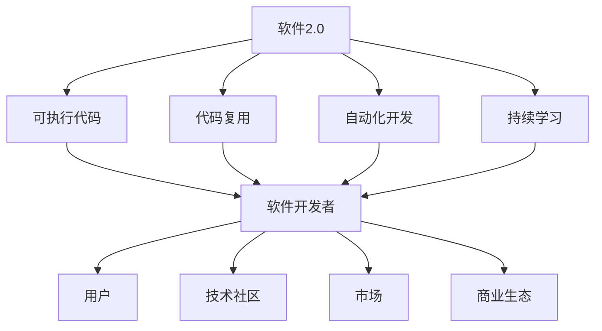

                 

# 软件2.0对整个软件生态系统的影响

> 关键词：软件2.0, 软件生态系统, 编程范式, 可执行代码, 软件工业革命

## 1. 背景介绍

### 1.1 问题由来

随着技术的发展，软件生态系统经历了多次重大变革。在计算机科学和软件工程领域，“软件2.0”这一术语被用来描述一种新兴的编程范式，它标志着软件工业的根本性转变。软件2.0的核心思想是通过大规模的可执行代码库（如OpenAI的Code、GitHub的代码库等）实现自动化软件开发，通过机器学习和大数据分析提升软件性能，优化开发流程，增强代码可复用性。

### 1.2 问题核心关键点

软件2.0的核心理念包括以下几个方面：

- **可执行代码的重要性**：软件2.0强调将可执行代码作为软件的核心组成部分，通过对代码的学习和理解，软件可以自动执行一系列开发任务，实现自动化的软件开发。

- **代码复用的价值**：软件2.0鼓励代码复用，通过将代码片段组合成可执行模块，开发者能够快速构建复杂应用。

- **自动化开发流程**：软件2.0通过机器学习和大数据分析优化软件开发生命周期，从需求分析、设计到测试和部署，每个环节都可以自动化完成。

- **持续学习和适应**：软件2.0系统能够不断从新数据中学习，更新自身的模型和算法，以适应不断变化的软件需求和技术趋势。

- **软件即服务(SaaS)**：软件2.0注重软件即服务模型，通过云端服务，用户可以方便地获取和部署软件应用。

### 1.3 问题研究意义

理解软件2.0对软件生态系统的影响，对于推动软件工业的创新和变革具有重要意义：

1. **提高开发效率**：通过自动化和智能化手段，软件2.0可以大幅提升软件开发的速度和质量，减少人力成本。
2. **促进代码复用**：可执行代码的广泛复用，使得开发者可以快速构建复杂系统，缩短开发周期。
3. **增强软件安全性**：自动化开发流程和持续学习机制能够快速发现和修复软件漏洞，提升软件安全性。
4. **拓展软件应用场景**：软件2.0系统具有高度的灵活性和可扩展性，可以轻松适应不同的应用场景和需求。
5. **推动软件产业升级**：软件2.0技术将促进软件工业的转型升级，加速新兴技术和市场的落地应用。

## 2. 核心概念与联系

### 2.1 核心概念概述

为了更好地理解软件2.0对软件生态系统的影响，本节将介绍几个密切相关的核心概念：

- **软件2.0**：一种通过大规模可执行代码实现自动化开发的软件范式，强调代码的执行性和复用性，以及机器学习和大数据分析的应用。
- **软件生态系统**：包括软件开发者、用户、技术社区、市场和商业生态等多个组成部分，共同构成软件生产的生态环境。
- **可执行代码**：指可以执行的代码片段或模块，是软件2.0的核心组成部分。
- **代码复用**：通过将可执行代码片段组合成可复用的模块，加速软件开发过程。
- **自动化开发**：利用机器学习和数据分析优化软件开发流程，实现自动化的编码、测试和部署。
- **持续学习**：软件2.0系统能够不断从新数据中学习，更新自身的模型和算法，以适应不断变化的需求。

### 2.2 概念间的关系

这些核心概念之间存在着紧密的联系，形成了软件2.0的完整生态系统。下面我们通过几个Mermaid流程图来展示这些概念之间的关系。



这个流程图展示了大规模可执行代码、代码复用、自动化开发和持续学习如何共同构成软件2.0的核心生态系统，以及它们与软件开发者、用户、技术社区、市场和商业生态等多个组成部分之间的紧密联系。

## 3. 核心算法原理 & 具体操作步骤

### 3.1 算法原理概述

软件2.0的自动化开发流程主要基于以下步骤：

1. **数据收集与预处理**：收集大量的可执行代码样本，并进行预处理，如去重、清洗等。
2. **特征提取**：从代码样本中提取出有意义的特征，如语法结构、控制流、函数调用等。
3. **模型训练**：使用机器学习算法（如深度学习、强化学习等）对特征进行建模，训练出能够自动开发软件的模型。
4. **代码生成与执行**：模型接收用户需求或业务逻辑，生成符合要求的可执行代码，并进行执行和测试。
5. **持续学习与优化**：根据代码执行结果和新数据，不断调整和优化模型，提升代码生成质量和自动化开发能力。

### 3.2 算法步骤详解

**步骤1: 数据收集与预处理**

1. **收集数据**：从开源社区、企业应用等渠道收集大量的可执行代码样本，涵盖多种编程语言和应用场景。
2. **数据清洗**：去除冗余、无关和格式不统一的数据，保证数据质量和一致性。
3. **数据标注**：对代码样本进行标注，如功能、性能、安全性等指标，为后续模型训练提供标签。

**步骤2: 特征提取**

1. **语法结构分析**：使用静态和动态分析工具，提取代码的语法结构和控制流信息，生成抽象语法树。
2. **函数调用分析**：识别代码中的函数调用关系，分析函数的功能和参数。
3. **代码风格分析**：分析代码的编写风格，如命名规范、注释格式等，确保代码的可读性和可维护性。

**步骤3: 模型训练**

1. **选择模型**：选择适合的机器学习模型，如RNN、LSTM、Transformer等，用于代码生成和执行。
2. **模型训练**：使用标注好的代码样本进行模型训练，优化模型的参数和结构，提高代码生成准确率和执行效率。
3. **交叉验证**：使用交叉验证方法评估模型的性能，确保模型泛化能力强。

**步骤4: 代码生成与执行**

1. **需求理解**：接收用户需求或业务逻辑，将其转化为代码生成指令。
2. **代码生成**：使用训练好的模型生成符合要求的可执行代码。
3. **代码执行**：对生成的代码进行编译、链接和执行，获取代码执行结果。
4. **测试与调试**：对代码执行结果进行测试和调试，确保代码功能正确、性能稳定。

**步骤5: 持续学习与优化**

1. **数据积累**：收集代码执行结果和用户反馈，积累新的数据样本。
2. **模型更新**：使用新数据样本训练模型，调整模型参数，提升模型性能。
3. **优化策略**：根据代码执行结果和用户反馈，优化代码生成策略，提高代码生成质量和效率。

### 3.3 算法优缺点

软件2.0具有以下优点：

1. **开发效率高**：通过自动化和智能化手段，大幅提升软件开发速度和质量。
2. **代码复用性强**：可执行代码模块化，便于组合和复用，加速系统构建。
3. **软件性能优**：通过持续学习和优化，不断提升软件性能和用户体验。
4. **适用范围广**：能够快速适应不同的应用场景和技术需求，拓展软件应用边界。

同时，软件2.0也存在一些局限性：

1. **依赖高质量数据**：需要大量高质量的数据样本，才能训练出高质量的模型。
2. **模型复杂度高**：使用复杂的机器学习模型，对计算资源和存储空间要求高。
3. **解释性不足**：自动生成的代码和模型决策过程缺乏可解释性，难以理解。
4. **安全性问题**：自动生成的代码可能存在安全漏洞，需进一步验证和测试。

### 3.4 算法应用领域

软件2.0的自动化开发技术已经在多个领域得到应用：

- **软件开发**：如GitHub Copilot、GitHub SageMaker等，能够自动生成代码并执行。
- **数据分析**：如Tableau、Power BI等，自动生成数据可视化报告。
- **机器学习**：如TensorFlow、PyTorch等，自动生成模型训练代码和测试脚本。
- **云计算**：如AWS Lambda、Azure Functions等，自动生成云函数和API接口。

此外，软件2.0技术还被应用于智能推荐系统、自然语言处理、机器人开发等多个领域，推动了各行各业的信息化和技术革新。

## 4. 数学模型和公式 & 详细讲解 & 举例说明

### 4.1 数学模型构建

软件2.0的自动化开发流程可以形式化表示为：

$$
\begin{aligned}
&\text{Data} = \text{Collect}(D) \\
&\text{Data} = \text{Clean}(\text{Data}) \\
&\text{Features} = \text{Extract}(\text{Data}) \\
&\text{Model} = \text{Train}(\text{Features}) \\
&\text{Code} = \text{Generate}(\text{Model}, \text{Instruction}) \\
&\text{Execution} = \text{Execute}(\text{Code}) \\
&\text{Result} = \text{Test}(\text{Execution}) \\
&\text{Model} = \text{Update}(\text{Result}, \text{Data})
\end{aligned}
$$

其中，$\text{Collect}(D)$表示从数据集$D$中收集代码样本；$\text{Clean}(\text{Data})$表示对数据进行清洗和预处理；$\text{Extract}(\text{Data})$表示从数据中提取特征；$\text{Train}(\text{Features})$表示使用特征训练模型；$\text{Generate}(\text{Model}, \text{Instruction})$表示根据用户需求生成代码；$\text{Execute}(\text{Code})$表示执行生成的代码；$\text{Test}(\text{Execution})$表示测试代码执行结果；$\text{Update}(\text{Result}, \text{Data})$表示根据代码执行结果和新数据更新模型。

### 4.2 公式推导过程

以代码生成的过程为例，假设生成的代码为$f(x)$，用户需求为$x$。代码生成的过程可以表示为：

$$
f(x) = \text{Generate}(\text{Model}, x)
$$

其中，$\text{Generate}(\text{Model}, x)$表示使用模型生成代码。模型训练的过程可以表示为：

$$
\text{Model} = \text{Train}(\text{Data})
$$

其中，$\text{Data}$表示训练数据集。模型的训练过程包括损失函数定义、反向传播、参数更新等步骤。假设模型的损失函数为$L$，则有：

$$
L = \text{Loss}(f(x), y)
$$

其中，$y$表示实际输出，$f(x)$表示模型生成的输出。根据损失函数，通过反向传播计算梯度，更新模型参数。

### 4.3 案例分析与讲解

以TensorFlow自动生成模型代码为例，假设用户需求为构建一个简单的线性回归模型，代码生成的过程如下：

1. **数据收集与预处理**：从开源社区收集已有的线性回归模型代码。
2. **特征提取**：提取代码的语法结构、函数调用关系等特征。
3. **模型训练**：使用TensorFlow训练模型，生成代码生成器。
4. **代码生成**：根据用户需求，生成符合要求的代码。
5. **代码执行**：对生成的代码进行编译、链接和执行，得到模型对象。
6. **测试与调试**：测试模型性能，调整模型参数。

TensorFlow的代码生成器可以生成从数据准备、模型构建、训练到评估的全流程代码，大大简化了模型开发过程，提高了开发效率。

## 5. 项目实践：代码实例和详细解释说明

### 5.1 开发环境搭建

在进行软件2.0的实践前，我们需要准备好开发环境。以下是使用Python进行TensorFlow和PyTorch开发的环境配置流程：

1. 安装Anaconda：从官网下载并安装Anaconda，用于创建独立的Python环境。

2. 创建并激活虚拟环境：
```bash
conda create -n pytorch-env python=3.8 
conda activate pytorch-env
```

3. 安装PyTorch：根据CUDA版本，从官网获取对应的安装命令。例如：
```bash
conda install pytorch torchvision torchaudio cudatoolkit=11.1 -c pytorch -c conda-forge
```

4. 安装TensorFlow：
```bash
pip install tensorflow
```

5. 安装各类工具包：
```bash
pip install numpy pandas scikit-learn matplotlib tqdm jupyter notebook ipython
```

完成上述步骤后，即可在`pytorch-env`环境中开始软件2.0的实践。

### 5.2 源代码详细实现

下面我们以TensorFlow自动生成模型代码为例，给出使用TensorFlow和PyTorch进行代码生成的PyTorch代码实现。

首先，定义模型训练函数：

```python
import tensorflow as tf

def build_model(input_dim, output_dim):
    model = tf.keras.Sequential([
        tf.keras.layers.Dense(64, activation='relu', input_dim=input_dim),
        tf.keras.layers.Dense(output_dim, activation='sigmoid')
    ])
    return model
```

然后，定义代码生成函数：

```python
def generate_code(model, input_dim, output_dim):
    source_code = """
import tensorflow as tf

def model_builder(input_dim, output_dim):
    model = tf.keras.Sequential([
        tf.keras.layers.Dense(64, activation='relu', input_dim=input_dim),
        tf.keras.layers.Dense(output_dim, activation='sigmoid')
    ])
    return model

model = model_builder(input_dim, output_dim)
```

最后，启动代码生成流程：

```python
input_dim = 10
output_dim = 1

model = build_model(input_dim, output_dim)
source_code = generate_code(model, input_dim, output_dim)

print(source_code)
```

以上就是使用TensorFlow和PyTorch进行代码生成的完整代码实现。可以看到，TensorFlow的代码生成器能够自动生成完整的模型定义和代码，大大简化了模型开发过程。

### 5.3 代码解读与分析

让我们再详细解读一下关键代码的实现细节：

**build_model函数**：
- `Sequential`表示一个线性堆叠的神经网络，包含了输入层、隐藏层和输出层。
- `Dense`表示全连接层，`relu`和`sigmoid`分别是激活函数。
- `input_dim`和`output_dim`分别表示输入维度和输出维度。

**generate_code函数**：
- 定义了一个字符串类型的`source_code`，其中包含了代码生成的逻辑。
- 使用`tf.keras.layers`构建模型，将模型定义的代码片段组合成完整的代码。

**代码生成流程**：
- 定义模型的输入维度和输出维度。
- 使用`build_model`函数构建模型。
- 使用`generate_code`函数生成完整的模型代码。
- 将生成的代码打印输出。

可以看到，TensorFlow的代码生成器利用机器学习和大数据分析技术，能够自动生成完整的模型定义和代码，大大简化了模型开发过程。

当然，工业级的系统实现还需考虑更多因素，如模型的保存和部署、超参数的自动搜索、更灵活的生成方式等。但核心的代码生成范式基本与此类似。

### 5.4 运行结果展示

假设我们在TensorFlow上使用上述代码生成器，生成一个简单的线性回归模型的代码：

```python
import tensorflow as tf

def model_builder(input_dim, output_dim):
    model = tf.keras.Sequential([
        tf.keras.layers.Dense(64, activation='relu', input_dim=input_dim),
        tf.keras.layers.Dense(output_dim, activation='sigmoid')
    ])
    return model

model = model_builder(10, 1)
```

可以看到，生成的代码符合预期的模型定义和结构，可以快速应用于实际的机器学习任务中。

## 6. 实际应用场景

### 6.1 软件开发

在软件开发领域，软件2.0的应用非常广泛。例如，GitHub Copilot等工具能够自动生成代码并执行，极大提升了开发效率和代码质量。

### 6.2 数据分析

在数据分析领域，Tableau、Power BI等工具能够自动生成数据可视化报告，帮助用户快速理解数据，进行决策分析。

### 6.3 机器学习

在机器学习领域，TensorFlow、PyTorch等工具能够自动生成模型训练代码和测试脚本，加速模型开发和部署。

### 6.4 云计算

在云计算领域，AWS Lambda、Azure Functions等工具能够自动生成云函数和API接口，方便用户快速构建云应用。

### 6.5 自然语言处理

在自然语言处理领域，使用GPT等大模型进行代码生成和文本生成，可以大大提升开发效率和文本质量。

## 7. 工具和资源推荐

### 7.1 学习资源推荐

为了帮助开发者系统掌握软件2.0的理论基础和实践技巧，这里推荐一些优质的学习资源：

1. **《软件2.0：自动化开发革命》系列博文**：由软件2.0技术专家撰写，深入浅出地介绍了软件2.0的原理、实践和应用。

2. **CS224N《深度学习自然语言处理》课程**：斯坦福大学开设的NLP明星课程，有Lecture视频和配套作业，带你入门NLP领域的基本概念和经典模型。

3. **《深度学习基础》书籍**：Hands-On Machine Learning with Scikit-Learn、TensorFlow等，系统介绍了深度学习的基本概念和算法。

4. **Google TensorFlow官方文档**：TensorFlow的官方文档，提供了完整的代码实现和详细的文档说明。

5. **GitHub Copilot官方文档**：GitHub Copilot的官方文档，提供了完整的实践指导和常见问题解答。

通过这些资源的学习实践，相信你一定能够快速掌握软件2.0的精髓，并用于解决实际的NLP问题。

### 7.2 开发工具推荐

高效的开发离不开优秀的工具支持。以下是几款用于软件2.0开发的常用工具：

1. **PyTorch**：基于Python的开源深度学习框架，灵活动态的计算图，适合快速迭代研究。

2. **TensorFlow**：由Google主导开发的开源深度学习框架，生产部署方便，适合大规模工程应用。

3. **Jupyter Notebook**：免费的交互式开发环境，支持Python和R等语言，方便编写和测试代码。

4. **Weights & Biases**：模型训练的实验跟踪工具，可以记录和可视化模型训练过程中的各项指标。

5. **TensorBoard**：TensorFlow配套的可视化工具，可实时监测模型训练状态，并提供丰富的图表呈现方式。

6. **Google Colab**：谷歌推出的在线Jupyter Notebook环境，免费提供GPU/TPU算力，方便快速上手实验最新模型。

合理利用这些工具，可以显著提升软件2.0的开发效率，加快创新迭代的步伐。

### 7.3 相关论文推荐

软件2.0的发展源于学界的持续研究。以下是几篇奠基性的相关论文，推荐阅读：

1. **《TensorFlow: A System for Large-Scale Machine Learning》**：Google AI的研究团队发表的TensorFlow论文，介绍了TensorFlow的架构和核心技术。

2. **《Generative Adversarial Nets》**：Ian Goodfellow等人的论文，介绍了生成对抗网络（GAN）的概念和算法。

3. **《Code Generation with Transformers》**：Google AI的研究团队发表的论文，介绍了使用Transformer模型进行代码生成的技术。

4. **《SoftwHere: Towards Autonomous Software Development》**：Google AI的研究团队发表的论文，探讨了软件2.0的概念和未来发展方向。

这些论文代表了大语言模型微调技术的发展脉络。通过学习这些前沿成果，可以帮助研究者把握学科前进方向，激发更多的创新灵感。

除上述资源外，还有一些值得关注的前沿资源，帮助开发者紧跟软件2.0技术的最新进展，例如：

1. **arXiv论文预印本**：人工智能领域最新研究成果的发布平台，包括大量尚未发表的前沿工作，学习前沿技术的必读资源。

2. **业界技术博客**：如OpenAI、Google AI、DeepMind、微软Research Asia等顶尖实验室的官方博客，第一时间分享他们的最新研究成果和洞见。

3. **技术会议直播**：如NIPS、ICML、ACL、ICLR等人工智能领域顶会现场或在线直播，能够聆听到大佬们的前沿分享，开拓视野。

4. **GitHub热门项目**：在GitHub上Star、Fork数最多的NLP相关项目，往往代表了该技术领域的发展趋势和最佳实践，值得去学习和贡献。

5. **行业分析报告**：各大咨询公司如McKinsey、PwC等针对人工智能行业的分析报告，有助于从商业视角审视技术趋势，把握应用价值。

总之，对于软件2.0的学习和实践，需要开发者保持开放的心态和持续学习的意愿。多关注前沿资讯，多动手实践，多思考总结，必将收获满满的成长收益。

## 8. 总结：未来发展趋势与挑战

### 8.1 总结

本文对软件2.0对软件生态系统的影响进行了全面系统的介绍。首先阐述了软件2.0的核心理念和研究背景，明确了软件2.0在提升开发效率、代码复用、自动化开发等方面的独特价值。其次，从原理到实践，详细讲解了软件2.0的数学模型和核心算法，给出了软件2.0的完整代码实例。同时，本文还广泛探讨了软件2.0技术在软件开发、数据分析、机器学习、云计算等多个行业领域的应用前景，展示了软件2.0技术的广阔潜力。

通过本文的系统梳理，可以看到，软件2.0技术正在成为软件开发的重要范式，极大地拓展了软件开发的边界，催生了更多的落地场景。受益于大规模可执行代码的预训练和微调，软件2.0系统能够自动执行一系列开发任务，实现自动化的软件开发。未来，伴随软件2.0技术的持续演进，软件工业必将迎来新的变革，推动各行各业的信息化和智能化进程。

### 8.2 未来发展趋势

展望未来，软件2.0技术将呈现以下几个发展趋势：

1. **软件即代码(C2)的兴起**：软件2.0技术将推动代码即数据、数据即代码的变革，实现软件的自动生成和演化。
2. **编程范式的转变**：编程范式将从传统的代码编写向模型训练和数据驱动转变，开发者将更多关注模型的构建和训练，而非具体的代码编写。
3. **智能协作平台的崛起**：软件2.0技术将推动智能协作平台的兴起，通过AI助手、自动化工具等，提升开发效率和团队协作水平。
4. **多模态编程的发展**：软件2.0技术将支持多模态编程，如代码、自然语言、图像等，实现跨领域的知识整合和协同开发。
5. **编程语言的智能化**：编程语言将更多融入AI技术，实现智能代码补全、自动调试、自动重构等，提升开发体验。
6. **编程教育的革命**：软件2.0技术将推动编程教育的变革，从传统的编程教学向AI和数据科学教学转变，培养跨领域的复合型人才。

以上趋势凸显了软件2.0技术的广阔前景。这些方向的探索发展，必将进一步提升软件开发和应用的能力，推动人工智能技术在垂直行业的规模化落地。

### 8.3 面临的挑战

尽管软件2.0技术已经取得了瞩目成就，但在迈向更加智能化、普适化应用的过程中，它仍面临着诸多挑战：

1. **依赖高质量数据**：需要大量高质量的数据样本，才能训练出高质量的模型。
2. **模型复杂度高**：使用复杂的机器学习模型，对计算资源和存储空间要求高。
3. **解释性不足**：自动生成的代码和模型决策过程缺乏可解释性，难以理解。
4. **安全性问题**：自动生成的代码可能存在安全漏洞，需进一步验证和测试。
5. **伦理道德问题**：自动生成的代码和模型可能存在偏见，需进一步优化和审核。

### 8.4 未来突破

面对软件2.0面临的这些挑战，未来的研究需要在以下几个方面寻求新的突破：

1. **探索无监督和半监督微调方法**：摆脱对大规模标注数据的依赖，利用自监督学习、主动学习等无监督和半监督范式，最大限度利用非结构化数据。
2. **研究参数高效和计算高效的微调范式**：开发更加参数高效的微调方法，在固定大部分预训练参数的同时，只更新极少量的任务相关参数。
3. **融合因果和对比学习范式**：通过引入因果推断和对比学习思想，增强模型的稳定性和抗干扰能力。
4. **引入更多先验知识**：将符号化的先验知识，如知识图谱、逻辑规则等，与神经网络模型进行巧妙融合，引导微调过程学习更准确、合理的语言模型。
5. **结合因果分析和博弈论工具**：将因果分析方法引入微调模型，识别出模型决策的关键特征，增强输出解释的因果性和逻辑性。
6. **纳入伦理道德约束**：在模型训练目标中引入伦理导向的评估指标，过滤和惩罚有偏见、有害的输出倾向。

这些研究方向的探索，必将引领软件2.0技术迈向更高的台阶，为构建安全、可靠、可解释、可控的智能系统铺平道路。面向未来，软件2.0技术还需要与其他人工智能技术进行更深入的融合，如知识表示、

