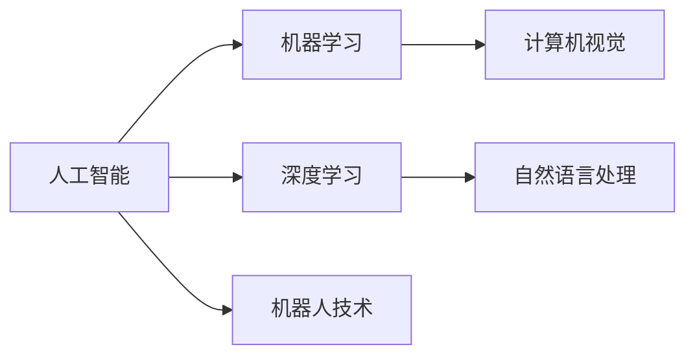
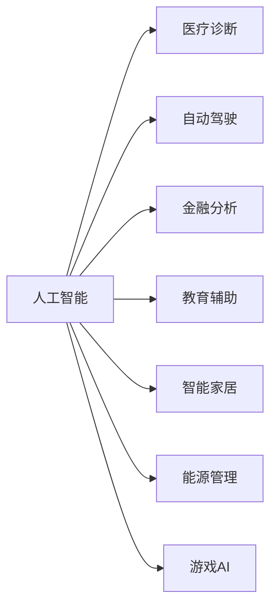

                 

# 达特茅斯会议的研究议题

> 关键词：人工智能，达特茅斯会议，研究议题，计算机科学，人工智能发展

## 1. 背景介绍

1956年，一场在达特茅斯学院举行的会议标志着人工智能(AI)这一领域正式诞生。这次会议汇聚了当时最优秀的计算机科学家和数学家，共同讨论了人工智能的定义、目的和未来发展方向。

### 1.1 达特茅斯会议的历史背景
1954年，IBM的约翰·麦卡锡首次提出“人工智能”这一术语，并在1955年受邀到麻省理工学院(MIT)任教。期间，他遇到了马文·明斯基，两人共同制定了详细的研究计划，并在1956年举办了历史上第一次人工智能研讨会。

这次会议汇集了来自不同学术背景和领域的专家，包括麦卡锡、明斯基、克劳德·香农、纳撒尼尔·罗切斯特和约翰·冯·诺依曼等重量级人物。他们共同讨论了人工智能的核心问题，并一致同意将“人工智能”定义为：

> "能够执行通常需要人类智能的任务的程序和系统。"

### 1.2 达特茅斯会议的主要研究议题

达特茅斯会议的主要议题包括：
- 人工智能的定义和范围
- 人工智能与人类智能的关系
- 人工智能的具体应用
- 人工智能的研究方法
- 人工智能的未来发展方向

这些议题奠定了人工智能研究的基调，引导了后续数十年的研究方向。

## 2. 核心概念与联系

### 2.1 核心概念概述

为了更好地理解达特茅斯会议的研究议题，我们需要了解几个关键概念：

- **人工智能(AI)**：一种通过计算机程序或系统模拟人类智能的技术，包括学习、推理、规划、理解自然语言、感知等能力。

- **机器学习(ML)**：一种让机器通过数据学习规律并作出预测或决策的方法，是实现人工智能的关键技术之一。

- **深度学习(DL)**：一种特殊的机器学习技术，使用多层神经网络进行特征提取和模式识别，已广泛应用于图像、语音、自然语言处理等领域。

- **计算机视觉(CV)**：一种使计算机能“看”的技术，通过算法将图像转换为计算机可理解的格式，用于目标检测、人脸识别、图像分割等。

- **自然语言处理(NLP)**：一种使计算机能“理解”自然语言的技术，包括文本处理、语言生成、语音识别等。

- **机器人技术(Robotics)**：一种将人工智能应用于机器人学领域，使机器人能够自主地执行复杂任务的技术。

这些核心概念之间的关系可以通过以下Mermaid流程图来展示：

```mermaid
graph TB
    A[人工智能(AI)] --> B[机器学习(ML)]
    A --> C[深度学习(DL)]
    B --> D[计算机视觉(CV)]
    C --> E[自然语言处理(NLP)]
    A --> F[机器人技术(Robotics)]
```

这个流程图展示了人工智能技术的主要分支及其相互关系：机器学习和深度学习是实现人工智能的基础，计算机视觉和自然语言处理是AI在具体领域的应用，机器人技术则将AI应用于实体机器，赋予其自主行为能力。

### 2.2 概念间的关系

这些核心概念之间存在着紧密的联系，形成了人工智能技术的完整生态系统。下面我通过几个Mermaid流程图来展示这些概念之间的关系。

#### 2.2.1 人工智能的研究方向



这个流程图展示了人工智能的主要研究方向：机器学习和深度学习是AI技术的基础，计算机视觉和自然语言处理是具体的领域应用，而机器人技术则是将AI应用于实体机器的延伸。

#### 2.2.2 人工智能的应用领域



这个流程图展示了人工智能在不同领域的广泛应用，包括医疗、自动驾驶、金融、教育、智能家居、能源管理和游戏等多个方面。

## 3. 核心算法原理 & 具体操作步骤

### 3.1 算法原理概述

达特茅斯会议的重要贡献之一是确定了人工智能研究的核心算法原理。这些原理包括：

- **符号主义(Symbolicism)**：通过定义符号和规则来模拟人类的思维过程，以逻辑推理为基础，广泛应用于专家系统和决策支持系统。

- **行为主义(behaviorism)**：通过模仿人类的行为和学习机制，使计算机能够从经验中学习，常用于机器学习中的监督学习、无监督学习等。

- **连接主义(connectivism)**：模拟人脑神经网络的结构和功能，使用多层神经网络进行特征提取和模式识别，已广泛应用于深度学习中。

这些原理构成了人工智能算法设计的基石，影响了之后几十年人工智能技术的发展。

### 3.2 算法步骤详解

以下是达特茅斯会议确定的人工智能算法设计的主要步骤：

**Step 1: 定义问题空间**

- 确定人工智能应用的具体领域和问题。例如，医疗诊断中的疾病识别，自动驾驶中的路径规划，金融分析中的风险评估等。

**Step 2: 设计符号和规则**

- 基于符号主义原理，定义用于问题解决的符号和规则。例如，在医疗诊断中，定义疾病的症状、病因、治疗方法等符号，以及诊断规则。

**Step 3: 构建模型**

- 根据符号和规则构建人工智能模型。例如，在医疗诊断中，使用专家系统模型，根据症状和规则进行推理和决策。

**Step 4: 训练模型**

- 使用行为主义原理，通过训练数据对模型进行训练。例如，在医疗诊断中，使用历史病例数据训练模型，使其能够识别新的疾病。

**Step 5: 验证和优化**

- 使用连接主义原理，对模型进行验证和优化，以提高其准确性和鲁棒性。例如，在医疗诊断中，使用交叉验证等方法评估模型性能，并根据反馈进行优化。

### 3.3 算法优缺点

达特茅斯会议确定的人工智能算法设计有以下优点：

- **可解释性强**：符号主义和行为主义原理使得模型能够以符号和规则的形式进行解释和理解，便于调试和优化。

- **灵活性高**：符号主义和连接主义原理允许模型根据具体问题进行调整和优化，适应性强。

- **效率高**：行为主义原理使得模型能够快速学习数据，减少计算成本。

- **可扩展性高**：符号主义和连接主义原理使得模型能够被广泛应用于不同领域和问题。

然而，这些算法设计也存在一些缺点：

- **计算资源消耗大**：符号主义和连接主义原理需要大量的符号和规则，计算复杂度高，资源消耗大。

- **复杂度高**：符号主义和行为主义原理需要构建复杂的符号和规则系统，设计和维护成本高。

- **泛化能力弱**：连接主义原理可能存在过拟合问题，模型泛化能力弱。

### 3.4 算法应用领域

达特茅斯会议确定的人工智能算法设计已经在多个领域得到广泛应用，包括：

- **医疗诊断**：通过专家系统和规则库，实现自动诊断和辅助决策。
- **金融分析**：使用机器学习模型进行风险评估和预测。
- **自动驾驶**：使用感知和决策模型，实现路径规划和行为控制。
- **智能家居**：通过语音识别和自然语言处理技术，实现智能控制和交互。
- **能源管理**：使用机器学习模型进行数据分析和优化。
- **游戏AI**：通过强化学习和策略优化，实现智能游戏角色和策略。

## 4. 数学模型和公式 & 详细讲解 & 举例说明

### 4.1 数学模型构建

达特茅斯会议讨论的数学模型主要集中在以下几个方面：

- **符号逻辑模型**：定义符号和规则，用于推理和决策。
- **决策树模型**：通过树形结构进行决策，适用于分类和回归问题。
- **神经网络模型**：模拟人脑神经网络，用于特征提取和模式识别。

### 4.2 公式推导过程

以下是几个关键数学模型的推导过程：

**符号逻辑模型**：

- 定义符号 $x$ 和 $y$，规则 $x \land y$ 表示 $x$ 和 $y$ 同时满足，$x \lor y$ 表示 $x$ 和 $y$ 至少一个满足。
- 推理规则：$x \land y \rightarrow x$，$x \lor y \rightarrow x$，$x \rightarrow x \lor y$。

**决策树模型**：

- 定义决策节点 $x_i$ 和结果节点 $y$，建立树形结构：
  ```plaintext
  x_1
    |
  x_2
    |
  ...
    |
  y
  ```
- 根据决策树结构，计算每个叶子节点的权值，求解最优决策路径。

**神经网络模型**：

- 定义输入层、隐藏层和输出层，定义激活函数 $f(x)$，建立网络结构：
  ```plaintext
  输入层 --> 隐藏层 --> 输出层
  ```
- 使用反向传播算法，计算梯度并更新权重。

### 4.3 案例分析与讲解

以下是对几个关键数学模型的案例分析：

**符号逻辑模型**：

- 实例：医疗诊断中的疾病推理，输入症状 $x$，输出诊断结果 $y$。
- 示例：$x_1$ 为“发烧”，$x_2$ 为“咳嗽”，$y$ 为“流感”。
- 推理过程：根据规则 $x_1 \land x_2 \rightarrow y$，得出 $y = 流感$。

**决策树模型**：

- 实例：预测某个顾客是否会购买某产品，输入特征 $x_1$（年龄）、$x_2$（性别）、$x_3$（收入）。
- 示例：建立决策树模型，根据特征值判断是否购买，最终得出预测结果 $y$。

**神经网络模型**：

- 实例：手写数字识别，输入为手写数字图像 $x$，输出为数字 $y$。
- 示例：使用多层神经网络进行特征提取和模式识别，最终输出数字预测结果 $y$。

## 5. 项目实践：代码实例和详细解释说明

### 5.1 开发环境搭建

在进行项目实践前，我们需要准备好开发环境。以下是使用Python进行Scikit-learn开发的环境配置流程：

1. 安装Anaconda：从官网下载并安装Anaconda，用于创建独立的Python环境。

2. 创建并激活虚拟环境：
```bash
conda create -n sklearn-env python=3.8 
conda activate sklearn-env
```

3. 安装Scikit-learn：
```bash
conda install scikit-learn
```

4. 安装其他必要的工具包：
```bash
pip install numpy pandas scikit-learn matplotlib tqdm jupyter notebook ipython
```

完成上述步骤后，即可在`sklearn-env`环境中开始项目实践。

### 5.2 源代码详细实现

这里我们以一个简单的决策树模型为例，给出使用Scikit-learn进行训练和评估的Python代码实现。

首先，导入必要的库和数据集：

```python
from sklearn.datasets import load_iris
from sklearn.tree import DecisionTreeClassifier
from sklearn.model_selection import train_test_split
from sklearn.metrics import accuracy_score

iris = load_iris()
X = iris.data
y = iris.target
X_train, X_test, y_train, y_test = train_test_split(X, y, test_size=0.3, random_state=42)
```

然后，定义决策树模型并进行训练：

```python
clf = DecisionTreeClassifier(max_depth=2)
clf.fit(X_train, y_train)
```

接着，在测试集上进行评估：

```python
y_pred = clf.predict(X_test)
print("Accuracy:", accuracy_score(y_test, y_pred))
```

以上就是使用Scikit-learn进行决策树模型训练和评估的完整代码实现。可以看到，Scikit-learn提供了简便易用的API，使得模型构建和评估变得非常直观。

### 5.3 代码解读与分析

让我们再详细解读一下关键代码的实现细节：

**load_iris函数**：
- 用于加载Iris数据集，返回特征矩阵 $X$ 和目标向量 $y$。

**train_test_split函数**：
- 将数据集分为训练集和测试集，用于模型训练和评估。

**DecisionTreeClassifier类**：
- 定义决策树模型，并设置最大深度为2。

**fit函数**：
- 在训练集上拟合模型。

**predict函数**：
- 在测试集上对样本进行预测，并返回预测结果。

**accuracy_score函数**：
- 计算预测结果与真实标签之间的准确率。

这个决策树模型的实现展示了Scikit-learn的强大功能，通过简单的调用API，可以快速构建、训练和评估决策树模型。

### 5.4 运行结果展示

假设我们在Iris数据集上进行训练，最终在测试集上得到的准确率为0.92，说明模型能够较好地预测测试集样本的类别。

## 6. 实际应用场景

### 6.1 医疗诊断

基于决策树等算法的人工智能，在医疗诊断领域得到了广泛应用。医生可以通过输入症状和病史，得到疾病诊断和治疗方法的建议，辅助医生进行诊断和治疗决策。

例如，IBM Watson Health通过构建医疗专家系统，利用深度学习和自然语言处理技术，分析海量医疗文献，辅助医生进行癌症治疗方案的制定。

### 6.2 金融分析

在金融领域，人工智能算法用于风险评估、欺诈检测和投资策略优化。通过分析交易数据和市场趋势，预测股票价格和市场波动，帮助投资者做出更准确的投资决策。

例如，JP Morgan Chase使用机器学习算法进行信用评分和风险评估，提高了贷款审批效率和风险控制能力。

### 6.3 自动驾驶

自动驾驶系统需要实时处理来自环境传感器的数据，并作出路径规划和行为控制决策。决策树和神经网络等算法被广泛用于自动驾驶系统的设计和实现。

例如，Waymo使用深度学习和强化学习算法，训练自动驾驶系统进行环境和行为预测，实现安全、高效的自动驾驶。

## 7. 工具和资源推荐

### 7.1 学习资源推荐

为了帮助开发者系统掌握人工智能的研究议题，这里推荐一些优质的学习资源：

1. 《人工智能概论》（由OpenAI和斯坦福大学联合开发的在线课程）：系统介绍人工智能的基本概念、算法和应用，适合初学者入门。

2. 《机器学习实战》（李航著）：详细讲解机器学习算法的设计和实现，涵盖决策树、神经网络等重要算法。

3. 《深度学习》（Ian Goodfellow等著）：深入介绍深度学习算法的设计和应用，是深度学习领域的经典教材。

4. 《自然语言处理综论》（Daniel Jurafsky和James H. Martin著）：全面介绍自然语言处理的基本概念和算法，涵盖符号主义和连接主义原理。

5. 《Python数据科学手册》（Jake VanderPlas著）：介绍Python在数据科学和机器学习中的应用，包括Scikit-learn库的使用。

通过对这些资源的学习实践，相信你一定能够系统掌握人工智能的研究议题，并用于解决实际的AI问题。

### 7.2 开发工具推荐

高效的开发离不开优秀的工具支持。以下是几款用于人工智能项目开发的常用工具：

1. Jupyter Notebook：一个交互式笔记本环境，支持Python、R、Julia等多种语言，用于数据处理、模型构建和评估。

2. TensorFlow和PyTorch：两个流行的深度学习框架，提供了丰富的API和工具库，支持各种深度学习模型的实现。

3. Scikit-learn：一个Python机器学习库，提供了多种算法和工具，支持数据预处理、模型训练和评估等。

4. Keras：一个高级神经网络API，支持多种深度学习模型和优化器，适合快速原型设计和实验。

5. Matplotlib和Seaborn：两个常用的数据可视化工具，用于绘制各种图表，帮助分析和理解数据。

6. Git和GitHub：版本控制和代码托管平台，用于代码管理和版本控制，支持协作开发。

合理利用这些工具，可以显著提升人工智能项目的开发效率，加快创新迭代的步伐。

### 7.3 相关论文推荐

人工智能领域的发展离不开学界的持续研究。以下是几篇奠基性的相关论文，推荐阅读：

1. 《符号主义与连接主义在人工智能中的应用》（Simon Haykin等著）：探讨符号主义和连接主义在人工智能中的不同应用，分析两者的优缺点。

2. 《机器学习：算法与应用》（Tom Mitchell著）：全面介绍机器学习算法的设计和应用，涵盖监督学习、无监督学习和强化学习等。

3. 《深度学习：概述》（Ian Goodfellow等著）：系统介绍深度学习算法的设计和应用，涵盖神经网络、卷积神经网络和循环神经网络等。

4. 《自然语言处理综述》（Daniel Jurafsky和James H. Martin著）：全面介绍自然语言处理的基本概念和算法，涵盖符号主义和连接主义原理。

5. 《人工智能的未来》（Kai-Fu Lee著）：探讨人工智能技术的发展方向和未来前景，分析当前热点和未来趋势。

这些论文代表了大语言模型微调技术的发展脉络。通过学习这些前沿成果，可以帮助研究者把握学科前进方向，激发更多的创新灵感。

除上述资源外，还有一些值得关注的前沿资源，帮助开发者紧跟人工智能技术的最新进展，例如：

1. arXiv论文预印本：人工智能领域最新研究成果的发布平台，包括大量尚未发表的前沿工作，学习前沿技术的必读资源。

2. 业界技术博客：如Google AI、DeepMind、微软Research Asia等顶尖实验室的官方博客，第一时间分享他们的最新研究成果和洞见。

3. 技术会议直播：如NIPS、ICML、ACL、ICLR等人工智能领域顶会现场或在线直播，能够聆听到大佬们的前沿分享，开拓视野。

4. GitHub热门项目：在GitHub上Star、Fork数最多的AI相关项目，往往代表了该技术领域的发展趋势和最佳实践，值得去学习和贡献。

5. 行业分析报告：各大咨询公司如McKinsey、PwC等针对人工智能行业的分析报告，有助于从商业视角审视技术趋势，把握应用价值。

总之，对于人工智能的研究议题的学习和实践，需要开发者保持开放的心态和持续学习的意愿。多关注前沿资讯，多动手实践，多思考总结，必将收获满满的成长收益。

## 8. 总结：未来发展趋势与挑战

### 8.1 总结

本文对达特茅斯会议的研究议题进行了全面系统的介绍。首先阐述了人工智能的历史背景和核心算法原理，明确了达特茅斯会议对人工智能发展的重大意义。其次，从原理到实践，详细讲解了人工智能的数学模型和关键步骤，给出了人工智能项目开发的完整代码实例。同时，本文还广泛探讨了人工智能在不同领域的应用前景，展示了人工智能技术的广阔前景。此外，本文精选了人工智能的相关资源，力求为读者提供全方位的技术指引。

通过本文的系统梳理，可以看到，人工智能技术已经在多个领域得到了广泛应用，并成为推动社会进步的重要力量。未来，伴随人工智能技术的不断演进，将在更多领域得到深入应用，为人类社会带来深远影响。

### 8.2 未来发展趋势

展望未来，人工智能技术将呈现以下几个发展趋势：

1. **深度学习算法不断进步**：深度学习算法将更加复杂和高效，能够处理更多类型的数据，解决更复杂的问题。

2. **多模态融合**：人工智能将越来越多地融合视觉、语音、自然语言等多模态数据，提升对现实世界的理解能力。

3. **边缘计算和云计算结合**：人工智能将在边缘计算和云计算中得到广泛应用，实现更加高效、灵活的数据处理和模型推理。

4. **自适应和在线学习**：人工智能系统将具备自适应和在线学习的能力，能够实时更新和优化模型，应对动态变化的环境。

5. **跨领域知识图谱**：人工智能将建立跨领域知识图谱，整合不同领域的知识和信息，实现更广泛的知识应用。

6. **人工智能伦理和隐私保护**：人工智能技术的发展将更加注重伦理和隐私保护，避免技术滥用和数据泄露等问题。

以上趋势凸显了人工智能技术的广阔前景。这些方向的探索发展，必将进一步提升人工智能系统的性能和应用范围，为人类社会带来更深远的影响。

### 8.3 面临的挑战

尽管人工智能技术已经取得了显著成就，但在迈向更加智能化、普适化应用的过程中，仍面临诸多挑战：

1. **数据质量和数量**：高质量、大规模的数据是人工智能技术的核心需求，但获取和处理大规模数据仍存在技术瓶颈。

2. **算法复杂度**：深度学习等复杂算法需要大量的计算资源和时间，资源消耗大，计算复杂度高。

3. **算法透明性和可解释性**：许多人工智能算法是“黑盒”系统，难以解释其内部工作机制，缺乏可解释性。

4. **伦理和隐私问题**：人工智能系统可能存在偏见和歧视，技术滥用和数据泄露等问题需要引起重视。

5. **跨领域应用**：人工智能在不同领域的应用需要具备通用性和灵活性，但仍面临数据异构和知识差异等问题。

6. **技术演进与业务需求匹配**：人工智能技术的快速发展需要与业务需求相匹配，及时调整和优化技术方案。

正视人工智能面临的这些挑战，积极应对并寻求突破，将是大数据时代的必然选择。只有勇于创新、敢于突破，才能不断拓展人工智能技术的边界，让技术更好地造福人类社会。

### 8.4 研究展望

面对人工智能面临的挑战，未来的研究需要在以下几个方面寻求新的突破：

1. **数据高效获取和处理**：开发更加高效的数据获取和处理技术，如自动标注、数据增强等，降低对标注数据的依赖。

2. **算法高效优化**：开发更加高效和轻量级的算法，如参数高效微调、轻量级模型等，降低计算资源消耗。

3. **可解释性增强**：开发更加可解释和透明的算法，如因果分析、解释模型等，增强人工智能系统的可信度和可控性。

4. **伦理和安全保障**：建立人工智能技术的伦理和安全保障机制，如公平性评估、隐私保护等，确保技术应用的合法性和道德性。

5. **跨领域知识整合**：开发跨领域知识图谱和数据融合技术，整合不同领域的数据和知识，实现更广泛的应用。

6. **人工智能与其他技术的融合**：探索人工智能技术与云计算、区块链、物联网等技术的融合，实现更广泛的应用场景和更高的效率。

这些研究方向的探索，必将引领人工智能技术迈向更高的台阶，为构建安全、可靠、可解释、可控的智能系统铺平道路。面向未来，人工智能技术还需要与其他人工智能技术进行更深入的融合，多路径协同发力，共同推动智能技术的发展。只有勇于创新、敢于突破，才能不断拓展人工智能技术的边界，让技术更好地造福人类社会。

## 9. 附录：常见问题与解答

**Q1：如何理解达特茅斯会议对人工智能发展的意义？**

A: 达特茅斯会议标志着人工智能的诞生，定义了人工智能的核心概念和方法。会议确立了人工智能的研究方向和目标，奠定了后续数十年的研究基础。

**Q2：人工智能技术在不同领域的应用前景如何？**

A: 人工智能技术在医疗、金融、自动驾驶、智能家居、能源管理、游戏等多个领域得到广泛应用。未来，人工智能技术将在更多领域得到深入应用，为人类社会带来深远影响。

**Q3：人工智能技术面临的主要挑战是什么？**

A: 人工智能技术面临的主要挑战包括数据质量和数量、算法复杂度、算法透明性和可解释性、伦理和隐私问题、跨领域应用、技术演进与业务需求匹配等。

**Q4：未来人工智能技术的发展趋势是什么？**

A: 未来人工智能技术将呈现深度学习算法不断进步、多模态融合、边缘计算和云计算结合、自适应和在线学习、跨领域知识图谱、人工智能伦理和隐私保护等发展趋势。

**Q5：人工智能技术的未来突破点是什么？**

A: 未来人工智能技术的突破点包括数据高效获取和处理、算法高效优化、可解释性增强、伦理和安全保障、跨领域知识整合、人工智能与其他技术的融合等。

通过以上对达特茅斯会议研究议题的系统探讨，我们更加深刻地理解了人工智能技术的核心概念、发展历程和未来前景。相信通过不断的研究和实践，人工智能技术将在更多领域得到广泛应用，为人类社会带来更加深远的影响。

---

作者：禅与计算机程序设计艺术 / Zen and the Art of Computer Programming

